&emsp; &emsp; Java是纯粹的面向对象的编程语言，它吸收了C++语言的特点，同时也摒弃了C++中难以理解的多继承，指针等概念。本Blog从C++为角度，主要学习总结C++与Java之间的区别，以及Java本身的基础特性。对于Java与C++的共有特性则略过。为了能够跨渠道，在不同的操作系统上运行Java程序，Java一共分为三个版本:Java SE ( 标准版 )、Java EE ( 企业版 )、 Java ME ( 微型版 )。


## 一. Java 运行机制

&emsp; &emsp; Java介于编译型语言和解释型语言之间。编译型语言(C、C++)其代码是直接编译成机器码执行，但是不同的平台(x86、ARM等)CPU的指令集不同，因此，需要编译出每一种平台的对应机器码。解释型语言( Python、Ruby )由解释器直接加载源码然后编译运行，代价是运行效率太低。而 java 是将代码编译成一种<font color=red>“**字节码**”</font>，<font color=green>
针对不同平台编写虚拟机( ***JVM*** )，不同平台的虚拟机负责加载字节码并执行，这样就实现了“一次编写，到处运行”。</font>


&emsp; &emsp; java中包括很多的开发工具，如 ***JDK*** ( *Java Development Kit* )，***JRE*** (  *Java Runtime Environment* )。其关系如下图所示：


&emsp; &emsp; ● **JDK**：支持 *Java* 程序开发的最小环境，*JDK = JVM + Java API*
&emsp; &emsp; ● **JRE** ：支持 Java 程序运行的标准环境，*JRE = JVM + Java SE API子集*

### 1.1  JVM 底层原理

&emsp; &emsp;  ***JVM*** 是 ***JRE*** 的一部分。它是一个虚构出来的虚拟机，是通过在实际的计算机上仿真模拟各种计算机功能来实现的。*JVM*有自己完善的硬件架构，如处理器、堆栈、寄存器等，还具有相应的指令系统。Java语言最重要的特点就是跨平台运行。使用 *JVM* 就是为了支持与操作系统无关，实现跨平台。*JVM* 由三个子系统构成，具体框架如下：
 &emsp; &emsp;● **类加载系统** ：负责动态加载类，在运行时(而非编译时)，当一个类初次被引用的时候，它将被加载、链接、初始化。
&emsp; &emsp; ● **执行时数据区域 ( 内存结构 )** ： 存放着类加载加载后的一些数据。
&emsp; &emsp; ● **执行引擎** ：分配给运行时数据区的字节码将由执行引擎执行，执行引擎读取字节码并逐个执行。


#### **1.1.1 类加载系统**

##### 1. 类的生命周期

&emsp; &emsp; 类的生命周期是从虚拟机将`.class`文件加载到内存开始，直到卸载出内存为止。类的生命周期分为7个阶段，如下图所示：

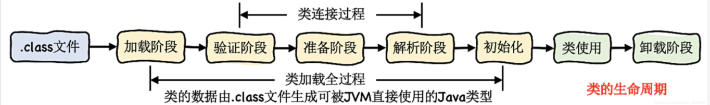

###### (1).加载阶段(类加载器)

&emsp; &emsp; JVM通过类的全限定名获取定义此类的二进制字节流 ( 这里并没有指定二进制字节流一定从 `.class` 文件中获取，也可以从其他地方获取，如从JAR获取，从网络中获取，动态代理从运行时计算生成)，并将字节流中的静态存储结构`(static)`转化为方法区的运行时数据结构，最终在内存中生成一个代表这个类的`java.lang.Class`对象，作为方法区该类的各种数据的访问入口。

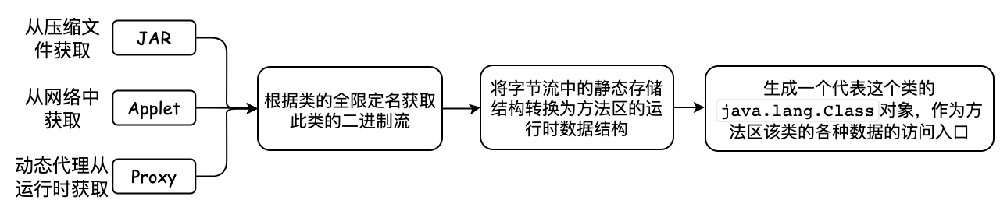

###### (2).验证阶段

&emsp; &emsp; 因为Java的 *Class* 文件并不一定要求必须从Java源码中编译得到，也可以从其他任何途径得到。如果JVM不检查输入的字节流，可能会载入错误的字节流导致系统崩溃。因此验证阶段的目的是确保 `.class`文件的字节流包含的信息符合虚拟机的要求，不会危害虚拟机自身的安全。验证阶段分为4个阶段：
&emsp; &emsp;     **① 文件格式验证**：该阶段验证字节流是否符合 `.class`文件格式的规范，保证输入的字节流可以正确的解析，并存储于方法区中，格式上符合描述一个Java类型信息的保证。通过该阶段后，字节流会进入内存的方法区中进行储存，后面的验证阶段不会再直接操作字节流信息。
 &emsp; &emsp;    **② 元数据验证( `.class` 语义分析)**：对字节码描述的信息进行语义分析 ( 数据类型校验、类校验 )，确保其描述的信息符合Java语言规范要求。(
如这个类是否有父类、这个类的父类是否继承了不允许被继承的类，是否实现了接口的所有方法等 )。
 &emsp; &emsp;    **③ 字节码验证**：通过数据流和控制流分析，确定程序语义是符合逻辑的。这个阶段对类的方法进行校验分析，保证类的方法在运行时不会做出危害虚拟机安全的事件。
 &emsp; &emsp;    **④ 符号引用验证**：符号引用校验发生在虚拟机将符号引用转化为直接引用的时候。符号引用校验对类自身以外的信息（常量池中的符号引用）的信息进行校检 (如符号引用中通过字符串描述的全限定名是否能够找到对应的类、符号引用中的类，字段，方法访问性是否可以被当前类访问 )，确保后续的解析动作能够正常执行。

###### (3).准备阶段(分配空间)

&emsp; &emsp; 准备阶段为类变量 ( 仅为 `static` 修饰的变量，不包括实例变量 ) 分配内存空间并设置数据类型**零值**，这些类变量所使用的内存都将在方法区中进行分配。而实例变量会在对象实例化时随着对象一起分配在Java堆中。

```java
假设一个类变量的定义为:  public static int value = 111;  
变量value在『准备阶段』过后的初始值为0，在『初始化阶段』后才会将数值111赋值到value变量
```

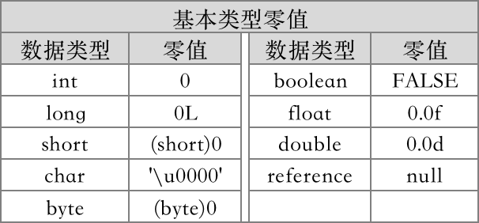

###### (4).解析阶段

&emsp; &emsp; 在解析阶段会<font color=green>**将常量池的一部分符号引用替换为直接引用的过程**。</font>调用目标的引用在编译时就确定下来了。解析动作主要针对类或接口、字段、类方法、接口方法、方法类型、方法句柄、和调用限定符7类符号引用。Java中在解析阶段可以将符号引用替换为直接引用的方法包括**类的静态方法**、**类的私有方法**、**父类方法**、**实例构造器**：
 &emsp; &emsp; ● 类的静态方法与类的类型关联，与对象无关，所以在解析阶段可以替换为直接引用；
 &emsp; &emsp; ● 类的私有方法不能被外部其他类的对象访问，不会出现多态特性，因此在解析阶段可以替换为直接引用。
 &emsp; &emsp; ● 父类的方法对于子类来说是“基准方法”，对于父类方法也不会出现多态特性，只有子类方法是多态的，因此在解析阶段可以替换为直接引用。

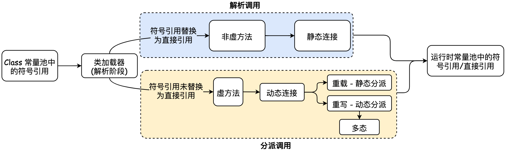

> <font color=SlateBlue>  <u>**Q1. 什么是符号引用、直接引用 ？**</u></font>
> &emsp;&emsp;  ● 符号引用是以一组符号来描述所引用的目标，符号可以是任何形式的字面量，只要使用时无歧义定位到目标即可。符号引用与虚拟机的内存布局无关，引用的目标并不一定已经加载到内存中。<font color=green>在编译的时候每个Java类都会被编译成一个`.class`文件，但在编译的时候虚拟机并不知道所引用类的地址，就用符号引用来代替，而在解析阶段就是为了把这个符号引用转化成为真正的地址的阶段。</font>
> &emsp;&emsp;  ● 直接引用是可以直接定位到目标的指针、相对偏移量或是一个能间接定位目标的句柄。直接引用是与虚拟机的内存布局相关的，同一个符号引用在不同虚拟机实例上翻译出来的直接引用不会相同。如果有了直接引用，则引用的目标一定在内存中存在。
>
> <font color=SlateBlue>  <u>**Q2. 虚方法与非虚方法 ？**</u></font>
> &emsp;&emsp;  针对在解析阶段是否会将方法的符号引用替换为直接引用，会将方法分为**虚方法**和**非虚方法**。非虚方法在类加载机制中的解析阶段就可以直接将符号引用转化为直接引用，如静态方法、私有方法、*final* 方法、实例构造器、父类方法。除此之外的其他方法称为虚方法，虚方法是实现多态特性的主要方式。每个类中都有一个虚方法表，表中存放着各个方法的实际入口。虚方法表会在类加载的链接阶段被创建并开始初始化，类的变量初始值准备完成以后，JVM会把该类的方法表也初始化完毕。

###### (5).类初始化阶段

&emsp;&emsp; 在初始化阶段会执行类定义的Java代码，本质是执行类构造器`<clinit>()` 方法的过程。在初始化阶段分为两种初始化过程：<font color=orange>类的**主动引用**、**被动引用**</font>：
 &emsp; &emsp; <font color=green>**● 主动引用**：**是指在初始化阶段，一定会对类进行初始化**。</font>有4种场景会发生类的主动引用：
 &emsp; &emsp; ① 使用new关键字实例化对象的时候；读取或设置一个类的静态字段【`getstatic`、`putstatic`、`invokestatic`操作静态字段的指令】(被`final`修饰、已经在编译期把结果放入常量池的静态字段除外)，以及调用一个类的静态方法的时候。
 &emsp; &emsp; ② 使用`java.lang.reflect`包的方法对类进行反射调用的时候。
 &emsp; &emsp; ③ 当初始化一个类的时候，如果发现其父类还没进行初始化，则必须对父类进行初始化。
 &emsp; &emsp; ④ 当虚拟机启动时，用户指定的要执行的主类（包含main方法的类），虚拟机会先初始化这个主类。
 &emsp; &emsp; ⑤ 如果一个 ***java.lang.invoke.MethodHandle*** 实例最后的解析结果是 ***REF_gegtStatic***、***REF_putStatic***、***REF_invokeStatic***
的方法句柄，且这个方法句柄对应的类没用进行过初始化，则需要先触发其初始化操作。

&emsp; &emsp; <font color=green>**● 被动引用**：**除了主动引用，其余引用类的方式都不会触发初始化，因此称为被动引用**。</font>
&emsp; &emsp; ① 对于静态字段，只有直接定义这个字段的类才会被初始化，<font color=green>**通过其子类来引用父类中定义的静态字段，只会触发其父类的初始化而不会触发子类的初始化**。</font>

```java
package test;
class Superclass{
    public static int value=10;
    static{
        System.out.println("super");
    }
}
class child extends Superclass{
    static {
        System.out.println("child");  //不会触发该类的初始化
    }
}
public class test {
    public static void main(String[] args) {
        System.out.println(child.value);  //输出super 和 10
    }
}
```

&emsp; &emsp; ② <font color=green>**通过数组定义来引用类，不会触发此类的初始化**。</font>

```java
package test;
class Superclass{
    public static int value=10;
    static{
        System.out.println("super");
    }
}
public class test {
    public static void main(String[] args){
        Superclass superclass[] = new Superclass[10];//没有任何输出,不会初始化类Superclass
    }
}
```

&emsp; &emsp; ③ <font color=green>**常量在编译阶段会存入调用类的常量池中，并没有直接引用到定义常量的类，因此不会触发定义常量的类的初始化**。</font>

```java
package test;
class Superclass{
    public static final String DEFINE_TYPE = "hello";
    static{
        System.out.println("super");
    }
}
public class test {
    public static void main(String[] args) {
        System.out.println(Superclass.DEFINE_TYPE);  //仅输出hello，Superclass没有初始化
    }
}
```

> <font color=SlateBlue>  <u>**Q1.  *static*，*final*，*static final* 对修饰字段赋值时的区别 ？**</u></font>
> &emsp; ● `static` 在准备阶段时被初始化为0或null，在初始化阶段时被赋予代码中设定的值，如果没有设定值，则仍为默认值。
> &emsp; ● `static final` 在通过Javac编译时生成常量值`Constantvalue`属性，在准备阶段时根据设定值为该字段进行赋值。该字段没有默认值，必须显式的赋值。
> &emsp; ● `final` 在运行时被初始化，一旦初始化便不可更改。
>
> <font color=SlateBlue>  <u>**Q2. 什么是`<clinit>()`方法 ？**</u></font>
> &emsp; &emsp; ● `<clinit>()`方法是有编译器自动收集类中的所有类变量的赋值动作和静态语句块 `static{}` 中的语句合并产生的，编译器收集的顺序是由语句在源文件中出现的顺序决定的，因此静态语句块只能访问到定义在静态语句块之前的变量，定义在之后的变量，在静态语句块中可以赋值，但不能访问。
>
> ```java
> public class test{
> 		static{
> 				i = 0;
> 				System.out.println(i);  //编译器会提示 "非法向前引用"
> 		}
> 		static int i = 1;
> }
> ```
>
> &emsp; &emsp;● `<clinit>()`方法不需要显式的调用父类构造器，虚拟机会在子类的`<clinit>()`方法执行之前，执行完成父类的`<clinit>()`方法，意味着父类中定义的静态语句块要优先于子类的变量赋值操作。由于 ***java.lang.Object*** 是所有子类的父类，因此虚拟机中第一个被执行的`<clinit>()` 方法的类一定是 ***java.lang.Object***。
> &emsp; &emsp;● 接口中不能使用静态语句块，但仍然会有变量的初始化操作，因此接口与类一样都会生成`<clinit>()` 方法。但执行接口的`<clinit>()`方法不需要先执行父接口的`<clinit>()`方法，只有当父接口中定义的变量被使用时，父接口才会初始化。另外，接口的实现类在初始化时也不会执行接口的`<clinit>()`方法。
> &emsp; &emsp;● 虚拟机会保证一个类的`<clinit>()`方法在多线程环境中正确的加锁，同步。多个线程同时初始化一个类时，只有一个线程可以执行这个类的`<clinit>()`方法，其他线程进入阻塞状态，直到`<clinit>()`方法执行完成。
>
> ```java
> static class LoopClass{
> static{
>   if(true){
>       System.out.println(Thread.currentThread() + " init");
>       while(true){}
>   }
> }
> }
> public static void main(String[] args) {
> Runnable runnable = new Runnable() {
>   @Override
>   public void run() {
>       System.out.println(Thread.currentThread() + " start");
>       LoopClass loopClass = new LoopClass();
>       System.out.println(Thread.currentThread().getName() + " over");
>   }
> };
> Thread thread1 = new Thread(runnable);
> Thread thread2 = new Thread(runnable);
> thread1.start();
> thread2.start();
> }
> -- Output --
> Thread[Thread-0,5,main] start
> Thread[Thread-1,5,main] start
> Thread[Thread-0,5,main] init  由于线程0初始化时进入循环，导致线程1初始化对象被阻塞
> ```

##### 2. 类加载器 *ClassLoader*

&emsp; &emsp; 在类生命周期的加载阶段，是由<font color=orange>**类加载器**</font>来完成的。<font color=red>**类加载器的作用根据一个类的全限定名读取类的二进制字节流到 JVM( 运行时数据区的方法区 ) 中，然后生成在堆区创建一个对应的`java.lang.Class对象实例`用来封装方法区中的数据**。</font>在一个程序当中，一个类可以从"任意一个地方被加载"，如：
&emsp; &emsp; ● 从本地系统直接加载，如JRE、CLASSPATH。
&emsp; &emsp; ● 通过网络中下载 `.class` 文件
&emsp; &emsp; ● 从zip，jar等归档文件中加载 `.class` 文件
&emsp; &emsp; ● 从专有数据库中提取 `.class` 文件
&emsp; &emsp; ● 将Java源文件动态编译为 `.class` 文件

&emsp; &emsp; 对于任意一个类，都需要由加载它的类加载器和这个类本身一同确立其在Java虚拟机中的唯一性。每一个类加载器，都拥有一个独立的类名称，<font color=orange> **对于任意两个类，只有这两个类是由同一个类加载器加载时，这两个类才相等**</font>，否则即使这两个类来源于同一个Class文件，被同一个虚拟机加载，只要加载的类加载器不同，那这个两个类一定不相等。除此之外，<font color=orange>类加载器具有全盘负责机制，即当一个类加载器加载一个类时，这个类所依赖的、引用的其他所有类都由这个类加载器加载，除非在程序中显式的指定另一个类加载器加载。</font>><font color=green>JVM 中包含四种类型的类加载器，每个类加载器代表不同的**信任级别**，最可信的级别是 Java 核心API类，**每个类加载器都只能加载自己所绑定目录下的资源**</font>。从 JVM 的角度看，扩展类加载器 ( *Extension* )和应用程序类加载器 ( *Application* )相比启动类加载器 ( *Bootstrap* ) 属于其他类加载器，由Java语言实现，独立存在于虚拟机外部，并且全部继承抽象类 `java.lang.ClassLoader`。
&emsp; &emsp; ● ( ***Bootstrap*** ) 启动类/引导类加载器：*Bootstrap* 类加载器是由C++代码实现，是虚拟机的一部分，它负责将 `JAVA_HOME/lib`下面的核心类库或 `-Xbootclasspath` 选项指定的 jar 包加载到虚拟机内存中。*Bootstrap* 类加载器由 JVM 本地实现，因此开发者无法直接获取到 *Bootstrap* 类加载器的引用。
&emsp; &emsp; ● ( ***Extension*** ) 扩展类加载器 ：*Extension* 类加载器由 *ExtClassLoader* `(sun.misc.Launcher$ExtClassLoader)`实现，负责将 `JAVA_HOME/lib/ext` 或者由系统变量 `-Djava.ext.dir` 指定位置中的类库加载到内存中，开发者可以直接使用标准扩展类加载器。
&emsp; &emsp; ● ( ***Application/System*** ) 应用程序类/系统类加载器：*Application* 类加载器由 *AppClassLoader* `(sun.misc.Launcher$AppClassLoader)`实现，负责加载用户类路径上所指定的类库，如果程序中没有自定义类加载器，则该加载器是程序中默认的类加载器。 
&emsp; &emsp; ● ( ***User*** ) 自定义类加载器：***User*** 类加载器是根据自身需要自定义的 `ClassLoader`。

> <font color=SlateBlue>  <u>**Q1. 如果所有的类都使用一个类加载器来加载，会出现什么问题呢 ？**</u></font>
> &emsp; &emsp; ● 健壮性和功能性：JVM可以从不同的地方去加载class，比如文件系统，web，FTP等，这就要求JVM屏蔽底层的加载逻辑，只需要提供一个*classloard()* 的接口就行了，客户端就可以加载类但是却不用管类加载器到底是怎么实现的。
> &emsp; &emsp; ● 安全性：JVM得保证自有类不遭到破坏。假如我们自己编写一个类`java.util.Object`，它的实现有一定的危险性或者隐藏的bug。而Java自带的核心类里面也有`java.util.Object`，如果JVM启动的时候先行加载的是我们自己编写的`java.util.Object`，那么就有可能出现安全问题。
>
> <font color=SlateBlue>  <u>**Q2. 类加载的时机 ？**</u></font>
> &emsp; &emsp; ● 创建类的实例时，如 *new* 一个对象;
> &emsp; &emsp; ● 访问某个类或接口的静态变量，或者对该静态变量赋值时会触发类加载。但如果静态变量是 ***final*** 类型，且在编译时可以确定变量值，则Java编译器会在编译时将变量出现的地方替换成它的值，程序使用该静态变量时，也不会导致该类的初始化，就不会触发类加载。反之如果在编译时不能确定变量值，如果通过该类来访问它的静态变量，则会导致该类被初始化。
> &emsp; &emsp; ● 调用类的静态方法;
> &emsp; &emsp; ● 反射获取某个类时，如 `Class.forName("com.demo.load")`
> &emsp; &emsp; ● 初始化一个类的子类，会首先初始化子类的父类，会触发父类的加载;
> &emsp; &emsp; ● JVM启动时标明的启动类，即文件名和类名相同的那个类;

##### 3. 类的加载机制

###### (1). 双亲委派模型

&emsp; &emsp; 双亲委派模型是对各种加载器制定的加载的规范，越基础的类由越上层的加载器进行加载，解决了各个类加载器的基础类统一问题，JVM 在加载类时默认采用<font color=red>**双亲委派模型**</font>，双亲委派模型要求除了顶层的启动类加载器外，其他的类加载器都要有自己的"父类加载器"。双亲委派模型的类加载流程如下：
&emsp; &emsp; ● **向上委派**：如果一个类加载器收到类加载请求，首先不会自己去加载这个类，而是将加载请求委派给父类加载器，若父类加载器缓存中存在该类，则返回。若没有则继续向上委派，直到启动类加载器。因此所有的加载请求最终都应该传送到启动类加载器中。
&emsp; &emsp; ● **向下查找**：当启动类加载器也不存在该类时，会从上到下依次查找类加载路径是否存在该类，若存在则加载该类，并返回。若不存在，则继续向下查找，直到发起加载请求的类加载器为止。


&emsp; &emsp; JVM 并不是在启动时就把所有的`.class`文件都加载一遍，而是程序在运行过程中用到了这个类才去加载。除了启动类加载器外，其他所有类加载器都需要继承抽象类`ClassLoader`。

```java
public abstract class ClassLoader {
    private final ClassLoader parent; //每个类加载器都有个父加载器
    public Class<?> loadClass(String name) {
        Class<?> c = findLoadedClass(name);  //查找一下这个类是不是已经加载过了
        if( c == null ){
          if (parent != null) {
              c = parent.loadClass(name);         //向上委派:如果没有加载过,先委派给父加载器去加载，注意这是个递归调用
          }else {
              c = findBootstrapClassOrNull(name); // 如果父加载器为空，查找Bootstrap加载器是不是加载过了
          }
        }
        if (c == null) {
            c = findClass(name);    //向下查找:如果父加载器没加载成功，调用自己的findClass去加载
        }
        return c；
    }
    
    protected Class<?> findClass(String name){
       //1. 根据传入的类名name，到在特定目录下去寻找类文件，把.class文件读入内存
          ...
       //2. 调用defineClass将字节数组转成Class对象
       return defineClass(buf, off, len)；
    }
    
    // 将字节码数组解析成一个Class对象，用native方法实现
    protected final Class<?> defineClass(byte[] b, int off, int len){
       ...
    }
}
```

> <font color=SlateBlue>  <u>**Q1. 双亲委派机制的作用及优点 ？**</u></font>
> &emsp; &emsp;  ① 为了保证Java系统核心类的安全，对于Java核心库的类的加载工作由引导类加载器来统一完成，<font color=green>保证 Java应用所使用的都是同一个版本的 Java核心库的类，避免用户对核心类重写，使Java核心类出现混乱。</font>如用户重写了`Java.lang.Object`类，在类加载时，双亲委派机制会从`Bootstrap`类加载器开始加载`Object`类，从而不会加载用户重写的核心类。避免Java核心API中的类被随意替换。
> &emsp; &emsp; ② <font color=green>双亲委派机制避免类的重复加载，当父类加载器已经加载了该类时，在向上委派阶段即可返回该类，子类加载器就不用再加载。
> </font>

###### (2). 打破双亲委派机制

&emsp; &emsp; 双亲委派机制保证了类加载时的安全性，但双亲委派也有两个弊端：**① 不能向下委派**；**② 不能不委派**。因此为了解决这两个弊端，就会打破双亲委派机制。打破双亲委派机制有两种方式：
&emsp; &emsp;  **① 线程上下文加载器**：双亲委派解决了各个类加载器的基础类的统一问题，基础类总是作为被用户代码调用的API。但如果基础类又要调用回用户的代码，则双亲委派机制不能满足这样的场景。( 如: JNDI服务，JNDI的目的就是对资源进行集中管理和查找，它需要调用由独立厂商实现并部署在应用程序的ClassPath下的JNDI接口提供者的代码 )。<font color=red>为了解决不能向下委派的问题，引入了**线程上下文类加载器** ( *Thread Context ClassLoader* )</font>，类加载器可以通过 *java.lang.Thread*类的 `setContextClassLoader()` 方法进行设置。线程的创建者提供了上下文 *ClassLoader*，在线程中运行的代码可以通过该类加载器来加载类与资源。如果创建线程时未设置上下文类加载器，将会从父线程 ( `parent = currentThread()` ) 中获取，如果在应用程序的全局范围内都没有设置过，就默认是应用程序类加载器 ( *Application classLoader* )。
&emsp; &emsp;  **线程上下文加载器的使用场景：**
&emsp; &emsp; ●  **当高层提供了统一接口让低层去实现，同时又要是在高层加载 (或实例化) 低层的类时，必须通过线程上下文类加载器来找到并加载该底层的类**。如Java SPI接口。常见的 SPI 有 JDBC、JCE、JNDI、JAXP 和 JBI 等。SPI 的接口由 Java 核心库来提供，而这些 SPI 的实现代码则是作为 Java 应用所依赖的 jar 包被包含进类路径 *CLASSPATH* 里。SPI接口中的代码需要加载具体的实现类，但SPI的接口是Java核心库的一部分，是由启动类加载器 ( *Bootstrap Classloader* )来加载的，SPI的实现类是由系统类加载器( *AppClassLoader* )来加载的。依照双亲委派模型，*Bootstrap Classloader* 无法委派 *AppClassLoader* 来加载类。线程上下文类加载器破坏了“双亲委派模型”，可以在执行线程中抛弃双亲委派加载链模式，使程序可以逆向使用类加载器。
&emsp; &emsp; ●  **当使用本类托管类加载，然而加载本类的 *ClassLoader* 未知时，为了隔离不同的调用者，可以取调用者各自的线程上下文类加载器代为托管。**

```java
1. 线程上下文加载器
public class Thread implements Runnable {
    /* The context ClassLoader for this thread */
       private ClassLoader contextClassLoader;
       //设置线程上下文加载器
       public void setContextClassLoader(ClassLoader cl) {
           SecurityManager sm = System.getSecurityManager();
           if (sm != null) {
               sm.checkPermission(new RuntimePermission("setContextClassLoader"));
           }
           contextClassLoader = cl;
       }
    
       // 父ClassLoader可以使用当前线程Thread.currentThread().getContextLoader()所指定的classLoader加载的类
       public ClassLoader getContextClassLoader() {
           if (contextClassLoader == null)
               return null;
           SecurityManager sm = System.getSecurityManager();
           if (sm != null) {
               ClassLoader.checkClassLoaderPermission(contextClassLoader,Reflection.getCallerClass());
           }
           return contextClassLoader;
       }
    }

2. 线程上下文加载器在使用时一般都用下面的经典结构:获取-使用-还原
  //获取:获取当前线程的线程上下文类加载器并保存到方法栈,然后将外部传递的类加载器设置为当前线程上下文类加载器
  ClassLoader targetClassLoader = null;  //外部参数
  ClassLoader classLoader = Thread.currentThread().getContextClassLoader(); 
  try {
      //设置线程上下文类加载器为自定义的加载器
      Thread.currentThread.setContextClassLoader(targetClassLoader);
      myMethod(); //使用:利用新设置的类加载器，执行自定义的方法，
      //myMethod里面调用了Thread.currentThread().getContextClassLoader()，用外面设置的加载器（myClassLoader）去完成自定义事情。
  } finally {
      //还原:还原线程上下文类加载器原始的类加载器
      Thread.currentThread().setContextClassLoader(classLoader);
  }
```

&emsp; &emsp;  **② 自定义ClassLoader，重写loadClass方法**：双亲委派机制会将加载请求委派给父类加载器，如果需要自定义类加载器，只需要继承 *classLoader* 重写`findClass()` 方法就可以实现自定义 *ClassLoader*。

```java
 //测试自定义加载器
public class MyClassLoader extends ClassLoader {
		@Override
    protected Class<?> findClass(String name) {
        String myPath = "file:///Users/xxx/Desktop/" + name.replace(".","/") + ".class";
        System.out.println(myPath);
        byte[] cLassBytes = null;
        Path path = null;
        try {
            path = Paths.get(new URI(myPath));
            cLassBytes = Files.readAllBytes(path);
        } catch (IOException | URISyntaxException e) {
            e.printStackTrace();
        }
        Class clazz = defineClass(name, cLassBytes, 0, cLassBytes.length);
        return clazz;
    }
}
public class MainClass {
    public static void main(String[] args) throws ClassNotFoundException {
        MyClassLoader loader = new MyClassLoader();
        Class<?> aClass = loader.loadClass("cn.demo.MyTest");
        try {
            Object obj = aClass.newInstance();
            Method method = aClass.getMethod("show");
            method.invoke(obj);
        } catch (Exception e) {
            e.printStackTrace();
        }
    }
}
```

#### 1.1.2 虚拟机执行引擎

&emsp; &emsp; 虚拟机执行引擎 ( *Execution Engine* )是虚拟机的核心组成部分。线程通过执行引擎对方法进行调用，对变量进行存储运算，最终得到正确的计算结果。执行引擎包括解释器、及时编译器、垃圾回收器。执行引擎的任务就是将字节码指令解释/编译为对应平台上的本地机器指令，并计算得到结果，因此执行引擎输入的是字节码文件，输出的是执行结果。

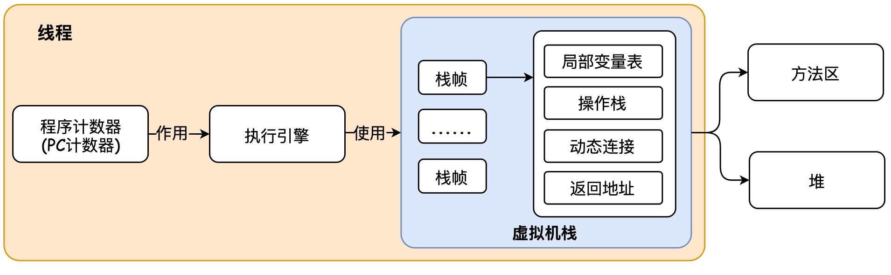

##### 1. 运行时栈帧结构 - 程序运行时的数据存储

&emsp; &emsp; 栈帧是用于支持虚拟机进行<font color=green>**方法调用**和**方法执行**</font>的数据结构，每**个栈帧存储了方法的<font color=green>局部变量表，操作数栈，动态连接和方法返回地址</font>等信息**，在编译程序代码的时候，栈帧需要多大的局部变量和操作数栈都已经确定了，因此**一个栈帧需要分配多少内存，不会受到程序运行期变量数据的影响，仅仅取决于具体的虚拟机实现**。**每个方法从调用开始到执行完成的过程，都对应一个栈帧在虚拟机栈中从入栈到出栈的过程**。
&emsp; &emsp;对于执行引擎，在活动线程中，只有位于栈顶的当前栈帧是有效的，执行引擎运行的所有字节码指令只针对当前栈帧进行操作。栈帧的结构如下图所示：

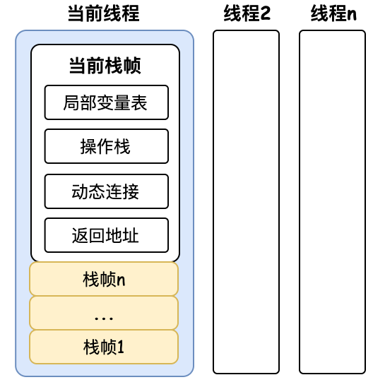

###### (1). 局部变量表 - 存储变量

&emsp; &emsp; 局部变量表是一组变量值存储空间，用于存放方法参数和方法内定义的局部变量 ( *boolean、byte、char、short、int、float、reference、returnAddress* 8种数据类型 )，是线程的私有数据，不存在线程安全问题。局部变量表中的变量**作用域是当前调用的函数**。函数调用结束后，随着函数栈帧的销毁。局部变量表也会随之销毁，释放空间。局部变量表的容量以变量槽 *Slot* 为最小单位，32位以内的类型只占用一个 *Slot* ( 包括 *returnAddress* 类型 )，64位的类型 ( *long* 和 double )占两个 *Slot*。<font color=green>JVM 会为局部变量表中的每一个 *Slot*
分配一个访问索引，通过这个索引即可成功访问到局部变量中指定的局部变量值，如果访问局部变量中一个64位的局部变量值时，只需要使用前一个索引值即可。如果当前栈是由构造函数或实例方法创建的，则局部变量表中第0位索引的 *Slot* 默认用于传递方法所属对象实例的引用，在方法中可以通过 ***this*** 关键字访问到这个隐含的参数。</font>


###### (2). 操作数栈 - 存储数据运算结果

&emsp; &emsp; 操作数栈是一个后入先出 ( FIFO ) 的栈，操作数栈主要作用是**保存计算过程中间结果，同时作为计算过程中变量临时的存储空间**。操作数栈的每一个元素可以是任意的Java数据类型，但操作数栈中元素的数据类型必须与字节码指令的序列严格匹配，保证不会出现像 long + float 情况出现。操作数栈在方法执行的时候，根据字节码指令，往栈中写入数据或提取数据，即入栈 ( push ) / 出栈 ( pop )，如执行复制、交换、求和等。**如果被调用的方法带有返回值的话，其返回值将会被压入当前栈帧的操作数栈中，并更新PC寄存器中下一条需要执行的字节码指令。**

###### (3). 动态连接(链接) - 找到正确的方法

&emsp; &emsp; 如果被调用的方法无法在编译期确定下来，只能够在程序运行期将调用方法的符号引用转换为直接引用，由于这种引用转换过程中具备动态性，因此也被称之为动态链接。动态链接对应着接口回调，多态动态绑定等在Java源文件被编译到字节码文件中时，所有**变量**和**方法引用**都作为**符号引用**保存在 *class* 文件的常量池。<font color=red>**动态链接就是把符号引用转为调用方法的直接引用的过程*</font>。每个栈帧都包含一个**指向运行时常量池中该栈帧所属方法的引用**，这个引用是为了支持方法调用过程中的动态连接。

###### (4). 方法返回地址 - 返回计算结果

&emsp; &emsp;  **方法返回的过程就是当前栈帧出栈的过程**，因此在方法的返回分为三个过程：  <font color=green>**① 恢复方法调用者的局部变量表和操作数栈；② 将返回值压入方法调用者栈帧的操作数栈中； ③调整PC计数器的值，指向方法调用指令后面的一条指令**</font>。当一个方法开始执行时，只要两种方式可以退出方法：
&emsp; &emsp; ① 正常完成出口 ( *return* )：执行引擎遇到任意一个方法返回的字节码指令，并将返回值传递给上层方法调用者。
&emsp; &emsp; ② 异常完成出口 ( *Exception* )：在方法的执行过程中遇到了异常，并且这个异常没有在方法中得到处理，这时是不会给上层的方法调用者返回任何值。
&emsp; &emsp; 无论哪种方法退出方式，在方法退出后，都会回到方法被调用的位置。方法常退出时，方法调用者的PC计数器的值可以作为返回地址，该地址会在栈帧中保存，而异常退出时返回地址是通过异常处理器表来确定，栈帧中不会保存相关信息。

##### 2. 方法调用 - 确定调用方法的版本

&emsp; &emsp; 方法调用并等于方法的执行，方法调用的唯一作用就是确定被调用方法的版本 ( 即调用哪个方法 )，并包括方法的具体运行过程。由于 *Class* 文件在编译过程中不包含链接的过程，一切方法在 *Class* 文件中存储的都是符号引用，而不是方法实际执行时内存的入口地址，因此 Java 方法的调用需要在类加载期间或运行期间才能目标方法的直接引用。

###### (1). 分派调用

&emsp; &emsp; 分派调用分成两类: **静态分派和动态分派**。<font color=red>重载属于静态分派、方法覆盖 (重写) 属于动态分派。</font>
&emsp; &emsp; ●  **静态分派 - 重载**：静态分派是指所有依赖静态类型来定位方法执行版本的分派动作。静态分派的典型应用是方法重载: 当方法重载时，使用哪个重载方法版本，完全取决于传入参数的数量和数据类型。对于JVM来说，在重载时是通过参数的静态类型而不是实际类型作为判断依据的，变量的静态类型在编译器是已知的，因此在编译阶段，Java 编译器会根据参数的静态类型来决定使用哪个重载方法版本。

```java
public class Main {
    static abstract class Human{ }
    static class Man extends Human{ }
    static class Woman extends Human{ }

    public void sayHelllo(Human human){
        System.out.println("Hello human");
    }
    public void sayHello(Man man){
        System.out.println("Hello man");
    }
    public void sayHello(Woman woman){
        System.out.println("Hello woman");
    }
    public static void main(String[] args) {
        Human man = new Man();	    //此时man对象的静态类型是Human，实际类型是Man
        Human woman = new Woman();	//此时woman对象的静态类型是Human，实际类型是Woman

        Main main = new Main();
        main.sayHelllo((Man)man);
        main.sayHelllo((Woman)woman);
    }
}
-- Output --
Hello human
Hello human
```

&emsp; &emsp; ●  <font color=red>**动态分派 - 重写与多态**</font>：动态分配是指在运行时确定对象的实际类型。动态分派是由 JVM 指令 ***invokevirtual*** 在运行时进行多态查找实现的，***invokevirtual*** 指令在运行期确定对象接收者的实际类型，并把运行时常量池中的类方法符号引用解析为直接引用。方法重写的过程如下：
 &emsp; &emsp; ① 找到操作数栈栈顶的第一个元素所执行对象的实际类型，记为类型C；
 &emsp; &emsp; ② 如果类型C中找到与运行池常量池中描述符和简单方法名称都相同的方法，则对方法进行访问权限校验( *public/private/protected* )，如果方法访问权限校验不通过，则返回*java.lang.IllegalAccessError* 异常。
 &emsp; &emsp; ③ 如果类型C中没有找到对应的方法，则按照继承关系从下往上依次对类型C的父类进行搜索和权限校验，如果没有找到对应的方法，则抛出 *java.lang.AbstractMethodError* 异常。
&emsp; &emsp; 在面向对象的编程中，会很频繁的使用到动态分派，如果在每次动态分派的过程中都要重新在类的方法元数据中搜索合适的目标的话就可能影响到执行引擎。为了提高性能，JVM采用在<font color=red>**
类的方法区建立一个虚方法表( *Virtual Method Table* )**</font>来实现。<font color=green>
每个类中都有虚方法表，表中存放着各个方法的实际入口，如果某个方法在子类中没有重写，则子类的虚方法表的地址入口和父类是相同的，都指向父类方法的入口。如果子类重写了该方法，则子类的虚方法表的地址将会指向子类方法实现版本的入口地址。</font>虚方法表一般在类加载的链接阶段进行初始化，准备了类变量的初始值后，虚拟机会把该类的方法表也初始化完毕。


```java
public class Main {
    static abstract class Human{
        abstract public void sayHello();
    }
    static class Man extends Human{
        @Override
        public void sayHello() {
            System.out.println("Man say hello");
        }
    }
    static class Woman extends Human{
        @Override
        public void sayHello() {
            System.out.println("Woman say hello");
        }
    }
    public static void main(String[] args) {
        Human man = new Man();			//在运行时根据实际类型，指向运行时常量池的Man类的符号引用
        Human woman = new Woman();	//在运行时根据实际类型，指向运行时常量池的Woman类的符号引用
        man.sayHello();
        woman.sayHello();
    }
}
-- Output --
Man say hello
Woman say hello
```

#### 1.1.3 Java 内存结构与模型规范

##### 1. *Java* 内存区域

&emsp; &emsp; Java 虚拟机将执行程序过程的内存划分为若干个不同的区域，每个区域有着各自不同的创建和销毁时机。

&emsp; &emsp; ● **程序计数器 - *PC Registers*** ：当前线程所执行字节码的信号指示器，分支、循环、跳转、异常处理、线程恢复等基础功能都需要依赖这个计数器来完成。<font color=green>
由于Java虚拟机的多线程是通过线程轮流切换、分配处理器执行时间的方式来实现的，在任何一个确定的时刻，一个处理器(对于多核处理器而言是一个内核)
都只会执行一条线程中的指令。因此，为了线程切换后能恢复到正确的执行位置，每条线程都需要有一个独立的程序计数器，各条线程之间计数器互不影响，独立存储 (线程的私有内存)</font>。<font color=orange>**
如果线程正在执行的是一个 Java 方法，这个计数器记录的是正在执行的虚拟机字节码指令的地址；如果正在执行的是本地( *Native* )方法，这个计数器值则应为空**。</font>

&emsp; &emsp; ● **虚拟机栈 - *Stack Area*** : 虚拟机栈又称为 *Java* 栈。虚拟机栈与线程紧密相关，<font color=green>每创建一个线程就会创建一个 *Java*
栈，是线程私有的，其生命周期与线程生命周期相同。线程中的每个方法被调用时都会创建一个栈帧( *Stack Frame* )，用于存储方法中的**局部变量表、操作数栈、动态链接、方法出口**等信息</font>。*Java*
栈是一个<font color=orange>**后入先出**</font>的数据结构，线程运行过程中，<font color=green>只有一个栈帧是处于活跃状态的，称为"当前活动帧栈"，当前活动帧栈始终是虚拟机栈的**
栈顶元素**</font>。

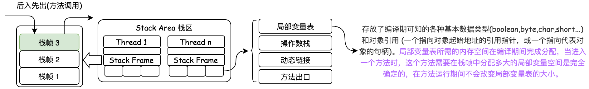

&emsp; &emsp; ● **本地方法栈 - *Native Method Area*** : 本地方法栈主要用于虚拟机的本地方法 ( *Native* )，*Navtive* 方法是 java 通过 *JNI* 直接调用本地 C/C++ 库，作用是与操作系统和外部环境交互。当线程调用 *java* 方法时，虚拟机会创建一个栈帧并压入 *java* 虚拟机栈。当它调用的是 *Native* 方法时， *java* 虚拟机栈不会压入新的栈帧，而会向本地方法栈压如一个新的栈帧，虚拟机只是简单地动态连接本地方法栈并直接调用指定的 *Native* 方法。

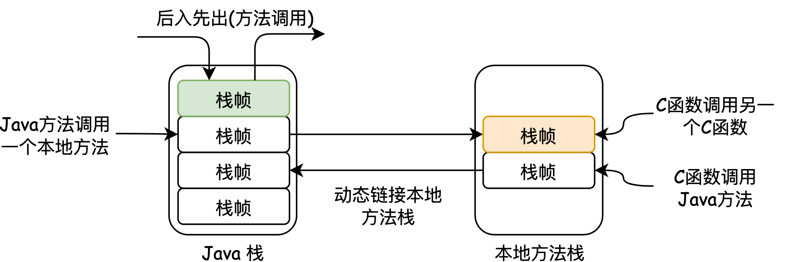

&emsp; &emsp; ● **Java 堆 - *Heap*** : Java 堆是虚拟机中内存最大的一部分，是所有线程共享的一块内存区域，此内存区域的唯一目的是<font color=red>**存放对象实例**</font>。Java 堆是垃圾收集器管理的主要区域。Java 堆处于物理上不连续的内存空间中，只需保证逻辑连续即可。Java 堆内存从不同的角度有不同的划分：
 &emsp; &emsp;&emsp; ① 从内存回收的角度：Java堆分为新生代和老年代。
 &emsp; &emsp;&emsp; ② 从内存分配的角度：Java 堆分为多个线程私有的分配缓存区 ( *TLAB* )

&emsp; &emsp; ● **方法区 - *Method Area / Not-Heap*** : 方法区也是各个线程共享的内存区域，此内存区域主要用于存储以下信息：
 &emsp; &emsp;&emsp; ① 对每个加载的类型 ( 类*class*、接口*interface*、枚举*enum*、注解*annotation*)，虚拟机会在方法区中存储以下类型信息：类型的**完整有效名称 (全名=包名.类名)**、类型**直接父类**的完整有效名称、类型的修饰符( *public*、*private*、*protected* )、类型**直接接口**的有序列表、类型的常量池、域( *Field* )信息、方法( *Method* ) 信息。
 &emsp; &emsp;&emsp; ② ***static*** 变量：八种基本数据类型( *byte*、*short*、*int*、*long*、*float*、*double*、*char*、*boolean* )的静态变量会在方法区开辟空间，并将对应的值存储在方法方法区。<font color=green>对于引用类型的静态变量，如果未用 *new* 关键字为引用类型的静态变量分配对象，如: `static Object obj` ，
那么对象的引用会存储在方法区中，并为其指定默认值 *null*。如果用 *new* 关键字为引用类型的静态变量分配对象，如: `static Person person = new Person()`
，那么对象的引用会存储在方法区中，并且该对象在堆中的地址也会存储在方法区中</font> <font color=red>(此时静态变量只存储了对象的堆地址，而对象本身仍在堆内存中)</font>。
 &emsp; &emsp;&emsp;③ 即时编译器编译后的代码等数据。
&emsp; &emsp;    <font color=red>④ **运行时常量池 - *Runtime Constant Pool***</font> :运行时常量池是方法区中的一部分，用于存放编译期间生成的各种<font color=green>**字面量**</font>和<font color=green>**符号引用**</font> (通过一组符号描述，准确定位到需要访问的目标)，这些内容在类加载后存放到方法区的运行时常量池中。

> <font color=SlateBlue>  <u>**Q1. 为什么需要常量池 ？**</u></font>
> &emsp; &emsp; 一个 Java 源文件中的类、接口，编译后会产生一个字节码文件，而 Java 中的字节码文件需要其他的数据支撑 (操作数和方法)，通常这种数据很大，不能直接存放到字节码里面。所以把对这些数据的引用存放到常量池，在需要使用的时候，通过动态链接将符号引用转换为直接引用。
> <font color=SlateBlue>  <u>**Q2. Java 常量池的区别 ？**</u></font>
> &emsp;&emsp; 在 Java 的内存分配中有三种常量池: <font color=green>字符串常量池、*class* 文件常量池、运行时常量池</font>。
> &emsp; &emsp; ① 字符串常量池: 字符串常量池的内容是在堆中生成的字符串对象实例的引用值 (不是具体的对象实例)。字符串常量池是方法区的一部分。
> &emsp; &emsp; ② *class* 文件常量池：*class* 文件常量池用于存放编译期间生成的各种<font color=green>字面量 (文本字符串、*final* 常量值等)</font>和<font color=green>符号引用 (一组用于描述所引用目标的符号)</font>。一般包括三类常量：<font color=green>类和接口的全限定名、字段的名称和描述符、方法的名称和描述符</font>。
> &emsp; &emsp; ③ 运行时常量池：当类加载到内存中后，jvm就会将 *class* 常量池中的内容存放到运行时常量池中。
>
> 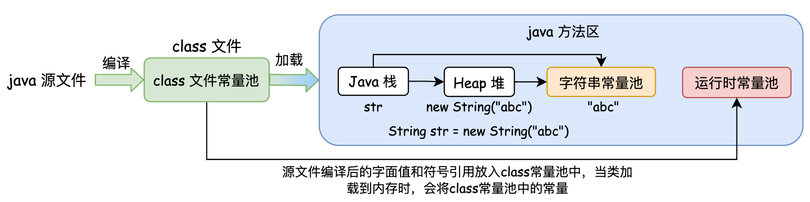
>
> <font color=SlateBlue>  <u>**Q3. 方法区的 *class* 文件常量池 与 *class* 文件信息有什么关系 ？**</u></font>
> &emsp;&emsp; 方法区里存放着类的版本，字段，方法，接口和常量池。常量池里存储着字面量和符号引用 (符号引用包括: 类和接口的全限定名、字段名称和属性、方法名称和属性)。  

&emsp; &emsp; ● **直接内存/堆外内存 - *Direct Memory*** :
&emsp;&emsp; 直接内存不属于 JVM 定义的内存区域。直接内存被 ***NIO*** ( *New input/output* )使用，***NIO*** 是一种基于通道 ( *channel* ) 和缓冲区 ( *buffer* ) 的I/O方式，它可以使用 *Native* 函数库直接分配堆外内存，然后通过堆上的*DirectByteBuffer* 对象对这块内存进行引用和操作。<font color=green>直接内存的大小不受
java堆大小的限制，也不受到 jvm 进程内存大小的限制。它只受限于本机总内存 ( *RAM* 及 *SWAP* 区或者分页文件) 大小以及处理器寻址空间的限制</font>。

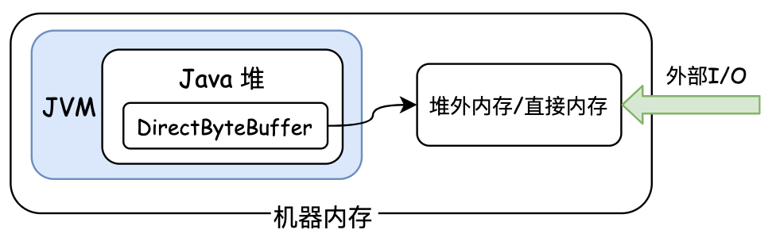

##### 2. *Java* 内存模型

&emsp; &emsp; Java 内存模型 ( *Java Memory Model, JMM* ) 是 JVM 规范定义的，用来屏蔽 Java 程序在各种不同的硬件和操作系统对内存的访问的差异，从而实现了Java 在各种平台下都能达到一致的内存访问效果。Java 内存模型规定了程序中各个变量 ( 包括实例字段、静态字段、构成数组对象的元素，不包括局部变量与方法参数 ) 的访问规则，即 JVM 应该如何存储和访问计算机内存 ( *RAM* )。Java 的内存模型分为两部分：**JVM 内存存储规范**，**JMM与线程规范**。

> <font color=SlateBlue>  <u>**Q1. 为什么要有 java 内存模型 (物理机的并发问题) ？**</u></font>
> &emsp;&emsp;**① 内存I/O与CPU运行速率匹配问题**
> &emsp; &emsp; 由于计算机的存储设备I/O速度远远低于CPU处理器的运算速度，为了提高CPU处理器的效率，减少I/O的等待时间，在CPU与内存之间，存在一层与运算速度相当的高速缓存( *Cache* )。CPU的数据运算直接与Cache交互，解决了内存I/O与CPU运算之间的数据矛盾。
> &emsp;&emsp;**② 缓存一致性问题**
> &emsp; &emsp;  虽然高速缓存 Cache解决了速率匹配问题。但是，在多CPU处理器系统中，每个处理器都有自己的 *Cache*，而每个 *Cache* 都共享同一主内存，当多个处理器的运算任务都涉及同一块主内存区域时，可能会导致各个 *Cache* 的缓存数据不一致，出现**缓存一致性**问题。为了解决这个问题，处理器访问内存时，需要遵守内存存储规范，即内存读写协议。
> &emsp;&emsp;**③ 代码乱序执行优化问题**
> &emsp; &emsp;  为了使得CPU内部的运算单元能被充分利用，CPU可能会对代码进行乱序执行 ( *Out-Of-Order Execution* ) 优化，CPU会在计算之后将乱序执行的结果重组，保证该结果与顺序执行的结果是一致的，但并不保证程序中各个语句计算的先后顺序与代码中的顺序一致。乱序执行技术是CPU为提高运算速度而做出违背代码原有顺序的优化，在多核环境下， 如果存在一个计算任务依赖另一个计算任务的中间结果，那么其顺序性并不能靠代码的先后顺序来保证。

###### (1). 主内存与工作内存

&emsp; &emsp; Java 内存模型规定了所有的变量都存储在虚拟机内存当中的**主内存**，每条线程还有自己的**工作内存**。线程的工作内存中保存了该线程使用到的变量的主内存副本拷贝 ( 仅拷贝线程访问到的变量 )，线程对变量的所有操作 ( 读取、赋值等 ) 都必须在工作内存中进行，而不能直接读写主内存中的变量。不同的线程之间也无法直接访问对方工作内存中的变量，线程间变量值的传递均需要通过主内存完成。

###### (2). 内存间的交互操作

&emsp; &emsp; Java 内存模型定义了8种操作来描述一个变量在主内存和工作内存的交互过程。<font color=red>**每一个操作都是原子的，不可再分的。**</font>
&emsp; &emsp; ● ***lock*** (锁定)：作用于主内存的变量，把一个变量标识为一个线程独占的状态。
&emsp; &emsp; ● ***unlock*** (解锁)：作用于主内存的变量，把一个锁定状态的变量释放出来，释放后可以被其他线程锁定。
&emsp; &emsp; ● ***read*** (读取)：作用于主内存的变量，把一个变量的值从主内存复制到线程的工作内存中。 
&emsp; &emsp; ● ***load*** (载入)：作用于工作内存的变量，把 *read* 操作得到的变量放入工作内存的变量副本中。
&emsp; &emsp; ● ***use*** (使用)：作用于工作内存的变量，把工作内存中的变量值传递给执行引擎，每当虚拟机遇到一个需要使用此变量的指令时便执行这个操作。
&emsp; &emsp; ● ***assign*** (赋值)：作用于工作内存的变量，把从执行引擎接收的值赋值给工作内存中的变量，每当虚拟机遇到一个给变量赋值的指令时便执行这个操作。
&emsp; &emsp; ● ***store*** (存储)：作用于工作内存的变量，把工作内存中的变量的值传递到主内存中。 
&emsp; &emsp; ● ***write*** (写入)：作用与主内存的变量，把 *store* 操作得到的变量放入主内存的变量中。

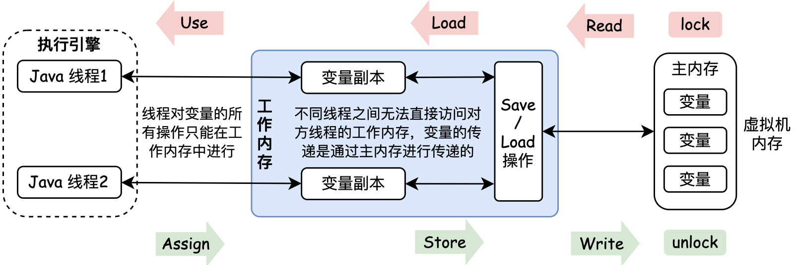

&emsp;&emsp; Java 内存模型8种操作的规则如下： 
&emsp; &emsp; ① 不允许一个变量从主内存读取了，但无法写入工作内存，或者从工作内存赋值了不能写回主内存，即 *read* 和 *load*、*store*和 *write* 操作不能单独出现。
&emsp; &emsp; ② 变量在工作内存中改变之后，必须把变化同步回主内存中，不允许一个线程丢弃其最近的 *assign* 操作。 
&emsp; &emsp; ③ 不允许一个线程没有发生任何 *assign*操作，把数据从线程的工作内存同步到主内存当中。 
&emsp; &emsp; ④ 对一个变量实施 *use*，store操作之前，必须先经过了 *assign* 和 *load* 操作。 
&emsp; &emsp; ⑤ 一个变量在同一个时刻只允许一条线程对其进行 *lock* 操作，但 *lock* 操作可以被同一条线程重复执行多次，多次执行 *lock* 后。只有执行相同次数的 unlock 操作，变量才会被解锁。
&emsp; &emsp; ⑥ 如果对一个变量执行 *lock* 操作，将会清除工作内存中此变量的值，在线程执行引擎使用这个变量前，需要重新执行 *load* 或 *assign* 操作初始化变量的值。 
&emsp; &emsp; ⑦ 如果一个变量没有被 *lock* 操作锁定，则就不允许对该变量执行 *unlock* 操作，也不允许 unlock 一个被其他线程锁住的变量。
&emsp; &emsp; ⑧ 对一个变量执行 *unlock* 操作之前，必须先把此变量同步会主内存中。

###### (3). Java 内存模型线程并发三大特性

&emsp; &emsp; Java 内存模型在线程并发过程中存在三大特性：<font color=red>**原子性、可见性、有序性**</font>。 这个三大特性仅在多线程并发时会体现，如果是单个线程是不会体现这三个体现的。

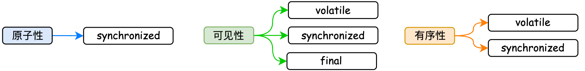

&emsp; &emsp; **① 原子性:** 指一个操作或多个操作要么不执行，要么全部执行成功，执行过程中不能被任何操作打断。在Java 内存模型中，***read、load、assign、use、store、write***
是内存模型保证的原子性变量操作，如果需要更大场景的原子性操作，则需要 ***synchronized*** 同步块来保证。
&emsp; &emsp; **② 可见性:**指当多个线程访问同一个变量时，一个线程修改了该变量的值，其他线程能够立刻看到修改后的值。在Java中，存在三个关键字能够保证可见性：<font color=green>***volatile***、***synchronized***
、***final***</font>。
&emsp; &emsp; ● ***volatile*** 类型实现内存可见性是通过 *store* 和 *load* 指令完成的。对 *volatile*变量执行写操作时，会在写操作后加入一条 *store* 指令，强迫线程将最新的值刷新到主内存中。而在读操作时，会加入一条 *load* 指令，强迫从主内存中读入变量的值。
&emsp; &emsp; ● ***synchronized***同步块中变量发生修改时，变量执行 ***unlock*** 操作之前，会将此变量同步会主内存中。 
&emsp; &emsp; ● ***final*** 类型的变量在构造器完成初始化后，且构造器没有把 *this* 引用传递除去，由于 *this* 逃逸 ( *this* 逃逸是指在构造函数返回之前其他线程就持有该对象的引用，其他线程调用尚未构造完全的对象的方法可能引发错误 )，导致其他线程中就能看见 ***final*** 类型的变量值。

```java
public class FinalTest{
   final int i;
   static final Test obj;
   public FinalTest(){
   		i = 1;  
   	  //如果这条指令和上一条发生重排序，则其他线程就可以通过obj访问到未初始化得到final域，会导致错误
      obj = this; 
}
```

&emsp; &emsp; **③ 有序性:**如果在即程序执行的顺序按照代码的先后顺序执行。通常情况下，CPU为了提高代码运行效率，会对指令进行重排序，不保证程序中各个语句的执行先后顺序同代码中的顺序一致，但是它会保证程序最终执行结果和代码顺序执行的结果是一致的 ( 重排序会遵守数据依赖规则 )，指令重排序不会影响单个线程的执行，但是会影响到线程并发执行的正确性，所以如果从本线程内观察，所有的操作都是有序的，如果在一个线程中观察另一个线程，所有操作都是无序的。

> <font color=SlateBlue>  <u>**Q1. *synchronized* 与 *volatile* 的区别 ？**</u></font>
> &emsp;&emsp; ● *synchronized* 可以保证内存可见性与操作的原子性，而 *volatile* 仅能够保证内存可见性。
> &emsp;&emsp; ● *volatile* 不需要加锁，不会阻塞线程。*synchronized* 为了防止多个线程同时执行一段代码，需要进行加锁操作，会阻塞线程，影响程序的执行效率。
> &emsp;&emsp; ● *volatile* 变量会禁止重排序，而 *synchronized* 不会禁止重排序。
> &emsp;&emsp; ● *volatile* 是变量修饰符，仅能用于变量，而 *synchronized* 可用于类方法或代码块的修饰符。

###### (4). Java 并发的先行发生原则 ( 有序性规范 )

&emsp;&emsp;先行发生原则是 Java 内存模型并发的有序性规范，此原则是判断数据是否存在竞争，线程是否安全的主要依据，通过此原则可以解决并发环境下两个操作之间的冲突问题，提供顺序性保障。<font color=green>如果一段代码在线程并发过程中，以下原则均不满足，同时也没有定义 *synchronized* 同步块，则这段代码是线程不安全的。</font>
&emsp; &emsp; **① 程序次序规则：**在一个线程内，按照程序代码的控制流顺序，写在前面的操作先行发生于后面的操作。
&emsp; &emsp; **② 管程锁定规则：**一个 unlock 操作先行发生于后面对同一个锁的lock 操作。 
&emsp; &emsp; **③ *volatile* 变量规则：**对一个 volatile 变量的写操作先行发生于后面对该变量的读操作。
&emsp; &emsp; **④ 线程启动规则：**Thread 对象的 start() 方法先行发生于此线程的每一个操作。
&emsp; &emsp; **⑤ 线程终止规则：**线程的所有操作都先行发生于此线程的终止检测。
&emsp; &emsp; **⑥ 线程中断规则：**线程的 interrupt() 方法调用先行发生于被中断线程中检测中断事件发生的操作。
&emsp; &emsp; **⑦ 对象终结规则：**一个对象的初始化完成先行发生于该对象的 finalize()方法。
&emsp; &emsp; **⑧ 传递性：**如果操作A先发生于操作B，操作B先发生于操作C，则操作A先发生于操作C。

#### 1.1.4 Java 对象创建

##### <font color=Sienna>**1. *Java* 对象的创建过程**</font>

&emsp; &emsp; 当虚拟机收到 *new* 指令时，首先检查这个指令对应的参数能否在运行时常量池中定位到一个类的符号引用，如果存在符号引用，则检查符号引用代表的类是否被加载、解析、初始化。如果没有被加载，则执行类加载过程，如果已经加载，则虚拟机为新对象从 *java*
堆中分配内存，并将分配的内存空间初始化为0。内存分配完成后，虚拟机将对象的基本信息存放在对象头 ( *Object Header* ) 中。 最后调用 *\<init\>* 方法根据构造函数对对象进行初始化。


> <font color=SlateBlue>  <u>**Q1. 对象被频繁创建时，是如何解决内存并发创建问题的 ？**</u></font>
> &emsp;&emsp;在内存空间中，堆上的指针指向当前未分配的内存空间。当内存分配时，修改该指针指向的位置。当对象创建频繁时，会出现并发的向内存空间申请内存的情况，可能会导致当前堆空间正在给对象A分配内存，指针未来得及修改，对象B又同时使用原来的指针来分配内存，出现线程安全问题。解决这个问题有以下两个方案：
>   &emsp; <font color=red> ① 对分配内存空间的动作进行同步处理，采用**CAS + 失败重试方式**保证更新操作的原子性。</font>
> &emsp;&emsp;<font color=red> ② 把内存分配的分配按照线程划分在不同的空间中进行，即**每个线程在 java 堆中预先分配一小块内存，称为本地线程分配缓冲 ( *TLAB* )。当  *TLAB* 用完并分配新的 *TLAB* 时，才进行同步锁定**。 </font>

##### <font color=Sienna>**2. *Java* 对象的内存布局**</font>

&emsp; &emsp; 在虚拟机中，对象在内存的布局分为三个区域：**对象头( *Header* )，实例数据( *Instance Data* ) 和 对齐填充 ( *Padding* )**，其结构与内容如下图所示:

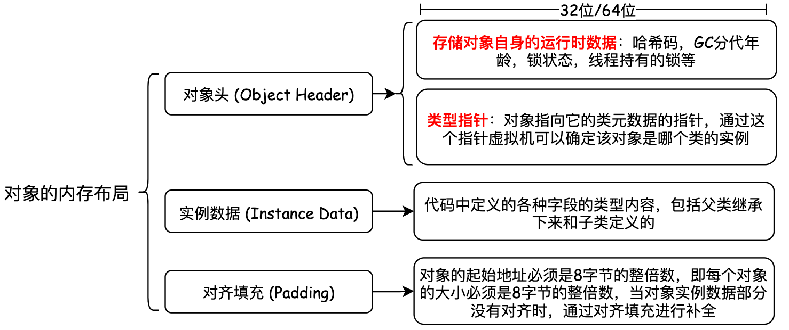

###### (1). 对象头 *Object Header*

&emsp; &emsp; JVM 的对象头信息分为两部分：
&emsp; &emsp; ● ***Mark Word*** : 用于存储对象自身的运行时数据** (在32位/64位 JVM中分别对应 32/64 *bit* )。对象头信息相对与对象自身定义的数据信息是毫无关联的，其所占用的内存空间对于对象来说属于额外存储成本。为了提高 JVM 的内存空间利用率，*Mark Word* 被设计成一个非固定的数据结构以便在更小的空间中存储更多信息。


&emsp; &emsp; ● ***Klass Pointer :***用于存储指向方法区对象类型数据 (类元数据) 的指针。虚拟机通过这个指针来确定这个对象是哪个类的实例。

##### <font color=Sienna>**3. *Java* 对象的访问定位**</font>

&emsp; &emsp; 当对象创建完成后，就是使用对象阶段。在 Java环境中，基本类型数据存放在 *Stack* 中，存放的是数据，当产生对象时，只把对象的 *reference* 存放在 *Stack* 中，用于指向某个对象，对象本身存放在 *Heap* 中。Java 程序会通过栈上的引用数据 ( *reference* ) 来操作堆上的具体对象。对象的访问方式有两种：<font color=red>**① 使用句柄**；**②直接指针**</font>
&emsp; &emsp; ① **使用句柄方式**：如果使用句柄访问时，Java堆中将会划分出一块内存作为句柄池，引用( *reference* )中存储的是对象的句柄地址，在句柄中包含了对象实例数据 (属性值结构体) 与类型数据(类信息、方法类型信息)各自的具体地址信息。<font color=green>使用句柄访问的好处是句柄中储存的是稳定的对象地址，当对象被移动时候，只需要更新句柄中的对象实例部分的值即可，句柄本身不用被移动修改。</font>


&emsp; &emsp; ② **使用直接指针访问**：使用直接指针访问方式时，*reference* 中直接储存对象在 *Heap* 中的内存地址，但对应的类型数据访问地址需要在实例中存储。使用直接指针方式访问相比句柄方式少了一次指针定位时间的开销，但当对象被移动时 (如进行 GC 后的内存重新排列)，对象的 *reference* 也需要同步更新。


> <font color=SlateBlue> <u>**Q1. 什么是句柄 ？**</u></font>
> &emsp;&emsp; 在 java 中句柄分为两种：**对象句柄**、**jvm对象访问句柄 (即 java对象的访问定位)**。
> &emsp; &emsp; **① 对象句柄**：对象句柄作为对象的身份id，用于区分不同的对象、同类中不同的实例。<font color=green>句柄不代表对象的内存地址，即使没有对象，句柄也是可以单独存在的。</font>如创建一个对象 `Car car = new Car();`，其中 `Car car` 称为对象句柄，用来指向`Car`对象的对象引用。
>
> 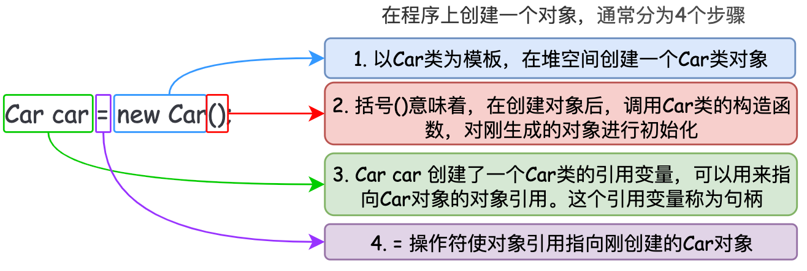
>
> &emsp; &emsp;  **② 对象访问句柄：**对象访问句柄指 java 对象的访问定位，分为句柄访问和直接指针访问两种方式。

##### <font color=Sienna>**4. *Java* 对象的内存分配策略**</font>

&emsp; &emsp; ① 新生对象优先在新生代的 Eden区进行内存分配，若 *Eden* 区没有足够空间进行分配时，虚拟机会发起一次新生代的 *Minor GC*。
&emsp; &emsp; ② 若创建的对象是需要大量连续内存空间的 java 对象 (如: 很长的字符串、数组)，则大对象的内存直接分配在老年代，避免大对象在新生代的 *Eden*区和 *Survivor*区之间发生大量的内存复制。
&emsp; &emsp; ③ 长期存活的对象将进入老年代。每个新生对象都有一个"年龄计数器"，对象在 *Eden* 区出生，在经过第一次 *Minor GC* 后仍然存活，并被 *SurvivorTo* 区接收后，"年龄 = 1"。其后，在 *Survivor* 区每经过一次 *Minor GC* 其"年龄 + 1"，当"年龄 = 15岁 ( *MaxenuringThreashold*  )"时，对象进入老年代。
&emsp; &emsp; ④ 动态对象年龄判定，虚拟机并不是一直要求对象的年龄到达 *MaxenuringThreashold* 才能进入老年代，如果在 *Survivor*区中，相同年龄的所有对象大小的总和大于 *Survivor* 区空间的一半时，年龄大于等于该年龄的对象可以直接进入老年代，无需等到 *MaxenuringThreashold* 限制的年龄。

#### 1.1.5 Java 对象回收 - GC

&emsp; &emsp; 由于程序计数器、虚拟机栈、本地方法栈都是随线程而生，随线程而灭，栈中的每个栈帧分配多少内存是类结构确定下来时都是已知的，这些区域在方法结束或线程结束时内存会一起被回收释放。因此内存回收考虑的是 **java堆与方法区区域的内存**。


##### 1. 如何判断Java对象是否存活

&emsp; &emsp; Java 堆中存放着所有的对象实例，在回收对象实例之前就需要判断哪些实例还存活，哪些实例已经死去。常用判断对象存活的算法包括：引用计数算法、可达性分析算法 
&emsp; &emsp;  **① 引用计数算法：** <font color=green>
给对象中添加一个引用计数器，当有一个地方引用该对象时，计数器加1，当引用失效时，计数器减1。当该对象的引用计数器为0时，说明对象没有被任何引用指向，可以认定是”垃圾”对象。</font>虽然引用计数算法实现简单，效率高。但<font color=red>**引用计数算法不能解决循环依赖问题**，一旦出现循环引用的情况，计数器始终 >1，出现对象不能回收</font>。


> <font color=SlateBlue> <u>**Q1. 为什么会产生循环引用的情况 ？**</u></font>
>
> ```java
> public static void main(String[] args) {
>  GcObject obj1 = new GcObject(); //Step1
>  GcObject obj 2 = new GcObject();//Step2
>  obj1.instance = obj2; //Step3
>  obj2.instance = obj1; //Step4
>  obj1 = null; //Step5
>  obj2 = null; //Step6
> }
> 
> 当采用引用计数算法时：
> Step1: GcObject实例1被obj1引用,所以它的引用数+1,当前引用数为1
> Step2: GcObject实例2被obj2引用,所以它的引用数+1,当前引用数为1
> Step3: obj1的instance属性指向obj2,而obj2指向GcObject实例2,故GcObject实例2引用+1,为2
> Step4: obj2的instance属性指向obj1,而obj1指向GcObject实例1,故GcObject实例1引用+1,为2
> Step5: obj1不再指向GcOjbect实例1,其引用计数减1,结果为1,此时引用计数不为0，无法被系统回收。
> Step6: obj2不再指向GcOjbect实例2,其引用计数减1,结果为1,此时引用计数不为0，无法被系统回收。
> ```
>
> 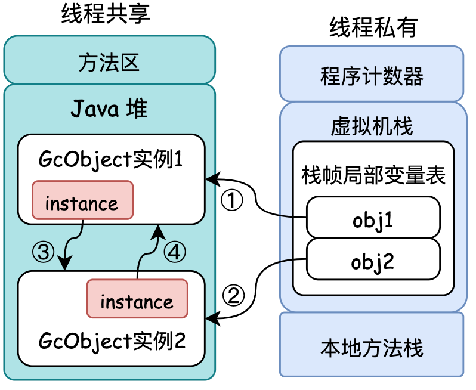

&emsp; &emsp;  **② 可达性分析算法：** <font color=red>通过选定 ***GC Roots*** 对象作为起始点，从起始点开始向下搜索，搜索所走过的路径称为**引用链** ( *ReferenceChain* )，当一个对象到 *GC Roots* 没有任何引用链相连时，则称这个对象不可达，证明此对象是不可用的。</font>在 java 中，可作为 *GC Roots* 的对象包括以下几种:
&emsp; &emsp; ●  **虚拟机栈 (栈帧的本地变量表) 中的引用对象**
&emsp; &emsp; ●  **方法区中类静态属性引用的对象**
&emsp; &emsp; ●  **方法区中常量引用的对象**
&emsp; &emsp; ●  **本地方法栈中 *JNI* ( *Native*方法 ) 引用的对象**

&emsp; &emsp; 对于没有引用链的不可达对象，并不是一定会被回收，其需要经历<font color=red>**两次标记**</font>过程：<font color=green>如果对象在进行可达性分析后发现没有与 *GC Roots* 相连接的引用链，则会被第一次标记，并筛选此对象是否有必要执行 *finalize()* 方法，如果没有必要执行 *finalize()* 方法 ( 对象没有重写 *finalize()* 或 *finalize()*
已经被调用过称为没有必要执行 )，则直接回收该对象。如果有必要执行 *finalize()* 方法，则将此对象放入到 *F-Queue* 队列之中，稍后执行由虚拟机自动建立的低优先级的 *Finalize* 线程，如果在 *finalize()* 方法中重写建立与引用链的关联，则会避免被回收，否则会被第二次标记。随后被两次标记的对象会被真正的回收。</font>


> <font color=SlateBlue> <u>**Q1. *finalize()* 的作用及问题 ？**</u></font>
> &emsp;&emsp;● *finalize()* 的作用：
> &emsp;  &emsp;  *finalize()* 是 *Object* 类的 *protected* 方法，子类可以覆盖该方法从而可以在垃圾收集器将对象从内存中清除出去之前做必要的清理工作。当 *finalize()*  被调用之后，JVM 会再一次检测这个对象是否能被存活的线程访问得到，如果访问不到，则清除该对象。*finalize()* 只能被调用一次，也就是说，覆盖了*finalize()* 方法的对象需要经过两个GC周期才能被清除。但在 java规范中不保证 *finalize()* 方法会被及时的执行，也不保证它们一定会被执行。
> &emsp;&emsp;● *finalize()* 的问题：
> &emsp;  &emsp; <font color=green>由于 *Finalizer* 线程优先级相较于普通线程**优先级要低**，而根据 java 抢占式线程调度策略，优先级越低的线程，分配CPU的机会越少，因此当多线程创建重写 *finalize()* 方法的对象时，*Finalizer* 线程可能无法及时执行 *finalize()* 方法，*Finalizer* 线程回收对象的速度小于创建对象的速度时，会造成 *F-Queue* 越来越大，JVM内存无法及时释放，造成频繁的 *Young GC*，然后是 *Full GC*，乃至最终的 *OutOfMemoryError*。</font>
>
> ```java
> public class Main {
>  public static Main SAVE_HOOK;		//静态属性引用的对象作为GC Roots
>  public static void main(String[] args) throws InterruptedException {
>      SAVE_HOOK = new Main();
>      SAVE_HOOK = null;
>      System.gc();				//第一次回收后，JVM会调用finalize()方法
> 
>      Thread.sleep(500);  //由于finalize方法执行优先级很低，所以暂停0.5秒等待它执行
>      if(SAVE_HOOK != null){
>          System.out.println("I am still alive");
>      }else{
>          System.out.println("I am dead");
>      }
> 
>      SAVE_HOOK = null;
>      System.gc();			  //第二次回收后，JVM不会再次调用finalize()方法
>      if(SAVE_HOOK != null){
>          System.out.println("I am still alive");
>      }else{
>          System.out.println("I am dead");
>      }
> 
>  }
>  @Override
>  protected void finalize() throws Throwable {
>      super.finalize();
>      System.out.println("finalize method");
>      SAVE_HOOK = this;		//在finalize()方法中，指向当前对象实例，可以避免对象在首次垃圾回收时被回收
>  }
> }
> ```

##### 2. 垃圾收集算法

&emsp; &emsp; 当系统判断对象已经死亡之后，就会将内存中的垃圾 (对象、类、常量) 进行收集和清除，释放内存空间。常用的垃圾收集算法包括：**标记 - 清除算法( Mark-Sweep )，复制算法( Copying )，标记- 整理算法( Mark - Compact )**。

###### (1). 标记 - 清除算法( *Mark-Sweep* )

&emsp; &emsp; 标记 - 清除算法是所有垃圾收集算法的基础，该算法分为 ”标记“、”清除“ 两个阶段。首先标记出所有需要回收的对象，在标记完成后统一回收所有标记的对象。<font color=green>标记 - 清除算法( ***Mark-Sweep*** ) 存在两个问题：一是标记和清除两个过程的**效率**都不高，二是标记清除后会产生大量的**不连续内存碎片**，内存碎片过多会导致在程序运行过程中需要分配较大空间时，无法找到足够的连续内存，不得不提前触发另一次垃圾回收操作。</font>标记 - 清除算法( ***Mark-Sweep*** ) 的过程如下图所示：

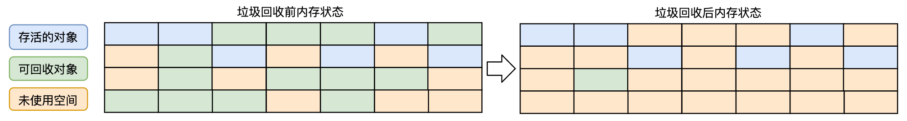

###### (2). 复制算法( *Copying* )

&emsp; &emsp; 复制算法为了解决效率问题，将可用内存按容量划分为大小相等的两块，每次只使用其中一块。当这块内存用完之后，将还存活的对象复制到另一块内存上边，然后把已使用过的内存空间一次清理掉，这样就<font color=red>**不会存在内存碎片**</font>的问题了。同时在对象复制过程中，只需要移动堆顶指针，按顺序分配内存即可，效率大大提升。


###### (3). 标记 - 整理算法( *Mark-Compact* )

&emsp; &emsp; 复制算法在对象存活率较高时会进行较多的复制操作，效率将会降低。同时由于需要一半的内存空间用于存活对象的拷贝·，以防止对象100%存活的极端情况。基于上述问题，提出了标记 - 整理 ( ***Mark-Compact*** ) 算法，标记 - 整理算法**先标记出需要回收的对象，然后将所有的存活对象向一端移动，然后直接清理掉端边界以外的内存。**


##### 3. GC分代与回收过程

&emsp;&emsp; 当前常用的虚拟机垃圾收集都采用“分代收集”方法，采用分代的唯一理由就<font color=red>**优化GC性能**</font>。分代算法根据对象的存活周期的不同将内存划分<font color=green>**新生代**、**老年代**、**永久代**</font>，根据各个年代的特点采用最适当的收集算法。

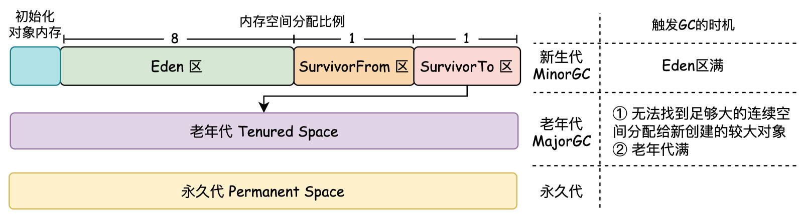

&emsp;&emsp;**① 新生代( 年轻代 )**：新生代主要用来存放新创建的对象，且大多数的对象的生命周期都是"朝生夕死"。新生代空间占堆内存空间的1/3。新生代分为 ***Eden*区、*ServivorFrom* 区、*ServivorTo* 区**。当 jvm 无法为新建对象分配内存空间时( 即*Eden*区满了) 会触发新生代的GC ( *MinorGC* )。<font color=green>**新生代GC的主要目的是为了回收那些"朝生夕死"的短命对象，同时将"年龄值大"的对象移动到老年代当中。**</font>新生代空间占用率越高，*MinorGC* 越频繁。<font color=red>由于新生代GC回收频繁，为了避免新生代中产生大量的内存碎片， *MinorGC* 过程采用『**复制算法**』进行垃圾回收。</font>
&emsp; &emsp;  **●  *Eden* 区**: *Eden* 区是 java 新对象的出生地，当 *Eden* 区内存不足时会触发 *MinorGC* 。
&emsp; &emsp;  **●  *ServivorFrom*区**: 存放上次GC的"幸存者"，并作为这次GC的被扫描对象。
&emsp; &emsp;  **●  *ServivoTo* 区**: 保留上次 *MinorGC* 的 幸存者。

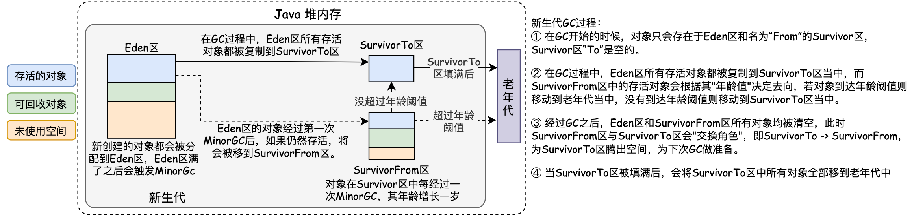

&emsp;&emsp;**② 老年代**: 老年代中的对象生命周期较长，老年代GC ( *Major GC* )不会频繁执行。在进行老年代GC前一般都先进行了一次新生代GC，使得有新生代的对象晋身入老年代。当无法找到足够大的连续空间分配给新创建的较大对象时也会提前触发一次老年代GC进行垃圾回收腾出空间。<font color=red>由于老年代的GC不会频繁执行，老年代GC采用『**标记 - 清除算法**』。</font>首先扫描一次所有老年代，标记出存活的对象，然后回收没有标记的对象。当老年代内存空间装满的时候，就会抛出OOM ( *Out of Memory* )异常。

&emsp;&emsp;**③ 永久代**：永久代是指内存中的永久保存区域，主要存在 *Class* 和 *Meta*  (元数据) 信息。由于GC不会在主程序运行期对永久区域进行清理，随着 *Class* 加载的越来越多，最终会导致抛出OOM异常。因此，在 Java 8之后，永久代已经被移除，被一个称为"元数据区" (元空间) 的区域所取代。元空间并不在虚拟机中，而是使用本地内存，因此，默认情况下，元空间的大小仅受系统的实际可用空间限制。

> <font color=SlateBlue> <u>**Q1. 如果老年代对象引用了新生代的对象，JVM是如何实现快速标记可达对象 ？**</u></font>
> &emsp;&emsp; JVM 在进行垃圾收集时，需要先标记所有可达对象，然后再清除不可达对象，释放内存空间，为了找到所有可达对象，最简单粗暴的实现就是每次进行垃圾收集时，都对整个堆中的所有对象进行扫描，找到所存活对象，特别是在老年代对象引用了新生代对象，这时如果发生 MinorGC 就会扫描整个老年代中的对象，效率低下。
> &emsp;&emsp; 对于 *HotSpot JVM*，使用了**卡标记( *Card Marking* )技术**来解决老年代到新生代的引用，通过<font color=red>**使用卡表( *Card Table* )和写屏障( *Write Barrier* )来进行标记并加快对 *GC Roots* 的扫描，避免每次进行 *Minor GC* 时扫描全堆的问题。**</font>卡标记技术将整个堆划分为一个个大小为 512 字节的卡，并且维护一个卡表，用来存储每张卡的一个标识位。这个标识位代表对应的卡是否可能存有指向新生代对象的引用。如果可能存在，那么我们就认为这张卡是脏的。在进行 MinorGC 的时候，可以不用扫描整个老年代，而是在卡表中寻找脏卡，并将脏卡中的对象加入到 *MinorGC* 的 *GCRoots* 里。当完成所有脏卡的扫描之后，jvm便会将所有脏卡的标识位清零。
>
> 
>
> <font color=SlateBlue> <u>**Q2. 卡表是何时进行写标记值位 (如何确保脏卡中一定包含指向新生代对象的引用) ？**</u></font>
>
> &emsp;&emsp; 在进行 *Minor GC* 的时候，我们在卡表中寻找脏卡，并将脏卡中的对象加入到 *MinorGC* 的 *GC Roots* 里。当完成所有脏卡的扫描之后，jvm 便会将所有脏卡的标识位清零。由于 *Minor GC* 伴随着存活对象的复制，而复制需要更新指向该对象的引用。因此，在更新引用的同时，我们会设置引用所在的卡的标识位。这个时候，我们可以确保脏卡中必定包含指向新生代对象的引用。但在 *Minor GC* 之前，如果想要保证每个可能有指向新生代对象引用的卡都被标记为脏卡，那么 Java 虚拟机需要截获每个引用型实例变量的写操作，并作出对应的写标识位操作。这个拦截操作在解释执行器中比较容易实现。但是在即时编译器生成的机器码中，则需要插入额外的逻辑。这也就是所谓的写屏障 ( *Write Barrier* )。
>
> 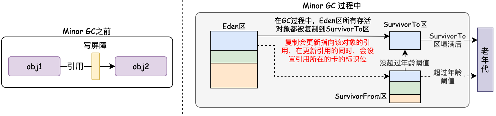
>
> <font color=SlateBlue> <u>**Q3. 在高并发场景下，如何处理写屏障带来的虚共享问题 ？**</u></font>
>
> &emsp; &emsp;  在CPU的缓存系统中，缓存是以缓存行( *cache Line* )来存储的，如果多个线程对多个独立的变量进行修改时，如果刚好这几个变量在同一个缓存行中，那么就会彼此影响，导致性能下降。因为卡表是以字节数组的形式存在，假设一个缓存行大小为64字节，那么它能加载64张卡，每张卡512字节，也就是一个缓存行能加载32k的内存数据，如果两个线程刚好在这个32k的内存中更新引用，就会造成储卡表的同一部分的缓存行的写回、无效化或者同步操作，因而间接影响程序性能。为此，java7之后 *HotSpot* 引入了一个新的参数 *-XX:+UseCondCardMark*，来尽量减少写卡表的操作。
>
> 

##### 4.垃圾收集器

&emsp;&emsp;  垃圾收集器是垃圾收集算法的具体实现，在不同的场景下，存在不同的垃圾收集器。在HotSpot虚拟机中包含7种不同的分代的收集器：***Serial* (串行收集器)、*ParNew、ParallelScavenge、SerialOld、ParallelOld、CMS、G1***。
&emsp;&emsp; *Serial* 串行收集器是最古老的垃圾收集器，是一个单线程的收集器，在收集垃圾的过程中会暂停其他工作线程，这一个过程称为 STW ( *Stop The World* )

##### 5. GC对系统的影响与优化

&emsp;&emsp; 当发生GC时，由于需要对内存数据进行“复制”，“移动”，因此用户线程会在运行至安全点( safe point )或安全区域( safe region )之后，自行挂起并进入暂停状态，对外的表现就是**系统卡顿**，这一过程称为STW ( Stop The World )。<font color=red>不论何种GC算法，不论是 *Minor GC* 还是 *Major GC* 都会触发STW，区别只在于 STW 的时间长短。
</font>
&emsp;&emsp;  在GC过程中，有一种特殊的GC行为，称为 *Full GC*。当 *Full GC* 被触发后，*Full GC* 会回收整个堆的内存，包含老年代，新生代，metaspace等，在这一过程中所有用户线程都是处于暂停的状态。*Full GC* 通常是比较慢的，少则几百毫秒，多则几秒，正常情况 *Full GC* 每隔几个小时甚至几天才执行一次，对系统的影响还能接受。但是，一旦出现 *Full GC* 频繁 ( 如几十分钟就会执行一次 ) 会造成系统性能降低，系统出现卡顿等问题。

###### (1). GC 触发时机 

&emsp;&emsp; 要想减少GC对系统性能的影响，首先需要了解GC的触发条件与时机。


###### (2). GC 日志分析

&emsp;&emsp; GC机制包含不同的垃圾回收器，适用于不同的场景，每种回收器的日志格式都可以不一样。对应的垃圾回收器包含以下几种：
&emsp; &emsp;  ● 串行回收器 ( *Serial* )：单线程的一个回收器，简单、易实现、效率高。
&emsp; &emsp;  ● 并行回收器 ( *ParNew* )：ParNew 是 Serial 的多线程版本，可以充分的利用CPU资源，减少回收的时间。
&emsp; &emsp;  ● 吞吐量优先回收器 ( *Parallel Scavenge* )：侧重于吞吐量的控制。
&emsp; &emsp;  ● 并发标记清除回收器 ( *CMS,Concurrent Mark Sweep* )：CMS 是一种基于“标记-清除”算法实现的回收器，以获取最短回收停顿时间。


###### (3). GC 优化 

&emsp;&emsp;  当 Java 程序性能达不到既定目标，且其他优化手段都已经穷尽时，通常需要调整垃圾回收器来进一步提高性能，称为GC优化。GC优化一般步骤可以概括为：**确定目标、优化参数、验收结果**。

▨ **确定目标** - 明确需求，量化指标
&emsp;&emsp;  明确应用程序的系统需求是性能优化的基础，系统的需求是指应用程序运行时某方面的要求，如**高可用**、**低延迟** (请求必须多少毫秒内完成响应)、**高吞吐** (每秒完成多少次事务)。明确系统需求之所以重要，是因为上述性能指标间可能冲突，比如缩小延迟的代价是降低吞吐量或者消耗更多的内存或者两者同时发生。明确系统需求需要量化GC时间和频率对于响应时间和可用性的影响，计算出当前GC情况对服务的影响。
&emsp;&emsp;  假设单位时间T内发生一次持续25ms的GC，接口平均响应时间为50ms，且请求均匀到达，那么有 (50ms+25ms) / T 比例的请求会受GC影响。如果时间T内发生N次GC，**受GC影响请求占比 = (接口响应时间+GC时间) × N / T** 。


▨ **优化参数与结果验收**
&emsp;&emsp;通过收集GC信息，结合系统需求，确定优化方案，例如选用合适的GC回收器、重新设置内存比例、调整JVM参数等。这里来介绍几个不同的优化案例：

&emsp;&emsp;  **① *MajorGC* 和 *MinorGC* 频繁**
&emsp;  &emsp;   ♨ 服务情况：*MinorGC* 每分钟100次 ，*MajorGC* 每4分钟一次，单次 *MinorGC* 耗时25ms，单次 *MajorGC* 耗时200ms，接口响应时间50ms。
&emsp;  &emsp;   ✿ 问题量化：根据上面的分析可以知道 12.5% 的请求响应时间会增加 『 ( 50ms+25ms ) × 100次/60000ms = 12.5% 』，其中8.3%的请求响应时间会增加25ms『 50ms × 100次/60000ms = 8.3% 』
&emsp;  &emsp;   ➹ 问题分析：通常情况下，由于新生代空间较小，*Eden* 区很快被填满，就会导致频繁 *MinorGC*。因此<font color=green>**可以通过增大新生代空间来降低 *MinorGC* 的频率，扩容新生代空间后，*MinorGC* 频率降低，对象在新生代得到充分回收，只有生命周期长的对象才进入老年代。这样老年代增速变慢，*MajorGC* 频率自然也会降低。**</font>扩容 *Eden* 区虽然可以减少 *MinorGC* 的次数，但会增加单次 *MinorGC* 时间么？单次 *MinorGC* 时间会受哪些因素影响呢？
&emsp;  &emsp; 首先，单次 *MinorGC* 时间由以下两部分组成：T1 (扫描新生代) 和 T2 (复制存活对象到 *Survivor* 区) 。那么 *MinorGC* 时间如下图所示：


#### 1.1.x *jvm* 基本参数

&emsp; &emsp;  **●  -XX:+PrintGCDetails**：打印GC时的详细信息
&emsp; &emsp;  **●  -XX:+PrintGCDateStamps**：打印GC系统时间
&emsp; &emsp;  **●  -Xloggc**：将日志存储到文件中，文件按时间取名
&emsp; &emsp;  **●  -XX:+UseGCLogFileRotation**：打开GC日志滚动记录功能
&emsp; &emsp;  **●  -XX:NumberOfGCLogFiles**：GC日志数量
&emsp; &emsp;  **●  -XX:GCLogFileSize**：GC日志文件大小

### 1.3 Jar包

&emsp; &emsp; Jar 是 java 的档案文件，是一种压缩文件，Jar文件与ZIP压缩文件兼容，区别是Jar文件中默认包含了一个`META-INF/MANIFEST.MF`的清单文件。<font color=green>当一个应用开发完成后，会将包含的`class`文件打包成一个Jar文件提供给其他人使用，只需要将Jar包路径添加到环境变量中，JVM会把这个Jar文件当成一个路径来处理，并在内存中解压Jar包。</font>


> <font color=SlateBlue>  <u>**Q. 使用Jar文件的好处？**</u></font>
> &emsp; ① 可以对Jar文件进行数字签名，保证Jar文件的安全。 &emsp; ② 加快下载速度，当多个`class`文件进行传输时，需要每个文件单独建立一个HTTP连接。如果压缩成Jar文件，只需要一次连接即可。 &emsp; ③
> 使`class`文件变小，减少空间的占用 &emsp; ④ 可移植性，Jar包时Java平台内部处理的标准，能够在各种平台上直接使用。

## [二. Java 语言基础](基础语言 - 3.2 Java基础.md)

点击跳转第二章