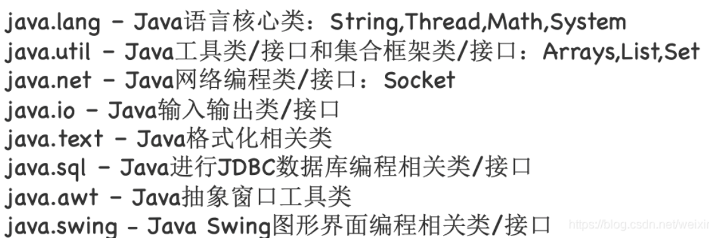
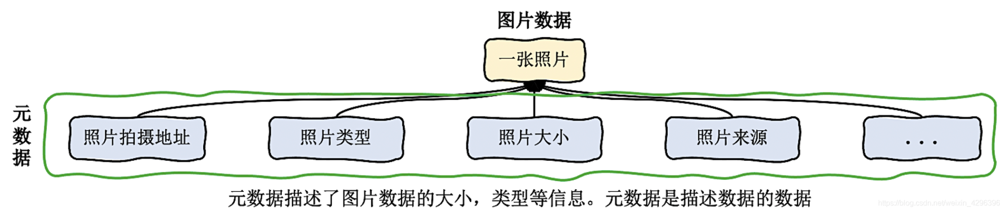
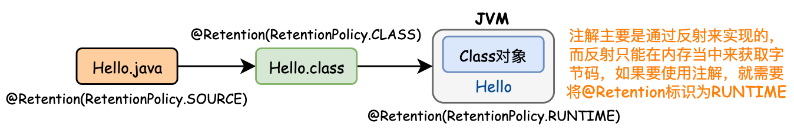
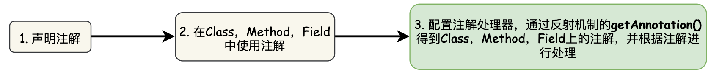
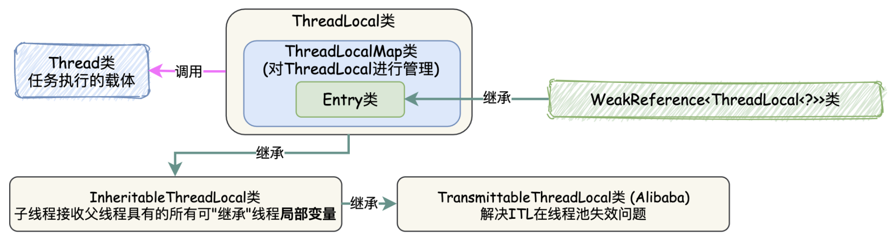
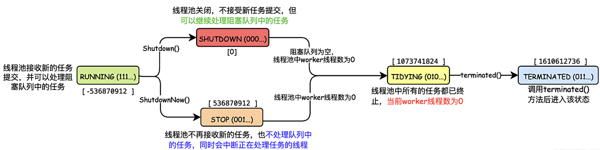
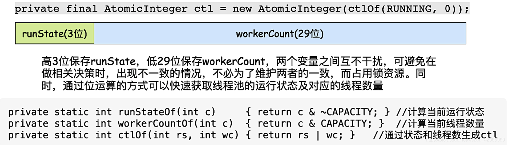
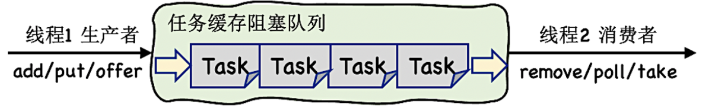

## 二. Java 语言基础

### 2.1 Java 程序基本规则

&emsp;&emsp;与C++相比，Java是完全的面向对象的语言，因此Java与C++在程序规则上有所区别：
 &emsp; &emsp; ① Java程序必须以`class`的形式存在，`class`是java的最小程序单位。<font color=red>在Java程序中，不允许可执行语句、方法独立存在。</font>
&emsp; &emsp;  <font color=red>② 如果一个Java程序中定义了一个`public`类，则该程序文件的文件名必须和该`public`类名相同。因此，一个Java程序文件最多只能有一个`public`类。</font>
&emsp; &emsp;  ③ Java中编译器通过Main()方法作为程序的入口，且Main()的修饰符必须为：`public static void main(String [] args){}`

### 2.2 Java 语法基础

#### 2.2.1 Java关键字

&emsp; &emsp; Java中一共有48种关键字，如下表所示。关键字可以分为程序逻辑控制关键字，系统控制(线程同步)关键字，数据类型关键字，类/对象关键字，包/方法管理关键字。红色的为常用的关键字。由于Java与C++的关键字有很多相同之处，未介绍的关键字可以查看「[C++基础](https://blog.csdn.net/weixin_42963969/article/details/103018074)」


##### 1. *volatile* 类型

&emsp; &emsp; 当一个变量定义为 ***volatile*** 类型后，该变量将具备两种特性：
&emsp; &emsp;① <font color=green>**定义为 *volatile* 类型变量会对所有线程保持可见性，即当一个线程修改了这个变量的值，修改后的值对于其他线程来说是可以被立刻获取到**</font>。而普通变量的值在线程间传递均需要通过主内存完成。<font color-red>注意：虽然定义为 *** volatile*** 类型的变量在被执行时可以保证数据一致性，但 Java运算并不是原子操作，所以定义为 ***volatile*** 类型的变量在并发下也是线程不安全的。因此除了以下两种运算场景，其余运算均需要加锁来保证原子性。</font>
&emsp; &emsp;  ● 运算结果不依赖变量的当前值，或者能够确保只有单一线程来修改变量的值。
&emsp; &emsp;  ● 变量不需要与其他的状态变量共同参与不变条件约束。

```java
public class Main {
    public static volatile int race = 0;
    
    /* 由于volatile类型仅保证了获取变量时的数据一致性，并不会保证数据运算的原子性，从而导致线程运算	不安全。对于"race++"操作，分为三个运算过程：
    ① 复制race变量的当前值到临时变量temp中；
    ② 将临时变量自增；
    ③ 将临时变量复制到race变量中； */
    public static void increase(){
        race++;  ，
    }
    public static void main(String[] args) throws InterruptedException {
        Thread threads[] = new Thread[20];
        for(int i=0;i<20;++i){
            threads[i] = new Thread(new Runnable() {
                @Override
                public void run() {
                    for(int i=0;i<10000;i++){
                        increase();
                    }
                }
            });
            threads[i].start();
        }
        System.out.println(race);  //由于线程不安全，导致最终结果是小于20*10000的
    }
}
```

&emsp; &emsp;② 定义为 ***volatile*** 类型变量会<font color=red>**禁止指令重排序优化**</font>。而普通变量仅会保证变量在方法中能够得到正确执行结果，而不保证变量赋值操作顺序与程序代码中逻辑顺序是一致的。( 指令重排序是指CPU采用了允许将多条指令不按程序顺序，分开发送给相应电路单元进行处理，但指令重排不是任意的，CPU需要根据指令依赖情况进行重排，以保证得到正确的执行结果 )

```java
Map<String,String> config;
char [] configText;

// 如果inited变量没有定义为volatile类型，则代码可能会被指令重排序优化，
// 导致线程A中的inited = true;语句被提前执行,但此时配置信息并没有被加载，导致线程B执行出错。
volatile boolean inited = false;  

//线程A中执行，读取配置信息，读取完成后将inited置为true，通知其他线程。
config = new HashMap();
configText = readConfig();
inited = true;

//线程B中执行，等待inited为true，并执行初始化操作
while(!inited){
	 sleep();
}
doSomethingWithConfig();
```

##### <font color=Sienna>**2. *final* 类型**</font>

##### 3. *synchronized* 类型

&emsp; &emsp; Java中互斥同步方式就是 *synchronized* 关键字。*synchronized* 主要有三种用法：**修饰实例方法，修饰静态方法，修饰代码块**。
&emsp; &emsp;  **① 修饰实例方法**: **被修饰的方法称为同步方法，其作用范围是整个方法，作用对象是调用这个方法的对象**，进入同步代码前要获得当前对象实例的锁。

```java
//共享对象数据
public class HasSelfPrivateNum {
    private int num = 0;
    // 用synchronized修饰实例方法
    public synchronized void addI(String name){
        try{
            if(name.equals("a")){
                num = 100;
                System.out.println("a set over");
                Thread.sleep(1000);
            }else{
                num = 200;
                System.out.println("b set over");
            }
            System.out.println("num = " +  num);
        }catch (Exception ex){
            ex.printStackTrace();
        }
    }
}
// 线程1 - Thread1
public class Thread1 extends Thread{
    private HasSelfPrivateNum hasSelfPrivateNum1;
    public Thread1(HasSelfPrivateNum hasSelfPrivateNum){
        super();
        this.hasSelfPrivateNum1 = hasSelfPrivateNum;
    }
    @Override
    public void run(){
        super.run();
        hasSelfPrivateNum1.addI("a");
    }
}
// 线程2 - Thread2
public class Thread2 extends Thread{
    public HasSelfPrivateNum hasSelfPrivateNum2;
    public Thread2(HasSelfPrivateNum hasSelfPrivateNum){
        super();
        this.hasSelfPrivateNum2 = hasSelfPrivateNum;
    }
    @Override
    public void run(){
        super.run();
        hasSelfPrivateNum2.addI("b");
    }
}
//主函数
public static void main(String[] args) throws InterruptedException {
    HasSelfPrivateNum hasSelfPrivateNum = new HasSelfPrivateNum();
    Thread1 thread1 = new Thread1(hasSelfPrivateNum);
    thread1.start();
    Thread2 thread2 = new Thread2(hasSelfPrivateNum);
    thread2.start();
}
-- Output -- 
1. 如果hasSelfPrivateNum.addI()方法没有加synchronized同步，则输出结果会出现非线程安全问题，结果如下：
 a set over
 b set over
 num = 200
2. 加synchronized同步后，避免了非线程安全问题，结果如下：
 a set over
 num = 100
 b set over
 num = 200
```

&emsp; &emsp; **② 修饰静态方法**:  **给当前类加锁，会作用于类的所有对象实例 ，其作用的范围是整个静态方法，进入同步代码前要获得当前 *class* 的锁**。<font color=red>如果一个线程A调用一个实例对象的 *non-static-synchronized* 方法，而线程B需要调用这个实例对象所属类的 *static-synchronized* 方法，不会发生互斥情况，因为访问 *static-synchronized* 方法占用的锁是当前类的锁，而访问 *non-static-synchronized* 方法占用的锁是当前实例对象锁。</font>`synchronized void staic method(){ 业务代码 }`
&emsp; &emsp; **③ 修饰代码块**: 需要指定加锁对象，对给定对象/类加锁。**当多个线程持有的对象监听器为同一个对象时，线程是同步的，同一时间只有一个线程可以访问同步块**，**但是如果是同一个类的不同实例，同步块的执行就是异步的**。 `synchronized(object)` / `synchronized(类.class)` `synchronized(this) { 业务代码 }`

```java
//共享对象数据
public class HasSelfPrivateNum {
   private String anyString = new String()
   // 方法A
   public void aFunction(String name){
       try{
           synchronized (anyString) 
              System.out.println("aFunction begin ");
              Thread.sleep(1000);
              System.out.println("aFunction end");
           }
       }catch (Exception ex){
           ex.printStackTrace();
       }
   }

 	// 方法B
   synchronized public void b() {
      System.out.println("bFunction begin");
      System.out.println("aFunction end");
   }
}
// 线程1 - Thread1 - 执行HasSelfPrivateNum.a()方法
public class Thread1 extends Thread{
   private HasSelfPrivateNum hasSelfPrivateNum1;
   public Thread1(HasSelfPrivateNum hasSelfPrivateNum){
       super();
       this.hasSelfPrivateNum1 = hasSelfPrivateNum;
   }
   @Override
   public void run(){
       hasSelfPrivateNum1.a();
   }
}
// 线程2 - Thread2 - 执行HasSelfPrivateNum.b()方法
public class Thread2 extends Thread{
   public HasSelfPrivateNum hasSelfPrivateNum2;
   public Thread2(HasSelfPrivateNum hasSelfPrivateNum){
       super();
       this.hasSelfPrivateNum2 = hasSelfPrivateNum;
   }
   @Override
   public void run(){
       hasSelfPrivateNum2.b();
   }
}
//主函数
public static void main(String[] args) throws InterruptedException {
    HasSelfPrivateNum hasSelfPrivateNum = new HasSelfPrivateNum();
    Thread1 thread1 = new Thread1(hasSelfPrivateNum);
    thread1.start();
    Thread2 thread2 = new Thread2(hasSelfPrivateNum);
    thread2.start();
}
-- Output --
同一个类的不同实例，在执行同一个共享数据类时，不同的同步块是异步的
 A begin
 B begin
 B end
 A end
```

#### 2.2.2 *Package* 与 *Import*  机制

&emsp; &emsp; Java引入了包机制，用于解决类名冲突与类文件管理等问题(类似于C++中的`namespace`)。Java允许将一组功能相关的类放在同一个`Package`下，构成类库单元。当Java程序文件中使用了`Package`语句时，则该程序文件中定义的所有类都在这个`Package`下。同时，在父包下可以创建子包，<font color=green>虽然父包和子包存在某种联系，但在用法上没有任何关系，如在父包类中需要使用子包中的类时，必须使用子包的全名，而不能省略父包部分</font>。 &emsp; &emsp; 同时Java引入了`import`机制，可以向某个Java文件中指定包层次下的某个类或全部类。

```java
//t1Class.java
package Test      		//父包
import Test.A.t2Class;  //在父包导入子包类时，必须使用子包的全名，不能省略父包部分
public class t1Class{}

//t2Class.java
package Test.A			//子包
public class t2Class()
```

&emsp; &emsp; Java常用的包结构如下图所示：



***

### 2.3 Java 类与对象

#### 2.3.1  *Class*类 / 对象 - 类的元数据

##### 1. *Class*类概述

&emsp; &emsp; 在 Java中，一切皆对象。Java分为两种对象：<font color=red>**Java实例对象 和 Java Class对象(字节码文件描述对象)**</font>。每个类的运行时的类型信息就是用 *Class* 对象表示的。它包含了与类有关的信息。每一个类有且只有一个 *Class* 对象，*Class* 对象对应`java.lang.Class`类，是对类的抽象和集合，是类的字节码文件描述对象。*Class* 类的特点如下：
&emsp; &emsp; ● 自定义的类在编译后会<font color=green>**生成一个唯一的 *Class* 对象**，***Class* 对象保存在与自定义类同名的 *.class* 文件中**</font>。
&emsp;&emsp;  ●<font color=green> **无论创建多少个自定义类的对象，有且只有一个 *Class* 对象**</font>，表示自定义类的类型信息。
&emsp; &emsp; ● Class类没有公共的构造方法，<font color=green>**仅在类加载的过程中，由 *jvm* 自动构造，因此不能显式的声明一个 *Class* 对象**</font>。


> <font color=SlateBlue>  <u>**Q. Class类的作用 ？**</u></font>
>  &emsp;在C++中有个重要的概念：<font color=red>**运行时类型识别(`RTTI`)**</font>，其作用是在运行时识别一个对象的类型和类的信息。java中同样存在`RTTI`，java中的`RTTI`实现有两种方式：
&emsp; ● <font color=green>在编译期已确定其所有对象的类型，这种方式需要在写程序的时候将对象通过 *new* 创建出来</font>。
&emsp; ● 通过反射机制，在运行时发现和使用类型的信息。在java中用来表示运行时类型信息的对应类就是Class类。

```java
1. Class类常用的方法:
  1）public static Class<?> forName(String className):参数是一个类的全限定名(package path)，返回该类的Class对象引用。
  2）public T newInstance():创建此 Class 对象所表示的类的一个新实例。  
  3）public native Class getSuperclass()：获取类的父类
  4）public ClassLoader getClassLoader() ：获得类的类加载器。
  5）public String getName() ：获取类或接口的名字。enum为类，annotation为接口。
  6）public Constructor<?>[] getConstructors() ：获得所有的构造函数。
  7）public Field[] getFields() :获得域成员数组。    
  8）public Method[] getMethods() ：获得方法。
2. 三种方法获得Class对象：
    1）获取类的静态成员变量class
          Class c = Test.class;
    2）调用对象的getClass()方法，返回该对象对应的一个Class对象
          Class c = test.getClass();
    3) 调用Class类的静态方法forName();
          Class c =Class.forName("testpackage.test");   
```

##### 2. Class类包含的信息

&emsp; &emsp; Class类由类加载器从 *.class* 文件中加载，并在 *jvm* 中生成该类的Class对象，每一个Class对象都关联着定义它的那个类加载器。每个Class类中包含的信息有 *field* (字段)，*method* (方法)、*constructor* (构造函数)，将这些信息的共有特性分别封装成一个类，就分别对应 *Field* 类， *Method* 类、 *Constructor* 类。


&emsp; &emsp; ● ***Constructor*** 类：代表某个类中的一个构造方法 
&emsp; &emsp; ● ***Method*** 类：代表某个类中的一个成员方法 
&emsp; &emsp; ● ***Field*** 类：代表某个类中的一个成员变量

```java
package test
public class ReflectClass {
    private int nums;
    public ReflectClass(int i){
        this.nums = i;
    }
    public int getNum(){
        return this.nums;
    }
    public void setNum(int n){
      	this.nums = n;
    }
}
// ============================================
// 1. Constructor类
// 从Class类中获取所有构造器类
Class clazz = Class.forName("test.ReflectClass");  //根据全限定类名，将对应的.class字节码文件加载到内存，并生成Class对象
Constructor [] constructors= clazz.getConstructors();  //获取Class类中的所有构造器
// 根据构造函数的参数类型，从Class类中，获取对应的构造器类
Constructor constructor1 = clazz.getConstructors(null);      //获取默认构造函数
Constructor constructor2 = clazz.getConstructors(int.class); //根据构造参数的类型，获取对应的构造器
ReflectClass reflectClassObj = (ReflectClass) constructor.newInstance(num);  //通过构造器创建实例对象，并输入构造函数参数

// ============================================
// 2. Method类
// 从Class类中获取对应的方法,仅能获取public定义的方法
reflectClassObj.getClass().getMethod("setNum",int.class).invoke(test,100);   //通过实例对象的Class类获取对应的方法，并执行
System.out.println(reflectClassObj.getClass().getMethod("getNum").invoke(test)); //通过实例对象的Class类获取对应的方法，并执行

// ============================================
// 3. Field类
// 从Class类中获取对应的方法，仅能获取public定义的成员变量
System.out.println(reflectClassObj.getClass().getField("nums").get(test));
```

#### 2.3.2 类引用

##### 1. 类的引用

&emsp; &emsp; 所谓引用，是指创建一个”对象标识符“ (句柄)，通过操纵”标识符“ (句柄) 使其指向一个对象。这个”标识符“称为引用变量(通俗来说，引用 = 引用变量 = 常说的变量)。<font color=green>**一个引用变量可以指向多个对象，但仅保留最后一次引用。一个对象也可以被多个引用变量所指**。</font>

```java
// 1.这里 new Person是一个对象，p是一个”标识符“，指向Person对象的引用。
Person p = new Person("A");   
int a = 2;     //2是一个Intger的对象，a是一个指向Intger的引用

// 2.一个引用可以指向多个对象，但仅保留最后一次引用
int a=2;
a=3;   

// 3.一个对象也可以被多个引用所指
Person p1 = new Person("B");
Person p2=p1;
```

&emsp; &emsp; 为了更加灵活的控制对象的声明周期，Java将对象的引用分为4个等级，<font color=red>从高到低依次为：**强引用，软引用，弱引用，虚引用**。</font>
&emsp; &emsp; ●   **强引用 *FinalReference***：强引用是指创建一个对象并把这个对象赋给一个引用变量，强引用是使用最普遍的引用。<font color=green>**如果一个对象具有强引用，当内存空间不足时，jvm 宁愿抛出 *OutOfMemoryError* 错误，使程序异常终止，也不会回收具有强引用的对象来解决内存不足的问题**。</font>因此，<font color=darkorange>**当强引用对象不使用时，需要将其指向 *null*，使其可以被GC回收**。</font>
&emsp; &emsp; ●   **软引用 *SoftReference***：软引用用来描述一些还**有用但非必需**的对象。如果一个对象**只**具有软引用，则内存空间充足时，垃圾回收器就不会回收它；如果内存空间不足了，jvm 会将软引用中的对象引用置为 *null*，然后通知垃圾回收器GC进行内存回收。</font>只要垃圾回收器没有回收它，该对象就可以被程序使用。软引用可用来**实现内存敏感的高速缓存**，如图片缓存，浏览器后端页面缓存。 
&emsp; &emsp; ●   **弱引用 *WeakReference***：弱引用用来描述非必需对象。只具有弱引用的对象拥有更短暂的生命周期，当垃圾回收器GC扫描到只具有弱引用的对象，不管当前内存空间是否足够，都会回收内存。
&emsp; &emsp; ●   **虚引用 *PhantomReference***：虚引用并不会决定对象的生命周期。如果一个对象仅持有虚引用，那么它就和没有任何引用一样，在任何时候都可能被垃圾回收器回收。使用虚引用的目的就是为了得知对象被GC的时机，可以利用虚引用来进行销毁前的一些操作，比如说资源释放等。


> <font color=SlateBlue>  <u>**Q1. 虚引用 与 软引用、弱引用的区别 ？**</u></font>
> &emsp;  虚引用**必须**和引用队列  *ReferenceQueu*e  联合使用。当垃圾回收器准备回收一个对象时，如果发现它还有虚引用，就会在回收对象的内存之前，把这个虚引用加入到与之关联的引用队列中。

```java 
class Superclass{
    public void test(){
        System.out.println("test");
    }
    public static String DEFINE_TYPE = "hello";
    static{
        System.out.println("super");
    }
}

// 1.强引用 - 正常的对象引用
	String str =  new String("abc"); 
	Superclass super =  new Superclass();    
	super = null; // 当强引用不使用时，置为null，以便GC回收

// 2.软引用 - SoftReference
	Superclass superclass =  new Superclass(); 
	SoftReference<Superclass> softReference=new SoftReference<Superclass>(superclass);
	if(softReference.get()!=null){	//内存充足，还没有被回收器回收，直接通过get()方法获取对象
	   Superclass soft=(Superclass)softReference.get();  
	   soft.test();
	}else{
	    softReference = new SoftReference(superclass); // 内存不足，软引用的对象已经回收，重新构建软引用
	}
	// 软引用可以和引用队列联合使用，软引用对象被垃圾回收，JVM会把软引用加入到与之关联的引用队列中。
	ReferenceQueue<String> referenceQueue = new ReferenceQueue<>();  //引用队列
	String str = new String("abc");
	SoftReference<String> softReference = new SoftReference<>(str, referenceQueue);//软引用关联引用队列

// 3.弱引用 - WeakReference
	String str = new String("abc");
	WeakReference<String> weakReference = new WeakReference<>(str);
	str = null;
	// 弱引用可以和引用队列联合使用，弱引用对象被垃圾回收，JVM会把弱引用加入到与之关联的引用队列中。
	ReferenceQueue<String> referenceQueue = new ReferenceQueue<>();  //引用队列
	String str = new String("abc");
	WeakReference<String> weakReference = new WeakReference<>(str, referenceQueue);//弱引用关联引用队列

// 4.虚引用 - PhantomReference
	String str = new String("abc");
	ReferenceQueue queue = new ReferenceQueue();
	// 创建虚引用，要求必须与一个引用队列关联
	PhantomReference pr = new PhantomReference(str, queue);
```

&emsp; &emsp;<font color=Sienna>**2. Java 类加载过程中的引用关系**</font>
&emsp; &emsp; 在类的全生命周期中，从类的加载器，生成类的Class对象，到类的实例对象的使用有着密不可分的引用关系： 
&emsp; &emsp; ● 类加载器与Class对象：类的Class和加载它的加载器之间是<font color=orange>**双向关联**</font>关系。即<font color=green>一个Class对象总是会引用他的类加载器，调用Class对象的`getClassLoader`方法就可以获得它的类加载器。</font>
&emsp; &emsp; ● 类，类的Class对象，类的实例对象：<font color=green>一个类的实例对象总是引用该类的Class对象，在Object类中定义该类`getClass`方法，会返回对象所属类的Class对象的引用。</font>

```java
package test;
class Superclass{
    public void test(){
        System.out.println("test");
    }
    public static final String DEFINE_TYPE = "hello";
    static{
        System.out.println("super");
    }
}
public class test {
    public static void main(String[] args) throws IllegalAccessException, InstantiationException, ClassNotFoundException {
        ClassLoader classLoader = Superclass.class.getClassLoader();  //Superclass的类加载器
        Class objClass = classLoader.loadClass("test.Superclass");   //Superclass Class对象
        Object obj=objClass.newInstance();                     //Superclass的Object父类
        Superclass superclass = (Superclass)obj;        //Superclass的实例对象
        superclass.test();
    }
}
```


#### 2.3.3 类反射 - Class对象的主要应用

&emsp; &emsp; Java程序在运行之前需要先编译。程序中的对象初始化，对象的调用在编译时期就已经确定并加载到JVM中。当程序在运行时需要 "**动态加载**"某些类时，由于这些类并没有加载到JVM当中，无法直接获取。但是<font color=green>通过Java的反射机制，可以在运行时动态地创建对象并调用其属性和方法，不需要提前在程序中(编译时期) 进行对象的初始化和调用。</font><font color=red>Java反射机制的本质是JVM得到Class对象之后，再通过Class对象进行反编译，从而获取对象的各种信息。</font>


> <font color=SlateBlue>  <u>**Q1. 反射有什么用途 ？**</u></font>
> &emsp;  ① 通过Java反射机制，访问Java未初始化对象的属性和方法。
> &emsp;  ②  反射最重要的用途就是开发各种通用框架。如: `Spring`都是通过`xml`文件配置化的，为了保证框架的通用性，大多数框架需要根据配置文件加载不同的类或者对象，调用不同的方法，这时框架就必须使用反射在程序运行时动态加载需要使用的对象。
> &emsp;  ③ 当使用IDE编程时，IDE会自动列举某一对象所包含的方法和属性，这是通过反射实现的。
>
> <font color=SlateBlue>  <u>**Q2. 反射技术的优缺点 ？**</u></font>
> &emsp;  ① 优点：反射提高了Java程序的灵活性和扩展性，降低耦合性，提高自适应能力。
> &emsp;  ② 缺点：
> &emsp;  &emsp;  ● 性能问题：反射技术是通过.class文件的一种解释操作，反射用于方法和字段时其性能要慢于代码中直接定义。因此Java反射机制一般用于灵活性和扩展性要求很高的系统框架上，普通程序不建议使用。
> &emsp;  &emsp;  ● 代码维护问题：反射技术绕过了源代码，使用反射会模糊程序内部逻辑，因而会带来维护问题。

#### 2.3.4 继承与接口

##### 1. 继承 *extends*

&emsp; &emsp; 继承是 java 面向对象的特征之一，Java的继承通过关键字 ***extends*** 来实现，<font color=green>与C++相比，*java* 摒弃了多继承，只保留了单继承，即**每一个类最多只有一个直接父类**。</font>在子类创建某个类对象时，系统会隐式的创建该类的父类对象，且可以通过 ***super*** 来该子类的父类对象。如果一个 java类没有显式指定直接父类，则默认其直接父类为 `Java.lang.Object`。

```java
class parent{
	public int a;
}
class children extends parent{
    void fun(){
       super.a=10;  //父类的成员变量
    }
} 
```

&emsp;&emsp; 由于**继承会破坏父类的封装性，使子类与父类之间的耦合**，因此子类与父类之间应当遵循如下规则：
&emsp; &emsp;  <font color=green>① 将父类的所有属性设置为` private`，不让子类直接访问父类属性。</font>
&emsp; &emsp;  <font color=red>② 不要让子类随意修改、访问父类的方法。父类中的工具方法要设置为 ***private*** ; 父类中需要被外部调用但不希望子类重写该方法的要设置为 ***final*** ;
如果父类的方法能够被子类重写，但不希望被其他类访问，要设置为 ***protected***。</font>
&emsp; &emsp;  <font color=green>③ 不要在父类构造器中调用被子类重写的方法。</font>

##### 2. 抽象类与接口

&emsp; &emsp; 与C++相比，java的抽象与接口定义更加明确。在 java中，通过 ***abstract*** 定义抽象类，与C++相同，<font color=green>**因为抽象类中含有无具体实现的方法，所以不能用抽象类创建对象(无法进行实例化)，仅能通过子类的继承对抽象方法进行实例化**。</font>除此之外，java还引入了一种更加纯粹的抽象类 - 接口( ***interface*** )，<font color=green>在 ***interface*** 中，所有的方法都是抽象方法，同时引入了 ***implement*** 来实现接口。</font>

> <font color=SlateBlue>  <u>**Q1. 抽象类与接口的区别 ？**</u></font>
> &emsp; ● 语法层面：
> &emsp; &emsp;  ①  抽象类可以提供成员方法的**实现细节**，而接口中只能存在 `public abstract` 方法；
> &emsp; &emsp;  ②  抽象类中的成员变量可以是各种类型的，而接口中的成员变量只能是 `public static final` 类型；
> &emsp; &emsp;  ③  接口中不能含有静态代码块以及静态方法，而抽象类可以有静态代码块和静态方法；
> &emsp; &emsp;  ④  一个类只能继承一个抽象类，而一个类却可以实现多个接口。
> &emsp; ● 设计层面：
> &emsp; &emsp;  ①  抽象类是对类本质的抽象，避免在子类开发重复的代码，表达的是 ***is-a*** 的关系，包含的是实现子类的通用特性，将子类存在差异化的特性进行抽象，交由子类去实现。
> &emsp; &emsp;  ②  接口是对行为的抽象，表达的是 ***like-a*** 的关系，接口的核心是定义行为，即实现类可以做什么，至于实现类是谁，如何实现的，接口并不关心。  

```java
// ifaceA.java
package A.package1;
public interface ifaceA{  //定义接口
    void fun1();
    void fun2();
}
//ifaceB.java
package A.package1;
public interface ifaceB{  //定义接口
    void fun3();
    void fun4();
}

// Iimplement.java
package A;
import A.package1.iface;
public class Iimplement implements A.package1.ifaceA,A.package1.infaceB{  //实现接口
	@Override
	public void fun1(){
		System.out.print("A");
	}
	@Override
	public void fun2(){
		System.out.print("B");
	}
	@Override
	public void fun3(){
		System.out.print("C");
	}
	@Override
	public void fun4(){
		System.out.print("D");
	}
} 
```

#### 2.3.5 内部类

&emsp; &emsp; 内部类是指定义在一个类中的类，内部类主要有以下三个作用：
 &emsp; &emsp; ① 内部类可以访问该类定义所在作用域中的数据，包括私有数据
 &emsp; &emsp; ② 内部类可以对同一个包中的其他类是隐藏，即同一个包的其他类是无法调用该类的内部类的。
 &emsp; &emsp; ③ 当要定义一个回调函数时，可以使用匿名内部类的方式。

***

### 2.4 Java 注解 Annotation - 类的标签

&emsp; &emsp; 注解是 Java 提供的一种途径和方法，可以使源程序中的元素关联到代码中的元数据 ( ***metadata*** )。  <font color=green>注解是附加在代码中的一些源信息或标签信息，用于在一些工具在编译、类加载、运行时进行解释和使用，起到**说明**，**配置**的功能，**可以将注解理解为标签**。</font>注解为一种修饰符，应用于类、方法、参数、变量的声明语句中。注解不会也不能影响代码本身的业务逻辑，仅仅只能起到辅助性的作用。**在定义注解时，通过 *@interface* 进行修饰，使用注解时要在被修饰的类或变量之前调用定义的注解。**

> <font color=SlateBlue>  <u>**Q1. 什么是元数据 (Metadata)？**</u></font>
>&emsp;  要真正了解注解的工作方式和原理，就需要先了解什么是元数据。
>&emsp;  元数据是一种很抽象的定义，<font color=red> 元数据是一系列关于数据的数据，是一系列用来描述数据的数据。</font>元数据可以为数据说明其元素或属性(如：名称、大小、数据类型等)，或其结构 (如：长度、字段等)，或其相关数据(如：位于何处、数据拥有者等)
>
>
>
><font color=SlateBlue>  <u>**Q2. @interface 和 interface 的区别 ？**</u></font>
>&emsp;    ●  ***@interface*** : 是用来修饰 ***Annotation*** 的,表示实现了`java.lang.annotation.Annotation`接口
>&emsp;    ●  ***interface***: 声明一个java的接口

#### 2.4.1 注解基本概念

##### <font color=Sienna>**1. 注解的属性**</font>

&emsp;&emsp;注解的属性也叫做成员变量。<font color=red>**注解只有成员变量，没有方法**</font>。注解的成员变量在注解的定义中以“无形参的方法”形式来声明，其**方法名=该成员变量的名字，其返回值 = 该成员变量的类型，若注解中属性存在默认值，默认值需要用 default 关键字指定。**对注解的属性赋值的方式是在注解的括号内以value=”” 形式，多个属性之前用","隔开。

  ```java
  @Target(ElementType.TYPE)
  @Retention(RetentionPolicy.RUNTIME)
  public @interface TestAnnotation {
      int id() default 0;    	//等同于成员变量 => int id = 0;
      String msg(); 					//等同于成员变量 => string msg;
  }
  
  @TestAnnotation(id=3,msg="hello")  //对注解的变量进行赋值
  public class Test {
  }
  ```

##### <font color=Sienna>**2. JDK内置 *Annotation* **</font>

&emsp;&emsp; 在Java中存在三个基本的Annotation：
&emsp;&emsp; ● **@Override** - 限定重写父类方法：强制一个子类覆盖父类的方法。 &emsp;&emsp; ● **@Deprecated** - 标示已过时：表示某个程序元素(类，方法，成员变量)已过时，当使用过时方法时，编译器会发出警告。
&emsp;&emsp; ● **@SuppressWarnings** - 抑制编译器警告：通常情况下，程序中使用没有泛型限制的集合会引起编译器警告，为了避免警告，可以通过`@SuppressWarning`抑制编译器警告。

```java
public class Base{
	void fun(){}
	@Deprecated
	void old(){}   //该方法已过时，不可再调用
}
class child extends Base{
	@Override   //重写父类方法
	@SuppressWarnings(value = "uncheck")  //抑制编译器警告
	void fun(){
		List<String>list=new ArrayList();
	}
}
```

##### <font color=Sienna>**3. 元注解**</font>

&emsp;&emsp;元注解是 Java 提供的**用于修饰注解的注解**，是基本注解。`Annotation`提供了四种元注解，分别是：
&emsp;&emsp;  **● @Target：**注解所作用的目标，指明这个注解最终是用来修饰方法，还是修饰类，还是修饰属性；
&emsp;&emsp;  **● @Retention：**用于**指明当前注解的生命周期**，生命周期包含三个阶段：
&emsp;&emsp;     **`SOURCE` ：注解仅保留在源级别，在编译阶段由编译器丢弃忽略**。
&emsp;&emsp;     **`CLASS` ： 注解在编译时由编译器保留，但在JVM类加载时被丢弃**。
&emsp;&emsp;     **`RUNTIME` ：注解始终不会丢弃，运行期也保留该注解，可以使用反射机制读取该注解的信息**。




&emsp;&emsp; ● **@Documented**：注解修饰的注解，当执行 JavaDoc 文档打包时会被保存进 doc 文档，反之将在打包时丢弃。
&emsp;&emsp; ● **@Inherited**：注解修饰的注解是具有可继承性的，也就说我们的注解修饰了一个类，而该类的子类将自动继承父类的该注解。

```java
public @interface TestAnnotation {    //通过 @interface 来定义注解 
}

@Inherited	//元注解，用于对注解的修饰，相当于对@TestAnnotation注解打上了一个标签
						//注解@TestAnnotation被@Inherited修饰，之后类Test被@TestAnnotation注解，类TestB继承A,类TestB也拥有@TestAnnotation注解。
@TestAnnotation   //对类使用注解，相当于对Test类打上了一个标签
public class Test {
}
```

#### 2.4.2 自定义注解 (注解的应用)

&emsp;&emsp; 定义新的Annotation类型需要使用`@interface` 关键字。<font color=green>通俗来说，可以将注解理解为”标签“，在类和方法中使用注解，相当于对类和方法打上了”标签“，后续只需要判断是否存在这个”标签“，并对”标签“的”内容(定义的变量)“进行处理即可</font>。<font color=red>在注解应用的过程中，通常包括三个步骤：**注解声明，使用注解元素，配置注解处理器**</font>。自定义Annotation的规则如下： 
&emsp;&emsp;① Annotation 型定义为@interface,所有的Annotation 会自动继承` java.lang.Annotation`这一接口,并且不能再去继承别的类或是接口。
&emsp;&emsp;② 注解的参数成员(变量、方法)只能用 `public` 或默认(`default`)
这两个访问权修饰。
&emsp;&emsp;③ 注解的参数成员只能用基本类型byte、short、char、int、long、float、double、boolean八种基本数据类型和String、Enum、Class、annotations等数据类型，以及这一些类型的数组。
&emsp;&emsp;<font color = orange>④ 要获取类方法和字段的注解信息，必须通过 java的反射技术来获取 `Annotation` 对象。</font>


#### 2.4.3 注解的底层原理 (从字节码到注解实例)

&emsp;&emsp; <font color=red> `Annotion`(注解)是一个接口，程序可以通过反射来获取指定程序元素的`Annotion`对象，然后通过`Annotion`对象来获取注解里面的元数据。</font><font color=green>注解不支持继承，因此**不能使用关键字`extends`来继承某个`@interface`**，但注解在编译后，编译器会自动继承`java.lang.annotation.Annotation`接口。因此，注解的本质是一个继承了 `Annotation` 接口的接口。</font>注解作为一个特殊的接口，其实现类是在代码运行时生成的动态代理类，而之后底层代码通过**反射**的方式获取到注解。



&emsp; 下图以`@Override`为例，说明注解的本质：


&emsp;&emsp;注解的解析流程如下所示：
&emsp; &emsp; ① `getAnnotation() `作为获取注解的主要入口，*Class*类，*Field*类，Method类调用 `annotationData() `方法创建 ***Class.AnnotationData*** 类实例，***Class.AnnotationData*** 是一个注解缓存类，用于缓存该类的注解信息，其中包含两个Map，分别用于存储当前类的注解信息和继承的注解信息。
&emsp; &emsp; ② ***Class.AnnotationData***  是由 ***AnnotationParser* 类对.class字节码进行解析**，并通过 ***AnnotationInvocationHandler*** 生成注解的**动态代理对象 *Annotation***，并将注解对象加入到 `LinkedHashMap (key=Class类型，value=注解对象)`中。


### 2.5 Java 线程与并发

&emsp; &emsp;线程，一个执行实体，正在执行的程序，担当分配系统资源（CPU、内存）的实体。线程的底层实现原理在[操作系统](https://blog.csdn.net/weixin_42963969/article/details/105255948)中具体介绍。这里介绍Java线程的实现方式以及Java线程如何使用。

#### 2.5.1 线程的实现

##### 1. 线程的创建与运行

&emsp;&emsp;Java的线程是通过 *java.lang.Thread* 类来实现的，在Java中有**三种方法来实现**线程：
&emsp;&emsp;① <font color=green>**通过创建继承 *Thread* 类的实例来创建新的线程**。</font>每个线程都是通过对应的方法 `run()` 来描述该线程需要执行的操作。通过调用 *Thread* 类的`start()` 方法来启动一个线程。
&emsp;&emsp;② Java中只支持单继承，如果一个类继承了某个父类，就无法再继承 *Thread* 类。因此 *Thread* 类提供了一个 *Runnable* 接口，<font color=green>**通过重写 *Runnable* 接口中的`run()`方法，也可以实现线程的启动**，</font><font color=orange>**因此 *Runnable* 一个线程操作的方法体，是用户定义的需要完成的具体任务，并通过 `Thread.start()` 去启动线程**。</font>
&emsp;&emsp;③ 对于某些场景，需要在线程执行完成后将任务执行的结果返回，或当线程在执行时抛出异常，因此可以通过实现 *Callable* 接口中的  `call()` 方法来完成结果的返回。<font color=green> ***Callable* 接口通常与 *FutureTask* 一起使用，通过 *FutureTask* 来异步的执行线程，并保存线程结果**。</font><font color=red>
注：通过`new Thread()` 创建线程时，只能通过 *Runnable* ，不能通过 *Callable* 。</font>
&emsp;&emsp; <font color=red>**Notice**：当一个线程运行结束后，无法通过 `start()` 方法再次启动。即**每个线程只能被启动一次**。</font>

```java
public class test {
    public static void main(String[] args) {
    // 1. 通过继承Thread类实现多线程
        MyThreadA myThread=new MyThreadA();
        
	  // 2.通过实现Runnable接口实现多线程
        MyThreadB myThreadB = new MyThreadB();
        Thread thread = new Thread(myThreadB);
        
   // 3. 通过Callable接口实现线程结果返回
   		CallableExample callable = new CallableExample();
   		FutureTask futureTask=new FutureTask(callable);
   		futureTask.run();
   		futureTask.get();  // 获取线程返回的运行结果
      //线程启动
      myThread.start();
      thread.start();
    }
}
// 1. 通过继承Thread类实现多线程
class MyThreadA extends Thread{
    @Override
    public void run() {
        for(int i=0;i<10;++i)
            System.out.println("A "+i);
    }
}
// 2.通过实现Runnable接口实现多线程
class MyThreadB implements Runnable{
    @Override
    public void run() {
        for(int i=0;i<10;++i)
            System.out.println("B "+i);
    }
}

// 3. 通过实现Callable接口，实现线程结果的返回
class CallableExample implements Callable { 
	@Override
    public Object call() throws Exception { 
        int a=10;
        return a; 
    } 
} 
```

> <font color=SlateBlue>  <u>**Q1. `run()` 和 `start()` 的区别 ？**</u></font>
>  &emsp;  ● `run()` 方法是一个普通的成员方法，当线程调用了`start()`方法后，该线程会去调用这个`run()`方法，运行该线程需要执行的操作。因此，如果直接调用 `run()` 方法，只会在原有线程上运行，不会创建一个新的线程。
>  &emsp;  ● `start()` 方法用来启动线程。当线程创建成功时，线程处于 `NEW(创建)` 状态，调用 `start()` 后，线程会变为`READY(就绪)`状态，在等待CPU调度后，线程才可以运行，进入`RUNNING(运行)`状态。

##### 2. 获取线程运行结果

&emsp; &emsp;  在Java中，为了充分利用计算机CPU资源，一般开启多个线程来执行异步任务。但不管是继承 *Thread* 类还是实现 *Runnable* 接口，都无法获取任务执行的结果。JDK 5中引入了 *Callable* 和 *Future*，主要用于Java多线程计算过程的异步结果获取。

#### 2.5.2 线程状态切换

&emsp;&emsp;在线程的生命周期中，线程共有5种状态：<font color=red>**创建、就绪、运行、死亡、阻塞**</font>。在任意一个时间点，一个线程只能有且只有其中一种状态。
&emsp;&emsp; ① **创建态 ( *New* )**：创建后尚未启动的线程处于这种状态。 
&emsp;&emsp; ② **运行态 ( *Runable* )**：处于此状态的线程有可能正在执行，也有可能正在等待CPU分配执行时间。
&emsp;&emsp; ③ 阻塞态：一个正在运行的线程因某些原因不能继续运行时，它就进入阻塞状态。阻塞态根据阻塞方式的不同又可以分为三种：
  &emsp; &emsp; ● **等待阻塞 ( *Waiting* )**：处于这个状态的线程不会被分配CPU时间，只能等待被其他线程显式的唤醒。以下方式会使线程进入等待阻塞状态：【没有设置*Timeout* 参数的 `Object.wait()` 方法】、【没有设置 *Timeout* 参数的 `Thread.join()` 方法】、【 `LockSupport.park()` 方法】。
  &emsp; &emsp; ● **同步阻塞 ( *Blocked* )**：在线程等待进入同步区域时，线程会处于此状态。线程会等待获取一个排他锁，从而进入同步区域。
  &emsp; &emsp; ● **限期阻塞 ( *Timed Waiting* )**：处于此状态的线程不会被分配CPU时间，但此状态的线程不需要其他线程的显式的唤醒，在一段时间后，线程会由系统自动唤醒。以下方式会使线程进入等待阻塞状态：【`Thread.sleep()` 方法】、【设置了 *Timeout* 的 `Object.wait()` 方法】、【设置了 *Timeout* 的 `Thread.join()` 方法】、【`LockSupport.parkNanos()` 方法】、【`LockSupport.parkUntil()` 方法】
  &emsp;&emsp; ④ **死亡态 ( *Terminated* )**：已终止线程的线程状态，线程已经结束执行。


> <font color=SlateBlue>  <u>**Q1. `sleep()`、`wait()` 和 `notify()` 的区别 ？**</u></font>
>&emsp; Java中的`sleep()`和`wait()`函数都可以挂起当前线程，使线程休眠，但实现方式和用法不同：
>&emsp;  ● <font color =green > `sleep()`是  *Thread* 类的方法**静态方法**，需要通过 *Thread* 类调用 `Thread.sleep()`。而 `wait()` 和 `notify()` 是 *Object* 类中的实例方法，因为Java所有类都继承于 *Object* 类，所有类中都可以使用。</font>
>&emsp;  ● <font color = red> `wait()`、`notify()`必须用在 ***synchronized*** 代码块中调用。</font><font color=green>当调用`wait()` 方法后，当前获得 *synchronized* 同步块对象锁的线程进入”等待阻塞“状态，同时**释放当前线程的对象锁**。此时**其他线程可以获得该 *synchronized* 同步块的对象锁**。被阻塞的线程需要通过 `notify()` 方法来唤醒。</font>
>&emsp;  ● 当在 *synchronized* 同步块中使用 `sleep()`，该线程会被挂起，但**不会释放对象锁**，所以如果有其他线程等待执行该 synchronized 代码块，一直会被阻塞，等待该线程被 `notify()`唤醒释放对象锁。
>  

#### 2.5.3 线程的调度

&emsp;&emsp;线程的调度是指系统为线程分配CPU使用权的过程，线程的调度分为两种方式: 协同式线程调度、抢占式线程调度。 
&emsp;&emsp; **① 协同式线程调度**：使用协同式线程调度的多线程系统，线程的执行时间是由线程本身控制的。线程把自己的任务执行完成之后，会主动通知系统切换到另一个线程上。
&emsp;&emsp;&emsp; ● 优点：由于线程执行完当前任务才会切换新线程，因此不存在线程同步问题。
&emsp;&emsp;&emsp; ● 缺点：由于每个线程的执行时间是不可控的，如果线程出现死循环，则会导致程序被阻塞。
&emsp;&emsp; **② 抢占式线程调度**：使用抢占式线程调度的多线程系统，每个线程都是由系统来分配执行时间，线程的切换不由线程本身决定。由于线程的执行时间是可控的，即使某一线程出现问题，不会导致整个进程被阻塞。同时，通过给线程设置优先级，可以给不同的线程分配不同的执行时间。

#### 2.5.4 线程共享变量

&emsp; &emsp;  要保证线程安全，不一定必须要进行同步，同步只是保证共享数据在多线程竞争时保持顺序性的措施。如果一个方法中不存在共享数据，则该方法一定是线程安全的。这种不存在共享数据的方法(代码)分为以下两类： 
&emsp; &emsp; ① 可重入代码：可重入代码也称为纯代码，这类<font color=red>**代码不依赖存储在堆上的数据和公共的系统资源，用到的状态量都是有参数传入，且代码中不会调用非可重入方法**</font>。因此，所有的可重入代码都是线程安全的，可重入代码在其执行期间的任何时刻发生中断，其计算结果都不会发生任何错误，
&emsp; &emsp; ② 线程本地存储：如果我们把共享数据的处理代码能够保证在一个线程中执行，即<font color=red>**把共享数据的可见范围限制在同一个线程之中，共享变量数据在每个线程中都有一个副本，每个线程仅操作副本当中的共享变量数据，那么这样也可以避免共享数据在不同线程操作所导致的线程安全问题**</font>。在Java中可以通过 ***ThreadLocal*** 类实现线程的本地存储功能。每个 Thead 线程对象中都有一个 *ThreadLocalMap* 对象，*ThreadLocalMap* 中 存储了多个以  *threadLocalHashCode* 为 Key，本地变量为值的为 Value 的数据。*TheadLocal* 对象就是 *ThreadLocalMap* 的访问入口。
&emsp; &emsp; 线程安全的本质是为了保证线程数据的安全，在Java中可以使用 *ThreadLocal*  维护变量，从而可以不再使用锁，同步器等工具实现线程的同步。



##### 1. *ThreadLocal* - 任务实体中的"共享/全局"变量

&emsp; &emsp; 为了保证线程的数据安全，在Java中可以使用 ThreadLocal 维护变量，ThreadLocal为每个使用该变量的线程提供<font color=green>**独立的局部变量副本**</font>，每一个线程都可以独立地改变自己的副本，通过 set() 和 get() 来对这个局部变量进行操作，但不会和其他线程的局部变量进行冲突，实现了线程的数据隔离。


> <font color=SlateBlue>  <u>**Q1.ThreadLocal 是如何实现线程 (数据) 隔离的 ？**</u></font>
>&emsp;   Thread类中有两个变量`ThreadLocalMap threadLocals`和`ThreadLocalMap inheritableThreadLocals`。在每个Thread线程对象中，都维护了一个ThreadLocalMap。即一个Thread线程对象，最多只有一个ThreadLocalMap，而ThreadLocalMap底层是一个**Entry数组**，但是一个Thread可以有多个ThreadLocal，一个ThreadLocal对应一个变量数据，变量数据将ThreadLocal作为Key，Object作为value，封装成Entry存到ThreadLocalMap中Entry[]数组中。Thread与ThreadLocal之间的关系如下图所示:
>
>
>
><font color=SlateBlue>  <u>**Q2.ThreadLocalMap 是如何解决Hash冲突的 ？**</u></font>
>&emsp;  每个ThreadLocal都有一个对应的`threadLocalHashCode`，通过`threadLocalHashCode & (len-1)`可以算出ThreadLocal变量对应的Entry[]数组的下标(即Key)。当Key发生Hash冲突时，ThreadLocalMap采用<font color=red>**线性探测方法**</font>，循环查找下一位(索引)是否冲突，直到找到不存在冲突的索引(Entry[]数组下标)。
>&emsp; 
><font color=SlateBlue>  <u>**Q3.ThreadLocalMap的Entry中，对 ThreadLocal 的引用为什么要设置成弱引用 ？**</u></font>
>&emsp; 当代码中将ThreadLocal的强引用置为null后，这时候Entry中的ThreadLocal应该被回收了，但是如果Entry的key被设置成强引用则该ThreadLocal就不能被回收，从而导致内存泄露。 
>
>
>
><font color=SlateBlue>  <u>**Q4. ThreadLocal的内存泄露问题？**</u></font>
>&emsp; ●   <font color=green>虽然 Entry对象中的ThreadLocal引用为弱引用，但这个弱引用只是针对key的。当把 Threadlocal 实例置为null以后，没有任何强引用指向 Threadlocal 实例，此时Threadlocal将会被gc回收。</font><font color=orange>虽然ThreadLocal被回收了，但是Entry对象中的value却不能回收，因为存在一条从`Current Thread`连接过来的强引用。只有当前Thread结束以后, `Current thread`就不会存在栈中，连接value的强引用断开。此时Current Thread, ThreadLocalMap, Entry-value将全部被GC回收。</font>
>&emsp; ●  根据上述ThreadLocal内存回收的过程可以看出，<font color=red>只要当前的线程对象被GC回收，ThreadLocal就不会出现内存泄露的情况。</font>但如果是在<font color=red>使用线程池</font>的时候，线程结束是不会销毁的，会再次使用的。就可能出现内存泄露。<font color=red>因此，当使用完ThreadLocal之后，调用`Threadlocal`的`remove()`方法把当前`ThreadLocal`从当前线程的`ThreadLocalMap`中移除。</font>

##### 2. *ThreadLocal* 的使用

```java
// 1. ThreadLocal多线程中的使用 - 线程变量不冲突
public class test{
    public static void main(String[] args) throws InterruptedException {
        Task task = new Task();
        Thread t1=new Thread(task);  //线程创建时，会各自创建一个ThreadLocal
        Thread t2=new Thread(task);  //因此，两个线程的ThreadLocal并不冲突
        t1.start();
        Thread.sleep(1000);
        t2.start();
    }
}
class Task implements Runnable{
    //任务实体中的本地变量
    ThreadLocal<Integer> tl =new ThreadLocal<>();
    @Override
    public void run() {
        Integer i = 10;
        tl.set(i);
        if(Thread.currentThread().getName().equals("Thread-0")){
            i++;
            tl.set(i);
        }
        System.out.println(Thread.currentThread().getName() + " i:" + i + " tl:"+tl.get());
    }
}
--Output--:
	Thread-0 i:11 tl:11
	Thread-1 i:10 tl:10
    
// 2. ThreadLocal作为全局变量 - 保存上下文环境中的全局变量
// (1). SelfThreadLocal类 变量内容类，内部定义需要全局存放的对象
public class SelfThreadLocal {
    private User user;
    private Car car;
		// getter() 和 Setter() 省略
}
// (2). SelfContext类 - 全局变量类，定义了ThreadLocal的基本操作[初始化，获取，删除变量操作]
public class SelfContext {
    private static ThreadLocal<SelfThreadLocal> threadLocal = new ThreadLocal<>();

    public static void init(){
        SelfThreadLocal selfThreadLocal = new SelfThreadLocal();
        threadLocal.set(selfThreadLocal);
    }
    public static SelfThreadLocal getContext(){
        return threadLocal.get();
    }

    public static void remove(){
        threadLocal.remove();
    }

    public static User getUserContext(){
        return threadLocal.get().getUser();
    }
}
// (3). Main类 - 全局变量的使用
public class Main {
    public static void main(String[] args)  {
			 	User user = new User();
        user.setName("demo");
        user.setAge(18);

        Car car = new Car();
        car.setBrand("BMW");

        SelfContext.init();  //全局变量初始化
        SelfContext.getContext().setUser(user);  //设置user
        SelfContext.getContext().setCar(car);		 //设置Car
      
      	System.out.println(SelfContext.getContext().getUser().getName());
        Car carContext = SelfContext.getContext().getCar();
        System.out.println(carContext.getBrand());
    }
}
--OutPut:--
demo
BWM
```

##### 3. *InheritableThreadLocal* ( ITL )

&emsp; &emsp; 虽然 *ThreadLocal* 为每个使用该变量的线程提供<font color=green>**独立的局部变量副本**</font>，使当前线程变量不会和其他线程的局部变量进行冲突。但是在父线程中创建的本地变量是无法传递给子线程的，因此Java提供了<font color=red>`InheritableThreadLocal (ITL)`来解决线程在继承过程中变量的传递问题。</font>

```java
public static void main(String[] args) throws InterruptedException {
	ThreadLocal<String> tL=new ThreadLocal<>(); 						//主线程(父线程)创建本地变量
	ThreadLocal<String> itL=new InheritableThreadLocal<>(); //主线程(父线程)创建本地变量
	tL.set("Threadlocal"); 
	itL.set("Threadlocal"); 				
	System.out.println(tL.get());			//输出 “Threadlocal”
	new Thread(()->{                	//在父线程中创建子线程，并在子线程中输出父线程的本地变量
	   System.out.println(tL.get()); 	//输出null，因为ThreadLocal变量不能通过父子线程进行继承
	   System.out.println(itL.get()); //输出Threadlocal，InheritableThreadLocal变量可以通过父子线程进行继承
	}).start();
}
```

> <font color=SlateBlue>  <u>**Q1. InheritableThreadLocal 是如何实现线程本地变量继承的 ？**</u></font>
>&emsp;  `InheritableThreadLocal`是ThreadLocal的子类。在线程在创建并初始化时，会检查其父线程是否存在inheritableThreadLocals，如果存在则会在父线程的inheritableThreadLocals的基础上创建子线程。 
>
>

##### <font color=Sienna>**4. *TransmittableThreadLocal* ( TTL )**</font>

&emsp; &emsp; TL 解决了不同线程之间使用同一本地变量时的冲突问题，ITL解决了在线程继承中，本地变量从父线程传递(继承)到子线程的问题。但在ITL中仅解决了线程继承这一瞬间的变量传递问题，如果创建子线程一直被池化复用 ( 如线程池中的子线程)，则父线程与子线程之间的变量无法进行同步，则会导致数据问题。针对该问题，AliBaba 在ITL的基础上提出了TTL，<font color=green>**用来解决子线程池化复用时的变量数据（此时的变量数据可以看做是业务逻辑的上下文）传递问题**。</font>
&emsp; &emsp; TTL 为了能够在子线程池化复用的过程中保持变量数据的一致性，TTL 对原有的 `Runnable` 进行了改造，实现了 `TtlRunnable` 。通过**CRR模式 `(capture[抓取]，replay[回放]，restore[恢复])`** 对上下文的数据进行同步。


### 2.6 Java 线程池

#### 2.6.1 线程池描述

&emsp;&emsp;线程池 (Thread Pool)是一种基于池化思想管理线程的工具。通常一个线程池包含4个基本组成部分：
&emsp; &emsp; ① 线程池管理器 ：用于创建并管理线程池，包括创建线程池，销毁线程池，添加新任务； 
&emsp; &emsp; ② 工作线程：线程池中线程，在没有任务时处于等待状态；
&emsp; &emsp; ③ 任务接口：为工作线程提供任务； 
&emsp; &emsp; ④ 任务队列：用于存放没有处理的任务。


> <font color=SlateBlue>  <u>**Q1. 为什么要用线程池 及 线程池的作用 ？**</u></font>
>  &emsp;  ● 当计算机中的线程过多时，会带来额外的开销，其中包括创建销毁线程的开销、调度线程的开销等等，同时也降低了计算机的整体性能。通过线程池来维护多个线程，一方面避免了处理任务时创建销毁线程开销的代价，另一方面避免了线程数量膨胀导致的过分调度问题，保证了对内核的充分利用。
>  &emsp;  ● 线程池的作用有以下几个方面：
>  &emsp;&emsp;  **① 降低系统资源消耗**：通过池化技术重复利用已创建的线程，降低线程创建和销毁造成的性能损失。
>  &emsp;&emsp;  **② 提高系统的响应时间**：当任务到来时，无需创建线程就可以并发的执行任务。
>  &emsp;&emsp;  **③ 加强对线程的管理**：通过线程池，可以对线程进行统一的分配、调优和监控。若线程是无限制的创建，可能会导致内存占用过多而产生OOM，并且会造成cpu过度上下文切换。

#### 2.6.2 线程池原理

&emsp; &emsp; Java线程池的核心实现类是`ThreadPoolExecutor`，线程池的状态维护,任务管理都在`ThreadPoolExecutor`类中实现，其继承关系如下图所示：


> <font color=SlateBlue>  <u>**Q1. Executor接口、ExecutorService接口 和 Exexutors的区别 ？**</u></font>
>&emsp;  <font color=green>● Executor：Executor 是一个抽象层面的核心接口，主要是将任务 Task本身和执行任务分离，解耦合。</font>
>&emsp;  <font color=green>● ExecutorService：ExecutorService 接口继承了 Executor 接口，对 Executor 接口进行了扩展，并返回 `Future 对象`，为线程池终止，关闭线程池等提供操作方法。</font>`Future 对象`提供了**异步执行**，因此只要提交需要执行的任务，无需等待结果，在需要时通过`Future.isDone() 方法`检查 Future 是否执行完成。如果执行完成，就可以通过 `Future.get() 方法`获得执行结果。<font color=red>**注意:** `Future.get() 方法`是一个阻塞式的方法，如果调用时任务还没有完成，会阻塞等待，直到任务执行结束。因此在获取结果前，先通过`Future.isDone() 方法`检查任务是否执行完成。</font>
>&emsp;  <font color=green>● Executors 类提供工厂方法用来创建不同类型的线程池。</font>如: `newSingleThreadExecutor()` 创建一个只有一个线程的线程池，`newFixedThreadPool(int numOfThreads)`来创建固定线程数的线程池，`newCachedThreadPool()`可以根据需要创建新的线程，但如果已有线程是空闲的会重用已有线程。

##### 1.  线程池状态 - 生命周期管理

&emsp; &emsp; Java的**线程池**共有5种运行状态，其运行状态的流转如图所示：


&emsp; &emsp;  线程池运行的状态，由内部来维护。线程池内部<font color=red>**使用一个变量维护两个值**：`运行状态(runState)`和`线程数量(workerCount)`</font>。其存储结构如下图所示：



##### 2.  线程池 - 任务执行过程

&emsp;&emsp;线程池的任务是处理问题的基本"单元"，就像需要搬运的货物，只有合理使用对任务进行管理，才能保证线程池的高效运行。线程池任务的执行过程主要分为4个部分：**任务分配(调度)**，**任务缓存**，**任务获取**，**任务拒绝**。

&emsp;&emsp;● **任务分配：** 任务分配是线程池的”入口“，当用户提交了一个任务，线程池会根据当前状态对任务进行分配，缓存或者拒绝。线程池任务的分配(调度)都是由`execute()` 方法完成的。任务调度的执行过程如下：
&emsp;&emsp; ① 检测线程池运行状态，如果不是`RUNNING`，则直接拒绝任务； 
&emsp;&emsp; ② 判断`workerCount (工作线程) < corePoolSize (核心线程数量)`，则创建并启动一个线程来执行新提交的任务; 
&emsp;&emsp; ③ 如果`workerCount (工作线程) >= corePoolSize (核心线程数量)`，且线程池内的阻塞队列未满，则将任务添加到该阻塞队列中；
&emsp;&emsp; ④ 如果`workerCount (工作线程) >= corePoolSize (核心线程数量) && workerCount (工作线程) < maximumPoolSize (最大线程数量)`，且线程池内的阻塞队列已满，则创建并启动一个线程来执行新提交的任务；
&emsp;&emsp; ⑤ 如果` workerCount (工作线程) >= maximumPoolSize (最大线程数量)`，并且线程池内的阻塞队列已满,则抛出异常，拒绝该任务。


&emsp;&emsp;**● 任务缓存：** 在任务分配过程中，当`workerCount (工作线程) >= corePoolSize (核心线程数量)`，且线程池的**阻塞队列**未满时，则将任务添加到该阻塞队列中。阻塞队列在队列为空时，获取元素的线程会等待队列变为非空。当队列满时，存储元素的线程会等待队列可用。<font color=red>利用阻塞队列的特性实现生产者消费者模型，保证了任务和工作线程两者解耦。</font>



> <font color=SlateBlue>  <u>**Q1. 线程池为什么要使用阻塞队列作为缓存，而不使用普通队列 ？**</u></font>
>&emsp;  ● 线程池创建线程需要获取`mainlock`全局锁，影响并发效率，如果采用普通队列，可能会导致没有及时入队，而使得任务丢失。而阻塞队列可以很好的缓冲。
>&emsp;  ● 阻塞队列主要是用于生产者-消费者模型。如果使用非阻塞队列，它不会对当前线程产生阻塞，就必须额外地实现同步策略以及线程间唤醒策略。
><font color=SlateBlue>  <u>**Q2. 在线程池自定义队列中，为什么不能使用无界队列 ？**</u></font>
>&emsp;   如果采用无界队列，当 `WorkerCount == corePoolSize` 时，会不断的将任务加入到队列中。同时由于队列无界，就无法使队列满队，从而无法创建新的Worker，会直接导致最大线程数的配置失效，实际使用的线程数的最大值始终是 `corePoolSize` ，即便设置了 `maximumPoolSize` 也没有生效。当任务过大过多时，可能会导致系统的资源耗尽。 要用上 `maximumPoolSize`，允许在核心线程满负荷下，继续创建新线程来工作 ，就需要选用有界任务队列。

&emsp;&emsp;**● 任务获取：** 线程获取任务有两种可能：
&emsp; &emsp; ① 当线程是新创建的工作线程时，则获取的任务为<font color=orange> **firstTask**</font>。
&emsp; &emsp; ② 当线程执行完<font color=orange> **firstTask**</font> 任务后，再次获取任务时，需要从任务缓存中获取任务并执行，从缓存中获取任务是由`getTask()`方法完成的，其`getTask()`方法的流程如下图所示：


&emsp;&emsp;**● 任务拒绝：** 任务拒绝是为了保护线程池，防止系统的资源被耗尽。当线程池的任务缓存队列已满，并且线程池中的工作线程数目 `workerCount >= maximumPoolSize`时，就需要采取任务拒绝策略，拒绝掉该任务，保护线程池。Java中设置了4种拒绝策略，如下图所示，同时用户可以通过实现 `RejectedExecutionHandler` 接口去定制拒绝策略。


##### 3.  线程池 - Worker线程

&emsp;&emsp;如果将线程池任务比作货物，则`Worker`线程就是运送货物的车辆。`Worker`线程是完成任务的“工具”和基础。

&emsp; &emsp;**● Worker线程管理：**
&emsp;&emsp; 线程池对Worker线程的管理使用一张**`HashSet<Worker>`**表去持有线程的引用，可以通过添加引用、移除引用来控制线程的生命周期。 &emsp;&emsp; 对单个Worker线程进行具体分析：Worker线程实现了Runnable接口，并包含一个线程Thread、一个初始化任务 firstTask。Thread是在调用构造方法时通过`ThreadFactory`来创建的线程；`firstTask`用它来保存传入的第一个任务。如果`firstTask != null`，那么该线程会在启动时立即执行firstTask任务，对应的Worker线程为核心线程；如果`firstTask == null`，那么该线程会通过`getTask()`方法获取并执行任务列表(workQueue)中的任务，对应的Worker线程为非核心线程。


&emsp;&emsp; 在 Worker线程中，通过继承AQS实现了独占锁，实现了通过不可重入的特性去表示线程现在的执行状态。 
&emsp;&emsp; ★ 当Worker线程获得独占锁，则表示当前线程正在执行任务中，此时该Worker线程不能被中断。 
&emsp;&emsp; ★ 当该Worker线程不是独占锁的状态，说明它没有在处理任务，这时可以对该线程进行中断。
&emsp;&emsp; ★ 线程池在执行`shutdown`方法或`tryTerminate`方法时会调用`interruptIdleWorkers`方法来中断空闲的线程，`interruptIdleWorkers`方法会使用`tryLock`方法来判断线程池中的线程是否是空闲状态，如果线程是空闲状态则可以安全回收。

&emsp; &emsp;**● Worker线程申请 (新增)：**
&emsp; &emsp; Worker线程的新增是通过`addWorker(Runnable firstTask, boolean core)`方法。`addWorker() `方法有两个参数，firstTask参数用于指定新增的线程执行的第一个任务，该参数可以为空；core参数为true时表示在新增线程时会判断`WorkerCount < corePoolSize`，false表示新增线程前需要判断`WorkerCount < maximumPoolSize`。


&emsp; &emsp;**● Worker线程执行任务：**
&emsp; &emsp; 在Worker类中的`run()`方法调用了`runWorker()`方法来执行任务。在`runWorker()`中 Worker线程会在while循环中不断的通过getTask()方法从阻塞队列中获取任务。如果 `getTask() == null` 时，则会跳出循环，执行`processWorkerExit()`进行线程回收和销毁。如果此时线程池处于正在停止状态，则当前Worker线程须处于中断状态，否则要保证当前Worker线程不是中断状态。


&emsp; &emsp;**● Worker线程回收 与 线程池终止状态：**
&emsp; &emsp; Worker线程的回收与线程池的终止状态改变密不可分。 
&emsp; &emsp; 由于引起线程销毁的可能性有很多，线程池还要判断是什么引发了这次销毁，是否要改变线程池的现阶段状态，是否要根据新状态，重新分配线程。具体分为**不调用`shutdown() - processWorkerExit()`** 、**调用`shutdown()`** 和 **调用`shutdownNow()`** 三种情况：


&emsp; &emsp;① **不调用`shutdown() - processWorkerExit()`:**
&emsp; &emsp; 该情况下，线程池处于`RUNNABLE`状态，**此时线程池的主要工作是维护一定数量的核心线程引用，防止这部分核心线程被JVM回收，同时将大于`corePoolSize`的`Worker线程`进行回收。**
&emsp; &emsp; `runWork()`方法会维护一个while循环，不断获取任务，若不为空，执行任务；若取不到任务，执行`processWorkerExit()`; 把工作线程移除掉。如果如果移除工作线程后 `WorkerCount < corePoolSize` ，则创建一个新的工作线程来代替移除的工作线程，以维持`workerCount = corePoolSize`。


&emsp; &emsp;② **调用`shutdown() `:**
&emsp; &emsp; 调用`shutdown()`关闭线程池后，线程池状态被设置为`SHUTDOWN`。此时无论是核心线程还是非核心线程，所有工作线程都会被销毁。调用shutdown()之后，会向所有的空闲工作线程发送中断信号。对于正在处理任务的Worker，当阻塞队列中的任务执行完成后，原本的Worker会阻塞。由于此时线程池状态为`SHUTDOWN`，且`workerCount != 0`，此时每当唤醒一个阻塞的工作线程，中断并回收该线程，同时会遍历剩余的所有工作线程，并随机中断一个空闲的工作线程去传播中断信号，直到所有的线程被中断回收。


&emsp; &emsp;③ **调用`shutdownNow() `:**
&emsp; &emsp; `shutdownNow()`方法将会把线程池状态设置为STOP，然后中断所有线程(包括工作线程)，最后取出工作队列中所有未完成的任务返回给调用者。

#### 2.6.3 线程池配置与动态参数配置

&emsp; &emsp;要合理的配置线程池，就必须对任务特性进行分析，可以从以下几个角度进行分析： 
&emsp; &emsp;① 任务的性质: CPU密集型任务，IO密集型任务以及混合型任务
&emsp;&emsp;&emsp;**● CPU密集型任务:** 主要是执行计算任务，响应时间很快，CPU一直在运行，CPU利用率很高，应配置数量较小的线程应配置尽可 能小的线程数，如CPU核心数+1
&emsp;&emsp;&emsp;**● IO密集型任务:** 并不是一直在执行任务，会存在大量的阻塞。在单线程上的IO密集型任务会导致浪费大量的CPU运算能力浪费在 等待，这种任务应配置尽可能多的线程应该配置尽可能大的线程数，如2*CPU核心数+1 
&emsp; &emsp;② 任务的优先级:高中低，
&emsp; &emsp;③ 任务的执行时间: 长中短 
&emsp; &emsp;④ 任务的依赖性: 是否依赖其他系统资源

#### 2.6.4 线程池应用

&emsp; &emsp; ● 快速响应用户请求：用户发起的实时请求，服务追求响应时间。比如说用户要查看一个商品的信息，那么我们需要将商品维度的一系列信息如商品的价格、优惠、库存、图片等等聚合起来，展示给用户。这种场景最重要的就是获取最大的响应速度去满足用户，所以应该不设置队列去缓冲并发任务，调高corePoolSize和maxPoolSize去尽可能创造多的线程快速执行任务。

&emsp; &emsp; ● 快速处理批量任务：离线大量计算任务，需要快速执行。与响应速度优先的场景区别在于，这类场景任务量巨大，并不需要瞬时的完成，而是关注如何使用有限的资源，尽可能在单位时间内处理更多的任务，也就是吞吐量优先的问题。所以应该设置队列去缓冲并发任务，调整合适的corePoolSize去设置处理任务的线程数。


#### 2.6.5 线程池监控

### 2.7 Java 集合容器

&emsp;&emsp; 在Java中，数组不是面向对象的，存在明显的缺陷。集合弥补了数组的缺点，比数组更灵活更实用，而且不同的集合框架类可适用不同场合。Java集合类存放在java.util包中，是一个用来存放对象的容器。集合的特性主要有以下几点：
&emsp; &emsp; ① 集合只能存放对象，如果存入一个基本数据类型，其会自动转换成包装类。 
&emsp; &emsp; ② 集合存放的都是对象的引用，而非对象本身，对象本身还是在堆内存当中。

> <font color=SlateBlue>  <u>**Q1. 数组与集合有什么区别与相似之处？**</u></font>
>&emsp;&emsp; ① 内容区别：数组能存放基本数据类型和对象，而集合类存放的都是对象，集合类不能存放基本数据类型。数组和集合存放的对象皆为对象的引用地址。
>&emsp;&emsp; ② 长度区别：数组的长度在初始化时被固定而无法动态改变，集合类的容量是动态改变的。
>&emsp;&emsp; ③ 存在形式区别：集合以类的形式存在，具有封装、继承、多态等类的特性，提高了软件的开发效率

#### 2.7.1  Java集合框架


#### 2.7.2  *Collection*集合及其子类

&emsp;&emsp; *Collection* 接口是 *java* 集合类的顶级接口之一，**包含了集合的基本操作和属性**。 *Collection* 接口有3种子类型集合:  ***List*** 、***Set*** 和 ***Queue***。

```java
// Collection接口定义的基本方法如下：
1、添加方法
 boolean add(Object obj)	  	// 添加一个对象
 boolean addAll(Collection c) // 添加一个集合的对象
2、删除方法
 void clear() 								// 移除所有对象
 boolean remove(Object)				// 移除一个对象
 boolean removeAll(Collection c) // 移除一个集合的对象，只要有一个对象移除了，就返回true
3、判断方法
 boolean contains(Object o) 		   // 判断集合是否包含该对象
 boolean containsAll(Collection c) // 判断集合中是否包含指定的集合对象，只有包含所有的对象，才返回 true。
 boolean isEmpty() 								 // 判断集合是否为空。
4、获取方法
 Iterator<E> iterator() 					 // 迭代器
5、长度功能
 int size() 											 //	对象个数
6.交集功能
 boolean retainAll(Collection c) 	 // 移除此Collection中未包含在指定Collection中的所有对象
```

##### <font color=Sienna>**1. *List* 集合**</font>

&emsp;&emsp;`List<T>`接口继承于`Collection`接口，它定义一个允许重复的有序集合。`List<T>`接口所代表的是有序的`Collection`，它用某种特定的插入顺序来维护元素顺序。可以对列表中每个元素的插入位置进行精确地控制，同时可以根据元素的整数索引(在列表中的位置)访问元素，并搜索列表中的元素。实现`List<T>`接口的集合主要有：`ArrayList`、`LinkedList`、`Vector`、`Stack`。

###### <font color=fpurple>**(1). ArrayList**</font>

&emsp;&emsp; `ArrayList`底层是通过`Object`对象数组的数据结构来实现的。`ArrayList`初始化时，如果指定了容器大小，则按照指定的大小进行容器初始化，<font color=green>如果没有指定容器的大小，则会首先创建一个空的容器，当该容器第一次添加数据时，会设置容器的大小`Capacity=10`</font>。每当执行 `add`，`insert`等添加元素的方法，都会检查内部数组的容量是否足够。<font color=red>当容量不足时，它就会以**当前容量的1.5倍**来重新构建一个数组，将旧元素Copy到新数组中，然后丢弃旧数组</font>。`ArrayList`的数组扩容是影响其效率的重要因素之一。例如一个有150个元素的数据动态添加到一个以默认10个元素大小创建的ArrayList中，将会经过10次的扩容才会满足最终的要求，那么如果一开始就以 `ArrayList List = new ArrayList(160);`的方式创建`ArrayList`，不仅会减少10次数组创建和Copy的操作，还会减少内存使用。


&emsp;&emsp; <font color=red>**注：ArrayList实现不是同步的**</font>。如果多个线程同时访问一个ArrayList实例，而其中至少一个线程修改了列表，那么该列表必须保持**外部同步**。为了保证同步，最好的办法是在列表创建时完成，以防止意外对列表进行不同步的访问。`List list = Collections.synchronizedList(new ArrayList());`

```java
// ArrayList的遍历方式
ArrayList支持的4种遍历方式:
1. 通过迭代器遍历
Integer value = null;
Iterator iter = list.iterator();
while (iter.hasNext()) {
    value = (Integer)iter.next();
}

2. 随机访问，通过索引值遍历
for (int i=0; i<list.size(); i++) {
    value = (Integer)list.get(i);        
}

3. 通过for循环遍历
for (Integer integ:list) {
    value = integ;
}

4. 通过forEach + lambda 循环遍历,由于通过forEach进行遍历时，item为临时变量，因此不能对item进行修改操作
	 forEach只有在"只读方式"时才适用
list.forEach(item -> {
  item.hashCode();
});

// ArrayList的删除数据方式
虽然ArrayList有四种遍历方式，但是能够正确删除数据的方式只有两种：①通过迭代器进行删除；② 倒序循环删除
1. 通过迭代器删除数据
Iterator<String> iter = list.iterator();
while (iter.hasNext()) {
    iter.next().hashCode();
    iter.remove();
}

2. 倒序循环删除数据
for(int i = list.size()-1;i>=0;i--){
   list.remove(i);
}
```

###### <font color=fpurple>**(2). LinkedList**</font>

&emsp;&emsp;LinkedList是一个继承于`AbstractSequentialList`的双向链表，因此其**顺序访问会非常高效，而随机访问效率比较低**。它也可以被当作堆栈、队列或双端队列进行操作。LinkedList的数据结构如下图所示:


&emsp;&emsp; 虽然LinkedList是双向链表，但在LinkedList底层通过**计数索引值**建立了“**索引值与双向链表的关系**”，使得LinkedList也可以像ArrayLIst一样根据索引来进行数据操作。当LinkedList查找索引对应的节点时，会首先根据入参的索引值与双向链表长度的1/2进行对比，小于1/2时，从头结点开始遍历，大于1/2时，从尾节点开始遍历。

```java
//LinkedList作为“栈”使用时的操作：
addFirst(e)，removeFirst()，peekFirst()
//LinkedList作为“队列”使用时的操作：
addLast(e)，offerLast(e)，removeFirst()，pollFirst()，getFirst()，peekFirst()
  
//LinkedList支持多种遍历方式：
1. 通过迭代器遍历。即通过Iterator去遍历。
for(Iterator iter = list.iterator(); iter.hasNext();)
    iter.next();

2. 通过快速随机访问遍历LinkedList
for (int i=0; i<list.size(); i++) {
    list.get(i);        
}

3. 通过forEach循环来遍历LinkedList
for (Integer item : list){}

4. 通过pollFirst()来遍历LinkedList
while(list.pollFirst() != null){}

5. 通过pollLast()来遍历LinkedList
while(list.pollFirst() != null){}

6. 通过removeFirst()来遍历LinkedList
try {
    while(list.removeFirst() != null) {}
} catch (NoSuchElementException e) {}

7. 通过removeLast()来遍历LinkedList
try {
    while(list.removeLast() != null) {}
} catch (NoSuchElementException e) {}
```

###### <font color=fpurple>**(3). Vector**</font>

&emsp;&emsp;Vector底层是用数组实现的，其容量与ArrayList一样是可以动态扩展的，不同的是<font color=green>**Vector支持线程的同步，即某一时刻只有一个线程能够写Vector，避免多线程同时写而引起的不一致性，所以Vector是线程安全的**</font>。因为Vector类中每个方法中都添加了`synchronized`的关键字来保证同步，使得它的效率大大的降低了，比ArrayList的效率要慢，因此一般情况下都不使用Vector对象，而会选择使用ArrayList。

##### <font color=Sienna>**2. *Set* 集合**</font>

&emsp;&emsp; Set继承于Collection接口，是一个不允许出现重复元素，并且无序的集合，主要有HashSet和TreeSet两大实现类。

###### <font color=fpurple>**(1). HashSet**</font>

&emsp;&emsp; HashSet继承与`AbstractSet<E>`抽象类，是一个**没有重复元素的集合**。HashSet的底层数据结构是哈希表HashMap，**不保证元素的顺序**，而且**HashSet允许使用 null 元素**。HashSet按Hash算法来存储集合中的元素，因此具有很好的存取和查找性能。HashSet的特点如下： 
&emsp; &emsp; ● HashSet不能保证元素的排列顺序，顺序可能与添加顺序不同。
&emsp; &emsp; ● HashSet不是同步的，如果多个线程同时访问一个HashSet必须保证外部同步，否则会存在线程安全问题。 
&emsp; &emsp; ● 集合元素值可以是null。


&emsp;&emsp; 在HashSet插入对象的过程如下：当调用`add(object)`方法往集合里添加元素时，本质上调用的是`HashMap`的`put(Key,Value)`方法，将插入对象作为Key，Value为静态的Object对象，HashMap中所有节点的value均指向静态的Object对象，因此也不存在空间浪费的问题。
> <font color=SlateBlue>  <u>**Q1. 为什么不直接使用数组，而用HashSet呢 ?**</u></font>
>&emsp;&emsp; 数组的索引是连续的而且数组的长度是固定的，无法自由增加数组的长度。而HashCode表用每个元素的hashCode值来计算其存储位置，从而可以自由增加HashCode的长度，并根据元素的hashCode值来访问元素，而不用一个个遍历索引去访问，因此HashSet的访问速度要比数据快。

##### <font color=Sienna>**3. *Queue* 集合**</font>

&emsp;&emsp; Queue是先入先出的数据结构，每次插入元素都是插入在队列尾，每次取出元素都是在队列头取出。`Queue<T>接口`继承与`Colloection<T>接口`。


```java
1. 向队列末尾新添加元素
    boolean add(E e);		// 返回true表示添加成功,添加失败直接抛出IllegalStateException异常。
    boolean offer(E e); // 向队列末尾新添加元素，返回true表示添加成功，返回false，添加失败
2. 去除队头第一个元素
    E remove(); 	// 删除队列第一个元素，如果队列是空的，这个方法会抛出NoSuchElementException异常。
    E poll();			// 删除队列第一个元素(即队列头)，如果队列是空的，即队列头是null，它不会抛出异常，而是会返回null。
3. 查看元素
    E element();	 // 查看队列头的元素，如果队列是空的，就抛出异常
    E peek();			 // 查看队列头的元素。如果队列是空的，不会抛出异常，而是返回null
```

###### <font color=fpurple>**(1). BlockingQueue接口(阻塞队列) **</font>

&emsp;&emsp; 阻塞队列BlockingQueue接口继承于Queue接口，当队列已满的时候或当队列为空的时候，当前线程会阻塞等待。阻塞队列常用于<font color=green>**生产者和消费者**</font>的场景，生产者是往队列里添加元素的线程，消费者是从队列里拿元素的线程。阻塞队列就是生产者存放元素的容器，而消费者也只从容器里拿元素。BlockingQueue接口方法在原有Queue接口方法的基础上进行了扩充：

```java
1. 向队列末尾新添加元素
    boolean add(E e);		// 返回true表示添加成功,添加失败直接抛出IllegalStateException异常。
    boolean offer(E e); // 向队列末尾新添加元素，返回true表示添加成功，添加失败返回false。
		boolean put(E e); 	// 向队列末尾新添加元素，返回true表示添加成功，添加失败时会一直阻塞。
		boolean offer(e,time,unit);  //// 向队列末尾新添加元素，返回true表示添加成功，添加失败时，等待time时间，超时后退出
2. 去除队头第一个元素
    E remove(); 	// 删除队列第一个元素，如果队列是空的，这个方法会抛出NoSuchElementException异常。
    E poll();			// 删除队列第一个元素，如果队列是空的，即队列头是null，它不会抛出异常，而是会返回null。
		E take();			// 删除队列第一个元素, 如果队列是空的，则会一直阻塞。
		E poll(time,unit); // 删除队列第一个元素, 如果队列是空的，则会等待time时间，超时后退出。
3. 查看元素
    E element();	 // 查看队列头的元素，如果队列是空的，就抛出异常
    E peek();			 // 查看队列头的元素。如果队列是空的，不会抛出异常，而是返回null
```

&emsp;&emsp;阻塞队列主要有以下实现类：


<font color=#a40fff>▶  **PriorityBlockingQueue 优先级队列：**</font>

&emsp;&emsp; `PriorityBlockingQueue`的特点如下： 
&emsp; &emsp; ● `PriorityBlockingQueue`是一个无界的阻塞队列，队列的长度受内存到限制，其内部的数据结构实现是数组。`PriorityBlockingQueue`是线程安全（添加、读取都进行了加锁）
&emsp; &emsp; ● `PriorityBlockingQueue`是**线程安全**的，队列的添加、读取都进行了加锁 
&emsp; &emsp; ● `PriorityBlockingQueue` 排序是通过<font color=green>**最小堆**</font>实现的，默认情况下元素采取自然顺序升序排列，也可以自定义实现`compareTo()`方法来指定元素排序规则。<font color=green>`PriorityBlockingQueue`在入队操作之后并不会立即进行排序调整，**只有在出队时，出队顺序是按照优先级大小进行出队。**</font>所谓的堆排序，其本质是利用堆来得到最大元素或最小元素进行依次输出的方式。**堆是一种利用完全二叉树的结构及其性质一维数组**，<font color=orange>注意，为了使该一维数组能够利用完全二叉树的性质，数组中索引0(vec[0])是不放入任何元素的。</font>


<font color=a40fff>▶  **DelayQueue 延迟队列：**</font>

&emsp;&emsp;`DelayQueue`的特点如下： 
&emsp; &emsp; ● `DelayQueue`是一个没有边界`BlockingQueue`，<font color=green>**加入其中的元素必需实现Delayed接口。**</font>
&emsp; &emsp; ● 当生产者线程加入元素时，会触发`Delayed`接口中的`compareTo`方法进行排序，队列中元素的顺序是按到期时间排序的，而非它们进入队列的顺序。排在队列头部的元素是最早到期的，越往后到期时间赿晚。
&emsp; &emsp; ● 对于`DelayQueue`队列，其消费者线程的数量要够，处理任务的速度要快。否则，队列中的到期元素无法被及时取出并处理，会造成任务延期、队列元素堆积等情况。


&emsp; &emsp; ● DelayQueue是Leader-Followr模式的变种，消费者线程处于等待状态时，总是等待最先到期的元素，而不是长时间的等待。消费者线程尽量把时间花在处理任务上，最小化空等的时间，以提高线程的利用效率。


```java
// DelayQueue，加入其中的元素必需实现Delayed接口
public class Item implements Delayed {  
    private String name;
    private Long time;
		// 省略getter()和setter()
  
    public Item(String name, long time, TimeUnit unit) {
        this.name = name;
        this.time = System.currentTimeMillis() + (time > 0? unit.toMillis(time): 0);
    }

    // getDelay方法的作用即是计算当前时间到执行时间之间还有多长时间。
    @Override
    public long getDelay(TimeUnit unit) {
        return time - System.currentTimeMillis();
    }

    // compareTo方法的作用即是判断队列中元素的顺序谁前谁后。
    // 当前元素比队列元素后执行时，返回一个正数，比它先执行时返回一个负数，否则返回0.
    @Override
    public int compareTo(Delayed o) {
        Item item = (Item) o;
        long diff = this.time - item.time;
        if (diff <= 0) { return -1; }
      	else { return 1; }
    }
}
public static void main(String[] args){
 		Item item1 = new Item("a",10,TimeUnit.SECONDS);  	//item1 延时10s后到期
    Item item2 = new Item("ab",2,TimeUnit.SECONDS);	 	//item2 延时2s后到期
    Item item3 = new Item("abc",4,TimeUnit.SECONDS); 	//item3 延时4s后到期
    DelayQueue<Item> delayQueue = new DelayQueue<Item>();
    delayQueue.put(item1);delayQueue.put(item2);delayQueue.put(item3);
    System.out.println("begin time:" + LocalDateTime.now());
    for (int i = 0; i < 3; i++) {
        Item take = delayQueue.take();
        System.out.format("name:{%s}, time:{%s}\n",take.getName(), LocalDateTime.now());
    }
}

--Output--
	begin time:2021-11-27T20:22:26.193
	name:{ab}, time:{2021-11-27T20:22:28.126} - item2最先过期
	name:{abc}, time:{2021-11-27T20:22:30.126} - item3其次过期
	name:{a}, time:{2021-11-27T20:22:36.126} - item1最后过期
```

<font color=a40fff>▶  **SynchronusQueueed队列：**</font>

<font color=a40fff>▶  **LinkedtransferQueue队列：**</font>

#### 2.7.3 *Map*集合

&emsp;&emsp;Map是一种键-值对(key-value)集合，Map集合中的每一个元素都包含一个键对象和一个值对象。其中，键对象不允许重复，而值对象可以重复。Map接口主要有两个实现类：HashMap类和TreeMap类。其中，HashMap类按哈希算法来存取键对象，而TreeMap类可以对键对象进行排序。Map集合的架构如下图所示：


```java
// Map接口定义的基本方法如下：
1.添加
	V put(K key, V value) 			//可以相同的key值，但是添加的value值会覆盖前面的，返回值是前一个，如果没有就返回null
  putAll(Map<? extends K,? extends V> m)  //从指定映射中将所有映射关系复制到此映射中（可选操作）。
2.删除
	remove()    //删除关联对象，指定key对象
	clear()  		//清空集合对象
3.获取
  value get(key); 	//可以用于判断键是否存在的情况。当指定的键不存在的时候，返回的是null。
4.判断：
	boolean isEmpty()  									//长度为0返回true否则false
  boolean containsKey(Object key)  		//判断集合中是否包含指定的key
  boolean containsValue(Object value) //判断集合中是否包含指定的value
5、长度：
	int size（）
```

##### <font color=Sienna>**1. *HashMap* 集合**</font>

&emsp;&emsp; HashMap的主干是一个`Node<K,V>[]`数组。`Node<K,V>[]`是HashMap的基本组成单元，每一个`Node<K,V>`包含一个key-value键值对，HashMap的数据结构如下图所示，HashMap由数组+链表组成的，数组是HashMap的主体，链表是主要为了解决哈希冲突而存在的。<font color=red>**HashMap中数组的size必须是 2 的整数次幂。**</font>


&emsp;&emsp; HashMap插入对象的处理过程如下：
&emsp; &emsp; ① 每个对象都会通过hashCode()方法生成一个Hash值(散列码)。
&emsp; &emsp; ② 在对HashMap插入对象和查询对象时检查插入对象和查询对象的Hash值是否已经存在，如果Hash值不存在则在添加到HashMap中。 &emsp; &emsp; ③ 如果Hash值存在则会调用equals()方法判断插入对象和查询对象在HashMap中是否有相等的key(键)，如果在HashMap中有相等的键，那么就会用新的Value替换掉老的Value,并返回老的Value。如果没有相等的键，则创建一个`Node<K,V>`节点，插入到链表中。


> <font color=SlateBlue>  <u>**Q1. HashMap 中数组的size 为什么必须是 2 的整数次幂 ？**</u></font>
> &emsp;&emsp; <font color=red>**HashMap中数组的size必须是2的幂，是为了使每一个桶发生哈希冲突的概率相同，从而避免某些桶大量发生哈希冲突，而某些桶不发生哈希冲突的情况，浪费资源。**</font>
> &emsp;&emsp; 在HashMap中，一个Key要找到其存储的索引位置分为以下三步：
> &emsp;  &emsp;  <font color=green>① 调用hashCode(),获取Key的Hash值。`hash=key.hashCode()`</font>
> &emsp;  &emsp;  <font color=green>② 将获得的 [hash值] 与 [hash右移的值] 进行异或。`hash = hash^(hash>>>16)`</font>
> &emsp;  &emsp;  <font color=green>③ 将第二步的 [hash值] 与 [HashMap的数组长度减一] 进行与操作。`(n-1)&hash` </font>
> &emsp;&emsp; 从上面的第三步可以看出，当HashMap的数组长度n为2的幂时，其n-1的二进制每一位均是1。如果数组长度n不为2的幂时，则n-1的二进制可能有的位为0，则会导致与hash值进行与操作时，数组索引的某些值永远无法取到，导致某些桶不发生哈希冲突而某些桶大量发生哈希冲突。
>
> ```java
> // 测试不同HashMap数组长度下，Hash冲突的均匀性
> HashMap<Integer, Integer> map = new HashMap<>();
> //循环创建100个不同的对象，调用hashCode()方法
> for (int i = 0; i <100; i++) {
>    int h=0;
>    Integer key = i;   //创建不同的对象
>    int hash1=(h = key.hashCode()) ^ (h >>> 16);  //源码中计算hash值的两步
>    int hash=(n-1)&hash1;				//这里n为数组长度
>    if(map.containsKey(hash)){
>        int m=map.get(hash)+1;  //map中如果存在这个key，则value+1,否则加入map，value为1
>        map.put(hash,m);
>    }else{
>        map.put(hash,1);
>    }
> }    
> map.forEach((m,n)-> System.out.println("key:"+m+"\t"+"value:"+n));  //遍历结果
> --Output--
> 当n=4时，[key:0	value:26 | key:1	value:26 | key:4	value:24 | key:5	value:24] 哈希冲突均匀的分布在每个数组中
> 当n=5时，[key:0	value:52 | key:4	value:48] 虽然数组变多了，但哈希冲突仅分布在了其中两个索引当中
> ```
>
> <font color=SlateBlue>  <u>**Q2. HashMap在计算hash值时为什么要右移16位 ？**</u></font>
> &emsp;&emsp; 由于hashCode()计算出的hash值时32位的int类型，而通常HashMap的数组长度不会很长，**为了使hash值尽可能的散列，在计算hash值时，将hash值右移16位，[右移16位后的高位值]与[原hash值低位值]进行异或操作(使高位与低位同时参与了运算)，增加了hash值的散列程度。**
>
> <font color=SlateBlue>  <u>**Q3. HashMap的key为自定义对象时为什么需要同时重写equals和hashCode方法 ？**</u></font>
>
> ```java
> //首先看一个问题：
> @Data
> public class User {
>        private String userName;
>        private String orderNo;
>        public User(String name,String id){
>            this.userName = name;
>            this.orderNo = id;
>        }
> }
> public static void main(String[] args){
>        HashMap<User,String> map = new HashMap<>();
>        map.put(new User("xzz","1"),"user1");  // line 1
>        map.put(new User("test","2"),"user2"); // line 2
>        map.put(new User("xzz","1"),"user4");	// line 3
>        System.out.println(map.get(new User("xzz","1")));
> }
> --Output--
> 这里会出现两个问题：
>   1. line3的Key虽然和line1的Key相同，但并不会line1的值覆盖
>   2. 最后输出的结果既不等于line1的值，也不等于line3的值

&emsp;&emsp; 根据HashMap插入数据的处理过程可以知道，在HashMap中查找key的过程需要`hashCode()`和`equal()`两个方法，如果一个HashMap的Key为自定义对象时，则默认会调用Object类的`hashCode()`和`equal()`方法，而在Object中，HashCode的计算方法是根据对象的地址进行计算的，因此每次new的对象即使参数相同，其对象地址也是不相同的。因此，如果要以自定义对象作为Key时，需要同时重写`hashCode()`和`equal()`两个方法。

> ```java
>【举个栗子 🌰】
> @Data
> public class User {
> private String userName;
> private String orderNo;
> public User(String name,String id){
>  this.userName = name;
>  this.orderNo = id;
>    }
>    //对比时需要对比类中的每一个字段的值是否相同
> @Override
>  public boolean equals(Object o){
>    if(this == o){
>        return true;
>      }
>      if(o == null || getClass() != o.getClass()){
>          return false;
>      }
>      User person = (User) o;
>      if (userName != null ? !userName.equals(person.userName) : person.userName != null){
>          return false;
>      }
>      if (orderNo != null ? !orderNo.equals(person.orderNo) : person.orderNo != null){
>          return false;
>      }
>      return true;
>    }
>    
>  	//将类中的每个字段的hash值的和作为整个类的hash值，可以保证类的hash值的散列性
> @SneakyThrows
> @Override
>  public int hashCode(){
>    Field[] fields = this.getClass().getDeclaredFields();
>    int hash = 0;
>      for(Field field :fields){
>          field.setAccessible( true );
>          if(!Objects.isNull(field.get(this))){
>              hash += field.hashCode();
>          }
>      }
>      return hash;
>    }
>    }
>  ```

##### <font color=Sienna>**2. *TreeMap* 集合**</font>

&emsp;&emsp; TreeMap集合是基于<font color=green>**红黑树**</font> (Red-Black tree)而实现。该集合最重要的特点就是<font color=red>**可排序**</font>。TreeMap可以根据其键的自然顺序进行排序，或者根据创建映射时提供的 Comparator 进行自定义排序。TreeMap的数据结构如下图所示：


#### 2.7.4 *Iterator* 迭代器

&emsp;&emsp; *Iterator* 是 *java*中的一个接口，核心作用就是用来遍历容器的元素，内部维护了一个int下标指针，表示当前遍历到集合的索引位置。因为容器的实现有多种，不同的容器遍历规则不一样(如 *ArrayList*, *LinkedList*, *HashSet* 等)，因此通过 *Iterator* 接口，让容器本身去实现这个接口，实现里面的方法。*Iterator* 的架构如下图所示：


*Iterator* 接口中有三个核心方法:
&emsp; &emsp; ① `boolean hashNext()`:用于判断 *Iterator* 内是否有下个元素，如果有则返回 *true*，没有则 *false*。
&emsp; &emsp; ② `Object next()`:返回 *Iterator* 的下一个元素，同时指针也会向后移动一位。
&emsp; &emsp; ③ `void remove()`:删除指针的上一个元素。

##### <font color=Sienna>**1. *fail-fast* 机制**</font>

&emsp; &emsp; *fail-fast* 机制是 *java* 集合( *Collection* )中的一种错误检测机制，**且只能被用来检测错误**。当多个线程对同一个集合的内容进行操作时，就可能会产生 *fail-fast* 事件。即：当某一个线程A通过 *iterator* 去遍历某集合的过程中，若该集合的内容被其他线程所改变了（即其它线程通过 *add*、*remove*、*clear* 等方法，改变了 *modCount* 的值)；那么线程A访问集合时，就会抛出 *ConcurrentModificationException* 异常，产生 *fail-fast* 事件。 &emsp; &emsp; *fail-fast* 机制的原理如下，在创建迭代器时 `expectedModCount = modCount`，当集合的索引移动时，首先执行`checkForCOmodification()` 检查`expectedModCount = modCount`，如果不相等则抛出异常。


&emsp; &emsp; 若在多线程环境下使用，建议使用`java.util.concurrent`包下的类取代`java.util`包下的类。

```java
例如：private static List<String> list = new ArrayList<String>();
替换为：private static List<String> list = new CopyOnWriteArrayList<String>();
```

#### 2.7.5 *Stream*流

&emsp; &emsp; *Stream* 不是集合元素，它不是数据结构并不保存数据，它只是数据源(数组、集合)的一种视图，更像一个高级版本的 *Iterator*。原始版本的 *Iterator*，用户只能显式地一个一个遍历元素并对其执行某些操作；高级版本的 *Stream*，用户只要给出需要对其包含的元素执行什么操作，而不需要关心是如何实现的。

> <font color=SlateBlue>  <u>**Q1. *Stream* 流的特性 ？**</u></font>
>&emsp;&emsp; ① *Stream* 流并不存储其元素，它只是某种数据源的一个视图，数据源可以是一个数组，*Java* 容器或 *I/O channel*等。
>&emsp;&emsp; ② *Stream* 流的槽不会改变其数据源，每一个阶段的操作都会对操作的结果生成一个新 *Stream* 流。
>&emsp;&emsp; ③ *Stream* 流的操作是尽可能的惰性执行，并不会立即执行，只有等到用户真正需要结果的时候才会执行。
>
><font color=SlateBlue>  <u>**Q2. *Stream* 流与 *Iterator* 迭代器的区别 ？**</u></font>
>&emsp;&emsp; ① *stream* 可以并行化操作，而 *Iterator* 迭代器只能串行化操作。当使用串行方式去遍历时，每个 *item* 读完后再读下一个item。**而使用并行去遍历时，数据会被分成多个段，其中每一个都在不同的线程中处理，然后将结果一起输出。**
>&emsp;&emsp; ② *stream*不必去遍历整个集合，*Stream* 会隐式地在内部进行遍历，做出相应的数据转换，用户无需关心数据是如何操作的，只需要我们去描述需要做什么操作即可。而 *Iterator* 迭代器需要用户自己对集合中数据进行操作。
>
><font color=SlateBlue>  <u>**Q3. 为什么需要 *stream* ?**</u></font> 
>&emsp;&emsp; *stream* 作为Java8的一大亮点，它不同与 *java.io* 包里的 *InputStream* 和 *OutputStream* 。它也不同于 *StAX* 对 *XML* 解析的*stream*。<font color=green>*Stream*是对容器对象功能的增强，它针对与容器对象进行各种高效的`聚合操作(aggregate operation)`，或者大批量数据操作</font>。同时*Stream API*借助于 *Lambda* 表达式，极大的提高编程效率和程序可读性。

```java
【举个栗子 🌰】
例如：求出以字母A开头的字符串的最大长度。
  int longest = 0;
  for(String str : strings){
      if(str.startsWith("A")){// 1. filter(), 保留以A开头的字符串
          int len = str.length();// 2. mapToInt(), 转换成长度
          longest = Math.max(len, longest);// 3. max(), 保留最长的长度
      }  
  }

* 如上是通常最常用的方式，为每一次函数调用都执一次迭代，这样做能够实现功能，但存在两个问题：
  1. 迭代次数多。迭代次数跟函数调用的次数相等。
	2. 频繁产生中间结果。每次函数调用都产生一次中间结果，并需要将中间结果进行缓存，存储开销无法接受。
-----------------------------------------------------------------------------------  
  int longestStringLengthStartingWithA
       = strings.stream().filter(s -> s.startsWith("A")).mapToInt(String::length).max();

* 通过Stream API使用Lambda表达式作为回调方法, 不但减少了迭代次数，也避免了存储中间结果，其基本思想是在一次迭代中尽可能多的执行用户指定的操作。
  因此，Stream应该是采用某种方式记录用户每一步的操作，当用户调用结束操作时将之前记录的操作叠加到一起在一次迭代中全部执行完毕。根据上述的思路，有几个问题需要解决：
  1. 集合或数据源是如何生成Stream流的？
	2. Stream流的中间操作如何记录的，记录到了哪里？
	3. 多个操作是如何叠加到一次？
	4. 叠加之后的操作如何执行？
	5. 执行后的结果（如果有）在哪里？
```

##### <font color=Sienna>**1. *Stream* 流的架构**</font>

&emsp;&emsp; *Stream* 接口继承自 *BaseStream*，其中 *IntStream*, *LongStream*, *DoubleStream* 对应三种基本类型(*int*，*long*，*double*)，注意不是包装类型)，为不同数据类型设置不同 *Stream* 接口，可以提高性能，同时可以增加特定接口函数。


```java
以上面的例子进行介绍：
int longestStringLengthStartingWithA
       = strings.stream().filter(s -> s.startsWith("A")).mapToInt(String::length).max();

1. strings.stream()操作，将数据源(集合，字符串)转换为Head Stage，返回ReferencePipeline对象
2. filter(),mapToInt(),max()方法均为ReferencePipeline类实现于Stream接口的Stream API方法
3. filter(),mapToInt()为中间状态，每个方法会通过匿名内部类方法生成一个新的ReferencePipeline对象(Stage)，无状态为StatelessOp，有状态为StatefulOp。每个ReferencePipeline对象中包含重写的Sink.opWrapSink(),在opWrapSink()方法中，定义了每个Stage的操作。
```

##### <font color=Sienna>**2. *Stream* 流的原理**</font>

&emsp;&emsp;*Stream*分为三个阶段: **① 创建 *Stream* 流**；**② 处理 *Stream* 流的中间操作**；**③ *Stream* 流的终止(结束)操作**。


&emsp;&emsp;●  **集合或数据源是如何生成 *Stream* 流的 - 创建 *Stream* 流**
&emsp;&emsp;要想使用 *Stream API* ，就必须要把集合转为 *Stream* 流。对于集合 *Collection* 接口，定义了 `stream()` 方法，可以将集合转换为 *Stream* 流。`stream()` 方法依赖 `StreamSupport.stream(spliterator(),false)`方法，其本质是生成 ***Head*** 对象，存放 *Head Stage*。为了提高效率，将 *Collection* 集合会通过`spliterator()`方法对集合进行“分割”，使其可以并行迭代。


&emsp;&emsp;●  ***Stream* 流中间操作记录 - *Stage***
&emsp;&emsp;  *Stream* 流的一个操作称为一个*<font color=green>**Stage**</font>*，*Stage*是由 **<<font color=red>数据来源</font>,<font color=blue>操作</font>,<font color=green>回调函数</font>>**  构成的三元组，由实例化后的 ***PipelineHelper*** 表示。将具有先后顺序的各个 *Stage* 连到一起就构成了整个流水线。*PipelineHelper* 与 *Stream* 的架构关系如上面的架构图所示。*Stream* 流水线组织结构示意图如下:


&emsp;&emsp; 数据源通过`Collection.stream()`方法创建一个数据流，进入 ***Head Stage*** 阶段。随后通过一系列的中间操作，每进行一个中间操作会产生一个新的*Stream* 对象。**这些 *Stream* 对象以<font color=red>双向链表</font>的形式组织在一起，构成整个流水线，由于每个Stage都记录了前一个Stage(数据来源)和本次的操作以及回调函数，依靠 *Stage* 就能建立起对数据源的所有操作**。

&emsp;&emsp;●  ***Stream* 流中间操作的叠加 - *Sink***
&emsp; &emsp; *Stage* 只是解决了操作记录的问题，要想让流水线按照我们的设计去执行，我们需要将所有操作叠加到一起。由于前面的 *Stage* 并不知道后面 *Stage* 到底执行了哪种操作，只有当前 *Stage* 本身才知道该如何执行自己包含的动作。这就需要<font color=red> ***Sink***</font> 协调相邻 *Stage* 之间的调用关系。


&emsp; &emsp; 每个 *Stage* 都会将自己的操作封装到一个 *Sink*，前一个 *Stage* 只需调用后一个 *Stage* 的`accept()`方法即可，并不需要知道其内部是如何处理的。对于有状态的操作，*Sink* 的`begin()`和`end()` 方法是必须实现的。比如 `Stream.sorted()` 是一个有状态的中间操作，其对应的 `Sink.begin()`方法可能创建一个乘放结果的容器，而`accept()`方法负责将元素添加到该容器，最后`end()`负责对容器进行排序。对于短路操作，`Sink.cancellationRequested()`也必须实现，比如 `Stream.findFirst()`是短路操作，只要找到一个元素，`cancellationRequested()` 就应该返回 *true*，以便尽快结束查找。***Stream API* 内部实现的的本质，就是如何重载 *Sink* 的这四个接口方法**。

```java
【举个栗子 🌰】
1. Stream.map() Stream APi map()操作是生成一个新的"Map"形式的Stream流
   Stream.map() 的本质是将回调函数mapper包装到一个Sink当中。由于Stream.map()是一个无状态的中间操作，所以map()方法返回了一个StatelessOp内部类对象(一个新的Stream)
 public final <R> Stream<R> map(Function<? super P_OUT, ? extends R> mapper) {
    ...
    /**
     * 1. 通过匿名内部类的方式，生成新的Stage(Stream)，并返回新的Stream
     * 2. 由于StatelessOp抽象类 继承于 ReferencePipeline类，ReferencePipeline继承于AbstractPipeline类，
     * 因此匿名内部类需要实现opWrapSink()方法
     * 3. 每个方法会通过匿名内部类方法生成一个新的ReferencePipeline对象(Stage)，无状态为StatelessOp，有状态为StatefulOp。每个		    ReferencePipeline对象中包含重写的Sink.opWrapSink(),在opWrapSink()方法中，定义了每个Stage的操作。
     */
    return new StatelessOp<P_OUT, R>(this, StreamShape.REFERENCE,
                                 StreamOpFlag.NOT_SORTED | StreamOpFlag.NOT_DISTINCT) {
        //opWripSink()方法返回由回调函数包装而成Sink: Stage -> Sink
        @Override 
        Sink<P_OUT> opWrapSink(int flags, Sink<R> downstream) {
            return new Sink.ChainedReference<P_OUT, R>(downstream) {
                @Override
                public void accept(P_OUT u) {
                    R r = mapper.apply(u);// 1. 使用当前Sink包装的回调函数mapper处理u
                    downstream.accept(r);	// 2. 将处理结果传递给流水线下游的Sink
                }
            };
        }
    };
 }

2. Stream.sorted() Stream APi sorted()操作是对Stream中的元素进行排序，这是一个有状态的中间操作，读取所有元素之前是没法得到最终顺序的。
  class RefSortingSink<T> extends AbstractRefSortingSink<T> {
    private ArrayList<T> list;	// 存放用于排序的元素
    RefSortingSink(Sink<? super T> downstream, Comparator<? super T> comparator) {
        super(downstream, comparator);
    }
    // Step 1:在开始遍历元素之前调用begin(),创建存放排序后元素的列表,确定中间结果容器的的大小
    @Override
    public void begin(long size) {
        ...
        // 创建一个存放排序元素的列表
        list = (size >= 0) ? new ArrayList<T>((int) size) : new ArrayList<T>();
    }
    // Step3:在遍历元素之后调用end(),对元素进行排序，并将排序后的元素传递给流水线下游的Sink，如果下游的Sink是短路操作，将结果传递给下游时不断询问下游cancellationRequested()是否可以结束处理
    @Override
    public void end() {
        list.sort(comparator);							 // 只有元素全部接收之后才能开始排序
        downstream.begin(list.size());
        if (!cancellationWasRequested) {		 // 下游Sink不包含短路操作
            list.forEach(downstream::accept);// 将处理结果传递给流水线下游的Sink
        }
        else {
            for (T t : list) {				// 若下游Sink包含短路操作，每次都调用询问是否可以结束处理。
                if (downstream.cancellationRequested()) break;
                downstream.accept(t);	// 将处理结果传递给流水线下游的Sink
            }
        }
        downstream.end();
        list = null;
    }
    // Step 2:遍历元素,最终执行时调用者(上游Sink)会不断调用该方法，直到遍历所有元素；
    @Override
    public void accept(T t) {
        list.add(t);					// 使用当前Sink包装动作处理t，只是简单的将元素添加到中间列表当中
    }
 }
```

&emsp;&emsp;●  ***Stream* 流操作的触发 - 结束操作 *evaluate***

&emsp; &emsp; *Stream* 的每个 *Stage*  通过 *Sink* 连接到一起，从而形成了一个完整的 *Stream* 流。那么最终就只需要触发这个 *Stream* 流，使其完成具体的执行操作，即可得到最后的结果。<font color=green>触发 *Stream* 流执行的操作就是 *Stream* 流的**结束操作**</font>。一旦调用某个结束操作，就会触发整个流水线的执行。结束操作之后不能再有别的操作，所以结束操作不会创建新的流水线阶段 ( *Stage* )，结束操作会创建一个包装了自己操作的 *Sink*，这个 *Sink* 只需要处理数据而不需要将结果传递给下游的 *Sink* (因为没有下游) ，结束操作的 *Sink* 就是调用链的出口。 &emsp; &emsp; 当调用结束操作后，本质是调用`evaluate()`方法，在`evaluate()`中会调用 `AbstractPipeline.wrapSink()`。该方法从流水线的最后一个 ***Stage*** 开始，不断调用上一个 ***Stage*** 的 `opWrapSink()` 方法直到最开始(不包括 *Head Stage*，因为 *Head Stage* 代表数据源，不包含操作)，就可以得到一个代表了流水线上所有操作的 ***Sink***。

```java
/**
 * AbstractPipeline.wrapSink()
 * 1. 从下游向上游不断包装Sink。如果最初传入的sink代表结束操作，
 * 2. 函数返回时就可以得到一个代表了流水线上所有操作的Sink。现在流水线上从开始到结束的所有的操作都被包装到了一个Sink里，
 * 执行这个Sink就相当于执行整个流水线。相当于找到第一个定义中间操作Sink，随后从第一个Sink进行遍历执行。
 */
final <P_IN> Sink<P_IN> wrapSink(Sink<E_OUT> sink) {
    ...
    for (AbstractPipeline p=AbstractPipeline.this; p.depth > 0; p=p.previousStage) {
        sink = p.opWrapSink(p.previousStage.combinedFlags, sink);
    }
    return (Sink<P_IN>) sink;
}
/**
 * AbstractPipeline.copyInto(), 对spliterator代表的数据执行wrappedSink代表的操作。从第一个中间操作Sink进行遍历，开始执行
 * 1. 调用wrappedSink.begin()方法告诉Sink数据即将到来
 * 2. 然后调用spliterator.forEachRemaining()方法对数据进行迭代
 * 3. 最后调用wrappedSink.end()方法通知Sink数据处理结束。
 */
final <P_IN> void copyInto(Sink<P_IN> wrappedSink, Spliterator<P_IN> spliterator) {
    ...
    if (!StreamOpFlag.SHORT_CIRCUIT.isKnown(getStreamAndOpFlags())) {
        wrappedSink.begin(spliterator.getExactSizeIfKnown());	// 通知开始遍历
        spliterator.forEachRemaining(wrappedSink);						// 迭代
        wrappedSink.end();																		// 通知遍历结束
    }
    ...
}
```

&emsp;&emsp;●  ***Stream* 流执行后的结果**
&emsp; &emsp; 由于 *Stream* 流会有不同的返回结果，不同结果对应的存储方式也是不同的。


&emsp; &emsp; ① 对于表中返回 ***boolean*** 或者 ***Optional*** 的操作，由于值返回一个值，只需要在对应的Sink中记录这个值，等到执行结束时返回就可以了。 
&emsp; &emsp; ② 对于归约操作，最终结果放在用户调用时指定的容器中。`collect(), reduce(), max(), min()` 都是归约操作，虽然 `max()` 和 `min()` 也是返回一个 ***Optional***，但事实上底层是通过调用 `reduce()` 方法实现的。
&emsp; &emsp; ③ 对于返回是数组的情况，结果其实是存储在一种叫做 ***Node*** 的数据结构中的。***Node*** 是一种多叉树结构，元素存储在树的叶子当中，并且一个叶子节点可以存放多个元素。这样做是为了并行执行方便。

#### 2.7.6 Java 并发容器

### 2.8 Java 泛型

&emsp;&emsp; *java* 泛型是J2SE1.5中引入的一个新特性。Java泛型其本质是类型参数化，也就是所操作的数据类型被指定为一个参数。泛型只在编译阶段有效，泛型信息不会进入到运行时阶段。在编译过程中，会将泛型的相关信息擦出，并且在对象进入和离开方法的边界处添加类型检查和类型转换的方法。
> <font color=SlateBlue>  <u>**Q1. 泛型的作用是什么 ？**</u></font>
>&emsp;&emsp; **① 泛化**：用T代表任意类型，可以使得多种数据类型执行相同的代码，提高代码的泛化性和通用性。
>&emsp;&emsp; **② 消除强制转换，类型安全**：<font color=red>使用泛型可以使编译器知道变量的类型限制，进而可以编译期验证类型假设。如果不用泛型，则必须使用强制类型转换，而强制类型转换不安全，在运行期可能发生`ClassCast Exception`异常。</font>
>&emsp;&emsp; **③ 提高运行效率**：在非泛型编程中，将筒单类型作为`Object`传递时会引起`Boxing`（装箱）和`Unboxing`（拆箱）操作，这两个过程都是具有很大开销的。引入泛型后，就不必进行`Boxing`和`Unboxing`操作了，所以运行效率相对较高，特别在对集合操作非常频繁的系统中，这个特点带来的性能提升更加明显。

```java
// 如果不采用泛型，直接使用任意类型，则会导致程序在运行时发生强制类型转换，导致程序的崩溃
  List arrayList = new ArrayList();
  arrayList.add("aaaa");
  arrayList.add(100);
  for(int i = 0; i< arrayList.size();i++){
      String item = (String)arrayList.get(i);
  }
--Output--
  	@throw java.lang.ClassCastException: java.lang.Integer cannot be cast to java.lang.String
```

#### 2.8.1 泛型的使用

##### <font color=Sienna>**1. 泛型通配符**</font>

&emsp;&emsp;**① 常用的 T，E，K，V，？通配符**
&emsp;&emsp; 本质上这些个都是通配符，没啥区别，只不过是编码时的一种约定，我们可以换成 A-Z 之间的任何一个字母都可以，并不会影响程序的正常运行，但是如果换成其他的字母代替 T ，在可读性上可能会弱一些。**通常情况下，T，E，K，V，？是这样约定的：**
&emsp; &emsp; ● *T = Type*，表示具体的一个 *java* 类型; 
&emsp; &emsp; ● *E = Element*，在集合中使用，存放的是元素; 
&emsp; &emsp; ● *K,V = key,Value*，分别代表 *java* 键值中的*Key, Value*; &emsp; &emsp; ● ? 无界通配符，表示不确定的 *java* 类型。

&emsp;&emsp;**② 上界通配符 *< ? extends E>* **
&emsp;&emsp; 上界通配符用 *extends*关键字声明，表示参数化的类型可能是所指定的类型，或者是此类型的子类。如果传入的类型不是E或者E的子类，编译不成功，同时泛型中可以直接使用E的方法。<font color=red>**上界通配符主要用于读数据。**</font>

&emsp;&emsp;**③ 下界通配符  *< ? super E>* **
&emsp;&emsp; 下界通配符用 *super* 进行声明，表示参数化的类型可能是所指定的类型，或者是此类型的父类型，直至 *Object*。<font color=red>**下界通配符主要用于写数据。**</font>

> <font color=SlateBlue><u>**Q1. "?通配符" 与"T通配符"的区别 ？**</u></font>
> &emsp;&emsp; "?" 和 "T"都表示不确定的类型，其区别如下：
> &emsp; &emsp; ● 我们可以<font color=green>**对"T"进行操作**</font>，如 `T t = operate();`，但是对"?"不行，不可以 `？car = operate();`。
> &emsp; &emsp; <font color=green>**● 通过"T通配符" 可以确保泛型参数的一致性**</font>，如 `public <T extends Number> void test(List<T> dest, List<T> src)` 如果传入实参T=String，则两个形参的T均为 *String* 。而对于 "?通配符"  `public void test(List<? extends Number> dest, List<? extends Number> src)` 由于 "?通配符"是不确定的，所以这个方法不能保证两个形参具有相同的元素类型。
> &emsp; &emsp; <font color=green>**● "T通配符"类型参数可以多重限定而通配符不行**</font>，如 `pubic static <T extend multiLimitA & multiLimitB> void test(T t)` 使用 & 符号设定多重边界( *Multi Bounds* )，指定泛型类型 T 必须是`MultiLimitA` 和 `MultiLimitB` 的共有子类型。
> &emsp; &emsp; <font color=green>**● 通配符可以使用超类限定而类型参数不行**</font>。类型参数 T 只具有一种类型限定方式：`T extends A`。?通配符可以有两种类型限定：`? extends A` 和 `? super A`

> <font color=SlateBlue><u>**Q2. 为什么要使用无界通配符而不是简单的泛型呢 ？**</u></font>
> &emsp; &emsp; 无界通配符在声明局部变量时是没有什么意义的，但是当你为一个方法声明一个参数时，无界通配符是非常重要的。
>
>```java
>// Animal接口
>public interface Animal {
>		public String animalName();
>}
>// 实现类Dog
>public class Dog implements Animal{
>        @Override
>        public String animalName() {
>           return "Dog";
>        }
>}
>
>public class DemoClass {
>      //该方法的入参只能传入Animal类型的list，Animal的子类无法传入
>      public void demo(List<Animal> animalList) {
>           animalList.forEach(item ->{
>               System.out.println(item.animalName());
>           });
>  }
>  //该方法的入参可以传入任意类型list，但是由于方法中存在强制类型转换，会出现类型转换错误
>  public <T> void demo1(List<T> animalList) {
>         animalList.forEach(item ->{
>             Animal animal = (Animal) item;
>             System.out.println(animal.animalName());
>         });
>  }
>  //该方法的入参可以传入Animal及其子类类型的list
>  public <T> void demo2(List<? extends Animal> animalList) {
>         animalList.forEach(item ->{
>             System.out.println(item.animalName());
>         });
>      }
>}
>public static void main(String[] args){
>        List<Dog> dogs = new ArrayList<>();
>        dogs.add(new Dog());
>        DemoClass demoClass = new DemoClass();
>        ~~demoClass.demo(dogs);~~  //编译失败
>        demoClass.demo1(dogs);     //类型转换失败
>        demoClass.demo2(dogs);     //没有问题
>}
>```

##### <font color=Sienna>**2. 泛型的使用方式**</font>

&emsp;&emsp;泛型有三种使用方式，分别为：<font color=red>**泛型类**、**泛型接口**、**泛型方法**</font>。 
&emsp; &emsp; **● 泛型类**：泛型类型用于类的定义中，被称为泛型类。通过泛型可以完成对一组类的操作对外开放相同的接口。最典型的就是各种容器类，如：`List`、`Set`、`Map`。

```java
//在实例化泛型类时，必须指定T的具体类型
public class Generic<T>{ 
    //key这个成员变量的类型为T,T的类型由外部指定  
    private T key;
    public Generic(T key) { //泛型构造方法形参key的类型也为T，T的类型由外部指定
        this.key = key;
    }
    public T getKey(){ //泛型方法getKey的返回值类型为T，T的类型由外部指定
        return key;
    }
}
//泛型的类型参数只能是类类型（包括自定义类），不能是简单类型
//传入的实参类型需与泛型的类型参数类型相同，即为Integer.
Generic<Integer> genericInteger = new Generic<Integer>(123456);
```

&emsp; &emsp; **● 泛型接口**：泛型类型用于类的接口定义中，被称为泛型接口。泛型接口与泛型类的定义及使用基本相同。泛型接口常被用在各种类的生产器中。

```java
//定义一个泛型接口
public interface Generator<T> {
    public T next();
}

/**
 * 未传入泛型实参时，与泛型类的定义相同，在声明类的时候，需将泛型的声明也一起加到类中
 * 如果不声明泛型，如：class FruitGenerator implements Generator<T>，编译器会报错："Unknown class"
 */
class FruitGenerator<T> implements Generator<T>{
    @Override
    public T next() {
        return null;
    }
}
/**
 * 传入泛型实参时：
 * 在实现类实现泛型接口时，如已将泛型类型传入实参类型，则所有使用泛型的地方都要替换成传入的实参类型
 * 即：Generator<T>，public T next();中的的T都要替换成传入的String类型。
 */
public class FruitGenerator implements Generator<String> {
    private String[] fruits = new String[]{"Apple", "Banana", "Pear"};
    @Override
    public String next() {
        Random rand = new Random();
        return fruits[rand.nextInt(3)];
    }
}
```

&emsp; &emsp; **● 泛型方法**：泛型类型用于成员方法中，被称为泛型接口。泛型方法需要在方法名称前声明`<T>`，泛型类中的使用了泛型的成员方法并不是泛型方法。

```java
public class Generic<T>{     
    private T key;
    public Generic(T key) {
        this.key = key;
    }
    /**
     *	虽然在方法中使用了泛型，但是这并不是一个泛型方法。这只是类中一个普通的成员方法，
     *   只不过他的返回值是在声明泛型类已经声明过的泛型,所以在这个方法中才可以继续使用 T 这个泛型。
     */
    public T getKey(){
        return key;
    }
  	/** 
     * 这才是一个真正的泛型方法。
     * 在public与返回值之间的<T>必不可少，这表明这是一个泛型方法，并且声明了一个泛型T
     */
    public <T> T showKeyName(Generic<T> container){
        System.out.println("container key :" + container.getKey());
        //当然这个例子举的不太合适，只是为了说明泛型方法的特性。
        T test = container.getKey();
        return test;
    }
}
```

------

### 2.9 Java 代理模式

&emsp;&emsp; 代理是一种常用的设计模式，其目的就是为其他对象提供一个代理以控制对某个对象的访问。代理模式可以在不修改被代理对象的基础上，通过扩展代理类，进行一些功能的附加与增强。**在Java中，存在三种代理模式：<font color=red>静态代理(设计模式中介绍)，*jdk*动态代理 ( 代理类是由JDK在运行时动态生成 )，*cglib* 代理。</font>**

#### 2.9.1 静态代理

&emsp;&emsp; 静态代理要求<font color=green>**所访问的真实对象与代理对象需要实现相同的接口**。</font>代理对象在客户端和目标对象之间起到中介作用，即**代理对象 = 增强代码 + 目标对象(原对象)**。但静态代理由于代理对象要实现与目标对象一致的接口，会产生过多的代理类。同时一旦接口增加方法，目标对象与代理对象都要进行修改。

#### 2.9.2 动态代理

&emsp;&emsp; 动态代理中的所谓"动态"，是相对于使用Java代码实际编写静态代理而言，"动态"的优势并不是省去了编写代理类的工作量，而是实现了可以在原始接口和原始类未知的时候，就确定了代理类的代理行为，即动态代理类不再是针对某一特定的已知的类接口进行代理，当动态代理类与原始类"脱离直接联系"时，可以复用于其他不同的场景中。动态代理分为 ***JDK* 动态代理**和 ***cglib* 动态代理** 两种方式。

> <font color=SlateBlue><u>**Q1. 动态代理与静态代理的区别 ？**</u></font>
> &emsp;&emsp;① 加载被代理类的时机不同: 静态代理在编译时就已经实现，编译完成后代理类是一个实际的 *class* 文件。动态代理是在运行时动态生成的，即编译完成后没有实际的 *class* 文件，而是在**运行时动态生成类字节码，并加载到 JVM中**。
> &emsp;&emsp;② 静态代理代理对象要实现与目标(被代理)对象一致的接口，而<font color=green>**动态代理对象不需要实现接口，需要实现 *InvocationHandler* 接口，但目标(被代理)对象必须实现接口**</font>，否则不能使用动态代理。

##### 1. *JDK* 动态代理

&emsp;&emsp; 动态代理通过 *JDK API*，<font color=red>**动态地在内存中构建代理对象**</font>，从而实现对目标对象的代理。动态代理又被称为 *JDK* 代理或接口代理。
> <font color=SlateBlue><u>**Q1. *jdk* 动态代理的特点 ？**</u></font>
> &emsp;&emsp;**① 类修饰符**：*jdk* 动态代理类具有 *final* 和 *public* 修饰符，它可以被所有的类访问，但是不能被再度继承；
> &emsp;&emsp;**② 类名**：动态代理类的类名格式是 *$ProxyN*，代表 *Proxy* 类第 N 次生成的动态代理类，并不是每次创建动态代理类都会使得 N 值增加，如果对同一组接口 (包括接口排列的顺序相同) 重复创建动态代理类，则会从 *WeakCache* 缓存中返回先前已经创建好的代理类的类对象。
> &emsp;&emsp;**③ 类继承关系：***Proxy* 类是所有 *jdk* 动态代理类的父类。

###### (1). *JDK* 动态代理的使用

```java
public static Object newProxyInstance(ClassLoader loader,Class<?>[] interfaces, InvocationHandler h)
  
// ============================================
// 1.Trains接口，抽象主题角色
public interface Trains {
    public void run();
}
// ============================================
// 2.Trains接口实现，被代理的角色
public class SlowTrains implements Trains {
    @Override
    public void run() {
        System.out.println("火车开车了");
    }
}
// ============================================
// 3.动态代理类，代理了被代理类，对被代理类进行了增强，通过实现 InvocationHandler 接口创建自己的动态代理器
public class Shop implements InvocationHandler {
    private Trains trains;  //引入要代理的对象
    public Shop(Trains trains){
        this.trains = trains;
    }
    @Override
    public Object invoke(Object proxy, Method method, Object[] args) throws Throwable {
        System.out.println("本商店代售火车票");
        method.invoke(trains,args);
        System.out.println("结束");
        return null;
    }
}
// ============================================
// 4. 主函数，动态代理的使用
	Trains trains = new SlowTrains();
	Trains trains1 = (Trains) Proxy.newProxyInstance(
    				SlowTrains.class.getClassLoader(), SlowTrains.class.getInterfaces(),new Shop(trains));
  trains1.run();
```

###### (2). *JDK* 动态代理的原理

&emsp;&emsp;动态代理通过 *java jdk* 实现，通过 *Proxy* 的静态方法 <font color=red>***newProxyInstance***</font> 动态创建代理。

```java
public static Object newProxyInstance(ClassLoader loader,
                                          Class<?>[] interfaces,InvocationHandler h)
// loader - 类加载器，用于加载被代理类到jvm
// interfaces - 要用来代理的接口,即被代理的类的接口
// InvocationHandler - 每个代理的实例都有一个与之关联的 InvocationHandler 实现类，如果代理的方法被调用，那么代理便会通知和转发给内部的 InvocationHandler 实现类，由它决定处理。
```

&emsp;&emsp;动态代理类的生成机制： 
&emsp; &emsp; ① 项目启动时，*Proxy* 类中的静态二级缓存 *WeakCache* 进行初始化，并传入 *KeyFactory* (生成二级缓存的 *Key* )与 *ProxyClassFactory* (生成动态代理类的工厂类)，将生成的动态代理类存放到二级缓存当中。 
&emsp; &emsp; ② 当通过 `newProxyInstance()` 来"实例"动态代理类时，根据传入被代理类的 *classLoader* 和 *interface* 数组，从二级缓存中拿到动态代理类。


> <font color=SlateBlue><u>**Q1. *jdk* 动态代理缓存为什么使用 *WeakCache* ？**</u></font>
> &emsp; &emsp; *WeakCache* 是一个具有二级缓存的弱引用类，一级缓存的 *key* 是弱引用，二级缓存是强引用。其中一级缓存的 *key* 是根据入参直接传入的，二级缓存的*key* 和 *value* 是根据一级缓存的 *key* 和 *value* 通过各自的工厂方法( *subKeyFactory* 和 *valueFactory* )计算得到的。当弱引用被GC回收后，二级缓存强引用会被以惰性 ( *lazily* ) 方式被删除。由于 ***jdk* 动态代理生成的代理类占用内存较大，为了不影响GC对内存的回收**，*jdk*动态代理使用 *WeakCache* 作为生成的动态代理类的缓存。

##### 2. *cglib* 动态代理

&emsp; &emsp; *cglib* 是一个强大的、高性能的**代码生成库**。*cglib* 代理代理为控制要访问的目标对象提供了一种途径，通过对**字节码**进行操作，当访问对象时，它引入了一个间接的层(代理层)，以控制对象的访问。<font color=red>***cglib* 的应用本质是为那些<font color=green>没有接口的类创建一个代理对象</font>，从而实现对原有代码的增强，拦截等操作**</font>。*cglib*主要应用场景如下:
&emsp; &emsp; ① 广泛的应用于 *AOP* 的框架使用，例如：Spring AOP和dynaop，为他们提供方法的 *intercep* (拦截器策略)。 
&emsp; &emsp; ② *Hibernate* (*ORM* 持久层框架) 使用 *cglib* 来代理单端 *single-ended* (多对一、一对一)关联。 
&emsp; &emsp; ③ *EasyMock* 和 *jMock* 是通过使用模仿(*moke*) 对象来测试 *java* 代码的包。


> <font color=SlateBlue><u>**Q1.*cglib* 动态代理与 *jdk* 动态代理的区别 ？**</u></font>
> &emsp;&emsp; **① 使用方式的区别**：*cglib* 动态代理相比于 *jdk* 动态代理更加强大，*jdk* 动态代理虽然简单易用，但是只能对接口进行代理。如果要代理的类为一个普通类、没有接口，那么就无法通过 *jdk* 动态代理来实现了。而 *cglib* 动态代理可以为没有接口的普通类创建一个代理对象。
> &emsp;&emsp; **② 原理区别**：*jdk* 动态代理是利用反射机制生成一个实现代理接口的匿名类，在调用具体方法前调用 *InvokeHandler* 来处理。而 *cglib* 动态代理是利用 *asm* 开源包，对代理对象类的 *class* 文件加载进来，通过修改其字节码生成子类来处理。

###### (1). *cglib* 动态代理的使用

&emsp;&emsp;cglib 代理类将目标类作为自己的父类，并为每个非 ***final*** 委托方法创建两个方法:
&emsp; &emsp; ① 与目标方法签名相同的方法，它在方法中会通过 ***super*** 调用目标方法. 
&emsp; &emsp; ② ***Callback*** 回调方法，通过判断这个方法是否绑定了拦截器(实现了 ***MethodInterceptor*** 接口的对象)，若存在则将调用 intercept 方法对目标方法进行代理。


```java
// ============================================
// 1.被代理的目标类，没有实现接口
public class DemoTarget {
    public void getStr(){
        System.out.println("DemoTarget 被代理类");
    }
  	public void getStr1(){
        System.out.println("DemoTarget 被代理类 2");
    }
 	  public String methodForFixedValue(String str){
        return str;
    }
}

// ============================================
// 2.设置方法拦截器，用于对目标类中方法的拦截，可以设置多个方法拦截器
public class ProxyIntercepter implements MethodInterceptor {
    @Override
    public Object intercept(Object obj, Method method, Object[] args, MethodProxy proxy) throws Throwable {
        System.out.println("Here is interceptor 1");
        return proxy.invokeSuper(obj, args);
    }
}
public class ProxyIntercepter2 implements MethodInterceptor {
    @Override
    public Object intercept(Object obj, Method method, Object[] args, MethodProxy proxy) throws Throwable {
        System.out.println("Here is interceptor 2");
        return proxy.invokeSuper(obj,args);
    }
}
//返回固定值
public class FixedValueInterceptor implements FixedValue {
    @Override
    public Object loadObject() throws Exception {
        System.out.println("Here in ProxyFixedValue ! ");
        return "Fixed Value";
    }
}
// ============================================
// 3.设置拦截器过滤器，可以针对目标类中的方法，对方法拦截器的过滤，返回的值为数字代表了Callback数组中的索引位置
public class ProxyCallbackFilter implements CallbackFilter {
    @Override
    public int accept(Method method) {
      	if(method.getName().equals("getStr")){
            return 0;
        }else if(method.getName().equals("getStr1")){
            return 1;
        }else if(method.getName().equals("methodForFixedValue")){
            return 2;
        }
        return 3;
    }
}

// ============================================
// 4. 主函数中，通过Enhancer对目标类进行”增强“
public static void main(String[] args) {
  	// 实例化方法拦截器
		ProxyIntercepter proxyIntercepter = new ProxyIntercepter();
    ProxyIntercepter2 proxyIntercepter2 = new ProxyIntercepter2();
  	FixedValueInterceptor fixedValueInterceptor = new FixedValueInterceptor();
  
		// 实例化拦截器过滤器
    ProxyCallbackFilter proxyCallbackFilter = new ProxyCallbackFilter();
  
		// 实例化并设置Enhancer
    Enhancer enhancer = new Enhancer();
    enhancer.setSuperclass(DemoTarget.class);  //设置代理类的”父类“
  	Callback noopCb = NoOp.INSTANCE;			//对方法拦截器不做处理
    enhancer.setCallbacks(new Callback[]{proxyIntercepter,proxyIntercepter2,fixedValueInterceptor,noopCb});//设置方法拦截器数组
    enhancer.setCallbackFilter(proxyCallbackFilter);		//设置拦截器过滤器
		
  	//通过Enhancer创建目标类的代理类，通过方法拦截器，目标类的相关方法被增强
  	DemoTarget targetProxyForEnhancer = (DemoTarget) enhancer.create();
    System.out.println("=================");
    targetProxyForEnhancer.getStr();				//调用被增强的代理类方法
    System.out.println("=================");
    targetProxyForEnhancer.getStr1();				//调用被增强的代理类方法
    System.out.println("=================");
    System.out.println(targetProxyForEnhancer.methodForFixedValue("aaa")); //调用被增强的代理类方法
}

--Output--
  =================
  Here is interceptor 1
  被代理类 getStr
  =================
  Here is interceptor 2
  被代理类 getStr1
  =================
  Here in ProxyFixedValue ! 
  Fixed Value
```

###### (2). *cglib* 动态代理的原理

### 2.10  Java 异常

&emsp;&emsp; 在程序设计中，进行异常处理是非常关键和重要的一部分。异常在程序编译期间和运行期间经常发生，在编译期间出现的异常有编译器在编译期间进行"拦截"。而运行期间的错误往往是难以预料的，假若程序在运行期间出现了错误，会使程序终止或导致系统崩溃。<font color=green>异常处理机制能让程序在异常发生时，按照代码的预先设定的异常处理逻辑，通过异常机制，我们可以更好地提升程序的健壮性。</font>Java异常机制的框架如下图所示:


&emsp;&emsp; 在Java中**异常被当做<font color=red>对象</font>来处理**，根类是`java.lang.Throwable`类，异常类分为两大类：***Error ***和 ***Exception***： 
&emsp;&emsp; ● ***Error* : ** *Error* 是指错误，对于所有的编译时期的错误以及系统错误都是通过*Error*抛出的。*Error* 表示故障发生于虚拟机自身、或者发生在虚拟机试图执行应用时。*Error* 错误是不可查的，因为它们在应用程序的控制和处理能力之外，且绝大多数是程序运行时不允许出现的状况。如Java虚拟机运行错误( *VirtualMachineError* )，类定义错误 ( *NoClassDefFoundError* )等。
&emsp;&emsp; ● ***Exception :*** *Exception* 是指程序本身可以捕获并且可以处理的异常。***Exception* 类的异常都是在运行期间发生的。** ***Exception* 类的异常包括  `Checked Exception`和 `Unchecked Exception(Runtime Exception)`。**"检查"与"非检查"的是针对编译器来说的，检查异常是指编译器会对异常进行检查，非检查异常是指编译器不会对异常进行检查。
&emsp; &emsp; &emsp; <font color=orange>**① *CheckedException :***</font> 检查异常 (非运行时异常)。对于非运行时异常，编译器要求必须进行异常捕获处理，如果不进行捕获或者抛出声明处理，编译不会通过。如 *IOExeption* 和 *SQLException*。
&emsp; &emsp; &emsp; <font color=orange>**② *Unchecked Exception :***</font> 非检查异常 (运行时异常)。对于运行时异常，不要求必须进行异常捕获处理或者抛出声明，由程序员自行决定。如  *NullPointerException* 和 *IndexOutOfBoundsException*。

#### 2.10.1 异常的底层实现

&emsp; &emsp; 在编译生成的字节码的过程中，会为每个方法中的`try-catch`语句生成一个**异常表** ( *Exception Table* )，存放在 *.class* 字节码的最后。异常表中的每一条记录，都代表了一个异常处理器。异常表记录了该方法内每个异常发生的起止指令和处理指令。 
&emsp;&emsp; ● ***from :***可能发生异常的起始点。 
&emsp;&emsp; ● ***to :***可能发生异常的结束点。
&emsp;&emsp; ● ***target :*** 上述 *from* 和 *to* 之前发生异常后的异常处理者的位置。 
&emsp;&emsp; ● ***type :***异常处理者处理的异常的类信息。


#### 2.10.2 异常的抛出与捕获

##### 1. 异常的抛出

&emsp; &emsp; 异常的抛出分为两种: 显示抛出和隐式抛出。
&emsp; &emsp; ● 显示抛出异常的主体是应用程序，程序中使用 ***throw*** 关键字，手动抛出异常实例，显式抛出异常强制程序对异常进行处理，否则程序在编译阶段就会发生错误，无法通过编译。 
&emsp; &emsp; ● 隐式异常的主体是Java虚拟机，它指的是JVM在执行过程中，碰到无法继续执行的异常状态，自动抛出的异常。

> <font color=SlateBlue><u>**Q1. *throw* 与 *throws*的区别 ？**</u></font>
> &emsp; &emsp; ● ***throws*** 用来声明一个方法可能产生的所有异常，表示抛出异常，由该方法的调用者来对异常进行处理，而声明该异常的方法不做任何处理。
> &emsp; &emsp; ● ***throw*** 用来抛出一个具体的异常类型,用在方法体内。*throw* 抛出异常有两种方式: ①自己捕获异常 *try...catch* 代码块，② 抛出一个异常( *throws* 异常)
>
>```java
>public class TestThrow{
>  	public static void main(String[] args) {
>         try{
>             throwChecked(-3); //调用带throws声明的方法，必须通过try..catch{}显式捕获该异常，否则，必须在main方法中再次声明抛出
>         }
>         catch (Exception e){
>             System.out.println(e.getMessage());
>         }
>         throwRuntime(3);  //调用抛出Runtime异常的方法既可以显式捕获该异常，也可不捕获该异常
>      	}
>       public static void throwChecked(int a)throws Exception{
>         if (a > 0){
>             throw new Exception("a的值大于0，不符合要求"); //抛出Exception异常，该代码必须处于try块里，或处于带throws声明的方法中
>         }
>       }
>       public static void throwRuntime(int a){
>         if (a > 0){
>             throw new RuntimeException("a的值大于0，不符合要求"); //抛出RuntimeException异常，既可以显式捕获该异常,也可不捕获该异常
>         }
>       }
>}
>
>--Output--
>// 异常抛出后，从上到下为异常的追踪路径，是从调用方法栈的栈顶向栈低进行回溯。
>Exception in thread "main" java.lang.RuntimeException: a的值大于0，不符合要求   //异常的线程，异常类型，异常原因
>	at test.Main.throwRuntime(Main.java:221) 	// 异常的抛出点
>	at test.Main.main(Main.java:212)
>```

##### 2. 异常的捕获

&emsp; &emsp; 异常的捕获分为三个部分: <font color=red>***try***，***catch***，***finally***</font>。
&emsp; &emsp; ● ***try :***用来标记需要进行异常监控的代码。
&emsp; &emsp; ● ***catch :***用来捕获在 try 代码块中触发的某种指定类型的异常。**在Java中，*try* 代码块后面可以跟着多个 *catch* 代码块，来捕获不同类型的异常。Java 虚拟机会从上至下匹配异常处理器。因此，不要把上层类的异常放在最前面的catch块。**
&emsp; &emsp; ● ***finally :***用来声明一段必定运行的代码，*finally *块无论在什么情况下都会执行。它的设计初衷是为了避免跳过某些关键的清理代码，如关闭已打开的系统资源。

```java
try{
    // try块中放可能发生异常的代码。     
  	// 如果执行完try且不发生异常，则接着去执行finally块和finally后面的代码（如果有的话）。     
  	// 如果发生异常，则尝试去匹配catch块。
}catch(SQLException SQLexception){
    // 每一个catch块用于捕获并处理一个特定的异常，或者这异常类型的子类。Java7中可以将多个异常声明在一个catch中。
    // catch后面的括号定义了异常类型和异常参数。如果异常与之匹配且是最先匹配到的，则虚拟机将使用这个catch块来处理异常。
    // 在catch块中可以使用这个块的异常参数来获取异常的相关信息。异常参数是这个catch块中的局部变量，其它块不能访问。
    // 如果当前try块中发生的异常在后续的所有catch中都没捕获到，则先去执行finally，然后到这个函数的外部caller中去匹配异常处理器。    
  	// 如果try中没有发生异常，则所有的catch块将被忽略。
}catch(Exception exception){
    //...
}finally{
    // finally块通常是可选的。
  	// 无论异常是否发生，异常是否匹配被处理，finally都会执行。
   	// 一个try至少要有一个catch块，否则， 至少要有1个finally块。但是finally不是用来处理异常的，finally不会捕获异常。
  	// finally主要做一些清理工作，如流的关闭，数据库连接的关闭等。 
}
```

> <font color=SlateBlue><u>**Q1. 异常的"屏蔽"问题(链化) ？**</u></font>
> &emsp;&emsp;在以下的场景中，存在着异常屏蔽的情况 :
> &emsp; &emsp; ① 如果 *catch* 代码块中捕获了异常，但触发了新的异常，那么 *catch* 捕获并且重抛的异常会是后一个异常，这样原本的异常就会被忽略掉。
> &emsp; &emsp; ② 如果 *finally* 代码块中也抛出了异常，那么这个异常向上传递，*try* 中的异常也就被“屏蔽”了。
>
>```java
>public class ExceptionShield {
>    public static void main(String[] args) {
>        testExceptionShield();
>    }
>    private static void testExceptionShield() {
>        try {
>            double a = 1 / 0;
>            System.out.println(a);
>        } catch (Exception e) {
>            int[] a = {1, 2};
>            System.out.println(a[2]);
>        } finally {
>            System.out.println("finally");
>        }
>    }
>}
>
>--Output--
>// try内的原始错误应该为 java.lang.ArithmeticException: / by zero 异常，但却被catch内的新异常给“屏蔽”了
>finally
>Exception in thread "main" java.lang.ArrayIndexOutOfBoundsException: 2
>	at com.xzz.exception.ExceptionShield.testExceptionShield(ExceptionShield.java:15)
>	at com.xzz.exception.ExceptionShield.main(ExceptionShield.java:6)
>
>```

### 2.11  Java 线程锁机制

&emsp;&emsp; Java 内存模型在线程并发过程中存在三大特性：<font color=red>**原子性、可见性、有序性**</font>。 这个三大特性仅在多线程并发时会体现。在线程并发的过程中，首先要**保证并发的正确性**，在正确性的基础上实现高效并发。由于线程创建和运行时，必须通过 *Runnable* 来定义需要执行的任务，当在 *Runnable -> run( )* 方法中定义了一个线程的局部变量，且有多个( >2个 ) *Thread* 启动并运行该 *Runnable* 任务时，会出现线程安全问题：
&emsp;&emsp; **线程安全问题：**<font color=red> 线程安全问题的本质原因是由于一个共享数据在多线程并发过程中，由于逻辑运算的非原子性 ( 逻辑运算的非原子性是指一个线程在执行过程中，其CPU的执行时间片会进行重新调度，导致当前线程执行过程中断 )
，导致并发计算的结果与代码逻辑结果不一致的问题，即出现线程安全问题</font>。为了解决这个问题，Java提供了同步器来保证线程运行时顺序和同步。

#### **2.11.1 线程安全程度分类**

&emsp;&emsp;按照线程安全的安全程度由强至弱进行排序，可以将Java中各种**操作共享的数据**分为5类：**不可变数据、绝对线程安全数据、相对线程安全数据、线程兼容数据 和 线程对立数据**。


&emsp; &emsp; **① 不可变数据**： 不可变数据的对象一定是线程安全的，无论是对象方法实现还是方法调用者，都不需要采取任何的线程安全保障措施。在Java中，如果共享数据是基本数据类型，只要在定义时使用 *final* 修饰该数据变量就可以保证该数据变量是不可变的。如果共享数据是一个对象，需要保证对象的行为不会对其状态 ( 原有变量值 ) 产生任何影响 ( 如 *String* 对象，调用其 *replace()* , *substring()*方法不会影响其原有的值)。
&emsp; &emsp; **② 绝对线程安全数据**：绝对线程安全是指不管运行时环境如何排列，调用者和线程都不需要任何额外的同步措施，该类的对象被多个线程访问时仍然有效。要实现绝对线程安全，其所需的代价是很大的。
&emsp; &emsp; **③ 相对线程安全数据**：相对线程安全，即通常意义上说的线程安全类。它保证了对某个对象的单独调用和操作是线程安全的，但是对于一些特定顺序的连续调用，需要在调用时通过额外的同步方式来保证调用的正确性。

```java
1. 虽然Vector本身是线程安全的，但对于下面的操作，如果没有synchronized同步块，可能会出现thread2线程调用了thread1线程刚刚删除的元素，导致访问vector时抛出ArrayIndexOutOfBoundsException错误。
2. 通过添加synchronized同步块，保证了thread1和thread2两个线程同一时刻只能有一个线程可以获得访问vector数据的同步锁，这样就避免了线程安全问题。
3. 由于在操作vector时，由于其操作顺序问题，需要增加额外的同步措施，因此vector是相对线程安全数据。
public class Main {
    private static Vector<Integer> vector = new Vector<>();
    public static void main(String[] args) throws InterruptedException {
        while(true){
            for(int i=0;i<30;++i){  vector.add(i); }
            Thread thread1 = new Thread(() -> {
                synchronized (vector){
                    for(int i=0;i<vector.size();++i){
                        vector.remove(i);
                    }
                }
            });

            Thread thread2 = new Thread(() -> {
                synchronized (vector){
                    for(int i=0;i< vector.size();++i){
                        System.out.println(vector.get(i));
                    }
                }
            });
            thread1.start();
            thread2.start();

            while(Thread.activeCount() > 20);
        }
    }
}
```

&emsp; &emsp; **④ 线程兼容**：线程兼容是指对象本身并不是线程安全的，但可以通过对象调用端正确的使用同步措施来保证对象在并发环境中是线程安全的。Java API中大部分的类都是线程兼容的。
&emsp; &emsp; **⑤ 线程对立**：线程对立是指无论对象调用端采取何种同步措施，都无法在多线程环境中并发使用该对象。如 *Thread* 类的 `suspend()`  和 `resume()` 方法，如果有两个线程同时持有一个线程对象，一个尝试中断线程，另一个尝试恢复线程，如果并发进行的话，无论调用是否进行了同步，都存在死锁风险。

#### 2.11.2  锁类型

&emsp;&emsp;Java 的锁分为两类：
&emsp;&emsp; ①. 第一类是 ***synchronized*** 同步关键字，该关键字属于隐式锁，是 JVM 层面实现，使用的时候看不见(对开发者来说是“透明”的)；
&emsp;&emsp; ②. 第二类是在 JDK5 后增加的 ***Lock*** 接口以及对应的各种实现类，这属于显式的锁，就是我们能在代码层面看到锁这个对象，而这些个对象的方法实现，大都是直接依赖 CPU 指令的，无关 JVM 的实现。显式锁最常用的是 ***ReentrantLock***。


##### 1. *synchronized* 隐式锁

&emsp; &emsp; Java中最基本的互斥同步方式就是 *synchronized* 关键字。<font color=green> *synchronized* 同步块对同一个线程来说是可重入的，不会出现自己锁自己的问题。*synchronized* 同步块对于已进入的线程执行完成之前，会阻塞后面其他线程的进入。在阻塞或唤醒一个线程时，需要进入操作系统的内核态</font>，状态的转换需要消耗很多的CPU处理时间。在JDK 1.6 之后，在使用 *synchronized* 时对其进行了优化，如在通知操作系统阻塞线程之前，加入一段自旋等待过程，避免频繁的进入内核态。</font>

###### (1). *synchronized* 原理


&emsp; &emsp; *synchronized* 是悲观锁，在操作同步资源之前需要给同步资源先加锁，而这把锁就是存在Java<font color=red>**对象头**</font>里的。在Java的对象模型中，<font color=green>**所有对象的对象头都有锁状态标记**</font>。偏向锁，轻量锁，重量锁都在 *Mark Word* 中都有锁标记或锁的地址，即<font color=red>**每个Java对象都可以关联一个 *Monitor* 对象**</font>。当使用 *synchronized* 给对象上锁（重量级）之后，该对象头的 *Mark Word* 中就。被设置指向 *Monitor* 对象的指针。在 *synchronized* 在编译之后，会在所指定的对象引用的字节码前后分别加上 *monitorenter* 和 *monitorexit* 字节码指令，用于启动和关闭 *Monitor*。


&emsp; &emsp; ① 当有一个线程执行 `synchroniezd(obj)` 这段代码时，*obj* 对象就会跟操作系统提供的 *Monitor* 对象相关联，*MarkWord* 会记录一个指针地址，指向 *Monitor* 对象，同时 **`count++`**，共享对象的对象头 *MarkWord* 的**锁标志位为01**。
&emsp; &emsp; ② 线程 *Thread-2* 成功获取 *Monitor* 锁，*Owner* 表示的是哪一个线程获取了这把锁。 
&emsp; &emsp; ③ 当别的线程执行 `synchroniezd(obj)` 这段代码时，它会先判断 *obj* 是否有关联 *Monitor* 锁，如已经关联 *Monitor* 锁，再判断这把锁是否有主人 *Owner*，*Monitor* 中只能有一个 *Owner*，如已经有主人 *Owner*，此时线程就会关联 *EntryList* 阻塞队列，关联了 *EntryList* 的线程都变成阻塞状态。
&emsp; &emsp; ④ 如果是对象锁的拥有者线程再次获取锁时，由于 *synchronized* 锁是可重入的，此时进行 **`count++`**，而不是在 *EntryList* 队列中阻塞等待锁；每个加锁代码块运行完成或因发生异常退出时 **`count--`** ，当 **`count=0`** 时，对象锁的拥有者线程释放锁。
&emsp; &emsp; ⑤ 当 *Thread-2* 把临界区代码执行完后，且**`count=0`** 时，这个锁就会被释放，*Owner* 就会空出来，这时会唤醒 *EntryList* 中的线程，在 *EntryList* 中的线程开始竞争，由竞争成功的线程获得这个锁。
&emsp; &emsp; ⑥ 如果拥有锁的线程在运行过程中调用了 `wait()` 方法，那么线程会进入到 ***WaitSet*** 对象，等待被 `notify()` 或等待的时间已到，才有可能再次成为对象锁的拥有者。

###### (2). *synchronized* 的升级优化过程

&emsp; &emsp; *synchronized* 通过 *Monitor* 来实现线程同步，*Monitor* 是依赖于底层的操作系统的 *Mutex Lock* (互斥锁) 来实现的线程同步，*synchronized* 同步块对于已进入的线程执行完成之前，会阻塞后面其他线程的进入，阻塞或唤醒一个 Java 线程需要操作系统切换CPU状态来完成，这种状态转换需要耗费处理器时间，这种方式就是 *synchronized* 最初实现同步的方式，这就是JDK 6之前 *synchronized* 效率低的原因。这种依赖于操作系统 *Mutex Lock* 所实现的锁我们称之为“重量级锁”。在JDK1.6后，JVM为了提高锁的获取与释放效率对 *synchronized* 进行了优化，之后锁的状态就有了四种：无锁、偏向锁、轻量级锁、重量级锁，这四种锁是指<font color=red>**锁的状态**</font>，并且四种状态会随着竞争的情况逐渐升级。*synchronized* 锁一共有4种状态，**级别从低到高依次是：无锁、偏向锁、轻量级锁和重量级锁。锁状态只能升级不能降级**。


▨  **无锁**
&emsp;&emsp; 无锁没有对资源进行锁定，所有的线程都能访问并修改同一个资源，但同时只有一个线程能修改成功。无锁的特点就是修改操作在循环内进行，线程会不断的尝试修改共享资源。如果没有冲突就修改成功并退出，否则就会继续循环尝试。如果有多个线程修改同一个值，必定会有一个线程能修改成功，而其他修改失败的线程会不断重试直到修改成功。CAS即是无锁的实现，无锁无法全面代替有锁，但无锁在某些场合下的性能是非常高的。


▨  **偏向锁**
&emsp; &emsp; 偏向锁是指一段同步代码一直被一个线程所访问，那么该线程会自动获取锁，降低获取锁的代价。其目的是**在<font color=red>只有一个线程执行同步代码块</font>的情况下，进一步提高程序的运行性能**。偏向锁在JDK 6及以后的JVM里是默认启用的，可以通过JVM参数关闭偏向锁：`-XX:-UseBiasedLocking=false`，关闭之后默认会进入轻量级锁状态。偏向锁会"偏向"第一个得到它的线程，当一个线程访问同步代码块并获取锁时，会在 *Mark Word* 里存储锁偏向的线程ID。在线程进入和退出同步块时不再通过CAS操作来加锁和解锁，而是检测 *Mark Word* 里是否存储着指向当前线程的偏向锁，如果该锁没有被其他线程获取，则持有偏向锁的线程永远不需要进行同步操作。偏向锁只有遇到其他线程尝试竞争偏向锁时，持有偏向锁的线程才会释放锁，线程不会主动释放偏向锁，锁释放后会根据共享对象的被线程锁定的状态来决定撤销偏向锁后的共享对象状态：
&emsp; &emsp; ● 如果对象未被线程锁定 ( 存在多线程竞争，但共享数据未被锁定 )，则共享对象状态恢复到未锁定状态 ( 标志位为01 )；
&emsp; &emsp; ● 如果对象已经被某个线程锁定，则共享对象状态恢复到轻量级锁状态 ( 标志位为00 )。


▨  **轻量级锁**
 &emsp; &emsp;当锁是偏向锁的时候，如果锁被另外的线程所访问，偏向锁就会升级为轻量级锁，其他线程会通过自旋的形式尝试获取锁，不会阻塞线程，从而提高性能。轻量级锁的主要目的是在没有大量多线程竞争的前提下，减少重量级锁使用操作系统互斥量所产生的性能消耗。
&emsp; &emsp; **● 加锁**: 线程在执行同步代码块之前，JVM 会先在当前线程的栈帧中创建用于存储『锁记录 *Lock Record* 』的空间，并将对象头中的 *Mark Word* 复制到锁记录中，称为 *Displaced Mark Word*。然后当前线程尝试使用CAS将对象头中的 *Mark Word* 替换为指向 *Lock Record* 的指针，并将 *Lock Record* 里的 *owner* 指针指向对象的 *Mark Word*。如果成功，当前线程获得锁，并将锁对象的 *Mark Word* 的锁标志位置为 "00"，如果失败，虚拟机首先会检查对象的 *Mark Word* 是否指向当前线程的栈帧，如果是就说明当前线程已经拥有了这个对象的锁，那就可以直接进入同步块继续执行，否则说明多个线程竞争锁。若当前只有一个等待线程，则该线程通过自旋进行等待。但是当自旋超过一定的次数，或者一个线程在持有锁，一个在自旋，又有第三个来访时，轻量级锁升级为重量级锁，并将 *Mark Word* 的锁状态置为"10"，后续等待锁的线程也进入阻塞状态。
&emsp; &emsp; **● 解锁**: 解锁时使用原子CAS操作将 *Displaced Mark Word* 替换回到对象头中，如果成功，则表示没有竞争发生。如果失败，表示当前锁存在竞争，在释放锁的同时，唤醒被阻塞的线程( 此时由于锁存在竞争，轻量级锁已经膨胀为重量级锁，所有等待锁的线程进入了阻塞状态 )。


▨  **重量级锁**
 &emsp; &emsp; 当锁升级为重量级锁时，锁标志的状态值变为“10”，此时 *Mark Word* 中存储的是指向重量级锁的指针，此时等待锁的线程都会进入阻塞状态。

##### 2.  *Java Lock* 显式锁

&emsp; &emsp;  在JDK 5 之后，在 JUC 包里有了**显式的锁**， ***Lock*** 缺少了 ***synchronized*** 同步块隐式获取和释放锁的便捷性，但却拥有了锁获取与释放的可操作性、可中断的获取锁以及超时获取锁等 ***synchronized*** 没有的同步特性。<font color=green>*Lock* 锁的底层是由 *CAS* 实现的，CAS本身是自旋锁，由于自旋锁锁不需要像操作系统申请锁资源，所以线程不会进入阻塞状态，所以 *Lock* 锁的效率要比 *Synchronized* 高很多。</font>

###### **(1).** 无锁算法 - CAS

&emsp;&emsp;  CAS全称为 *Compare And Swap* ，即比较并交换。CAS算法的本质是一条原子的CPU指令 `Atomic::cmpxchg(x, addr, e) == e` ，CAS操作涉及到3个操作符：变量的内存地址 (或偏移量 *valueOffset* ) **V** 、预期值 **A** 、更新值 **B**。当CAS指令执行时：**当且仅当对象偏移量V上的值和预期值A相等时，才会用更新值B更新V内存上的值，否则不执行更新。但无论是否更新了V内存上的值，最终都会返回V内存上的旧值。**一般情况下，CAS“更新”是一个不断重试的操作。*java.util.concurrent* 包中的原子类 *AtomicInteger* 就是通过CAS来实现了乐观锁。

```java
// AtomicInteger类
public final int incrementAndGet() {
  return unsafe.getAndAddInt(this, valueOffset, 1) + 1;
}
// Unsafe.java
public final int getAndAddInt(Object o, long offset, int delta) {
   int v;
   //循环获取给定对象o中的偏移量处的值v，然后判断内存值是否等于v。如果相等则将内存值设置为 v + delta，否则返回false，继续循环进行重试，直到设置成功才能退出循环，并且将旧值返回。
   do {
       v = getIntVolatile(o, offset);
   } while (!compareAndSwapInt(o, offset, v, v + delta));
   return v;
}
```


&emsp;&emsp;  CAS虽然很高效，但是它也存在三大问题：
**&emsp;&emsp;  ① ABA问题**：CAS需要在操作值的时候检查内存值是否发生变化，没有发生变化才会更新内存值。但是如果内存值原来是A，后来变成了B，然后又变成了A，那么CAS进行检查时会发现值没有发生变化，但是实际上是有变化的。ABA问题的解决思路就是**在变量前面添加版本号，每次变量更新的时候都把版本号加一，这样变化过程就从“A－B－A”变成了“1A－2B－3A”**。除此之外，JDK从1.5开始提供了 *AtomicStampedReference* 类来解决ABA问题，具体操作封装在`compareAndSet()` 中。`compareAndSet()` 首先检查当前引用和当前标志与预期引用和预期标志是否相等，如果都相等，则以原子方式将引用值和标志的值设置为给定的更新值。
&emsp;&emsp;  ② **循环时间长开销大** : CAS操作如果长时间不成功，会导致其一直自旋，给CPU带来非常大的开销。
&emsp;&emsp;  ③ **只能保证一个共享变量的原子操作**：对一个共享变量执行操作时，CAS能够保证原子操作，但是对多个共享变量操作时，CAS是无法保证操作的原子性的。JDK从1.5开始提供了 *AtomicReference* 类来保证引用对象之间的原子性，可以把多个变量放在一个对象里来进行CAS操作。

###### (2). *Lock* 显式锁的基础 - AQS

&emsp; &emsp; AQS是 ***AbstractQueuedSynchronizer*** 的简称，是⼀个⽤来构建锁和同步器的框架。AQS 的类关系图如下图所示：


&emsp; &emsp;  AQS<font color=red>**包括三大核心组件：同步状态 *state*、*CLH* 队列和 *ConditionObject***。</font>
 &emsp; &emsp; ① AQS使用一个 *voliate* 修饰的 *int* 类型作为共享资源的同步状态 *status*，*voliate* **可以保可见性但不保证原子性**，因此需要使用 ***CAS*** 对该同步状态进行原子操作实现对其值的修改。
 &emsp; &emsp; ② *CLH* 是 AQS内部维护的基于链表数据结构的 *FIFO* 双端双向队列，当被请求的共享资源被占用时，就会将等待资源的线程封装成一个 *Node* 节点，每个 *Node* 节点都有两个指针，分别指向直接的后继节点和直接前驱节点，并通过 *CAS* 原子操作将 *Node* 节点插入队列尾部。*CLH* 队列是一个虚拟的双向队列 ( 虚拟的双向队列即不存在队列实例，仅存在结点之间的关联关系 )。
 &emsp; &emsp; ③ AQS 的 *ConditionObject* 条件变量通过 `await` 和 `signal` 两类函数，模拟线程等待 *wait* 和唤醒 *notify* 的功能，实现了线程间同步协作。不同于 *Synchronized* 锁，**一个 AQS 可以以对应多个条件变量，而 *Synchronized* 只有一个**。*ConditionObject* 内部维护着一个单向条件队列。<font color=green>当某个线程执行了 *ConditionObject* 的 `await` 函数，会阻塞当前线程，线程会被封装成 *Node* 节点添加到条件队列的末端。当线程执行 *ConditionObject* 的 `signal` 函数，会将条件队列头部线程节点转移到 CLH 队列参与竞争资源。</font>因此，条件队列只入队执行 *await* 的线程节点，并且加入条件队列的节点，不能在 *CLH* 队列， 条件队列出队的节点，会入队到 *CLH* 队列。


```java
static final class Node {
   static final Node SHARED = new Node();
   static final Node EXCLUSIVE = null;
   static final int CANCELLED =  1;
   static final int SIGNAL    = -1;
   static final int CONDITION = -2;
   static final int PROPAGATE = -3;
   volatile int waitStatus;
   volatile Node prev; //前驱节点
   volatile Node next; //后继节点
   volatile Thread thread;//当前线程
   Node nextWaiter; //存储在condition队列中的后继节点
   //是否为共享锁
   final boolean isShared() { 
     return nextWaiter == SHARED;
   }

   final Node predecessor() throws NullPointerException {
     Node p = prev;
     if (p == null)
       throw new NullPointerException();
     else
       return p;
   }

   //将线程构造成一个Node，添加到等待队列
   Node(Thread thread, Node mode) {     // Used by addWaiter
     this.nextWaiter = mode;
     this.thread = thread;
   }
   //这个方法会在Condition队列使用
   Node(Thread thread, int waitStatus) { // Used by Condition
     this.waitStatus = waitStatus;
     this.thread = thread;
   }
}
```

&emsp; &emsp; AQS同步器的设计是基于<font color=red>**模板⽅法模式**</font>的，通过模板方法重写，可以实现⾃定义同步器。AQS定义**两种资源共享方式**：***Exclusive*** ( 独占，只有一个线程能执行，如 *ReentrantLock* ) 和 ***Share*** ( 共享，多个线程可同时执行，如 *Semaphore*/*CountDownLatch* )，AQS的所有子类中，要么使用了它的独占方式，要么使用了共享方式，但不会同时使用独占和共享。实现 *Lock* 接口的类有很多，以下为几个常见的锁实现：
&emsp; &emsp;  **① *ReentrantLock***：表示重入锁，它是唯一一个实现了 *Lock* 接口的类。重入锁指的是线程在获得锁之后，再次获取该锁不需要阻塞，而是直接关联一次计数器增加重入次数。
&emsp; &emsp;  **② *ReentrantReadWriteLock***：重入读写锁，它实现了 *ReadWriteLock* 接口，在这个类中维护了两个锁，一个是 *ReadLock*，一个是 *WriteLock*，它们都分别实现了 *Lock* 接口。读写锁是一种适合读多写少的场景下解决线程安全问题的工具，基本原则是： **读和读不互斥、读和写互斥、写和写互斥**。也就是说涉及到影响数据变化的操作都会存在互斥。
&emsp; &emsp;  **③ *StampedLock***： *StampedLock* 是 JDK8 引入的新的锁机制，是读写锁的一个改进版本，读写锁虽然通过分离读和写的功能使得读和读之间可以完全并发，但是读和写是有冲突的，如果大量的读线程存在，可能会引起写线程的饥饿。*StampedLock* 是一种乐观的读策略，使得乐观锁完全不会阻塞写线程。

###### (3). *ReentrantLock*

&emsp;&emsp; *ReentrantLock* 锁基于AQS实现的可重入锁，默认采用非公平锁。与 *Sychronized* 相比，*ReentrantLock* 有以下特点：
&emsp; &emsp;  **① 可中断**：*synchronized* 只能等待同步代码块执行结束，不可以中断，而 *ReentrantLock* 可以调用线程的 *interrupt* 方法来中断尝试获取锁的线程，继续执行主线程代码。
&emsp; &emsp;  **② 可以设置超时时间**：调用 `lock.trylock()`，如果没有设置等待时间的话，没获取到锁，将返回 *false*。
&emsp; &emsp;  **③ 可以设置为公平锁**：公平锁是为了解决饥饿问题，当一个线程由于优先级太低的时候，就可能没有办法获取到时间片。
&emsp; &emsp;  **④ 可以支持多个变量**：类似于调用 *wait* 方法时，不满足条件的线程进入 *waitset* 队列等待CPU随机调度，支持多个变量表示支持多个自定义 *waitset* 队列 ，这样就可以指定对象来唤醒了。


▨  ***ReentrantLock* 加锁与解锁过程**
&emsp; &emsp;  在加锁过程中，对比 *FairSync* 的 `tryAcquire()` 方法和 `nonfairTryAcquire()` 方法，可以看出唯一的区别就是 `nonfairTryAcquire()` 方法少了一个 `hasQueuedPredecessors()` 的判断，判断CLH队列中有没有线程在等待获取资源。而非公平锁就不管等待队列是否有等待线程，直接去CAS尝试获取资源。

```java
ReentrantLock 中的内部类 Sync、NonfairSync、FairSync 继承 AbstractQueuedSynchronizer 并重写指定的⽅法。
	isHeldExclusively()  //该线程是否正在独占资源。只有⽤到condition才需要去实现它。
	tryAcquire(int)			 //独占⽅式。尝试获取资源，成功则返回true，失败则返回false。
	tryRelease(int)      //独占⽅式。尝试释放资源，成功则返回true，失败则返回false。
	tryAcquireShared(int)//共享⽅式。尝试获取资源。负数为失败；0表示成功，但没有剩余资源；正数表示成功，且有剩余资源。
	tryReleaseShared(int)//共享⽅式。尝试释放资源，成功则返回true，失败则返回false。  
```


#### 2.11.3  锁分类

&emsp;&emsp;要解决线程安全问题，就是要避免在多线程并发过程中，多个线程对同一个共享变量数据进行逻辑运算操作。Java提供了种类丰富的锁，每种锁因其特性的不同，在适当的场景下能够展现出非常高的效率。


##### 1. 悲观锁 vs 乐观锁

&emsp;&emsp; 乐观锁与悲观锁体现了看待线程同步的不同角度。

###### (1). **悲观锁**

&emsp;&emsp;  对于同一个数据的并发操作，悲观锁认为自己在使用数据的时候一定有别的线程来修改数据，因此在获取数据的时候会先加锁，确保数据不会被别的线程修改。Java中，*synchronized* 关键字和 *Lock* 的实现类都是悲观锁。<font color=red>**悲观锁适合写操作多的场景，先加锁可以保证写操作时数据正确。**</font>


&emsp;&emsp; 悲观锁在Java中主要有两种方式实现：<font color=green>① *synchronized* 同步块；② *ReentrantLock* 重入锁 </font>
&emsp;&emsp;  ① <font color=red> ***synchronized* 同步块**</font>：见 <font color=blue><u>2.2.1</u></font>
&emsp; &emsp; ②  **重入锁 *ReentrantLock***：*ReentrantLock* 也具有线程重入特性。与 *synchronized* 同步块相比，增加了**等待可中断、可实现公平锁、锁可绑定多个条件**三个高级功能： 
&emsp; &emsp; ● 等待可中断：当持有锁的线程长期不释放锁时，正在等待的线程可以放弃等到，改为处理其他事情。主要用于处理执行时间很长的同步块。
&emsp; &emsp; ● 公平锁：公平锁是指多个线程等待同一个锁时，必须按照申请锁的时间顺序来依次获得锁，*synchronize* 与 ReentrantLock 的锁都是非公平的，但 *ReentrantLock* 可以通过带布尔值的构造函数要求使用公平锁。
&emsp; &emsp; ● 锁绑定多个条件：指一个 *ReentrantLock* 对象可以通知绑定多个条件  *Condition* 对象，而 *synchronized* 同步块对象的 `wait()`、`notify()`、`notifyAll()` 方法仅可以实现一个隐含条件，如果多个条件关联时，需要额外的添加锁。

###### (2).  **乐观锁**

&emsp;&emsp;  乐观锁是基于冲突检测的乐观并发机制，认为自己在使用数据时不会有别的线程修改数据，所以不会添加锁，只是在更新数据的时候去判断之前有没有别的线程更新了这个数据。如果这个数据没有被更新，当前线程将自己修改的数据成功写入。如果数据已经被其他线程更新，则根据不同的实现方式执行不同的操作( 如报错或重试 )。乐观锁不需要将线程阻塞，从而不需要在用户态与内核态之间切换，提高系统效率。


&emsp;&emsp;  乐观锁在操作和冲突检测这两个步骤需要具备原子性，而此时原子性不能再通过互斥同步进行保证，只能依靠硬件CPU指令来完成原子性操作。CPU指令中提供的原子性操作包括：【测试并设置 ( *Test-And-Set* )】、【获取并增加 *Fetch-And-Increment* 】、【交换 *Swap* 】、【比较并交换  *Compare-And-Swap* 】、【加载链接/条件存储 *Load-Linked/Store-Conditional* 】。Java中是通过使用无锁算法来实现，最常采用的是CAS算法，Java原子类中的递增操作就通过CAS自旋实现的。

```java
public class CASDemo
{
    public static void main(String[] args) throws InterruptedException
    {
        AtomicInteger atomicInteger = new AtomicInteger(5);
				//compareAndSet(预期值，更新值)
        System.out.println(atomicInteger.compareAndSet(5, 2020)+"\t"+atomicInteger.get()); //true	2020
        System.out.println(atomicInteger.compareAndSet(5, 1024)+"\t"+atomicInteger.get()); //false	2020
    }
}
```

##### 2. 自旋锁 vs 适应性自旋锁

###### (1). **自旋锁**

&emsp;&emsp;  在互斥同步过程中，对共享变量数据的锁定和解锁操作会使得线程阻塞，挂起，而这些操作需要转入到内核态中完成，这种状态转换需要耗费处理器时间。如果同步代码块中的内容过于简单，这就导致操作系统内核状态的切换时间大于共享数据逻辑运算的时间，给并发性能带来了很大的开销。因此提出了自旋锁，在多线程并发过程中，让请求锁的线程请求失败后”自旋“等待一段时间，而不是马上进入线程阻塞状态，从而避免切换线程的开销。


&emsp; &emsp; 自旋锁虽然避免了线程切换的开销，但是自旋锁在”自旋“过程中是要占用处理器时间的。如果锁被占用的时间很长，那么自旋的线程会白白消耗处理器的资源，会带来性能上的浪费，所以，自旋等待的时间必须要有一定的限度，如果自旋超过了限定次数没有成功获得锁，就应当挂起线程 ( 默认是10次，可以使用 `-XX:PreBlockSpin` 来更改 )。自旋锁在JDK1.4.2中引入，使用 `-XX:+UseSpinning` 来开启。

```java
//实现一个可重入的自旋锁
public class ReentrantSpinLock  {
    private AtomicReference<Thread> owner = new AtomicReference<>();  //通过原子引用避免线程的竞争
    private int count = 0;					//锁重复次数
    public void lock() {
        Thread t = Thread.currentThread(); //获取当前线程
        if (t == owner.get()) {				//由于通过原子引用，避免了线程的竞争，因此只有线程持有者才能加锁
            ++count;
            return;
        }
        while (!owner.compareAndSet(null, t)) {    //自旋获取锁
            System.out.println("自旋中...ß");
        }
    }
    public void unlock() {
        Thread t = Thread.currentThread();
        if (t == owner.get()) {		//只有持有锁的线程才能解锁
            if (count > 0) {
                --count;
            } else {
                owner.set(null);  //释放锁，此处无需CAS操作，因为没有竞争，只有线程持有者才能解锁
            }
        }
    }
 
    public static void main(String[] args) {
        ReentrantSpinLock spinLock = new ReentrantSpinLock();
        Runnable runnable = new Runnable() {
            @Override
            public void run() {
                System.out.println(Thread.currentThread().getName() + "开始尝试获取自旋锁");
                spinLock.lock();
                try {
                    System.out.println(Thread.currentThread().getName() + "获取到了自旋锁");
                    Thread.sleep(4000);
                } catch (InterruptedException e) {
                    e.printStackTrace();
                } finally {
                    spinLock.unlock();
                    System.out.println(Thread.currentThread().getName() + "释放了了自旋锁");
                }
            }
        };
        Thread thread1 = new Thread(runnable);
        Thread thread2 = new Thread(runnable);
        thread1.start();
        thread2.start();
    }
}
```

###### (2).  **适应性自旋锁**

&emsp; &emsp; 为了避免自旋锁自旋时间过长导致CPU资源的浪费，引入了如果在同一个锁对象上，自旋等待刚刚成功获得过锁，并且持有锁的线程正在运行中，那么虚拟机就会认为这次自旋也是很有可能再次成功，进而它将允许自旋等待持续相对更长的时间。如果对于某个锁，自旋很少成功获得过，那在以后尝试获取这个锁时将可能省略掉自旋过程，直接阻塞线程，避免浪费处理器资源。。自适应意味着自旋的时间 ( 次数 ) 不再固定，而是由前一次在同一个锁上的自旋时间及锁的拥有者的状态来决定。
&emsp; &emsp; ● 如果在同一锁对象上，上一”阻塞“的线程在自旋等待后成功获得过锁，且当前持有锁的线程正在运行中，则虚拟机会认当前"阻塞"的线程通过自旋等待能够再次成功获得锁。
&emsp; &emsp; ●如果线程自旋很少成功获得锁，则虚拟机为了避免自旋浪费CPU资源会省略掉自旋过程，直接将线程阻塞挂起。

##### 3. 公平锁 vs 非公平锁

###### (1).  **公平锁**

&emsp; &emsp; 公平锁是指多个线程按照申请锁的顺序来获取锁，线程直接进入等待队列中排队，只有队列中的第一个线程才能获得锁。公平锁的优点是等待锁的线程不会饿死，不会产生死锁，缺点是整体吞吐效率相对非公平锁要低，等待队列中除第一个线程以外的所有线程都会阻塞，CPU唤醒阻塞线程的次数和开销比非公平锁大。


###### (2).  **非公平锁**

&emsp; &emsp;  非公平锁是多个线程加锁时首先尝试获取锁，获取不到才会到等待队列的队尾等待。如果线程在获取锁的同时，锁刚好可用，那么这个线程可以无需阻塞直接获取到锁，所以非公平锁有可能出现后申请锁的线程先获取锁的场景。非公平锁的优点是可以减少唤起线程的开销，整体的吞吐效率高，因为线程有几率不阻塞直接获得锁，CPU不必唤醒所有线程。缺点是处于等待队列中的线程可能会饿死 ( 由于竞争导致线程死锁 )，或者等很久才会获得锁。


##### 4. 可重入锁 vs 非可重入锁

###### (1).  **可重入锁**

&emsp; &emsp;可重入锁又名递归锁，是指在同一个线程在外层方法获取锁的时候，再进入该线程的内层方法会自动获取锁 (锁对象必须是同一个对象或同一个*Class* )，不会因为外层方法已经获取过还没释放而阻塞。Java中 *ReentrantLock* 和 *synchronized* 都是可重入锁，可重入锁可一定程度避免死锁。
&emsp; &emsp; **● 加锁**: 可重入锁中都维护了一个同步状态 *status* 来计数重入次数，*status* 初始值为0。当线程尝试获取锁时，可重入锁先尝试获取并更新 *status* 值，如果 `status = 0` 表示没有其他线程在执行同步代码，则把 *status* 置为1，当前线程开始执行。如果 `status != 0`，则判断当前线程是否是获取到这个锁的线程，如果是的话执行 `status+1`，且当前线程可以再次获取锁。
&emsp; &emsp; **● 解锁**: 释放锁时，可重入锁同样先获取当前 *status* 的值，在当前线程是持有锁的线程的前提下。如果 `status - 1 = 0`，则表示当前线程所有重复获取锁的操作都已经执行完毕，然后该线程才会真正释放锁。


```java
public class Widget {
    //因为synchronized是可重入的，所以同一个线程在调用doOthers()时可以直接获得当前对象的锁，进入doOthers()进行操作。
  	//如果是一个不可重入锁，那么当前线程在调用doOthers()之前需要将执行doSomething()时获取当前对象的锁释放掉，实际上该对象锁已被当前线程所持有，且无法释放。所以此时会出现死锁。
    public synchronized void doSomething() {
        System.out.println("方法1执行...");
        doOthers();
    }
    public synchronized void doOthers() {
        System.out.println("方法2执行...");
    }
}
```

###### (2).  **非可重入锁**

&emsp; &emsp; 在同一个线程在外层方法获取锁的时候，再进入该线程的内层方法会导致该线程的死锁。
&emsp; &emsp; **● 加锁**: 非可重入锁中也维护了一个同步状态 *status* ，但非可重入锁是直接去获取并尝试更新当前 *status* 的值，如果 `status != 0` 的话会导致其获取锁失败，当前线程阻塞。
&emsp; &emsp; **● 解锁**: 非可重入锁在确定当前线程是持有锁的线程之后，直接将 *status* 置为0，将锁释放。


##### 5. 独享锁 vs 共享锁

###### (1).  **独享锁/互斥锁**

&emsp; &emsp; 独享锁也叫排他锁，是指该锁一次只能被一个线程所持有。如果线程 *Thread-A* 对数据 *Data-a* 加上排它锁后，则其他线程不能再对数据 *Data-a* 加任何类型的锁。<font color=red>**获得排它锁的线程即能读取数据 *Data-a* 又能修改数据 *Data-a***</font>。JDK中的 ***synchronized*** 和JUC中 ***Lock*** 的实现类就是互斥锁。

###### (2).  **共享锁**

&emsp; &emsp; 共享锁是指该锁可被多个线程所持有。如果线程  *Thread-A* 对数据 *Data-a* 加上共享锁后，则其他线程只能对数据 *Data-a* 再加共享锁，不能加排它锁。<font color=red>**获得共享锁的线程只能读取数据 *Data-a* ，不能修改数据 *Data-a* **</font>。

## [三. Spring 基础](基础语言 - 3.3 Spring 基础.md)

点击跳转第三章

