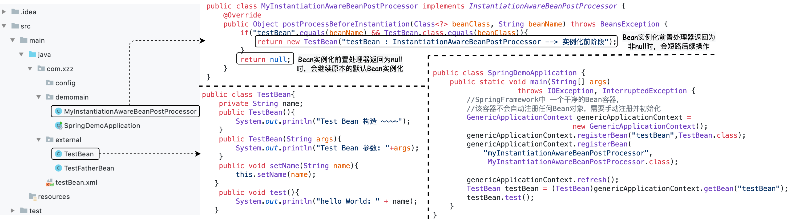

## 三. Java *Spring* 基础

&emsp;&emsp;广义的 *Spring* 是指整个 *Spring* 生态以及全部项目，包括*Spring Boot*、*Spring Cloud*等等，可以看作一个生态体系，而狭义的 *Spring* 就是指 *Spring Framework*，其他的项目比如*Spring Boot*、*Sping Cloud*等等都是以 *Spring Framework* ( 以下简称为 Spring ) 作为基础演变而来。


> <font color=SlateBlue>  <u>**Q1. *Spring* 的设计初衷 ？**</u></font>
> &emsp;&emsp; *Spring* 的设计初衷是降低企业级应用开发的复杂性，简化开发，基于这一初衷，Spring 采取了4个关键策略：
> &emsp;&emsp;  ① 基于POJO的轻量级和最小侵入性编程 -> Bean； 
> &emsp;&emsp;  ② 通过依赖注入和面向接口实现松耦合   -> DI；
> &emsp;&emsp;  ③ 基于切面和惯性实现声明式编程		  -> IoC；
> &emsp;&emsp;  ④ 通过切面和模板减少样板式代码		  -> IoC；

&emsp;&emsp; Spring 的本质是针对 *Bean* 的生命周期进行管理的轻量级容器。Spring通过核心的 *Bean factory* 实现了底层的类的实例化和生命周期的管理。在整个框架中，各类型的功能被抽象成一个个的*Bean*，这样就可以实现各种功能的管理，包括动态加载和切面编程。Spring 框架是一个分层架构，由7个定义良好的模块组成。Spring模块构建在核心容器之上，核心容器定义了创建、配置和管理 Bean 的方式。
&emsp; &emsp; ● 核心容器 - Core：核心容器提供 Spring 框架的基本功能。核心容器的主要组件是 *BeanFactory*，它采用工厂模式实现。*BeanFactory* 使用控制翻转 IoC 思想将应用程序的配置和依赖性规范与实际的应用程序代码分开。同时通过 *Spring Context* 上下文向 Spring 框架提供上下文信息。
&emsp; &emsp; ● 面向切面 - AOP：通过配置管理特性，*Spring AOP* 模块直接将面向切面的编程功能集成到了 Spring 框架中。所以，可以很容易地使 Spring 框架管理的任何对象支持AOP。Spring AOP 模块为基于 Spring 的应用程序中的对象提供了**事务管理服务**。通过使用 Spring AOP，不用依赖 EJB 组件，就可以将声明性事务管理集成到应用程序中。
&emsp; &emsp; ● Spring Web ：*Web* 上下文模块建立在应用程序上下文模块之上，为基于 *Web* 的应用程序提供了上下文。所以，Spring 框架支持与 *Struts* 的集成。
&emsp; &emsp; ● Spring ORM：负责框架中对象关系映射，提供相关 *ORM* 接入框架的关系对象管理工具。Spring 框架插入了若干个 *ORM* 框架，从而提供了 *ORM* 的对象关系工具，其中包括 *JDO*、*Hibernate*和 *iBatis* 。所有这些都遵从 Spring 的通用事务和 DAO 异常层次结构。


### 3.1 IoC 与 DI 

#### 3.1.1 *DI* 技术 (依赖注入)

&emsp;    Spring 的本质是一个 *Bean* 工厂 ( *BeanFactory* ) 或者说是 *Bean* 容器，它按照我们的要求，生产我们需要的各种各样的 *Bean* 对象，在生产 *Bean* 的过程中，需要解决 *Bean* 之间问题，因此引入了依赖注入。 所谓依赖，是指一个类 *Class A*，一个类 *Class B*，如果A中的某个方法需要引用B，则称 *Class A* 依赖 *Class B*。这种依赖关系导致了在 *Class A* 的整个生命周期中，需要去维护引用的 *Class B*，这样大大增加了代码之间的耦合程度。 为了降低耦合度，更加清晰的描述对象与对象之间的依赖关系，提出了依赖注入的原则，其核心思想就是要<font color=red>将这种具体类之间的依赖，转换成抽象依赖，**对象被动的接受依赖类而不是自己主动的去查找依赖类**，即对象不是从容器中查找它的依赖类，而是容器实例化对象时主动将对象的依赖类注入给该对象</font>。<font color=green>**依赖注入的目的并非为软件系统带来更多功能，而是为了提升组件重用的频率，并为系统搭建一个灵活、可扩展的平台**。</font>
&emsp;&emsp;常用的依赖注入方式有三种：<font color=red>**构造方法注入，`setter( )` 方法注入，基于接口注入**</font>
&emsp;&emsp;① 构造方法注入：基于构造函数，实现特定参数的构造函数，在新建对象时传入所依赖的对象。
&emsp;&emsp;② `setter( )` 方法注入：基于 `setter()`方法，实现特定属性的 public set 方法，让外部容器调用传入所依赖的对象。
&emsp;&emsp;③ 接口注入：实现特定接口，以供外部容器注入所依赖类型的对象。


#### 3.1.2  *IoC* 

&emsp;&emsp;IoC 不是什么技术，而是一种<font color=green>**设计思想**</font>，指导如何设计出松耦合。传统应用程序都是由我们在类内部主动创建依赖对象，从而导致类与类之间高耦合；有了IoC容器后，把<font color=red>**创建和查找依赖对象的控制权交给了 IoC 容器**</font>，由IoC容器进行注入组合对象，在开发过程中不在需要关注对象的创建和生命周期的管理，所以对象与对象之间是松散耦合。对于Spring生态来说，IoC是Spring框架的核心，**由 Spring 来负责控制对象的生命周期和对象间的关系，IoC容器负责实例化、定位、配置应用程序中的对象及建立这些对象间的依赖**。


### 3.2 Spring Bean

&emsp;&emsp;在 Spring 中，由<font color=red>**IoC容器管理的组成应用程序的对象称为 *Spring Bean***</font>，*Spring Bean*就是由IoC容器初始化、装配及管理的对象。*Spring Bean* 与IoC容器的关系如下图所示：


> <font color=SlateBlue>  <u>**Q1. *JavaBean* 与 *Spring Bean* 的区别 ？**</u></font>
> &emsp;&emsp;① *JavaBean* 是指一种遵循特定规则的Java类，符合这个规则的类都可以称为 *JavaBean*，也可以说 *JavaBean* 是一种Java语言编写的可重用“组件”，即**一次编写，任何地方执行，任何地方重用**。一个类可以称为 *JavaBean* 必须遵守以下几个规则：
> &emsp; &emsp; ● 类中的所有属性均为 *private*；
> &emsp; &emsp; ● 类中要提供默认构造方法；
> &emsp; &emsp; ● 对于类中的所有属性，要提供 *getter* 方法和 *setter* 方法；
> &emsp; &emsp; ● 该类要实现 *serializable* 接口；
> &emsp;&emsp;② *SpringBean* 是受 *Spring* 管理的对象  所有能受 *Spring* 容器管理的对象都可以成为 *SpringBean*.
> &emsp;&emsp;③ 两者<font color=red>**用处不同**</font>：传统 *Javabean* 更多地作为值传递参数，而 *Spring* 中的 *Bean* 用处几乎无处不在，任何组件都可以被称为 *Bean*。
> &emsp;&emsp;④ 两者<font color=red>**写法不同**</font>：传统 *Javabean* 作为值对象，要求遵守 *JavaBean* 的规则；但 *Spring* 中的 Bean只需为接受设值注入的属性提供 *setter* 方法。
> &emsp;&emsp;⑤ 两者<font color=red>**生命周期不同**</font>：传统 *Javabean* 作为值对象传递，不接受任何容器管理其生命周期；*Spring* 中的 *Bean* 有 *Spring* 管理其生命周期行为。

#### 3.2.1  *Bean* 生命周期

&emsp;&emsp;  *Spring Bean* 的生命周期指的是从一个普通的 *Java* 类变成 *Bean* 对象的过程。*Spring bean* 的生命周期非常重要 ，几乎所有跟 Spring 整合的框架，如Mybatis 、Dubbo 等框架基本上都是通过 *Bean* 的生命周期来实现跟 Spring 的整合。


&emsp;&emsp; 在Spring中，从 *Bean* 的生成到注册到 IoC容器中一共分为以下几个环节，每个环节中Spring都提供了一些扩展点供第三方进行功能扩展。生命周期的流程如下图所示：


​                    ----------------------------------------------------------------------------------------------------------------------------------------------------                           

&emsp;&emsp;在 *DefaultListableBeanFactory* 类中有个重要的字段：<font color=red>**`private final List<BeanPostProcessor> beanPostProcessors = new CopyOnWriteArrayList<>()`**</font>，该字段是 *BeanPostProcessor* 接口的集合，*BeanPostProcessor* 接口提供了很多方法，Spring在 *Bean* 生命周期的不同阶段调用列表中的 *BeanPostProcessor* 中的方法来对生命周期进行扩展。**Bean生命周期中的所有扩展点都是依靠这个集合中的 *BeanPostProcessor* 来实现的。**

##### 1. *Bean* 元信息环节

&emsp;&emsp;  *Bean* 的元信息环节主要分为两个步骤： ***Bean* 元信息的配置** 与 ***Bean*元信息的解析**。在Spring容器启动时，会按照 *Bean* 的声明方式 ( *xml* 配置 / *@Bean*注解 / *@Component* 注解 / *Properties* 资源配置 ) 去读取声明的 *Bean* 信息，然后解析声明的信息，并封装在<font color=red> ***BeanDefinition***</font> 对象里面。在后续环节，*Bean* 工厂就会根据 *BeanDefinition* 对象的信息，生产一个 *Bean* 实例，并对 *Bean* 进行实例化、初始化等等操作。
&emsp;&emsp;  *BeanDefinition* 是一个接口，包含了 *Bean* 定义的各种信息，如：*Bean* 对应的 *class* 类型、*Bean* 的作用域 *scope*、*Bean* 懒加载信息 *lazy*、*Bean* 的依赖等信息。在Spring 容器中，存储的就是每个 *Bean* 对应的 *BeanDefinition* 对象。


###### (1).  ***Bean* 元信息的解析**

&emsp;&emsp;  *Bean* 元信息的解析的目的是**根据配置的 *Bean* 元信息，通过解析后生成 *BeanDefinition* 对象**。针对不同的 *Bean* 注册方式，相应的提供了的不同的 *Bean* 解析方式，Bean元信息的解析主要依赖于 ***BeanDefinitionReader* 体系**。*BeanDefinitionReader* 体系有三个实现类，分别对应3种元数据解析方式：Xml文件定义 *Bean* 的解析 *XmlBeanDefinitionReader*、*properties* 文件定义 *Bean*的解析 *PropertiesBeanDefinitionReader*、通过注解方式定义 *Bean* 的解析。


##### 2. *Spring Bean* 注册环节

&emsp;&emsp;  Spring Bean的注册环节是<font color=green>**将解析后的 *BeanDefinition* 对象注册到 IoC 容器当中**</font>，以便于后续由 Spring Bean 工厂 - *BeanFactory* 对容器中的 *BeanDefinition* 进行实例化，建立这些对象间的依赖关系，即 *BeanDefinition* -> Spring 容器 -> *BeanFactory*。Spring Bean 的注册依赖于*Bean*注册器 - *BeanDefinitionRegistry* 接口，该接口定义了关于 *BeanDefinition* 的注册，移除，查询等操作。*BeanDefinition* 注册完成之后交由 *BeanFactory* 接口的 *Bean* 工厂进行管理。因此，Bean的注册器 *BeanDefinitionRegistry* 与 Bean工厂 *BeanFactory* 有一个共同的实现类 ***DefaultListableBeanFactory***。 *DefaultListableBeanFactory* 的类关系图如下所示：


&emsp;&emsp;   在 *Bean* 注册到容器时，由于定义 *Bean* 的时候有父子 *Bean* 关系，此时子 *BeanDefinition* 中的信息是不完整的，比如设置属性的时候配置在父 *BeanDefinition* 中，此时子 *BeanDefinition* 中是没有这些信息的，需要将子 *Bean* 的 *BeanDefinition* 和父 *Bean* 的 *BeanDefinition* 进行合并，同时 *Bean* 定义可能存在多级父子关系，合并的时候进进行递归合并，最终得到一个包含完整信息的 *RootBeanDefinition*，*RootBeanDefinition* 包含 *Bean* 定义的所有信息，也包含了从父 *Bean* 中继继承过来的所有信息，后续 *Bean* 的所有创建工作就是依靠合并之后 *BeanDefinition* 来进行的。

###### (1). ***Bean* 注册方式**

&emsp;&emsp; Spring Bean的注册方式就是 Bean 元信息的配置方式，其注册方式分为以下几种方式，其中 *BeanFactoryPostProcessor* 为 *Bean* 工厂后置处理器，*BeanDefinitionRegistryPostProcessor* 为 *Bean* 注册后置处理器，*FactoryBean* 是在调用 `getObject()` 对 *Bean* 进行实例化的同时注册到容器中。


▨  **基于 *XML* 配置 *Bean***

&emsp;&emsp;  基于 *XML* 文件配置 *Bean* 对象，通过` <bean id="...", class="..."/>` 来标注 *Bean* 对象及其对应的类。在Spring中，可以通过 *ClassPathXmlApplicationContext* 来获取通过XML文件配置的 *Bean* 对象容器。基于 *XML* 配置 *Bean* 是Spring最早支持的方式，现在基本上不在使用 xml 的方式来配置 *Bean*。


▨  **使用注解 *@Component* + *@ComponentScan* 方式注册 *Bean***

&emsp;&emsp; 使用 *XML* 文件进行配置时，*Bean* 定义信息和 *Bean* 实现类本身是分离的，同时大量的配置信息会导致配置文件臃肿。为了解决这一问题，在Spring 2.5中开始支持**基于 *@Component* 注解的配置方式，在需要加载到IoC容器的 *Bean* 实现类上标注 *@Component* 注解**，即可表示将此类标记为Spring容器中的一个 *Bean*。Spring自带四种 *Bean* 注解：*@Component* 注解及扩展 *@Repository*、*@Service*、*@Controller*。


&emsp;&emsp; 定义Spring Bean的第一步是使用注解 *@Component* / *@Service* / *@Repository* / *@Controller*， 但是将 *Bean* 加载到IoC容器时，Spring还需要知道这些*Bean* 实现类是定义在哪些 *package* 包中。**<font color=green>默认情况下，在Spring启动过程中，Spring 只能扫描到 *@SpringBootApplication* 注解标注的启动类所在的包及其下级包中的*Bean*，定义在其他包中的 *Bean* 是无法被Spring扫描，也就无法加载到IoC容器中。因此，如果项目中所有的类都定义在启动类的包及其子包下，则不需要指定被扫描的包路径，如果存在一些类不在启动类的包及其子包下，通常在启动类中会使用 *@ComponentScan* 注解来标注哪些包需要被扫描的，被扫描到的包，包中的 *Bean* 就可以加载到IoC容器中</font>。**需要注意的是，<font color=red>**一旦通过 *@ComponentScan* 指定了需要扫描的包路径，Spring将会在被指定的包及其下级包中寻找*Bean*，框架原始的默认扫描效果就无效了**</font>。


▨ **基于 *@Configuration* 配置类 + *@Bean* 注册 *Bean* 信息**

&emsp;&emsp;  如果项目中有使用到第三方类库中的工具类时，我们是无法修改第三方打包好的类库。对此，Spring提供了 `@Configuration` 注解，<font color=green>**`@Configuration `标注在类上，相当于把该类作为 Spring 的 Xml 配置文件中的`<beans>`来配置 Spring 容器**。</font>同时被注解的类内部包含有一个或多个被 *@Bean* 注解的方法，这些方法将会被 `AnnotationConfigApplicationContext` 或 `AnnotationConfigWebApplicationContext` 类进行扫描，构建并定义 *Bean*对象，初始化Spring容器。

> <font color=SlateBlue>  <u>**Q1. @Component 与 @Bean 的区别 ？**</u></font>
> &emsp;&emsp;*@Component* 和 *@Bean* 的目的是一样的，都是注册 *Bean* 到IoC容器中。但两者在使用上存在以下区别：
> &emsp; &emsp; ● *@Component* 作用在类上，通过类路径扫描 *@ComponentScan* 自动检测并注入到Spring容器中;
> &emsp; &emsp; ● *@Bean* 不能注释在类上，只能用于在配置类中显式声明单个Bean。在应用开发的过程中，如果想要将第三方库中未装配到IoC的组件装配到IoC中，由于第三方库是已经封装好的，在这种情况下，是没有办法在它的类上添加 *@Component* 注解的，因此就不能使用自动化装配的方案，仅能在*@Configuration* 配置类中通过 *@Bean* 进行配置。


▨ **基于 *@Import* 方式注册 *Bean* 信息**
&emsp;&emsp;  基于 *@Import* 注解提供了三种注册 *Bean* 的方法：
&emsp; &emsp;   ① *@Import* 一个普通的类，Spring会将该类加载到 Spring 容器中;


&emsp; &emsp;   ② *@Import* 一个类，该类实现了 *ImportBeanDefinitionRegistrar* 接口，在重写的 `registerBeanDefinitions()` 方法里面，能拿到 *BeanDefinitionRegistry* 的注册器，通过 *BeanDefinitionRegistry* 注册器能手动往 *beanDefinitionMap* 中注册 *beanDefinition*；
&emsp; &emsp;   ③ *@Import* 一个类，该类实现了 *ImportSelector* 接口并重写 `selectImports()` 方法。该方法返回了 *String[ ]* 数组的对象，数组里面的类都会注入到Spring 容器当中；

###### (2). ***Bean* 注册后置处理器**

&emsp;&emsp;   后置处理器 ( *PostProcessor* ) 作为 *Spring* 框架的重要扩展点，可以通过扩展点实现自定义信息的处理。在 Bean 的注册阶段，有两个后置处理器，分别是：***Bean* 注册器后置处理器 - *BeanDefinitionRegistryPostProcessor***、***Bean* 工厂后置处理器 - *BeanFactoryPostProcessor***


&emsp;&emsp;   **①  注册器后置处理器 - *BeanDefinitionRegistryPostProcessor***：*BeanDefinitionRegistryPostProcessor* 继承了*BeanFactoryPostProcessor*，其注册时机是<font color=green>**在 *Bean* 定义之后，调用构造函数实例化之前执行**，主要作用是**用来注册更多的 *Bean* 到 *Spring* 容器中**</font>，可以通过其 `postProcessBeanDefinitionRegistry()` 方法的入参 `registry` 来完成对 *BeanDefinition* 的判断、注册、移除等操作，可以实现动态的注册 *BeanDefinition*。

```java
static class MyBeanDefinitionRegistryPostProcessor implements BeanDefinitionRegistryPostProcessor{
        @Override
        public void postProcessBeanDefinitionRegistry(BeanDefinitionRegistry registry) throws BeansException {
            //自定义Bean的注册
            BeanDefinition beanDefinition = BeanDefinitionBuilder.genericBeanDefinition(TestBean.class).getBeanDefinition();
            beanDefinition.getPropertyValues().add("name","自定义Bean注册");
            beanDefinition.getPropertyValues().add("age",100);
            registry.registerBeanDefinition("testSelfBeanDefinition",beanDefinition);
        } 
}
```

&emsp;&emsp;   **②  工厂后置处理器 - *BeanFactoryPostProcessor***：*BeanFactoryPostProcessor* 的注册时机是<font color=green>**在 *Bean* 定义之后，调用构造函数实例化之前执行**，主要作用是**用来对Bean定义进行一些改变**</font>，可以通过其 `postProcessBeanFactory()` 方法的入参 `beanFactory` 来对 *Bean* 定义的属性进行修改，定义改变之后，创建的 *Bean* 实例也会发生改变。


##### 3. *Spring Bean* 实例化环节

&emsp;&emsp;   *Bean* 的实例化是 *Bean* 对象创建的过程，会为 *Bean* 对象在内存中分配空间。在整个实例化过程中，共分为三个阶段：**实例化前阶段、实例化阶段、实例化后阶段**。


​                    ----------------------------------------------------------------------------------------------------------------------------------------------------                           


###### (1). 实例化前阶段

&emsp;&emsp;  *Bean* 实例化前阶段是 Spring 的一个扩展点，在目标 *Bean* 开始实例化前会触发该扩展点，并会调用实现 *InstantiationAwareBeanPostProcessor* 接口的 `postProcessBeforeInstantiation()` 方法。由于这个时候目标 *Bean* 对象还未实例化，所以在 `postProcessBeforeInstantiation()` 方法中可以通过代理对象实例来代替原本应该生成的目标对象的实例。<font color=red>**如果此方法返回非 *null* 对象，则 *Bean* 实例化过程将被短路，正常 *Bean* 实例化的后续流程不再执行**，后续只有初始化后阶段的`postProcessAfterInitialization()` 方法会调用，其它方法不再调用。</font>



###### (2). 实例化阶段

&emsp;&emsp;  Spring Bean 实例化方法有四种：使用构造方法实例化 *Bean* ( 最常用 )、使用静态工厂实例化 *Bean*、使用实例工厂实例化 *Bean*、使用 *FactoryBean* 实例化 *Bean*。
&emsp;  &emsp;  **① 构造方法实例化**：通过无参构造的方法实例化 *Bean*，其实质是将 *Bean* 对应的类交给 Spring 自带的工厂 *BeanFactory* 来管理，由Spring自带的工厂模式帮我们创建和维护这个类。
&emsp;  &emsp;  **② 静态工厂实例化**：通过静态工厂创建并返回 *Bean*。其实质是将 *Bean* 对应的类交给我们自己的静态工厂管理。Spring只是帮我们调用了静态工厂创建实例的方法。在很多时候我们在使用第三方jar包提供给我们的类时，由于这个类没有构造方法，是通过第三方包提供的静态工厂创建的，如果我们想把第三方jar包里面的这个类交由Spring来管理的话，就可以使用Spring提供的静态工厂创建实例的配置。
&emsp;  &emsp;  **③ 实例工厂实例化**：通过实例工厂创建并返回 *Bean*，其实质就是把创建实例的工厂类和调用工厂类的方法创建实例的方法的过程也交由Spring管理，创建实例的这个过程也是由我们自己配置的实例工厂内部实现的。如 Spring 整合 *Hibernate* 就是通过这种方式实现的。但对于没有与 Spring 整合过的工厂类，我们一般都是自己用代码来管理的。
&emsp;  &emsp;  ④ <font color=red>***FactoryBean* 实例化：**</font> *FactoryBean* 实例化是 Spring IoC 容器Bean实例化逻辑的一个扩展点，是 Spring 提供的一种整合第三方框架的常用机制，其本身也是一个**特殊的 *Bean***，其作用是<font color=red>**允许自定义一个对象通过 *FactoryBean* 的 `getObject()` 方法间接的放到 Spring 容器中成为一个 *Bean***</font>。例如：在使用Mybatis的时候，我们定义的 *Dao* 层都是接口，但是在 Spring 容器中是存在对应的 *Bean* 对象，这里就是用了 *FactoryBean* 进行注册的。因此，如果有复杂的初始化 *Bean* 逻辑，则可以选择创建自定义 *FactoryBean*，在该类中的 `getObject()` 方法中进行初始化逻辑，即可把自定义 *FactoryBean* 注入到容器中。在Spring中当一个 *Bean* 的类型是 *FactoryBean* ，此时实例化时候就会执行该对象的 `getObject()` 方法来进行实例化。<font color=green>在获取 *Bean* 对象的时候，在 *beanName* 前面加上 & 符号，则会拿到 *factoryBean* 自身的对象了，而不是`getObject()` 返回的 *Bean* 对象。</font>


###### (3). *Bean* 元信息获取

&emsp;&emsp;  在 Bean 完成实例化后，此时还没有进行后续的 *Bean* 属性注入、初始化等流程。Spring 通过回调 *MergedBeanDefinitionPostProcessor* 的`postProcessMergedBeanDefinition()` 方法对一些元信息 (主要是 *Bean* 类上的注解) 做了收集维护处理，如*@Autowire*、*@Resource*、*@PostConstruct* 和 *@PreDestroy* 等，为后续 *Bean* 属性注入做准备。

```java
@Component
static class MyMergedBeanDefinitionPostProcessor implements MergedBeanDefinitionPostProcessor {
    @Override
    public void postProcessMergedBeanDefinition(RootBeanDefinition beanDefinition, Class<?> beanType, String beanName) {
        if ("beanLifeCycle".equals(beanName)) {
            log.info(">>>>>>>>>>元信息收集 ，MergedBeanDefinitionPostProcessor#postProcessMergedBeanDefinition(RootBeanDefinition beanDefinition, Class<?> beanType, String beanName) nbeanDefinition = [{}]n,beanType = [{}],beanName = [{}]n", beanDefinition, beanType, beanName);
        }
    }
}
```

###### (4). 实例化后阶段

&emsp;&emsp;   *Bean* 实例化后阶段也是 Spring 的一个扩展点。在该环节时，对象已经被实例化但是该实例的属性还未被设置，都是null。*Bean* 实例化后阶段主要作用是一个**属性获取控制器**。在目标对象实例化之后会调用实现 *InstantiationAwareBeanPostProcessor* 接口的 `postProcessAfterInstantiation()` 方法。<font color=red>`postProcessAfterInstantiation()` 方法的返回值会决定要不要调用 `postProcessProperties()` 方法，如果该方法返回 *false*，那么 `postProcessProperties()` 方法就会被忽略不执行；如果返回 *true*，`postProcessProperties()` 就会被执行，通过 `postProcessProperties()` 方法可以对 *Bean* 对象的实例属性进行设置。</font>注意：`postProcessProperties()` 方法主要用来对 XML 配置 *Bean* 方式的 \<property> 标签定义的属性进行处理。


###### (5). 实例化后 *Bean* 属性赋值阶段

&emsp;&emsp;  经过实例化后阶段，*Bean* 对象已经被实例化，且对 *Bean* 的属性进行了前置的处理，随后就需要对Bean对象的属性进行赋值，即循环处理 *PropertyValues* 中的属性值信息，通过**反射调用 set 方法将属性的值设置到 *Bean* 实例中**。*PropertyValues* 中的值是通过 Bean xml中\<property> 元素配置的，或者调用 *MutablePropertyValues* 中 add 方法设置的属性值。

##### 4. *Spring Bean* 初始化环节

&emsp;&emsp;  *Bean* 初始化是为 *Bean* 对象中的属性赋值。Bean 初始化分为以下五个阶段：***Bean Aware* 接口回调、*Bean* 初始化前操作、*Bean* 初始化、*Bean* 初始化后操作、*Bean* 初始化完成操作**。


###### (1). *Bean Aware* 接口回调

&emsp;&emsp;  *Aware* 接口是一个具有标识作用的接口，其含义是“感知捕获”，主要作用是辅助 *Spring Bean* 访问 Spring 容器，并拿到 *Spring* 容器内部的一些资源。单纯的 *Bean* 都未实现 *Aware* 接口，这时的 *Bean* 对 *Spring* 容器是没有感知的。对于实现了 *Aware* 接口的 *Bean* 可以访问 Spring 容器，*Aware* 接口增强了 *Spring Bean* 的功能，但是也会造成 *Bean* 对 *Spring* 框架的绑定，增大了与 *Spring* 框架的耦合度。常见的 Aware 接口如下：


###### (2). *Bean* 初始化前操作

&emsp;&emsp;  *Bean* 初始化前阶段是 Spring 的一个扩展点，在目标 *Bean* 实例化、依赖注入完毕，开始初始化前会触发该扩展点。通过调用实现 *BeanPostProcessor* 接口的 `postProcessBeforeInitialization()` 方法，完成一些自定义的初始化逻辑。<font color=green>**`postProcessBeforeInitialization()` 方法返回值不能为 *NULL*** </font>，如果返回 *NULL* 会使得从Spring IoC容器中取出 Bean 实例对象没有再次放回IoC容器中，从而导致后续初始化方法会报空指针异常或者通过 `getBean()`方法获取不到 *Bean* 实例。

```java
public interface BeanPostProcessor {
    @Nullable
    default Object postProcessBeforeInitialization(Object bean, String beanName) throws BeansException {
        return bean;  //初始化前操作，返回值不能为NULL
    }
} 
```

###### (3). *Bean* 初始化

**▨  *Bean* 初始化方式：**

&emsp;&emsp;*Bean* 的初始化有两种初始化方式：<font color=red>**实时初始化、延迟初始化**</font>
&emsp; &emsp; ①  **实时初始化**：在容器启动过程中被创建组装好的 *Bean*，称为实时初始化的 *Bean*，Spring中默认定义的 *Bean* 都是实时初始化的 *Bean*，这些 *Bean* 默认都是单例的，在容器启动过程中会被创建好，然后放在Spring容器中以供使用。但是如果程序中定义的 *Bean* 非常多，并且有些 *Bean* 创建的过程中比较耗时的时候，会导致系统消耗的资源比较多，会让整个启动时间比较长。实时初始化的 *Bean* 有以下优点：
&emsp; &emsp; &emsp;  ● 更早的发现 *Bean* 定义的错误：实时初始化的 *Bean* 如果定义有问题，会在容器启动过程中会抛出异常。
&emsp; &emsp; &emsp;  ● *Bean* 的查找速度更快：容器启动完成后，实时初始化的 *Bean* 已经创建完成，并缓存到Spring容器中，当我们使用时，容器直接获取 *Bean* 即可。
&emsp; &emsp; ②  **延迟初始化**：和实时初始化刚好相反，延迟初始化的 *Bean* 在容器启动过程中不会创建，而是需要使用的时候才会去创建。当 *Bean* 被其他 *Bean* 作为依赖进行注入的时候( 如：通过构造器注入、通过setter注入、通过自动注入 ) 会导致被依赖Bean的创建，或者通过Spring 容器的 `getBean()` 方法获取Bean 时也会导致 *Bean* 的创建。延迟初始化的 Bean 无法在程序启动过程中发现 *Bean* 定义的问题，只有在创建 *Bean* 的时候 *Bean* 定义的问题才会暴露。

**▨  *Bean* 初始化步骤：**

&emsp;&emsp; *Bean* 的初始化方法为 `invokeInitMethods()`。 Bean 初始化分为两个步骤：
&emsp;  &emsp;  ① 如果 *Bean* 对应的 Class 实现了 *InitializingBean* 接口，则会执行 `afterPropertiesSet()`方法；

```java
public class TestInitializingBean implements InitializingBean {
    @Override
    public void afterPropertiesSet() throws Exception {
        System.out.println("TestInitializingBean");
    }
}
```
&emsp;  &emsp;  ② 如果 *Bean* 的 Class 不是 *NullBean* 会执行 `initMethodName()`方法，该方法会调用定义 *Bean* 的时候指定的初始化方法，如 `@Bean(initMethod="")` 或 \<bean> 标签 *init-method* 属性指定；

###### (4). *Bean* 初始化后操作

&emsp;&emsp; 在目标 *Bean* 初始化后会触发该扩展点，通过调用实现 *BeanPostProcessor* 接口的 `postProcessAfterInitialization()` 方法，完成一些自定义的初始化逻辑。<font color=green>**`postProcessAfterInitialization()` 方法返回值不能为 *NULL*** </font>，如果返回 *NULL* 会使得从Spring IoC容器中取出 Bean 实例对象没有再次放回IoC容器中，从而导致后续初始化方法会报空指针异常或者通过 `getBean()`方法获取不到 *Bean* 实例。

```java
public interface BeanPostProcessor {
     @Nullable
    default Object postProcessAfterInitialization(Object bean, String beanName) throws BeansException {
        return bean;	//初始化后操作，返回值不能为NULL
    }
} 
```

##### 5. *Spring Bean* 销毁环节

###### (1). *Bean* 销毁方式

&emsp;  &emsp; 在 *Bean* 的生命周期中，在完成了 *Bean* 的创建之后，会注册 *Bean* 销毁的逻辑。在Spring容器关闭的时候，会去销毁所有的单例 *Bean*，并不是只有注册了销毁逻辑的 *Bean* 才被销毁，注册了销毁逻辑的单例 *Bean* 在销毁之前，会调用它们注册的销毁逻辑。*Bean* 的销毁有三种方式：
&emsp;   &emsp;  ① 在 *Bean* 对象中添加销毁方法，并在方法上标注 *@preDestory* 注解，该方式是标准的 *Bean* 销毁方式。
&emsp;   &emsp;  ② *Bean* 对象实现 *DisposableBean* 接口，并重写 `destroy()` 方法。
&emsp;   &emsp;  ③ 自定义销毁方法，包括 Xml 配置 ( 如：在Xml的 Bean 配置下增加 *destroy-method* 属性 -->` <bean destroy-method="bean中方法名称"/>` )、Java 注解 ( 如: 在注解 *@Bean* 中指定属性 *destoryMethod* --> ``@Bean(destroyMethod = "初始化的方法")``)、API方式指定销毁方法 ( 如：通过 *BeanDefinition* 的方法 `setDestroyMethodName()` 设置  --> `this.beanDefinition.setDestroyMethodName(methodName)`)

```java
@Bean(initMethod = "init", destroyMethod = "destroyMethod")
public BeanLifeCycle beanLifeCycle() {
     return new BeanLifeCycle();
}

public class BeanLifeCycle implements InitializingBean, MyAware, DisposableBean {
    //Bean销毁方式1：通过@Bean注解方式定义
    public void destroyMethod() {
        log.info("          BeanLifeCycle destroy-method");
    }

    //Bean销毁方式2：通过注解@PreDestroy方式
    @PreDestroy
    public void preDestory(){
        log.info("          BeanLifeCycle DisposableBean-preDestory");
    }

    //Bean销毁方式3：Bean对象实现DisposableBean接口，并重写destroy()方法
    @Override
    public void destroy() {
        log.info("          BeanLifeCycle DisposableBean-destroy");
    }
}
```

###### (2). *Bean* 销毁流程

&emsp; &emsp; 在Spring容器关闭过程时，会对Bean进行销毁。
&emsp;  &emsp;  ① 首先发布 *ContextClosedEvent* 事件；
&emsp;  &emsp;  ② 其次调用 *lifecycleProcessor* 的 `onCloese()` 方法；
&emsp;  &emsp;  ③ 销毁单例 *Bean*，首先会在 `destroySingletons()` 方法中取出在缓存中存储的 *disposableBeans*，随后遍历 *disposableBeans*，把每个 *disposableBean* 从单例池中移除，调用 *disposableBean* 的 `destroy()`进行销毁。
&emsp;     &emsp;   ●  如果这个 *disposableBean* 还被其他 *Bean* 依赖了，那么也会销毁其他 *Bean*。
&emsp;     &emsp;   ●  如果这个 *disposableBean* 还包含了内部 *Beans*，将这些 *Bean* 从单例池中移除掉。
&emsp;  &emsp;  ④ 清空 *manualSingletonNames*，这是一个Set，存放的是用户手动注册的单例 *Bean* 的 *beanName*
&emsp;  &emsp;  ⑤ 清空 *allBeanNamesByType*，是一个Map，key是bean类型，value是该类型所有的 *beanName* 数组
&emsp;  &emsp;  ⑥ 清空 *singletonBeanNamesByType*，和 *allBeanNamesByType* 类似，只不过只存了单例 *Bean*


#### 3.1.2  *Bean* 的注入

&emsp;&emsp; 配置完Bean类后，IoC容器启动时，会根据配置将Bean类实例化，并”注册“到IoC容器当中。当应用程序需要使用Bean类时，通过 ***Bean* 注入**的方式，将 *Bean* 的初始化后的对象注入到程序中，从而在程序中可以不创建对象就直接使用 *Bean*。对于 *Bean* 的注入有两种方式：**XML配置注入** ( 属性注入、构造函数注入和工厂方法注入) 和 **注解注入** ( *@Autowired、@Resource、@Required* )。

##### 1. XML配置注入

&emsp;&emsp; **● 属性注入**：属性注入通过 `setter()` 方法注入 *Bean* 的属性值或依赖。属性注入要求 *Bean* 提供一个默认的**构造函数**，并为需要注入的属性提供对应的`setter()` 方法。<font color=green>Spring先调用 *Bean* 的默认构造函数实例化 *Bean* 对象，然后通过反射的方式调用 `setter()` 方法注入属性值。</font>
&emsp;&emsp; **● 构造方法注入**：使用构造函数注入的前提是 *Bean* 必须提供带参数的构造函数
&emsp;&emsp; **● 工厂方法注入**：工厂类负责创建一个或多个目标类实例，工厂类方法一般以接口或抽象类变量的形式返回目标类实例。非静态工厂方法，必须实例化工厂类后才能调用工厂方法。静态工厂方法，无须创建工厂类实例就可以调用工厂类方法。

```java
package com.xzz.demo;
import org.springframework.beans.factory.BeanNameAware;
// Bean类
public class Service implements BeanNameAware{
    private LogDao logDao;
    private UserDao userDao;

  	public LogonService(LogDao logDao, UserDao userDao) {  //构造方法注入
        this.logDao = logDao;
        this.userDao = userDao;
    }
  
    public void setUserDao(UserDao userDao) {    //属性注入 - setter方法注入
        this.userDao = userDao;
    }
    public void setLogDao(LogDao logDao) {
        this.logDao = logDao;
    }   
    public LogDao getLogDao() {
        return logDao;
    }
    public UserDao getUserDao() {
        return userDao;
    }    
}
```

```xml
// bean.xml配置文件
<?xml version="1.0" encoding="UTF-8" ?>
<beans xmlns="http://www.springframework.org/schema/beans"
    xmlns:xsi="http://www.w3.org/2001/XMLSchema-instance" 
    xmlns:context="http://www.springframework.org/schema/context"
    xsi:schemaLocation="http://www.springframework.org/schema/beans 
         http://www.springframework.org/schema/beans/spring-beans-3.0.xsd
         http://www.springframework.org/schema/context
         http://www.springframework.org/schema/context/spring-context-3.0.xsd"
       default-autowire="byName">
  	<!-- 注册Bean -->
    <bean id="logDao" class="com.xzz.demo.LogDao"/>
    <bean id="userDao" class="com.xzz.demo.UserDao"/>
  
    <bean class="com.xzz.demo.Service">   <!-- 属性注入 -->
       <property name="logDao" ref="logDao"></property>
       <property name="userDao" ref="userDao"></property>
    </bean>
  
  	<bean class="com.xzz.demo.Service">   <!-- 构造方法注入 -->
       <constructor-arg ref="logDao"></constructor-arg>
       <constructor-arg ref="userDao"></constructor-arg>
    </bean>
</beans>
```

##### 2. 注解注入

&emsp;&emsp; 同样的XML方式注入需要通过XML配置文件进行配置。为了减少配置文件的”冗余“，Spring提供了<font color=red> *@Autowire* </font>注解实现 *Bean* 的依赖注入。**在使用 *@Autowired* 注解时，注入的 *Bean* 必须是被 Spring 管理的，即 *Bean* 对象已经注册到 Spring IoC 容器中**。

```java
package com.xzz.demo;
import org.springframework.beans.factory.BeanNameAware;
// Bean类
@Service
public class Service implements BeanNameAware{
    @Autowired	 //通过@Autowired注入LogDao的Bean
    private LogDao logDao;
    @Autowired  //通过@Autowired注入UserDao的Bean
  	@Qualifier("userDao")  //通过@Qualifier可以对注入Bean类型进行限定
    private UserDao userDao;

  	public LogonService(LogDao logDao, UserDao userDao) {  //构造方法注入
        this.logDao = logDao;
        this.userDao = userDao;
    }
  
    public void setUserDao(UserDao userDao) {    //属性注入 - setter方法注入
        this.userDao = userDao;
    }
    public void setLogDao(LogDao logDao) {
        this.logDao = logDao;
    }   
    public LogDao getLogDao() {
        return logDao;
    }
    public UserDao getUserDao() {
        return userDao;
    }    
}
```

#### 3.1.3  *Bean* 的特性

#### 3.1.4  *Bean* 的循环依赖

### 3.2 Spring 容器

&emsp;&emsp; Spring 容器又称为IoC容器，是具有依赖注入功能的容器，其本质是**一个对象工厂，通过反射创建 *Bean* 对象**，并负责***Bean* 对象的实例化、*Bean* 对象的初始化，*Bean* 对象之间依赖关系配置、*Bean* 对象的销毁、对外提供 *Bean* 对象的查找**等操作，*Bean* 对象的整个生命周期都是由容器来控制。我们需要使用的 *Bean* 对象都由IoC容器进行管理，不需要我们再去手动通过 *new* 的方式去创建对象，由 IoC容器直接帮我们组装好，当我们需要使用的时候直接从IoC容器中直接获取 (注入) 就可以了。

#### 3.2.1 *Spring* 容器的实现方式

&emsp;&emsp;Spring 提供的 IoC 容器有两种实现方式：
&emsp;&emsp;  ● ***BeanFactory*** 接口：该接口是 Spring 容器最基本的实现，提供了完整的 IoC 服务支持，它主要负责初始化各种 *Bean*，并调用它们的生命周期方法。*BeanFactory* 是 Spring 内部使用的接口，不提供给开发人员使用。
&emsp;&emsp;  ● ***ApplicationContext*** 接口：*BeanFactory* 接口的子接口，也被称为应用上下文，它不仅提供了 *BeanFactory* 的所有功能，还添加了对国际化、资源访问、事件传播等方面的良好支持。*ApplicationContext* 面向 Spring 的使用者，几乎所有场合都使用 *ApplicationContext* 而不是底层的 *BeanFactory*。*ApplicationContext* 容器主要有三个实现类：
&emsp; &emsp;   ① *ClassPathXmlApplicationContext*：该类从类路径 *ClassPath* 中寻找指定的 XML 配置文件，找到并装载完成 *ApplicationContext* 的实例化工作。
&emsp; &emsp;   ② *FileSystemXmlApplicationContext*：该类从指定的文件系统路径中寻找指定的 XML 配置文件，找到并装载完成 *ApplicationContext* 的实例化工作。
&emsp; &emsp;   ③ *AnnotationContigApplicationContext*：用于读取注解创建容器；

### 3.3 Spring 启动流程

&emsp;&emsp;*SpringBoot* 的启动流程主要包含两个步骤: 
&emsp;&emsp;  ● **起步依赖**：通过 *pom* 依赖来解决版本管理和 *jar* 包引用的问题；
&emsp;&emsp;  ● **自动装配**；引入相关的 *jar* 包后，*SpringBoot* 会自动注册一些比较关键的 *Bean*，并进行默认配置，不用我们进行特殊配置。*SpringBoot* 启动依靠的是带有 `main()` 方法的启动类，启动类的内容可以分为两个部分:
&emsp; &emsp;   ① 启动类上*@SpringBootApplication* 这个注解
&emsp; &emsp;   ② `main()` 方法里的 `SpringApplication.run(启动类.class，args)` 方法

#### 3.3.1 *@SpringBootApplication* 注解

&emsp;&emsp; *@SpringBootApplication* 注解主要由三个注解组成 *@ComponentScan*、*@SpringBootConfiguration*、*@EnableAutoConfiguration*。


##### 1. *@EnableAutoConfiguration*

&emsp;&emsp; *@EnableAutoConfiguration* 此注解的作用是从 *classpath* 路径下搜索所有的 *META-INF/spring.factories* 配置文件，然后将其中 Key 为*org.springframework.boot.autoconfigure.EnableAutoConfiguration* 的Value加载到 *Spring* 容器中。*@EnableAutoConfiguration* 注解由 *@Import* + *@AutoConfigurationPackage* 两个注解组成。
&emsp; &emsp;   ① *@AutoConfigurationPackage*：主要作用是自动配置包，并向 Spring 容器中导入组件，导入的组件由 *AutoConfigurationPackages.Registrar.class* 将主配置类所在的包以及下面所有子包里面的所有组件扫描到 *Spring* 容器中。
&emsp; &emsp;   ② *@Import*：主要作用是给 *Spring* 容器导入组件。*@Import* 中的参数 *AutoConfigurationImportSelector* 的作用是导入哪些组件的选择器。将所需要导入的组件以全类名的方式返回数组，这些组件就会被添加到容器中。通过 `selectImports()` 方法，将配置类信息交给 *SpringFactory* 加载器进行一系列的容器创建的过程

##### 2. *@SpringBootConfiguration*

&emsp;&emsp; *@SpringBootConfiguration* (内部为 *@Configuration* )：被标注的类等于在spring的XML配置文件中( *applicationContext.xml* )，装配所有 *Bean* 事务，提供了一个 Spring 的上下文环境。

#### 3.3.2 *SpringApplication* 启动

&emsp;&emsp;  *SpringApplication* 的启动包含两个过程：1.实例化 *SpringApplication* 对象；2.调用 *SpringApplication.run()* 方法。


### 3.4 Spring 统一资源加载策略

&emsp;&emsp; 在 Spring 中有很多 *Xml* 配置文件，同时还包括自己创建的各种 *properties* 资源文件，还有可能进行网络交互，收发各种文件、二进制流等。这些资源粗略可分为：*URL* 资源、*File* 资源、*ClassPath* 相关资源、服务器相关资源。Spring 把这些文件、二进制流统称为资源。程序对这些资源的访问，就叫做资源访问。针对不同的资源文件，其处理资源文件步骤都是相同的：**定义资源、读取资源、关闭资源**。因此 Spring 抽象出一个统一的接口<font color=red> ***Resource*** </font>接口来对这些底层资源进行统一访问，其类关系如下图所示：


#### 3.4.1 Spring 资源的描述与定义

&emsp;&emsp; 针对不同类型的资源，Spring 基于 *Resource* 接口作为**所有资源的抽象和访问接口**，并派生出不同的资源描述类：
&emsp;&emsp; ● ***UrlResource***：代表URL资源，用于简化URL资源访问，是对 *java.net.URL* 的包装。在 Java 中，将不同来源的资源**抽象成URL**，通过注册不同的 *handler* 来处理不同来源的资源的读取逻辑。一般不同类型使用不同的前缀。
&emsp; &emsp;    *HTTP*：通过标准的 HTTP 协议访问web资源，`new UrlResource(“http://地址”); `
&emsp; &emsp;    *FTP*：通过 FTP 协议访问资源，`new UrlResource(“ftp://地址”); `
&emsp;&emsp;     *FILE*：通过 FILE 协议访问本地文件系统资源，`new UrlResource(“file:d:/test.txt”);`
&emsp;&emsp; ● ***ClassPathResource***：代表 *classpath* 路径的资源，*classpath* 资源存在于类路径中的文件系统中或 jar包中。*ClassPathResource* 将使用 *ClassLoader* 进行加载资源。主要优势是方便访问类加载路径下的资源，尤其是Web应用，因为它**可以自动搜索位于 WEB-INF/classes 下的资源文件**，当Spring获取资源时，如果路径字符串前缀是 `classpath:`，则系统将会**自动创建** *ClassPathResource* 对象。
&emsp;&emsp; ● ***FileSystemResource***：代表 *java.io.File* 资源，当Spring获取资源时，如果路径字符串前缀是 `file:`，则系统将会自动创建 *FileSystemResource* 对象。
&emsp;&emsp; ● ***ServletContextResource***：用于访问 *Web Context* 下相对路径下的资源，入参的资源位置是相对于**Web应用根路径**的位置 ( 根路径在工程文件夹下，*WEB-INF* 所在层级的文件夹 ) 。主要是用于简化 *Servlet* 容器的 *ServletContext* 接口的 `getResource()` 操作和 `getResourceAsStream()` 操作。 
&emsp;&emsp; ● ***InputStreamResource***： 代表 *java.io.InputStream* 字节流，只有当没有合适的 *Resource* 实现时，才考虑使用 *InputStreamResource*。一般考虑使用*ByteArrayResource*。
&emsp;&emsp; ● ***ByteArrayResource***：读取数组资源，可以把从网络传输数据或者本地资源的输入流都转换为 *byte[]* 类型，然后用 *ByteArrayResource* 转化为资源。

#### 3.4.2 Spring 资源加载策略

&emsp;&emsp;  为了更方便的获取资源，弱化对各个 *Resource* 接口实现类的感知与分辨，定义了<font color=red> ***ResourceLoader*** </font>接口，用来加载不同类型的 *Resource* 实例 。该接口中的 `Resource getResource(String location)` 方法返回的对象就是Spring 容器中 *Resource* 接口的实例。<font color=green>Spring 内所有的应用程序上下文都实现了 *ResourceLoader* 接口 ，都实现了这个方法，因此在使用 Spring 都可以会获取  *Resource* 实例去获取相关的资源数据。</font>


### 3.5 Spring Aop

&emsp; &emsp; *AOP* 称为面向切面编程，**通过预编译方式和运行期动态代理实现程序功能的统一维护的一种技术。**利用 *AOP*可以对业务逻辑的各个部分进行隔离，可以无侵入的在原本功能的切面层添加自定义代码，从而<font color=red>**增强原有代码逻辑功能，同时也使得业务逻辑各部分之间的耦合度降低，提高程序的可重用性**</font>。切面就是把非业务逻辑相关的代码抽取出来定位到具体的连接点上的一种实现方式。

> <font color=SlateBlue>  <u>**Q1. *AOP* 与 *OOP* 的区别 ？**</u></font>
> &emsp; &emsp; *AOP* (面向切面编程) 和 *OOP* (面向对象编程) 是不同领域的两种思想，*OOP* 主要是针对业务处理过程中的<font color=green>**实体的属性和行为的抽象与封装**</font>，以获得更加清晰高效地逻辑单元。*AOP* 是针对业务处理过程中的切面进行提取，面对的是<font color=green>**处理过程中某个步骤或阶段**</font>，以获得逻辑过程中各部分之间低耦合性的隔离效果。
>
> <font color=SlateBlue>  <u>**Q2. *AOP* 的应用场景？**</u></font>
> &emsp;&emsp;只要系统的业务开发过程中大部分都使用通用模块都可以通过AOP来实现。如: ① 参数校验和判空; ② 数据的埋点; ③ 日志记录; ④ 事务处理; ⑤ 权限与安全控制; ⑥ 异常处理。


&emsp;&emsp;  *AOP* 主要有以下几个概念:
&emsp; &emsp; **① 连接点 ( *joint point* )**：具体的切面点的抽象概念，可以是在字段、方法上。Spring中具体表现形式是切入点( *PointCut* )，仅作用在方法上，包括方法调用，对类成员的访问以及异常处理程序块的执行等。
&emsp; &emsp; **② 增强/通知 ( *Advice* ) **：在连接点进行的具体操作，如何对原有逻辑进行增强处理的，分为前置( ***Before*** )、后置( ***After*** )、异常( ***AfterThrowing*** )、最终( ***AfterReturning*** )、环绕( ***Around*** )五种情况。
&emsp; &emsp;**③ 目标对象 ( *Target* ) **：被 *AOP* 框架进行增强处理的对象，也被称为被增强的对象。
&emsp; &emsp; **④ 织入 ( *Weaving* ) **：将增强处理添加到目标对象中，通过动态代理的方式创建一个被增强的对象的过程。
&emsp; &emsp; **⑤ 切面 ( *Aspect* ) **：包含着一些 *Pointcut* 以及相应的 *Advice* 的抽象概述。
&emsp; &emsp; **⑥ 切点 ( *Pointcut* ) **：表示一组 *joint point*，作用就是提供一组规则来匹配 *joint point*, 给满足规则的 *join point* 添加 *Advice*。


### 


### 3.1 Servlet 规范- Java Web基础

&emsp; &emsp; 在B/S架构发展的过程中，浏览器(B)通过 Http 协议来访问服务器(S)，此时就需要对 Http 的请求和响应进行处理和封装。通过URL访问一个Web服务器通常分为三个过程：**接收请求、处理请求、响应请求。接收请求和响应请求是共性功能，将这两个功能抽取出来组成“Web 服务器”，对于处理请求，不同的业务处理逻辑是不同，则这一部分抽取出来组成了 *Servlet*。**


#### 3.1.1 *Servlet*

##### 1. *Servlet* 与 *Servlet* 容器

&emsp; &emsp; *Servlet* 是一个Java接口，是JavaEE规范的一种，主要是为了扩展Java作为Web服务，<font color=red>**主要功能是交互式地浏览和修改数据，生成动态的Web内容**</font>。狭义的 *Servlet* 是指 *Servlet* 接口，广义的 *Servlet* 是指任何实现了这个 *Servlet* 接口的自定义类。*Java Servlet* **由 <font color=green>*Servlet*容器</font>管理并产生动态的内容**。*Servlet* 与客户端通过 *Servlet*容器实现的请求/响应模型进行交互。Servlet容器也叫做Servlet引擎，是Web服务器或应用程序服务器的一部分。**<font color=red>*Servlet* 没有 `main()` 方法，不能独立运行，它必须被部署到 *Servlet* 容器中，由容器来实例化和调用 *Servlet* 的方法 ( 如 `doGet()` 和 `doPost()` )，*Servlet* 容器在 *Servlet* 的生命周期内包容和管理 *Servlet*。</font>**


> <font color=SlateBlue>  <u>**Q1.Web容器与*Servlet*容器 的区别 ？**</u></font>
> &emsp;&emsp; 在JSP技术推出后，管理和运行 *Servlet/JSP* 的容器称为Web容器，web容器中包含 *Servlet* 容器，常用的java web容器包括***Tomcat***、JBoss、Resin。Web容器的主要作用是暴露端口，按照特定资源URL找到处理的servlet。然后处理请求。
>
> <font color=SlateBlue>  <u>**Q2. Servlet(类) 和 Servlet容器 的区别 ？**</u></font>
> &emsp;&emsp; ● *Servlet* 容器：**Servlet容器也叫做Servlet引擎**，用于在发送的请求和响应之上提供网络服务，解码基于 *MIME* 的请求，格式化基于MIME (常用的MIME类型：text/html，application/pdf，video/quicktime，application /java，image/jpeg，application/jar，application/octet-stream，application/x- zip) 的响应。 Servlet容器在Servlet的生命周期内包容和管理Servlet类。Servlet容器将Servlet类载入内存，并产生Servlet实例和调用它具体的方法。**<font color=red>在一个应用程序中，每种Servlet类型只能有一个实例（以单例模式存在）</font>**。
> &emsp;&emsp; ● *Servlet* (类)：*Servlet* 类是指任何实现了这个 *Servlet* 接口的自定义类， Servlet没有 `main()` 方法，不能独立运行，它必须被部署到 *Servlet* 容器中，由容器来实例化和调用 *Servlet* 的方法。
>
> <font color=SlateBlue>  <u>**Q3. Servlet线程安全问题 ？**</u></font>
> &emsp;&emsp; *Servlet* 是单实例多线程，当多个客户端并发访问同一个 *Servlet* 时，web服务器会为每一个客户端的访问请求创建一个线程，并在这个线程上调用service方法，因此，service方法内如果访问了同一个资源的话，就有可能引发线程安全问题。为了避免出现线程安全问题，使用Servlet最好保证 *Servlet* 是无状态的，也就是没有可以修改的成员变量。

&emsp;&emsp;*Servlet* 接口框架主要包括: *ServlerContext*、*ServlerConfig*、*Servlet*、*ServletRequest*、*ServletResponse* 五个部分组成。


##### 2. *Servlet*的生命周期

&emsp; &emsp; *Servlet* 实例对象是用户第一次访问时由 *Servlet* 容器创建，对象创建之后驻留在内存里面，响应后续的请求。*Servlet*  对象一旦被创建，`init()` 方法就会被执行，客户端的每次请求导致 `service()` 方法被执行，*Servlet* 实例对象被销毁时 ( Web服务器停止后或者Web应用从服务器里删除时 ) `destory()` 方法就会被执行。<font color=green>在整个生命周期过程中，实例化，初始化，销毁只会执行一次，`service()` 方法会执行多次，默认情况下 *Servlet* 是在第一次接受到用户请求的情况下才会实例化，可以在 *web.xml* 中的`<servlet> <servlet>`标签内添加一个`<load-on-startup> 1 <load-on-startup>`配置，此时在启动 *Tomcat* 时会创建 *Servlet* 实例。</font>


##### 3. *Servlet*的工作过程

&emsp; &emsp; 当用户通过单击某个链接或者在浏览器中输入URL来请求资源时，Web服务器接收到该请求后，将该请求交给 *Servlet* 容器，*Servlet* 容器实例化 *Servlet*，调用 *Servlet* 的方法对请求进行处理， 并返回响应。响应由 *Servlet* 容器返回给Web服务器，Web服务器包装这个响应，以HTTP响应的形式发送给Web浏览器。


##### 4. *Servlet*的简单使用

&emsp;&emsp;*Servlet* 在使用时，通常通过自定义类来继承 *HttpServlet* 类，并重写 `init()`、`doPost()`、`doPut()`等方法。同时在Web.xml文件中添加Servlet的配置信息。


```html
1. 静态资源
//Local.html登录界面，部署在web目录下，可以通过http://localhost:8080/JavaDemoProject_Servlet/Login.html路径访问到该静态资源，其中<form>表单的动作映射指向LoginServlet。
<html>
<head>
    <meta http-equiv="Content-Type" content="text/html; charset=UTF-8" />
    <title>登录</title>
</head>
<body>

<form action="http://localhost:8088/JavaDemoProject_Servlet/LoginServlet" method="post">
    用户：<input type="text" name="username" /><br/>
    密码：<input type="password" name="password" /><br/>
    <input type="submit" value="登录" />
</form>
</body>
</html>
```

```java
2. Servlet实例
// LoginServlet 继承 HttpServlet 并重写了doGet(),doPost()方法
public class LoginServlet extends HttpServlet {
    //重写doGet方法
    public void doGet(HttpServletRequest request, HttpServletResponse response) throws IOException {
        String username = request.getParameter("username");
        //设置编码格式
        response.setContentType("text/html;charset=GB18030");
        response.getWriter().println("欢迎【" + username + "】用户登录成功！！！");
    }
    //重写doPost方法
    public void doPost(HttpServletRequest request, HttpServletResponse response) throws IOException {
        doGet(request, response);
    }
}
```

```java
3. Filter过滤器实例
public class MyFilter implements Filter {
    private FilterConfig filterConfig;
    @Override
    public void init(FilterConfig filterConfig) throws ServletException {
        this.filterConfig = filterConfig;
    }
    @Override
    public void doFilter(ServletRequest request, ServletResponse response, 
                         FilterChain chain) throws IOException, ServletException {
        if(request.getParameter("password").equals("")){	 //校验输入的密码参数是否为空
            response.setContentType("text/html;charset=GB18030");
            response.getWriter().println("请输入密码");
            return;		//return之后，过滤器链不会将请求传递到下一级的过滤器
        }
        if(request.getParameter("username").equals("null")){	//校验输入的用户名是否为null
            response.setContentType("text/html;charset=GB18030");
            response.getWriter().println("登录失败");
            return;	//return之后，过滤器链不会将请求传递到下一级的过滤器
        }
        chain.doFilter(request,response);  //过滤器链将请求传递到下一级的过滤器
    }
    @Override
    public void destroy() {
        this.filterConfig = null;
    }
}
```

```xml
4. Servlet配置文件
<!-- 
	① 首先浏览器通过http://localhost:8080/JavaDemoProject_Servlet/LoginServlet来找到web.xml <servlet-mapping>中的<url-pattern>，其他JavaDemoProject_Servlet为Tomcat容器的访问路径。
	② 匹配到了<url-pattern>后，就会找对应的Servlet的名字<servlet-name> - MyServlet;
	③ 知道了名字，就可以通过<servlet-name>找到<servlet-class>，也就能够知道Servlet的位置了。然后到其中找到对应的处理方式进行处理。
-->
<?xml version="1.0" encoding="UTF-8"?>
<web-app xmlns="http://xmlns.jcp.org/xml/ns/javaee"
         version="4.0">
    <context-param>
        <param-name>contextConfigLocation</param-name>
        <param-value>WEB-INF/applicationContext.xml</param-value>
    </context-param>
  
  	<!-- listener监听器配置信息 -->
    <listener>
        <listener-class>org.springframework.web.context.ContextLoaderListener</listener-class>
    </listener>
  
    <!-- filter过滤器配置信息 -->
    <filter>
        <!-- filter-name: 过滤器名称 -->
        <filter-name>MyFilter</filter-name>
				<!-- filter-class: filter全限定类名，也就是filter的位置 -->
        <filter-class>com.xzz.main.MyFilter</filter-class>
    </filter>
  	<!-- filer实例,过滤路径映射配置信息 -->
    <filter-mapping>
        <filter-name>MyFilter</filter-name>
        <url-pattern>/LoginServlet</url-pattern>
    </filter-mapping>
     
  	<!-- servlet实例配置信息 -->
    <servlet>   
      	<!-- servlet-name: Servlet名字 -->
        <servlet-name>MyServlet</servlet-name>        	         
      	<!-- servlet-class: Servlet全限定类名，也就是Servlet的位置 -->
        <servlet-class>com.xzz.main.LoginServlet</servlet-class>
    </servlet>
  	<!-- servlet实例路径映射配置信息 -->
    <servlet-mapping>
        <servlet-name>MyServlet</servlet-name>		<!-- Servlet名字，与上面的名字相同 -->
        <url-pattern>/LoginServlet</url-pattern>  <!-- 浏览器通过该URL路径可以找到该Servlet实例 -->
    </servlet-mapping>
</web-app>
```

#### 3.1.2 *Filter*

&emsp;&emsp;*Filter* 的作用是对 *Servlet* 容器传给Web资源的 *request* 对象和 *response* 对象进行检查和修改，实现用户在访问某个目标资源之前，对访问的请求和响应进行拦截，一般常用于实现URL级别的权限访问控制、过滤敏感词汇、压缩响应信息等功能。<font color=green>过滤器并不是必须要将请求传递到下一个过滤器或目标资源，它可以自行对请求进行处理，并发送响应给客户端，也可以将请求转发或重定向到其他的Web资源。</font>*Filter* 使用的是责任链设计模式。


##### 1. *Filter* 生命周期与工作过程

&emsp;&emsp; *Filter* 的生命周期分为三个阶段: 初始化阶段、拦截和过滤阶段、销毁阶段。
&emsp; &emsp; ● 初始化阶段：*Servlet* 容器负责加载和实例化*Filter* 。容器启动时，读取 *web.xml* 的配置信息对所有的过滤器进行加载和实例化。加载和实例化完成后，*Servlet* 容器调用 `init()` 方法初始化 *Filter* 实例。
&emsp; &emsp; ● 拦截和过滤阶段：当客户端请求访问 Web资源时，*Servlet* 容器会根据 *web.xml* 的过滤规则进行检查。当客户端请求的 URL 与过滤器映射匹配时，容器将该请求的 *request* 对象、*response* 对象以及 *FilterChain* 对象以参数的形式传递给 *Filter* 的 `doFilter()` 方法，对请求/响应进行拦截和过滤。 
&emsp; &emsp; ● 销毁阶段：*Filter* 对象创建后会驻留在内存中，直到容器关闭或应用被移除时销毁。销毁 *Filter* 对象之前，容器会先调用 `destory()` 方法，释放过滤器占用的资源。在 *Filter* 的生命周期内，`destory()` 只执行一次。


#### 3.1.3 *Listener*

&emsp;&emsp; *Listener* 用于监听Java对象的方法调用或属性改变，当被监听对象发生上述事件后，监听器某个方法立即被执行。监听器 *Listener* 按照监听的事件分为3类：
 &emsp; &emsp; ① 监听对象创建和销毁的监听器：*Servlet* 规范定义了监听 *ServletContext*、*HttpSession*、*HttpServletRequest* 这三个对象创建和销毁事件的监听器。
 &emsp; &emsp; ② 监听对象中属性变更的监听器：*Servlet* 规范定义了监听 *ServletContext*、*HttpSession*、*HttpServletRequest* 这三个对象中的属性变更事件的监听器。
 &emsp; &emsp; ③ 监听 *HttpSession* 中对象状态改变的监听器：*Session* 中的对象可以有多种状态，绑定到 *Session* 中、从 *Session* 中解除绑定、随 *Session* 对象持久化到存储设备中(钝化)、随 *Session* 对象从存储设备中恢复(活化)


&emsp;&emsp;注册 *Servlet* 监听器有2种方式，分别是：① 在 *web.xml* 中注册监听器；② 使用注解 `@WebListener` 注册监听器。

```java
1. 在web.xml中使用 <listener> 标签配置监听器，Web容器会自动把监听器注册到事件源中
<?xml version="1.0" encoding="UTF-8"?>
<web-app xmlns="http://xmlns.jcp.org/xml/ns/javaee"
    xmlns:xsi="http://www.w3.org/2001/XMLSchema-instance"
    xsi:schemaLocation="http://xmlns.jcp.org/xml/ns/javaee http://xmlns.jcp.org/xml/ns/javaee/web-app_4_0.xsd"
    version="4.0">
    <listener>
        <listener-class>net.biancheng.www.listener.MySessionListener</listener-class>
    </listener>
</web-app>
          
2. 在监听器类上使用@WebListener注解，可以将该Java类注册为一个监听器类
@WebListener
public class MyListener implements ServletContextListener {
    @Override
    public void contextInitialized(ServletContextEvent sce) {  }

    @Override
    public void contextDestroyed(ServletContextEvent sce) {   }
}
```

### 3.2 Web 容器 - Tomcat

&emsp;&emsp;  **<font color=red>*Servlet* 没有 `main()` 方法，不能独立运行，它必须部署到 *Servlet* 容器中，由容器来实例化和调用 *Servlet* 的方法 ( 如 `doGet()`、`doPost()` )，*Servlet* 容器在 *Servlet* 的生命周期内包容和管理 *Servlet*。</font>**Tomcat 本质上就是包含 *Servlet* 容器的 Web服务器，*Servlet* 容器是 Tomcat 的核心组件，所有基于*Jsp/Servlet* 的 Java web 应用均需要依托 *Servlet* 容器运行并对外提供服务。***Catalina*** 就是Tomcat服务器使用的 Apache 实现的 *Servlet* 容器的名字。Tomcat的分层框架如下：


#### 3.2.1 Tomcat 框架与工作原理

##### 1. Tomcat 初始化与启动流程

&emsp;&emsp; Tomcat的 *main* 方法在 *org.apache.catalina.startup.Bootstrap* 类中。


&emsp;&emsp;  ① *Bootstrap* 类中调用了 `init()` ，创建 ***commonLoader***、***catalinaLoader***、***sharedLoader*** 类加载器，然后实例化 *Catalina* 对象，并调用 *Catalina* 的 `load()` 和 `start()` 方法，加载并启动 Catalina 的组件 。
&emsp;&emsp;  ② *Catalina* 对象的 `load()` 方法创建一个 *Digester* 对象 ( 解析 *server.xml* 配置文件 )，解析完成后生成 *StandardServer*、*StandardService*、*Connector*、*StandardEngine*、*StandardHost*、*StandardContext* 等对象，这些对象前一个包含后一个对象的引用。最后将 *StandardServer* 赋值给 *Catalina* 对象的 *server* 属性，并调用 *StandardServer* 的 `init()` 和 `start()` 方法。如果配置了连接器 *Connector* 组件共享的线程池，还会生成 *StandardThreadExecutor* 对象。
&emsp;&emsp;  ③ *StandardServer* **循环**调用了 *Service* 组件的 `init()` 与 `start()`方法。*StandardServer* 本身没有 `init()` 与 `start()`方法，而是从其父类 *LifecycleMBeanBase* 中继承而来。*LifecycleMBeanBase* 中的 `init()` 与 `start()`方法分别调用了 `initInternal()` 和 `startInternal()`方法。
&emsp;&emsp;  ④ *StandardService* 的 `initInternal()` 方法会触发 Tomcat 下各类组件的初始化，初始化的顺序如下：Engine 组件初始化 => Executor 组件初始化 ( 处理请求的工作线程池 ) => Mapper组件初始化 => Connector组件初始化 ( 检查连接器的protocolHandler的子组件 ) => ProtocolHandler组件初始化 => Endpoint组件初始化，Endpoint类才是接收转化请求的真正的类；

##### 2. Tomcat 类加载机制

&emsp;&emsp;  <font color=red>**一个Tomcat容器允许同时运行多个Web程序，每个Web程序依赖的类又必须是相互隔离的，同时要保证基础类不会被同时加载**</font>，如果Tomcat使用双亲委派模式来加载类的话，将导致Web程序依赖的类变为共享的 ( 如: 两个Web程序，一个依赖A库的1.0版本，另一个依赖A库的2.0版本，他们都使用了类xxx.xx.Clazz，其实现的逻辑因类库版本的不同而结构完全不同，则两个Web程序的其中一个必然因为加载的Clazz不是所使用的Clazz而出现问题 )，因此Tomcat 的类加载机制**打破了双亲委派机制** ( 本质是只有 *WebAppClassLoader* 加载器中打破了双亲委派 )。


&emsp;&emsp;  当 Tomcat 使用 *WebAppClassLoader* 进行类加载时，具体过程如下：
&emsp;&emsp;   ① 查询Cache: 先在本地 *Cache* 缓存中查找该类是否已经被 *Tomcat* 加载过。如果本地 *Cache* 没有加载过这个类，则从系统类加载器的 *Cache* 中查找是否加载过。
&emsp;&emsp;   ② **如果没有加载过这个类，尝试用 *ExtClassLoader* 类加载器类加载**。Tomcat 的 *WebAPPClassLoader* 并没有直接使用 *AppClassLoader* 来加载类，而是直接使用了 *ExtClassLoader* 来加载类，违背了双亲委派机制，但保证了JVM 的核心类不会被重复加载。即 *WebAppClassLoader → ExtClassLoader → Bootstrap ClassLoader*。
&emsp;&emsp;   ③ 如果没有加载成功，*WebAppClassLoader* 会调用自己的 `findClass()`方法由自己来对类进行加载，先在 *WEB-INF/classes* 中加载，再从 *WEB-INF/lib* 中加载。
&emsp;&emsp;   ④ 如果仍然未加载成功，*WebAppclassLoader* 会委派给 *SharedClassLoader*，*SharedClassLoad* 再委派给 *CommonClassLoader*，*CommonClassLoader* 委派给 *AppClassLoader*，直到最终委派给 *BootstrapClassLoader*，最后再一层一层地在自己目录下对类进行加载。
&emsp;&emsp;   ⑤ 如果都没有加载成功的话，抛出异常。

#### 3.2.2 Catalina - Servlet容器 

##### 1. *Catalina* 组件

&emsp;&emsp;  Catalina 是Servlet容器实现，包含了*Server，Service，Connector，Container* 等组件。其核心功能有两个，分别是**负责接收和反馈外部请求的连接器 *Connector*，和负责处理请求的容器 *Container*，** *Connector* 和 *Container* 一起构成了基本的 Web 服务 *Service*。每个 *Tomcat* 服务器可以管理多个 *Service*。


###### (1). *Server* - 服务实例

&emsp;&emsp;  *Server* 组件**用于描述一个启动的 Tomcat 实例**，可以看做 Tomcat 实例的抽象。一个 Tocmat 被启动，在操作系统中占用一个进程号，提供web服务的功能，这整个服务用 Server 来表示。Tomcat提供的所有功能，都由Server组件中的子组件实现。***Server* 组件对应关联的配置文件为 `server.xml`**。***Server* 服务的启动流程**如下图所示：


&emsp;&emsp; Tomcat 的 `main()` 线程在启动完所有的组件后，会<font color=green>**开启一个 *Socket* 服务端，在指定的端口上进行监听，直到有 *shutdown*** </font>命令发送过来就退出 *Socket* 的等待，开始执行关闭方法 *Server* 服务的关闭。*Server* 的关闭放在Tomcat的生命周期中的 `stop()` 方法和 `destroy()` 方法中进行处理。*Server* 服务关闭的流程如下图所示：


&emsp;&emsp; Server 组件默认有五个监听器( Tomcat 8之后 )，分别为：
&emsp;&emsp;   ① ***VersionLoggerListener*** : 通过 *StringManager* 对象，监听并且记录Tomcat启动的时候记录版本的信息。
&emsp;&emsp;   ② ***AprLifecycleListener*** : 初始化APR以及在Tomcat销毁之后的清理APR工作。初始化之前尝试初始化APR库，成功则使用APR接受处理客户端请求；Tomcat销毁之后，该监听器会做APR的清理工作。
&emsp;&emsp;   ③ ***JreMemoryLeakPreventionListener*** : 该监听器为了处理由于**上下文加载器而导致的内存泄漏问题**，Tomcat 在重加载一个Web应用时会实例化一个新的类加载器，而旧的类加载器无法被垃圾回收器回收，导致内存泄漏。除此之外，还解决了**锁文件问题**。锁文件的情景主要由 *URLConnection* 默认的缓存机制导致，当使用 *URLConnection* 的方式读取本地Jar包里面的资源时，它会将资源内存缓存起来，这就导致了该Jar包被锁。此时如果进行重新部署将会失败，因为被锁的文件无法删除。
&emsp;&emsp;   ④ ***GlobalResourcesLifecycleListener*** : 该监听器用于监听 Tomcat 容器的启动、销毁，Tomcat启动时 *GlobalResourcesLifecycleListener* 实例化 JNDI 资源的 *MBean*，Tomcat停止时销毁 *MBean*。
&emsp;&emsp;   ⑤ ***ThreadLocalLeakPreventionListener*** : 该监听器用于监听Tomcat容器启动后、停止前、停止后，目的是为了防止 *ThreadLocal* 对象带来的内存泄漏问题。Tomcat 内部接收请求都是通过线程池的方式处理，线程池中线程生命周期一般都长，如某个Web应用 Web-A，使用 *ThreadLocal* 保存 Web-A 中信息，Web-A 又是由 Web应用的 *WebappClassLoader* 加载的，如果部署新的 Web 应用，实例化了新的 *WebappClassLoader*，线程池中线程一直在运行或等待着，但是旧的*WebappClassLoader* 由于 Web-A 保留着引用无法被回收，这样就导致了内存泄露。因此，当新的Web应用部署时，该监听器会将所有的线程池内所有线程销毁并且重新创建新的线程。

###### (2). *Service* - 提供服务

&emsp;&emsp;  *Service* 是对外提供服务的。一个 *Server* 可以有多个 *Service*。*Service* 包含了两个组件 *Container* 和 *Connector*。***Container* 是一个容器，负责处理请求的，*Connector* 是负责接受请求，并且将请求提交给 *Container***。一个 *Service* 包含多个 *Connector* 和一个 *Engine* ，两者的关联关系使用 *Mapper* 来做映射。***Service* 服务是由 *Server* 实例启动的**，启动流程如下图所示：


▨  ***Connector* - 连接器 ( Coyote 框架 )**：
 &emsp;&emsp;<font color=green> ***Connector*** 负责接收客户端连接和客户端请求的处理加工。每个 *Connector* 都将指定一个端口进行监听，解请求报文的析过程会生成 *Request* 对象，而响应报文组装过程则生成 *Response* 对象。**连接器主要包括以下核心组件：**
</font>
&emsp;&emsp; **● *Protocol* 协议处理器**：传输协议的抽象，将不同通信协议的处理进行了封装，常见的通信协议如: Http、AJP。


&emsp;&emsp; **● *EndPoint* 通信端点**: 接收端的抽象，用于通信监听的接口，接收和响应网络请求。由于使用了不同的I/O模式，存在多种类型的 *EndPoint*，如 BIO 模式下的 *JIoEndPoint*，NIO 模式下的 *NioEndPoint*，本地库I/O模式下的 *AprEndpoint*。


&emsp;&emsp; **● *Processor* 处理器**：处理客户端请求的处理器，不同协议与I/O都有不同的处理方式，所以存在不同类型的 *Processor*。
&emsp;&emsp; **● *Adapter* 适配器**：将收到的网络字节流转换成 *Tomcat Request* 再转成标准的 *ServletRequest* 给容器，同时将容器传来的 *ServletResponse* 转成 *Tomcat Response* 再转成网络字节流。


&emsp;&emsp;以 **Http11Protocol** 协议为例，其请求数据处理流程如下图所示：
&emsp; &emsp; ① Tomcat 基于 `server.xml` 的安全协议配置，通过 *ServerSocketFactory* 创建对应的套接字对象。
&emsp; &emsp; ② Tomcat 通过 *JioEndPoint* 建立套接字连接，并通过 *LimitLatch* 进行套接字连接数限制(流量限制)
&emsp; &emsp; ③ Tomcat通过操作系统的 *Socket* 套接字获取到请求的字节流（Http字节流），在字节流信息传输过程中，为了提高发送和接收效率，在套接字的发送端与接收端都引入了缓冲区 *InternalInputBuffer* 。在接收到字节流之后，会首先创建 *ByteChunk* 字节块（字节数组），将字节流写入到 *ByteChunk* 缓冲区当中，当缓冲区中的字符数量到达缓冲数组最大值时，将字符数据输出到指定目标中（Acceptor）。
&emsp; &emsp; ④ *Acceptor* 接收到套接字请求时，会将创建 *SocketProcess* 线程任务，并丢进 *Executor* 线程池中。*SocketProcess *会读取套接字字节轮流，并对Http报文进行解析，组成，并生成 *Response*对象。
&emsp; &emsp; ⑤ *Response* 请求对象通过 *Adapter* 适配器，将请求传递给 *Engine* 容器。


▨  ***Container* - 容器**：
&emsp;&emsp;  ***Container*** 负责对内处理业务逻辑，内部由**四个容器**组成，各容器之间的调用都会通过一个通道 ***Pipeline-Valve*** ( 责任链模式 )。每个 *Service* 会包含一个 *Container* 容器。一个 *Container* 容器由一个引擎可以管理多个 *Host*虚拟主机。每个 *Host* 虚拟主机可以管理多个 Web 应用。每个 Web 应用会有多个 Wrapper 包装器。 *Container* 容器的请求处理过程就是在 *Engine*、*Host*、*Context* 和 Wrapper 这四个容器之间层层调用，最后在 Servlet 中执行对应的业务逻辑。


&emsp;&emsp; ① ***Engine* 容器** : 表示整个 *Servlet* 的全局引擎容器，用于管理多个虚拟主机，其组件包括 ***Host* 容器**、*AccessLog* 访问日志、*Pipeline* 数据流转通道、*Cluster* 集群、*Realm* 域、*Log* 日志、***LifeCycleListener* 监听器** ( 每个容器都会实现自己的监听器，当事件发生时，基于事件触发相应动作 )。<font color=green>**Tomcat启动过程中，解析 `server.xml` 时碰到一个 *Engine* 节点就会提交一个异步线程**</font>，并在异步线程中执行当前容器及所有子容器的 `backgroundProcess()` 方法，从而实现 *Engine* 容器中各个子容器的加载。


&emsp;&emsp; ② ***Host* 容器** : 虚拟主机，用于存放 *Context* 容器，提供域名服务，每一个域名视为一个虚拟主机，如 `http://tomcat.apache.org/index.html`，tomcat.apache.org 被抽象为一个主机。
&emsp;&emsp; ③ ***Context* 容器** : Web 应用，一个 *Context* 对应一个Web应用程序，其中包含多个 *Servlet* 封装器。*Catalina* 中的 *Context* 配置并不只是在一处配置，配置 *Context* 有如下几种方式：
&emsp; &emsp;   ●  在Tomcat的 `server.xml` 中进行配置 *Context* 的相关信息；
&emsp; &emsp;   ●  将应用放到部署目录 `/webapps`下，Tomcat 通过 *HostConfig* 对象自动扫描部署目录，以 `context.xml`为基础进行解析创建；
&emsp;&emsp; ④ ***Wrapper* 容器** : *Servlet* 封装器，对 *Servlet* 进行封装，是级别最小的容器。负责实例的创建、执行和销毁功能。一个 *Wrapper* 对应一个 *Servlet* 对象，所有的处理线程共用同一个 *Servlet* 对象。 

###### (3). *Pipeline* - 容器管道

&emsp;&emsp; Tomcat 中共有四个级别的容器，其标准实现分别为 *StandardEngine*、*StandardHost*、*StandardContext*、*StandardWrapper*，请求响应对象在这4个容器之间通过管道机制进行传递。每个容器都有包含自己的管道对象，管道对象中存放若干阀门对象，且都有一个基础阀门，基础阀门是由 Tomcat 默认设置的，不可更改。


&emsp;&emsp; ① *StandardEngineValue* 阀门：获取对应主键的Host对象，并调用Host对象中管道的第一个阀门。
&emsp;&emsp; ② *StandardHostValue* 阀门：获取请求对应的上下文 *Context* 对象，并调用 *Context* 对象管道的第一个阀门。
&emsp;&emsp; ③ *StandardContextValue* 阀门：首先判断是否访问了禁止目录 `WEB-INF` 或 `META_INF`，并获取请求对应的 *Wrapper* 对象，再向客户端发送通知报文 `HTTP/1.1 100 Continue`，最后调用 *Wrapper* 对象管道的第一个阀门。
&emsp;&emsp; ④ *StandardWrapperValue* 阀门：负责统计请求测试，处理时间，分配 *Servlet* 内存，执行 *Servlet* 过滤器，调用 *Servlet* 的 `service()` 方法，释放 *Servlet* 内存。

###### (4). *Mapper* - URL 映射器

&emsp;&emsp; *Mapper* 组件的主要职责是负责 Tomcat 的请求路由，每个请求都将由 *Mapper* 路由映射到 *Servlet* 上。在Tomcat 结构中有两个部分包含 *Mapper* 组件：*Connector* 组件中的 *Mapper* (全局路由 *Mapper* )，*Context* 组件中的 *Mapper* (局部路由 *Mapper* )。如果将Tomcat 中的所有 Web 项目以 *Servlet* 组织起来时，可以构建出一个多层级的Map结构存储空间。<font color=red>为了提高查找效率，Mapper组件使用**二分查找法**进行路由的映射</font>，因此<font color=green>在维护Map关系时其内部的组件( *Host、Context、Wrapper* )会**按照路径的字典序排序**。</font>其查找容器的流程如下：
&emsp;&emsp; ① *Host* 匹配：直接对 *Mapper* 中的 *Host* 映射数组忽略大小写进行二分查找；
&emsp;&emsp; ② *Context* 匹配：对 *Host* 映射中的 *Context [ ]* 数组进行忽略大小写进行二分查找；
&emsp;&emsp; ③ Wrapper 匹配：首先尝试精确匹配法匹配精确类型的 *Servlet* 的路径，然后尝试使用前缀匹配通配符类型的 *Servlet*，最后尝试使用扩展名匹配通配符类型的 *Servlet*。


##### 2. *Catalina* 组件生命周期 - *LifeCycle*

&emsp;&emsp;*Catalina* 是由多个组件组合而成，所有组件均存在启动、停止等生命周期，同时整个生命周期存在很多阶段，比如初始化前、初始化中、初始化后、启动前、启动中、启动后、停止前、停止中、停止后、销毁中、销毁后等。为了在 *Server* 组件的某阶段执行某些逻辑，因此 Tomcat <font color=red>**利用观察者模式提供了监听器机制，通过添加事件监听器来监听组件的状态变化**</font>。*Catalina* 通过 *org.apache.catalina.Lifecycle* 接口来统一管理生命周期，所有组件的生命周期都要实现 ***Lifecycle*** 接口。对组件的生命周期进行统一管理。*Lifecycle* 接口定义了生命周期的核心方法：`init()`、`start()`、`stop()`、`destory()`。


&emsp;&emsp;  *Catalina* 的生命周期管理使用了<font color=red>**观察者模式**</font>，在 *Catalina* 启动时，只需要启动 *Server* 组件，就会启动所有的容器及对应的组件，并且触发这些容器的监听者，完成启动过程的设置。*Catalina*  的生命周期管理所涉及的相关类主要有：
&emsp;&emsp; ① ***Lifecycle***：相当于抽象目标 ( 被观察者 ) 角色，该接口定义了添加或者移除观察者的方法和事件名称。所有的容器类与组件实现类都实现了这个接口。如: *StandardContext*
&emsp;&emsp; ② ***LifecycleListener***：相当于抽象观察者角色，该接口定义了对事件作出反应的方法。<font color=green>**事件的发布使用的是推模式，即每发布一个事件都会通知目标的所有具体观察者，由各观察者再来决定是否需要对该事件进行后续处理**。</font>一般来说**组件和容器类是就是具体的观察者**，如*ContextConfig*, *HostConfig*, *EngineConfig* 类，它们在容器事件变更时触发。
&emsp;&emsp; ③ ***LifecycleEvent***：生命周期事件，对发生的事件 ( 被观察者向观察者发送的通知 ) 进行封装，所有的通知都由 *LifecycleEnvent* 封装。
&emsp;&emsp; ④ ***LifecycleSupport***：生命周期管理的实用类，代理了所有具体目标 ( 被观察 ) 对观察者的管理，如果修改只要修改 *LifecycleSupport* 类即可，不需要去修改所有具体目标 ( 被观察者 ) 提供对观察者的添加，删除及通知观察者的方法。
&emsp;&emsp; ⑤ ***LifecycleException***：生命周期异常类。


###### (1). *Host* 容器监听器

&emsp;&emsp;   *HostConfig* 实现了 *LifecycleListener* 接口，该监听器的作用是<font color=red>**部署 *Context* 应用**</font>。<font color=green>在多数情况下，Tomcat 并不需要在 `server.xml` 中配置 `<Context>` 节点，而是由 *HostConfig* 自动扫描部署目录，以 `context.xml` 文件为基础进行解析创建</font>。在 Tomcat 加载配置文件时，*HostConfig* 监听器被添加到 Host 容器中。在 *StandardHost* 启动过程中，其父类中改变了生命周期状态，会触发 *HostConfig* 监听器，调用监听器的 `deployApps()`方法部署加载 *Context* 应用。


&emsp;&emsp;   *Context* 应用的部署分为三种方式( `context.xml` 的加载路径不同 )：***Descriptor* 描述符类型**、***War* 包类型**、**目录类型**。为了优化多个应用项目部署时间，三种方式在部署时均采用了**线程池 + *Future* 异步机制**，每一个应用会创建一个任务，并交由线程池进行执行。*Context* 的构建流程 ( *Context*的实例化，并关联到 *Host* 组件 ) 的流程如下图所示：


###### (2). *Context* 容器监听器

&emsp;&emsp;  Context 容器生命周期伴随整个Tomcat的生命周期，在 Tomcat 生命周期的不同阶段进行不同的操作。在 Tomcat 启动过程中默认会在 *Context* 容器添加4个监听器：***ContextConfig***、***TldConfig***、***NamingContextListener***、***MemoryLeakTrackingListener***
&emsp;&emsp; ① ***ContextConfig* 监听器**：主要负责在不同的监听器事件发生时，<font color=green>**对 Web 项目的配置文件进行相关处理**。</font>


&emsp;&emsp; ② ***TldConfig* 监听器**：主要负责对 TLD 标签配置文件的相关处理。
&emsp;&emsp; ③ ***NamingContextListener* 监听器**：负责对命名资源的创建、组织、绑定等相关处理工作。
&emsp;&emsp; ④ ***MemoryLeakTrackingListener* 监听器**：负责跟踪重加载导致的内存泄露的相关处理。

#### 3.2.3 安全管理

#### 3.2.4 会话管理

#### 3.2.5 Tomcat 集群

### 3.3 Spring MVC - Spring Servlet

&emsp;&emsp; Spring MVC是一个基于Java的实现了MVC架构模式的请求驱动类型的轻量级Web框架，本质上相当于Servlet，Spring MVC本身就是Spring框架的一部分。Spring MVC通过把模型( *Model* )、视图( *View* )、控制器( *Controller* )分离，将web层进行职责解耦，降低了视图与业务逻辑间的双向耦合。 
&emsp; &emsp; ●  ***Model* - 模型**：数据模型，提供要展示的数据，包含数据和逻辑行为。Model模型通常又会分为数据层 *DAO* 和服务层 *Service*，也就是模型提供了模型数据查询和模型数据的状态更新等功能，包括数据和业务。 
&emsp; &emsp; ●  ***View* - 视图**：负责进行模型的展示，一般就是指用户界面。 
&emsp; &emsp; ●  ***Controller* - 控制器**：接收用户请求，委托给模型进行处理，处理完毕后把返回的模型数据返回给视图，由视图负责展示。

#### 3.3.1 Spring MVC 核心组件与请求处理流程

##### 1. Spring MVC的核心组件

&emsp; &emsp;  ① ***DispatcherServlet***:  *DispatcherServlet* 是Spring MVC中的前端控制器，是整个流程控制的中心，控制其它组件执行，统一调度，降低组件之间的耦合性。*DispatcherServlet* 的主要职责如下：
&emsp; &emsp; &emsp; ● 文件上传解析，如果请求类型是 *multipart* 将通过*MultipartResolver* 进行文件上传解析；
&emsp; &emsp; &emsp; ● 通过 *HandlerMapping*，将请求映射到处理器；
&emsp; &emsp; &emsp; ● 通过 *HandlerAdapter* 支持多种类型的处理器 ( *HandlerExecutionChain* 中的处理器)；
&emsp; &emsp; &emsp; ● 通过 *ViewResolver* 解析逻辑视图名到具体视图实现；
&emsp; &emsp; &emsp; ● 本地化解析，并渲染具体的视图等

&emsp; &emsp;  ② ***HanlerMapping***: *HanlerMapping* 是Spring MVC中完成 URL 到 *Controller* 映射的组件。*DispatcherServlet* 接收到request，然后从 *HandlerMapping* 查找处理request的 *controller*。
&emsp; &emsp;  ③ ***Handler ( Controller )***: *Controller* 处理request，并返回 *ModelAndView* 对象，*Controller* 是Spring MVC中负责处理request的组件，*ModelAndView* 是封装结果视图给客户端。
&emsp; &emsp;  ④ ***View resolver***：*View Resolver* 根据逻辑视图名解析成物理视图名即具体的页面地址，再生成 *View* 视图对象，最后对 *View* 进行渲染将处理结果通过页面展示给用户。
&emsp; &emsp;  ⑤ ***View***：*View* 是一个接口，实现类支持不同的 *View* 类型 ( jsp、freemarker、pdf... )

##### 2. Spring MVC请求处理流程


&emsp;&emsp; ① 用户向服务器发送请求，请求会到 *DispatcherServlet*，*DispatcherServlet* 对请求Path进行解析，得到请求资源标识符URL； 
&emsp;&emsp; ② 根据该URL调用 *HandlerMapping* 获得该 *Handler*  配置的所有相关的对象（包括一个 *Handler* 处理器对象、多个 *HandlerInterceptor* 拦截器对象），最后以 *HandlerExecutionChain* 对象的形式返回； 
&emsp;&emsp; ③ *DispatcherServlet* 根据获得的 *Handler*，选择一个合适的 *HandlerAdapter*。提取 *Request*请求中的模型数据，填充 *Handler* 入参，开始执行 *Handler* ( *Controller* )
&emsp;&emsp; ④ *Handler* 执行完成后，向 *DispatcherServlet* 返回一个 *ModelAndView* 对象； 
&emsp;&emsp; ⑤ 根据返回的 *ModelAndView*，选择一个适合的 *ViewResolver* 返回给 *DispatcherServlet*；
&emsp;&emsp; ⑥ *ViewResolver* 结合 *Model* 和 *View*来渲染视图，最后将渲染结果返回给客户端。

### 3.4 Spring Framework

&emsp;&emsp;*Spring Framework* 是一个基于IOC和AOP的构架多层J2EE系统的框架，*Spring Framework* 是整个*Spring* 生态的基石，其他的项目以及整合的其他框都是依赖 *Spring Framework*。*Spring Framework* 的框架如下图所示，其中的每一个模块都可以单独存在：


#### 3.4.1 *DI* 技术 (依赖注入)

&emsp;&emsp; Spring 的本质是一个 *Bean* 工厂 ( *BeanFactory* ) 或者说是 *Bean* 容器，它按照我们的要求，生产我们需要的各种各样的 *Bean* 对象，在生产 *Bean* 的过程中，需要解决 *Bean* 之间问题，因此引入了依赖注入。 所谓依赖，是指一个类 *Class A*，一个类 *Class B*，如果A中的某个方法需要引用B，则称 *Class A* 依赖 *Class B*。这种依赖关系导致了在 *Class A* 的整个生命周期中，需要去维护引用的 *Class B*，这样大大增加了代码之间的耦合程度。 为了降低耦合度，更加清晰的描述对象与对象之间的依赖关系，提出了依赖注入的原则，其核心思想就是要<font color=red>将这种具体类之间的依赖，转换成抽象依赖，**对象被动的接受依赖类而不是自己主动的去查找依赖类**，即对象不是从容器中查找它的依赖类，而是容器实例化对象时主动将对象的依赖类注入给该对象</font>。<font color=green>**依赖注入的目的并非为软件系统带来更多功能，而是为了提升组件重用的频率，并为系统搭建一个灵活、可扩展的平台**。</font>
&emsp;&emsp;常用的依赖注入方式有三种：<font color=red>**构造方法注入，`setter( )` 方法注入，基于接口注入**</font>
&emsp;&emsp;① 构造方法注入：基于构造函数，实现特定参数的构造函数，在新建对象时传入所依赖的对象。
&emsp;&emsp;② `setter( )` 方法注入：基于 `setter()`方法，实现特定属性的 public set 方法，让外部容器调用传入所依赖的对象。
&emsp;&emsp;③ 接口注入：实现特定接口，以供外部容器注入所依赖类型的对象。


#### 3.3.2  *IoC* 与 Spring 容器

##### 1. IoC 设计思想

&emsp;&emsp;IoC 不是什么技术，而是一种<font color=green>**设计思想**</font>，指导如何设计出松耦合。传统应用程序都是由我们在类内部主动创建依赖对象，从而导致类与类之间高耦合；有了IoC容器后，把<font color=red>**创建和查找依赖对象的控制权交给了 IoC 容器**</font>，由IoC容器进行注入组合对象，在开发过程中不在需要关注对象的创建和生命周期的管理，所以对象与对象之间是松散耦合。对于Spring生态来说，IoC是Spring框架的核心，**由 Spring 来负责控制对象的生命周期和对象间的关系，IoC容器负责实例化、定位、配置应用程序中的对象及建立这些对象间的依赖**。


##### 2. Spring 容器

&emsp;&emsp; Spring 容器是具有依赖注入功能的容器，负责**对象的实例化、对象的初始化，对象和对象之间依赖关系配置、对象的销毁、对外提供对象的查找**等操作，我们使用的对象，整个生命周期都是由 Spring 容器来控制和管理，不需要再去手动通过 *new* 的方式去创建对象，由 Spring 容器组装好，当需要使用的时候直接从 Spring 容器中直接获取就可以了。在Spring框架当中，提供了两种基本的IoC容器： 
&emsp;&emsp;①  <font color=red>**Spring *BeanFactory* 容器**</font>：最简单的容器，给DI提供了基本的支持。移动设备中为了节省有限的资源，会被优先选择，即主要用于轻量级应用。 
&emsp;&emsp; ● 其用 `org.springframework.beans.factory.BeanFactory`接口来定义。*BeanFactory* 是IoC容器的核心接口，它定义了IoC的配置框架和基本功能。
&emsp;&emsp; ● *BeanFactory* 只能**<font color=green>管理单例( *Singleton* ) *Bean*的生命周期，它不能管理原型( *prototype*,非单例 ) *Bean* 的生命周期</font>**，因为原型 *Bean* 实例被创建之后便被传给了客户端,容器失去了对它们的引用。
&emsp;&emsp; ● *BeanFactorty* 接口提供了配置框架及基本功能，但是无法支持 Spring的 Aop 功能和 web 应用。 
&emsp;&emsp;②  <font color=red> **Spring *ApplicationContext* 容器**</font>：在 *BeanFactory* 容器的基础上，添加了更多的功能。 
&emsp;&emsp; ● 其用`org.springframework.context.ApplicationContext`接口来定义。它继承了 *BeanFactory* 的基本功能，同时也继承了容器的高级功能，如：*MessageSource* (国际化资源接口-提供国际化的消息访问)`、`*ResourceLoader* (资源加载接口-提供资源访问，如URL，配置文件等)`、`*ApplicationEventPublisher* (应用事件发布接口)。

> <font color=SlateBlue>  <u>**Q1. IoC 与的 DI 的区别 ？**</u></font>
> &emsp;&emsp;① IoC 是从容器的角度在描述，容器控制应用程序，由容器反向的向应用程序注入应用程序所需要的外部资源。
> &emsp;&emsp;② DI 是从应用程序的角度在描述，即应用程序依赖容器创建并注入它所需要的外部资源
>
> <font color=SlateBlue>  <u>**Q2. *BeanFactory* 容器 与 *ApplicationContext* 容器的区别 ？**</u></font>
> &emsp;&emsp;① **加载时机不同**：*BeanFactroy* 采用的是**延迟加载**形式来注入 *Bean* 的，即只有在使用到某个 *Bean* 时( 调用 `getBean()`方法 )，才对该 *Bean* 进行加载实例化。而 *ApplicationContext* 在容器启动时，一次性创建所有的 *Bean*，在容器启动时，我们就可以发现Spring中存在的配置错误。ApplicationContext唯一的不足是占用内存空间。当应用程序配置Bean较多时，程序启动较慢。
> &emsp;&emsp;② **注册过程不同**：BeanFactory和ApplicationContext都支持BeanPostProcessor、BeanFactoryPostProcessor的使用，但两者之间的区别是：BeanFactory需要通过编程手动实现注册，而ApplicationContext通过配置文件可以实现自动注册。
> &emsp;&emsp;③ **面向对象不同**：BeanFactory主要是面对Spring框架的基础设施，面对 Spring自己。而Applicationcontext主要面对使用Spring的开发者。

#### 3.3.3  *Spring Bean*

### 3.4 Spring Boot

## [四. Spring组件](基础语言 - 3.4 Spring组件.md)

点击跳转第四章