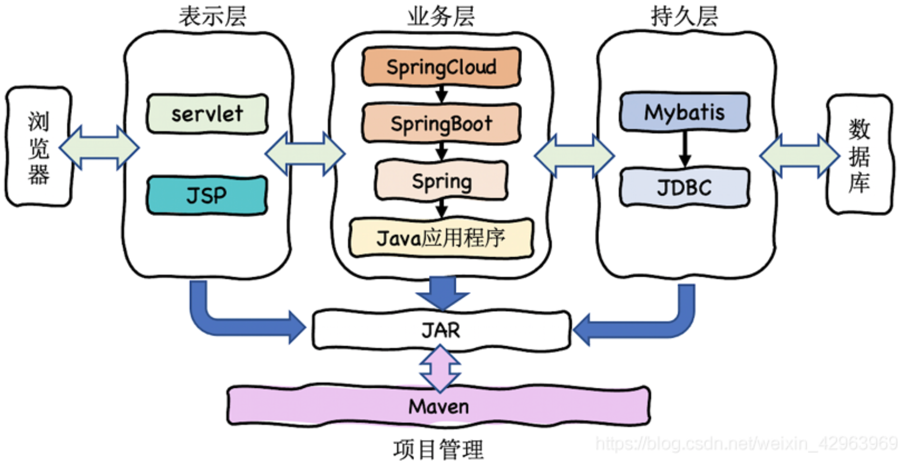
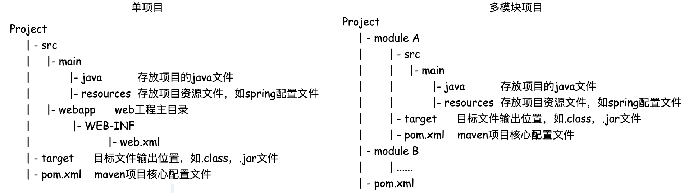

## 四. Spring 组件

&emsp;&emsp;大量的应用使用Java进行开发，其原因之一是Java拥有非常丰富和框架与基础组件，这些框架与组件使得Java的开发十分高效和便捷。



### 4.1 Maven - 项目管理

&emsp;&emsp; 对于一个项目往往会调用大量的第三方依赖jar文件，因此，每创建一个项目,就需要建立这样的一个 `/lib`目录，然后将使用的jar文件复制到项目中。对于多个项目共用的jar包，多个副本的存在，会造成磁盘资源的浪费，也使得版本的一致性管理变得困难。因此需要工具对`Java Jar`包进行统一管理 。 
&emsp;&emsp; `Maven`是基于**项目对象模型(`POM`)**，利用一个中央仓库管理项目的构建、报告和文档等操作过程。`Maven` 是一个项目管理工具，可以对 Java 项目进行构建、依赖管理。`Maven`使用了标准的目录结构，同时为开发人员构建一个项目完整的生命周期。`Maven`的框架如下图所示：


&emsp;&emsp; 当Maven寻找组件的时候，它首先会查看本地仓库，如果本地仓库有此组件，则直接使用；如果没有，或者需要查看是否有更新的组件版本，Maven就会到远程仓库查找，找到组件下载到本地再使用。

#### 4.1.1 Maven工程目录

&emsp;&emsp; Maven的工程目录如下图所示：



#### 4.1.2 Maven POM与pom.xml

##### <font color=Sienna>**1. POM与pom.xml文件中的概念**</font>

&emsp;&emsp; POM (`Project Object Model`，项目对象模型) 是 `Maven` 的基本工作单元。POM对要构建的项目进行建模，将要构建的项目看成是一个对象(Object)。POM与**`pom.xml`文件相对应**，包含了项目的基本信息，用于描述项目如何构建，声明项目依赖。执行任务或目标时，`Maven` 会在当前目录中查找`pom.xml`文件，并读取该文件，获取所需的配置信息，然后执行目标。在pom.xml文件中存在几个概念：
&emsp;&emsp; <font color=red>**● 坐标**：</font>为了能够自动化地解析任何一个Java组件, Maven必须将它们唯一标识，因此Maven引入了”坐标“的概念。坐标元素包括`groupId`，`artifactId`，`version`，`packaging`，`classfier`。通常来说 `坐标 = groupId + artifactId + version`
&emsp;&emsp; <font color=red>**● 继承**：</font>在实际的项目开发中，**一个项目的多个不同的工程所依赖的jar包分散在每个工程(module)的pom.xml文件中**。而且每个工程的jar包版本可能不一致。为了能够管理各个工程(module)中的jar包，**将jar包的版本统一提取到"父"工程中，在子工程中声明依赖时不指定版本，以父工程中统一设定的为准**，同时也便于修改。
&emsp;&emsp;<font color=red> **● 依赖**：</font>Maven的依赖管理, 它使得我们不必再到开源项目的官网一个个下载开源组件, 然后再一个个放入**classpath**。通过**依赖传递机制**，Maven会解析各个直接依赖的POM, 将必要的间接依赖以 ”传递性依赖“ 的形式引入到当前目录中。
&emsp;&emsp;&emsp;**① 依赖的范围 `<scope>`：**


&emsp;&emsp;&emsp;**② 依赖传递机制：**组件之间的依赖关系可以层层传递，将必要的间接依赖以 ”传递性依赖“ 的形式引入到当前目录中。同时间接依赖的范围也会发生变化。


&emsp;&emsp;&emsp;**③ 依赖的排除 `<exclusions>`：**如果我们在当前工程中引入了一个依赖是 A，而 A 又依赖了 B，那么 Maven 会自动将 A 依赖的 B 引入当前工程，但是个别情况下 B 有可能是一个不稳定版，或对当前工程有不良影响。这时我们可以在引入 A 的时候将 B 排除。 &emsp;&emsp;&emsp;**④ 依赖的冲突：**在maven中存在两种冲突方式：一种是**跨pom文件的冲突**，另一种是**同一个pom文件中的冲突**。
&emsp;&emsp;&emsp;<font color=green>(1) 跨pom文件的冲突，路径最短者优先</font>。如third->second->first，second和first中依赖存在版本冲突，则third与second的版本相同。 &emsp;&emsp;&emsp;<font color=green>(2) 同一个pom文件中的冲突，先申明者优先。</font>

##### <font color=Sienna>**2. pom.xml文件**</font>

&emsp;&emsp;pom.xml文件的结构如下图所示：

```xml
<!-- Maven 父工程 -->
<?xml version="1.0" encoding="UTF-8"?>
<project xmlns="http://maven.apache.org/POM/4.0.0"
         xmlns:xsi="http://www.w3.org/2001/XMLSchema-instance"
         xsi:schemaLocation="http://maven.apache.org/POM/4.0.0 http://maven.apache.org/xsd/maven-4.0.0.xsd">
    <modelVersion>4.0.0</modelVersion>
  
    <!-- Maven坐标
				① 以下4个元素称为Maven坐标，坐标是Maven必须将它们唯一标识，任何一个构件都必须明确定义自己的坐标。
				② 在本地仓库中，组件jar的存放路径 = <groupId>/<artifactId>/<version>/artifactId-version.jar
		-->
  	<groupId>com.xzz.parent</groupId>   	<!--定义当前Maven项目隶属的实际项目-->
    <artifactId>xzz-boot</artifactId>			<!--实际项目中的一个Maven项目:当前的Maven项目名称-->
    <version>1.0.0-SNAPSHOT</version>			<!--Maven项目当前所处的版本,如果是在开发阶段使用快照(SNAPSHOT)方式-->
  	<packaging>pom</packaging>						<!--定义Maven项目打包方式，如jar，pom，maven-plugin等-->
  
  	<!-- 在父工程中聚合项目的module，添加子工程的引用 -->
    <modules>
        <module>xzz-kernel</module>
        <module>xzz-dao</module>
        <module>xzz-api</module>
        <module>xzz-core</module>
    </modules>
  
  	<!-- 在父工程中，对项目中所有工程用到的jar依赖进行统一的版本管理，子工程通过继承的方式获取父工程中依赖的版本号 -->
    <dependencyManagement>
        <dependencies>
            <dependency>
                <groupId>mysql</groupId>
                <artifactId>mysql-connector-java</artifactId>
                <version>5.1.44</version>
            </dependency>
      	</dependencies>  
  	</dependencyManagement>
  
    <!--
				项目构建：Maven会根据其自身的生命周期，对项目按"阶段"进行验证，编译，测试，打包，安装，部署。
				每个阶段都是由插件实现的。Maven自身带有默认的插件，同时也可以去自定义使用插件。
		-->
    <build>  						
        <plugins>
            <plugin>
              	<!-- groupId + artifactId + version = 插件坐标 -->
                <groupId>org.apache.maven.plugins</groupId>			
                <artifactId>maven-resources-plugin</artifactId>	
                <version>3.2.0</version>
                <configuration>                 <!--插件的配置项-->
                    <encoding>UTF-8</encoding>
                </configuration>
          	</plugin>
      	</plugins>
  	</build>   
</project>
```

```xml
<!-- Maven 子工程 -->
<?xml version="1.0" encoding="UTF-8"?>
<project xmlns="http://maven.apache.org/POM/4.0.0"
         xmlns:xsi="http://www.w3.org/2001/XMLSchema-instance"
         xsi:schemaLocation="http://maven.apache.org/POM/4.0.0 http://maven.apache.org/xsd/maven-4.0.0.xsd">
    <modelVersion>4.0.0</modelVersion>
  
    <!-- Maven继承
 				① 子工程中声明对父工程的引用，引用之后，子工程中的依赖的版本以父工程中的版本为主 
				② 子工程的声明<parent>中的坐标 = 父工程中定义的Maven坐标
		-->
    <parent>
        <artifactId>xzz-boot</artifactId>
        <groupId>com.xzz.parent</groupId>
        <version>1.0.0-SNAPSHOT</version>
    </parent>
  
    <!-- Maven坐标
				① 以下4个元素称为Maven坐标，坐标是Maven必须将它们唯一标识，任何一个构件都必须明确定义自己的坐标。
				② 在本地仓库中，组件jar的存放路径 = <groupId>/<artifactId>/<version>/artifactId-version.jar
		-->
    <groupId>org.example</groupId>   		<!--定义当前Maven项目隶属的实际项目-->
    <artifactId>MavenTest</artifactId>	<!--实际项目中的一个Maven项目:当前的Maven项目名称-->
    <version>1.0-SNAPSHOT</version>			<!--Maven项目当前所处的版本,如果是在开发阶段使用快照(SNAPSHOT)方式-->
  	<packaging>pom</packaging>					<!--定义Maven项目打包方式，如jar，pom，maven-plugin等-->

    <!-- 依赖管理
			① 在依赖管理中，Maven的 ”依赖传递机制“ 会自动加载我们引入的依赖包的依赖,从而不必去手动指定依赖。
			② 通过依赖传递机制，Maven会解析各个直接依赖的POM, 将必要的间接依赖以 ”传递性依赖“ 的形式引入到当前目录中。
			如：项目依赖了spring-core, 而spring-core又依赖了commons-logging，在添加spring-core时，不需要关心spring-core依赖了哪些组件，也不用			 担心引入多余的依赖。
		-->
  	<dependencies>
        <dependency>
          <!-- groupId + artifactId + version = 坐标 -->
          <!-- 本地仓库的组件路径为 .../mysql/mysql-connector-java/5.1.44/mysql-connector-java-5.1.44.jar -->
          <groupId>mysql</groupId>
          <artifactId>mysql-connector-java</artifactId>
          <!--<version>5.1.44</version> 在子工程中，依赖的版本可以通过父工程进行统一的管理，因此子工程可以不用定义依赖的版本 -->

          <type>...</type>  				<!-- 依赖的类型，对应于项目坐标定义的packaging,其默认值是jar -->
          <scope>...</scope>				<!-- 依赖的范围，默认值是compile -->
          <optional>...</optional>	<!-- 标记依赖是否可选 -->
          <exclusions>     					<!-- 依赖排除 -->
              <exclusion>     
                  <groupId>...</groupId>     
                  <artifactId>...</artifactId>     
              </exclusion>
          </exclusions>    
        </dependency>
		</dependencies>
    <properties>
        <maven.compiler.source>8</maven.compiler.source>
        <maven.compiler.target>8</maven.compiler.target>
    </properties>

</project>
```

#### 4.1.3 Maven 生命周期

&emsp;&emsp;Maven的生命周期是指<font color=green>**项目构建步骤的集合**</font>，生命周期将一个整体任务(项目构建)划分为一个个<font color=green>**阶段**</font>
，并定义了各个阶段的执行顺序，Maven 的内部有三个**相互独立**的构建生命周期，分别是 **`clean Lifecycle`**，**` default Lifecycle`**，**` site Lifecycle`**
。Maven的整个生命周期如下图所示：


&emsp;&emsp;在Maven的生命周期中，每一个阶段的具体实现都是由`maven插件`实现的，Maven实际上是一个依赖插件执行的框架，每个任务是由插件完成。

### 4.2 Nacos - 配置中心

&emsp;&emsp;从spring开始，所有的配置文件都放在项目中，如果需要修改配置文件内容，则需要登陆服务器重启服务。配置中心是程序服务配置管理中重要的一步。对于单个应用，只需要单个配置文件或环境变量的方式来管理配置即可，但是对于大型的服务化和微服务化项目，单个配置文件存在很大问题，增加项目开发的复杂性。因此产生了由配置中心进行统一配置管理的思想，配置中心解决了如下问题：
&emsp; &emsp; ● 对项目中使用的密码进行有效的管理，开发者不碰触密码配置，运维人员和架构团队统一管理避免密码泄露。 &emsp; &emsp; ● 多项目下的配置绝对统一性，不会出现配置写错导致的BUG。
&emsp; &emsp; ● 对于配置的编辑、存储、变更管理、历史版本管理有完善的能力。
&emsp; &emsp; ● 进行配置分组和灰度发布。 
&emsp;&emsp;目前已有的开源配置中心包括： 
 &emsp; &emsp; ① 携程开源的Apollo: 数据保存在mysql中，支持命名空间和分发更新配置 
 &emsp; &emsp; ② springcloud中的springcloud config: 必须使用git保存配置信息
 &emsp; &emsp; ③ 阿里开源的Nacos: Nacos 是阿里巴巴推出来的一个新开源项目，是一个更易于构建云原生应用的动态服务发现、配置管理和服务管理平台。

#### 4.2.1 Nacos的功能

&emsp;&emsp;Nacos有四大功能:
&emsp; &emsp; **① 服务发现与服务健康监测：**Nacos支持基于DNS和基于RPC的服务发现。服务提供者通过原生SDK、OpenAPI或者一个独立的Agent TODO注册 Service 后，服务消费者可以使用DNS TODO 或HTTP&API查找和发现服务。Nacos提供对服务的实时的健康检查，阻止向不健康的主机或服务实例发送请求。Nacos支持传输层 (PING 或 TCP)和应用层 (如HTTP、MySQL、用户自定义）的健康检查。对于复杂的云环境和网络拓扑环境中(如 VPC、边缘网络)等服务的健康检查，Nacos提供了agent上报模式和服务端主动检测2种健康检查模式。


&emsp; &emsp; **② 动态参数配置：**动态参数配置避免了在配置变更时重新部署应用和服务，同时Nacos提供配置版本跟踪、版本发布、回滚配置以及客户端配置更新状态跟踪等配置管理功能。 
&emsp; &emsp; **③ 动态DNS服务：**动态DNS服务以DNS协议为基础，支持权重路由，从而实现中间层负载均衡、路由策略、流量控制以及简单DNS解析服务。 &emsp; &emsp; **④ 服务及元数据管理：**Nacos能够管理服务的描述、生命周期、服务的静态依赖分析、服务的健康状态、服务的流量管理、路由及安全策略、服务的 SLA 以及 *metrics* 统计数据。

#### 4.2.2 Nacos的架构


### 4.3 Feign

&emsp;&emsp;  *Feign* 由 *Netflix* 公司开发的一个轻量级 *RESTful* 的 HTTP 服务客户端**框架**，其主要作用是**简化 *RPC* 远程调用流程**。*Fegin* 本身是不支持 *Spring MVC* 的注解，随着 *Spring MVC* 框架的流行，*Spring Cloud* 对 *Feign* 进行了封装为 *OpenFegin*，使其支持了 *Spring MVC* 标准注解和 *HttpMessageConverters*。因此，我们常用的 *Fegin* 是指的 *OpenFegin*。


&emsp;&emsp;   在Java中常见的 *HTTP* 客户端如下所示：
&emsp;&emsp;    ①  ***HttpURLConnection***：*HttpURLConnection* 是在JDK的 *java.net* 包中提供的用于 *HTTP* 协议访问的基本功能的类。*HttpURLConnection* 是基于HTTP协议的，其底层通过 *socket* 通信实现。
&emsp;&emsp;    ②  ***HttpClient***：是 *Apache Jakarta Common* 下的子项目，用来提供高效的、最新的、功能丰富的支持HTTP协议的客户端编程工具包。
&emsp;&emsp;    ③  ***OkHttp***：是由 Square 公司研发并开源的，处理 HTTP 网络请求的依赖库。单例模式下，*HttpClient* 的响应速度要更快一些，非单例模式下，*OkHttp* 的性能更好
&emsp;&emsp;  *Feign* 是一个 HTTP 客户端框架，它并没有去做跟 *HttpClient* 或 *OkHttp* 一样重复的事情，而是开发了一个框架，用于集成 *HttpURLConnection*，*Apache Http Client*，*OkHttp* 实现具体的 HTTP 请求，并提供了更加丰富实用的功能。在 *Feign* 的实现下，我们只需要创建一个接口并使用注解的方式来配置它，即可完成对服务提供方的接口绑定。


#### 4.3.1 Fegin 功能架构

&emsp;&emsp; *Feign* 是一个 *HTTP* 请求调用的轻量级框架，可以以 Java 接口**注解的方式**调用HTTP请求。*Fegin* 主要包含了三大功能：**简化远程调用**、**负载均衡 *Ribbon*、服务容错与熔断机制 *Hystrix***。
&emsp; &emsp;**① 简化远程调用**： *Feign* 通过处理注解，将请求模板化，当实际调用的时候，传入参数，根据参数再应用到请求上，进而转化成真正的请求，封装了 *HTTP* 调用流程。*Fegin* 的灵感来自于 *Retrofit*、*JAXRS-2.0* 和 *WebSocket*。
&emsp; &emsp;**② 负载均衡 *Ribbon***： 利用负载均衡策略选定目标机器。
&emsp; &emsp;**③ 服务容错与熔断机制 *Hystrix***： 根据熔断器的开启状态，决定是否发起此次调用。


#### 4.3.2 Fegin 底层原理

##### 1. Fegin 的装载与调用

&emsp; &emsp;  *Fegin* 的装载与调用过程主要分为三个步骤：**① *Fegin* 相关 *Bean* 的注册；② *Fegin* 相关 *Bean* 的依赖注入**；③ 

###### (1). *Feign* 相关 *Bean* 的注册

&emsp; &emsp; ● 在 Spring 项目启动阶段，Spring 会去扫描启动类是否存在 *@EnableFeignClients* 注解，*@EnableFeignClients* 注解是开启 *Fegin* 功能的关键。在 *@EnableFeignClients* 注解中，`@Import(FeignClientsRegistrar.class) ` 会导入自动装载注册器 *FeignClientsRegistrar* 类，对 *Fegin* 接口进行加载。
&emsp; &emsp; ● *FeignClientsRegistrar* 类继承 Spring 中的 *ImportBeanDefinitionRegistrar* 接口，并在 `registerBeanDefinitions(...)` 实现方法中向 Spring 容器注册Bean，以达到自动注入第三方功能的目的。
&emsp; &emsp; ① 在 `registerBeanDefinitions(...)` 方法中首先调用 `registerDefaultConfiguration(...) `方法从 *@EnableFeignClients* 注解中提取 *defaultConfiguration* 属性对应的 *Value*，并封装为<font color=red> ***FeginClientSpecification***</font> 作为默认的 *Feign* 配置注册到 Spring 容器中。
&emsp; &emsp; ② 然后调用 `registerFeignClients(...)` 查找指定路径 *basePackage* 的所有带有 *@FeignClients* 注解的类、接口，将带有 *@FeignClients* 注解的类、接口包装成 <font color=red>***FeginClientFactoryBean***</font> 注册到 Spring 容器。*FeignClientFactoryBean* 类实现了 *FactoryBean\<T>*，可以通过 `getObject()` 方法来获取并注入实例化对象。


###### (2). *Feign* 相关 *Bean* 的依赖注入

&emsp; &emsp;  当代码中通过 *@Resource* 或 *@Autowired* 注解注入 *FeignClient* 客户端时，会通过 *FeignClientFactoryBean* 的 `getObject()` 方法来获取到动态代理对象。动态代理对象的生成是通过 *Feign.Builder* 的 `target()` 方法中调用 `build()` 方法生成 <font color=red>*ReflectiveFeign*</font> 的实例，然后通过 `newInstance()` 方法创建最终的 RPC 动态代理的实例。


##### 2. Fegin 的动态代理流程

&emsp; &emsp;为了使远程调用可以像调用本地方法一样，不需要像 *Ribbon* 或者 *Eureka* 那样在方法调用的地方提供服务名，*Feign* 通过构造接口的动态代理对象，用来代理远程服务的真实调用。

##### 3. Fegin 的负载均衡

##### 4. Fegin 的限流与熔断


 &emsp; &emsp;  


### 4.5 Mybatis - 数据持久层管理

&emsp;&emsp;在学习Mybatis之前，要先了解JDBC存在的问题。JDBC在开发过程中，存在以下几个问题： 
&emsp;&emsp; ① 需要开发人员自己去实现数据库的加载，连接对象的创建等问题。同时，频繁创建数据库连接对象、释放、容易造成系统资源浪费，影响系统性能。 
&emsp;&emsp; ② SQL语句定义、参数设置、结果集处理存在硬编码。每次变更都需要工程进行重新编译。 
&emsp;&emsp; ③ 结果集处理存在重复代码，维护复杂 
&emsp;&emsp;MyBatis是一款持久层框架，前身是Ibatis框架，是对JDBC操作数据库的封装。它支持自定义 SQL、存储过程以及高级映射。通过Mybatis，只需要定义一个不需要写实现类的接口，通过注解或者配置SQL语句 (XML文件)的方式，就可以对数据库进行 CRUD 操作，不再需要关心加载驱动、创建数据库连接对象等问题。Mybatis主要完成了两件工作：<font color=red>**封装JDBC**，**利用反射打通Java类与SQL语句之间的相互转换**
。</font>

#### 4.5.1 Mybatis 功能架构与流程

&emsp;&emsp;Mybatis根据其实现的功能上分为三层：**API接口层**，**数据处理层**，**框架支撑层(组件层)**
&emsp;&emsp;① API接口层：提供给外部使用的接口API，通过这些本地API来操纵数据库。接口层接收到调用请求后就会调用数据处理层来完成具体的数据处理。
&emsp;&emsp;② 数据处理层：MyBatis框架内部的核心实现，完成对映射文件的解析与数据处理(完成一次数据库操作)。具体包括：
 &emsp;&emsp; ● 参数的解析和绑定 
 &emsp;&emsp; ● SQL语句的解析，执行 
 &emsp;&emsp; ● 结果集映射解析与处理 
&emsp;&emsp;③ 框架支撑层：Mybatis最基础的组件，包括连接管理、事务管理、配置加载和缓存处理。为上层的数据处理层提供最基础的支撑。


#### 4.5.2 Mybatis 架构流程