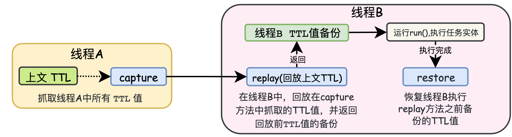

 &emsp; &emsp;Java是纯粹的面向对象的编程语言，它吸收了C++语言的特点，同时也摒弃了C++中难以理解的多继承，指针等概念。本Blog从C++为角度，主要学习总结C++与Java之间的区别，以及Java本身的基础特性。对于Java与C++的共有特性则略过。

***
###  一.  Java运行机制
&emsp; &emsp; Java介于编译型语言和解释型语言之间。编译型语言(C、C++)其代码是直接编译成机器码执行，但是不同的平台(x86、ARM等)CPU的指令集不同，因此，需要编译出每一种平台的对应机器码。解释型语言(Python、Ruby)由解释器直接加载源码然后编译运行，代价是运行效率太低。而Java是将代码编译成一种<font color=red>“**字节码**”</font>，<font color=green>针对不同平台编写虚拟机(JVM)，不同平台的虚拟机负责加载字节码并执行，这样就实现了“一次编写，到处运行”。</font>


&emsp; &emsp; Java中包括很多的开发工具，如JDK(Java Development Kit)，JRE(Java Runtime Environment)。其关系如下图所示：


####  1.1 Java .class 字节码文件

####  1.2 Java JVM 底层原理
####  1.3 Jar包
 &emsp; &emsp; Jar是Java的档案文件，是一种压缩文件，Jar文件与ZIP压缩文件兼容，区别是Jar文件中默认包含了一个`META-INF/MANIFEST.MF`的清单文件。<font color=green>当一个应用开发完成后，会将包含的`class`文件打包成一个Jar文件提供给其他人使用，只需要将Jar包路径添加到环境变量中，JVM会把这个Jar文件当成一个路径来处理，并在内存中解压Jar包。</font>


> <font color=SlateBlue>  <u>**Q. 使用Jar文件的好处？**</u></font>
 &emsp; ①  可以对Jar文件进行数字签名，保证Jar文件的安全。
 &emsp; ② 加快下载速度，当多个`class`文件进行传输时，需要每个文件单独建立一个HTTP连接。如果压缩成Jar文件，只需要一次连接即可。
&emsp; ③ 使`class`文件变小，减少空间的占用
&emsp; ④ 可移植性，Jar包时Java平台内部处理的标准，能够在各种平台上直接使用。

***
###  二. Java 语言基础
####  2.1 Java 程序基本规则
 &emsp;&emsp;与C++相比，Java是完全的面向对象的语言，因此Java与C++在程序规则上有所区别：
 &emsp; &emsp;  ①  Java程序必须以`class`的形式存在，`class` 是java的最小程序单位。<font color=red>在Java程序中，不允许可执行语句、方法独立存在。</font>
&emsp; &emsp; <font color=red>② 如果一个Java程序文件中定义了一个`public`类，则该程序文件的文件名必须和该`public`类名相同。因此，一个Java程序文件最多只能有一个`public`类。</font>
&emsp; &emsp;  ③ Java中编译器通过Main()方法作为程序的入口，且Main()的修饰符必须为：`public static void main(String [] args){}`
####  2.2 Java 语法基础
  ▍ **2.2.1 Java关键字**
&emsp; &emsp;  Java中一共有48种关键字，如下表所示。关键字可以分为程序逻辑控制关键字，系统控制(线程同步)关键字，数据类型关键字，类/对象关键字，包/方法管理关键字。红色的为常用的关键字。由于Java与C++的关键字有很多相同之处，未介绍的关键字可以查看「[C++基础](https://blog.csdn.net/weixin_42963969/article/details/103018074)」


 ▍ **2.2.2 Package 与 import  机制**
&emsp; &emsp;  Java引入了包机制，用于解决类名冲突与类文件管理等问题(类似于C++中的`namespace`)。Java允许将一组功能相关的类放在同一个`Package`下，构成类库单元。当Java程序文件中使用了`Package`语句时，则该程序文件中定义的所有类都在这个`Package`下。同时，在父包下可以创建子包，<font color=green>虽然父包和子包存在某种联系，但在用法上没有任何关系，如在父包类中需要使用子包中的类时，必须使用子包的全名，而不能省略父包部分</font>。
&emsp; &emsp;  同时Java引入了`import`机制，可以向某个Java文件中指定包层次下的某个类或全部类。
```java
//t1Class.java
package Test      		//父包
import Test.A.t2Class;  //在父包导入子包类时，必须使用子包的全名，不能省略父包部分
public class t1Class{}

//t2Class.java
package Test.A			//子包
public class t2Class()
```
&emsp; &emsp; Java常用的包结构如下图所示：


***
####  2.3 Java 对象
 ▍ **2.3.1 Java Class类 / 对象**
  &emsp; &emsp; 在Java中，一切皆对象。Java分为两种对象：<font color=green>Java实例对象 和 Java Class对象</font>。每个类的运行时的类型信息就是用Class对象表示的。它包含了与类有关的信息。每一个类有且只有一个Class对象，Class对象对应`java.lang.Class`类，是对类的抽象和集合。Class类的特点如下：
  &emsp; &emsp;  ● 自定义的类在编译后会生成一个唯一的Class对象，Class对象保存在与自定义类同名的.class文件中
  &emsp; &emsp;  ● 无论创建多少个自定义类的对象，有且只有一个Class对象，表示自定义类的类型信息。
  &emsp; &emsp; ● Class类没有公共的构造方法，仅在类加载的过程中，由JVM自动构造，因此不能显式的声明一个Class对象。


> <font color=SlateBlue>  <u>**Q. Class类的作用 ？**</u></font>
>  &emsp;在C++中有个重要的概念：**运行时类型识别(`RTTI`)**，其作用是在运行时识别一个对象的类型和类的信息。Java中同样存在`RTTI`，Java中的`RTTI`实现有两种方式：
&emsp;   ● 在编译期已确定其所有对象的类型，这种方式需要在写程序的时候将对象通过new创建出来。
&emsp;  ● 通过反射机制，在运行时发现和使用类型的信息。在Java中用来表示运行时类型信息的对应类就是Class类。

```java
1. Class类常用的方法:
  1）public static Class<?> forName(String className):参数是一个类的名字(package path)，返回该类的Class对象引用。
  2）public T newInstance():创建此 Class 对象所表示的类的一个新实例。  
  3）public native Class getSuperclass()：获取类的父类
  4）public ClassLoader getClassLoader() ：获得类的类加载器。
  5）public String getName() ：获取类或接口的名字。enum为类，annotation为接口。
  6）public Constructor<?>[] getConstructors() ：获得所有的构造函数。
  7）public Field[] getFields() :获得域成员数组。    
  8）public Method[] getMethods() ：获得方法。
2. 三种方法获得Class对象：
    1）获取类的静态成员变量class
          Class c = Test.class;
    2）调用对象的getClass()方法，返回该对象对应的一个Class对象
          Class c = test.getClass();
    3) 调用Class类的静态方法forName();
          Class c =Class.forName("testpackage.test");   
```
 ▍ **2.3.2 Java 类加载**
&emsp; &emsp;<font color=Sienna>**1. 类的生命周期**</font>
&emsp; &emsp; 类的生命周期是从虚拟机将`.class`文件加载到内存开始，直到卸载出内存为止。类的生命周期分为7个阶段，如下图所示：&emsp; &emsp; **● 加载阶段(类加载器)：** JVM通过类的全限定名获取定义此类`.class`文件中的二进制字节流，并将字节流中的静态存储结构`(static)`转化为方法区的运行时数据结构，最终在内存中生成一个代表这个类的`java.lang.Class`对象，作为方法区该类的各种数据的访问入口。

&emsp; &emsp; **● 验证阶段：** 确保`.class`文件的字节流包含的信息符合虚拟机的要求，不会危害虚拟机自身的安全。验证阶段分为4个过程：
&emsp; &emsp;  ① 文件格式验证：验证字节流是否符合`.class`文件格式的规范，并且能被当前版本的虚拟机处理，通过该阶段后，字节流会进入内存的方法区中进行储存。
&emsp; &emsp;  ② 元数据验证(.class语言分析)：对字节码描述的信息进行语言分析，对类的元数据信息进行语义校验，确保其描述的信息符合Java语言规范要求。
&emsp; &emsp; ③ 字节码验证(.class语义分析)：通过数据流和控制流分析，确定程序语义是符合逻辑的。这个阶段对类的方法进行校验分析，保证类的方法在运行时不会做出危害虚拟机安全的事件。
&emsp; &emsp; ④ 符号引用验证：对类自身以外的信息（常量池中的符号引用）的信息进行校检，确保后续的解析动作能够正常执行。

&emsp; &emsp; **● 准备阶段(分配空间)：** 为类变量（仅为`static`修饰的变量）分配内存空间并设置数据类型零值。实例对象会在对象实例化时分配在Java堆中。

&emsp; &emsp; **● 解析阶段：** <font color=green>将常量池的符号引用替换为直接引用的过程。</font>解析动作主要针对类或接口、字段、类方法、接口方法、方法类型、方法句柄、和调用限定符7类符号引用。

> <font color=SlateBlue>  <u>**Q. 什么是符号引用、直接引用 ？**</u></font>
&emsp;&emsp;  ⊕ <font color=orange>符号引用是以一组符号来描述所引用的目标，符号可以是任何字面量，只要使用时无歧义定位到目标即可。符号引用与虚拟机的内存布局无关。</font><font color=green>在编译的时候每个Java类都会被编译成一个`.class`文件，但在编译的时候虚拟机并不知道所引用类的地址，就用符号引用来代替，而在解析阶段就是为了把这个符号引用转化成为真正的地址的阶段。</font>
&emsp;&emsp; ⊕ <font color=orange>直接引用是可以直接定位到目标的指针、相对偏移量或是一个能间接定位目标的句柄。直接引用是与虚拟机的内存布局相关的，同一个符号引用在不同虚拟机实例上翻译出来的直接引用不会相同。</font>


&emsp; &emsp; **● 类初始化：** 执行类中定义的Java代码 ，分为<font color=orange>类的**主动引用**、**被动引用**</font>：
&emsp; &emsp; <font color=green>**⊕ 主动引用**：是指在初始化阶段，一定会对类进行初始化。</font>有4种场景会发生类的主动引用：
&emsp; &emsp;  「1」使用new关键字实例化对象的时候；读取或设置一个类的静态字段【`getstatic`、`putstatic`、`invokestatic`操作静态字段的指令】(被`final`修饰、已经在编译期把结果放入常量池的静态字段除外)，以及调用一个类的静态方法的时候。
&emsp; &emsp;  「2」使用`java.lang.reflect`包的方法对类进行反射调用的时候。
&emsp; &emsp;  「3」当初始化一个类的时候，如果发现其父类还没进行初始化，则必须对父类进行初始化。
&emsp; &emsp;  「4」当虚拟机启动时，用户指定的要执行的主类（包含main方法的类）

&emsp; &emsp; <font color=green>**⊕ 被动引用**：除了主动引用，其余引用类的方式都不会触发初始化，因此称为被动引用。</font>
&emsp; &emsp;  「1」对于静态字段，只有直接定义这个字段的类才会被初始化，<font color=green>通过其子类来引用父类中定义的静态字段，只会触发其父类的初始化而不会触发子类的初始化。</font>
```java
package test;
class Superclass{
    public static int value=10;
    static{
        System.out.println("super");
    }
}
class child extends Superclass{
    static {
        System.out.println("child");  //不会触发该类的初始化
    }
}
public class test {
    public static void main(String[] args) {
        System.out.println(child.value);  //输出super 和 10
    }
}
```
&emsp; &emsp;  「2」<font color=green>通过数组定义来引用类，不会触发此类的初始化。</font>
```java
package test;
class Superclass{
    public static int value=10;
    static{
        System.out.println("super");
    }
}
public class test {
    public static void main(String[] args){
        Superclass superclass[]=new Superclass[10];   //没有任何输出,不会初始化类Superclass
    }
}
```
&emsp; &emsp;「3」<font color=green>常量在编译阶段会存入调用类的常量池中，并没有直接引用到定义常量的类，因此不会触发定义常量的类的初始化。</font>
```java
package test;
class Superclass{
    public static final String DEFINE_TYPE = "hello";
    static{
        System.out.println("super");
    }
}
public class test {
    public static void main(String[] args) {
        System.out.println(Superclass.DEFINE_TYPE);  //仅输出hello，Superclass没有初始化
    }
}
```
> <font color=SlateBlue>  <u>**Q.  static，final，static final 对修饰字段赋值时的区别 ？**</u></font>
&emsp; ● `static` 在准备阶段时被初始化为0或null，在初始化阶段时被赋予代码中设定的值，如果没有设定值，则仍为默认值。
&emsp; ● `static final` 在通过Javac编译时生成常量值`Constantvalue`属性，在准备阶段时根据设定值为该字段进行赋值。该字段没有默认值，必须显式的赋值。
&emsp; ● `final` 在运行时被初始化，一旦初始化便不可更改。

&emsp; &emsp;<font color=Sienna>**2. 类加载器**</font>
&emsp; &emsp; <font color=green>在类生命周期的加载阶段，是由<font color=orange>**类加载器**</font>来完成的。类加载器根据一个类的全限定名读取类的二进制字节流到JVM中，然后生成对应的`java.lang.Class对象`实例。</font>JVM中包含四种类型的类加载器：
&emsp; &emsp;  ● `(Bootstrap) 启动类加载器`：`Bootstrap`类加载器是由本地代码实现，它负责将`JAVA_HOME/lib`下面的核心类库或`-Xbootclasspath`选项指定的jar包加载到内存中。`Bootstrap`类加载器由JVM本地实现，因此开发者无法直接获取到`Bootstrap`类加载器的引用。
&emsp; &emsp;  ●`(Extension) 扩展类加载器`：`Extension`类加载器由`ExtClassLoader (sun.misc.Launcher$ExtClassLoader)` 实现，负责将`JAVA_HOME/lib/ext`或者由系统变量`-Djava.ext.dir`指定位置中的类库加载到内存中，开发者可以直接使用标准扩展类加载器。
&emsp; &emsp;  ●`(System) 系统类加载器`：Syetem类加载器由`AppClassLoader (sun.misc.Launcher$AppClassLoader)` 实现，负责将当前类所在路径及其引用的第三方类库的路径下的类库加载到内存中。
&emsp; &emsp;  ●`(User) 自定义类加载器`：`User`类加载器是根据自身需要自定义的`ClassLoader`。

&emsp; &emsp;<font color=Sienna>**3. 类的加载机制 - 双亲委派机制**</font>
&emsp; &emsp; JVM 在加载类时默认采用双亲委派机制，其过程如图所示：


> <font color=SlateBlue>  <u>**Q1. 双亲委派机制的作用及优点 ？**</u></font>
&emsp; ① 为了保证Java系统核心类的安全，对于Java 核心库的类的加载工作由引导类加载器来统一完成，<font color=green>保证Java 应用所使用的都是同一个版本的 Java 核心库的类，避免用户对核心类重写，使Java核心类出现混乱。</font>如用户重写了`Java.lang.Object`类，在类加载时，双亲委派机制会从`Bootstrap`类加载器开始加载`Object`类，从而不会加载用户重写的核心类。避免Java核心API中的类被随意替换。
&emsp; ② <font color=green>双亲委派机制避免类的重复加载，当父类加载器已经加载了该类时，子类加载器就不用再加载。</font>

 ▍ **2.3.3 Java 类引用** 
&emsp; &emsp;<font color=Sienna>**1. 类的引用**</font>
&emsp; &emsp; 所谓引用，是指创建一个”对象标识符“，通过操纵”标识符“使其指向一个对象。这个”标识符“称为引用变量(通俗来说，引用 = 引用变量 = 常说的变量)。<font color=green>一个引用变量可以指向多个对象，但仅保留最后一次引用。一个对象也可以被多个引用变量所指。</font>
```java
// 1.这里 new Person是一个对象，p是一个”标识符“，指向Person对象的引用。
Person p = new Person("A");   
int a = 2;     //2是一个Intger的对象，a是一个指向Intger的引用

// 2.一个引用可以指向多个对象，但仅保留最后一次引用
int a=2;
a=3;   

// 3.一个对象也可以被多个引用所指
Person p1 = new Person("B");
Person p2=p1;
```
 &emsp; &emsp;  为了更加灵活的控制对象的声明周期，Java将对象的引用分为4个等级，<font color=red>从高到低依次为：强引用，软引用，弱引用，虚引用。</font>
 &emsp; &emsp;  ●   **强引用**：强引用是指创建一个对象并把这个对象赋给一个引用变量，强引用是使用最普遍的引用。<font color=green>如果一个对象具有强引用，当内存空间不足时，JVM宁愿抛出`OutOfMemoryError`错误，使程序异常终止，也不会回收具有强引用的对象来解决内存不足的问题。</font>因此，<font color=darkorange>当强引用对象不使用时，需要将其指向`null`，使其可以被GC回收。</font>
 &emsp; &emsp;  ●   **软引用 (SoftReference)**：<font color=green>如果一个对象**只**具有软引用，则内存空间充足时，垃圾回收器就不会回收它；如果内存空间不足了，JVM会将软引用中的对象引用置为`null`，然后通知垃圾回收器GC进行内存回收。</font>只要垃圾回收器没有回收它，该对象就可以被程序使用。软引用可用来实现内存敏感的高速缓存，如图片缓存，浏览器后端页面缓存。
&emsp; &emsp;  ●  **弱引用 (WeakReference)**：只具有弱引用的对象拥有更短暂的生命周期，当垃圾回收器GC扫描到只具有弱引用的对象，不管当前内存空间是否足够，都会回收内存。
&emsp; &emsp;  ●  **虚引用 (PhantomReference)**：虚引用并不会决定对象的生命周期。如果一个对象仅持有虚引用，那么它就和没有任何引用一样，在任何时候都可能被垃圾回收器回收。使用虚引用的目的就是为了得知对象被GC的时机，可以利用虚引用来进行销毁前的一些操作，比如说资源释放等。

> <font color=SlateBlue>  <u>**Q1. 虚引用 与 软引用、弱引用的区别 ？**</u></font>
&emsp;  虚引用**必须**和引用队列 (`ReferenceQueue`) 联合使用。当垃圾回收器准备回收一个对象时，如果发现它还有虚引用，就会在回收对象的内存之前，把这个虚引用加入到与之关联的引用队列中。

```java 
class Superclass{
    public void test(){
        System.out.println("test");
    }
    public static String DEFINE_TYPE = "hello";
    static{
        System.out.println("super");
    }
}

// 1.强引用 - 正常的对象引用
	String str =  new String("abc"); 
	Superclass super =  new Superclass();    
	super = null; // 当强引用不使用时，置为null，以便GC回收

// 2.软引用 - SoftReference
	Superclass superclass =  new Superclass(); 
	SoftReference<Superclass> softReference=new SoftReference<Superclass>(superclass);
	if(softReference.get()!=null){	//内存充足，还没有被回收器回收，直接通过get()方法获取对象
	   Superclass soft=(Superclass)softReference.get();  
	   soft.test();
	}else{
	    softReference = new SoftReference(superclass); // 内存不足，软引用的对象已经回收，重新构建软引用
	}
	// 软引用可以和引用队列联合使用，软引用对象被垃圾回收，JVM会把软引用加入到与之关联的引用队列中。
	ReferenceQueue<String> referenceQueue = new ReferenceQueue<>();  //引用队列
	String str = new String("abc");
	SoftReference<String> softReference = new SoftReference<>(str, referenceQueue);//软引用关联引用队列

// 3.弱引用 - WeakReference
	String str = new String("abc");
	WeakReference<String> weakReference = new WeakReference<>(str);
	str = null;
	// 弱引用可以和引用队列联合使用，弱引用对象被垃圾回收，JVM会把弱引用加入到与之关联的引用队列中。
	ReferenceQueue<String> referenceQueue = new ReferenceQueue<>();  //引用队列
	String str = new String("abc");
	WeakReference<String> weakReference = new WeakReference<>(str, referenceQueue);//弱引用关联引用队列

// 4.虚引用 - PhantomReference
	String str = new String("abc");
	ReferenceQueue queue = new ReferenceQueue();
	// 创建虚引用，要求必须与一个引用队列关联
	PhantomReference pr = new PhantomReference(str, queue);
```
 &emsp; &emsp;<font color=Sienna>**2. Java 类加载过程中的引用关系**</font>
&emsp; &emsp; 在类的全生命周期中，从类的加载器，生成类的Class对象，到类的实例对象的使用有着密不可分的引用关系：
&emsp; &emsp;  ● 类加载器与Class对象：类的Class和加载它的加载器之间是<font color=orange>**双向关联**</font>关系。即<font color=green>一个Class对象总是会引用他的类加载器，调用Class对象的`getClassLoader`方法就可以获得它的类加载器。</font>
&emsp; &emsp;  ● 类，类的Class对象，类的实例对象：<font color=green>一个类的实例对象总是引用该类的Class对象，在Object类中定义该类`getClass`方法，会返回对象所属类的Class对象的引用。</font>

```java
package test;
class Superclass{
    public void test(){
        System.out.println("test");
    }
    public static final String DEFINE_TYPE = "hello";
    static{
        System.out.println("super");
    }
}
public class test {
    public static void main(String[] args) throws IllegalAccessException, InstantiationException, ClassNotFoundException {
        ClassLoader classLoader = Superclass.class.getClassLoader();  //Superclass的类加载器
        Class objClass = classLoader.loadClass("test.Superclass");   //Superclass Class对象
        Object obj=objClass.newInstance();                     //Superclass的Object父类
        Superclass superclass = (Superclass)obj;        //Superclass的实例对象
        superclass.test();
    }
}
```


 ▍ **2.3.4 Java 类反射 - Class对象的主要应用**
 &emsp; &emsp; Java程序在运行之前需要先编译。程序中的对象初始化，对象的调用在编译时期就已经确定并加载到JVM中。当程序在运行时需要 "**动态加载**" 某些类时，由于这些类并没有加载到JVM当中，无法直接获取。但是<font color=green>通过Java的反射机制，可以在运行时动态地创建对象并调用其属性和方法，不需要提前在程序中(编译时期)进行对象的初始化和调用。</font><font color=red>Java反射机制的本质是JVM得到Class对象之后，再通过Class对象进行反编译，从而获取对象的各种信息。</font>
 

> <font color=SlateBlue>  <u>**Q1. 反射有什么用途 ？**</u></font>
&emsp;  ① 通过Java反射机制，访问Java未初始化对象的属性和方法。
&emsp;  ②  反射最重要的用途就是开发各种通用框架。如: `Spring`都是通过`xml`文件配置化的，为了保证框架的通用性，大多数框架需要根据配置文件加载不同的类或者对象，调用不同的方法，这时框架就必须使用反射在程序运行时动态加载需要使用的对象。
&emsp;  ③ 当使用IDE编程时，IDE会自动列举某一对象所包含的方法和属性，这是通过反射实现的。


 ▍ **2.3.5 Java继承(extends)与接口(implement/interface)**
 &emsp; &emsp;<font color=Sienna>**1. 继承 extends**</font>
 &emsp; &emsp;  继承是Java面向对象的特征之一，Java的继承通过关键字`extends`来实现，<font color=green>与C++相比，Java摒弃了多继承，只保留了单继承，即每一个类最多只有一个直接父类。</font>在子类创建某个类对象时，系统会隐式的创建该类的父类对象，且可以通过`super`来该子类的父类对象。如果一个Java类没有显式指定直接父类，则默认其直接父类为`Java.lang.Object`。

```java
class parent{
	public int a;
}
class children extends parent{
	void fun(){
		super.a=10;
	}
} 
```
&emsp;&emsp; 由于继承会破坏父类的封装性，使子类与父类之间的耦合，因此子类与父类之间应当遵循如下规则：
&emsp; &emsp;  ① 将父类的所有属性设置为` private`，不让子类直接访问父类属性。
&emsp; &emsp; ②  不要让子类随意修改、访问父类的方法。父类中的工具方法要设置为`private`; 父类中需要被外部调用但不希望子类重写该方法的要设置为`final`; 如果父类的方法能够被子类重写，但不希望被其他类访问，要设置为`protected`。
&emsp; &emsp;  ③ 不要在父类构造器中调用被子类重写的方法。

&emsp; &emsp;<font color=Sienna>**2. 抽象类与接口**</font>
&emsp; &emsp; 与C++相比，Java的抽象与接口定义更加明确。在Java中，通过`abstract`定义抽象类，与C++相同，<font color=green>Java中的抽象类也无法进行实例化，仅能通过子类的继承对抽象方法进行实现。</font>除此之外，Java还引入了一种更加纯粹的抽象类 - 接口(`interface`)，<font color=green>在`interface`中，所有的方法都是抽象方法，同时引入了`implement`来实现接口。</font>

```java
// ifaceA.java
package A.package1;
public interface ifaceA{  //定义接口
    void fun1();
    void fun2();
}
//ifaceB.java
package A.package1;
public interface ifaceB{  //定义接口
    void fun3();
    void fun4();
}

// Iimplement.java
package A;
import A.package1.iface;
public class Iimplement implements A.package1.ifaceA,A.package1.infaceB{  //实现接口
	@Override
	public void fun1(){
		System.out.print("A");
	}
	@Override
	public void fun2(){
		System.out.print("B");
	}
	@Override
	public void fun3(){
		System.out.print("C");
	}
	@Override
	public void fun4(){
		System.out.print("D");
	}
}
```


***
####  2.3 Java 集合
 &emsp; &emsp;
***
####  2.4 Java 注解 Annotation
&emsp; &emsp;注解是Java提供的一种途径和方法，可以使源程序中的元素关联到代码中的`元数据 (metadata)`。  <font color=green> 注解是附加在代码中的一些源信息，用于在一些工具在编译、运行时进行解释和使用，起到**说明**，**配置**的功能。</font>注解为一种修饰符，应用于类、方法、参数、变量的声明语句中。注解不会也不能影响代码本身的业务逻辑，仅仅只能起到辅助性的作用。使用注解时要在其前面增加`@`符号。
><font color=SlateBlue>  <u>**Q1. 什么是元数据 (Metadata)？**</u></font>
&emsp;  要真正了解注解的工作方式和原理，就需要先了解什么是元数据。
&emsp; 元数据是一种很抽象的定义，<font color=red> 元数据是一系列关于数据的数据，是一系列用来描述数据的数据。</font>元数据可以为数据说明其元素或属性(如：名称、大小、数据类型等)，或其结构 (如：长度、字段等)，或其相关数据(如：位于何处、数据拥有者等)

> <font color=SlateBlue>  <u>**Q2. 注解的本质 ？**</u></font>
&emsp; <font color=red> `Annotion`(注解)是一个接口，程序可以通过反射来获取指定程序元素的`Annotion`对象，然后通过`Annotion`对象来获取注解里面的元数据。</font><font color=green>注解不支持继承，因此不能使用关键字`extends`来继承某个`@interface`，但注解在编译后，编译器会自动继承`java.lang.annotation.Annotation`接口。因此，注解的本质是一个继承了 `Annotation` 接口的接口。</font>注解作为一个特殊的接口，其实现类是在代码运行时生成的动态代理类，而之后底层代码通过**反射**的方式获取到注解。
&emsp; 下图以`@Override`为例，说明注解的本质：


  ▍ **2.4.1 基本Annotation**
  &emsp;&emsp;在Java中存在三个基本的Annotation：
  &emsp; &emsp; ● @Override - 限定重写父类方法：强制一个子类覆盖父类的方法。
  &emsp; &emsp; ● @Deprecated - 标示已过时：表示某个程序元素(类，方法，成员变量)已过时，当使用过时方法时，编译器会发出警告。
    &emsp; &emsp; ● @SuppressWarnings - 抑制编译器警告：通常情况下，程序中使用没有泛型限制的集合会引起编译器警告，为了避免警告，可以通过`@SuppressWarning`抑制编译器警告。
```java
public class Base{
	void fun(){}
	@Deprecated
	void old(){}   //该方法已过时，不可再调用
}
class child extends Base{
	@Override   //重写父类方法
	@SuppressWarnings(value = "uncheck")  //抑制编译器警告
	void fun(){
		List<String>list=new ArrayList();
	}
}
```
  ▍ **2.4.2 元注解**
 &emsp;&emsp; 元注解是 Java 提供的用于修饰注解的注解，用于自定义注解。`Annotation`提供了四种元注解，分别是：
 &emsp; &emsp;  ● @Target: 注解所作用的目标，指明这个注解最终是用来修饰方法，还是修饰类，还是修饰属性；
 &emsp; &emsp;  ● @Retention：用于指明当前注解的生命周期，生命周期包含三个阶段：`SOURCE`在编译阶段丢弃、`CLASS`在类加载的时候丢弃、`RUNTIME`始终不会丢弃，运行期也保留该注解，因此可以使用反射机制读取该注解的信息。
 &emsp; &emsp;  ● @Documented：注解修饰的注解，当执行 JavaDoc 文档打包时会被保存进 doc 文档，反之将在打包时丢弃。
 &emsp; &emsp;  ●   @Inherited：注解修饰的注解是具有可继承性的，也就说我们的注解修饰了一个类，而该类的子类将自动继承父类的该注解。

  ▍ **2.4.3 自定义Annotation**
 &emsp;&emsp;定义新的Annotation类型需要使用 `@interface` 关键字，自定义Annotation的规则如下：
 &emsp; &emsp;  ① Annotation 型定义为@interface, 所有的Annotation 会自动继承java.lang.Annotation这一接口,并且不能再去继承别的类或是接口。
 &emsp; &emsp;  ② 注解的参数成员(变量、方法)只能用 `public` 或默认(`default`)这两个访问权修饰。
  &emsp; &emsp;  ③ 注解的参数成员只能用基本类型byte、short、char、int、long、float、double、boolean八种基本数据类型和String、Enum、Class、annotations等数据类型，以及这一些类型的数组。
  &emsp; &emsp; ④ 要获取类方法和字段的注解信息，必须通过Java的反射技术来获取 `Annotation` 对象。

***
####  2.5 Java 线程
&emsp; &emsp; 线程，一个执行实体，正在执行的程序，担当分配系统资源（CPU、内存）的实体。线程的底层实现原理在[操作系统](https://blog.csdn.net/weixin_42963969/article/details/105255948)中具体介绍。这里介绍Java线程的实现方式以及Java线程如何使用。

 ▍ **2.5.1 Java 线程的实现**
&emsp; &emsp;Java的线程是通过`java.lang.Thread`类来实现的，在Java中有三种方法来**实现**线程：
&emsp; &emsp;  ① 可以<font color=green>通过创建继承`Thread`类的实例来创建新的线程。</font>每个线程都是通过对应的方法`run()`来描述该线程需要执行的操作。通过调用`Thread`类的`start()`方法来启动一个线程。
&emsp; &emsp;  ② Java中只支持单继承，如果一个类继承了某个父类，就无法再继承`Thread`类。因此`Thread`类提供了一个`Runnable`接口，<font color=green>可以通过重写`Runnable`接口中的`run()`方法，也可以实现线程的启动，</font><font color=orange>**因此`Runnable`一个线程操作的方法体，是用户定义的需要完成的具体任务，并通过 Thread.start() 去启动线程**。</font>
&emsp; &emsp;  ③ 对于某些场景，需要在线程执行完成后将任务执行的结果返回，或当线程在执行时抛出异常。因此可以通过实现`Callable`接口中的 `call()` 方法来完成结果的返回。<font color=green>`Callable`接口通常与`FutureTask`一起使用，通过`FutureTask`来异步的执行线程，并保存线程结果。</font><font color=red>注：通过`new Thread()`创建线程时，只能通过`Runnable`，不能通过`Callable`。</font>
&emsp; &emsp; <font color=red>**Notice**：当一个线程运行结束后，无法通过`start()`方法再次启动。即每个线程只能被启动一次。</font>
```java
public class test {
    public static void main(String[] args) {
    // 1. 通过继承Thread类实现多线程
        MyThreadA myThread=new MyThreadA();
        
	// 2.通过实现Runnable接口实现多线程
        MyThreadB myThreadB = new MyThreadB();
        Thread thread = new Thread(myThreadB);
        
   // 3. 通过Callable接口实现线程结果返回
   		CallableExample callable = new CallableExample();
   		FutureTask futureTask=new FutureTask(callable);
   		futureTask.run();
   		futureTask.get();  // 获取 线程返回的运行结果
    // 线程启动
        myThread.start();
        thread.start();
    }
}
// 1. 通过继承Thread类实现多线程
class MyThreadA extends Thread{
    @Override
    public void run() {
        for(int i=0;i<10;++i)
            System.out.println("A "+i);
    }
}
// 2.通过实现Runnable接口实现多线程
class MyThreadB implements Runnable{
    @Override
    public void run() {
        for(int i=0;i<10;++i)
            System.out.println("B "+i);
    }
}

// 3. 通过实现Callable接口，实现线程结果的返回
class CallableExample implements Callable { 
	@Override
    public Object call() throws Exception { 
        int a=10;
        return a; 
    } 
} 
```
><font color=SlateBlue>  <u>**Q1. run() 和 start() 的区别 ？**</u></font>
>  &emsp;  ● `run()` 方法是一个普通的成员方法，当线程调用了`start()`方法后，该线程会去调用这个`run()`方法，运行该线程需要执行的操作。因此，如果直接调用run() 方法，只会在原有线程上运行，不会创建一个新的线程。
>  &emsp;  ● `start()` 方法用来启动线程。当线程创建成功时，线程处于`NEW(创建)`状态，调用`start()`后，线程会变为`READY(就绪)`状态，在等待CPU调度后，线程才可以运行，进入`RUNNING(运行)`状态。

 ▍ **2.5.2 Java 线程状态切换**
 &emsp; &emsp; 在线程的生命周期中，线程共有5种状态：创建、就绪、运行、死亡、阻塞。
 ><font color=SlateBlue>  <u>**Q1. sleep()、wait() 和 notify() 的区别 ？**</u></font>
>&emsp; Java中的`sleep()`和`wait()`函数都可以挂起当前线程，使线程休眠，但实现方式和用法不同：
>
>  &emsp;  ●<font color =green > `sleep()`是 Thread类的方法**静态方法**，需要通过Thread类调用 `Thread.sleep()`。而 `wait()` 和 `notify()` 是 Object类中的实例方法，因为Java所有类都继承于 Object类，所有类中都可以使用。</font>
>  &emsp;  ●<font color = red> `wait()`、`notify()`必须用在 synchronized 代码块中调用。</font><font color=orange>当调用`wait()` 方法后，当前获得 synchronized 同步块对象锁的线程进入”等待阻塞“状态，同时**释放当前线程的对象锁**。此时**其他线程可以获得该 synchronized 同步块的对象锁**。被阻塞的线程需要通过 `notify()` 方法来唤醒。</font>
>  &emsp;  ●  当在 synchronized 同步块中使用 `sleep()`，该线程会被挂起，但**不会释放对象锁**，所以如果有其他线程等待执行该 synchronized 代码块，一直会被阻塞，等待该线程被 `notify()`唤醒释放对象锁。


 ▍ **2.5.3 Java 线程安全与数据安全**
 &emsp;&emsp;  由于线程创建和运行时，必须通过 Runnable 来定义需要执行的任务，当在 Runnable -> run()方法中定义了一个线程的局部变量，且有多个(>2个) Thread 启动并运行该 Runnable任务时，会出现两个问题：
&emsp;&emsp; **①  线程安全：** 当多线程在访问共享数据 (Runnable run()中的局部变量) 时,如果一个线程正在执行而没有执行完,它的执行权被其他线程抢走了就有可能出现安全问题。为了解决这个问题，Java提供了同步器来保证线程运行时顺序和同步。
&emsp;&emsp;  **② 数据安全：** 由于局部变量var是所有线程共同拥有的，因此Thread-1对var的修改会影响Thread-2对var的使用。为了解决这个问题，Java提供了 ThreadLocal 保证线程数据的安全性。


&emsp; &emsp;<font color=Sienna>**1. Java 线程安全**</font>

&emsp; &emsp;<font color=Sienna>**2. Java  数据安全**</font>
&emsp; &emsp; 线程安全的本质是为了保证线程数据的安全，在Java中可以使用 ThreadLocal 维护变量，从而可以不再使用锁，同步器等工具实现线程的同步。


&emsp; &emsp;**●  ThreadLocal - 任务实体中的"共享"变量：**
&emsp; &emsp;  为了保证线程的数据安全，在Java中可以使用 ThreadLocal 维护变量，ThreadLocal为每个使用该变量的线程提供<font color=green>**独立的局部变量副本**</font>，每一个线程都可以独立地改变自己的副本，通过 set() 和 get() 来对这个局部变量进行操作，但不会和其他线程的局部变量进行冲突，实现了线程的数据隔离。


 ><font color=SlateBlue>  <u>**Q1.ThreadLocal 是如何实现线程 (数据) 隔离的 ？**</u></font>
 > &emsp;   Thread类中有两个变量`ThreadLocalMap threadLocals`和`ThreadLocalMap inheritableThreadLocals`。在每个Thread线程对象中，都维护了一个ThreadLocalMap。即一个Thread线程对象，最多只有一个ThreadLocalMap，而ThreadLocalMap底层是一个**Entry数组**，但是一个Thread可以有多个ThreadLocal，一个ThreadLocal对应一个变量数据，变量数据将ThreadLocal作为Key，Object作为value，封装成Entry存到ThreadLocalMap中Entry[]数组中。Thread与ThreadLocal之间的关系如下图所示:
 > <font color=SlateBlue>  <u>**Q2.ThreadLocalMap 是如何解决Hash冲突的 ？**</u></font>
 > &emsp;  每个ThreadLocal都有一个对应的`threadLocalHashCode`，通过`threadLocalHashCode & (len-1)`可以算出ThreadLocal变量对应的Entry[]数组的下标(即Key)。当Key发生Hash冲突时，ThreadLocalMap采用<font color=red>**线性探测方法**</font>，循环查找下一位(索引)是否冲突，直到找到不存在冲突的索引(Entry[]数组下标)。
 > &emsp; 
 >  <font color=SlateBlue>  <u>**Q3.ThreadLocalMap的Entry中，对 ThreadLocal 的引用为什么要设置成弱引用 ？**</u></font>
 >  &emsp; 当代码中将ThreadLocal的强引用置为null后，这时候Entry中的ThreadLocal应该被回收了，但是如果Entry的key被设置成强引用则该ThreadLocal就不能被回收，从而导致内存泄露。 
 ><font color=SlateBlue>  <u>**Q4. ThreadLocal的内存泄露问题？**</u></font>
 >&emsp; ●   <font color=green>虽然 Entry对象中的ThreadLocal引用为弱引用，但这个弱引用只是针对key的。当把 Threadlocal 实例置为null以后，没有任何强引用指向 Threadlocal 实例，此时Threadlocal将会被gc回收。</font><font color=orange>虽然ThreadLocal被回收了，但是Entry对象中的value却不能回收，因为存在一条从`Current Thread`连接过来的强引用。只有当前Thread结束以后, `Current thread`就不会存在栈中，连接value的强引用断开。此时Current Thread, ThreadLocalMap, Entry-value将全部被GC回收。</font>
 >&emsp; ●  根据上述ThreadLocal内存回收的过程可以看出，<font color=red>只要当前的线程对象被GC回收，ThreadLocal就不会出现内存泄露的情况。</font>但如果是在<font color=red>使用线程池</font>的时候，线程结束是不会销毁的，会再次使用的。就可能出现内存泄露。<font color=red>因此，当使用完ThreadLocal之后，调用`Threadlocal`的`remove()`方法把当前`ThreadLocal`从当前线程的`ThreadLocalMap`中移除。</font>

```java
public class test{
    public static void main(String[] args) throws InterruptedException {
        Task task = new Task();
        Thread t1=new Thread(task);  //线程创建时，会各自创建一个ThreadLocal
        Thread t2=new Thread(task);  //因此，两个线程的ThreadLocal并不冲突
        t1.start();
        Thread.sleep(1000);
        t2.start();

    }
}
class Task implements Runnable{
    //任务实体中的本地变量
    ThreadLocal<Integer> tl =new ThreadLocal<>();
    @Override
    public void run() {
        Integer i = 10;
        tl.set(i);
        if(Thread.currentThread().getName().equals("Thread-0")){
            i++;
            tl.set(i);
        }
        System.out.println(Thread.currentThread().getName() + " i:" + i + " tl:"+tl.get());
    }
}
Output:
	Thread-0 i:11 tl:11
	Thread-1 i:10 tl:10
```

&emsp; &emsp;**●  InheritableThreadLocal (ITL)：**
&emsp; &emsp;  虽然ThreadLocal为每个使用该变量的线程提供<font color=green>**独立的局部变量副本**</font>，使当前线程变量不会和其他线程的局部变量进行冲突。但是在父线程中创建的本地变量是无法传递给子线程的，因此Java提供了<font color=red>`InheritableThreadLocal (ITL)` 来解决线程在继承过程中变量的传递问题。</font>

```java
public static void main(String[] args) throws InterruptedException {
	ThreadLocal<String> tL=new ThreadLocal<>(); 						//主线程(父线程)创建本地变量
	ThreadLocal<String> itL=new InheritableThreadLocal<>(); //主线程(父线程)创建本地变量
	tL.set("Threadlocal"); 
	itL.set("Threadlocal"); 				
	System.out.println(tL.get());			//输出 “Threadlocal”
	new Thread(()->{                	//在父线程中创建子线程，并在子线程中输出父线程的本地变量
	   System.out.println(tL.get()); 	//输出null，因为ThreadLocal变量不能通过父子线程进行继承
	   System.out.println(itL.get()); //输出Threadlocal，InheritableThreadLocal变量可以通过父子线程进行继承
	}).start();
}
```
 ><font color=SlateBlue>  <u>**Q1. InheritableThreadLocal 是如何实现线程本地变量继承的 ？**</u></font>
 > &emsp;  `InheritableThreadLocal`是ThreadLocal的子类。在线程在创建并初始化时，会检查其父线程是否存在inheritableThreadLocals，如果存在则会在父线程的inheritableThreadLocals的基础上创建子线程。 


&emsp; &emsp;**●  TransmittableThreadLocal (TTL)：**
 &emsp; &emsp; TL 解决了不同线程之间使用同一本地变量时的冲突问题，ITL解决了在线程继承中，本地变量从父线程传递(继承)到子线程的问题。但在ITL中仅解决了线程继承这一瞬间的变量传递问题，如果创建子线程一直被池化复用 (如线程池中的子线程)，则父线程与子线程之间的变量无法进行同步，则会导致数据问题。针对该问题，AliBaba 在ITL的基础上提出了TTL，用来解决子线程池化复用时的变量数据（此时的变量数据可以看做是业务逻辑的上下文）传递问题。
&emsp; &emsp; TTL 为了能够在子线程池化复用的过程中保持变量数据的一致性，TTL 对原有的 `Runnable` 进行了改造，实现了 `TtlRunnable` 。通过CRR模式 `(capture[抓取]，replay[回放]，restore[恢复])` 对上下文的数据进行同步。



####  2.6 Java 线程池

 ▍ **2.6.1 Java 线程池描述**
&emsp;&emsp;线程池 (Thread Pool)是一种基于池化思想管理线程的工具。通常一个线程池包含4个基本组成部分：
&emsp; &emsp; ① 线程池管理器 ：用于创建并管理线程池，包括 创建线程池，销毁线程池，添加新任务；
&emsp; &emsp; ② 工作线程：线程池中线程，在没有任务时处于等待状态；
&emsp; &emsp; ③ 任务接口：为工作线程提供任务；
&emsp; &emsp; ④ 任务队列：用于存放没有处理的任务。


><font color=SlateBlue>  <u>**Q1. 为什么要用线程池 及 线程池的作用 ？**</u></font>
>  &emsp;  ● 当计算机中的线程过多时，会带来额外的开销，其中包括创建销毁线程的开销、调度线程的开销等等，同时也降低了计算机的整体性能。通过线程池来维护多个线程，一方面避免了处理任务时创建销毁线程开销的代价，另一方面避免了线程数量膨胀导致的过分调度问题，保证了对内核的充分利用。
>  &emsp;  ● 线程池的作用有以下几个方面：
>  &emsp;&emsp;  **① 降低系统资源消耗**：通过池化技术重复利用已创建的线程，降低线程创建和销毁造成的性能损失。
>  &emsp;&emsp;  **② 提高系统的响应时间**：当任务到来时，无需创建线程就可以并发的执行任务。
>  &emsp;&emsp;  **③ 加强对线程的管理**：通过线程池，可以对线程进行统一的分配、调优和监控。若线程是无限制的创建，可能会导致内存占用过多而产生OOM，并且会造成cpu过度上下文切换。

 ▍ **2.6.2 Java 线程池原理**
 &emsp; &emsp; Java线程池的核心实现类是`ThreadPoolExecutor`，线程池的状态维护,任务管理都在`ThreadPoolExecutor`类中实现，其继承关系如下图所示：

 

 ><font color=SlateBlue>  <u>**Q1. Executor接口、ExecutorService接口 和 Exexutors的区别 ？**</u></font>
>&emsp;  <font color=green>● Executor：Executor 是一个抽象层面的核心接口，主要是将任务 Task本身和执行任务分离，解耦合。</font>
>&emsp;  <font color=green>● ExecutorService：ExecutorService 接口继承了 Executor 接口，对 Executor 接口进行了扩展，并返回 `Future 对象`，为线程池终止，关闭线程池等提供操作方法。</font>`Future 对象`提供了**异步执行**，因此只要提交需要执行的任务，无需等待结果，在需要时通过`Future.isDone() 方法`检查 Future 是否执行完成。如果执行完成，就可以通过 `Future.get() 方法`获得执行结果。<font color=orange>**注意:** `Future.get() 方法`是一个阻塞式的方法，如果调用时任务还没有完成，会阻塞等待，直到任务执行结束。因此在获取结果前，先通过`Future.isDone() 方法`检查任务是否执行完成。</font>
>&emsp;  <font color=green>● Executors 类提供工厂方法用来创建不同类型的线程池。</font>如: `newSingleThreadExecutor()` 创建一个只有一个线程的线程池，`newFixedThreadPool(int numOfThreads)`来创建固定线程数的线程池，`newCachedThreadPool()`可以根据需要创建新的线程，但如果已有线程是空闲的会重用已有线程。

&emsp; &emsp;<font color=Sienna>**1. Java 线程池状态 - 生命周期管理**</font>
&emsp; &emsp;  Java的**线程池**共有5种运行状态，其运行状态的流转如图所示：

&emsp; &emsp;  线程池运行的状态，由内部来维护。线程池内部<font color=red>**使用一个变量维护两个值**：`运行状态(runState)`和`线程数量(workerCount)`</font>。其存储结构如下图所示：
&emsp; &emsp;<font color=Sienna>**2. Java 线程池 - 任务执行过程**</font>
&emsp;&emsp;线程池的任务是处理问题的基本”单元“，就像需要搬运的货物，只有合理使用对任务进行管理，才能保证线程池的高效运行。线程池任务的执行过程主要分为4个部分：**任务分配(调度)**，**任务缓存**，**任务获取**，**任务拒绝**。

&emsp;&emsp;● **任务分配：** 任务分配是线程池的”入口“，当用户提交了一个任务，线程池会根据当前状态对任务进行分配，缓存或者拒绝。线程池任务的分配(调度)都是由`execute()` 方法完成的。任务调度的执行过程如下：
&emsp;&emsp;  ① 检测线程池运行状态，如果不是`RUNNING`，则直接拒绝任务；
&emsp;&emsp;  ② 判断`workerCount (工作线程) < corePoolSize (核心线程数量)`，则创建并启动一个线程来执行新提交的任务;
&emsp;&emsp;  ③ 如果`workerCount (工作线程) >= corePoolSize (核心线程数量)`，且线程池内的阻塞队列未满，则将任务添加到该阻塞队列中；
&emsp;&emsp;  ④ 如果`workerCount (工作线程) >= corePoolSize (核心线程数量) && workerCount (工作线程) < maximumPoolSize (最大线程数量)`，且线程池内的阻塞队列已满，则创建并启动一个线程来执行新提交的任务；
&emsp;&emsp;  ⑤ 如果` workerCount (工作线程) >= maximumPoolSize (最大线程数量)`，并且线程池内的阻塞队列已满, 则抛出异常，拒绝该任务。

&emsp;&emsp;**● 任务缓存：** 在任务分配过程中，当`workerCount (工作线程) >= corePoolSize (核心线程数量)`，且线程池的**阻塞队列**未满时，则将任务添加到该阻塞队列中。阻塞队列在队列为空时，获取元素的线程会等待队列变为非空。当队列满时，存储元素的线程会等待队列可用。<font color=red>利用阻塞队列的特性实现生产者消费者模型，保证了任务和工作线程两者解耦。</font>
><font color=SlateBlue>  <u>**Q1. 线程池为什么要使用阻塞队列作为缓存，而不使用普通队列 ？**</u></font>
>&emsp;  ● 线程池创建线程需要获取`mainlock`全局锁，影响并发效率，如果采用普通队列，可能会导致没有及时入队，而使得任务丢失。而阻塞队列可以很好的缓冲。
>&emsp; ● 阻塞队列主要是用于生产者-消费者模型。如果使用非阻塞队列，它不会对当前线程产生阻塞，就必须额外地实现同步策略以及线程间唤醒策略。
><font color=SlateBlue>  <u>**Q2. 在线程池自定义队列中，为什么不能使用无界队列 ？**</u></font>
>&emsp;   如果采用无界队列，当 `WorkerCount == corePoolSize` 时，会不断的将任务加入到队列中。同时由于队列无界，就无法使队列满队，从而无法创建新的Worker，会直接导致最大线程数的配置失效。 实际使用的线程数的最大值始终是 `corePoolSize` ，即便设置了 `maximumPoolSize` 也没有生效。 要用上 `maximumPoolSize`，允许在核心线程满负荷下，继续创建新线程来工作 ，就需要选用有界任务队列。

&emsp;&emsp;**● 任务获取：** 线程获取任务有两种可能：
&emsp; &emsp;  ① 当线程是新创建的工作线程时，则获取的任务为<font color=orange> **firstTask**</font>。
&emsp; &emsp;  ② 当线程执行完<font color=orange> **firstTask**</font> 任务后，再次获取任务时，需要从任务缓存中获取任务并执行，从缓存中获取任务是由`getTask()`方法完成的，其`getTask()`方法的流程如下图所示：
&emsp;&emsp;**● 任务拒绝：** 任务拒绝是为了保护线程池，当线程池的任务缓存队列已满，并且线程池中的工作线程数目 `workerCount >= maximumPoolSize` 时，就需要采取任务拒绝策略，拒绝掉该任务，保护线程池。Java中设置了4种拒绝策略，如下图所示，同时用户可以通过实现 `RejectedExecutionHandler` 接口去定制拒绝策略。


&emsp;&emsp;<font color=Sienna>**3. Java 线程池 - Worker线程**</font>
&emsp;&emsp;如果将线程池任务比作货物，则`Worker`线程就是运送货物的车辆。`Worker`线程是完成任务的“工具”和基础。

&emsp; &emsp;**●  Worker线程管理：** 
&emsp;&emsp;  线程池对Worker线程的管理使用一张`HashSet<Worker>`表去持有线程的引用，可以通过添加引用、移除引用来控制线程的生命周期。
&emsp;&emsp;   对单个Worker线程进行具体分析：  Worker线程实现了Runnable接口，并包含一个线程Thread、一个初始化任务 firstTask。Thread是在调用构造方法时通过`ThreadFactory`来创建的线程；`firstTask`用它来保存传入的第一个任务。如果`firstTask != null`，那么该线程会在启动时立即执行firstTask任务，对应的Worker线程为核心线程；如果`firstTask == null`，那么该线程会通过`getTask()`方法获取并执行任务列表(workQueue)中的任务，对应的Worker线程为非核心线程。

&emsp;&emsp; 在 Worker线程中，通过继承AQS实现了独占锁，实现了通过不可重入的特性去表示线程现在的执行状态。
&emsp;&emsp;  ★ 当Worker线程获得独占锁，则表示当前线程正在执行任务中，此时该Worker线程不能被中断。
&emsp;&emsp;  ★ 当该Worker线程不是独占锁的状态，说明它没有在处理任务，这时可以对该线程进行中断。
&emsp;&emsp;  ★ 线程池在执行`shutdown`方法或`tryTerminate`方法时会调用`interruptIdleWorkers`方法来中断空闲的线程，`interruptIdleWorkers`方法会使用`tryLock`方法来判断线程池中的线程是否是空闲状态，如果线程是空闲状态则可以安全回收。

&emsp; &emsp;**●  Worker线程申请 (新增)：**
&emsp; &emsp;  Worker线程的新增是通过`addWorker(Runnable firstTask, boolean core)`方法。`addWorker() `方法有两个参数，firstTask参数用于指定新增的线程执行的第一个任务，该参数可以为空；core参数为true时表示在新增线程时会判断`WorkerCount < corePoolSize`，false表示新增线程前需要判断`WorkerCount < maximumPoolSize`。
&emsp; &emsp;**●  Worker线程执行任务：**
&emsp; &emsp; 在Worker类中的`run()`方法调用了`runWorker()`方法来执行任务。在`runWorker()`中 Worker线程会在while循环中不断的通过getTask()方法从阻塞队列中获取任务。如果 `getTask() == null` 时，则会跳出循环，执行`processWorkerExit()` 进行线程回收和销毁。如果此时线程池处于正在停止状态，则当前Worker线程须处于中断状态，否则要保证当前Worker线程不是中断状态。

&emsp; &emsp;**●  Worker线程回收 与 线程池终止状态：**
&emsp; &emsp;  Worker线程的回收与线程池的终止状态改变密不可分。
&emsp; &emsp;  由于引起线程销毁的可能性有很多，线程池还要判断是什么引发了这次销毁，是否要改变线程池的现阶段状态，是否要根据新状态，重新分配线程。具体分为**不调用`shutdown() - processWorkerExit()`** 、**调用`shutdown()`** 和 **调用`shutdownNow()`** 三种情况：

&emsp; &emsp;① **不调用`shutdown() - processWorkerExit()`:**
&emsp; &emsp;  该情况下，线程池处于`RUNNABLE`状态，此时线程池的主要工作是维护一定数量的核心线程引用，防止这部分核心线程被JVM回收，同时将大于`corePoolSize`的`Worker线程`进行回收。
&emsp; &emsp; `runWork()`方法会维护一个while循环，不断获取任务，若不为空，执行任务；若取不到任务，执行`processWorkerExit()`; 把工作线程移除掉。如果如果移除工作线程后 `WorkerCount < corePoolSize` ，则创建一个新的工作线程来代替移除的工作线程，以维持`workerCount = corePoolSize`。
&emsp; &emsp;② **调用`shutdown() `:**
&emsp; &emsp; 调用`shutdown()`关闭线程池后，线程池状态被设置为`SHUTDOWN`。此时无论是核心线程还是非核心线程，所有工作线程都会被销毁。调用shutdown()之后，会向所有的空闲工作线程发送中断信号。对于正在处理任务的Worker，当阻塞队列中的任务执行完成后，原本的Worker会阻塞。由于此时线程池状态为`SHUTDOWN`，且`workerCount != 0`，此时每当唤醒一个阻塞的工作线程，中断并回收该线程，同时会遍历剩余的所有工作线程，并随机中断一个空闲的工作线程去传播中断信号，直到所有的线程被中断回收。

&emsp; &emsp;③ **调用`shutdownNow() `:**
&emsp; &emsp; `shutdownNow()`方法将会把线程池状态设置为STOP，然后中断所有线程(包括工作线程)，最后取出工作队列中所有未完成的任务返回给调用者。

 ▍ **2.6.2 Java 线程池应用与配置**


&emsp; &emsp;  
***
 ####  2.6 类的加载与反射


emsp; &emsp;大量的应用使用Java进行开发，其原因之一是Java拥有非常丰富和框架与基础组件，这些框架与组件使得Java的开发十分高效和便捷。


***

### 三. Java基础框架组件

####  3.1 Maven

&emsp; &emsp; 对于一个项目往往会调用大量的第三方依赖jar文件，因此，每创建一个项目,就需要建立这样的一个 `/lib` 目录，然后将使用的jar文件复制到项目中。对于多个项目共用的jar包，多个副本的存在，会造成磁盘资源的浪费，也使得版本的一致性管理变得困难。因此需要工具对`Java Jar`包进行统一管理 。
&emsp; &emsp; `Maven`是基于项目对象模型(`POM`)，利用一个中央仓库管理项目的构建、报告和文档等操作过程。`Maven` 是一个项目管理工具，可以对 Java 项目进行构建、依赖管理。`Maven`的框架如下图所示：


#####   ▍ **3.1.1 POM**

&emsp; &emsp; POM (`Project Object Model`，项目对象模型) 是 `Maven` 的基本工作单元，是一个`XML`文件，包含了项目的基本信息，用于描述项目如何构建，声明项目依赖。执行任务或目标时，`Maven` 会在当前目录中查找`pom.xml`文件，并读取该文件，获取所需的配置信息，然后执行目标。

#####   ▍ 3.1.2 Jar Repositories

####  3.2 Sping

####  3.3 Feign
