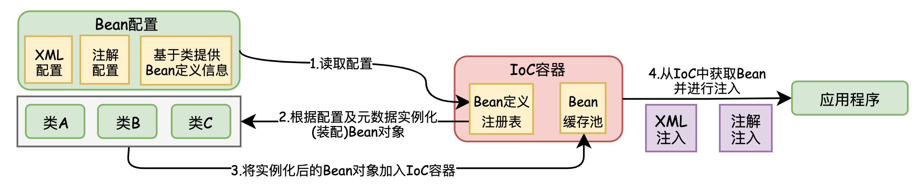

 &emsp; &emsp;Java是纯粹的面向对象的编程语言，它吸收了C++语言的特点，同时也摒弃了C++中难以理解的多继承，指针等概念。本Blog从C++为角度，主要学习总结C++与Java之间的区别，以及Java本身的基础特性。对于Java与C++的共有特性则略过。

***
##  一.  Java运行机制
&emsp; &emsp; Java介于编译型语言和解释型语言之间。编译型语言(C、C++)其代码是直接编译成机器码执行，但是不同的平台(x86、ARM等)CPU的指令集不同，因此，需要编译出每一种平台的对应机器码。解释型语言(Python、Ruby)由解释器直接加载源码然后编译运行，代价是运行效率太低。而Java是将代码编译成一种<font color=red>“**字节码**”</font>，<font color=green>针对不同平台编写虚拟机(JVM)，不同平台的虚拟机负责加载字节码并执行，这样就实现了“一次编写，到处运行”。</font>


&emsp; &emsp; Java中包括很多的开发工具，如JDK(Java Development Kit)，JRE(Java Runtime Environment)。其关系如下图所示：


###  1.1 Java .class 字节码文件

###  1.2 Java JVM 底层原理
###  1.3 Jar包
 &emsp; &emsp; Jar是Java的档案文件，是一种压缩文件，Jar文件与ZIP压缩文件兼容，区别是Jar文件中默认包含了一个`META-INF/MANIFEST.MF`的清单文件。<font color=green>当一个应用开发完成后，会将包含的`class`文件打包成一个Jar文件提供给其他人使用，只需要将Jar包路径添加到环境变量中，JVM会把这个Jar文件当成一个路径来处理，并在内存中解压Jar包。</font>


> <font color=SlateBlue>  <u>**Q. 使用Jar文件的好处？**</u></font>
 &emsp; ①  可以对Jar文件进行数字签名，保证Jar文件的安全。
 &emsp; ② 加快下载速度，当多个`class`文件进行传输时，需要每个文件单独建立一个HTTP连接。如果压缩成Jar文件，只需要一次连接即可。
&emsp; ③ 使`class`文件变小，减少空间的占用
&emsp; ④ 可移植性，Jar包时Java平台内部处理的标准，能够在各种平台上直接使用。

***
##  二. Java 语言基础
###  2.1 Java 程序基本规则
 &emsp;&emsp;与C++相比，Java是完全的面向对象的语言，因此Java与C++在程序规则上有所区别：
 &emsp; &emsp;  ①  Java程序必须以`class`的形式存在，`class` 是java的最小程序单位。<font color=red>在Java程序中，不允许可执行语句、方法独立存在。</font>
&emsp; &emsp; <font color=red>② 如果一个Java程序文件中定义了一个`public`类，则该程序文件的文件名必须和该`public`类名相同。因此，一个Java程序文件最多只能有一个`public`类。</font>
&emsp; &emsp;  ③ Java中编译器通过Main()方法作为程序的入口，且Main()的修饰符必须为：`public static void main(String [] args){}`
###  2.2 Java 语法基础
####   ▍ **2.2.1 Java关键字**

&emsp; &emsp;  Java中一共有48种关键字，如下表所示。关键字可以分为程序逻辑控制关键字，系统控制(线程同步)关键字，数据类型关键字，类/对象关键字，包/方法管理关键字。红色的为常用的关键字。由于Java与C++的关键字有很多相同之处，未介绍的关键字可以查看「[C++基础](https://blog.csdn.net/weixin_42963969/article/details/103018074)」


####  ▍ **2.2.2 Package 与 import  机制**

&emsp; &emsp;  Java引入了包机制，用于解决类名冲突与类文件管理等问题(类似于C++中的`namespace`)。Java允许将一组功能相关的类放在同一个`Package`下，构成类库单元。当Java程序文件中使用了`Package`语句时，则该程序文件中定义的所有类都在这个`Package`下。同时，在父包下可以创建子包，<font color=green>虽然父包和子包存在某种联系，但在用法上没有任何关系，如在父包类中需要使用子包中的类时，必须使用子包的全名，而不能省略父包部分</font>。
&emsp; &emsp;  同时Java引入了`import`机制，可以向某个Java文件中指定包层次下的某个类或全部类。

```java
//t1Class.java
package Test      		//父包
import Test.A.t2Class;  //在父包导入子包类时，必须使用子包的全名，不能省略父包部分
public class t1Class{}

//t2Class.java
package Test.A			//子包
public class t2Class()
```
&emsp; &emsp; Java常用的包结构如下图所示：


***
###  2.3 Java 对象
####  ▍ **2.3.1  Class类 / 对象 - 类的元数据** 

##### <font color=Sienna>**1. Class类概述**</font>

  &emsp; &emsp; 在Java中，一切皆对象。Java分为两种对象：<font color=red>**Java实例对象 和 Java Class对象(字节码文件描述对象)**</font>。每个类的运行时的类型信息就是用Class对象表示的。它包含了与类有关的信息。每一个类有且只有一个Class对象，Class对象对应`java.lang.Class`类，是对类的抽象和集合，是类的字节码文件描述对象。Class类的特点如下：
  &emsp; &emsp;  ● 自定义的类在编译后会<font color=green>**生成一个唯一的Class对象**，**Class对象保存在与自定义类同名的.class文件中**</font>。
  &emsp; &emsp;  ●<font color=green> **无论创建多少个自定义类的对象，有且只有一个Class对象**</font>，表示自定义类的类型信息。
  &emsp; &emsp;  ● Class类没有公共的构造方法，<font color=green>**仅在类加载的过程中，由JVM自动构造，因此不能显式的声明一个Class对象**</font>。


> <font color=SlateBlue>  <u>**Q. Class类的作用 ？**</u></font>
>  &emsp;在C++中有个重要的概念：<font color=red>**运行时类型识别(`RTTI`)**</font>，其作用是在运行时识别一个对象的类型和类的信息。Java中同样存在`RTTI`，Java中的`RTTI`实现有两种方式：
&emsp;   ● 在编译期已确定其所有对象的类型，这种方式需要在写程序的时候将对象通过new创建出来。
&emsp;   ● 通过反射机制，在运行时发现和使用类型的信息。在Java中用来表示运行时类型信息的对应类就是Class类。

```java
1. Class类常用的方法:
  1）public static Class<?> forName(String className):参数是一个类的全限定名(package path)，返回该类的Class对象引用。
  2）public T newInstance():创建此 Class 对象所表示的类的一个新实例。  
  3）public native Class getSuperclass()：获取类的父类
  4）public ClassLoader getClassLoader() ：获得类的类加载器。
  5）public String getName() ：获取类或接口的名字。enum为类，annotation为接口。
  6）public Constructor<?>[] getConstructors() ：获得所有的构造函数。
  7）public Field[] getFields() :获得域成员数组。    
  8）public Method[] getMethods() ：获得方法。
2. 三种方法获得Class对象：
    1）获取类的静态成员变量class
          Class c = Test.class;
    2）调用对象的getClass()方法，返回该对象对应的一个Class对象
          Class c = test.getClass();
    3) 调用Class类的静态方法forName();
          Class c =Class.forName("testpackage.test");   
```
##### <font color=Sienna>**2. Class类包含的信息**</font>
&emsp; &emsp; Class类由类加载器从.class文件中加载，并在JVM中生成该类的Class对象，每一个Class对象都关联着定义它的那个类加载器。每个Class类中包含的信息有field(字段)，method(方法)、constructor(构造函数)，将这些信息的共有特性分别封装成一个类，就分别对应Field类，Method类、Constructor类。


&emsp;  &emsp;  ● Constructor类：代表某个类中的一个构造方法
&emsp;  &emsp;  ● Method类：代表某个类中的一个成员方法
&emsp;  &emsp;  ●Field类：代表某个类中的一个成员变量

```java
package test
public class ReflectClass {
    private int nums;
    public ReflectClass(int i){
        this.nums = i;
    }
    public int getNum(){
        return this.nums;
    }
    public void setNum(int n){
      	this.nums = n;
    }
}

// 1. Constructor类
// 从Class类中获取所有构造器类
Class clazz = Class.forName("test.ReflectClass");  //根据全限定类名，将对应的.class字节码文件加载到内存，并生成Class对象
Constructor [] constructors= clazz.getConstructors();  //获取Class类中的所有构造器
// 根据构造函数的参数类型，从Class类中，获取对应的构造器类
Constructor constructor1 = clazz.getConstructors(null);      //获取默认构造函数
Constructor constructor2 = clazz.getConstructors(int.class); //根据构造参数的类型，获取对应的构造器
ReflectClass reflectClassObj = (ReflectClass) constructor.newInstance(num);  //通过构造器创建实例对象，并输入构造函数参数

// 2. Method类
// 从Class类中获取对应的方法,仅能获取public定义的方法
reflectClassObj.getClass().getMethod("setNum",int.class).invoke(test,100);   //通过实例对象的Class类获取对应的方法，并执行
System.out.println(reflectClassObj.getClass().getMethod("getNum").invoke(test)); //通过实例对象的Class类获取对应的方法，并执行

// 3. Field类
// 从Class类中获取对应的方法，仅能获取public定义的成员变量
System.out.println(reflectClassObj.getClass().getField("nums").get(test));
```


####  ▍ **2.3.2  类加载**

##### <font color=Sienna>**1. 类的生命周期**</font>

&emsp; &emsp; 类的生命周期是从虚拟机将`.class`文件加载到内存开始，直到卸载出内存为止。类的生命周期分为7个阶段，如下图所示：


&emsp; &emsp; **● 加载阶段(类加载器)：** JVM通过类的全限定名获取定义此类`.class`文件中的二进制字节流，并将字节流中的静态存储结构`(static)`转化为方法区的运行时数据结构，最终在内存中生成一个代表这个类的`java.lang.Class`对象，作为方法区该类的各种数据的访问入口。

&emsp; &emsp; **● 验证阶段：** 确保`.class`文件的字节流包含的信息符合虚拟机的要求，不会危害虚拟机自身的安全。验证阶段分为4个过程：
&emsp; &emsp;① 文件格式验证：验证字节流是否符合`.class`文件格式的规范，并且能被当前版本的虚拟机处理，通过该阶段后，字节流会进入内存的方法区中进行储存。
&emsp; &emsp;② 元数据验证(.class语言分析)：对字节码描述的信息进行语言分析，对类的元数据信息进行语义校验，确保其描述的信息符合Java语言规范要求。
&emsp; &emsp;③ 字节码验证(.class语义分析)：通过数据流和控制流分析，确定程序语义是符合逻辑的。这个阶段对类的方法进行校验分析，保证类的方法在运行时不会做出危害虚拟机安全的事件。
&emsp; &emsp; ④ 符号引用验证：对类自身以外的信息（常量池中的符号引用）的信息进行校检，确保后续的解析动作能够正常执行。

&emsp; &emsp; **● 准备阶段(分配空间)：** 为类变量（仅为`static`修饰的变量）分配内存空间并设置数据类型零值。实例对象会在对象实例化时分配在Java堆中。

&emsp; &emsp; **● 解析阶段：** <font color=green>将常量池的符号引用替换为直接引用的过程。</font>解析动作主要针对类或接口、字段、类方法、接口方法、方法类型、方法句柄、和调用限定符7类符号引用。

> <font color=SlateBlue>  <u>**Q. 什么是符号引用、直接引用 ？**</u></font>
&emsp;&emsp;  ⊕ <font color=orange>符号引用是以一组符号来描述所引用的目标，符号可以是任何字面量，只要使用时无歧义定位到目标即可。符号引用与虚拟机的内存布局无关。</font><font color=green>在编译的时候每个Java类都会被编译成一个`.class`文件，但在编译的时候虚拟机并不知道所引用类的地址，就用符号引用来代替，而在解析阶段就是为了把这个符号引用转化成为真正的地址的阶段。</font>
&emsp;&emsp; ⊕ <font color=orange>直接引用是可以直接定位到目标的指针、相对偏移量或是一个能间接定位目标的句柄。直接引用是与虚拟机的内存布局相关的，同一个符号引用在不同虚拟机实例上翻译出来的直接引用不会相同。</font>

&emsp; &emsp; **● 类初始化：** 执行类中定义的Java代码 ，分为<font color=orange>类的**主动引用**、**被动引用**</font>：
&emsp; &emsp; <font color=green>**⊕ 主动引用**：是指在初始化阶段，一定会对类进行初始化。</font>有4种场景会发生类的主动引用：
&emsp; &emsp;  「1」使用new关键字实例化对象的时候；读取或设置一个类的静态字段【`getstatic`、`putstatic`、`invokestatic`操作静态字段的指令】(被`final`修饰、已经在编译期把结果放入常量池的静态字段除外)，以及调用一个类的静态方法的时候。
&emsp; &emsp;  「2」使用`java.lang.reflect`包的方法对类进行反射调用的时候。
&emsp; &emsp;  「3」当初始化一个类的时候，如果发现其父类还没进行初始化，则必须对父类进行初始化。
&emsp; &emsp;  「4」当虚拟机启动时，用户指定的要执行的主类（包含main方法的类）

&emsp; &emsp; <font color=green>**⊕ 被动引用**：除了主动引用，其余引用类的方式都不会触发初始化，因此称为被动引用。</font>
&emsp; &emsp;  「1」对于静态字段，只有直接定义这个字段的类才会被初始化，<font color=green>通过其子类来引用父类中定义的静态字段，只会触发其父类的初始化而不会触发子类的初始化。</font>
```java
package test;
class Superclass{
    public static int value=10;
    static{
        System.out.println("super");
    }
}
class child extends Superclass{
    static {
        System.out.println("child");  //不会触发该类的初始化
    }
}
public class test {
    public static void main(String[] args) {
        System.out.println(child.value);  //输出super 和 10
    }
}
```
&emsp; &emsp;  「2」<font color=green>通过数组定义来引用类，不会触发此类的初始化。</font>
```java
package test;
class Superclass{
    public static int value=10;
    static{
        System.out.println("super");
    }
}
public class test {
    public static void main(String[] args){
        Superclass superclass[]=new Superclass[10];   //没有任何输出,不会初始化类Superclass
    }
}
```
&emsp; &emsp;「3」<font color=green>常量在编译阶段会存入调用类的常量池中，并没有直接引用到定义常量的类，因此不会触发定义常量的类的初始化。</font>
```java
package test;
class Superclass{
    public static final String DEFINE_TYPE = "hello";
    static{
        System.out.println("super");
    }
}
public class test {
    public static void main(String[] args) {
        System.out.println(Superclass.DEFINE_TYPE);  //仅输出hello，Superclass没有初始化
    }
}
```
> <font color=SlateBlue>  <u>**Q.  static，final，static final 对修饰字段赋值时的区别 ？**</u></font>
&emsp; ● `static` 在准备阶段时被初始化为0或null，在初始化阶段时被赋予代码中设定的值，如果没有设定值，则仍为默认值。
&emsp; ● `static final` 在通过Javac编译时生成常量值`Constantvalue`属性，在准备阶段时根据设定值为该字段进行赋值。该字段没有默认值，必须显式的赋值。
&emsp; ● `final` 在运行时被初始化，一旦初始化便不可更改。

##### <font color=Sienna>**2. 类加载器**</font>

&emsp; &emsp; <font color=green>在类生命周期的加载阶段，是由<font color=orange>**类加载器**</font>来完成的。类加载器根据一个类的全限定名读取类的二进制字节流到JVM中，然后生成对应的`java.lang.Class对象`实例。</font>JVM中包含四种类型的类加载器：
&emsp; &emsp;  ● `(Bootstrap) 启动类加载器`：`Bootstrap`类加载器是由本地代码实现，它负责将`JAVA_HOME/lib`下面的核心类库或`-Xbootclasspath`选项指定的jar包加载到内存中。`Bootstrap`类加载器由JVM本地实现，因此开发者无法直接获取到`Bootstrap`类加载器的引用。
&emsp; &emsp;  ●`(Extension) 扩展类加载器`：`Extension`类加载器由`ExtClassLoader (sun.misc.Launcher$ExtClassLoader)` 实现，负责将`JAVA_HOME/lib/ext`或者由系统变量`-Djava.ext.dir`指定位置中的类库加载到内存中，开发者可以直接使用标准扩展类加载器。
&emsp; &emsp;  ●`(System) 系统类加载器`：Syetem类加载器由`AppClassLoader (sun.misc.Launcher$AppClassLoader)` 实现，负责将当前类所在路径及其引用的第三方类库的路径下的类库加载到内存中。
&emsp; &emsp;  ●`(User) 自定义类加载器`：`User`类加载器是根据自身需要自定义的`ClassLoader`。

&emsp; &emsp;<font color=Sienna>**3. 类的加载机制 - 双亲委派机制**</font>
&emsp; &emsp; JVM 在加载类时默认采用<font color=red>**双亲委派机制**</font>，其过程如图所示：


> <font color=SlateBlue>  <u>**Q1. 双亲委派机制的作用及优点 ？**</u></font>
&emsp; ① 为了保证Java系统核心类的安全，对于Java核心库的类的加载工作由引导类加载器来统一完成，<font color=green>保证 Java应用所使用的都是同一个版本的 Java核心库的类，避免用户对核心类重写，使Java核心类出现混乱。</font>如用户重写了`Java.lang.Object`类，在类加载时，双亲委派机制会从`Bootstrap`类加载器开始加载`Object`类，从而不会加载用户重写的核心类。避免Java核心API中的类被随意替换。
&emsp; ② <font color=green>双亲委派机制避免类的重复加载，当父类加载器已经加载了该类时，子类加载器就不用再加载。</font>

####  ▍ **2.3.3  类引用** 

##### <font color=Sienna>**1. 类的引用**</font>

&emsp; &emsp; 所谓引用，是指创建一个”对象标识符“，通过操纵”标识符“使其指向一个对象。这个”标识符“称为引用变量(通俗来说，引用 = 引用变量 = 常说的变量)。<font color=green>一个引用变量可以指向多个对象，但仅保留最后一次引用。一个对象也可以被多个引用变量所指。</font>

```java
// 1.这里 new Person是一个对象，p是一个”标识符“，指向Person对象的引用。
Person p = new Person("A");   
int a = 2;     //2是一个Intger的对象，a是一个指向Intger的引用

// 2.一个引用可以指向多个对象，但仅保留最后一次引用
int a=2;
a=3;   

// 3.一个对象也可以被多个引用所指
Person p1 = new Person("B");
Person p2=p1;
```
 &emsp; &emsp;  为了更加灵活的控制对象的声明周期，Java将对象的引用分为4个等级，<font color=red>从高到低依次为：强引用，软引用，弱引用，虚引用。</font>
 &emsp; &emsp;  ●   **强引用**：强引用是指创建一个对象并把这个对象赋给一个引用变量，强引用是使用最普遍的引用。<font color=green>如果一个对象具有强引用，当内存空间不足时，JVM宁愿抛出`OutOfMemoryError`错误，使程序异常终止，也不会回收具有强引用的对象来解决内存不足的问题。</font>因此，<font color=darkorange>当强引用对象不使用时，需要将其指向`null`，使其可以被GC回收。</font>
 &emsp; &emsp;  ●   **软引用 (SoftReference)**：<font color=green>如果一个对象**只**具有软引用，则内存空间充足时，垃圾回收器就不会回收它；如果内存空间不足了，JVM会将软引用中的对象引用置为`null`，然后通知垃圾回收器GC进行内存回收。</font>只要垃圾回收器没有回收它，该对象就可以被程序使用。软引用可用来实现内存敏感的高速缓存，如图片缓存，浏览器后端页面缓存。
&emsp; &emsp;  ●  **弱引用 (WeakReference)**：只具有弱引用的对象拥有更短暂的生命周期，当垃圾回收器GC扫描到只具有弱引用的对象，不管当前内存空间是否足够，都会回收内存。
&emsp; &emsp;  ●  **虚引用 (PhantomReference)**：虚引用并不会决定对象的生命周期。如果一个对象仅持有虚引用，那么它就和没有任何引用一样，在任何时候都可能被垃圾回收器回收。使用虚引用的目的就是为了得知对象被GC的时机，可以利用虚引用来进行销毁前的一些操作，比如说资源释放等。

> <font color=SlateBlue>  <u>**Q1. 虚引用 与 软引用、弱引用的区别 ？**</u></font>
> &emsp;  虚引用**必须**和引用队列 (`ReferenceQueue`) 联合使用。当垃圾回收器准备回收一个对象时，如果发现它还有虚引用，就会在回收对象的内存之前，把这个虚引用加入到与之关联的引用队列中。
>
> 
```java 
class Superclass{
    public void test(){
        System.out.println("test");
    }
    public static String DEFINE_TYPE = "hello";
    static{
        System.out.println("super");
    }
}

// 1.强引用 - 正常的对象引用
	String str =  new String("abc"); 
	Superclass super =  new Superclass();    
	super = null; // 当强引用不使用时，置为null，以便GC回收

// 2.软引用 - SoftReference
	Superclass superclass =  new Superclass(); 
	SoftReference<Superclass> softReference=new SoftReference<Superclass>(superclass);
	if(softReference.get()!=null){	//内存充足，还没有被回收器回收，直接通过get()方法获取对象
	   Superclass soft=(Superclass)softReference.get();  
	   soft.test();
	}else{
	    softReference = new SoftReference(superclass); // 内存不足，软引用的对象已经回收，重新构建软引用
	}
	// 软引用可以和引用队列联合使用，软引用对象被垃圾回收，JVM会把软引用加入到与之关联的引用队列中。
	ReferenceQueue<String> referenceQueue = new ReferenceQueue<>();  //引用队列
	String str = new String("abc");
	SoftReference<String> softReference = new SoftReference<>(str, referenceQueue);//软引用关联引用队列

// 3.弱引用 - WeakReference
	String str = new String("abc");
	WeakReference<String> weakReference = new WeakReference<>(str);
	str = null;
	// 弱引用可以和引用队列联合使用，弱引用对象被垃圾回收，JVM会把弱引用加入到与之关联的引用队列中。
	ReferenceQueue<String> referenceQueue = new ReferenceQueue<>();  //引用队列
	String str = new String("abc");
	WeakReference<String> weakReference = new WeakReference<>(str, referenceQueue);//弱引用关联引用队列

// 4.虚引用 - PhantomReference
	String str = new String("abc");
	ReferenceQueue queue = new ReferenceQueue();
	// 创建虚引用，要求必须与一个引用队列关联
	PhantomReference pr = new PhantomReference(str, queue);
```
 &emsp; &emsp;<font color=Sienna>**2. Java 类加载过程中的引用关系**</font>
&emsp; &emsp; 在类的全生命周期中，从类的加载器，生成类的Class对象，到类的实例对象的使用有着密不可分的引用关系：
&emsp; &emsp;  ● 类加载器与Class对象：类的Class和加载它的加载器之间是<font color=orange>**双向关联**</font>关系。即<font color=green>一个Class对象总是会引用他的类加载器，调用Class对象的`getClassLoader`方法就可以获得它的类加载器。</font>
&emsp; &emsp;  ● 类，类的Class对象，类的实例对象：<font color=green>一个类的实例对象总是引用该类的Class对象，在Object类中定义该类`getClass`方法，会返回对象所属类的Class对象的引用。</font>

```java
package test;
class Superclass{
    public void test(){
        System.out.println("test");
    }
    public static final String DEFINE_TYPE = "hello";
    static{
        System.out.println("super");
    }
}
public class test {
    public static void main(String[] args) throws IllegalAccessException, InstantiationException, ClassNotFoundException {
        ClassLoader classLoader = Superclass.class.getClassLoader();  //Superclass的类加载器
        Class objClass = classLoader.loadClass("test.Superclass");   //Superclass Class对象
        Object obj=objClass.newInstance();                     //Superclass的Object父类
        Superclass superclass = (Superclass)obj;        //Superclass的实例对象
        superclass.test();
    }
}
```


####  ▍ **2.3.4  类反射 - Class对象的主要应用**

 &emsp; &emsp; Java程序在运行之前需要先编译。程序中的对象初始化，对象的调用在编译时期就已经确定并加载到JVM中。当程序在运行时需要 "**动态加载**" 某些类时，由于这些类并没有加载到JVM当中，无法直接获取。但是<font color=green>通过Java的反射机制，可以在运行时动态地创建对象并调用其属性和方法，不需要提前在程序中(编译时期)进行对象的初始化和调用。</font><font color=red>Java反射机制的本质是JVM得到Class对象之后，再通过Class对象进行反编译，从而获取对象的各种信息。</font>


> <font color=SlateBlue>  <u>**Q1. 反射有什么用途 ？**</u></font>
> &emsp;  ① 通过Java反射机制，访问Java未初始化对象的属性和方法。
> &emsp;  ②  反射最重要的用途就是开发各种通用框架。如: `Spring`都是通过`xml`文件配置化的，为了保证框架的通用性，大多数框架需要根据配置文件加载不同的类或者对象，调用不同的方法，这时框架就必须使用反射在程序运行时动态加载需要使用的对象。
> &emsp;  ③ 当使用IDE编程时，IDE会自动列举某一对象所包含的方法和属性，这是通过反射实现的。
>
> <font color=SlateBlue>  <u>**Q2. 反射技术的优缺点 ？**</u></font>
> &emsp;  ① 优点：反射提高了Java程序的灵活性和扩展性，降低耦合性，提高自适应能力。
> &emsp;  ② 缺点：
> &emsp;  &emsp;  ● 性能问题：反射技术是通过.class文件的一种解释操作，反射用于方法和字段时其性能要慢于代码中直接定义。因此Java反射机制一般用于灵活性和扩展性要求很高的系统框架上，普通程序不建议使用。
> &emsp;  &emsp;  ● 代码维护问题：反射技术绕过了源代码，使用反射会模糊程序内部逻辑，因而会带来维护问题。

####  ▍ **2.3.5 继承与接口**

##### <font color=Sienna>**1. 继承 extends**</font>

 &emsp; &emsp;  继承是Java面向对象的特征之一，Java的继承通过关键字`extends`来实现，<font color=green>与C++相比，Java摒弃了多继承，只保留了单继承，即每一个类最多只有一个直接父类。</font>在子类创建某个类对象时，系统会隐式的创建该类的父类对象，且可以通过`super`来该子类的父类对象。如果一个Java类没有显式指定直接父类，则默认其直接父类为`Java.lang.Object`。

```java
class parent{
	public int a;
}
class children extends parent{
	void fun(){
		super.a=10;
	}
} 
```
&emsp;&emsp; 由于继承会破坏父类的封装性，使子类与父类之间的耦合，因此子类与父类之间应当遵循如下规则：
&emsp; &emsp;  ① 将父类的所有属性设置为` private`，不让子类直接访问父类属性。
&emsp; &emsp;  ② 不要让子类随意修改、访问父类的方法。父类中的工具方法要设置为`private`; 父类中需要被外部调用但不希望子类重写该方法的要设置为`final`; 如果父类的方法能够被子类重写，但不希望被其他类访问，要设置为`protected`。
&emsp; &emsp;  ③ 不要在父类构造器中调用被子类重写的方法。

##### <font color=Sienna>**2. 抽象类与接口**</font>
&emsp; &emsp; 与C++相比，Java的抽象与接口定义更加明确。在Java中，通过`abstract`定义抽象类，与C++相同，<font color=green>**因为抽象类中含有无具体实现的方法，所以不能用抽象类创建对象(无法进行实例化)，仅能通过子类的继承对抽象方法进行实例化**。</font>除此之外，Java还引入了一种更加纯粹的抽象类 - 接口(`interface`)，<font color=green>在`interface`中，所有的方法都是抽象方法，同时引入了`implement`来实现接口。</font>

> <font color=SlateBlue>  <u>**Q1. 抽象类与接口的区别 ？**</u></font>
> &emsp; ● 语法层面：
> &emsp; &emsp;  ①  抽象类可以提供成员方法的实现细节，而接口中只能存在`public abstract`方法；
> &emsp; &emsp;  ② 抽象类中的成员变量可以是各种类型的，而接口中的成员变量只能是`public static final`类型；
> &emsp; &emsp;  ③ 接口中不能含有静态代码块以及静态方法，而抽象类可以有静态代码块和静态方法；
> &emsp; &emsp;  ④ 一个类只能继承一个抽象类，而一个类却可以实现多个接口。
> &emsp; ● 设计层面：
> &emsp; &emsp;  ① 抽象类是对类本质的抽象，避免在子类开发重复的代码，表达的是is-a的关系，包含的是实现子类的通用特性，将子类存在差异化的特性进行抽象，交由子类去实现。
> &emsp; &emsp;  ② 接口是对行为的抽象，表达的是like-a的关系，接口的核心是定义行为，即实现类可以做什么，至于实现类是谁，如何实现的，接口并不关心。  

```java
// ifaceA.java
package A.package1;
public interface ifaceA{  //定义接口
    void fun1();
    void fun2();
}
//ifaceB.java
package A.package1;
public interface ifaceB{  //定义接口
    void fun3();
    void fun4();
}

// Iimplement.java
package A;
import A.package1.iface;
public class Iimplement implements A.package1.ifaceA,A.package1.infaceB{  //实现接口
	@Override
	public void fun1(){
		System.out.print("A");
	}
	@Override
	public void fun2(){
		System.out.print("B");
	}
	@Override
	public void fun3(){
		System.out.print("C");
	}
	@Override
	public void fun4(){
		System.out.print("D");
	}
} 
```

***
###  2.4 Java 注解 Annotation - 类的标签
  &emsp; &emsp; 注解是Java提供的一种途径和方法，可以使源程序中的元素关联到代码中的`元数据 (metadata)`。  <font color=green> 注解是附加在代码中的一些源信息或标签信息，用于在一些工具在编译、运行时进行解释和使用，起到**说明**，**配置**的功能，**可以将注解理解为标签**。</font>注解为一种修饰符，应用于类、方法、参数、变量的声明语句中。注解不会也不能影响代码本身的业务逻辑，仅仅只能起到辅助性的作用。**在定义注解时，通过@interface进行修饰，使用注解时要在被修饰的类或变量之前调用定义的注解。**

><font color=SlateBlue>  <u>**Q1. 什么是元数据 (Metadata)？**</u></font>
>&emsp;  要真正了解注解的工作方式和原理，就需要先了解什么是元数据。
>&emsp;  元数据是一种很抽象的定义，<font color=red> 元数据是一系列关于数据的数据，是一系列用来描述数据的数据。</font>元数据可以为数据说明其元素或属性(如：名称、大小、数据类型等)，或其结构 (如：长度、字段等)，或其相关数据(如：位于何处、数据拥有者等)
>
>
>
><font color=SlateBlue>  <u>**Q2. @interface 和 interface 的区别 ？**</u></font>
>&emsp;    ●  @interface: 是用来修饰Annotation的,表示实现了java.lang.annotation.Annotation接口
>&emsp;    ●  interface: 声明一个java的接口

####  ▍ **2.4.1 注解基本概念** 
#####  <font color=Sienna>**1. 注解的属性**</font>

  &emsp;&emsp;注解的属性也叫做成员变量。<font color=red>**注解只有成员变量，没有方法**</font>。注解的成员变量在注解的定义中以“无形参的方法”形式来声明，其**方法名=该成员变量的名字，其返回值=该成员变量的类型，若注解中属性存在默认值，默认值需要用 default 关键字指定。**对注解的属性赋值的方式是在注解的括号内以value=”” 形式，多个属性之前用","隔开。

  ```java
  @Target(ElementType.TYPE)
  @Retention(RetentionPolicy.RUNTIME)
  public @interface TestAnnotation {
      int id() default 0;    	//等同于成员变量 => int id = 0;
      String msg(); 					//等同于成员变量 => string msg;
  }
  
  @TestAnnotation(id=3,msg="hello")  //对注解的变量进行赋值
  public class Test {
  }
  ```
##### <font color=Sienna>**2. JDK内置Annotation**</font>

  &emsp;&emsp; 在Java中存在三个基本的Annotation：
  &emsp;&emsp; ● **@Override** - 限定重写父类方法：强制一个子类覆盖父类的方法。
  &emsp;&emsp; ● **@Deprecated** - 标示已过时：表示某个程序元素(类，方法，成员变量)已过时，当使用过时方法时，编译器会发出警告。
  &emsp;&emsp; ● **@SuppressWarnings** - 抑制编译器警告：通常情况下，程序中使用没有泛型限制的集合会引起编译器警告，为了避免警告，可以通过`@SuppressWarning`抑制编译器警告。

```java
public class Base{
	void fun(){}
	@Deprecated
	void old(){}   //该方法已过时，不可再调用
}
class child extends Base{
	@Override   //重写父类方法
	@SuppressWarnings(value = "uncheck")  //抑制编译器警告
	void fun(){
		List<String>list=new ArrayList();
	}
}
```
##### <font color=Sienna>**3. 元注解**</font>

  &emsp;&emsp;元注解是 Java 提供的**用于修饰注解的注解**，是基本注解。`Annotation`提供了四种元注解，分别是：
  &emsp;&emsp;  **● @Target：**注解所作用的目标，指明这个注解最终是用来修饰方法，还是修饰类，还是修饰属性；
  &emsp;&emsp;  **● @Retention：**用于指明当前注解的生命周期，生命周期包含三个阶段：<font color=green>**`SOURCE`在编译阶段丢弃**、**`CLASS`在类加载的时候丢弃**、**`RUNTIME`始终不会丢弃，运行期也保留该注解**</font>，因此可以使用反射机制读取该注解的信息。


  &emsp;&emsp;  ● @Documented：注解修饰的注解，当执行 JavaDoc 文档打包时会被保存进 doc 文档，反之将在打包时丢弃。
  &emsp;&emsp;  ● @Inherited：注解修饰的注解是具有可继承性的，也就说我们的注解修饰了一个类，而该类的子类将自动继承父类的该注解。

```java
public @interface TestAnnotation {    //通过 @interface 来定义注解 
}

@Inherited	//元注解，用于对注解的修饰，相当于对@TestAnnotation注解打上了一个标签
						//注解@TestAnnotation被@Inherited修饰，之后类Test被@TestAnnotation注解，类TestB继承A,类TestB也拥有@TestAnnotation注解。
@TestAnnotation   //对类使用注解，相当于对Test类打上了一个标签
public class Test {
}
```

#### ▍ **2.4.2 自定义注解 (注解的应用)**
  &emsp;&emsp; 定义新的Annotation类型需要使用`@interface` 关键字。<font color=green>通俗来说，可以将注解理解为”标签“，在类和方法中使用注解，相当于对类和方法打上了”标签“，后续只需要判断是否存在这个”标签“，并对”标签“的”内容(定义的变量)“进行处理即可</font>。<font color=red>在注解应用的过程中，通常包括三个步骤：**注解声明，使用注解元素，配置注解处理器**</font>。自定义Annotation的规则如下：
  &emsp;&emsp;① Annotation 型定义为@interface, 所有的Annotation 会自动继承` java.lang.Annotation`这一接口,并且不能再去继承别的类或是接口。
  &emsp;&emsp;② 注解的参数成员(变量、方法)只能用 `public` 或默认(`default`)这两个访问权修饰。
  &emsp;&emsp;③ 注解的参数成员只能用基本类型byte、short、char、int、long、float、double、boolean八种基本数据类型和String、Enum、Class、annotations等数据类型，以及这一些类型的数组。
  &emsp;&emsp;<font color = orange>④ 要获取类方法和字段的注解信息，必须通过 java的反射技术来获取 `Annotation` 对象。</font>


#### ▍ **2.4.3 注解的底层原理 **(从字节码到注解实例)
  &emsp;&emsp; <font color=red> `Annotion`(注解)是一个接口，程序可以通过反射来获取指定程序元素的`Annotion`对象，然后通过`Annotion`对象来获取注解里面的元数据。</font><font color=green>注解不支持继承，因此**不能使用关键字`extends`来继承某个`@interface`**，但注解在编译后，编译器会自动继承`java.lang.annotation.Annotation`接口。因此，注解的本质是一个继承了 `Annotation` 接口的接口。</font>注解作为一个特殊的接口，其实现类是在代码运行时生成的动态代理类，而之后底层代码通过**反射**的方式获取到注解。


&emsp; 下图以`@Override`为例，说明注解的本质：


&emsp;&emsp;注解的解析流程如下所示：
&emsp; &emsp; ① `getAnnotation()`作为获取注解的主要入口，Class类，Field类，Method类调用`annotationData()`方法创建`Class.AnnotationData`类实例，**`Class.AnnotationData`**是一个注解缓存类，用于缓存该类的注解信息，其中包含两个Map，分别用于存储当前类的注解信息和继承的注解信息。
&emsp; &emsp; ② `Class.AnnotationData` 是由 `AnnotationParser类` **对.class字节码进行解析**，并通过 `AnnotationInvocationHandler` 生成注解的 **`动态代理对象Annotation`**，并将注解对象加入到 `LinkedHashMap (key=Class类型，value=注解对象)`中。


***
###  2.5 Java 线程
&emsp; &emsp; 线程，一个执行实体，正在执行的程序，担当分配系统资源（CPU、内存）的实体。线程的底层实现原理在[操作系统](https://blog.csdn.net/weixin_42963969/article/details/105255948)中具体介绍。这里介绍Java线程的实现方式以及Java线程如何使用。

####  ▍ **2.5.1  线程的实现**

  &emsp;&emsp;Java的线程是通过`java.lang.Thread`类来实现的，在Java中有三种方法来**实现**线程：
  &emsp;&emsp;① 可以<font color=green>通过创建继承`Thread`类的实例来创建新的线程。</font>每个线程都是通过对应的方法`run()`来描述该线程需要执行的操作。通过调用`Thread`类的`start()`方法来启动一个线程。
  &emsp;&emsp;② Java中只支持单继承，如果一个类继承了某个父类，就无法再继承`Thread`类。因此`Thread`类提供了一个`Runnable`接口，<font color=green>可以通过重写`Runnable`接口中的`run()`方法，也可以实现线程的启动，</font><font color=orange>**因此`Runnable`一个线程操作的方法体，是用户定义的需要完成的具体任务，并通过 Thread.start() 去启动线程**。</font>
  &emsp;&emsp;③ 对于某些场景，需要在线程执行完成后将任务执行的结果返回，或当线程在执行时抛出异常。因此可以通过实现`Callable`接口中的 `call()` 方法来完成结果的返回。<font color=green>`Callable`接口通常与`FutureTask`一起使用，通过`FutureTask`来异步的执行线程，并保存线程结果。</font><font color=red>注：通过`new Thread()`创建线程时，只能通过`Runnable`，不能通过`Callable`。</font>
  &emsp;&emsp; <font color=red>**Notice**：当一个线程运行结束后，无法通过`start()`方法再次启动。即每个线程只能被启动一次。</font>

```java
public class test {
    public static void main(String[] args) {
    // 1. 通过继承Thread类实现多线程
        MyThreadA myThread=new MyThreadA();
        
	// 2.通过实现Runnable接口实现多线程
        MyThreadB myThreadB = new MyThreadB();
        Thread thread = new Thread(myThreadB);
        
   // 3. 通过Callable接口实现线程结果返回
   		CallableExample callable = new CallableExample();
   		FutureTask futureTask=new FutureTask(callable);
   		futureTask.run();
   		futureTask.get();  // 获取 线程返回的运行结果
    // 线程启动
        myThread.start();
        thread.start();
    }
}
// 1. 通过继承Thread类实现多线程
class MyThreadA extends Thread{
    @Override
    public void run() {
        for(int i=0;i<10;++i)
            System.out.println("A "+i);
    }
}
// 2.通过实现Runnable接口实现多线程
class MyThreadB implements Runnable{
    @Override
    public void run() {
        for(int i=0;i<10;++i)
            System.out.println("B "+i);
    }
}

// 3. 通过实现Callable接口，实现线程结果的返回
class CallableExample implements Callable { 
	@Override
    public Object call() throws Exception { 
        int a=10;
        return a; 
    } 
} 
```
><font color=SlateBlue>  <u>**Q1. run() 和 start() 的区别 ？**</u></font>
>  &emsp;  ● `run()` 方法是一个普通的成员方法，当线程调用了`start()`方法后，该线程会去调用这个`run()`方法，运行该线程需要执行的操作。因此，如果直接调用run() 方法，只会在原有线程上运行，不会创建一个新的线程。
>  &emsp;  ● `start()` 方法用来启动线程。当线程创建成功时，线程处于`NEW(创建)`状态，调用`start()`后，线程会变为`READY(就绪)`状态，在等待CPU调度后，线程才可以运行，进入`RUNNING(运行)`状态。

####  ▍ **2.5.2  线程状态切换**

  &emsp; &emsp; 在线程的生命周期中，线程共有5种状态：创建、就绪、运行、死亡、阻塞。


 ><font color=SlateBlue>  <u>**Q1. sleep()、wait() 和 notify() 的区别 ？**</u></font>
>&emsp; Java中的`sleep()`和`wait()`函数都可以挂起当前线程，使线程休眠，但实现方式和用法不同：
>&emsp;  ●<font color =green > `sleep()`是 Thread类的方法**静态方法**，需要通过Thread类调用 `Thread.sleep()`。而 `wait()` 和 `notify()` 是 Object类中的实例方法，因为Java所有类都继承于 Object类，所有类中都可以使用。</font>
>  &emsp;  ●<font color = red> `wait()`、`notify()`必须用在 synchronized 代码块中调用。</font><font color=orange>当调用`wait()` 方法后，当前获得 synchronized 同步块对象锁的线程进入”等待阻塞“状态，同时**释放当前线程的对象锁**。此时**其他线程可以获得该 synchronized 同步块的对象锁**。被阻塞的线程需要通过 `notify()` 方法来唤醒。</font>
>  &emsp;  ●  当在 synchronized 同步块中使用 `sleep()`，该线程会被挂起，但**不会释放对象锁**，所以如果有其他线程等待执行该 synchronized 代码块，一直会被阻塞，等待该线程被 `notify()`唤醒释放对象锁。
>  

####  ▍ **2.5.3  线程安全与数据安全**

  &emsp;&emsp;  由于线程创建和运行时，必须通过 Runnable 来定义需要执行的任务，当在 Runnable -> run()方法中定义了一个线程的局部变量，且有多个(>2个) Thread 启动并运行该 Runnable任务时，会出现两个问题：
  &emsp;&emsp; **①  线程安全：** 当多线程在访问共享数据 (Runnable run()中的局部变量) 时,如果一个线程正在执行而没有执行完,它的执行权被其他线程抢走了就有可能出现安全问题。为了解决这个问题，Java提供了同步器来保证线程运行时顺序和同步。
  &emsp;&emsp;  **② 数据安全：** 由于局部变量var是所有线程共同拥有的，因此Thread-1对var的修改会影响Thread-2对var的使用。为了解决这个问题，Java提供了 ThreadLocal 保证线程数据的安全性。


##### <font color=Sienna>**1.  线程安全**</font>

##### <font color=Sienna>**2.  数据安全**</font>

&emsp; &emsp; 线程安全的本质是为了保证线程数据的安全，在Java中可以使用 ThreadLocal 维护变量，从而可以不再使用锁，同步器等工具实现线程的同步。


###### <font color=fpurple>**(1). ThreadLocal - 任务实体中的"共享/全局"变量**</font>

&emsp; &emsp;  为了保证线程的数据安全，在Java中可以使用 ThreadLocal 维护变量，ThreadLocal为每个使用该变量的线程提供<font color=green>**独立的局部变量副本**</font>，每一个线程都可以独立地改变自己的副本，通过 set() 和 get() 来对这个局部变量进行操作，但不会和其他线程的局部变量进行冲突，实现了线程的数据隔离。


 ><font color=SlateBlue>  <u>**Q1.ThreadLocal 是如何实现线程 (数据) 隔离的 ？**</u></font>
 >&emsp;   Thread类中有两个变量`ThreadLocalMap threadLocals`和`ThreadLocalMap inheritableThreadLocals`。在每个Thread线程对象中，都维护了一个ThreadLocalMap。即一个Thread线程对象，最多只有一个ThreadLocalMap，而ThreadLocalMap底层是一个**Entry数组**，但是一个Thread可以有多个ThreadLocal，一个ThreadLocal对应一个变量数据，变量数据将ThreadLocal作为Key，Object作为value，封装成Entry存到ThreadLocalMap中Entry[]数组中。Thread与ThreadLocal之间的关系如下图所示:
 >
 >
 >
 ><font color=SlateBlue>  <u>**Q2.ThreadLocalMap 是如何解决Hash冲突的 ？**</u></font>
 >&emsp;  每个ThreadLocal都有一个对应的`threadLocalHashCode`，通过`threadLocalHashCode & (len-1)`可以算出ThreadLocal变量对应的Entry[]数组的下标(即Key)。当Key发生Hash冲突时，ThreadLocalMap采用<font color=red>**线性探测方法**</font>，循环查找下一位(索引)是否冲突，直到找到不存在冲突的索引(Entry[]数组下标)。
 >&emsp; 
 ><font color=SlateBlue>  <u>**Q3.ThreadLocalMap的Entry中，对 ThreadLocal 的引用为什么要设置成弱引用 ？**</u></font>
 >&emsp; 当代码中将ThreadLocal的强引用置为null后，这时候Entry中的ThreadLocal应该被回收了，但是如果Entry的key被设置成强引用则该ThreadLocal就不能被回收，从而导致内存泄露。 
 >
 >
 >
 ><font color=SlateBlue>  <u>**Q4. ThreadLocal的内存泄露问题？**</u></font>
 >&emsp; ●   <font color=green>虽然 Entry对象中的ThreadLocal引用为弱引用，但这个弱引用只是针对key的。当把 Threadlocal 实例置为null以后，没有任何强引用指向 Threadlocal 实例，此时Threadlocal将会被gc回收。</font><font color=orange>虽然ThreadLocal被回收了，但是Entry对象中的value却不能回收，因为存在一条从`Current Thread`连接过来的强引用。只有当前Thread结束以后, `Current thread`就不会存在栈中，连接value的强引用断开。此时Current Thread, ThreadLocalMap, Entry-value将全部被GC回收。</font>
 >&emsp; ●  根据上述ThreadLocal内存回收的过程可以看出，<font color=red>只要当前的线程对象被GC回收，ThreadLocal就不会出现内存泄露的情况。</font>但如果是在<font color=red>使用线程池</font>的时候，线程结束是不会销毁的，会再次使用的。就可能出现内存泄露。<font color=red>因此，当使用完ThreadLocal之后，调用`Threadlocal`的`remove()`方法把当前`ThreadLocal`从当前线程的`ThreadLocalMap`中移除。</font>

###### <font color=fpurple>**(2). ThreadLocal 的使用**</font>

```java
// 1. ThreadLocal多线程中的使用 - 线程变量不冲突
public class test{
    public static void main(String[] args) throws InterruptedException {
        Task task = new Task();
        Thread t1=new Thread(task);  //线程创建时，会各自创建一个ThreadLocal
        Thread t2=new Thread(task);  //因此，两个线程的ThreadLocal并不冲突
        t1.start();
        Thread.sleep(1000);
        t2.start();

    }
}
class Task implements Runnable{
    //任务实体中的本地变量
    ThreadLocal<Integer> tl =new ThreadLocal<>();
    @Override
    public void run() {
        Integer i = 10;
        tl.set(i);
        if(Thread.currentThread().getName().equals("Thread-0")){
            i++;
            tl.set(i);
        }
        System.out.println(Thread.currentThread().getName() + " i:" + i + " tl:"+tl.get());
    }
}
--Output--:
	Thread-0 i:11 tl:11
	Thread-1 i:10 tl:10
    
// 2. ThreadLocal作为全局变量 - 保存上下文环境中的全局变量
// (1). SelfThreadLocal类 变量内容类，内部定义需要全局存放的对象
public class SelfThreadLocal {
    private User user;
    private Car car;
		// getter() 和 Setter() 省略
}
// (2). SelfContext类 - 全局变量类，定义了ThreadLocal的基本操作[初始化，获取，删除变量操作]
public class SelfContext {
    private static ThreadLocal<SelfThreadLocal> threadLocal = new ThreadLocal<>();

    public static void init(){
        SelfThreadLocal selfThreadLocal = new SelfThreadLocal();
        threadLocal.set(selfThreadLocal);
    }
    public static SelfThreadLocal getContext(){
        return threadLocal.get();
    }

    public static void remove(){
        threadLocal.remove();
    }

    public static User getUserContext(){
        return threadLocal.get().getUser();
    }
}
// (3). Main类 - 全局变量的使用
public class Main {
    public static void main(String[] args)  {
			 	User user = new User();
        user.setName("demo");
        user.setAge(18);

        Car car = new Car();
        car.setBrand("BMW");

        SelfContext.init();  //全局变量初始化
        SelfContext.getContext().setUser(user);  //设置user
        SelfContext.getContext().setCar(car);		 //设置Car
      
      	System.out.println(SelfContext.getContext().getUser().getName());
        Car carContext = SelfContext.getContext().getCar();
        System.out.println(carContext.getBrand());
    }
}
--OutPut:--
demo
BWM
```

###### <font color=fpurple>**(3). InheritableThreadLocal (ITL)**</font> 

&emsp; &emsp;  虽然ThreadLocal为每个使用该变量的线程提供<font color=green>**独立的局部变量副本**</font>，使当前线程变量不会和其他线程的局部变量进行冲突。但是在父线程中创建的本地变量是无法传递给子线程的，因此Java提供了<font color=red>`InheritableThreadLocal (ITL)` 来解决线程在继承过程中变量的传递问题。</font>

```java
public static void main(String[] args) throws InterruptedException {
	ThreadLocal<String> tL=new ThreadLocal<>(); 						//主线程(父线程)创建本地变量
	ThreadLocal<String> itL=new InheritableThreadLocal<>(); //主线程(父线程)创建本地变量
	tL.set("Threadlocal"); 
	itL.set("Threadlocal"); 				
	System.out.println(tL.get());			//输出 “Threadlocal”
	new Thread(()->{                	//在父线程中创建子线程，并在子线程中输出父线程的本地变量
	   System.out.println(tL.get()); 	//输出null，因为ThreadLocal变量不能通过父子线程进行继承
	   System.out.println(itL.get()); //输出Threadlocal，InheritableThreadLocal变量可以通过父子线程进行继承
	}).start();
}
```
 ><font color=SlateBlue>  <u>**Q1. InheritableThreadLocal 是如何实现线程本地变量继承的 ？**</u></font>
 >&emsp;  `InheritableThreadLocal`是ThreadLocal的子类。在线程在创建并初始化时，会检查其父线程是否存在inheritableThreadLocals，如果存在则会在父线程的inheritableThreadLocals的基础上创建子线程。 
 >
 >

######  <font color=fpurple>**(4). TransmittableThreadLocal (TTL)**</font> 

 &emsp; &emsp; TL 解决了不同线程之间使用同一本地变量时的冲突问题，ITL解决了在线程继承中，本地变量从父线程传递(继承)到子线程的问题。但在ITL中仅解决了线程继承这一瞬间的变量传递问题，如果创建子线程一直被池化复用 (如线程池中的子线程)，则父线程与子线程之间的变量无法进行同步，则会导致数据问题。针对该问题，AliBaba 在ITL的基础上提出了TTL，<font color=green>**用来解决子线程池化复用时的变量数据（此时的变量数据可以看做是业务逻辑的上下文）传递问题**。</font>
&emsp; &emsp; TTL 为了能够在子线程池化复用的过程中保持变量数据的一致性，TTL 对原有的 `Runnable` 进行了改造，实现了 `TtlRunnable` 。通过**CRR模式 `(capture[抓取]，replay[回放]，restore[恢复])`** 对上下文的数据进行同步。


###  2.6 Java 线程池

####  ▍ **2.6.1  线程池描述**

&emsp;&emsp;线程池 (Thread Pool)是一种基于池化思想管理线程的工具。通常一个线程池包含4个基本组成部分：
&emsp; &emsp; ① 线程池管理器 ：用于创建并管理线程池，包括 创建线程池，销毁线程池，添加新任务；
&emsp; &emsp; ② 工作线程：线程池中线程，在没有任务时处于等待状态；
&emsp; &emsp; ③ 任务接口：为工作线程提供任务；
&emsp; &emsp; ④ 任务队列：用于存放没有处理的任务。


><font color=SlateBlue>  <u>**Q1. 为什么要用线程池 及 线程池的作用 ？**</u></font>
>  &emsp;  ● 当计算机中的线程过多时，会带来额外的开销，其中包括创建销毁线程的开销、调度线程的开销等等，同时也降低了计算机的整体性能。通过线程池来维护多个线程，一方面避免了处理任务时创建销毁线程开销的代价，另一方面避免了线程数量膨胀导致的过分调度问题，保证了对内核的充分利用。
>  &emsp;  ● 线程池的作用有以下几个方面：
>  &emsp;&emsp;  **① 降低系统资源消耗**：通过池化技术重复利用已创建的线程，降低线程创建和销毁造成的性能损失。
>  &emsp;&emsp;  **② 提高系统的响应时间**：当任务到来时，无需创建线程就可以并发的执行任务。
>  &emsp;&emsp;  **③ 加强对线程的管理**：通过线程池，可以对线程进行统一的分配、调优和监控。若线程是无限制的创建，可能会导致内存占用过多而产生OOM，并且会造成cpu过度上下文切换。

####  ▍ **2.6.2  线程池原理**

&emsp; &emsp; Java线程池的核心实现类是`ThreadPoolExecutor`，线程池的状态维护,任务管理都在`ThreadPoolExecutor`类中实现，其继承关系如下图所示： 


 ><font color=SlateBlue>  <u>**Q1. Executor接口、ExecutorService接口 和 Exexutors的区别 ？**</u></font>
>&emsp;  <font color=green>● Executor：Executor 是一个抽象层面的核心接口，主要是将任务 Task本身和执行任务分离，解耦合。</font>
>&emsp;  <font color=green>● ExecutorService：ExecutorService 接口继承了 Executor 接口，对 Executor 接口进行了扩展，并返回 `Future 对象`，为线程池终止，关闭线程池等提供操作方法。</font>`Future 对象`提供了**异步执行**，因此只要提交需要执行的任务，无需等待结果，在需要时通过`Future.isDone() 方法`检查 Future 是否执行完成。如果执行完成，就可以通过 `Future.get() 方法`获得执行结果。<font color=orange>**注意:** `Future.get() 方法`是一个阻塞式的方法，如果调用时任务还没有完成，会阻塞等待，直到任务执行结束。因此在获取结果前，先通过`Future.isDone() 方法`检查任务是否执行完成。</font>
>&emsp;  <font color=green>● Executors 类提供工厂方法用来创建不同类型的线程池。</font>如: `newSingleThreadExecutor()` 创建一个只有一个线程的线程池，`newFixedThreadPool(int numOfThreads)`来创建固定线程数的线程池，`newCachedThreadPool()`可以根据需要创建新的线程，但如果已有线程是空闲的会重用已有线程。

##### <font color=Sienna>**1.  线程池状态 - 生命周期管理**</font>

&emsp; &emsp;  Java的**线程池**共有5种运行状态，其运行状态的流转如图所示：


&emsp; &emsp;  线程池运行的状态，由内部来维护。线程池内部<font color=red>**使用一个变量维护两个值**：`运行状态(runState)`和`线程数量(workerCount)`</font>。其存储结构如下图所示：


##### <font color=Sienna>**2.  线程池 - 任务执行过程**</font>

&emsp;&emsp;线程池的任务是处理问题的基本"单元"，就像需要搬运的货物，只有合理使用对任务进行管理，才能保证线程池的高效运行。线程池任务的执行过程主要分为4个部分：**任务分配(调度)**，**任务缓存**，**任务获取**，**任务拒绝**。

&emsp;&emsp;● **任务分配：** 任务分配是线程池的”入口“，当用户提交了一个任务，线程池会根据当前状态对任务进行分配，缓存或者拒绝。线程池任务的分配(调度)都是由`execute()` 方法完成的。任务调度的执行过程如下：
&emsp;&emsp;  ① 检测线程池运行状态，如果不是`RUNNING`，则直接拒绝任务；
&emsp;&emsp;  ② 判断`workerCount (工作线程) < corePoolSize (核心线程数量)`，则创建并启动一个线程来执行新提交的任务;
&emsp;&emsp;  ③ 如果`workerCount (工作线程) >= corePoolSize (核心线程数量)`，且线程池内的阻塞队列未满，则将任务添加到该阻塞队列中；
&emsp;&emsp;  ④ 如果`workerCount (工作线程) >= corePoolSize (核心线程数量) && workerCount (工作线程) < maximumPoolSize (最大线程数量)`，且线程池内的阻塞队列已满，则创建并启动一个线程来执行新提交的任务；
&emsp;&emsp;  ⑤ 如果` workerCount (工作线程) >= maximumPoolSize (最大线程数量)`，并且线程池内的阻塞队列已满, 则抛出异常，拒绝该任务。


&emsp;&emsp;**● 任务缓存：** 在任务分配过程中，当`workerCount (工作线程) >= corePoolSize (核心线程数量)`，且线程池的**阻塞队列**未满时，则将任务添加到该阻塞队列中。阻塞队列在队列为空时，获取元素的线程会等待队列变为非空。当队列满时，存储元素的线程会等待队列可用。<font color=red>利用阻塞队列的特性实现生产者消费者模型，保证了任务和工作线程两者解耦。</font>


><font color=SlateBlue>  <u>**Q1. 线程池为什么要使用阻塞队列作为缓存，而不使用普通队列 ？**</u></font>
>&emsp;  ● 线程池创建线程需要获取`mainlock`全局锁，影响并发效率，如果采用普通队列，可能会导致没有及时入队，而使得任务丢失。而阻塞队列可以很好的缓冲。
>&emsp; ● 阻塞队列主要是用于生产者-消费者模型。如果使用非阻塞队列，它不会对当前线程产生阻塞，就必须额外地实现同步策略以及线程间唤醒策略。
><font color=SlateBlue>  <u>**Q2. 在线程池自定义队列中，为什么不能使用无界队列 ？**</u></font>
>&emsp;   如果采用无界队列，当 `WorkerCount == corePoolSize` 时，会不断的将任务加入到队列中。同时由于队列无界，就无法使队列满队，从而无法创建新的Worker，会直接导致最大线程数的配置失效，实际使用的线程数的最大值始终是 `corePoolSize` ，即便设置了 `maximumPoolSize` 也没有生效。当任务过大过多时，可能会导致系统的资源耗尽。 要用上 `maximumPoolSize`，允许在核心线程满负荷下，继续创建新线程来工作 ，就需要选用有界任务队列。

&emsp;&emsp;**● 任务获取：** 线程获取任务有两种可能：
&emsp; &emsp;  ① 当线程是新创建的工作线程时，则获取的任务为<font color=orange> **firstTask**</font>。
&emsp; &emsp;  ② 当线程执行完<font color=orange> **firstTask**</font> 任务后，再次获取任务时，需要从任务缓存中获取任务并执行，从缓存中获取任务是由`getTask()`方法完成的，其`getTask()`方法的流程如下图所示：

&emsp;&emsp;**● 任务拒绝：** 任务拒绝是为了保护线程池，防止系统的资源被耗尽。当线程池的任务缓存队列已满，并且线程池中的工作线程数目 `workerCount >= maximumPoolSize` 时，就需要采取任务拒绝策略，拒绝掉该任务，保护线程池。Java中设置了4种拒绝策略，如下图所示，同时用户可以通过实现 `RejectedExecutionHandler` 接口去定制拒绝策略。


##### <font color=Sienna>**3.  线程池 - Worker线程**</font>

&emsp;&emsp;如果将线程池任务比作货物，则`Worker`线程就是运送货物的车辆。`Worker`线程是完成任务的“工具”和基础。

&emsp; &emsp;**●  Worker线程管理：** 
&emsp;&emsp;  线程池对Worker线程的管理使用一张**`HashSet<Worker>`**表去持有线程的引用，可以通过添加引用、移除引用来控制线程的生命周期。
&emsp;&emsp;   对单个Worker线程进行具体分析：  Worker线程实现了Runnable接口，并包含一个线程Thread、一个初始化任务 firstTask。Thread是在调用构造方法时通过`ThreadFactory`来创建的线程；`firstTask`用它来保存传入的第一个任务。如果`firstTask != null`，那么该线程会在启动时立即执行firstTask任务，对应的Worker线程为核心线程；如果`firstTask == null`，那么该线程会通过`getTask()`方法获取并执行任务列表(workQueue)中的任务，对应的Worker线程为非核心线程。


&emsp;&emsp; 在 Worker线程中，通过继承AQS实现了独占锁，实现了通过不可重入的特性去表示线程现在的执行状态。
&emsp;&emsp;  ★ 当Worker线程获得独占锁，则表示当前线程正在执行任务中，此时该Worker线程不能被中断。
&emsp;&emsp;  ★ 当该Worker线程不是独占锁的状态，说明它没有在处理任务，这时可以对该线程进行中断。
&emsp;&emsp;  ★ 线程池在执行`shutdown`方法或`tryTerminate`方法时会调用`interruptIdleWorkers`方法来中断空闲的线程，`interruptIdleWorkers`方法会使用`tryLock`方法来判断线程池中的线程是否是空闲状态，如果线程是空闲状态则可以安全回收。

&emsp; &emsp;**●  Worker线程申请 (新增)：**
&emsp; &emsp;  Worker线程的新增是通过`addWorker(Runnable firstTask, boolean core)`方法。`addWorker() `方法有两个参数，firstTask参数用于指定新增的线程执行的第一个任务，该参数可以为空；core参数为true时表示在新增线程时会判断`WorkerCount < corePoolSize`，false表示新增线程前需要判断`WorkerCount < maximumPoolSize`。


&emsp; &emsp;**●  Worker线程执行任务：**
&emsp; &emsp; 在Worker类中的`run()`方法调用了`runWorker()`方法来执行任务。在`runWorker()`中 Worker线程会在while循环中不断的通过getTask()方法从阻塞队列中获取任务。如果 `getTask() == null` 时，则会跳出循环，执行`processWorkerExit()` 进行线程回收和销毁。如果此时线程池处于正在停止状态，则当前Worker线程须处于中断状态，否则要保证当前Worker线程不是中断状态。

&emsp; &emsp;**●  Worker线程回收 与 线程池终止状态：**
&emsp; &emsp;  Worker线程的回收与线程池的终止状态改变密不可分。
&emsp; &emsp;  由于引起线程销毁的可能性有很多，线程池还要判断是什么引发了这次销毁，是否要改变线程池的现阶段状态，是否要根据新状态，重新分配线程。具体分为**不调用`shutdown() - processWorkerExit()`** 、**调用`shutdown()`** 和 **调用`shutdownNow()`** 三种情况：


&emsp; &emsp;① **不调用`shutdown() - processWorkerExit()`:**
&emsp; &emsp;  该情况下，线程池处于`RUNNABLE`状态，**此时线程池的主要工作是维护一定数量的核心线程引用，防止这部分核心线程被JVM回收，同时将大于`corePoolSize`的`Worker线程`进行回收。**
&emsp; &emsp; `runWork()`方法会维护一个while循环，不断获取任务，若不为空，执行任务；若取不到任务，执行`processWorkerExit()`; 把工作线程移除掉。如果如果移除工作线程后 `WorkerCount < corePoolSize` ，则创建一个新的工作线程来代替移除的工作线程，以维持`workerCount = corePoolSize`。


&emsp; &emsp;② **调用`shutdown() `:**
&emsp; &emsp; 调用`shutdown()`关闭线程池后，线程池状态被设置为`SHUTDOWN`。此时无论是核心线程还是非核心线程，所有工作线程都会被销毁。调用shutdown()之后，会向所有的空闲工作线程发送中断信号。对于正在处理任务的Worker，当阻塞队列中的任务执行完成后，原本的Worker会阻塞。由于此时线程池状态为`SHUTDOWN`，且`workerCount != 0`，此时每当唤醒一个阻塞的工作线程，中断并回收该线程，同时会遍历剩余的所有工作线程，并随机中断一个空闲的工作线程去传播中断信号，直到所有的线程被中断回收。


&emsp; &emsp;③ **调用`shutdownNow() `:**
&emsp; &emsp; `shutdownNow()`方法将会把线程池状态设置为STOP，然后中断所有线程(包括工作线程)，最后取出工作队列中所有未完成的任务返回给调用者。

####  ▍ **2.6.3  线程池配置与动态参数配置**
&emsp; &emsp;要合理的配置线程池，就必须对任务特性进行分析，可以从以下几个角度进行分析：
&emsp; &emsp;① 任务的性质: CPU密集型任务，IO密集型任务以及混合型任务
&emsp;&emsp;&emsp;**● CPU密集型任务:** 主要是执行计算任务，响应时间很快，CPU一直在运行，CPU利用率很高，应配置数量较小的线程应配置尽可			能小的线程数，如CPU核心数+1
&emsp;&emsp;&emsp;**● IO密集型任务:** 并不是一直在执行任务，会存在大量的阻塞。在单线程上的IO密集型任务会导致浪费大量的CPU运算能力浪费在			等待，这种任务应配置尽可能多的线程应该配置尽可能大的线程数，如2*CPU核心数+1
&emsp; &emsp;② 任务的优先级: 高中低，
&emsp; &emsp;③ 任务的执行时间: 长中短
&emsp; &emsp;④ 任务的依赖性: 是否依赖其他系统资源

#### ▍ **2.6.4  线程池应用**
&emsp; &emsp; ● 快速响应用户请求：用户发起的实时请求，服务追求响应时间。比如说用户要查看一个商品的信息，那么我们需要将商品维度的一系列信息如商品的价格、优惠、库存、图片等等聚合起来，展示给用户。这种场景最重要的就是获取最大的响应速度去满足用户，所以应该不设置队列去缓冲并发任务，调高corePoolSize和maxPoolSize去尽可能创造多的线程快速执行任务。

&emsp; &emsp; ● 快速处理批量任务：离线大量计算任务，需要快速执行。与响应速度优先的场景区别在于，这类场景任务量巨大，并不需要瞬时的完成，而是关注如何使用有限的资源，尽可能在单位时间内处理更多的任务，也就是吞吐量优先的问题。所以应该设置队列去缓冲并发任务，调整合适的corePoolSize去设置处理任务的线程数。


#### ▍ **2.6.5  线程池监控**


&emsp; &emsp;  
***
### 2.7 Java 集合
&emsp;&emsp; 在Java中，数组不是面向对象的，存在明显的缺陷。集合弥补了数组的缺点，比数组更灵活更实用，而且不同的集合框架类可适用不同场合。Java集合类存放在java.util包中，是一个用来存放对象的容器。集合的特性主要有以下几点：
&emsp; &emsp; ① 集合只能存放对象，如果存入一个基本数据类型，其会自动转换成包装类。
&emsp; &emsp; ② 集合存放的都是对象的引用，而非对象本身，对象本身还是在堆内存当中。

><font color=SlateBlue>  <u>**Q1. 数组与集合有什么区别与相似之处？**</u></font>
>&emsp;&emsp; ① 内容区别：数组能存放基本数据类型和对象，而集合类存放的都是对象，集合类不能存放基本数据类型。数组和集合存放的对象皆为对象的引用地址。
>&emsp;&emsp; ② 长度区别：数组的长度在初始化时被固定而无法动态改变，集合类的容量是动态改变的。
>&emsp;&emsp; ③ 存在形式区别：集合以类的形式存在，具有封装、继承、多态等类的特性，提高了软件的开发效率

#### ▍ **2.7.1  Java集合框架**


#### ▍ **2.7.2  Collection集合及其子类**
&emsp;&emsp; `Collection`接口是Java集合类的顶级接口之一，**包含了集合的基本操作和属性**。`Collection`接口有3种子类型集合: `List`、`Set` 和 `Queue`。
```java
// Collection接口定义的基本方法如下：
1、添加方法
 boolean add(Object obj)	  	// 添加一个对象
 boolean addAll(Collection c) // 添加一个集合的对象
2、删除方法
 void clear() 								// 移除所有对象
 boolean remove(Object)				// 移除一个对象
 boolean removeAll(Collection c) // 移除一个集合的对象，只要有一个对象移除了，就返回true
3、判断方法
 boolean contains(Object o) 		   // 判断集合是否包含该对象
 boolean containsAll(Collection c) // 判断集合中是否包含指定的集合对象，只有包含所有的对象，才返回 true。
 boolean isEmpty() 								 // 判断集合是否为空。
4、获取方法
 Iterator<E> iterator() 					 // 迭代器
5、长度功能
 int size() 											 //	对象个数
6.交集功能
 boolean retainAll(Collection c) 	 // 移除此Collection中未包含在指定Collection中的所有对象
```
##### <font color=Sienna>**1. List集合**</font>
&emsp;&emsp;`List<T>`接口继承于`Collection`接口，它定义一个允许重复的有序集合。`List<T>`接口所代表的是有序的`Collection`，它用某种特定的插入顺序来维护元素顺序。可以对列表中每个元素的插入位置进行精确地控制，同时可以根据元素的整数索引(在列表中的位置)访问元素，并搜索列表中的元素。实现`List<T>`接口的集合主要有：`ArrayList`、`LinkedList`、`Vector`、`Stack`。

###### <font color=fpurple>**(1). ArrayList**</font>
&emsp;&emsp; `ArrayList`底层是通过`Object`对象数组的数据结构来实现的。`ArrayList`初始化时，如果指定了容器大小，则按照指定的大小进行容器初始化，<font color=green>如果没有指定容器的大小，则会首先创建一个空的容器，当该容器第一次添加数据时，会设置容器的大小`Capacity=10`</font>。每当执行 `add`，`insert`等添加元素的方法，都会检查内部数组的容量是否足够。<font color=red>当容量不足时，它就会以**当前容量的1.5倍**来重新构建一个数组，将旧元素Copy到新数组中，然后丢弃旧数组</font>。`ArrayList`的数组扩容是影响其效率的重要因素之一。例如一个有150个元素的数据动态添加到一个以默认10个元素大小创建的ArrayList中，将会经过10次的扩容才会满足最终的要求，那么如果一开始就以 `ArrayList List = new ArrayList(160);` 的方式创建`ArrayList`，不仅会减少10次数组创建和Copy的操作，还会减少内存使用。


&emsp;&emsp; <font color=red>**注：ArrayList实现不是同步的**</font>。如果多个线程同时访问一个ArrayList实例，而其中至少一个线程修改了列表，那么该列表必须保持**外部同步**。为了保证同步，最好的办法是在列表创建时完成，以防止意外对列表进行不同步的访问。`List list = Collections.synchronizedList(new ArrayList());`

```java
// ArrayList的遍历方式
ArrayList支持的4种遍历方式:
1. 通过迭代器遍历
Integer value = null;
Iterator iter = list.iterator();
while (iter.hasNext()) {
    value = (Integer)iter.next();
}

2. 随机访问，通过索引值遍历
for (int i=0; i<list.size(); i++) {
    value = (Integer)list.get(i);        
}

3. 通过for循环遍历
for (Integer integ:list) {
    value = integ;
}

4. 通过forEach + lambda 循环遍历,由于通过forEach进行遍历时，item为临时变量，因此不能对item进行修改操作
	 forEach只有在"只读方式"时才适用
list.forEach(item -> {
  item.hashCode();
});

// ArrayList的删除数据方式
虽然ArrayList有四种遍历方式，但是能够正确删除数据的方式只有两种：①通过迭代器进行删除；② 倒序循环删除
1. 通过迭代器删除数据
Iterator<String> iter = list.iterator();
while (iter.hasNext()) {
    iter.next().hashCode();
    iter.remove();
}

2. 倒序循环删除数据
for(int i = list.size()-1;i>=0;i--){
   list.remove(i);
}
```
###### <font color=fpurple>**(2). LinkedList**</font>

&emsp;&emsp;LinkedList是一个继承于`AbstractSequentialList`的双向链表，因此其**顺序访问会非常高效，而随机访问效率比较低**。它也可以被当作堆栈、队列或双端队列进行操作。LinkedList的数据结构如下图所示:


&emsp;&emsp; 虽然LinkedList是双向链表，但在LinkedList底层通过**计数索引值**建立了“**索引值与双向链表的关系**”，使得LinkedList也可以像ArrayLIst一样根据索引来进行数据操作。当LinkedList查找索引对应的节点时，会首先根据入参的索引值与双向链表长度的1/2进行对比，小于1/2时，从头结点开始遍历，大于1/2时，从尾节点开始遍历。

```java
//LinkedList作为“栈”使用时的操作：
addFirst(e)，removeFirst()，peekFirst()
//LinkedList作为“队列”使用时的操作：
addLast(e)，offerLast(e)，removeFirst()，pollFirst()，getFirst()，peekFirst()
  
//LinkedList支持多种遍历方式：
1. 通过迭代器遍历。即通过Iterator去遍历。
for(Iterator iter = list.iterator(); iter.hasNext();)
    iter.next();

2. 通过快速随机访问遍历LinkedList
for (int i=0; i<list.size(); i++) {
    list.get(i);        
}

3. 通过forEach循环来遍历LinkedList
for (Integer item : list){}

4. 通过pollFirst()来遍历LinkedList
while(list.pollFirst() != null){}

5. 通过pollLast()来遍历LinkedList
while(list.pollFirst() != null){}

6. 通过removeFirst()来遍历LinkedList
try {
    while(list.removeFirst() != null) {}
} catch (NoSuchElementException e) {}

7. 通过removeLast()来遍历LinkedList
try {
    while(list.removeLast() != null) {}
} catch (NoSuchElementException e) {}
```

###### <font color=fpurple>**(3). Vector**</font>
&emsp;&emsp;Vector底层是用数组实现的，其容量与ArrayList一样是可以动态扩展的，不同的是Vector支持线程的同步，即某一时刻只有一个线程能够写Vector，避免多线程同时写而引起的不一致性，所以Vector是线程安全的。因为Vector类中每个方法中都添加了`synchronized`的关键字来保证同步，使得它的效率大大的降低了，比ArrayList的效率要慢，因此一般情况下都不使用Vector对象，而会选择使用ArrayList。

##### <font color=Sienna>**2. Set集合**</font>
&emsp;&emsp; Set继承于Collection接口，是一个不允许出现重复元素，并且无序的集合，主要有HashSet和TreeSet两大实现类。
##### <font color=Sienna>**1. HashSet集合**</font>
&emsp;&emsp; HashSet继承与`AbstractSet<E>`抽象类。HashSet按Hash算法来存储集合中的元素，因此具有很好的存取和查找性能。HashSet的特点如下：
&emsp; &emsp; ● HashSet不能保证元素的排列顺序，顺序可能与添加顺序不同。
&emsp; &emsp; ● HashSet不是同步的，会存在线程安全问题。
&emsp; &emsp; ● 集合元素值可以是null。
&emsp;&emsp;HashSet的底层数据结构是哈希表HashMap。HashMap的数据结构与内部存储机制如下：

##### <font color=Sienna>**3. Queue集合**</font>

#### ▍ **2.7.3 Map集合**
&emsp;&emsp;Map是一种键-值对(key-value)集合，Map集合中的每一个元素都包含一个键对象和一个值对象。其中，键对象不允许重复，而值对象可以重复。Map接口主要有两个实现类：HashMap类和TreeMap类。其中，HashMap类按哈希算法来存取键对象，而TreeMap类可以对键对象进行排序。

```java
// Map接口定义的基本方法如下：
1.添加
	V put(K key, V value) 			//可以相同的key值，但是添加的value值会覆盖前面的，返回值是前一个，如果没有就返回null
  putAll(Map<? extends K,? extends V> m)  //从指定映射中将所有映射关系复制到此映射中（可选操作）。
2.删除
	remove()    //删除关联对象，指定key对象
	clear()  		//清空集合对象
3.获取
  value get(key); 	//可以用于判断键是否存在的情况。当指定的键不存在的时候，返回的是null。
4.判断：
	boolean isEmpty()  									//长度为0返回true否则false
  boolean containsKey(Object key)  		//判断集合中是否包含指定的key
  boolean containsValue(Object value) //判断集合中是否包含指定的value
5、长度：
	int size（）
```

##### <font color=Sienna>**1. HashMap集合**</font>
&emsp;&emsp; HashMap的主干是一个`Node<K,V>[]`数组。`Node<K,V>[]`是HashMap的基本组成单元，每一个`Node<K,V>`包含一个key-value键值对，HashMap的数据结构如下图所示，HashMap由数组+链表组成的，数组是HashMap的主体，链表是主要为了解决哈希冲突而存在的。<font color=red>**HashMap中数组的size必须是 2 的整数次幂。**</font>


> <font color=SlateBlue>  <u>**Q1. HashMap 中数组的size 为什么必须是 2 的整数次幂 ？**</u></font>
> &emsp;&emsp; <font color=red>**HashMap中数组的size必须是2的幂，是为了使每一个桶发生哈希冲突的概率相同，从而避免某些桶大量发生哈希冲突，而某些桶不发生哈希冲突的情况，浪费资源。**</font>
> &emsp;&emsp; 在HashMap中，一个Key要找到其存储的索引位置分为以下三步：
> &emsp;  &emsp;  <font color=green>① 调用hashCode(),获取Key的Hash值。`hash=key.hashCode()`</font>
> &emsp;  &emsp;  <font color=green>② 将获得的 [hash值] 与 [hash右移的值] 进行异或。`hash = hash^(hash>>>16)`</font>
> &emsp;  &emsp;  <font color=green>③ 将第二步的 [hash值] 与 [HashMap的数组长度减一] 进行与操作。`(n-1)&hash` </font>
> &emsp;&emsp; 从上面的第三步可以看出，当HashMap的数组长度n为2的幂时，其n-1的二进制每一位均是1。如果数组长度n不为2的幂时，则n-1的二进制可能有的位为0，则会导致与hash值进行与操作时，数组索引的某些值永远无法取到，导致某些桶不发生哈希冲突而某些桶大量发生哈希冲突。
>
> ```java
> // 测试不同HashMap数组长度下，Hash冲突的均匀性
> HashMap<Integer, Integer> map = new HashMap<>();
>     //循环创建100个不同的对象，调用hashCode()方法
>     for (int i = 0; i <100; i++) {
>         int h=0;
>         Integer key = i;   //创建不同的对象
>         int hash1=(h = key.hashCode()) ^ (h >>> 16);  //源码中计算hash值的两步
>         int hash=(n-1)&hash1;				//这里n为数组长度
>         if(map.containsKey(hash)){
>             int m=map.get(hash)+1;  //map中如果存在这个key，则value+1,否则加入map，value为1
>             map.put(hash,m);
>         }else{
>             map.put(hash,1);
>         }
>     }    
> map.forEach((m,n)-> System.out.println("key:"+m+"\t"+"value:"+n));  //遍历结果
> --Output--
> 当n=4时，[key:0	value:26 | key:1	value:26 | key:4	value:24 | key:5	value:24] 哈希冲突均匀的分布在每个数组中
> 当n=5时，[key:0	value:52 | key:4	value:48] 虽然数组变多了，但哈希冲突仅分布在了其中两个索引当中
> ```
>
> <font color=SlateBlue>  <u>**Q2. HashMap在计算hash值时为什么要右移16位？**</u></font>
>&emsp;&emsp; 由于hashCode()计算出的hash值时32位的int类型，而通常HashMap的数组长度不会很长，**为了使hash值尽可能的散列，在计算hash值时，将hash值右移16位，[右移16位后的高位值]与[原hash值低位值]进行异或操作(使高位与低位同时参与了运算)，增加了hash值的散列程度。**


#### ▍ **2.7.4 Iterator 迭代器**

##### <font color=Sienna>**1. 数据同步与fail-fast机制**</font>

------

### 2.8  Java 泛型
&emsp;&emsp; Java泛型是J2 SE1.5中引入的一个新特性。Java泛型其本质是类型参数化，也就是所操作的数据类型被指定为一个参数。泛型只在编译阶段有效，泛型信息不会进入到运行时阶段。在编译过程中，会将泛型的相关信息擦出，并且在对象进入和离开方法的边界处添加类型检查和类型转换的方法。
><font color=SlateBlue>  <u>**Q1. 泛型的作用是什么 ？**</u></font>
>&emsp;&emsp; **① 泛化**：用T代表任意类型，可以使得多种数据类型执行相同的代码，提高代码的泛化性和通用性。
>&emsp;&emsp; **② 消除强制转换，类型安全**：<font color=red>使用泛型可以使编译器知道变量的类型限制，进而可以编译期验证类型假设。如果不用泛型，则必须使用强制类型转换，而强制类型转换不安全，在运行期可能发生`ClassCast Exception`异常。</font>
>&emsp;&emsp; **③ 提高运行效率**：在非泛型编程中，将筒单类型作为`Object`传递时会引起`Boxing`（装箱）和`Unboxing`（拆箱）操作，这两个过程都是具有很大开销的。引入泛型后，就不必进行`Boxing`和`Unboxing`操作了，所以运行效率相对较高，特别在对集合操作非常频繁的系统中，这个特点带来的性能提升更加明显。
```java
// 如果不采用泛型，直接使用任意类型，则会导致程序在运行时发生强制类型转换，导致程序的崩溃
  List arrayList = new ArrayList();
  arrayList.add("aaaa");
  arrayList.add(100);
  for(int i = 0; i< arrayList.size();i++){
      String item = (String)arrayList.get(i);
  }
--Output--
  	@throw java.lang.ClassCastException: java.lang.Integer cannot be cast to java.lang.String
```

#### ▍ **2.8.1  泛型的使用**

##### <font color=Sienna>**1. 泛型通配符**</font>

&emsp;&emsp;**① 常用的 T，E，K，V，？通配符**
&emsp;&emsp; 本质上这些个都是通配符，没啥区别，只不过是编码时的一种约定，我们可以换成A-Z之间的任何一个字母都可以，并不会影响程序的正常运行，但是如果换成其他的字母代替 T ，在可读性上可能会弱一些。**通常情况下，T，E，K，V，？是这样约定的：**
&emsp;  &emsp; ● T = Type，表示具体的一个java类型;
&emsp;  &emsp; ● E = Element，在集合中使用，存放的是元素;
&emsp;  &emsp; ● K,V = key,Value，分别代表java键值中的Key,Value;
&emsp;  &emsp; ● ? 无界通配符，表示不确定的java类型。

&emsp;&emsp;**② 上界通配符 `< ? extends E>`**
&emsp;&emsp; 上界通配符用`extends`关键字声明，表示参数化的类型可能是所指定的类型，或者是此类型的子类。如果传入的类型不是E或者E的子类，编译不成功，同时泛型中可以直接使用E的方法。<font color=red>**上界通配符主要用于读数据。**</font>

&emsp;&emsp;**③ 下界通配符 `< ? super E>`**
&emsp;&emsp; 下界通配符用`super`进行声明，表示参数化的类型可能是所指定的类型，或者是此类型的父类型，直至Object。<font color=red>**下界通配符主要用于写数据。**</font>

><font color=SlateBlue><u>**Q1. "?通配符" 与"T通配符"的区别 ？**</u></font>
>&emsp;&emsp; "?" 和 "T"都表示不确定的类型，其区别如下：
>&emsp;  &emsp; ● 我们可以<font color=green>**对"T"进行操作**</font>，如 `T t = operate();`，但是对"?"不行，不可以 `？car = operate();`。
>&emsp;  &emsp; <font color=green>**● 通过"T通配符" 可以确保泛型参数的一致性**</font>，如 `public <T extends Number> void test(List<T> dest, List<T> src)` 如果传入实参T=String，则两个形参的T均为`String`。而对于 "?通配符"  `public void test(List<? extends Number> dest, List<? extends Number> src)` 由于 "?通配符"是不确定的，所以这个方法不能保证两个形参具有相同的元素类型。
>&emsp;  &emsp; <font color=green>**● "T通配符"类型参数可以多重限定而通配符不行**</font>，如 `pubic static <T extend multiLimitA & multiLimitB> void test(T t)` 使用 & 符号设定多重边界（Multi Bounds)，指定泛型类型 T 必须是`MultiLimitA` 和 `MultiLimitB` 的共有子类型。
>&emsp;  &emsp; <font color=green>**● 通配符可以使用超类限定而类型参数不行**</font>。类型参数 T 只具有一种类型限定方式：`T extends A`。?通配符可以有两种类型限定：`? extends A` 和 `? super A`

><font color=SlateBlue><u>**Q2. 为什么要使用无界通配符而不是简单的泛型呢 ？**</u></font>
>&emsp; &emsp; 无界通配符在声明局部变量时是没有什么意义的，但是当你为一个方法声明一个参数时，无界通配符是非常重要的。
>
>```java
>// Animal接口
>public interface Animal {
>	public String animalName();
>}
>// 实现类Dog
>public class Dog implements Animal{
>    @Override
>    public String animalName() {
>       return "Dog";
>    }
>}
>
>public class DemoClass {
>	//该方法的入参只能传入Animal类型的list，Animal的子类无法传入
>  public void demo(List<Animal> animalList) {
>     animalList.forEach(item ->{
>         System.out.println(item.animalName());
>     });
>  }
>  //该方法的入参可以传入任意类型list，但是由于方法中存在强制类型转换，会出现类型转换错误
>  public <T> void demo1(List<T> animalList) {
>     animalList.forEach(item ->{
>         Animal animal = (Animal) item;
>         System.out.println(animal.animalName());
>     });
>  }
>  //该方法的入参可以传入Animal及其子类类型的list
>  public <T> void demo2(List<? extends Animal> animalList) {
>     animalList.forEach(item ->{
>         System.out.println(item.animalName());
>     });
>  }
>}
>public static void main(String[] args){
>  List<Dog> dogs = new ArrayList<>();
>  dogs.add(new Dog());
>  DemoClass demoClass = new DemoClass();
>  ~~demoClass.demo(dogs);~~  //编译失败
>  demoClass.demo1(dogs);     //类型转换失败
>  demoClass.demo2(dogs);     //没有问题
>}
>```

##### <font color=Sienna>**2. 泛型的使用方式**</font>

&emsp;&emsp;泛型有三种使用方式，分别为：**泛型类**、**泛型接口**、**泛型方法**。
&emsp; &emsp; **● 泛型类**：泛型类型用于类的定义中，被称为泛型类。通过泛型可以完成对一组类的操作对外开放相同的接口。最典型的就是各种容器类，如：`List`、`Set`、`Map`。

```java
//在实例化泛型类时，必须指定T的具体类型
public class Generic<T>{ 
    //key这个成员变量的类型为T,T的类型由外部指定  
    private T key;
    public Generic(T key) { //泛型构造方法形参key的类型也为T，T的类型由外部指定
        this.key = key;
    }
    public T getKey(){ //泛型方法getKey的返回值类型为T，T的类型由外部指定
        return key;
    }
}
//泛型的类型参数只能是类类型（包括自定义类），不能是简单类型
//传入的实参类型需与泛型的类型参数类型相同，即为Integer.
Generic<Integer> genericInteger = new Generic<Integer>(123456);
```
&emsp; &emsp; **● 泛型接口**：泛型类型用于类的接口定义中，被称为泛型接口。泛型接口与泛型类的定义及使用基本相同。泛型接口常被用在各种类的生产器中。

```java
//定义一个泛型接口
public interface Generator<T> {
    public T next();
}

/**
 * 未传入泛型实参时，与泛型类的定义相同，在声明类的时候，需将泛型的声明也一起加到类中
 * 如果不声明泛型，如：class FruitGenerator implements Generator<T>，编译器会报错："Unknown class"
 */
class FruitGenerator<T> implements Generator<T>{
    @Override
    public T next() {
        return null;
    }
}
/**
 * 传入泛型实参时：
 * 在实现类实现泛型接口时，如已将泛型类型传入实参类型，则所有使用泛型的地方都要替换成传入的实参类型
 * 即：Generator<T>，public T next();中的的T都要替换成传入的String类型。
 */
public class FruitGenerator implements Generator<String> {
    private String[] fruits = new String[]{"Apple", "Banana", "Pear"};
    @Override
    public String next() {
        Random rand = new Random();
        return fruits[rand.nextInt(3)];
    }
}
```
&emsp; &emsp; **● 泛型方法**：泛型类型用于成员方法中，被称为泛型接口。泛型方法需要在方法名称前声明`<T>`，泛型类中的使用了泛型的成员方法并不是泛型方法。

```java
public class Generic<T>{     
    private T key;
    public Generic(T key) {
        this.key = key;
    }
    /**
     *	虽然在方法中使用了泛型，但是这并不是一个泛型方法。这只是类中一个普通的成员方法，
     *   只不过他的返回值是在声明泛型类已经声明过的泛型,所以在这个方法中才可以继续使用 T 这个泛型。
     */
    public T getKey(){
        return key;
    }
  	/** 
     * 这才是一个真正的泛型方法。
     * 在public与返回值之间的<T>必不可少，这表明这是一个泛型方法，并且声明了一个泛型T
     */
    public <T> T showKeyName(Generic<T> container){
        System.out.println("container key :" + container.getKey());
        //当然这个例子举的不太合适，只是为了说明泛型方法的特性。
        T test = container.getKey();
        return test;
    }
}
```
## 三. Java基础框架组件

&emsp;&emsp;大量的应用使用Java进行开发，其原因之一是Java拥有非常丰富和框架与基础组件，这些框架与组件使得Java的开发十分高效和便捷。


###  3.1 Maven - 项目管理

&emsp;&emsp; 对于一个项目往往会调用大量的第三方依赖jar文件，因此，每创建一个项目,就需要建立这样的一个 `/lib` 目录，然后将使用的jar文件复制到项目中。对于多个项目共用的jar包，多个副本的存在，会造成磁盘资源的浪费，也使得版本的一致性管理变得困难。因此需要工具对`Java Jar`包进行统一管理 。
&emsp;&emsp; `Maven`是基于**项目对象模型(`POM`)**，利用一个中央仓库管理项目的构建、报告和文档等操作过程。`Maven` 是一个项目管理工具，可以对 Java 项目进行构建、依赖管理。`Maven`使用了标准的目录结构，同时为开发人员构建一个项目完整的生命周期。`Maven`的框架如下图所示：


&emsp;&emsp; 当Maven寻找组件的时候，它首先会查看本地仓库，如果本地仓库有此组件，则直接使用；如果没有，或者需要查看是否有更新的组件版本，Maven就会到远程仓库查找，找到组件下载到本地再使用。

#### ▍ **3.1.1 Maven工程目录**

&emsp;&emsp; Maven的工程目录如下图所示：


####   ▍ **3.1.2 Maven POM与pom.xml**

##### <font color=Sienna>**1. POM与pom.xml文件中的概念**</font>

&emsp;&emsp; POM (`Project Object Model`，项目对象模型) 是 `Maven` 的基本工作单元。POM对要构建的项目进行建模，将要构建的项目看成是一个对象(Object)。POM与**`pom.xml`文件相对应**，包含了项目的基本信息，用于描述项目如何构建，声明项目依赖。执行任务或目标时，`Maven` 会在当前目录中查找`pom.xml`文件，并读取该文件，获取所需的配置信息，然后执行目标。在pom.xml文件中存在几个概念：
&emsp;&emsp; <font color=red>**● 坐标**：</font>为了能够自动化地解析任何一个Java组件, Maven必须将它们唯一标识，因此Maven引入了”坐标“的概念。坐标元素包括`groupId`，`artifactId`，`version`，`packaging`，`classfier`。通常来说 `坐标 = groupId + artifactId + version`
&emsp;&emsp; <font color=red>**● 继承**：</font>在实际的项目开发中，**一个项目的多个不同的工程所依赖的jar包分散在每个工程(module)的pom.xml文件中**。而且每个工程的jar包版本可能不一致。为了能够管理各个工程(module)中的jar包，**将jar包的版本统一提取到"父"工程中，在子工程中声明依赖时不指定版本，以父工程中统一设定的为准**，同时也便于修改。
&emsp;&emsp;<font color=red> **● 依赖**：</font>Maven的依赖管理, 它使得我们不必再到开源项目的官网一个个下载开源组件, 然后再一个个放入**classpath**。通过**依赖传递机制**，Maven会解析各个直接依赖的POM, 将必要的间接依赖以 ”传递性依赖“ 的形式引入到当前目录中。
&emsp;&emsp;&emsp;**① 依赖的范围 `<scope>`：**


&emsp;&emsp;&emsp;**② 依赖传递机制：**组件之间的依赖关系可以层层传递，将必要的间接依赖以 ”传递性依赖“ 的形式引入到当前目录中。同时间接依赖的范围也会发生变化。


&emsp;&emsp;&emsp;**③ 依赖的排除 `<exclusions>`：**如果我们在当前工程中引入了一个依赖是 A，而 A 又依赖了 B，那么 Maven 会自动将 A 依赖的 B 引入当前工程，但是个别情况下 B 有可能是一个不稳定版，或对当前工程有不良影响。这时我们可以在引入 A 的时候将 B 排除。
&emsp;&emsp;&emsp;**④ 依赖的冲突：**在maven中存在两种冲突方式：一种是**跨pom文件的冲突**，另一种是**同一个pom文件中的冲突**。
&emsp;&emsp;&emsp;<font color=green>(1) 跨pom文件的冲突，路径最短者优先</font>。如third->second->first，second和first中依赖存在版本冲突，则third与second的版本相同。
&emsp;&emsp;&emsp;<font color=green>(2) 同一个pom文件中的冲突，先申明者优先。</font>

##### <font color=Sienna>**2. pom.xml文件**</font>

&emsp;&emsp;pom.xml文件的结构如下图所示：

```xml
<!-- Maven 父工程 -->
<?xml version="1.0" encoding="UTF-8"?>
<project xmlns="http://maven.apache.org/POM/4.0.0"
         xmlns:xsi="http://www.w3.org/2001/XMLSchema-instance"
         xsi:schemaLocation="http://maven.apache.org/POM/4.0.0 http://maven.apache.org/xsd/maven-4.0.0.xsd">
    <modelVersion>4.0.0</modelVersion>
  
    <!-- Maven坐标
				① 以下4个元素称为Maven坐标，坐标是Maven必须将它们唯一标识，任何一个构件都必须明确定义自己的坐标。
				② 在本地仓库中，组件jar的存放路径 = <groupId>/<artifactId>/<version>/artifactId-version.jar
		-->
  	<groupId>com.xzz.parent</groupId>   	<!--定义当前Maven项目隶属的实际项目-->
    <artifactId>xzz-boot</artifactId>			<!--实际项目中的一个Maven项目:当前的Maven项目名称-->
    <version>1.0.0-SNAPSHOT</version>			<!--Maven项目当前所处的版本,如果是在开发阶段使用快照(SNAPSHOT)方式-->
  	<packaging>pom</packaging>						<!--定义Maven项目打包方式，如jar，pom，maven-plugin等-->
  
  	<!-- 在父工程中聚合项目的module，添加子工程的引用 -->
    <modules>
        <module>xzz-kernel</module>
        <module>xzz-dao</module>
        <module>xzz-api</module>
        <module>xzz-core</module>
    </modules>
  
  	<!-- 在父工程中，对项目中所有工程用到的jar依赖进行统一的版本管理，子工程通过继承的方式获取父工程中依赖的版本号 -->
    <dependencyManagement>
        <dependencies>
            <dependency>
                <groupId>mysql</groupId>
                <artifactId>mysql-connector-java</artifactId>
                <version>5.1.44</version>
            </dependency>
      	</dependencies>  
  	</dependencyManagement>
  
    <!--
				项目构建：Maven会根据其自身的生命周期，对项目按"阶段"进行验证，编译，测试，打包，安装，部署。
				每个阶段都是由插件实现的。Maven自身带有默认的插件，同时也可以去自定义使用插件。
		-->
    <build>  						
        <plugins>
            <plugin>
              	<!-- groupId + artifactId + version = 插件坐标 -->
                <groupId>org.apache.maven.plugins</groupId>			
                <artifactId>maven-resources-plugin</artifactId>	
                <version>3.2.0</version>
                <configuration>                 <!--插件的配置项-->
                    <encoding>UTF-8</encoding>
                </configuration>
          	</plugin>
      	</plugins>
  	</build>   
</project>
```

```xml
<!-- Maven 子工程 -->
<?xml version="1.0" encoding="UTF-8"?>
<project xmlns="http://maven.apache.org/POM/4.0.0"
         xmlns:xsi="http://www.w3.org/2001/XMLSchema-instance"
         xsi:schemaLocation="http://maven.apache.org/POM/4.0.0 http://maven.apache.org/xsd/maven-4.0.0.xsd">
    <modelVersion>4.0.0</modelVersion>
  
    <!-- Maven继承
 				① 子工程中声明对父工程的引用，引用之后，子工程中的依赖的版本以父工程中的版本为主 
				② 子工程的声明<parent>中的坐标 = 父工程中定义的Maven坐标
		-->
    <parent>
        <artifactId>xzz-boot</artifactId>
        <groupId>com.xzz.parent</groupId>
        <version>1.0.0-SNAPSHOT</version>
    </parent>
  
    <!-- Maven坐标
				① 以下4个元素称为Maven坐标，坐标是Maven必须将它们唯一标识，任何一个构件都必须明确定义自己的坐标。
				② 在本地仓库中，组件jar的存放路径 = <groupId>/<artifactId>/<version>/artifactId-version.jar
		-->
    <groupId>org.example</groupId>   		<!--定义当前Maven项目隶属的实际项目-->
    <artifactId>MavenTest</artifactId>	<!--实际项目中的一个Maven项目:当前的Maven项目名称-->
    <version>1.0-SNAPSHOT</version>			<!--Maven项目当前所处的版本,如果是在开发阶段使用快照(SNAPSHOT)方式-->
  	<packaging>pom</packaging>					<!--定义Maven项目打包方式，如jar，pom，maven-plugin等-->

    <!-- 依赖管理
			① 在依赖管理中，Maven的 ”依赖传递机制“ 会自动加载我们引入的依赖包的依赖,从而不必去手动指定依赖。
			② 通过依赖传递机制，Maven会解析各个直接依赖的POM, 将必要的间接依赖以 ”传递性依赖“ 的形式引入到当前目录中。
			如：项目依赖了spring-core, 而spring-core又依赖了commons-logging，在添加spring-core时，不需要关心spring-core依赖了哪些组件，也不用			 担心引入多余的依赖。
		-->
  	<dependencies>
        <dependency>
          <!-- groupId + artifactId + version = 坐标 -->
          <!-- 本地仓库的组件路径为 .../mysql/mysql-connector-java/5.1.44/mysql-connector-java-5.1.44.jar -->
          <groupId>mysql</groupId>
          <artifactId>mysql-connector-java</artifactId>
          <!--<version>5.1.44</version> 在子工程中，依赖的版本可以通过父工程进行统一的管理，因此子工程可以不用定义依赖的版本 -->

          <type>...</type>  				<!-- 依赖的类型，对应于项目坐标定义的packaging,其默认值是jar -->
          <scope>...</scope>				<!-- 依赖的范围，默认值是compile -->
          <optional>...</optional>	<!-- 标记依赖是否可选 -->
          <exclusions>     					<!-- 依赖排除 -->
              <exclusion>     
                  <groupId>...</groupId>     
                  <artifactId>...</artifactId>     
              </exclusion>
          </exclusions>    
        </dependency>
		</dependencies>
    <properties>
        <maven.compiler.source>8</maven.compiler.source>
        <maven.compiler.target>8</maven.compiler.target>
    </properties>

</project>
```

####   ▍ 3.1.3 Maven生命周期

&emsp;&emsp;Maven的生命周期是指<font color=green>**项目构建步骤的集合**</font>，生命周期将一个整体任务(项目构建)划分为一个个<font color=green>**阶段**</font>，并定义了各个阶段的执行顺序，Maven 的内部有三个**相互独立**的构建生命周期，分别是 **`clean Lifecycle`**，**` default Lifecycle`**，**` site Lifecycle`** 。Maven的整个生命周期如下图所示：


&emsp;&emsp;在Maven的生命周期中，每一个阶段的具体实现都是由`maven插件`实现的，Maven实际上是一个依赖插件执行的框架，每个任务是由插件完成。

------

### 3.2 Servlet - Server Applet

&emsp; &emsp;在B/S架构发展的过程中，浏览器(B)通过Http协议来访问服务器(S)，此时就需要对Http的请求和响应进行处理和封装。Java Servlet是Java编写的服务端程序，被编译为平台独立的字节码，可以被动态地加载到支持Java技术的Web服务器中运行，其**主要功能是交互式地浏览和修改数据，生成动态的Web内容**。狭义的Servlet是指Servlet接口，广义的Servlet是指任何实现了这个Servlet接口的自定义类。Java Servlet**由Servlet容器管理并产生动态的内容**。Servlet与客户端通过Servlet容器实现的请求/响应模型进行交互。


><font color=SlateBlue>  <u>**Q1. Servlet(类) 和 Servlet容器 的区别 ？**</u></font>
>&emsp; ● Servlet容器：**Servlet容器也叫做Servlet引擎**，用于在发送的请求和响应之上提供网络服务，解码基于 MIME的请求，格式化基于MIME (常用的MIME类型：text/html，application/pdf，video/quicktime，application /java，image/jpeg，application/jar，application/octet-stream，application/x- zip) 的响应。 Servlet容器在Servlet的生命周期内包容和管理Servlet类。Servlet容器将Servlet类载入内存，并产生Servlet实例和调用它具体的方法。**<font color=red>在一个应用程序中，每种Servlet类型只能有一个实例（以单例模式存在）</font>**。
>&emsp; ● Servlet(类)：**Servlet是指任何实现了这个Servlet接口的自定义类**， Servlet没有main()方法，不能独立运行，它必须被部署到Servlet容器中，由容器来实例化和调用Servlet的方法。

####  ▍ **3.2.1 Servlet的生命周期与工作过程**

&emsp; &emsp; Servlet实例对象是用户第一次访问时被Servlet容器创建，对象创建之后驻留在内存里面，响应后续的请求。**Servlet对象一旦被创建，init()方法就会被执行，客户端的每次请求导致service()方法被执行，Servlet实例对象被摧毁时(Web服务器停止后或者Web应用从服务器里删除时)，destory()方法就会被执行。**
&emsp; &emsp; 当用户通过单击某个链接或者在浏览器中输入URL来请求资源时，Web服务器接收到该请求后，将该请求交给Servlet容器，Servlet容器实例化Servlet，调用Servlet的方法对请求进行处理， 并返回响应。响应由Servlet容器返回给Web服务器，Web服务器包装这个响应，以HTTP响应的形式发送给Web浏览器。


#### ▍ **3.2.2 Servlet的原理**


#### ▍ **3.2.3 Servlet的简单使用**

&emsp;&emsp;Servlet在使用时，通常通过自定义类来继承HttpServlet类，并重写init()，doPost()，doPut()等方法。同时在Web.xml文件中添加Servlet的配置信息。

```java
public class Demo extends HttpServlet {
    protected void doPost(HttpServletRequest request, HttpServletResponse response)
            throws ServletException, IOException {
        this.doGet(request,response);
    }

    protected void doGet(HttpServletRequest request, HttpServletResponse response)
            throws ServletException, IOException  {
        //设置网页响应类型
        response.setContentType("text/html");
        //实现具体操作
        PrintWriter out = response.getWriter();
        out.println("This is a new servlet page");
    }
}
```

```xml
<!-- 
	① 首先浏览器通过http://localhost:8080/test/Demo来找到web.xml <servlet-mapping>中的<url-pattern>;
	② 匹配到了<url-pattern>后，就会找对应的Servlet的名字<servlet-name> - Demo;
	③ 知道了名字，就可以通过<servlet-name>找到<servlet-class>，也就能够知道Servlet的位置了。然后到其中找到对应的处理方式进行处理。
-->
<?xml version="1.0" encoding="UTF-8"?>
<web-app xmlns="http://xmlns.jcp.org/xml/ns/javaee"
         xmlns:xsi="http://www.w3.org/2001/XMLSchema-instance"
         xsi:schemaLocation="http://xmlns.jcp.org/xml/ns/javaee http://xmlns.jcp.org/xml/ns/javaee/web-app_4_0.xsd"
         version="4.0">
    <servlet>
        <servlet-name>Demo</servlet-name>		<!-- Servlet名字，一般与类名相同 -->
        <servlet-class>test.Demo</servlet-class> <!-- Servlet全限定类名，也就是Servlet的位置 -->
    </servlet>
    <servlet-mapping>
        <servlet-name>Demo</servlet-name>		<!-- Servlet名字，与上面的名字相同 -->
        <url-pattern>/Demo</url-pattern>		<!-- 浏览器通过该URL找到Servlet -->
    </servlet-mapping>
</web-app>
```

### 3.3 Java Sping生态
  &emsp;&emsp;广义的Spring是指整个Spring生态以及全部项目，包括Spring Boot、Spring Cloud等等，可以看作一个生态体系，而狭义的Spring就是指Spring Framework，其他的项目比如Spring Boot、Sping Cloud等等都是以Spring Framework作为基础演变而来。


#### ▍ **3.3.1 Spring Framework**
  &emsp;&emsp;Spring Framework是整个Spring生态的基石，其他的项目以及整合的其他框都是依赖Spring Framework。Spring Framework的框架如下图所示：


##### <font color=Sienna>**1.  DI (依赖注入)**</font>

  &emsp;&emsp; 所谓依赖，是指一个类Class A，一个类Class B，如果A中的某个方法需要引用B，则称Class A依赖Class B。这种依赖关系导致了在Class A的整个生命周期中，需要去维护引用的Class B，这样大大增加了代码之间的耦合程度。 为了降低耦合度，提出了依赖注入的原则，其核心思想就是要**将这种具体类之间的依赖，转换成抽象依赖**。即Class A应该依赖于抽象类Class IA。<font color=green>**依赖注入的目的并非为软件系统带来更多功能，而是为了提升组件重用的频率，并为系统搭建一个灵活、可扩展的平台**。</font>
  &emsp;&emsp;常用的依赖注入方式有三种：<font color=red>**构造方法注入，setter方法注入，基于接口注入**</font>
  &emsp;&emsp;① 构造方法注入：基于构造函数，实现特定参数的构造函数，在新建对象时传入所依赖的对象。
  &emsp;&emsp;② setter方法注入：基于set方法，实现特定属性的public set方法，让外部容器调用传入所依赖的对象。
  &emsp;&emsp;③ 接口注入：实现特定接口，以供外部容器注入所依赖类型的对象。

```java
public Person{
  private ICar car;
  public Person(ICar onecar){   //通过构造函数进行对象注入
    car=onecar;
  }
  public void setCar(ICar onecar){   //通过set方法进行对象注入
    car=onecar;
  }
  public void drive(){
    car.stop();
    car.start();
  }
}

Toyota toyota=new Toyota();
Person boy=new Person(toyota); //通过构造函数进行对象注入
boy.setCar(toyota);						 //通过set方法进行对象注入
boy.drive();
```
##### <font color=Sienna>**2.  IoC (控制反转)的设计与实现**</font>

&emsp;&emsp;IoC不是什么技术，而是一种<font color=green>**设计思想**</font>，指导如何设计出松耦合。传统应用程序都是由我们在类内部主动创建依赖对象，从而导致类与类之间高耦合；有了IoC容器后，把<font color=red>**创建和查找依赖对象的控制权交给了IoC容器**</font>，由IoC容器进行注入组合对象，所以对象与对象之间是松散耦合。对于Spring生态来说，IoC是Spring框架的核心，**由spring来负责控制对象的生命周期和对象间的关系，IoC容器负责实例化、定位、配置应用程序中的对象及建立这些对象间的依赖**。


&emsp;&emsp;在Spring框架当中，提供了两种基本的IoC容器：
&emsp;&emsp;①  <font color=red>**Spring BeanFactory容器**</font>：最简单的容器，给DI提供了基本的支持。移动设备中为了节省有限的资源，会被优先选择，即主要用于轻量级应用。
&emsp;&emsp;  ● 其用`org.springframework.beans.factory.BeanFactory`接口来定义。BeanFactory是IOC容器的核心接口，它定义了IOC的基本功能。
&emsp;&emsp;  ● BeanFactory只能管理`单例(Singleton)Bean`的生命周期，它不能管理`原型(prototype,非单例)`Bean的生命周期，因为原型Bean实例被创建之后便被传给了客户端,容器失去了对它们的引用。
&emsp;&emsp;  ● BeanFactorty接口提供了配置框架及基本功能，但是无法支持spring的aop功能和web应用。
&emsp;&emsp;②  <font color=red> **Spring ApplicationContext容器**</font>：在Spring BeanFactory容器的基础上，添加了更多的功能。
&emsp;&emsp;  ● 其用`org.springframework.context.ApplicationContext`接口来定义。它继承了BeanFactory的基本功能，同时也继承了容器的高级功能，如：`MessageSource(国际化资源接口-提供国际化的消息访问)`、`ResourceLoader(资源加载接口-提供资源访问，如URL，配置文件等)`、`ApplicationEventPublisher(应用事件发布接口)`

><font color=SlateBlue>  <u>**Q1. BeanFactory容器 与 ApplicationContext容器的区别 ？**</u></font>
>&emsp;① **加载时机不同**：BeanFactroy采用的是延迟加载形式来注入Bean的，即只有在使用到某个Bean时(调用getBean())，才对该Bean进行加载实例化。ApplicationContext在容器启动时，一次性创建所有的Bean，在容器启动时，我们就可以发现Spring中存在的配置错误。ApplicationContext唯一的不足是占用内存空间。当应用程序配置Bean较多时，程序启动较慢。
>&emsp;② **注册过程不同**：BeanFactory和ApplicationContext都支持BeanPostProcessor、BeanFactoryPostProcessor的使用，但两者之间的区别是：BeanFactory需要通过编程手动实现注册，而ApplicationContext通过配置文件可以实现自动注册。
>&emsp;③ **面向对象不同**：BeanFactory主要是面对Spring框架的基础设施，面对 Spring自己。而Applicationcontext主要面对使用Spring的开发者。


##### <font color=Sienna>**3.  Spring Bean**</font>

  &emsp;&emsp;在Spring中，由<font color=red>**IoC容器管理的组成应用程序的对象称为Spring Bean**</font>，Spring Bean就是由IoC容器初始化、装配及管理的对象。Spring Bean与IoC容器的关系如下图所示：



><font color=SlateBlue>  <u>**Q1. JavaBean与Spring Bean的区别 ？**</u></font>
>&emsp;① JavaBean是指一种遵循特定规则的Java类，符合这个规则的类都可以称为JavaBean，也可以说JavaBean是一种Java语言编写的可重用“组件”，即**一次编写，任何地方执行，任何地方重用**。一个类可以称为JavaBean必须遵守以下几个规则：
> &emsp;&emsp;● 类中的所有属性均为private；
> &emsp;&emsp;● 类中要提供默认构造方法；
  &emsp;&emsp;● 对于类中的所有属性，要提供getter方法和setter方法；
  &emsp;&emsp;● 该类要实现serializable接口；
  &emsp;② SpringBean是受Spring管理的对象  所有能受Spring容器管理的对象都可以成为SpringBean.
  &emsp;③ 两者<font color=red>**用处不同**</font>：传统javabean更多地作为值传递参数，而spring中的bean用处几乎无处不在，任何组件都可以被称为bean。
  &emsp;④ 两者<font color=red>**写法不同**</font>：传统javabean作为值对象，要求遵守JavaBean的规则；但spring中的bean只需为接受设值注入的属性提供setter方法。
  &emsp;⑤ 两者<font color=red>**生命周期不同**</font>：传统javabean作为值对象传递，不接受任何容器管理其生命周期；spring中的bean有spring管理其生命周期行为。

###### <font color=fpurple>**(1). Bean的配置 (Bean的注册 -> IoC容器)**</font>

  &emsp;&emsp; Bean的配置分为三种方式，**XML注册**，**注解注册**和**基于类提供Bean信息**：


&emsp;&emsp; **① 基于XML配置文件 - (原始Bean注册方式)**

```java
// HelloService.java - 定义HelloService接口
package com.xzz.beandemo;
public interface HelloService {
    public void sayHello();  
}

// HelloServiceImpl.java - 实现HelloService接口，实现简单输出
public class HelloServiceImpl implements HelloService{
    public void sayHello(){
        System.out.println("Hello World!");
    }
}

// 😊 Service.php - 在需要调用HelloServiceImpl Bean对象的类中，加载Bean对象
public class HelloServiceTest {
    public void testHelloWorld() {
        // 1、读取配置文件实例化一个IOC容器
        ApplicationContext context = new ClassPathXmlApplicationContext("helloworld.xml");
        // 2、从容器中获取Bean，注意此处完全“面向接口编程，而不是面向实现”
        // getBean()来获取Spring容器中已初始化的bean
        HelloService helloService = context.getBean("helloService", HelloService.class);
        // 3、执行业务逻辑
        helloService.sayHello();
    }
}
```
```xml
// helloworld.xml - Bean的XML配置文件
<?xml version="1.0" encoding="UTF-8"?>
<beans xmlns="http://www.springframework.org/schema/beans"
  xmlns:xsi="http://www.w3.org/2001/XMLSchema-instance"
  xmlns:context="http://www.springframework.org/schema/context"
  xsi:schemaLocation="
      http://www.springframework.org/schema/beans        
      http://www.springframework.org/schema/beans/spring-beans-3.0.xsd
      http://www.springframework.org/schema/context                
      http://www.springframework.org/schema/context/spring-context-3.0.xsd">
    
  <!-- id 表示组件的名字，class表示组件类,即需要通过IoC管理的包名+类名 -->
  <bean id="helloService" class="com.xzz.beandemo.HelloServiceImpl" />
</beans>
```

&emsp;&emsp; **② 使用注解@Component配置Bean - (自动化装配)**
&emsp;&emsp; 使用XML文件进行配置，Bean定义信息和Bean实现类本身是分离的，同时大量的配置信息会导致配置文件臃肿。**采用基于注解的配置方式时，通过在Bean实现类上标注@Component注解，同时在xml文件中配置component-scan进行@Component注解的扫描**。<font color=red>**Spring自带四种Bean注解：@Component注解及扩展@Repository、@Service、@Controller**</font>。


&emsp;&emsp; <font color=green> ●**@Component:** 泛指组件，当组件不好归类时，用这个注解标注，相当于在xml文件中定义 **<bean id="" class=""/>**;</font>
&emsp;&emsp; <font color=green> ●**@Repository: **用于对DAO实现类进行标注;</font>
&emsp;&emsp; <font color=green> ●**@Service: **用于对Service实现类进行标注；</font>
&emsp;&emsp; <font color=green> ●**@Controller: **用于对Controller实现类进行标注；</font>

```java
package com.xzz.beandemo;
import org.springframework.stereotype.Component;
import org.springframework.stereotype.Repository;
// 通过Repository定义一个Bean
@Component("userDao")  //注解参数=bean id,如果没有设置参数，则默认为全小写的类名 - userdao
public class UserDao {
}
```

&emsp;&emsp;在使用注解进行配置Bean的同时，需要通过`context`的命名空间，来扫描类包以应用注解定义Bean的方式：

```xml
<?xml version="1.0" encoding="UTF-8" ?>
<!--①声明context的命名空间-->
<beans xmlns="http://www.springframework.org/schema/beans"
    xmlns:xsi="http://www.w3.org/2001/XMLSchema-instance" 
    xmlns:context="http://www.springframework.org/schema/context"
    xsi:schemaLocation="http://www.springframework.org/schema/beans 
         http://www.springframework.org/schema/beans/spring-beans-3.0.xsd
         http://www.springframework.org/schema/context
         http://www.springframework.org/schema/context/spring-context-3.0.xsd"
         >
    <!--②通过context命名空间的component-scan的base-package属性指定一个需要扫描的基类包, 
 		Spring容器将会扫描这个基类包里的所有类，并从类的注解信息中获取Bean的定义信息-->
   <context:component-scan base-package="com.xzz"/>
   <!--如果仅希望扫描特定的类而非基包下的所有类，可以使用resource-pattern属性过滤特定的类,如仅扫描beandemo包的类-->
   <context:component-scan base-package="com.xzz" resource-pattern="beandemo/*.class"/ >
</beans>
```

&emsp;&emsp; **③ 基于类提供Bean信息 - (第三方库的装配)**
&emsp;&emsp;无论是基于XML配置还是注解配置，都需要通过XML的配置文件。对此，Spring提供了`@Configuration`注解，<font color=green>**`@Configuration`标注在类上，相当于把该类作为spring的xml配置文件中的`<beans>`来配置spring容器**。</font>同时**被注解的类内部包含有一个或多个被@Bean注解的方法**，这些方法将会被`AnnotationConfigApplicationContext`或`AnnotationConfigWebApplicationContext`类进行扫描，并构建bean定义，初始化Spring容器。

> <font color=SlateBlue>  <u>**Q1. @Component 与 @Bean 的区别 ？**</u></font>
> &emsp;&emsp;@Component和@Bean的目的是一样的，都是注册bean到IoC容器中。但两者在使用上存在以下区别：
> &emsp; &emsp; ● @Component作用在类上，通过类路径扫描@ComponentScan自动检测并注入到Spring容器中;
> &emsp; &emsp; ● @Bean不能注释在类上，只能用于在配置类中显式声明单个bean。在应用开发的过程中，如果想要将第三方库中未装配到IoC的组件装配到IoC中，在这种情况下，是没有办法在它的类上添加@Component注解的，因此就不能使用自动化装配的方案，仅能在@Configuration配置类中通过@Bean进行配置。

```java
// TestBean.java - 需要加入IoC容器的Bean类
package com.xzz.configurationdemo;
@Component    // @Component = <bean id=...> 配置类为Bean类，加入IoC容器
public class TestBean {  // Bean类
    private String test; 
    public void start() {
        System.out.println("TestBean 初始化。。。" + test);
    }
    public void stop() {
        System.out.println("TestBean 停止运行。。。" + test);
    }
}

// TestConfiguration.java - 配置类，用于配置@Component注解的扫描
// 配置类 - 相当于<beans>的xml配置文件，当Spring容器启动后会自动扫描被@Configuration注解的类，
// 并执行类中注册@Bean的方法。
import org.springframework.context.annotation.Bean;
import org.springframework.context.annotation.Configuration;
import org.springframework.context.annotation.Scope;
import com.xzz.configurationdemo;
@Configuration
@ComponentScan(basePackages = "com.xzz.configurationdemo")  
/*添加自动扫描注解，basePackages为扫描的包路径,扫描完成后，会将被@Component注解的类添加到IoC容器中 */
public class TestConfiguration {
    public TestConfiguration() {
        System.out.println("TestConfiguration容器启动初始化。。。");
    }
    @Bean    //@Bean负责注册Bean到IoC容器
  	public TestBean testBean(){
    		return new TestBean();
    }
  	
}

//TestMain.java
//主方法类
import org.springframework.context.ApplicationContext;
import org.springframework.context.annotation.AnnotationConfigApplicationContext;
public class TestMain {
    public static void main(String[] args) {
        ApplicationContext context = new AnnotationConfigApplicationContext(TestConfiguration.class);      
      	TestBean tb = (TestBean) context.getBean("testBean"); //获取bean
        tb.sayHello();
    }
}

```

###### <font color=fpurple>**(2). Bean的注入 (从IoC容器中添加到类中)**</font>

&emsp;&emsp; 配置完Bean类后，IoC容器启动时，会根据配置将Bean类实例化，并”注册“到IoC容器当中。当应用程序需要使用Bean类时，通过**Bean注入**的方式，将Bean的实例化对象注入到程序中，从而在程序中可以不创建对象就直接使用Bean。对于Bean的注入有两种方式：**XML配置注入**(属性注入、构造函数注入和工厂方法注入) 和 **注解注入**(@Autowired, @Resource,@Required)。
&emsp;&emsp;**① XML配置注入**
&emsp;&emsp; **● 属性注入**：属性注入通过setter方法注入Bean的属性值或依赖。属性注入要求Bean提供一个默认的**构造函数**，并为需要注入的属性提供对应的Setter方法。<font color=green>Spring先调用Bean的默认构造函数实例化Bean对象，然后通过反射的方式调用Setter方法注入属性值。</font>
&emsp;&emsp; **● 构造方法注入**：使用构造函数注入的前提是Bean必须提供带参数的构造函数
&emsp;&emsp; **● 工厂方法注入**：工厂类负责创建一个或多个目标类实例，工厂类方法一般以接口或抽象类变量的形式返回目标类实例。非静态工厂方法，必须实例化工厂类后才能调用工厂方法。静态工厂方法，无须创建工厂类实例就可以调用工厂类方法。

```java
package com.xzz.demo;
import org.springframework.beans.factory.BeanNameAware;
// Bean类
public class Service implements BeanNameAware{
    private LogDao logDao;
    private UserDao userDao;

  	public LogonService(LogDao logDao, UserDao userDao) {  //构造方法注入
        this.logDao = logDao;
        this.userDao = userDao;
    }
  
    public void setUserDao(UserDao userDao) {    //属性注入 - setter方法注入
        this.userDao = userDao;
    }
    public void setLogDao(LogDao logDao) {
        this.logDao = logDao;
    }   
    public LogDao getLogDao() {
        return logDao;
    }
    public UserDao getUserDao() {
        return userDao;
    }    
}
```

```xml
// bean.xml配置文件
<?xml version="1.0" encoding="UTF-8" ?>
<beans xmlns="http://www.springframework.org/schema/beans"
    xmlns:xsi="http://www.w3.org/2001/XMLSchema-instance" 
    xmlns:context="http://www.springframework.org/schema/context"
    xsi:schemaLocation="http://www.springframework.org/schema/beans 
         http://www.springframework.org/schema/beans/spring-beans-3.0.xsd
         http://www.springframework.org/schema/context
         http://www.springframework.org/schema/context/spring-context-3.0.xsd"
       default-autowire="byName">
  	<!-- 注册Bean -->
    <bean id="logDao" class="com.xzz.demo.LogDao"/>
    <bean id="userDao" class="com.xzz.demo.UserDao"/>
  
    <bean class="com.xzz.demo.Service">   <!-- 属性注入 -->
       <property name="logDao" ref="logDao"></property>
       <property name="userDao" ref="userDao"></property>
    </bean>
  
  	<bean class="com.xzz.demo.Service">   <!-- 构造方法注入 -->
       <constructor-arg ref="logDao"></constructor-arg>
       <constructor-arg ref="userDao"></constructor-arg>
    </bean>
</beans>
```

&emsp;&emsp;**② 注解注入**
&emsp;&emsp; 同样的XML方式注入需要通过XML配置文件进行配置。为了减少配置文件的”冗余“，Spring提供了<font color=red>**@Autowired**</font>注解实现Bean的依赖注入。**在使用@Autowired注解时，注入的Bean必须是被Spring管理的，即配置了bean或在类上添加了@Component注解**。

```java
package com.xzz.demo;
import org.springframework.beans.factory.BeanNameAware;
// Bean类
@Service
public class Service implements BeanNameAware{
    @Autowired	 //通过@Autowired注入LogDao的Bean
    private LogDao logDao;
    @Autowired  //通过@Autowired注入UserDao的Bean
  	@Qualifier("userDao")  //通过@Qualifier可以对注入Bean类型进行限定
    private UserDao userDao;

  	public LogonService(LogDao logDao, UserDao userDao) {  //构造方法注入
        this.logDao = logDao;
        this.userDao = userDao;
    }
  
    public void setUserDao(UserDao userDao) {    //属性注入 - setter方法注入
        this.userDao = userDao;
    }
    public void setLogDao(LogDao logDao) {
        this.logDao = logDao;
    }   
    public LogDao getLogDao() {
        return logDao;
    }
    public UserDao getUserDao() {
        return userDao;
    }    
}
```

##### <font color=Sienna>**4.  Bean生命周期 - 从Bean生成到IoC**</font>

&emsp;&emsp;IOC是Spring Bean的容器，两者密不可分。在Spring中，从Bean的生成到注册到IoC容器中一共分为11个阶段，如下图所示：


&emsp;&emsp;<font color=green> 在 `DefaultListableBeanFactory类`中有个重要的字段：<font color=red>**`private final List<BeanPostProcessor> beanPostProcessors = new CopyOnWriteArrayList<>()`**</font>，该字段是 `BeanPostProcessor接口`的集合，`BeanPostProcessor接口`提供了很多方法，Spring在bean生命周期的不同阶段调用列表中的`BeanPostProcessor`中的一些方法来对生命周期进行扩展。**bean生命周期中的所有扩展点都是依靠这个集合中的`BeanPostProcessor`来实现的。**</font>

###### <font color=fpurple>**(1). Bean元信息配置阶段**</font>
&emsp;&emsp; Bean元信息的配置分为四种方式：
&emsp;&emsp;&emsp;① **API方式：**手动的将BeanDefinition注册到Spring容器当中；
&emsp;&emsp;&emsp;② **xml文件配置：**通过xml文件配置bean
&emsp;&emsp;&emsp;③ **Properties文件配置：**将bean定义信息放在properties文件中，然后通过解析器将配置信息解析为BeanDefinition对象；
&emsp;&emsp;&emsp;④ **注解配置方式：**类上标注@Compontent注解来定义一个bean或者配置类中使用@Bean注解来定义bean。
&emsp;&emsp;在Spring容器启动的过程中，会将Bean的配置解析成Spring内部的 `BeanDefinition` 结构，`BeanDefinition`里面里面包含了bean定义的各种信息，如：bean对应的class、scope、lazy信息、dependOn等信息。无论是通过xml配置文件的`<Bean>`标签，还是通过注解配置的`@Bean`，还是`@Compontent`标注的类，还是扫描得到的类，最终都会被解析成一个 `BeanDefinition` 对象，最后Bean工厂就会根据这份Bean的定义信息，对bean进行实例化、初始化等等操作。

```java
// Car.java
public class Car {
    private int money;
    private String brand;
    public Car(){
        System.out.println("Car Constructor");
    }
		// 注意：getter和setter省略
}

// User.java
public class User {
    private String name;
    private int age;
    private Car car;
  	public User(){
        System.out.println("User Constructor");
    }
		// 注意：getter和setter省略
}

// main.java
public class Main {
  	public static void main(String[] args){
    		// 创建IoC容器
        DefaultListableBeanFactory dF = new DefaultListableBeanFactory();
      	// 通过BeanDefinitionBuilder工具类构造Car类的BeanDefinition
        BeanDefinition carBean = BeanDefinitionBuilder.rootBeanDefinition(Car.class.getName()).getBeanDefinition();
      	// 通过BeanDefinitionBuilder工具类构造User类的BeanDefinition
        BeanDefinition userBean = BeanDefinitionBuilder.rootBeanDefinition(User.class.getName()).
          addPropertyReference("car","car").
          getBeanDefinition();
      	// 将BeanDefinition注册到IoC容器中
        dF.registerBeanDefinition("car",carBean);
        dF.registerBeanDefinition("user",userBean);
      	// 从容器中获取Bean对象
        System.out.println(dF.getBean("car"));
        System.out.println(dF.getBean("user"));
    }
}

```

###### <font color=fpurple>**(2). Bean元信息配置解析阶段**</font>
&emsp;&emsp; Bean元信息配置解析阶段就是将各种方式定义的Bean配置信息解析成BeanDefinition对象，然后注册到Spring容器中。Bean元信息的配置解析分为三种方式：
&emsp;&emsp;① **Xml文件定义Bean的解析**：通过xml文件配置bean，Spring提供了一个类`XmlBeanDefinitionReader`用于解析xml配置文件。
&emsp;&emsp;② **Properties文件定义Bean的解析**: 将bean定义信息放在properties文件，通过解析器将配置信息解析为BeanDefinition对象；
&emsp;&emsp;③ **注解定义Bean的解析:**  类上标注@Compontent注解来定义一个bean或者配置类中使用@Bean注解来定义bean。


```xml
<?xml version="1.0" encoding="UTF-8"?>
<beans xmlns="http://www.springframework.org/schema/beans"
       xmlns:xsi="http://www.w3.org/2001/XMLSchema-instance"
       xsi:schemaLocation="
      http://www.springframework.org/schema/beans
      http://www.springframework.org/schema/beans/spring-beans-3.0.xsd">

    <bean id="user1" name="user1" class="Other.User">
        <property name="name" value="yanxiao"/>
        <property name="age" value="40"></property>
    </bean>
    <bean id="user2" name="user2" class="Other.User">
        <property name="name" value="yanxiao"/>
        <property name="age" value="40"></property>
    </bean>
</beans>
```

```java
// main.java
public class Main {
  	public static void main(String[] args){
    		// 创建IoC容器
				DefaultListableBeanFactory dF = new DefaultListableBeanFactory();
 				// 创建Xml配置文件解析器 - 解析器需要绑定IoC容器，在解析后会直接生成BeanDefinition对象，存入IoC容器
        XmlBeanDefinitionReader xmlBeanDefinitionReader = new XmlBeanDefinitionReader(dF);
        // 读取xml文件，转换为Resource类型
        ClassPathResource resource = new ClassPathResource("META-INF/bean.xml");
        // 通过XmlBeanDefinitionReader加载xml配置文件，并生成BeanDefinition存储到IOC容器中
        int loadCount = xmlBeanDefinitionReader.loadBeanDefinitions(resource);
        System.out.println(loadCount);
				// 根据BeanDefinition Name 遍历读取BeanDefinition
        for(String beanName : dF.getBeanDefinitionNames()){
            BeanDefinition beanDefinition = dF.getBeanDefinition(beanName);
            Object bean = dF.getBean(beanName);
            System.out.println(beanDefinition.getClass().getName());
            System.out.println(beanDefinition);
            System.out.println(bean);
            System.out.println();
        }
    }
}
```

###### <font color=fpurple>**(3). Bean注册阶段**</font>
&emsp;&emsp; Bean注册阶段需要用到了 `BeanDefinitionRegistry` 接口，该接口定义了Bean的注册，删除等操作。在Spring中 `BeanDefinitionRegistry` 接口有一个唯一的实现类 `DefaultListableBeanFactory`，因此大多数的情况都使用的是`DefaultListableBeanFactory`作为bean注册器。

```java
// DefaultListableBeanFactory 源码中实现的 registerBeanDefinition 注册Bean方法
// 注册Bean的本质是将BeanDefinition和BeanName以【Key - BeanName，Value - BeanDefinition】存入Map当中
@Override
	public void registerBeanDefinition(String beanName, BeanDefinition beanDefinition) throws BeanDefinitionStoreException {
		Assert.hasText(beanName, "Bean name must not be empty");
		Assert.notNull(beanDefinition, "BeanDefinition must not be null");
		if (beanDefinition instanceof AbstractBeanDefinition) {
			try {
				((AbstractBeanDefinition) beanDefinition).validate();
			}
			catch (BeanDefinitionValidationException ex) {
				throw new BeanDefinitionStoreException(beanDefinition.getResourceDescription(), beanName,
						"Validation of bean definition failed", ex);
			}
		}
		BeanDefinition existingDefinition = this.beanDefinitionMap.get(beanName);
		// 已经存在相同名称的BeanDefinition对象
		if (existingDefinition != null) {
      // 判断是否允许覆盖，若不允许覆盖，则直接抛异常
			if (!isAllowBeanDefinitionOverriding()) {
				throw new BeanDefinitionOverrideException(beanName, beanDefinition, existingDefinition);
			}
      // 如果允许覆盖，则将新的BeanDefinition进行覆盖
			else if (existingDefinition.getRole() < beanDefinition.getRole()) {
				// e.g. was ROLE_APPLICATION, now overriding with ROLE_SUPPORT or ROLE_INFRASTRUCTURE
				if (logger.isInfoEnabled()) {
					logger.info("Overriding user-defined bean definition for bean '" + beanName +
							"' with a framework-generated bean definition: replacing [" +
							existingDefinition + "] with [" + beanDefinition + "]");
				}
			}
			else if (!beanDefinition.equals(existingDefinition)) {
				if (logger.isDebugEnabled()) {
					logger.debug("Overriding bean definition for bean '" + beanName +
							"' with a different definition: replacing [" + existingDefinition +
							"] with [" + beanDefinition + "]");
				}
			}
			else {
				if (logger.isTraceEnabled()) {
					logger.trace("Overriding bean definition for bean '" + beanName +
							"' with an equivalent definition: replacing [" + existingDefinition +
							"] with [" + beanDefinition + "]");
				}
			}
			this.beanDefinitionMap.put(beanName, beanDefinition);
		}
    // 如果 beanDefinitionMap 中不存在对应的BeanName，则进行注册
		else {
      /* 
       *  @Q1: hasBeanCreationStarted()的作用是什么 ？
       *  		hasBeanCreationStarted()方法是用来判断是否已经有其他的Bean开始初始化，检查bean是否处于创建阶段,
			 *  这里如果已经存在bean的创建，那么代表我们已经开始进行了业务操作，此时Spring容器无法保证使用者是在线程
			 *	安全的情况下调用Bean，也就是无法保证下面的代码不会出现线程安全问题，所以需要对 beanDefinitionMap 加锁。
			 *	
			 *	@Q2: 为什么要将this.beanDefinitionMap.put(beanName, beanDefinition)也放入同步代码块中 ？
			 *			在将Bean加入到容器中时，beanDefinitionMap 与 beanDefinitionNames要同步添加，
			 * 	同时beanDefinitionNames是要按照注册顺序保存的，所以要将放入beanDefinitionMap的动作也进行同步，不然可能出现顺序错误。
			 *	
			 *	@Q3: 为什么在加锁后给集合中添加元素还要进行一次类似于复制的操作 (addAll)？
			 *			在业务操作过程中，很可能调用Spring的某些方法，这些方法需要遍历beanDefinitionNames，这些遍历方法通常都是			 
			 *  使用迭代器的，在迭代过程中如果我们又对集合进行了添加，移除的操作，会引发快速失败机制，为了避免这种情况所以选择新			 
			 * 	建一个集合然后进行复制。
			 */
			if (hasBeanCreationStarted()) {
				synchronized (this.beanDefinitionMap) {
            this.beanDefinitionMap.put(beanName, beanDefinition);
            List<String> updatedDefinitions = new ArrayList<>(this.beanDefinitionNames.size() + 1);
          
            updatedDefinitions.addAll(this.beanDefinitionNames);
            updatedDefinitions.add(beanName);
            this.beanDefinitionNames = updatedDefinitions;
            removeManualSingletonName(beanName);
				}
			}
      // Bean仍处于启动阶段，bean还没有开始注册，这时不需要考虑线程安全问题，直接加入IoC即可
			else {
				this.beanDefinitionMap.put(beanName, beanDefinition);
				this.beanDefinitionNames.add(beanName);
				removeManualSingletonName(beanName);
			}
			this.frozenBeanDefinitionNames = null;
		}
		if (existingDefinition != null || containsSingleton(beanName)) {
			resetBeanDefinition(beanName);
		}
		else if (isConfigurationFrozen()) {
			clearByTypeCache();
		}
	}
```
###### <font color=fpurple>**(4). BeanDefinition合并阶段**</font>
&emsp;&emsp; 在我们定义Bean的时候，有些Bean是存在父子关系，此时`子BeanDefinition`的信息中是不存在`父BeanDefinition`信息的。需要将子bean的`BeanDefinition`和父bean的`BeanDefinition`进行合并，得到最终的一个`RootBeanDefinition`。合并之后得到的`RootBeanDefinition`包含bean定义的所有信息，包含了从父bean中继继承过来的所有信息，后续bean的所有创建工作就是依靠合并之后`BeanDefinition`来进行的。

```apl
合并阶段调用的方法源码: org.springframework.beans.factory.support.AbstractBeanFactory#getMergedBeanDefinition
```

```xml
<!--bean.xml-->
<?xml version="1.0" encoding="UTF-8"?>
<beans xmlns="http://www.springframework.org/schema/beans"
       xmlns:xsi="http://www.w3.org/2001/XMLSchema-instance"
       xsi:schemaLocation="
      http://www.springframework.org/schema/beans
      http://www.springframework.org/schema/beans/spring-beans-3.0.xsd">
      <bean id="user1" name="user1" class="Other.User"/>
  		<!--user2是user1的子Bean-->
      <bean id="user2" parent="user1"> 
          <property name="name" value="zmh"/>
          <property name="age" value="40"/>
      </bean>
  		<!--user3是user2的子Bean，user1的孙Bean-->
      <bean id="user3" parent="user2">
          <property name="name" value="Xzz"/>
      </bean>
</beans>
```

```java
// main.java
//--Resource--
public class Main {
  	public static void main(String[] args){
    		// 创建IoC容器
				DefaultListableBeanFactory dF = new DefaultListableBeanFactory();
 				// 创建Xml配置文件解析器 - 解析器需要绑定IoC容器，在解析后会直接生成BeanDefinition对象，存入IoC容器
        XmlBeanDefinitionReader xmlBeanDefinitionReader = new XmlBeanDefinitionReader(dF);
        // 读取xml文件，转换为Resource类型
        ClassPathResource resource = new ClassPathResource("META-INF/bean.xml");
        // 通过XmlBeanDefinitionReader加载xml配置文件，并生成BeanDefinition存储到IOC容器中
        xmlBeanDefinitionReader.loadBeanDefinitions(resource);
				// 根据BeanDefinition Name 遍历读取BeanDefinition
        for(String name : factory.getBeanDefinitionNames()){
          		// 获取未合并的Bean
              BeanDefinition beanDefinition = factory.getBeanDefinition(name);
          		// 获取合并后的Bean
              BeanDefinition mergeDefinition = factory.getMergedBeanDefinition(name);
              System.out.println("BeanDefinition: "+beanDefinition);
              System.out.println("MergeDefinition: "+mergeDefinition);
              System.out.println();
          }
    }
}
//--output--
user1
  #BeanDefinition: Generic bean: class [Other.User]; scope=; abstract=false; lazyInit=false; autowireMode=0; dependencyCheck=0; autowireCandidate=true; primary=false; factoryBeanName=null; factoryMethodName=null; initMethodName=null; destroyMethodName=null; defined in class path resource [META-INF/bean.xml]
  #MergeDefinition: Root bean: class [Other.User]; scope=singleton; abstract=false; lazyInit=false; autowireMode=0; dependencyCheck=0; autowireCandidate=true; primary=false; factoryBeanName=null; factoryMethodName=null; initMethodName=null; destroyMethodName=null; defined in class path resource [META-INF/bean.xml]

user2
  #BeanDefinition: Generic bean with parent 'user1': class [null]; scope=; abstract=false; lazyInit=false; autowireMode=0; dependencyCheck=0; autowireCandidate=true; primary=false; factoryBeanName=null; factoryMethodName=null; initMethodName=null; destroyMethodName=null; defined in class path resource [META-INF/bean.xml]
  #MergeDefinition: Root bean: class [Other.User]; scope=singleton; abstract=false; lazyInit=false; autowireMode=0; dependencyCheck=0; autowireCandidate=true; primary=false; factoryBeanName=null; factoryMethodName=null; initMethodName=null; destroyMethodName=null; defined in class path resource [META-INF/bean.xml]

user3
  #BeanDefinition: Generic bean with parent 'user2': class [null]; scope=; abstract=false; lazyInit=false; autowireMode=0; dependencyCheck=0; autowireCandidate=true; primary=false; factoryBeanName=null; factoryMethodName=null; initMethodName=null; destroyMethodName=null; defined in class path resource [META-INF/bean.xml]
  #MergeDefinition: Root bean: class [Other.User]; scope=singleton; abstract=false; lazyInit=false; autowireMode=0; dependencyCheck=0; autowireCandidate=true; primary=false; factoryBeanName=null; factoryMethodName=null; initMethodName=null; destroyMethodName=null; defined in class path resource [META-INF/bean.xml]

//--Analysis--
   从结果可以看出，user2，user3未合并的Bean，其{parent class = null}，而合并后的Bean其{parent class = User}。说明未合并的子BeanDefinition是没有父BeanDefinition的信息的。获取user3合并的BeanDefinition时，内部会递归进行合并，先将user1和user2合并，然后将user2再和user3合并，最后得到合并之后的BeanDefinition。
```
###### <font color=fpurple>**(5). Bean Class加载阶段**</font>
&emsp;&emsp; Bean Class加载阶段就是将Bean的class名称转换为Class类型的对象。在 `BeanDefinition` 中有个字段 `private volatile Object beanClass` 用来表示bean的class对象，这个字段的值有2种类型，一种是bean对应的Class类型的对象，另一种是bean对应的Class的完整类名，第一种情况不需要解析，第二种情况：即这个字段是bean的类名的时候，就需要通过类加载器将其转换为一个Class对象。

###### <font color=fpurple>**(6). Bean 实例化阶段**</font>

&emsp; &emsp;在得到合并后的`BeanDefinition`和Bean Class对象后，就可以对Bean进行实例化。<font color=green>**Bean实例化又分为2个操作过程：实例前操作、实例化操作。**</font>


&emsp;&emsp;**● 实例化前阶段**
&emsp; &emsp; 实例化前阶段目的是给开发者提供了一个扩展点，<font color=green>允许开发者通过重写`postProcessBeforeInstantiation方法`，并在该方法中自定义bean属性，并直接返回当前bean的实例。**spring自带的实例化bean的过程就被跳过了 (即不会按照该Bean的配置进行实例化)**。</font>在实际开发中，在实例化前阶段对bean的创建进行干预的情况，用的非常少。大部分bean的创建是根据配置，通过Spring进行实例化。

```xml
<?xml version="1.0" encoding="UTF-8"?>
<beans xmlns="http://www.springframework.org/schema/beans"
       xmlns:xsi="http://www.w3.org/2001/XMLSchema-instance"
       xsi:schemaLocation="
      http://www.springframework.org/schema/beans
      http://www.springframework.org/schema/beans/spring-beans-3.0.xsd">
      <bean id="user1" name="user1" class="Other.User"/>
      <bean id="user2" parent="user1">
          <property name="name" value="demo"/>
          <property name="age" value="40"/>
      </bean>
</beans>
```

```java
// main.java
//--Resource--
public class Main {
  	public static void main(String[] args){
    		// 创建IoC容器
				DefaultListableBeanFactory dF = new DefaultListableBeanFactory();
 				// 创建Xml配置文件解析器 - 解析器需要绑定IoC容器，在解析后会直接生成BeanDefinition对象，存入IoC容器
        XmlBeanDefinitionReader xmlBeanDefinitionReader = new XmlBeanDefinitionReader(dF);
        // 读取xml文件，转换为Resource类型
        ClassPathResource resource = new ClassPathResource("META-INF/bean.xml");
        // 通过XmlBeanDefinitionReader加载xml配置文件，并生成BeanDefinition存储到IOC容器中
        xmlBeanDefinitionReader.loadBeanDefinitions(resource);
				/* 
				*		向容器中添加BeanPostProcessor，在"user2"的Bean实例化前阶段，
				*		重写postProcessBeforeInstantiation方法，在方法中对"user2"进行自定义，并返回user2实例化后的对象。
				*/
        factory.addBeanPostProcessor(new InstantiationAwareBeanPostProcessor() {
              @Override
              public Object postProcessBeforeInstantiation(Class<?> beanClass, String beanName) throws BeansException {
                  if(beanName.equals("user2")){
                      User user = new User();
                      user.setName("DemoName");
                      return user;
                  }
                  return null;
              }
          });
          User user = (User)factory.getBean("user2");
          System.out.println(“user2: ” + user.getName());
    }
}
//--output--
user2: DemoName
  
//--Analysis--
  从结果可以看出，user2的Bean配置文件中的name属性定义的是“demo”。由于在"user2"的Bean实例化前进行了"干预"，因此输出的结果是扩展点返回的user2实例化对象
```
&emsp;&emsp;**● 实例化阶段**
&emsp;&emsp; Bean的实例化过程是通过反射调用Bean的构造器来创建Bean的实例。

###### <font color=fpurple>**(7). 合并后的BeanDefinition处理阶段**</font>

###### <font color=fpurple>**(8). Bean 属性配置阶段**</font>

###### <font color=fpurple>**(9). Bean 初始化阶段**</font>

###### <font color=fpurple>**(10). Bean 使用阶段**</font>

###### <font color=fpurple>**(11). Bean 销毁阶段**</font>

##### <font color=Sienna>**5.  Context**</font>

#### ▍ **3.3.2 Spring Boot**

------

### 3.4 Nacos - 配置中心

&emsp;&emsp;从spring开始，所有的配置文件都放在项目中，如果需要修改配置文件内容，则需要登陆服务器重启服务。配置中心是程序服务配置管理中重要的一步。对于单个应用，只需要单个配置文件或环境变量的方式来管理配置即可，但是对于大型的服务化和微服务化项目，单个配置文件存在很大问题，增加项目开发的复杂性。因此产生了由配置中心进行统一配置管理的思想，配置中心解决了如下问题：
&emsp; &emsp; ● 对项目中使用的密码进行有效的管理，开发者不碰触密码配置，运维人员和架构团队统一管理避免密码泄露。
&emsp; &emsp; ● 多项目下的配置绝对统一性，不会出现配置写错导致的BUG。
&emsp; &emsp; ● 对于配置的编辑、存储、变更管理、历史版本管理有完善的能力。
&emsp; &emsp; ● 进行配置分组和灰度发布。
&emsp;&emsp;目前已有的开源配置中心包括：
&emsp; &emsp;  ① 携程开源的Apollo: 数据保存在mysql中，支持命名空间和分发更新配置
&emsp; &emsp;  ② springcloud中的springcloud config: 必须使用git保存配置信息
&emsp; &emsp;  ③ 阿里开源的Nacos: Nacos 是阿里巴巴推出来的一个新开源项目，是一个更易于构建云原生应用的动态服务发现、配置管理和服务管理平台。

#### ▍ **3.4.1 Nacos的功能**

&emsp;&emsp;Nacos有四大功能: 
&emsp; &emsp; **① 服务发现与服务健康监测：**Nacos支持基于DNS和基于RPC的服务发现。服务提供者通过原生SDK、OpenAPI或者一个独立的Agent TODO注册 Service 后，服务消费者可以使用DNS TODO 或HTTP&API查找和发现服务。Nacos提供对服务的实时的健康检查，阻止向不健康的主机或服务实例发送请求。Nacos支持传输层 (PING 或 TCP)和应用层 (如HTTP、MySQL、用户自定义）的健康检查。 对于复杂的云环境和网络拓扑环境中(如 VPC、边缘网络)等服务的健康检查，Nacos提供了agent上报模式和服务端主动检测2种健康检查模式。


&emsp; &emsp; **② 动态参数配置：**动态参数配置避免了在配置变更时重新部署应用和服务，同时Nacos提供配置版本跟踪、版本发布、回滚配置以及客户端配置更新状态跟踪等配置管理功能。
&emsp; &emsp; **③ 动态DNS服务：**动态DNS服务以DNS协议为基础，支持权重路由，从而实现中间层负载均衡、路由策略、流量控制以及简单DNS解析服务。
&emsp; &emsp; **④ 服务及元数据管理：**Nacos能够管理服务的描述、生命周期、服务的静态依赖分析、服务的健康状态、服务的流量管理、路由及安全策略、服务的 SLA 以及metrics 统计数据。

#### ▍ **3.4.2 Nacos的架构**

------

### 3.5 k8s - 容器管理

------

###  3.6 Feign

------

### **3.7 Mybatis** - 数据持久层管理
&emsp;&emsp;在学习Mybatis之前，要先了解JDBC存在的问题。JDBC在开发过程中，存在以下几个问题：
&emsp;&emsp; ① 需要开发人员自己去实现数据库的加载，连接对象的创建等问题。同时，频繁创建数据库连接对象、释放、容易造成系统资源浪费，影响系统性能。
&emsp;&emsp; ② SQL语句定义、参数设置、结果集处理存在硬编码。每次变更都需要工程进行重新编译。
&emsp;&emsp; ③ 结果集处理存在重复代码，维护复杂
&emsp;&emsp;MyBatis 是一款持久层框架，前身是Ibatis框架，是对JDBC操作数据库的封装。它支持自定义 SQL、存储过程以及高级映射。通过Mybatis，只需要定义一个不需要写实现类的接口，通过注解或者配置SQL语句 (XML文件) 的方式，就可以对数据库进行 CRUD 操作，不再需要关心加载驱动、创建数据库连接对象等问题。Mybatis主要完成了两件工作：<font color=red>**封装JDBC**，**利用反射打通Java类与SQL语句之间的相互转换**。</font>

#### ▍ **3.7.1 Mybatis 功能架构与流程**

&emsp;&emsp;Mybatis根据其实现的功能上分为三层：**API接口层**，**数据处理层**，**框架支撑层(组件层)**
&emsp;&emsp;① API接口层：提供给外部使用的接口API，通过这些本地API来操纵数据库。接口层接收到调用请求后就会调用数据处理层来完成具体的数据处理。
&emsp;&emsp;② 数据处理层：MyBatis框架内部的核心实现，完成对映射文件的解析与数据处理(完成一次数据库操作)。具体包括：
&emsp;&emsp;   ● 参数的解析和绑定
&emsp;&emsp;   ● SQL语句的解析，执行
&emsp;&emsp;   ● 结果集映射解析与处理
&emsp;&emsp;③ 框架支撑层：Mybatis最基础的组件，包括连接管理、事务管理、配置加载和缓存处理。为上层的数据处理层提供最基础的支撑。


#### ▍ **3.7.2 Mybatis 架构流程**
