&emsp;
&emsp;Java是纯粹的面向对象的编程语言，它吸收了C++语言的特点，同时也摒弃了C++中难以理解的多继承，指针等概念。本Blog从C++为角度，主要学习总结C++与Java之间的区别，以及Java本身的基础特性。对于Java与C++的共有特性则略过。为了能够跨渠道，在不同的操作系统上运行Java程序，Java一共分为三个版本:Java SE ( 标准版 )、Java EE ( 企业版 )、 Java ME ( 微型版 )。


## 一. Java 运行机制

&emsp; &emsp; Java介于编译型语言和解释型语言之间。编译型语言(C、C++)其代码是直接编译成机器码执行，但是不同的平台(x86、ARM等)CPU的指令集不同，因此，需要编译出每一种平台的对应机器码。解释型语言( Python、Ruby )由解释器直接加载源码然后编译运行，代价是运行效率太低。而 java 是将代码编译成一种<font color=red>“**字节码**”</font>，<font color=green>
针对不同平台编写虚拟机( ***JVM*** )，不同平台的虚拟机负责加载字节码并执行，这样就实现了“一次编写，到处运行”。</font>


&emsp; &emsp; java中包括很多的开发工具，如 ***JDK*** ( *Java Development Kit* )，***JRE*** (  *Java Runtime Environment* )。其关系如下图所示：


&emsp; &emsp; ● **JDK**：支持 *Java* 程序开发的最小环境，*JDK = JVM + Java API*
&emsp; &emsp; ● **JRE** ：支持 Java 程序运行的标准环境，*JRE = JVM + Java SE API子集*

### 1.1  JVM 底层原理

&emsp; &emsp;  ***JVM*** 是 ***JRE*** 的一部分。它是一个虚构出来的虚拟机，是通过在实际的计算机上仿真模拟各种计算机功能来实现的。*JVM*有自己完善的硬件架构，如处理器、堆栈、寄存器等，还具有相应的指令系统。Java语言最重要的特点就是跨平台运行。使用 *JVM* 就是为了支持与操作系统无关，实现跨平台。*JVM* 由三个子系统构成，具体框架如下：
 &emsp; &emsp;● **类加载系统** ：负责动态加载类，在运行时(而非编译时)，当一个类初次被引用的时候，它将被加载、链接、初始化。
&emsp; &emsp; ● **执行时数据区域 ( 内存结构 )** ： 存放着类加载加载后的一些数据。
&emsp; &emsp; ● **执行引擎** ：分配给运行时数据区的字节码将由执行引擎执行，执行引擎读取字节码并逐个执行。

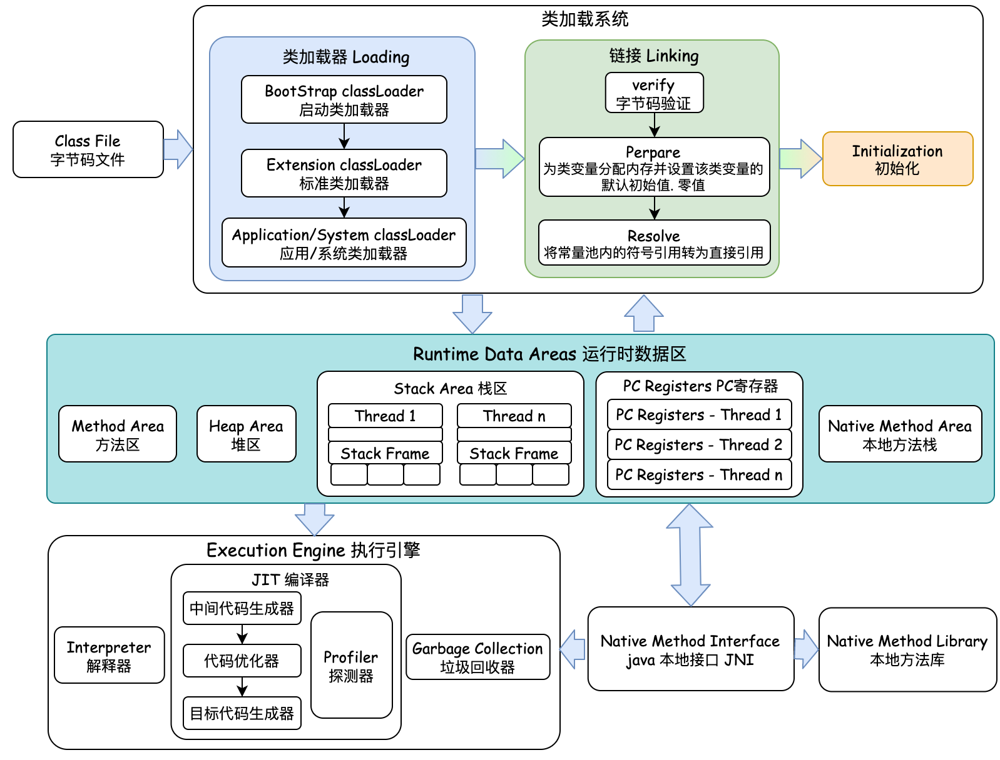

#### **1.1.1 类加载系统**

##### 1. 类的生命周期

&emsp; &emsp; 类的生命周期是从虚拟机将`.class`文件加载到内存开始，直到卸载出内存为止。类的生命周期分为7个阶段，如下图所示：


###### (1).加载阶段(类加载器)

&emsp; &emsp; JVM通过类的全限定名获取定义此类的二进制字节流 ( 这里并没有指定二进制字节流一定从 `.class` 文件中获取，也可以从其他地方获取，如从JAR获取，从网络中获取，动态代理从运行时计算生成)，并将字节流中的静态存储结构`(static)`转化为方法区的运行时数据结构，最终在内存中生成一个代表这个类的`java.lang.Class`对象，作为方法区该类的各种数据的访问入口。


###### (2).验证阶段

&emsp; &emsp; 因为Java的 *Class* 文件并不一定要求必须从Java源码中编译得到，也可以从其他任何途径得到。如果JVM不检查输入的字节流，可能会载入错误的字节流导致系统崩溃。因此验证阶段的目的是确保 `.class`文件的字节流包含的信息符合虚拟机的要求，不会危害虚拟机自身的安全。验证阶段分为4个阶段：
&emsp; &emsp;     **① 文件格式验证**：该阶段验证字节流是否符合 `.class`文件格式的规范，保证输入的字节流可以正确的解析，并存储于方法区中，格式上符合描述一个Java类型信息的保证。通过该阶段后，字节流会进入内存的方法区中进行储存，后面的验证阶段不会再直接操作字节流信息。
 &emsp; &emsp;    **② 元数据验证( `.class` 语义分析)**：对字节码描述的信息进行语义分析 ( 数据类型校验、类校验 )，确保其描述的信息符合Java语言规范要求。(
如这个类是否有父类、这个类的父类是否继承了不允许被继承的类，是否实现了接口的所有方法等 )。
 &emsp; &emsp;    **③ 字节码验证**：通过数据流和控制流分析，确定程序语义是符合逻辑的。这个阶段对类的方法进行校验分析，保证类的方法在运行时不会做出危害虚拟机安全的事件。
 &emsp; &emsp;    **④ 符号引用验证**：符号引用校验发生在虚拟机将符号引用转化为直接引用的时候。符号引用校验对类自身以外的信息（常量池中的符号引用）的信息进行校检 (如符号引用中通过字符串描述的全限定名是否能够找到对应的类、符号引用中的类，字段，方法访问性是否可以被当前类访问 )，确保后续的解析动作能够正常执行。

###### (3).准备阶段(分配空间)

&emsp; &emsp; 准备阶段为类变量 ( 仅为 `static` 修饰的变量，不包括实例变量 ) 分配内存空间并设置数据类型**零值**，这些类变量所使用的内存都将在方法区中进行分配。而实例变量会在对象实例化时随着对象一起分配在Java堆中。

```java
假设一个类变量的定义为:  public static int value = 111;  
变量value在『准备阶段』过后的初始值为0，在『初始化阶段』后才会将数值111赋值到value变量
```


###### (4).解析阶段

&emsp; &emsp; 在解析阶段会<font color=green>**将常量池的一部分符号引用替换为直接引用的过程**。</font>调用目标的引用在编译时就确定下来了。解析动作主要针对类或接口、字段、类方法、接口方法、方法类型、方法句柄、和调用限定符7类符号引用。Java中在解析阶段可以将符号引用替换为直接引用的方法包括**类的静态方法**、**类的私有方法**、**父类方法**、**实例构造器**：
 &emsp; &emsp; ● 类的静态方法与类的类型关联，与对象无关，所以在解析阶段可以替换为直接引用；
 &emsp; &emsp; ● 类的私有方法不能被外部其他类的对象访问，不会出现多态特性，因此在解析阶段可以替换为直接引用。
 &emsp; &emsp; ● 父类的方法对于子类来说是“基准方法”，对于父类方法也不会出现多态特性，只有子类方法是多态的，因此在解析阶段可以替换为直接引用。


> <font color=SlateBlue>  <u>**Q1. 什么是符号引用、直接引用 ？**</u></font>
> &emsp;&emsp;  ● 符号引用是以一组符号来描述所引用的目标，符号可以是任何形式的字面量，只要使用时无歧义定位到目标即可。符号引用与虚拟机的内存布局无关，引用的目标并不一定已经加载到内存中。<font color=green>在编译的时候每个Java类都会被编译成一个`.class`文件，但在编译的时候虚拟机并不知道所引用类的地址，就用符号引用来代替，而在解析阶段就是为了把这个符号引用转化成为真正的地址的阶段。</font>
> &emsp;&emsp;  ● 直接引用是可以直接定位到目标的指针、相对偏移量或是一个能间接定位目标的句柄。直接引用是与虚拟机的内存布局相关的，同一个符号引用在不同虚拟机实例上翻译出来的直接引用不会相同。如果有了直接引用，则引用的目标一定在内存中存在。
>
> <font color=SlateBlue>  <u>**Q2. 虚方法与非虚方法 ？**</u></font>
> &emsp;&emsp;  针对在解析阶段是否会将方法的符号引用替换为直接引用，会将方法分为**虚方法**和**非虚方法**。非虚方法在类加载机制中的解析阶段就可以直接将符号引用转化为直接引用，如静态方法、私有方法、*final* 方法、实例构造器、父类方法。除此之外的其他方法称为虚方法，虚方法是实现多态特性的主要方式。每个类中都有一个虚方法表，表中存放着各个方法的实际入口。虚方法表会在类加载的链接阶段被创建并开始初始化，类的变量初始值准备完成以后，JVM会把该类的方法表也初始化完毕。

###### (5).类初始化阶段

&emsp;&emsp; 在初始化阶段会执行类定义的Java代码，本质是执行类构造器`<clinit>()` 方法的过程。在初始化阶段分为两种初始化过程：<font color=orange>类的**主动引用**、**被动引用**</font>：
 &emsp; &emsp; <font color=green>**● 主动引用**：**是指在初始化阶段，一定会对类进行初始化**。</font>有4种场景会发生类的主动引用：
 &emsp; &emsp; ① 使用new关键字实例化对象的时候；读取或设置一个类的静态字段【`getstatic`、`putstatic`、`invokestatic`操作静态字段的指令】(被`final`修饰、已经在编译期把结果放入常量池的静态字段除外)，以及调用一个类的静态方法的时候。
 &emsp; &emsp; ② 使用`java.lang.reflect`包的方法对类进行反射调用的时候。
 &emsp; &emsp; ③ 当初始化一个类的时候，如果发现其父类还没进行初始化，则必须对父类进行初始化。
 &emsp; &emsp; ④ 当虚拟机启动时，用户指定的要执行的主类（包含main方法的类），虚拟机会先初始化这个主类。
 &emsp; &emsp; ⑤ 如果一个 ***java.lang.invoke.MethodHandle*** 实例最后的解析结果是 ***REF_gegtStatic***、***REF_putStatic***、***REF_invokeStatic***
的方法句柄，且这个方法句柄对应的类没用进行过初始化，则需要先触发其初始化操作。

&emsp; &emsp; <font color=green>**● 被动引用**：**除了主动引用，其余引用类的方式都不会触发初始化，因此称为被动引用**。</font>
&emsp; &emsp; ① 对于静态字段，只有直接定义这个字段的类才会被初始化，<font color=green>**通过其子类来引用父类中定义的静态字段，只会触发其父类的初始化而不会触发子类的初始化**。</font>

```java
package test;
class Superclass{
    public static int value=10;
    static{
        System.out.println("super");
    }
}
class child extends Superclass{
    static {
        System.out.println("child");  //不会触发该类的初始化
    }
}
public class test {
    public static void main(String[] args) {
        System.out.println(child.value);  //输出super 和 10
    }
}
```

&emsp; &emsp; ② <font color=green>**通过数组定义来引用类，不会触发此类的初始化**。</font>

```java
package test;
class Superclass{
    public static int value=10;
    static{
        System.out.println("super");
    }
}
public class test {
    public static void main(String[] args){
        Superclass superclass[] = new Superclass[10];//没有任何输出,不会初始化类Superclass
    }
}
```

&emsp; &emsp; ③ <font color=green>**常量在编译阶段会存入调用类的常量池中，并没有直接引用到定义常量的类，因此不会触发定义常量的类的初始化**。</font>

```java
package test;
class Superclass{
    public static final String DEFINE_TYPE = "hello";
    static{
        System.out.println("super");
    }
}
public class test {
    public static void main(String[] args) {
        System.out.println(Superclass.DEFINE_TYPE);  //仅输出hello，Superclass没有初始化
    }
}
```

> <font color=SlateBlue>  <u>**Q1.  *static*，*final*，*static final* 对修饰字段赋值时的区别 ？**</u></font>
> &emsp; ● `static` 在准备阶段时被初始化为0或null，在初始化阶段时被赋予代码中设定的值，如果没有设定值，则仍为默认值。
> &emsp; ● `static final` 在通过Javac编译时生成常量值`Constantvalue`属性，在准备阶段时根据设定值为该字段进行赋值。该字段没有默认值，必须显式的赋值。
> &emsp; ● `final` 在运行时被初始化，一旦初始化便不可更改。
>
> <font color=SlateBlue>  <u>**Q2. 什么是`<clinit>()`方法 ？**</u></font>
> &emsp; &emsp; ● `<clinit>()`方法是有编译器自动收集类中的所有类变量的赋值动作和静态语句块 `static{}` 中的语句合并产生的，编译器收集的顺序是由语句在源文件中出现的顺序决定的，因此静态语句块只能访问到定义在静态语句块之前的变量，定义在之后的变量，在静态语句块中可以赋值，但不能访问。
>
> ```java
> public class test{
> 		static{
> 				i = 0;
> 				System.out.println(i);  //编译器会提示 "非法向前引用"
> 		}
> 		static int i = 1;
> }
> ```
>
> &emsp; &emsp;● `<clinit>()`方法不需要显式的调用父类构造器，虚拟机会在子类的`<clinit>()`方法执行之前，执行完成父类的`<clinit>()`方法，意味着父类中定义的静态语句块要优先于子类的变量赋值操作。由于 ***java.lang.Object*** 是所有子类的父类，因此虚拟机中第一个被执行的`<clinit>()` 方法的类一定是 ***java.lang.Object***。
> &emsp; &emsp;● 接口中不能使用静态语句块，但仍然会有变量的初始化操作，因此接口与类一样都会生成`<clinit>()` 方法。但执行接口的`<clinit>()`方法不需要先执行父接口的`<clinit>()`方法，只有当父接口中定义的变量被使用时，父接口才会初始化。另外，接口的实现类在初始化时也不会执行接口的`<clinit>()`方法。
> &emsp; &emsp;● 虚拟机会保证一个类的`<clinit>()`方法在多线程环境中正确的加锁，同步。多个线程同时初始化一个类时，只有一个线程可以执行这个类的`<clinit>()`方法，其他线程进入阻塞状态，直到`<clinit>()`方法执行完成。
>
> ```java
> static class LoopClass{
>  static{
>      if(true){
>          System.out.println(Thread.currentThread() + " init");
>          while(true){}
>      }
>  }
> }
> public static void main(String[] args) {
>  Runnable runnable = new Runnable() {
>      @Override
>      public void run() {
>          System.out.println(Thread.currentThread() + " start");
>          LoopClass loopClass = new LoopClass();
>          System.out.println(Thread.currentThread().getName() + " over");
>      }
>  };
>  Thread thread1 = new Thread(runnable);
>  Thread thread2 = new Thread(runnable);
>  thread1.start();
>  thread2.start();
> }
> -- Output --
> Thread[Thread-0,5,main] start
> Thread[Thread-1,5,main] start
> Thread[Thread-0,5,main] init  由于线程0初始化时进入循环，导致线程1初始化对象被阻塞
> ```

##### 2. 类加载器 *ClassLoader*

&emsp; &emsp; <font color=green>在类生命周期的加载阶段，是由<font color=orange>**类加载器**</font>来完成的。类加载器根据一个类的全限定名读取类的二进制字节流到 JVM
中，然后生成对应的`java.lang.Class对象实例`。</font>**对于任意一个类，都需要由加载它的类加载器和这个类本身一同确立其在Java虚拟机中的唯一性。每一个类加载器，都拥有一个独立的类名称空间，<font color=green>
对于任意两个类，只有这两个类是由同一个类加载器加载时，这两个类才相等</font>，否则即使这两个类来源于同一个Class文件，被同一个虚拟机加载，只要加载的类加载器不同，那这个两个类一定不相等**。JVM 中包含四种类型的类加载器：
&emsp; &emsp; ● ( ***Bootstrap*** ) 启动类加载器：*Bootstrap* 类加载器是由C++代码实现，是虚拟机的一部分，它负责将 `JAVA_HOME/lib`下面的核心类库或 `-Xbootclasspath` 选项指定的jar包加载到虚拟机内存中。*Bootstrap* 类加载器由 JVM 本地实现，因此开发者无法直接获取到 *Bootstrap* 类加载器的引用。
&emsp; &emsp; ● ( ***Extension*** ) 扩展类加载器 ：*Extension* 类加载器由 *ExtClassLoader* `(sun.misc.Launcher$ExtClassLoader)`实现，负责将 `JAVA_HOME/lib/ext` 或者由系统变量 `-Djava.ext.dir` 指定位置中的类库加载到内存中，开发者可以直接使用标准扩展类加载器。
&emsp; &emsp; ● ( ***Application/System*** ) 应用程序类/系统类加载器：*Application* 类加载器由 *AppClassLoader* `(sun.misc.Launcher$AppClassLoader)`实现，负责加载用户类路径上所指定的类库，如果程序中没有自定义类加载器，则该加载器是程序中默认的类加载器。 
&emsp; &emsp; ● ( ***User*** ) 自定义类加载器：***User*** 类加载器是根据自身需要自定义的 `ClassLoader`。

##### 3. 类的加载机制 - 双亲委派模型

&emsp; &emsp; 双亲委派模型是对各种加载器制定的c加载的规范，越基础的类由越上层的加载器进行加载，解决了各个类加载器的基础类统一问题，JVM 在加载类时默认采用<font color=red>**双亲委派模型**</font>，双亲委派模型要求除了顶层的启动类加载器外，其他的类加载器都要有自己的"父类加载器"。双亲委派模型的类加载流程如下：
&emsp; &emsp; ● 如果一个类加载器收到类加载请求，首先不会自己去加载这个类，而是将加载请求委派给父类加载器去完成，因此所有的加载请求最终都应该传送到启动类加载器中。
&emsp; &emsp; ● 只有当父加载器无法完成加载请求时，子加载器才会尝试自己去加载。


> <font color=SlateBlue>  <u>**Q1. 双亲委派机制的作用及优点 ？**</u></font>
> &emsp; ① 为了保证Java系统核心类的安全，对于Java核心库的类的加载工作由引导类加载器来统一完成，<font color=green>保证 Java应用所使用的都是同一个版本的 Java核心库的类，避免用户对核心类重写，使Java核心类出现混乱。</font>如用户重写了`Java.lang.Object`类，在类加载时，双亲委派机制会从`Bootstrap`类加载器开始加载`Object`类，从而不会加载用户重写的核心类。避免Java核心API中的类被随意替换。
> &emsp; ② <font color=green>双亲委派机制避免类的重复加载，当父类加载器已经加载了该类时，子类加载器就不用再加载。</font>


#### 1.1.2 虚拟机执行引擎

&emsp; &emsp; 虚拟机执行引擎 ( *Execution Engine*  )是虚拟机的核心组成部分。线程通过执行引擎对方法进行调用，对变量进行存储运算，最终得到正确的计算结果。执行引擎包括解释器、及时编译器、垃圾回收器。执行引擎的任务就是将字节码指令解释/编译为对应平台上的本地机器指令，并计算得到结果，因此执行引擎输入的是字节码文件，输出的是执行结果。


##### 1. 运行时栈帧结构 - 程序运行时的数据存储

&emsp; &emsp; 栈帧是用于支持虚拟机进行<font color=green>**方法调用**和**方法执行**</font>的数据结构，每**个栈帧存储了方法的<font color=green>局部变量表，操作数栈，动态连接和方法返回地址</font>等信息**，在编译程序代码的时候，栈帧需要多大的局部变量和操作数栈都已经确定了，因此**一个栈帧需要分配多少内存，不会受到程序运行期变量数据的影响，仅仅取决于具体的虚拟机实现**。**每个方法从调用开始到执行完成的过程，都对应一个栈帧在虚拟机栈中从入栈到出栈的过程**。
&emsp; &emsp;对于执行引擎，在活动线程中，只有位于栈顶的当前栈帧是有效的，执行引擎运行的所有字节码指令只针对当前栈帧进行操作。栈帧的结构如下图所示：


###### (1). 局部变量表 - 存储变量

&emsp; &emsp; 局部变量表是一组变量值存储空间，用于存放方法参数和方法内定义的局部变量 ( *boolean、byte、char、short、int、float、reference、returnAddress* 8种数据类型 )，是线程的私有数据，不存在线程安全问题。局部变量表中的变量**作用域是当前调用的函数**。函数调用结束后，随着函数栈帧的销毁。局部变量表也会随之销毁，释放空间。局部变量表的容量以变量槽 *Slot* 为最小单位，32位以内的类型只占用一个 *Slot* ( 包括 *returnAddress* 类型 )，64位的类型 ( *long* 和 double )占两个 *Slot*。<font color=green>JVM 会为局部变量表中的每一个 *Slot*
分配一个访问索引，通过这个索引即可成功访问到局部变量中指定的局部变量值，如果访问局部变量中一个64位的局部变量值时，只需要使用前一个索引值即可。如果当前栈是由构造函数或实例方法创建的，则局部变量表中第0位索引的 *Slot* 默认用于传递方法所属对象实例的引用，在方法中可以通过 ***this*** 关键字访问到这个隐含的参数。</font>


###### (2). 操作数栈 - 存储数据运算结果

&emsp; &emsp; 操作数栈是一个后入先出 ( FIFO ) 的栈，操作数栈主要作用是**保存计算过程中间结果，同时作为计算过程中变量临时的存储空间**。操作数栈的每一个元素可以是任意的Java数据类型，但操作数栈中元素的数据类型必须与字节码指令的序列严格匹配，保证不会出现像 long + float 情况出现。操作数栈在方法执行的时候，根据字节码指令，往栈中写入数据或提取数据，即入栈 ( push ) / 出栈 ( pop )，如执行复制、交换、求和等。**如果被调用的方法带有返回值的话，其返回值将会被压入当前栈帧的操作数栈中，并更新PC寄存器中下一条需要执行的字节码指令。**

###### (3). 动态连接(链接) - 找到正确的方法

&emsp; &emsp; 如果被调用的方法无法在编译期确定下来，只能够在程序运行期将调用方法的符号引用转换为直接引用，由于这种引用转换过程中具备动态性，因此也被称之为动态链接。动态链接对应着接口回调，多态动态绑定等在Java源文件被编译到字节码文件中时，所有**变量**和**方法引用**都作为**符号引用**保存在 *class* 文件的常量池。<font color=red>**动态链接就是把符号引用转为调用方法的直接引用的过程*</font>。每个栈帧都包含一个**指向运行时常量池中该栈帧所属方法的引用**，这个引用是为了支持方法调用过程中的动态连接。

###### (4). 方法返回地址 - 返回计算结果

&emsp; &emsp;  **方法返回的过程就是当前栈帧出栈的过程**，因此在方法的返回分为三个过程：  <font color=green>**① 恢复方法调用者的局部变量表和操作数栈；② 将返回值压入方法调用者栈帧的操作数栈中； ③调整PC计数器的值，指向方法调用指令后面的一条指令**</font>。当一个方法开始执行时，只要两种方式可以退出方法：
&emsp; &emsp; ① 正常完成出口 ( *return* )：执行引擎遇到任意一个方法返回的字节码指令，并将返回值传递给上层方法调用者。
&emsp; &emsp; ② 异常完成出口 ( *Exception* )：在方法的执行过程中遇到了异常，并且这个异常没有在方法中得到处理，这时是不会给上层的方法调用者返回任何值。
&emsp; &emsp; 无论哪种方法退出方式，在方法退出后，都会回到方法被调用的位置。方法常退出时，方法调用者的PC计数器的值可以作为返回地址，该地址会在栈帧中保存，而异常退出时返回地址是通过异常处理器表来确定，栈帧中不会保存相关信息。

##### 2. 方法调用 - 确定调用方法的版本

&emsp; &emsp; 方法调用并等于方法的执行，方法调用的唯一作用就是确定被调用方法的版本 ( 即调用哪个方法 )，并包括方法的具体运行过程。由于 *Class* 文件在编译过程中不包含链接的过程，一切方法在 *Class* 文件中存储的都是符号引用，而不是方法实际执行时内存的入口地址，因此 Java 方法的调用需要在类加载期间或运行期间才能目标方法的直接引用。

###### (1). 分派调用

&emsp; &emsp; 分派调用分成两类: **静态分派和动态分派**。<font color=red>重载属于静态分派、方法覆盖 (重写) 属于动态分派。</font>
&emsp; &emsp; ●  **静态分派 - 重载**：静态分派是指所有依赖静态类型来定位方法执行版本的分派动作。静态分派的典型应用是方法重载: 当方法重载时，使用哪个重载方法版本，完全取决于传入参数的数量和数据类型。对于JVM来说，在重载时是通过参数的静态类型而不是实际类型作为判断依据的，变量的静态类型在编译器是已知的，因此在编译阶段，Java 编译器会根据参数的静态类型来决定使用哪个重载方法版本。

```java
public class Main {
    static abstract class Human{ }
    static class Man extends Human{ }
    static class Woman extends Human{ }

    public void sayHelllo(Human human){
        System.out.println("Hello human");
    }
    public void sayHello(Man man){
        System.out.println("Hello man");
    }
    public void sayHello(Woman woman){
        System.out.println("Hello woman");
    }
    public static void main(String[] args) {
        Human man = new Man();	    //此时man对象的静态类型是Human，实际类型是Man
        Human woman = new Woman();	//此时woman对象的静态类型是Human，实际类型是Woman

        Main main = new Main();
        main.sayHelllo((Man)man);
        main.sayHelllo((Woman)woman);
    }
}
-- Output --
Hello human
Hello human
```

&emsp; &emsp; ●  <font color=red>**动态分派 - 重写与多态**</font>：动态分配是指在运行时确定对象的实际类型。动态分派是由 JVM 指令 ***invokevirtual*** 在运行时进行多态查找实现的，***invokevirtual*** 指令在运行期确定对象接收者的实际类型，并把运行时常量池中的类方法符号引用解析为直接引用。方法重写的过程如下：
 &emsp; &emsp; ① 找到操作数栈栈顶的第一个元素所执行对象的实际类型，记为类型C；
 &emsp; &emsp; ② 如果类型C中找到与运行池常量池中描述符和简单方法名称都相同的方法，则对方法进行访问权限校验( *public/private/protected* )，如果方法访问权限校验不通过，则返回*java.lang.IllegalAccessError* 异常。
 &emsp; &emsp; ③ 如果类型C中没有找到对应的方法，则按照继承关系从下往上依次对类型C的父类进行搜索和权限校验，如果没有找到对应的方法，则抛出 *java.lang.AbstractMethodError* 异常。
&emsp; &emsp; 在面向对象的编程中，会很频繁的使用到动态分派，如果在每次动态分派的过程中都要重新在类的方法元数据中搜索合适的目标的话就可能影响到执行引擎。为了提高性能，JVM采用在<font color=red>**
类的方法区建立一个虚方法表( *Virtual Method Table* )**</font>来实现。<font color=green>
每个类中都有虚方法表，表中存放着各个方法的实际入口，如果某个方法在子类中没有重写，则子类的虚方法表的地址入口和父类是相同的，都指向父类方法的入口。如果子类重写了该方法，则子类的虚方法表的地址将会指向子类方法实现版本的入口地址。</font>虚方法表一般在类加载的链接阶段进行初始化，准备了类变量的初始值后，虚拟机会把该类的方法表也初始化完毕。


```java
public class Main {
    static abstract class Human{
        abstract public void sayHello();
    }
    static class Man extends Human{
        @Override
        public void sayHello() {
            System.out.println("Man say hello");
        }
    }
    static class Woman extends Human{
        @Override
        public void sayHello() {
            System.out.println("Woman say hello");
        }
    }
    public static void main(String[] args) {
        Human man = new Man();			//在运行时根据实际类型，指向运行时常量池的Man类的符号引用
        Human woman = new Woman();	//在运行时根据实际类型，指向运行时常量池的Woman类的符号引用
        man.sayHello();
        woman.sayHello();
    }
}
-- Output --
Man say hello
Woman say hello
```

#### 1.1.3 Java 内存结构与模型规范

##### 1. *Java* 内存区域

&emsp; &emsp; Java 虚拟机将执行程序过程的内存划分为若干个不同的区域，每个区域有着各自不同的创建和销毁时机。

&emsp; &emsp; ● **程序计数器 - *PC Registers*** ：当前线程所执行字节码的信号指示器，分支、循环、跳转、异常处理、线程恢复等基础功能都需要依赖这个计数器来完成。<font color=green>
由于Java虚拟机的多线程是通过线程轮流切换、分配处理器执行时间的方式来实现的，在任何一个确定的时刻，一个处理器(对于多核处理器而言是一个内核)
都只会执行一条线程中的指令。因此，为了线程切换后能恢复到正确的执行位置，每条线程都需要有一个独立的程序计数器，各条线程之间计数器互不影响，独立存储 (线程的私有内存)</font>。<font color=orange>**
如果线程正在执行的是一个 Java 方法，这个计数器记录的是正在执行的虚拟机字节码指令的地址；如果正在执行的是本地( *Native* )方法，这个计数器值则应为空**。</font>

&emsp; &emsp; ● **虚拟机栈 - *Stack Area*** : 虚拟机栈又称为 *Java* 栈。虚拟机栈与线程紧密相关，<font color=green>每创建一个线程就会创建一个 *Java*
栈，是线程私有的，其生命周期与线程生命周期相同。线程中的每个方法被调用时都会创建一个栈帧( *Stack Frame* )，用于存储方法中的**局部变量表、操作数栈、动态链接、方法出口**等信息</font>。*Java*
栈是一个<font color=orange>**后入先出**</font>的数据结构，线程运行过程中，<font color=green>只有一个栈帧是处于活跃状态的，称为"当前活动帧栈"，当前活动帧栈始终是虚拟机栈的**
栈顶元素**</font>。


&emsp; &emsp; ● **本地方法栈 - *Native Method Area*** : 本地方法栈主要用于虚拟机的本地方法 ( *Native* )，*Navtive* 方法是 java 通过 *JNI* 直接调用本地 C/C++ 库，作用是与操作系统和外部环境交互。当线程调用 *java* 方法时，虚拟机会创建一个栈帧并压入 *java* 虚拟机栈。当它调用的是 *Native* 方法时， *java* 虚拟机栈不会压入新的栈帧，而会向本地方法栈压如一个新的栈帧，虚拟机只是简单地动态连接本地方法栈并直接调用指定的 *Native* 方法。


&emsp; &emsp; ● **Java 堆 - *Heap*** : Java 堆是虚拟机中内存最大的一部分，是所有线程共享的一块内存区域，此内存区域的唯一目的是<font color=red>**存放对象实例**</font>。Java 堆是垃圾收集器管理的主要区域。Java 堆处于物理上不连续的内存空间中，只需保证逻辑连续即可。Java 堆内存从不同的角度有不同的划分：
 &emsp; &emsp;&emsp; ① 从内存回收的角度：Java堆分为新生代和老年代。
 &emsp; &emsp;&emsp; ② 从内存分配的角度：Java 堆分为多个线程私有的分配缓存区 ( *TLAB* )

&emsp; &emsp; ● **方法区 - *Method Area / Not-Heap*** : 方法区也是各个线程共享的内存区域，此内存区域主要用于存储以下信息：
 &emsp; &emsp;&emsp; ① 对每个加载的类型 ( 类*class*、接口*interface*、枚举*enum*、注解*annotation*)，虚拟机会在方法区中存储以下类型信息：类型的**完整有效名称 (全名=包名.类名)**、类型**直接父类**的完整有效名称、类型的修饰符( *public*、*private*、*protected* )、类型**直接接口**的有序列表、类型的常量池、域( *Field* )信息、方法( *Method* ) 信息。
 &emsp; &emsp;&emsp; ② ***static*** 变量：八种基本数据类型( *byte*、*short*、*int*、*long*、*float*、*double*、*char*、*boolean* )的静态变量会在方法区开辟空间，并将对应的值存储在方法方法区。<font color=green>对于引用类型的静态变量，如果未用 *new* 关键字为引用类型的静态变量分配对象，如: `static Object obj` ，
那么对象的引用会存储在方法区中，并为其指定默认值 *null*。如果用 *new* 关键字为引用类型的静态变量分配对象，如: `static Person person = new Person()`
，那么对象的引用会存储在方法区中，并且该对象在堆中的地址也会存储在方法区中</font> <font color=red>(此时静态变量只存储了对象的堆地址，而对象本身仍在堆内存中)</font>。
 &emsp; &emsp;&emsp;③ 即时编译器编译后的代码等数据。
&emsp; &emsp;    <font color=red>④ **运行时常量池 - *Runtime Constant Pool***</font> :运行时常量池是方法区中的一部分，用于存放编译期间生成的各种<font color=green>**字面量**</font>和<font color=green>**符号引用**</font> (通过一组符号描述，准确定位到需要访问的目标)，这些内容在类加载后存放到方法区的运行时常量池中。

> <font color=SlateBlue>  <u>**Q1. 为什么需要常量池 ？**</u></font>
> &emsp; &emsp; 一个 Java 源文件中的类、接口，编译后会产生一个字节码文件，而 Java 中的字节码文件需要其他的数据支撑 (操作数和方法)，通常这种数据很大，不能直接存放到字节码里面。所以把对这些数据的引用存放到常量池，在需要使用的时候，通过动态链接将符号引用转换为直接引用。
> <font color=SlateBlue>  <u>**Q2. Java 常量池的区别 ？**</u></font>
> &emsp;&emsp; 在 Java 的内存分配中有三种常量池: <font color=green>字符串常量池、*class* 文件常量池、运行时常量池</font>。
> &emsp; &emsp; ① 字符串常量池: 字符串常量池的内容是在堆中生成的字符串对象实例的引用值 (不是具体的对象实例)。字符串常量池是方法区的一部分。
> &emsp; &emsp; ② *class* 文件常量池：*class* 文件常量池用于存放编译期间生成的各种<font color=green>字面量 (文本字符串、*final* 常量值等)</font>和<font color=green>符号引用 (一组用于描述所引用目标的符号)</font>。一般包括三类常量：<font color=green>类和接口的全限定名、字段的名称和描述符、方法的名称和描述符</font>。
> &emsp; &emsp; ③ 运行时常量池：当类加载到内存中后，jvm就会将 *class* 常量池中的内容存放到运行时常量池中。
>
> 
>
> <font color=SlateBlue>  <u>**Q3. 方法区的 *class* 文件常量池 与 *class* 文件信息有什么关系 ？**</u></font>
> &emsp;&emsp; 方法区里存放着类的版本，字段，方法，接口和常量池。常量池里存储着字面量和符号引用 (符号引用包括: 类和接口的全限定名、字段名称和属性、方法名称和属性)。  

&emsp; &emsp; ● **直接内存/堆外内存 - *Direct Memory*** :
&emsp;&emsp; 直接内存不属于 JVM 定义的内存区域。直接内存被 ***NIO*** ( *New input/output* )使用，***NIO*** 是一种基于通道 ( *channel* ) 和缓冲区 ( *buffer* ) 的I/O方式，它可以使用 *Native* 函数库直接分配堆外内存，然后通过堆上的*DirectByteBuffer* 对象对这块内存进行引用和操作。<font color=green>直接内存的大小不受
java堆大小的限制，也不受到 jvm 进程内存大小的限制。它只受限于本机总内存 ( *RAM* 及 *SWAP* 区或者分页文件) 大小以及处理器寻址空间的限制</font>。


##### 2. *Java* 内存模型

&emsp; &emsp; Java 内存模型 ( *Java Memory Model, JMM* ) 是 JVM 规范定义的，用来屏蔽 Java 程序在各种不同的硬件和操作系统对内存的访问的差异，从而实现了Java 在各种平台下都能达到一致的内存访问效果。Java 内存模型规定了程序中各个变量 ( 包括实例字段、静态字段、构成数组对象的元素，不包括局部变量与方法参数 ) 的访问规则，即 JVM 应该如何存储和访问计算机内存 ( *RAM* )。Java 的内存模型分为两部分：**JVM 内存存储规范**，**JMM与线程规范**。

> <font color=SlateBlue>  <u>**Q1. 为什么要有 java 内存模型 (物理机的并发问题) ？**</u></font>
> &emsp;&emsp;**① 内存I/O与CPU运行速率匹配问题**
> &emsp; &emsp; 由于计算机的存储设备I/O速度远远低于CPU处理器的运算速度，为了提高CPU处理器的效率，减少I/O的等待时间，在CPU与内存之间，存在一层与运算速度相当的高速缓存( *Cache* )。CPU的数据运算直接与Cache交互，解决了内存I/O与CPU运算之间的数据矛盾。
> &emsp;&emsp;**② 缓存一致性问题**
> &emsp; &emsp;  虽然高速缓存 Cache解决了速率匹配问题。但是，在多CPU处理器系统中，每个处理器都有自己的 *Cache*，而每个 *Cache* 都共享同一主内存，当多个处理器的运算任务都涉及同一块主内存区域时，可能会导致各个 *Cache* 的缓存数据不一致，出现**缓存一致性**问题。为了解决这个问题，处理器访问内存时，需要遵守内存存储规范，即内存读写协议。
>&emsp;&emsp;**③ 代码乱序执行优化问题**
> &emsp; &emsp;  为了使得CPU内部的运算单元能被充分利用，CPU可能会对代码进行乱序执行 ( *Out-Of-Order Execution* ) 优化，CPU会在计算之后将乱序执行的结果重组，保证该结果与顺序执行的结果是一致的，但并不保证程序中各个语句计算的先后顺序与代码中的顺序一致。乱序执行技术是CPU为提高运算速度而做出违背代码原有顺序的优化，在多核环境下， 如果存在一个计算任务依赖另一个计算任务的中间结果，那么其顺序性并不能靠代码的先后顺序来保证。

###### (1). 主内存与工作内存

&emsp; &emsp; Java 内存模型规定了所有的变量都存储在虚拟机内存当中的**主内存**，每条线程还有自己的**工作内存**。线程的工作内存中保存了该线程使用到的变量的主内存副本拷贝 ( 仅拷贝线程访问到的变量 )，线程对变量的所有操作 ( 读取、赋值等 ) 都必须在工作内存中进行，而不能直接读写主内存中的变量。不同的线程之间也无法直接访问对方工作内存中的变量，线程间变量值的传递均需要通过主内存完成。

###### (2). 内存间的交互操作

&emsp; &emsp; Java 内存模型定义了8种操作来描述一个变量在主内存和工作内存的交互过程。<font color=red>**每一个操作都是原子的，不可再分的。**</font>
&emsp; &emsp; ● ***lock*** (锁定)：作用于主内存的变量，把一个变量标识为一个线程独占的状态。
&emsp; &emsp; ● ***unlock*** (解锁)：作用于主内存的变量，把一个锁定状态的变量释放出来，释放后可以被其他线程锁定。
&emsp; &emsp; ● ***read*** (读取)：作用于主内存的变量，把一个变量的值从主内存复制到线程的工作内存中。 
&emsp; &emsp; ● ***load*** (载入)：作用于工作内存的变量，把 *read* 操作得到的变量放入工作内存的变量副本中。
&emsp; &emsp; ● ***use*** (使用)：作用于工作内存的变量，把工作内存中的变量值传递给执行引擎，每当虚拟机遇到一个需要使用此变量的指令时便执行这个操作。
&emsp; &emsp; ● ***assign*** (赋值)：作用于工作内存的变量，把从执行引擎接收的值赋值给工作内存中的变量，每当虚拟机遇到一个给变量赋值的指令时便执行这个操作。
&emsp; &emsp; ● ***store*** (存储)：作用于工作内存的变量，把工作内存中的变量的值传递到主内存中。 
&emsp; &emsp; ● ***write*** (写入)：作用与主内存的变量，把 *store* 操作得到的变量放入主内存的变量中。


&emsp;&emsp; Java 内存模型8种操作的规则如下： 
&emsp; &emsp; ① 不允许一个变量从主内存读取了，但无法写入工作内存，或者从工作内存赋值了不能写回主内存，即 *read* 和 *load*、*store*和 *write* 操作不能单独出现。
&emsp; &emsp; ② 变量在工作内存中改变之后，必须把变化同步回主内存中，不允许一个线程丢弃其最近的 *assign* 操作。 
&emsp; &emsp; ③ 不允许一个线程没有发生任何 *assign*操作，把数据从线程的工作内存同步到主内存当中。 
&emsp; &emsp; ④ 对一个变量实施 *use*，store操作之前，必须先经过了 *assign* 和 *load* 操作。 
&emsp; &emsp; ⑤ 一个变量在同一个时刻只允许一条线程对其进行 *lock* 操作，但 *lock* 操作可以被同一条线程重复执行多次，多次执行 *lock* 后。只有执行相同次数的 unlock 操作，变量才会被解锁。
&emsp; &emsp; ⑥ 如果对一个变量执行 *lock* 操作，将会清除工作内存中此变量的值，在线程执行引擎使用这个变量前，需要重新执行 *load* 或 *assign* 操作初始化变量的值。 
&emsp; &emsp; ⑦ 如果一个变量没有被 *lock* 操作锁定，则就不允许对该变量执行 *unlock* 操作，也不允许 unlock 一个被其他线程锁住的变量。
&emsp; &emsp; ⑧ 对一个变量执行 *unlock* 操作之前，必须先把此变量同步会主内存中。

###### (3). Java 内存模型线程并发三大特性

&emsp; &emsp; Java 内存模型在线程并发过程中存在三大特性：<font color=red>**原子性、可见性、有序性**</font>。 这个三大特性仅在多线程并发时会体现，如果是单个线程是不会体现这三个体现的。


&emsp; &emsp; **① 原子性:** 指一个操作或多个操作要么不执行，要么全部执行成功，执行过程中不能被任何操作打断。在Java 内存模型中，***read、load、assign、use、store、write***
是内存模型保证的原子性变量操作，如果需要更大场景的原子性操作，则需要 ***synchronized*** 同步块来保证。
&emsp; &emsp; **② 可见性:**指当多个线程访问同一个变量时，一个线程修改了该变量的值，其他线程能够立刻看到修改后的值。在Java中，存在三个关键字能够保证可见性：<font color=green>***volatile***、***synchronized***
、***final***</font>。
&emsp; &emsp; ● ***volatile*** 类型实现内存可见性是通过 *store* 和 *load* 指令完成的。对 *volatile*变量执行写操作时，会在写操作后加入一条 *store* 指令，强迫线程将最新的值刷新到主内存中。而在读操作时，会加入一条 *load* 指令，强迫从主内存中读入变量的值。
&emsp; &emsp; ● ***synchronized***同步块中变量发生修改时，变量执行 ***unlock*** 操作之前，会将此变量同步会主内存中。 
&emsp; &emsp; ● ***final*** 类型的变量在构造器完成初始化后，且构造器没有把 *this* 引用传递除去，由于 *this* 逃逸 ( *this* 逃逸是指在构造函数返回之前其他线程就持有该对象的引用，其他线程调用尚未构造完全的对象的方法可能引发错误 )，导致其他线程中就能看见 ***final*** 类型的变量值。

```java
public class FinalTest{
   final int i;
   static final Test obj;
   public FinalTest(){
   		i = 1;  
   	  //如果这条指令和上一条发生重排序，则其他线程就可以通过obj访问到未初始化得到final域，会导致错误
      obj = this; 
}
```

&emsp; &emsp; **③ 有序性:**如果在即程序执行的顺序按照代码的先后顺序执行。通常情况下，CPU为了提高代码运行效率，会对指令进行重排序，不保证程序中各个语句的执行先后顺序同代码中的顺序一致，但是它会保证程序最终执行结果和代码顺序执行的结果是一致的 ( 重排序会遵守数据依赖规则 )，指令重排序不会影响单个线程的执行，但是会影响到线程并发执行的正确性，所以如果从本线程内观察，所有的操作都是有序的，如果在一个线程中观察另一个线程，所有操作都是无序的。

> <font color=SlateBlue>  <u>**Q1. *synchronized* 与 *volatile* 的区别 ？**</u></font>
>&emsp;&emsp; ● *synchronized* 可以保证内存可见性与操作的原子性，而 *volatile* 仅能够保证内存可见性。
>&emsp;&emsp; ● *volatile* 不需要加锁，不会阻塞线程。*synchronized* 为了防止多个线程同时执行一段代码，需要进行加锁操作，会阻塞线程，影响程序的执行效率。
>&emsp;&emsp; ● *volatile* 变量会禁止重排序，而 *synchronized* 不会禁止重排序。
>&emsp;&emsp; ● *volatile* 是变量修饰符，仅能用于变量，而 *synchronized* 可用于类方法或代码块的修饰符。

###### (4). Java 并发的先行发生原则 ( 有序性规范 )

&emsp;&emsp;先行发生原则是 Java 内存模型并发的有序性规范，此原则是判断数据是否存在竞争，线程是否安全的主要依据，通过此原则可以解决并发环境下两个操作之间的冲突问题，提供顺序性保障。<font color=green>如果一段代码在线程并发过程中，以下原则均不满足，同时也没有定义 *synchronized* 同步块，则这段代码是线程不安全的。</font>
&emsp; &emsp; **① 程序次序规则：**在一个线程内，按照程序代码的控制流顺序，写在前面的操作先行发生于后面的操作。
&emsp; &emsp; **② 管程锁定规则：**一个 unlock 操作先行发生于后面对同一个锁的lock 操作。 
&emsp; &emsp; **③ *volatile* 变量规则：**对一个 volatile 变量的写操作先行发生于后面对该变量的读操作。
&emsp; &emsp; **④ 线程启动规则：**Thread 对象的 start() 方法先行发生于此线程的每一个操作。
&emsp; &emsp; **⑤ 线程终止规则：**线程的所有操作都先行发生于此线程的终止检测。
&emsp; &emsp; **⑥ 线程中断规则：**线程的 interrupt() 方法调用先行发生于被中断线程中检测中断事件发生的操作。
&emsp; &emsp; **⑦ 对象终结规则：**一个对象的初始化完成先行发生于该对象的 finalize()方法。
&emsp; &emsp; **⑧ 传递性：**如果操作A先发生于操作B，操作B先发生于操作C，则操作A先发生于操作C。

#### 1.1.4 Java 对象创建

##### <font color=Sienna>**1. *Java* 对象的创建过程**</font>

&emsp; &emsp; 当虚拟机收到 *new* 指令时，首先检查这个指令对应的参数能否在运行时常量池中定位到一个类的符号引用，如果存在符号引用，则检查符号引用代表的类是否被加载、解析、初始化。如果没有被加载，则执行类加载过程，如果已经加载，则虚拟机为新对象从 *java*
堆中分配内存，并将分配的内存空间初始化为0。内存分配完成后，虚拟机将对象的基本信息存放在对象头 ( *Object Header* ) 中。 最后调用 *\<init\>* 方法根据构造函数对对象进行初始化。


> <font color=SlateBlue>  <u>**Q1. 对象被频繁创建时，是如何解决内存并发创建问题的 ？**</u></font>
> &emsp;&emsp;在内存空间中，堆上的指针指向当前未分配的内存空间。当内存分配时，修改该指针指向的位置。当对象创建频繁时，会出现并发的向内存空间申请内存的情况，可能会导致当前堆空间正在给对象A分配内存，指针未来得及修改，对象B又同时使用原来的指针来分配内存，出现线程安全问题。解决这个问题有以下两个方案：
>   &emsp; <font color=red> ① 对分配内存空间的动作进行同步处理，采用**CAS + 失败重试方式**保证更新操作的原子性。</font>
> &emsp;&emsp;<font color=red> ② 把内存分配的分配按照线程划分在不同的空间中进行，即**每个线程在 java 堆中预先分配一小块内存，称为本地线程分配缓冲 ( *TLAB* )。当  *TLAB* 用完并分配新的 *TLAB* 时，才进行同步锁定**。 </font>

##### <font color=Sienna>**2. *Java* 对象的内存布局**</font>

&emsp; &emsp; 在虚拟机中，对象在内存的布局分为三个区域：**对象头( *Header* )，实例数据( *Instance Data* ) 和 对齐填充 ( *Padding* )**，其结构与内容如下图所示:


###### (1). 对象头 *Object Header*

&emsp; &emsp; JVM 的对象头信息分为两部分：**一部分用于存储对象自身的运行时数据** ( 称为 *Mark Word* ，在32位/64位 JVM中分别对应 32/64 *bit* )，**另一部分用于存储指向方法区对象类型数据的指针**。对象头信息相对与对象自身定义的数据信息是毫无关联的，其所占用的内存空间对于对象来说属于额外存储成本。为了提高 JVM 的内存空间利用率，*Mark Word* 被设计成一个非固定的数据结构以便在更小的空间中存储更多信息。


##### <font color=Sienna>**3. *Java* 对象的访问定位**</font>

&emsp; &emsp; 当对象创建完成后，就是使用对象阶段。在 Java环境中，基本类型数据存放在 *Stack* 中，存放的是数据，当产生对象时，只把对象的 *reference* 存放在 *Stack* 中，用于指向某个对象，对象本身存放在 *Heap* 中。Java 程序会通过栈上的引用数据 ( *reference* ) 来操作堆上的具体对象。对象的访问方式有两种：<font color=red>**① 使用句柄**；**②直接指针**</font>
&emsp; &emsp; ① **使用句柄方式**：如果使用句柄访问时，Java堆中将会划分出一块内存作为句柄池，引用( *reference* )中存储的是对象的句柄地址，在句柄中包含了对象实例数据 (属性值结构体) 与类型数据(类信息、方法类型信息)各自的具体地址信息。<font color=green>使用句柄访问的好处是句柄中储存的是稳定的对象地址，当对象被移动时候，只需要更新句柄中的对象实例部分的值即可，句柄本身不用被移动修改。</font>


&emsp; &emsp; ② **使用直接指针访问**：使用直接指针访问方式时，*reference* 中直接储存对象在 *Heap* 中的内存地址，但对应的类型数据访问地址需要在实例中存储。使用直接指针方式访问相比句柄方式少了一次指针定位时间的开销，但当对象被移动时 (如进行 GC 后的内存重新排列)，对象的 *reference* 也需要同步更新。


> <font color=SlateBlue> <u>**Q1. 什么是句柄 ？**</u></font>
> &emsp;&emsp; 在 java 中句柄分为两种：**对象句柄**、**jvm对象访问句柄 (即 java对象的访问定位)**。
> &emsp; &emsp; **① 对象句柄**：对象句柄作为对象的身份id，用于区分不同的对象、同类中不同的实例。<font color=green>句柄不代表对象的内存地址，即使没有对象，句柄也是可以单独存在的。</font>如创建一个对象 `Car car = new Car();`，其中 `Car car` 称为对象句柄，用来指向`Car`对象的对象引用。
>
>
>
>&emsp; &emsp;  **② 对象访问句柄：**对象访问句柄指 java 对象的访问定位，分为句柄访问和直接指针访问两种方式。

##### <font color=Sienna>**4. *Java* 对象的内存分配策略**</font>

&emsp; &emsp; ① 新生对象优先在新生代的 Eden区进行内存分配，若 *Eden* 区没有足够空间进行分配时，虚拟机会发起一次新生代的 *Minor GC*。
&emsp; &emsp; ② 若创建的对象是需要大量连续内存空间的 java 对象 (如: 很长的字符串、数组)，则大对象的内存直接分配在老年代，避免大对象在新生代的 *Eden*区和 *Survivor*区之间发生大量的内存复制。
&emsp; &emsp; ③ 长期存活的对象将进入老年代。每个新生对象都有一个"年龄计数器"，对象在 *Eden* 区出生，在经过第一次 *Minor GC* 后仍然存活，并被 *SurvivorTo* 区接收后，"年龄 = 1"。其后，在 *Survivor* 区每经过一次 *Minor GC* 其"年龄 + 1"，当"年龄 = 15岁 ( *MaxenuringThreashold*  )"时，对象进入老年代。
&emsp; &emsp; ④ 动态对象年龄判定，虚拟机并不是一直要求对象的年龄到达 *MaxenuringThreashold* 才能进入老年代，如果在 *Survivor*区中，相同年龄的所有对象大小的总和大于 *Survivor* 区空间的一半时，年龄大于等于该年龄的对象可以直接进入老年代，无需等到 *MaxenuringThreashold* 限制的年龄。

#### 1.1.5 Java 对象回收

&emsp; &emsp; 由于程序计数器、虚拟机栈、本地方法栈都是随线程而生，随线程而灭，栈中的每个栈帧分配多少内存是类结构确定下来时都是已知的，这些区域在方法结束或线程结束时内存会一起被回收释放。因此内存回收考虑的是 **java
堆与方法区区域的内存**。


##### 1. 如何判断Java对象是否存活

&emsp; &emsp; java 堆中存放着所有的对象实例，在回收对象实例之前就需要判断哪些实例还存活，哪些实例已经死去。常用判断对象存活的算法包括：引用计数算法、可达性分析算法 &emsp; &emsp;  **① 引用计数算法：** <font color=green>
给对象中添加一个引用计数器，当有一个地方引用该对象时，计数器加1，当引用失效时，计数器减1。当该对象的引用计数器为0时，说明对象没有被任何引用指向，可以认定是”垃圾”对象。</font>虽然引用计数算法实现简单，效率高。但<font color=red>**引用计数算法不能解决循环依赖问题**，一旦出现循环引用的情况，计数器始终 >1，出现对象不能回收</font>。


> <font color=SlateBlue> <u>**Q1. 为什么会产生循环引用的情况 ？**</u></font>
>
> ```java
> public static void main(String[] args) {
>     GcObject obj1 = new GcObject(); //Step1
>     GcObject obj 2 = new GcObject();//Step2
>     obj1.instance = obj2; //Step3
>     obj2.instance = obj1; //Step4
>     obj1 = null; //Step5
>     obj2 = null; //Step6
> }
> 
> 当采用引用计数算法时：
> Step1: GcObject实例1被obj1引用,所以它的引用数+1,当前引用数为1
> Step2: GcObject实例2被obj2引用,所以它的引用数+1,当前引用数为1
> Step3: obj1的instance属性指向obj2,而obj2指向GcObject实例2,故GcObject实例2引用+1,为2
> Step4: obj2的instance属性指向obj1,而obj1指向GcObject实例1,故GcObject实例1引用+1,为2
> Step5: obj1不再指向GcOjbect实例1,其引用计数减1,结果为1,此时引用计数不为0，无法被系统回收。
> Step6: obj2不再指向GcOjbect实例2,其引用计数减1,结果为1,此时引用计数不为0，无法被系统回收。
> ```
>
> 

&emsp; &emsp;  **② 可达性分析算法：** <font color=red>通过选定 ***GC Roots*** 对象作为起始点，从起始点开始向下搜索，搜索所走过的路径称为**引用链** ( *ReferenceChain* )，当一个对象到 *GC Roots* 没有任何引用链相连时，则称这个对象不可达，证明此对象是不可用的。</font>在 java 中，可作为 *GC Roots* 的对象包括以下几种:
&emsp; &emsp; ●  **虚拟机栈 (栈帧的本地变量表) 中的引用对象**
&emsp; &emsp; ●  **方法区中类静态属性引用的对象**
&emsp; &emsp; ●  **方法区中常量引用的对象**
&emsp; &emsp; ●  **本地方法栈中 *JNI* ( *Native*方法 ) 引用的对象**

&emsp; &emsp; 对于没有引用链的不可达对象，并不是一定会被回收，其需要经历<font color=red>**两次标记**</font>过程：<font color=green>如果对象在进行可达性分析后发现没有与 *GC Roots* 相连接的引用链，则会被第一次标记，并筛选此对象是否有必要执行 *finalize()* 方法，如果没有必要执行 *finalize()* 方法 ( 对象没有重写 *finalize()* 或 *finalize()*
已经被调用过称为没有必要执行 )，则直接回收该对象。如果有必要执行 *finalize()* 方法，则将此对象放入到 *F-Queue* 队列之中，稍后执行由虚拟机自动建立的低优先级的 *Finalize* 线程，如果在 *finalize()* 方法中重写建立与引用链的关联，则会避免被回收，否则会被第二次标记。随后被两次标记的对象会被真正的回收。</font>


> <font color=SlateBlue> <u>**Q1. *finalize()* 的作用及问题 ？**</u></font>
> &emsp;&emsp;● *finalize()* 的作用：
> &emsp;  &emsp;  *finalize()* 是 *Object* 类的 *protected* 方法，子类可以覆盖该方法从而可以在垃圾收集器将对象从内存中清除出去之前做必要的清理工作。当 *finalize()*  被调用之后，JVM 会再一次检测这个对象是否能被存活的线程访问得到，如果访问不到，则清除该对象。*finalize()* 只能被调用一次，也就是说，覆盖了*finalize()* 方法的对象需要经过两个GC周期才能被清除。但在 java规范中不保证 *finalize()* 方法会被及时的执行，也不保证它们一定会被执行。
> &emsp;&emsp;● *finalize()* 的问题：
> &emsp;  &emsp; <font color=green>由于 *Finalizer* 线程优先级相较于普通线程**优先级要低**，而根据 java 抢占式线程调度策略，优先级越低的线程，分配CPU的机会越少，因此当多线程创建重写 *finalize()* 方法的对象时，*Finalizer* 线程可能无法及时执行 *finalize()* 方法，*Finalizer* 线程回收对象的速度小于创建对象的速度时，会造成 *F-Queue* 越来越大，JVM内存无法及时释放，造成频繁的 *Young GC*，然后是 *Full GC*，乃至最终的 *OutOfMemoryError*。</font>
>
> ```java
> public class Main {
>     public static Main SAVE_HOOK;		//静态属性引用的对象作为GC Roots
>     public static void main(String[] args) throws InterruptedException {
>         SAVE_HOOK = new Main();
>         SAVE_HOOK = null;
>         System.gc();				//第一次回收后，JVM会调用finalize()方法
> 
>         Thread.sleep(500);  //由于finalize方法执行优先级很低，所以暂停0.5秒等待它执行
>         if(SAVE_HOOK != null){
>             System.out.println("I am still alive");
>         }else{
>             System.out.println("I am dead");
>         }
> 
>         SAVE_HOOK = null;
>         System.gc();			  //第二次回收后，JVM不会再次调用finalize()方法
>         if(SAVE_HOOK != null){
>             System.out.println("I am still alive");
>         }else{
>             System.out.println("I am dead");
>         }
> 
>     }
>     @Override
>     protected void finalize() throws Throwable {
>         super.finalize();
>         System.out.println("finalize method");
>         SAVE_HOOK = this;		//在finalize()方法中，指向当前对象实例，可以避免对象在首次垃圾回收时被回收
>     }
> }
> ```

##### 2. 垃圾收集算法

&emsp; &emsp; 当系统判断对象已经死亡之后，就会将内存中的垃圾 (对象、类、常量) 进行收集和清除，释放内存空间。常用的垃圾收集算法包括：**标记 - 清除算法( Mark-Sweep )，复制算法( Copying )，标记- 整理算法( Mark - Compact )，分代收集算法(Generational Collection)**。

###### (1). 分代收集算法 ( *Generational Collection* )

&emsp; &emsp; 当前常用的虚拟机垃圾收集都采用“分代收集”算法，采用分代的唯一理由就<font color=red>**优化GC性能**</font>。分代算法根据对象的存活周期的不同将内存划分<font color=green>**新生代**、**老年代**、**永久代**</font>，根据各个年代的特点采用最适当的收集算法。


&emsp;&emsp;**① 新生代**：新生代主要用来存放新创建的对象，且大多数的对象的生命周期都是"朝生夕死"。新生代空间占堆内存空间的1/3。新生代分为 ***Eden*区、*ServivorFrom* 区、*ServivorTo* 区**。当 jvm 无法为新建对象分配内存空间时( 即*Eden*区满了) 会触发新生代的GC ( *MinorGC* )。<font color=green>**新生代GC的主要目的是为了回收那些"朝生夕死"的短命对象，同时将"年龄值大"的对象移动到老年代当中。**</font新生代空间占用率越高，*MinorGC* 越频繁。<font color=red>由于新生代GC回收频繁，为了避免新生代中产生大量的内存碎片， *MinorGC* 过程采用『**复制算法**』进行垃圾回收。</font>
&emsp; &emsp;  **●  *Eden* 区**: *Eden* 区是 java 新对象的出生地，当 *Eden* 区内存不足时会触发 *MinorGC* 。
&emsp; &emsp;  **●  *ServivorFrom*区**: 存放上次GC的"幸存者"，并作为这次GC的被扫描对象。
&emsp; &emsp;  **●  *ServivoTo* 区**: 保留上次 *MinorGC* 的 幸存者。


&emsp;&emsp;**② 老年代**: 老年代中的对象生命周期较长，老年代GC ( *Major GC* )不会频繁执行。在进行老年代GC前一般都先进行了一次新生代GC，使得有新生代的对象晋身入老年代。当无法找到足够大的连续空间分配给新创建的较大对象时也会提前触发一次老年代GC进行垃圾回收腾出空间。<font color=red>由于老年代的GC不会频繁执行，老年代GC采用『**标记 - 清除算法**』。</font>首先扫描一次所有老年代，标记出存活的对象，然后回收没有标记的对象。当老年代内存空间装满的时候，就会抛出OOM ( *Out of Memory* )异常。

&emsp;&emsp;**③ 永久代**：永久代是指内存中的永久保存区域，主要存在 *Class* 和 *Meta*  (元数据) 信息。由于GC不会在主程序运行期对永久区域进行清理，随着 *Class* 加载的越来越多，最终会导致抛出OOM异常。因此，在 Java 8之后，永久代已经被移除，被一个称为"元数据区" (元空间) 的区域所取代。元空间并不在虚拟机中，而是使用本地内存，因此，默认情况下，元空间的大小仅受系统的实际可用空间限制。

> <font color=SlateBlue> <u>**Q1. 如果老年代对象引用了新生代的对象，JVM是如何实现快速标记可达对象 ？**</u></font>
> &emsp;&emsp; JVM 在进行垃圾收集时，需要先标记所有可达对象，然后再清除不可达对象，释放内存空间，为了找到所有可达对象，最简单粗暴的实现就是每次进行垃圾收集时，都对整个堆中的所有对象进行扫描，找到所存活对象，特别是在老年代对象引用了新生代对象，这时如果发生 MinorGC 就会扫描整个老年代中的对象，效率低下。
> &emsp;&emsp; 对于 *HotSpot JVM*，使用了**卡标记( *Card Marking* )技术**来解决老年代到新生代的引用，通过<font color=red>**使用卡表( *Card Table* )和写屏障( *Write Barrier* )来进行标记并加快对 *GC Roots* 的扫描，避免每次进行 *Minor GC* 时扫描全堆的问题。**</font>卡标记技术将整个堆划分为一个个大小为 512 字节的卡，并且维护一个卡表，用来存储每张卡的一个标识位。这个标识位代表对应的卡是否可能存有指向新生代对象的引用。如果可能存在，那么我们就认为这张卡是脏的。在进行 MinorGC 的时候，可以不用扫描整个老年代，而是在卡表中寻找脏卡，并将脏卡中的对象加入到 *MinorGC* 的 *GCRoots* 里。当完成所有脏卡的扫描之后，jvm便会将所有脏卡的标识位清零。
>
> 
>
> <font color=SlateBlue> <u>**Q2. 卡表是何时进行写标记值位 (如何确保脏卡中一定包含指向新生代对象的引用) ？**</u></font>
>
> &emsp;&emsp; 在进行 *Minor GC* 的时候，我们在卡表中寻找脏卡，并将脏卡中的对象加入到 *MinorGC* 的 *GC Roots* 里。当完成所有脏卡的扫描之后，jvm 便会将所有脏卡的标识位清零。由于 *Minor GC* 伴随着存活对象的复制，而复制需要更新指向该对象的引用。因此，在更新引用的同时，我们会设置引用所在的卡的标识位。这个时候，我们可以确保脏卡中必定包含指向新生代对象的引用。但在 *Minor GC* 之前，如果想要保证每个可能有指向新生代对象引用的卡都被标记为脏卡，那么 Java 虚拟机需要截获每个引用型实例变量的写操作，并作出对应的写标识位操作。这个拦截操作在解释执行器中比较容易实现。但是在即时编译器生成的机器码中，则需要插入额外的逻辑。这也就是所谓的写屏障 ( *Write Barrier* )。
>
> 
>
> <font color=SlateBlue> <u>**Q3. 在高并发场景下，如何处理写屏障带来的虚共享问题 ？**</u></font>
>
> &emsp; &emsp;  在CPU的缓存系统中，缓存是以缓存行( *cache Line* )来存储的，如果多个线程对多个独立的变量进行修改时，如果刚好这几个变量在同一个缓存行中，那么就会彼此影响，导致性能下降。因为卡表是以字节数组的形式存在，假设一个缓存行大小为64字节，那么它能加载64张卡，每张卡512字节，也就是一个缓存行能加载32k的内存数据，如果两个线程刚好在这个32k的内存中更新引用，就会造成储卡表的同一部分的缓存行的写回、无效化或者同步操作，因而间接影响程序性能。为此，java7之后 *HotSpot* 引入了一个新的参数 *-XX:+UseCondCardMark*，来尽量减少写卡表的操作。
>
> 

###### (2). 标记 - 清除算法( *Mark-Sweep* )

&emsp; &emsp; 标记 - 清除算法是所有垃圾收集算法的基础，该算法分为 ”标记“、”清除“ 两个阶段。首先标记出所有需要回收的对象，在标记完成后统一回收所有标记的对象。<font color=green>标记 - 清除算法( ***Mark-Sweep*** ) 存在两个问题：一是标记和清除两个过程的**效率**都不高，二是标记清除后会产生大量的**不连续内存碎片**，内存碎片过多会导致在程序运行过程中需要分配较大空间时，无法找到足够的连续内存，不得不提前触发另一次垃圾回收操作。</font>标记 - 清除算法( ***Mark-Sweep*** ) 的过程如下图所示：


###### (3). 复制算法( *Copying* )

&emsp; &emsp; 复制算法为了解决效率问题，将可用内存按容量划分为大小相等的两块，每次只使用其中一块。当这块内存用完之后，将还存活的对象复制到另一块内存上边，然后把已使用过的内存空间一次清理掉，这样就<font color=red>**不会存在内存碎片**</font>的问题了。同时在对象复制过程中，只需要移动堆顶指针，按顺序分配内存即可，效率大大提升。


###### (4). 标记 - 整理算法( *Mark-Compact* )

&emsp; &emsp; 复制算法在对象存活率较高时会进行较多的复制操作，效率将会降低。同时由于需要一半的内存空间用于存活对象的拷贝·，以防止对象100%存活的极端情况。基于上述问题，提出了标记 - 整理 ( ***Mark-Compact*** ) 算法，标记 - 整理算法**先标记出需要回收的对象，然后将所有的存活对象向一端移动，然后直接清理掉端边界以外的内存。**

#### 1.1.x *jvm* 基本参数

### 1.3 Jar包

&emsp; &emsp; Jar 是 java 的档案文件，是一种压缩文件，Jar文件与ZIP压缩文件兼容，区别是Jar文件中默认包含了一个`META-INF/MANIFEST.MF`的清单文件。<font color=green>当一个应用开发完成后，会将包含的`class`文件打包成一个Jar文件提供给其他人使用，只需要将Jar包路径添加到环境变量中，JVM会把这个Jar文件当成一个路径来处理，并在内存中解压Jar包。</font>


> <font color=SlateBlue>  <u>**Q. 使用Jar文件的好处？**</u></font>
&emsp; ① 可以对Jar文件进行数字签名，保证Jar文件的安全。 &emsp; ② 加快下载速度，当多个`class`文件进行传输时，需要每个文件单独建立一个HTTP连接。如果压缩成Jar文件，只需要一次连接即可。 &emsp; ③
使`class`文件变小，减少空间的占用 &emsp; ④ 可移植性，Jar包时Java平台内部处理的标准，能够在各种平台上直接使用。

## 二. Java 语言基础

### 2.1 Java 程序基本规则

&emsp;&emsp;与C++相比，Java是完全的面向对象的语言，因此Java与C++在程序规则上有所区别： &emsp; &emsp; ① Java程序必须以`class`的形式存在，`class`是java的最小程序单位。<font color=red>在Java程序中，不允许可执行语句、方法独立存在。</font>
&emsp; &emsp;  <font color=red>② 如果一个Java程序文件中定义了一个`public`类，则该程序文件的文件名必须和该`public`类名相同。因此，一个Java程序文件最多只能有一个`public`类。</font>
&emsp; &emsp; ③ Java中编译器通过Main()方法作为程序的入口，且Main()的修饰符必须为：`public static void main(String [] args){}`

### 2.2 Java 语法基础

#### 2.2.1 Java关键字

&emsp; &emsp; Java中一共有48种关键字，如下表所示。关键字可以分为程序逻辑控制关键字，系统控制(线程同步)关键字，数据类型关键字，类/对象关键字，包/方法管理关键字。红色的为常用的关键字。由于Java与C++的关键字有很多相同之处，未介绍的关键字可以查看「[C++基础](https://blog.csdn.net/weixin_42963969/article/details/103018074)」


##### 1. *volatile* 类型

&emsp; &emsp; 当一个变量定义为 ***volatile*** 类型后，该变量将具备两种特性：
&emsp; &emsp;① <font color=green>**定义为 *volatile* 类型变量会对所有线程保持可见性，即当一个线程修改了这个变量的值，修改后的值对于其他线程来说是可以被立刻获取到**</font>。而普通变量的值在线程间传递均需要通过主内存完成。<font color-red>注意：虽然定义为 *** volatile*** 类型的变量在被执行时可以保证数据一致性，但 Java运算并不是原子操作，所以定义为 ***volatile*** 类型的变量在并发下也是线程不安全的。因此除了以下两种运算场景，其余运算均需要加锁来保证原子性。</font>
&emsp; &emsp;  ● 运算结果不依赖变量的当前值，或者能够确保只有单一线程来修改变量的值。
&emsp; &emsp;  ● 变量不需要与其他的状态变量共同参与不变条件约束。

```java
public class Main {
    public static volatile int race = 0;
    
    /* 由于volatile类型仅保证了获取变量时的数据一致性，并不会保证数据运算的原子性，从而导致线程运算	不安全。对于"race++"操作，分为三个运算过程：
    ① 复制race变量的当前值到临时变量temp中；
    ② 将临时变量自增；
    ③ 将临时变量复制到race变量中； */
    public static void increase(){
        race++;  ，
    }
    public static void main(String[] args) throws InterruptedException {
        Thread threads[] = new Thread[20];
        for(int i=0;i<20;++i){
            threads[i] = new Thread(new Runnable() {
                @Override
                public void run() {
                    for(int i=0;i<10000;i++){
                        increase();
                    }
                }
            });
            threads[i].start();
        }
        System.out.println(race);  //由于线程不安全，导致最终结果是小于20*10000的
    }
}
```

&emsp; &emsp;② 定义为 ***volatile*** 类型变量会<font color=red>**禁止指令重排序优化**</font>。而普通变量仅会保证变量在方法中能够得到正确执行结果，而不保证变量赋值操作顺序与程序代码中逻辑顺序是一致的。( 指令重排序是指CPU采用了允许将多条指令不按程序顺序，分开发送给相应电路单元进行处理，但指令重排不是任意的，CPU需要根据指令依赖情况进行重排，以保证得到正确的执行结果 )

```java
Map<String,String> config;
char [] configText;

// 如果inited变量没有定义为volatile类型，则代码可能会被指令重排序优化，
// 导致线程A中的inited = true;语句被提前执行,但此时配置信息并没有被加载，导致线程B执行出错。
volatile boolean inited = false;  

//线程A中执行，读取配置信息，读取完成后将inited置为true，通知其他线程。
config = new HashMap();
configText = readConfig();
inited = true;

//线程B中执行，等待inited为true，并执行初始化操作
while(!inited){
	 sleep();
}
doSomethingWithConfig();
```

##### <font color=Sienna>**2. *final* 类型**</font>

#### 2.2.2 *Package* 与 *Import*  机制

&emsp; &emsp; Java引入了包机制，用于解决类名冲突与类文件管理等问题(类似于C++中的`namespace`)。Java允许将一组功能相关的类放在同一个`Package`下，构成类库单元。当Java程序文件中使用了`Package`语句时，则该程序文件中定义的所有类都在这个`Package`下。同时，在父包下可以创建子包，<font color=green>虽然父包和子包存在某种联系，但在用法上没有任何关系，如在父包类中需要使用子包中的类时，必须使用子包的全名，而不能省略父包部分</font>。 &emsp; &emsp; 同时Java引入了`import`机制，可以向某个Java文件中指定包层次下的某个类或全部类。

```java
//t1Class.java
package Test      		//父包
import Test.A.t2Class;  //在父包导入子包类时，必须使用子包的全名，不能省略父包部分
public class t1Class{}

//t2Class.java
package Test.A			//子包
public class t2Class()
```

&emsp; &emsp; Java常用的包结构如下图所示：


***

### 2.3 Java 类与对象

#### 2.3.1  *Class*类 / 对象 - 类的元数据

##### 1. *Class*类概述

&emsp; &emsp; 在 Java中，一切皆对象。Java分为两种对象：<font color=red>**Java实例对象 和 Java Class对象(字节码文件描述对象)**</font>。每个类的运行时的类型信息就是用 *Class* 对象表示的。它包含了与类有关的信息。每一个类有且只有一个 *Class* 对象，*Class* 对象对应`java.lang.Class`类，是对类的抽象和集合，是类的字节码文件描述对象。*Class* 类的特点如下：
&emsp; &emsp; ● 自定义的类在编译后会<font color=green>**生成一个唯一的 *Class* 对象**，***Class* 对象保存在与自定义类同名的 *.class* 文件中**</font>。
&emsp;&emsp;  ●<font color=green> **无论创建多少个自定义类的对象，有且只有一个 *Class* 对象**</font>，表示自定义类的类型信息。
&emsp; &emsp; ● Class类没有公共的构造方法，<font color=green>**仅在类加载的过程中，由 *jvm* 自动构造，因此不能显式的声明一个 *Class* 对象**</font>。


> <font color=SlateBlue>  <u>**Q. Class类的作用 ？**</u></font>
>  &emsp;在C++中有个重要的概念：<font color=red>**运行时类型识别(`RTTI`)**</font>，其作用是在运行时识别一个对象的类型和类的信息。java中同样存在`RTTI`，java中的`RTTI`实现有两种方式：
&emsp; ● <font color=green>在编译期已确定其所有对象的类型，这种方式需要在写程序的时候将对象通过 *new* 创建出来</font>。
&emsp; ● 通过反射机制，在运行时发现和使用类型的信息。在java中用来表示运行时类型信息的对应类就是Class类。

```java
1. Class类常用的方法:
  1）public static Class<?> forName(String className):参数是一个类的全限定名(package path)，返回该类的Class对象引用。
  2）public T newInstance():创建此 Class 对象所表示的类的一个新实例。  
  3）public native Class getSuperclass()：获取类的父类
  4）public ClassLoader getClassLoader() ：获得类的类加载器。
  5）public String getName() ：获取类或接口的名字。enum为类，annotation为接口。
  6）public Constructor<?>[] getConstructors() ：获得所有的构造函数。
  7）public Field[] getFields() :获得域成员数组。    
  8）public Method[] getMethods() ：获得方法。
2. 三种方法获得Class对象：
    1）获取类的静态成员变量class
          Class c = Test.class;
    2）调用对象的getClass()方法，返回该对象对应的一个Class对象
          Class c = test.getClass();
    3) 调用Class类的静态方法forName();
          Class c =Class.forName("testpackage.test");   
```

##### 2. Class类包含的信息

&emsp; &emsp; Class类由类加载器从 *.class* 文件中加载，并在 *jvm* 中生成该类的Class对象，每一个Class对象都关联着定义它的那个类加载器。每个Class类中包含的信息有 *field* (字段)，*
method* (方法)、*constructor* (构造函数)，将这些信息的共有特性分别封装成一个类，就分别对应 *Field* 类， *Method* 类、 *Constructor* 类。


&emsp; &emsp; ● ***Constructor*** 类：代表某个类中的一个构造方法 &emsp; &emsp; ● ***Method*** 类：代表某个类中的一个成员方法 &emsp; &emsp; ● ***
Field*** 类：代表某个类中的一个成员变量

```java
package test
public class ReflectClass {
    private int nums;
    public ReflectClass(int i){
        this.nums = i;
    }
    public int getNum(){
        return this.nums;
    }
    public void setNum(int n){
      	this.nums = n;
    }
}
// ============================================
// 1. Constructor类
// 从Class类中获取所有构造器类
Class clazz = Class.forName("test.ReflectClass");  //根据全限定类名，将对应的.class字节码文件加载到内存，并生成Class对象
Constructor [] constructors= clazz.getConstructors();  //获取Class类中的所有构造器
// 根据构造函数的参数类型，从Class类中，获取对应的构造器类
Constructor constructor1 = clazz.getConstructors(null);      //获取默认构造函数
Constructor constructor2 = clazz.getConstructors(int.class); //根据构造参数的类型，获取对应的构造器
ReflectClass reflectClassObj = (ReflectClass) constructor.newInstance(num);  //通过构造器创建实例对象，并输入构造函数参数

// ============================================
// 2. Method类
// 从Class类中获取对应的方法,仅能获取public定义的方法
reflectClassObj.getClass().getMethod("setNum",int.class).invoke(test,100);   //通过实例对象的Class类获取对应的方法，并执行
System.out.println(reflectClassObj.getClass().getMethod("getNum").invoke(test)); //通过实例对象的Class类获取对应的方法，并执行

// ============================================
// 3. Field类
// 从Class类中获取对应的方法，仅能获取public定义的成员变量
System.out.println(reflectClassObj.getClass().getField("nums").get(test));
```

#### 2.3.2 类引用

##### 1. 类的引用

&emsp; &emsp; 所谓引用，是指创建一个”对象标识符“ (句柄)，通过操纵”标识符“ (句柄) 使其指向一个对象。这个”标识符“称为引用变量(通俗来说，引用 = 引用变量 = 常说的变量)。<font color=green>**一个引用变量可以指向多个对象，但仅保留最后一次引用。一个对象也可以被多个引用变量所指**。</font>

```java
// 1.这里 new Person是一个对象，p是一个”标识符“，指向Person对象的引用。
Person p = new Person("A");   
int a = 2;     //2是一个Intger的对象，a是一个指向Intger的引用

// 2.一个引用可以指向多个对象，但仅保留最后一次引用
int a=2;
a=3;   

// 3.一个对象也可以被多个引用所指
Person p1 = new Person("B");
Person p2=p1;
```

&emsp; &emsp; 为了更加灵活的控制对象的声明周期，Java将对象的引用分为4个等级，<font color=red>从高到低依次为：**强引用，软引用，弱引用，虚引用**。</font>
&emsp; &emsp; ●   **强引用 *FinalReference***：强引用是指创建一个对象并把这个对象赋给一个引用变量，强引用是使用最普遍的引用。<font color=green>**如果一个对象具有强引用，当内存空间不足时，jvm 宁愿抛出 *OutOfMemoryError* 错误，使程序异常终止，也不会回收具有强引用的对象来解决内存不足的问题**。</font>因此，<font color=darkorange>**当强引用对象不使用时，需要将其指向 *null*，使其可以被GC回收**。</font>
&emsp; &emsp; ●   **软引用 *SoftReference***：软引用用来描述一些还**有用但非必需**的对象。如果一个对象**只**具有软引用，则内存空间充足时，垃圾回收器就不会回收它；如果内存空间不足了，jvm 会将软引用中的对象引用置为 *null*，然后通知垃圾回收器GC进行内存回收。</font>只要垃圾回收器没有回收它，该对象就可以被程序使用。软引用可用来**实现内存敏感的高速缓存**，如图片缓存，浏览器后端页面缓存。 
&emsp; &emsp; ●   **弱引用 *WeakReference***：弱引用用来描述非必需对象。只具有弱引用的对象拥有更短暂的生命周期，当垃圾回收器GC扫描到只具有弱引用的对象，不管当前内存空间是否足够，都会回收内存。
&emsp; &emsp; ●   **虚引用 *PhantomReference***：虚引用并不会决定对象的生命周期。如果一个对象仅持有虚引用，那么它就和没有任何引用一样，在任何时候都可能被垃圾回收器回收。使用虚引用的目的就是为了得知对象被GC的时机，可以利用虚引用来进行销毁前的一些操作，比如说资源释放等。

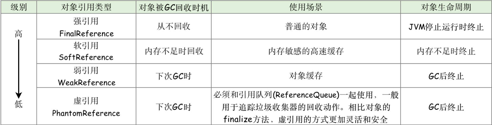

> <font color=SlateBlue>  <u>**Q1. 虚引用 与 软引用、弱引用的区别 ？**</u></font>
> &emsp;  虚引用**必须**和引用队列  *ReferenceQueu*e  联合使用。当垃圾回收器准备回收一个对象时，如果发现它还有虚引用，就会在回收对象的内存之前，把这个虚引用加入到与之关联的引用队列中。

```java 
class Superclass{
    public void test(){
        System.out.println("test");
    }
    public static String DEFINE_TYPE = "hello";
    static{
        System.out.println("super");
    }
}

// 1.强引用 - 正常的对象引用
	String str =  new String("abc"); 
	Superclass super =  new Superclass();    
	super = null; // 当强引用不使用时，置为null，以便GC回收

// 2.软引用 - SoftReference
	Superclass superclass =  new Superclass(); 
	SoftReference<Superclass> softReference=new SoftReference<Superclass>(superclass);
	if(softReference.get()!=null){	//内存充足，还没有被回收器回收，直接通过get()方法获取对象
	   Superclass soft=(Superclass)softReference.get();  
	   soft.test();
	}else{
	    softReference = new SoftReference(superclass); // 内存不足，软引用的对象已经回收，重新构建软引用
	}
	// 软引用可以和引用队列联合使用，软引用对象被垃圾回收，JVM会把软引用加入到与之关联的引用队列中。
	ReferenceQueue<String> referenceQueue = new ReferenceQueue<>();  //引用队列
	String str = new String("abc");
	SoftReference<String> softReference = new SoftReference<>(str, referenceQueue);//软引用关联引用队列

// 3.弱引用 - WeakReference
	String str = new String("abc");
	WeakReference<String> weakReference = new WeakReference<>(str);
	str = null;
	// 弱引用可以和引用队列联合使用，弱引用对象被垃圾回收，JVM会把弱引用加入到与之关联的引用队列中。
	ReferenceQueue<String> referenceQueue = new ReferenceQueue<>();  //引用队列
	String str = new String("abc");
	WeakReference<String> weakReference = new WeakReference<>(str, referenceQueue);//弱引用关联引用队列

// 4.虚引用 - PhantomReference
	String str = new String("abc");
	ReferenceQueue queue = new ReferenceQueue();
	// 创建虚引用，要求必须与一个引用队列关联
	PhantomReference pr = new PhantomReference(str, queue);
```

&emsp; &emsp;<font color=Sienna>**2. Java 类加载过程中的引用关系**</font>
&emsp; &emsp; 在类的全生命周期中，从类的加载器，生成类的Class对象，到类的实例对象的使用有着密不可分的引用关系： 
&emsp; &emsp; ● 类加载器与Class对象：类的Class和加载它的加载器之间是<font color=orange>**双向关联**</font>关系。即<font color=green>一个Class对象总是会引用他的类加载器，调用Class对象的`getClassLoader`方法就可以获得它的类加载器。</font>
&emsp; &emsp; ● 类，类的Class对象，类的实例对象：<font color=green>一个类的实例对象总是引用该类的Class对象，在Object类中定义该类`getClass`方法，会返回对象所属类的Class对象的引用。</font>

```java
package test;
class Superclass{
    public void test(){
        System.out.println("test");
    }
    public static final String DEFINE_TYPE = "hello";
    static{
        System.out.println("super");
    }
}
public class test {
    public static void main(String[] args) throws IllegalAccessException, InstantiationException, ClassNotFoundException {
        ClassLoader classLoader = Superclass.class.getClassLoader();  //Superclass的类加载器
        Class objClass = classLoader.loadClass("test.Superclass");   //Superclass Class对象
        Object obj=objClass.newInstance();                     //Superclass的Object父类
        Superclass superclass = (Superclass)obj;        //Superclass的实例对象
        superclass.test();
    }
}
```


#### 2.3.3 类反射 - Class对象的主要应用

&emsp; &emsp; Java程序在运行之前需要先编译。程序中的对象初始化，对象的调用在编译时期就已经确定并加载到JVM中。当程序在运行时需要 "**动态加载**"某些类时，由于这些类并没有加载到JVM当中，无法直接获取。但是<font color=green>通过Java的反射机制，可以在运行时动态地创建对象并调用其属性和方法，不需要提前在程序中(编译时期) 进行对象的初始化和调用。</font><font color=red>Java反射机制的本质是JVM得到Class对象之后，再通过Class对象进行反编译，从而获取对象的各种信息。</font>


> <font color=SlateBlue>  <u>**Q1. 反射有什么用途 ？**</u></font>
> &emsp;  ① 通过Java反射机制，访问Java未初始化对象的属性和方法。
> &emsp;  ②  反射最重要的用途就是开发各种通用框架。如: `Spring`都是通过`xml`文件配置化的，为了保证框架的通用性，大多数框架需要根据配置文件加载不同的类或者对象，调用不同的方法，这时框架就必须使用反射在程序运行时动态加载需要使用的对象。
> &emsp;  ③ 当使用IDE编程时，IDE会自动列举某一对象所包含的方法和属性，这是通过反射实现的。
>
> <font color=SlateBlue>  <u>**Q2. 反射技术的优缺点 ？**</u></font>
> &emsp;  ① 优点：反射提高了Java程序的灵活性和扩展性，降低耦合性，提高自适应能力。
> &emsp;  ② 缺点：
> &emsp;  &emsp;  ● 性能问题：反射技术是通过.class文件的一种解释操作，反射用于方法和字段时其性能要慢于代码中直接定义。因此Java反射机制一般用于灵活性和扩展性要求很高的系统框架上，普通程序不建议使用。
> &emsp;  &emsp;  ● 代码维护问题：反射技术绕过了源代码，使用反射会模糊程序内部逻辑，因而会带来维护问题。

#### 2.3.4 继承与接口

##### 1. 继承 *extends*

&emsp; &emsp; 继承是 java 面向对象的特征之一，Java的继承通过关键字 ***extends*** 来实现，<font color=green>与C++相比，*java* 摒弃了多继承，只保留了单继承，即**每一个类最多只有一个直接父类**。</font>在子类创建某个类对象时，系统会隐式的创建该类的父类对象，且可以通过 ***super*** 来该子类的父类对象。如果一个 java类没有显式指定直接父类，则默认其直接父类为 `Java.lang.Object`。

```java
class parent{
	public int a;
}
class children extends parent{
    void fun(){
       super.a=10;  //父类的成员变量
    }
} 
```

&emsp;&emsp; 由于**继承会破坏父类的封装性，使子类与父类之间的耦合**，因此子类与父类之间应当遵循如下规则：
&emsp; &emsp;  <font color=green>① 将父类的所有属性设置为` private`，不让子类直接访问父类属性。</font>
&emsp; &emsp;  <font color=red>② 不要让子类随意修改、访问父类的方法。父类中的工具方法要设置为 ***private*** ; 父类中需要被外部调用但不希望子类重写该方法的要设置为 ***final*** ;
如果父类的方法能够被子类重写，但不希望被其他类访问，要设置为 ***protected***。</font>
&emsp; &emsp;  <font color=green>③ 不要在父类构造器中调用被子类重写的方法。</font>

##### 2. 抽象类与接口

&emsp; &emsp; 与C++相比，java的抽象与接口定义更加明确。在 java中，通过 ***abstract*** 定义抽象类，与C++相同，<font color=green>**因为抽象类中含有无具体实现的方法，所以不能用抽象类创建对象(无法进行实例化)，仅能通过子类的继承对抽象方法进行实例化**。</font>除此之外，java还引入了一种更加纯粹的抽象类 - 接口( ***interface*** )，<font color=green>在 ***interface*** 中，所有的方法都是抽象方法，同时引入了 ***implement*** 来实现接口。</font>

> <font color=SlateBlue>  <u>**Q1. 抽象类与接口的区别 ？**</u></font>
> &emsp; ● 语法层面：
> &emsp; &emsp;  ①  抽象类可以提供成员方法的**实现细节**，而接口中只能存在 `public abstract` 方法；
> &emsp; &emsp;  ②  抽象类中的成员变量可以是各种类型的，而接口中的成员变量只能是 `public static final` 类型；
> &emsp; &emsp;  ③  接口中不能含有静态代码块以及静态方法，而抽象类可以有静态代码块和静态方法；
> &emsp; &emsp;  ④  一个类只能继承一个抽象类，而一个类却可以实现多个接口。
> &emsp; ● 设计层面：
> &emsp; &emsp;  ①  抽象类是对类本质的抽象，避免在子类开发重复的代码，表达的是 ***is-a*** 的关系，包含的是实现子类的通用特性，将子类存在差异化的特性进行抽象，交由子类去实现。
> &emsp; &emsp;  ②  接口是对行为的抽象，表达的是 ***like-a*** 的关系，接口的核心是定义行为，即实现类可以做什么，至于实现类是谁，如何实现的，接口并不关心。  

```java
// ifaceA.java
package A.package1;
public interface ifaceA{  //定义接口
    void fun1();
    void fun2();
}
//ifaceB.java
package A.package1;
public interface ifaceB{  //定义接口
    void fun3();
    void fun4();
}

// Iimplement.java
package A;
import A.package1.iface;
public class Iimplement implements A.package1.ifaceA,A.package1.infaceB{  //实现接口
	@Override
	public void fun1(){
		System.out.print("A");
	}
	@Override
	public void fun2(){
		System.out.print("B");
	}
	@Override
	public void fun3(){
		System.out.print("C");
	}
	@Override
	public void fun4(){
		System.out.print("D");
	}
} 
```

#### 2.3.5 内部类

&emsp; &emsp; 内部类是指定义在一个类中的类，内部类主要有以下三个作用：
 &emsp; &emsp; ① 内部类可以访问该类定义所在作用域中的数据，包括私有数据
 &emsp; &emsp; ② 内部类可以对同一个包中的其他类是隐藏，即同一个包的其他类是无法调用该类的内部类的。
 &emsp; &emsp; ③ 当要定义一个回调函数时，可以使用匿名内部类的方式。

***

### 2.4 Java 注解 Annotation - 类的标签

&emsp; &emsp; 注解是 Java 提供的一种途径和方法，可以使源程序中的元素关联到代码中的元数据 ( ***metadata*** )。  <font color=green>注解是附加在代码中的一些源信息或标签信息，用于在一些工具在编译、运行时进行解释和使用，起到**说明**，**配置**的功能，**可以将注解理解为标签**。</font>注解为一种修饰符，应用于类、方法、参数、变量的声明语句中。注解不会也不能影响代码本身的业务逻辑，仅仅只能起到辅助性的作用。**在定义注解时，通过 *@interface* 进行修饰，使用注解时要在被修饰的类或变量之前调用定义的注解。**

> <font color=SlateBlue>  <u>**Q1. 什么是元数据 (Metadata)？**</u></font>
>&emsp;  要真正了解注解的工作方式和原理，就需要先了解什么是元数据。
>&emsp;  元数据是一种很抽象的定义，<font color=red> 元数据是一系列关于数据的数据，是一系列用来描述数据的数据。</font>元数据可以为数据说明其元素或属性(如：名称、大小、数据类型等)，或其结构 (如：长度、字段等)，或其相关数据(如：位于何处、数据拥有者等)
>
>
>
><font color=SlateBlue>  <u>**Q2. @interface 和 interface 的区别 ？**</u></font>
>&emsp;    ●  ***@interface*** : 是用来修饰 ***Annotation*** 的,表示实现了`java.lang.annotation.Annotation`接口
>&emsp;    ●  ***interface***: 声明一个java的接口

#### 2.4.1 注解基本概念

##### <font color=Sienna>**1. 注解的属性**</font>

&emsp;&emsp;注解的属性也叫做成员变量。<font color=red>**注解只有成员变量，没有方法**</font>。注解的成员变量在注解的定义中以“无形参的方法”形式来声明，其**方法名=该成员变量的名字，其返回值 = 该成员变量的类型，若注解中属性存在默认值，默认值需要用 default 关键字指定。**对注解的属性赋值的方式是在注解的括号内以value=”” 形式，多个属性之前用","隔开。

  ```java
  @Target(ElementType.TYPE)
  @Retention(RetentionPolicy.RUNTIME)
  public @interface TestAnnotation {
      int id() default 0;    	//等同于成员变量 => int id = 0;
      String msg(); 					//等同于成员变量 => string msg;
  }
  
  @TestAnnotation(id=3,msg="hello")  //对注解的变量进行赋值
  public class Test {
  }
  ```

##### <font color=Sienna>**2. JDK内置 *Annotation* **</font>

&emsp;&emsp; 在Java中存在三个基本的Annotation：
&emsp;&emsp; ● **@Override** - 限定重写父类方法：强制一个子类覆盖父类的方法。 &emsp;&emsp; ● **@Deprecated** - 标示已过时：表示某个程序元素(类，方法，成员变量)已过时，当使用过时方法时，编译器会发出警告。
&emsp;&emsp; ● **@SuppressWarnings** - 抑制编译器警告：通常情况下，程序中使用没有泛型限制的集合会引起编译器警告，为了避免警告，可以通过`@SuppressWarning`抑制编译器警告。

```java
public class Base{
	void fun(){}
	@Deprecated
	void old(){}   //该方法已过时，不可再调用
}
class child extends Base{
	@Override   //重写父类方法
	@SuppressWarnings(value = "uncheck")  //抑制编译器警告
	void fun(){
		List<String>list=new ArrayList();
	}
}
```

##### <font color=Sienna>**3. 元注解**</font>

&emsp;&emsp;元注解是 Java 提供的**用于修饰注解的注解**，是基本注解。`Annotation`提供了四种元注解，分别是：
&emsp;&emsp;  **● @Target：**注解所作用的目标，指明这个注解最终是用来修饰方法，还是修饰类，还是修饰属性；
&emsp;&emsp;  **● @Retention：**用于指明当前注解的生命周期，生命周期包含三个阶段：<font color=green>**`SOURCE`在编译阶段丢弃**、**`CLASS`在类加载的时候丢弃**、**`RUNTIME`始终不会丢弃，运行期也保留该注解**</font>，因此可以使用反射机制读取该注解的信息。


&emsp;&emsp; ● @Documented：注解修饰的注解，当执行 JavaDoc 文档打包时会被保存进 doc 文档，反之将在打包时丢弃。
&emsp;&emsp; ● @Inherited：注解修饰的注解是具有可继承性的，也就说我们的注解修饰了一个类，而该类的子类将自动继承父类的该注解。

```java
public @interface TestAnnotation {    //通过 @interface 来定义注解 
}

@Inherited	//元注解，用于对注解的修饰，相当于对@TestAnnotation注解打上了一个标签
						//注解@TestAnnotation被@Inherited修饰，之后类Test被@TestAnnotation注解，类TestB继承A,类TestB也拥有@TestAnnotation注解。
@TestAnnotation   //对类使用注解，相当于对Test类打上了一个标签
public class Test {
}
```

#### 2.4.2 自定义注解 (注解的应用)

&emsp;&emsp; 定义新的Annotation类型需要使用`@interface` 关键字。<font color=green>通俗来说，可以将注解理解为”标签“，在类和方法中使用注解，相当于对类和方法打上了”标签“，后续只需要判断是否存在这个”标签“，并对”标签“的”内容(定义的变量)“进行处理即可</font>。<font color=red>在注解应用的过程中，通常包括三个步骤：**注解声明，使用注解元素，配置注解处理器**</font>。自定义Annotation的规则如下： 
&emsp;&emsp;① Annotation 型定义为@interface,所有的Annotation 会自动继承` java.lang.Annotation`这一接口,并且不能再去继承别的类或是接口。
&emsp;&emsp;② 注解的参数成员(变量、方法)只能用 `public` 或默认(`default`)
这两个访问权修饰。
&emsp;&emsp;③ 注解的参数成员只能用基本类型byte、short、char、int、long、float、double、boolean八种基本数据类型和String、Enum、Class、annotations等数据类型，以及这一些类型的数组。
&emsp;&emsp;<font color = orange>④ 要获取类方法和字段的注解信息，必须通过 java的反射技术来获取 `Annotation` 对象。</font>

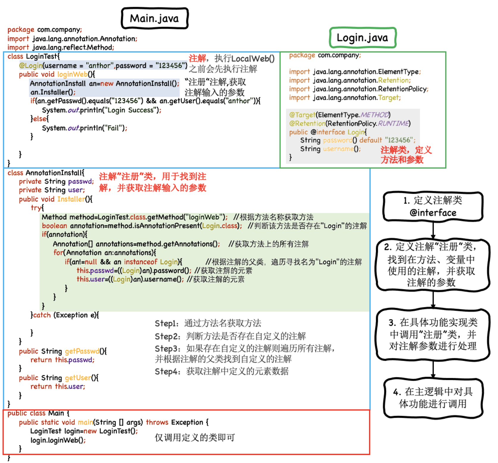

#### 2.4.3 注解的底层原理 (从字节码到注解实例)

&emsp;&emsp; <font color=red> `Annotion`(注解)是一个接口，程序可以通过反射来获取指定程序元素的`Annotion`对象，然后通过`Annotion`对象来获取注解里面的元数据。</font><font color=green>注解不支持继承，因此**不能使用关键字`extends`来继承某个`@interface`**，但注解在编译后，编译器会自动继承`java.lang.annotation.Annotation`接口。因此，注解的本质是一个继承了 `Annotation` 接口的接口。</font>注解作为一个特殊的接口，其实现类是在代码运行时生成的动态代理类，而之后底层代码通过**反射**的方式获取到注解。


&emsp; 下图以`@Override`为例，说明注解的本质：


&emsp;&emsp;注解的解析流程如下所示：
&emsp; &emsp; ① `getAnnotation() `作为获取注解的主要入口，*Class*类，*Field*类，Method类调用 `annotationData() `方法创建 ***Class.AnnotationData*** 类实例，***Class.AnnotationData*** 是一个注解缓存类，用于缓存该类的注解信息，其中包含两个Map，分别用于存储当前类的注解信息和继承的注解信息。
&emsp; &emsp; ② ***Class.AnnotationData***  是由 ***AnnotationParser* 类对.class字节码进行解析**，并通过 ***AnnotationInvocationHandler*** 生成注解的**动态代理对象 *Annotation***，并将注解对象加入到 `LinkedHashMap (key=Class类型，value=注解对象)`中。


### 2.5 Java 线程与并发

&emsp; &emsp;线程，一个执行实体，正在执行的程序，担当分配系统资源（CPU、内存）的实体。线程的底层实现原理在[操作系统](https://blog.csdn.net/weixin_42963969/article/details/105255948)中具体介绍。这里介绍Java线程的实现方式以及Java线程如何使用。

#### 2.5.1 线程的实现

&emsp;&emsp;Java的线程是通过`java.lang.Thread`类来实现的，在Java中有三种方法来**实现**线程：
&emsp;&emsp;① 可以<font color=green>通过创建继承`Thread`类的实例来创建新的线程。</font>每个线程都是通过对应的方法`run()`来描述该线程需要执行的操作。通过调用`Thread`类的`start()`方法来启动一个线程。
&emsp;&emsp;② Java中只支持单继承，如果一个类继承了某个父类，就无法再继承`Thread`类。因此`Thread`类提供了一个`Runnable`接口，<font color=green>可以通过重写`Runnable`接口中的`run()`方法，也可以实现线程的启动，</font><font color=orange>**因此`Runnable`一个线程操作的方法体，是用户定义的需要完成的具体任务，并通过 Thread.start() 去启动线程**。</font>
&emsp;&emsp;③ 对于某些场景，需要在线程执行完成后将任务执行的结果返回，或当线程在执行时抛出异常。因此可以通过实现`Callable`接口中的 `call()`方法来完成结果的返回。<font color=green>`Callable`接口通常与`FutureTask`一起使用，通过`FutureTask`来异步的执行线程，并保存线程结果。</font><font color=red>
注：通过`new Thread()`创建线程时，只能通过`Runnable`，不能通过`Callable`。</font>
&emsp;&emsp; <font color=red>**Notice**：当一个线程运行结束后，无法通过`start()`方法再次启动。即每个线程只能被启动一次。</font>

```java
public class test {
    public static void main(String[] args) {
    // 1. 通过继承Thread类实现多线程
        MyThreadA myThread=new MyThreadA();
        
	// 2.通过实现Runnable接口实现多线程
        MyThreadB myThreadB = new MyThreadB();
        Thread thread = new Thread(myThreadB);
        
   // 3. 通过Callable接口实现线程结果返回
   		CallableExample callable = new CallableExample();
   		FutureTask futureTask=new FutureTask(callable);
   		futureTask.run();
   		futureTask.get();  // 获取 线程返回的运行结果
    // 线程启动
        myThread.start();
        thread.start();
    }
}
// 1. 通过继承Thread类实现多线程
class MyThreadA extends Thread{
    @Override
    public void run() {
        for(int i=0;i<10;++i)
            System.out.println("A "+i);
    }
}
// 2.通过实现Runnable接口实现多线程
class MyThreadB implements Runnable{
    @Override
    public void run() {
        for(int i=0;i<10;++i)
            System.out.println("B "+i);
    }
}

// 3. 通过实现Callable接口，实现线程结果的返回
class CallableExample implements Callable { 
	@Override
    public Object call() throws Exception { 
        int a=10;
        return a; 
    } 
} 
```

> <font color=SlateBlue>  <u>**Q1. run() 和 start() 的区别 ？**</u></font>
>  &emsp;  ● `run()` 方法是一个普通的成员方法，当线程调用了`start()`方法后，该线程会去调用这个`run()`方法，运行该线程需要执行的操作。因此，如果直接调用run() 方法，只会在原有线程上运行，不会创建一个新的线程。
>  &emsp;  ● `start()` 方法用来启动线程。当线程创建成功时，线程处于`NEW(创建)`状态，调用`start()`后，线程会变为`READY(就绪)`状态，在等待CPU调度后，线程才可以运行，进入`RUNNING(运行)`状态。

#### 2.5.2 线程状态切换

&emsp; &emsp; 在线程的生命周期中，线程共有5种状态：**创建、就绪、运行、死亡、阻塞**。在任意一个时间点，一个线程只能有且只有其中一种状态。
&emsp;&emsp; ① 创建态 ( ***New*** )：创建后尚未启动的线程处于这种状态。 
&emsp;&emsp; ② 运行态 ( ***Runable*** )：处于此状态的线程有可能正在执行，也有可能正在等待CPU分配执行时间。
&emsp;&emsp; ③ 阻塞态：阻塞态根据阻塞方式的不同又可以分为三种：
  &emsp; &emsp; ● 等待阻塞 ( ***Waiting*** )：处于这个状态的线程不会被分配CPU时间，只能等待被其他线程显式的唤醒。以下方式会使线程进入等待阻塞状态：【没有设置*Timeout* 参数的 `Object.wait()` 方法】、【没有设置 *Timeout* 参数的 `Thread.join()` 方法】、【 `LockSupport.park()` 方法】。
  &emsp; &emsp; ● 同步阻塞 ( ***Blocked*** )：在线程等待进入同步区域时，线程会处于此状态。线程会等待获取一个排他锁，从而进入同步区域。
  &emsp; &emsp; ● 限期阻塞 ( ***Timed Waiting*** )：处于此状态的线程不会被分配CPU时间，但此状态的线程不需要其他线程的显式的唤醒，在一段时间后，线程会由系统自动唤醒。以下方式会使线程进入等待阻塞状态：【`Thread.sleep()` 方法】、【设置了 *Timeout* 的 `Object.wait()` 方法】、【设置了 *Timeout* 的 `Thread.join()` 方法】、【`LockSupport.parkNanos()` 方法】、【`LockSupport.parkUntil()` 方法】
  &emsp;&emsp; ④ 死亡态 ( ***Terminated*** )：已终止线程的线程状态，线程已经结束执行。


> <font color=SlateBlue>  <u>**Q1. sleep()、wait() 和 notify() 的区别 ？**</u></font>
>&emsp; Java中的`sleep()`和`wait()`函数都可以挂起当前线程，使线程休眠，但实现方式和用法不同：
>&emsp;  ● <font color =green > `sleep()`是  *Thread* 类的方法**静态方法**，需要通过 *Thread* 类调用 `Thread.sleep()`。而 `wait()` 和 `notify()` 是 *Object* 类中的实例方法，因为Java所有类都继承于 *Object* 类，所有类中都可以使用。</font>
>&emsp;  ● <font color = red> `wait()`、`notify()`必须用在 ***synchronized*** 代码块中调用。</font><font color=orange>当调用`wait()` 方法后，当前获得 ***synchronized*** 同步块对象锁的线程进入”等待阻塞“状态，同时**释放当前线程的对象锁**。此时**其他线程可以获得该 *synchronized* 同步块的对象锁**。被阻塞的线程需要通过 `notify()` 方法来唤醒。</font>
>&emsp;  ● 当在 synchronized 同步块中使用 `sleep()`，该线程会被挂起，但**不会释放对象锁**，所以如果有其他线程等待执行该 synchronized 代码块，一直会被阻塞，等待该线程被 `notify()`唤醒释放对象锁。
>  

#### 2.5.3 线程的调度

&emsp;&emsp;线程的调度是指系统为线程分配CPU使用权的过程，线程的调度分为两种方式:协同式线程调度、抢占式线程调度。 
&emsp;&emsp; **① 协同式线程调度**：使用协同式线程调度的多线程系统，线程的执行时间是由线程本身控制的。线程把自己的任务执行完成之后，会主动通知系统切换到另一个线程上。
&emsp;&emsp;&emsp; ●优点：由于线程执行完当前任务才会切换新线程，因此不存在线程同步问题。
&emsp;&emsp;&emsp; ● 缺点：由于每个线程的执行时间是不可控的，如果线程出现死循环，则会导致程序被阻塞。
&emsp;&emsp; **② 抢占式线程调度**：使用抢占式线程调度的多线程系统，每个线程都是由系统来分配执行时间，线程的切换不由线程本身决定。由于线程的执行时间是可控的，即使某一线程出现问题，不会导致整个进程被阻塞。同时，通过给线程设置优先级，可以给不同的线程分配不同的执行时间。

#### 2.5.4 线程安全与锁机制

&emsp;&emsp; 在线程并发的过程中，首先要保证并发的正确性，在正确性的基础上实现高效并发。由于线程创建和运行时，必须通过 *Runnable* 来定义需要执行的任务，当在 *Runnable* -> run() 方法中定义了一个线程的局部变量，且有多个( >2个 ) *Thread* 启动并运行该 *Runnable* 任务时，会出现线程安全问题：
&emsp;&emsp; **线程安全问题：** <font color=red> 线程安全问题的本质原因是由于一个共享数据在多线程并发过程中，由于逻辑运算的非原子性 ( 逻辑运算的非原子性是指一个线程在执行过程中，其CPU的执行时间片会进行重新调度，导致当前线程执行过程中断 )
，导致并发计算的结果与代码逻辑结果不一致的问题，即出现线程安全问题</font>。为了解决这个问题，Java提供了同步器来保证线程运行时顺序和同步。

##### <font color=Sienna>**1. 线程安全程度分类**</font>

&emsp;&emsp;按照线程安全的安全程度由强至弱进行排序，可以将Java中各种**操作共享的数据**分为5类：**不可变数据、绝对线程安全数据、相对线程安全数据、线程兼容数据和线程对立数据**。
&emsp; &emsp; **① 不可变数据**： 不可变数据的对象一定是线程安全的，无论是对象方法实现还是方法调用者，都不需要采取任何的线程安全保障措施。在Java中，如果共享数据是基本数据类型，只要在定义时使用 *final* 修饰该数据变量就可以保证该数据变量是不可变的。如果共享数据是一个对象，需要保证对象的行为不会对其状态 ( 原有变量值 ) 产生任何影响 ( 如 *String* 对象，调用其 *replace()* , *substring()*方法不会影响其原有的值)。
&emsp; &emsp; **② 绝对线程安全数据**：绝对线程安全是指不管运行时环境如何排列，调用者和线程都不需要任何额外的同步措施，该类的对象被多个线程访问时仍然有效。要实现绝对线程安全，其所需的代价是很大的。
&emsp; &emsp; **③ 相对线程安全数据**：相对线程安全，即通常意义上说的线程安全类。它保证了对某个对象的单独调用和操作是线程安全的，但是对于一些特定顺序的连续调用，需要在调用时通过额外的同步方式来保证调用的正确性。

```java
1. 虽然Vector本身是线程安全的，但对于下面的操作，如果没有synchronized同步块，可能会出现thread2线程调用了thread1线程刚刚删除的元素，导致访问vector时抛出ArrayIndexOutOfBoundsException错误。
2. 通过添加synchronized同步块，保证了thread1和thread2两个线程同一时刻只能有一个线程可以获得访问vector数据的同步锁，这样就避免了线程安全问题。
3. 由于在操作vector时，由于其操作顺序问题，需要增加额外的同步措施，因此vector是相对线程安全数据。
public class Main {
    private static Vector<Integer> vector = new Vector<>();
    public static void main(String[] args) throws InterruptedException {
        while(true){
            for(int i=0;i<30;++i){  vector.add(i); }
            Thread thread1 = new Thread(() -> {
                synchronized (vector){
                    for(int i=0;i<vector.size();++i){
                        vector.remove(i);
                    }
                }
            });

            Thread thread2 = new Thread(() -> {
                synchronized (vector){
                    for(int i=0;i< vector.size();++i){
                        System.out.println(vector.get(i));
                    }
                }
            });
            thread1.start();
            thread2.start();

            while(Thread.activeCount() > 20);
        }
    }
}
```

&emsp; &emsp; **④ 线程兼容**：线程兼容是指对象本身并不是线程安全的，但可以通过对象调用端正确的使用同步措施来保证对象在并发环境中是线程安全的。Java API中大部分的类都是线程兼容的。 &emsp; &emsp; **
⑤ 线程对立**：线程对立是指无论对象调用端采取何种同步措施，都无法在多线程环境中并发使用该对象。如 *Thread* 类的 *suspend()* 和 *resume()*
方法，如果有两个线程同时持有一个线程对象，一个尝试中断线程，另一个尝试恢复线程，如果并发进行的话，无论调用是否进行了同步，都存在死锁风险。

##### 2. 线程安全的实现方法

&emsp;&emsp;要解决线程安全问题，就是要避免在多线程并发过程中，多个线程对同一个共享变量数据进行逻辑运算操作。线程安全的实现分为三种方式：互斥同步方式、非阻塞同步方式、无同步方式。


###### (1). 互斥同步方式 - 悲观锁

&emsp;&emsp;互斥同步是一种悲观的并发机制，其认为如果不去进行线程同步措施，一定会出现线程安全问题，所以无论是否真的出现线程竞争，都需要加锁。同步是指在多个线程并发访问共享数据时，保证共享数据在同一时刻只被一个线程使用。互斥是实现同步的一种手段，临界区、互斥量和信号量都是主要的互斥实现方式。进行互斥同步时，线程的阻塞和唤醒会带来性能问题。
&emsp; &emsp; ① <font color=red>***synchronized***</font>：Java中最基本的互斥同步方式就是 *synchronized* 关键字。*synchronized*  提供的功能如下：
&emsp; &emsp; <font color=green> ● *synchronized* 同步块对同一个线程来说是可重入的，不会出现自己锁自己的问题。</font>
&emsp; &emsp;  <font color=green>● *synchronized* 同步块在已进入的线程执行完成之前，会阻塞后面其他线程的进入。</font>
&emsp; &emsp; <font color=green> ● *synchronized* 在阻塞或唤醒一个线程时，需要进入操作系统的内核态，状态的转换需要消耗很多的CPU处理时间，通常需要在使用 *synchronized*时进行优化，如在通知操作系统阻塞线程之前，加入一段自旋等待过程，避免频繁的进入内核态。</font>

> <font color=SlateBlue>  <u>**Q1. *synchronized* 如何使用？**</u></font>
>&emsp;&emsp;***synchronized*** 主要有三种用法：
>&emsp; &emsp; **① 修饰实例方法**: **被修饰的方法称为同步方法，其作用的范围是整个方法，作用的对象是调用这个方法的对象**，进入同步代码前要获得当前对象实例的锁。
>
>```java
>//共享对象数据
>public class HasSelfPrivateNum {
>    private int num = 0;
>    // 用synchronized修饰实例方法
>    public synchronized void addI(String name){
>        try{
>            if(name.equals("a")){
>                num = 100;
>                System.out.println("a set over");
>                Thread.sleep(1000);
>            }else{
>                num = 200;
>                System.out.println("b set over");
>            }
>            System.out.println("num = " +  num);
>        }catch (Exception ex){
>            ex.printStackTrace();
>        }
>    }
>}
>// 线程1 - Thread1
>public class Thread1 extends Thread{
>    private HasSelfPrivateNum hasSelfPrivateNum1;
>    public Thread1(HasSelfPrivateNum hasSelfPrivateNum){
>        super();
>        this.hasSelfPrivateNum1 = hasSelfPrivateNum;
>    }
>    @Override
>    public void run(){
>        super.run();
>        hasSelfPrivateNum1.addI("a");
>    }
>}
>// 线程2 - Thread2
>public class Thread2 extends Thread{
>    public HasSelfPrivateNum hasSelfPrivateNum2;
>    public Thread2(HasSelfPrivateNum hasSelfPrivateNum){
>        super();
>        this.hasSelfPrivateNum2 = hasSelfPrivateNum;
>    }
>    @Override
>    public void run(){
>        super.run();
>        hasSelfPrivateNum2.addI("b");
>    }
>}
>//主函数
>public static void main(String[] args) throws InterruptedException {
>     HasSelfPrivateNum hasSelfPrivateNum = new HasSelfPrivateNum();
>     Thread1 thread1 = new Thread1(hasSelfPrivateNum);
>     thread1.start();
>     Thread2 thread2 = new Thread2(hasSelfPrivateNum);
>     thread2.start();
>}
>-- Output -- 
>1. 如果hasSelfPrivateNum.addI()方法没有加synchronized同步，则输出结果会出现非线程安全问题，结果如下：
>  a set over
>  b set over
>  num = 200
>2. 加synchronized同步后，避免了非线程安全问题，结果如下：
>  a set over
>	num = 100
>	b set over
>	num = 200
>```
>
>&emsp; &emsp; **② 修饰静态方法**:  **给当前类加锁，会作用于类的所有对象实例 ，其作用的范围是整个静态方法，进入同步代码前要获得当前 *class* 的锁**。<font color=red>如果一个线程A调用一个实例对象的 *non-static-synchronized* 方法，而线程B需要调用这个实例对象所属类的 *static-synchronized* 方法，不会发生互斥情况，因为访问 *static-synchronized* 方法占用的锁是当前类的锁，而访问 *non-static-synchronized* 方法占用的锁是当前实例对象锁。</font>`synchronized void staic method(){ 业务代码 }`
> &emsp; &emsp; **③ 修饰代码块**: 需要指定加锁对象，对给定对象/类加锁。**当多个线程持有的对象监听器为同一个对象时，线程是同步的，同一时间只有一个线程可以访问同步块**，**但是如果是同一个类的不同实例，同步块的执行就是异步的**。 `synchronized(object)` / `synchronized(类.class)` `synchronized(this) { 业务代码 }`
>
>```java
>//共享对象数据
>public class HasSelfPrivateNum {
>    private String anyString = new String()
>    // 方法A
>    public void aFunction(String name){
>        try{
>            synchronized (anyString) 
>               System.out.println("aFunction begin ");
>               Thread.sleep(1000);
>               System.out.println("aFunction end");
>            }
>        }catch (Exception ex){
>            ex.printStackTrace();
>        }
>    }
>  
>  	// 方法B
>    synchronized public void b() {
>       System.out.println("bFunction begin");
>       System.out.println("aFunction end");
>    }
>}
>// 线程1 - Thread1 - 执行HasSelfPrivateNum.a()方法
>public class Thread1 extends Thread{
>    private HasSelfPrivateNum hasSelfPrivateNum1;
>    public Thread1(HasSelfPrivateNum hasSelfPrivateNum){
>        super();
>        this.hasSelfPrivateNum1 = hasSelfPrivateNum;
>    }
>    @Override
>    public void run(){
>        hasSelfPrivateNum1.a();
>    }
>}
>// 线程2 - Thread2 - 执行HasSelfPrivateNum.b()方法
>public class Thread2 extends Thread{
>    public HasSelfPrivateNum hasSelfPrivateNum2;
>    public Thread2(HasSelfPrivateNum hasSelfPrivateNum){
>        super();
>        this.hasSelfPrivateNum2 = hasSelfPrivateNum;
>    }
>    @Override
>    public void run(){
>        hasSelfPrivateNum2.b();
>    }
>}
>//主函数
>public static void main(String[] args) throws InterruptedException {
>     HasSelfPrivateNum hasSelfPrivateNum = new HasSelfPrivateNum();
>     Thread1 thread1 = new Thread1(hasSelfPrivateNum);
>     thread1.start();
>     Thread2 thread2 = new Thread2(hasSelfPrivateNum);
>     thread2.start();
>}
>-- Output --
>同一个类的不同实例，在执行同一个共享数据类时，不同的同步块是异步的
>  A begin
>  B begin
>  B end
>  A end
>```
>
><font color=SlateBlue>  <u>**Q2. *synchronized* 是如何实现 (底层原理) ？**</u></font>
>&emsp; &emsp;*synchronized* 是<font color=red>**基于JVM 指令和对象监视器 *Monior* 实现的**</font>。在虚拟机中，***Monitor*** 是基于C++实现的，由 ***ObjectMonitor*** 对象实现的。<font color=green>**每个对象中都内置了一个 *ObjectMonitor* 对象**</font>。*synchronized* 在编译之后，会在所指定的对象引用的字节码前后分别加上 *monitorenter* 和 *monitorexit* 字节码指令。
>&emsp;  &emsp;  ● 当有多个线程同时想获取某个对象锁时，线程会进入阻塞状态，进入 ***EntryList*** 队列。
>&emsp;  &emsp;  ● 当某个线程获取到对象锁时，线程成为对象锁的拥有者 (即获取该对象 *Monitor* 的所有权)，准备开始运行加锁代码块时，执行字节码指令 *monitorenter*，此时 **`count++`**，共享对象的对象头 *MarkWord* 的**锁标志位为01**，**指针重量级锁的指针就是指向的是 *Monitor* 对象的起始地址**。
>&emsp;  &emsp;  ● 当对象锁的拥有者线程再次获取锁时，由于 *synchronized* 锁是可重入的，此时进行 **`count++`**，而不是在 ***EntryList*** 队列中阻塞等待锁；
>&emsp;  &emsp;  ● 每个加锁代码块运行完成或因发生异常退出时，会执行 *monitorexit* 字节码指令，此时 **`count--`** ，当 **`count=0`** 时，对象锁的拥有者线程释放锁。
>&emsp;  &emsp;  ● 拥有锁的线程在运行过程中调用了 `wait()` 方法，那么线程会进入到 ***WaitSet*** 对象，等待被 `notify()` 或等待的时间已到，才有可能再次成为对象锁的拥有者。
>
>

&emsp; &emsp; ② **重入锁 *ReentrantLock***：*ReentrantLock* 也具有线程重入特性。与 *synchronized* 同步块相比，增加了**等待可中断、可实现公平锁、锁可绑定多个条件**三个高级功能： 
&emsp; &emsp; ● 等待可中断：当持有锁的线程长期不释放锁时，正在等待的线程可以放弃等到，改为处理其他事情。主要用于处理执行时间很长的同步块。
&emsp; &emsp; ● 公平锁：公平锁是指多个线程等待同一个锁时，必须按照申请锁的时间顺序来依次获得锁，*synchronize* 与 ReentrantLock 的锁都是非公平的，但 *ReentrantLock* 可以通过带布尔值的构造函数要求使用公平锁。
&emsp; &emsp; ● 锁绑定多个条件：指一个*ReentrantLock* 对象可以通知绑定多个 Condition 对象，而 *synchronized* 锁对象的 *wait()、notify()、notifyAll()*
方法仅可以实现一个隐含条件，如果多个条件关联时，需要额外的添加锁。

###### (2). 非阻塞同步 - 乐观锁

&emsp; &emsp; 非阻塞同步是基于冲突检测的乐观并发机制，即先进行操作，如果没有其他线程竞争共享数据，则操作成功。如果共享数据存在竞争冲突，则采取补偿措施 ( 进行不断重试，直到无冲突为止 )。非阻塞同步不需要将线程阻塞，从而不需要在用户态与内核态之间切换，提高系统效率。
&emsp; &emsp; 非阻塞同步在操作和冲突检测这两个步骤需要具备原子性，而此时原子性不能再通过互斥同步进行保证，只能依靠硬件CPU指令来完成原子性操作。CPU指令中提供的原子性操作包括：【测试并设置 ( *Test-And-Set* )】、【获取并增加 *Fetch-And-Increment* 】、【交换 *Swap* 】、【比较并交换  *Compare-And-Swap* 】、【加载链接/条件存储 *Load-Linked/Store-Conditional* 】

###### (3). 无同步方案

&emsp; &emsp; 要保证线程安全，不一定必须要进行同步，同步只是保证共享数据在多线程竞争时保持顺序性的措施。如果一个方法中不存在共享数据，则该方法一定是线程安全的。这种不存在共享数据的方法(代码)分为以下两类： 
&emsp; &emsp; ① 可重入代码：可重入代码也称为纯代码，这类<font color=red>**代码不依赖存储在堆上的数据和公共的系统资源，用到的状态量都是有参数传入，且代码中不会调用非可重入方法**</font>。因此，所有的可重入代码都是线程安全的，可重入代码在其执行期间的任何时刻发生中断，其计算结果都不会发生任何错误，
&emsp; &emsp; ② 线程本地存储：如果我们把共享数据的处理代码能够保证在一个线程中执行，即<font color=red>**把共享数据的可见范围限制在同一个线程之中，共享变量数据在每个线程中都有一个副本，每个线程仅操作副本当中的共享变量数据，那么这样也可以避免共享数据在不同线程操作所导致的线程安全问题**</font>。在Java中可以通过 ***ThreadLocal*** 类实现线程的本地存储功能。每个 Thead 线程对象中都有一个 *ThreadLocalMap* 对象，*ThreadLocalMap* 中 存储了多个以  *threadLocalHashCode* 为 Key，本地变量为值的为 Value 的数据。*TheadLocal* 对象就是 *ThreadLocalMap* 的访问入口。

#### 2.5.5 线程无同步方案

&emsp; &emsp; 线程安全的本质是为了保证线程数据的安全，在Java中可以使用*ThreadLocal* 维护变量，从而可以不再使用锁，同步器等工具实现线程的同步。


##### 1. *ThreadLocal* - 任务实体中的"共享/全局"变量

&emsp; &emsp; 为了保证线程的数据安全，在Java中可以使用 ThreadLocal 维护变量，ThreadLocal为每个使用该变量的线程提供<font color=green>**独立的局部变量副本**</font>，每一个线程都可以独立地改变自己的副本，通过 set() 和 get() 来对这个局部变量进行操作，但不会和其他线程的局部变量进行冲突，实现了线程的数据隔离。


> <font color=SlateBlue>  <u>**Q1.ThreadLocal 是如何实现线程 (数据) 隔离的 ？**</u></font>
>&emsp;   Thread类中有两个变量`ThreadLocalMap threadLocals`和`ThreadLocalMap inheritableThreadLocals`。在每个Thread线程对象中，都维护了一个ThreadLocalMap。即一个Thread线程对象，最多只有一个ThreadLocalMap，而ThreadLocalMap底层是一个**Entry数组**，但是一个Thread可以有多个ThreadLocal，一个ThreadLocal对应一个变量数据，变量数据将ThreadLocal作为Key，Object作为value，封装成Entry存到ThreadLocalMap中Entry[]数组中。Thread与ThreadLocal之间的关系如下图所示:
>
>
>
><font color=SlateBlue>  <u>**Q2.ThreadLocalMap 是如何解决Hash冲突的 ？**</u></font>
>&emsp;  每个ThreadLocal都有一个对应的`threadLocalHashCode`，通过`threadLocalHashCode & (len-1)`可以算出ThreadLocal变量对应的Entry[]数组的下标(即Key)。当Key发生Hash冲突时，ThreadLocalMap采用<font color=red>**线性探测方法**</font>，循环查找下一位(索引)是否冲突，直到找到不存在冲突的索引(Entry[]数组下标)。
>&emsp; 
><font color=SlateBlue>  <u>**Q3.ThreadLocalMap的Entry中，对 ThreadLocal 的引用为什么要设置成弱引用 ？**</u></font>
>&emsp; 当代码中将ThreadLocal的强引用置为null后，这时候Entry中的ThreadLocal应该被回收了，但是如果Entry的key被设置成强引用则该ThreadLocal就不能被回收，从而导致内存泄露。 
>
>
>
><font color=SlateBlue>  <u>**Q4. ThreadLocal的内存泄露问题？**</u></font>
>&emsp; ●   <font color=green>虽然 Entry对象中的ThreadLocal引用为弱引用，但这个弱引用只是针对key的。当把 Threadlocal 实例置为null以后，没有任何强引用指向 Threadlocal 实例，此时Threadlocal将会被gc回收。</font><font color=orange>虽然ThreadLocal被回收了，但是Entry对象中的value却不能回收，因为存在一条从`Current Thread`连接过来的强引用。只有当前Thread结束以后, `Current thread`就不会存在栈中，连接value的强引用断开。此时Current Thread, ThreadLocalMap, Entry-value将全部被GC回收。</font>
>&emsp; ●  根据上述ThreadLocal内存回收的过程可以看出，<font color=red>只要当前的线程对象被GC回收，ThreadLocal就不会出现内存泄露的情况。</font>但如果是在<font color=red>使用线程池</font>的时候，线程结束是不会销毁的，会再次使用的。就可能出现内存泄露。<font color=red>因此，当使用完ThreadLocal之后，调用`Threadlocal`的`remove()`方法把当前`ThreadLocal`从当前线程的`ThreadLocalMap`中移除。</font>

##### 2. *ThreadLocal* 的使用

```java
// 1. ThreadLocal多线程中的使用 - 线程变量不冲突
public class test{
    public static void main(String[] args) throws InterruptedException {
        Task task = new Task();
        Thread t1=new Thread(task);  //线程创建时，会各自创建一个ThreadLocal
        Thread t2=new Thread(task);  //因此，两个线程的ThreadLocal并不冲突
        t1.start();
        Thread.sleep(1000);
        t2.start();

    }
}
class Task implements Runnable{
    //任务实体中的本地变量
    ThreadLocal<Integer> tl =new ThreadLocal<>();
    @Override
    public void run() {
        Integer i = 10;
        tl.set(i);
        if(Thread.currentThread().getName().equals("Thread-0")){
            i++;
            tl.set(i);
        }
        System.out.println(Thread.currentThread().getName() + " i:" + i + " tl:"+tl.get());
    }
}
--Output--:
	Thread-0 i:11 tl:11
	Thread-1 i:10 tl:10
    
// 2. ThreadLocal作为全局变量 - 保存上下文环境中的全局变量
// (1). SelfThreadLocal类 变量内容类，内部定义需要全局存放的对象
public class SelfThreadLocal {
    private User user;
    private Car car;
		// getter() 和 Setter() 省略
}
// (2). SelfContext类 - 全局变量类，定义了ThreadLocal的基本操作[初始化，获取，删除变量操作]
public class SelfContext {
    private static ThreadLocal<SelfThreadLocal> threadLocal = new ThreadLocal<>();

    public static void init(){
        SelfThreadLocal selfThreadLocal = new SelfThreadLocal();
        threadLocal.set(selfThreadLocal);
    }
    public static SelfThreadLocal getContext(){
        return threadLocal.get();
    }

    public static void remove(){
        threadLocal.remove();
    }

    public static User getUserContext(){
        return threadLocal.get().getUser();
    }
}
// (3). Main类 - 全局变量的使用
public class Main {
    public static void main(String[] args)  {
			 	User user = new User();
        user.setName("demo");
        user.setAge(18);

        Car car = new Car();
        car.setBrand("BMW");

        SelfContext.init();  //全局变量初始化
        SelfContext.getContext().setUser(user);  //设置user
        SelfContext.getContext().setCar(car);		 //设置Car
      
      	System.out.println(SelfContext.getContext().getUser().getName());
        Car carContext = SelfContext.getContext().getCar();
        System.out.println(carContext.getBrand());
    }
}
--OutPut:--
demo
BWM
```

##### 3. *InheritableThreadLocal* ( ITL )

&emsp; &emsp; 虽然 *ThreadLocal* 为每个使用该变量的线程提供<font color=green>**独立的局部变量副本**</font>，使当前线程变量不会和其他线程的局部变量进行冲突。但是在父线程中创建的本地变量是无法传递给子线程的，因此Java提供了<font color=red>`InheritableThreadLocal (ITL)`来解决线程在继承过程中变量的传递问题。</font>

```java
public static void main(String[] args) throws InterruptedException {
	ThreadLocal<String> tL=new ThreadLocal<>(); 						//主线程(父线程)创建本地变量
	ThreadLocal<String> itL=new InheritableThreadLocal<>(); //主线程(父线程)创建本地变量
	tL.set("Threadlocal"); 
	itL.set("Threadlocal"); 				
	System.out.println(tL.get());			//输出 “Threadlocal”
	new Thread(()->{                	//在父线程中创建子线程，并在子线程中输出父线程的本地变量
	   System.out.println(tL.get()); 	//输出null，因为ThreadLocal变量不能通过父子线程进行继承
	   System.out.println(itL.get()); //输出Threadlocal，InheritableThreadLocal变量可以通过父子线程进行继承
	}).start();
}
```

> <font color=SlateBlue>  <u>**Q1. InheritableThreadLocal 是如何实现线程本地变量继承的 ？**</u></font>
>&emsp;  `InheritableThreadLocal`是ThreadLocal的子类。在线程在创建并初始化时，会检查其父线程是否存在inheritableThreadLocals，如果存在则会在父线程的inheritableThreadLocals的基础上创建子线程。 
>
>

##### <font color=Sienna>**4. *TransmittableThreadLocal* ( TTL )**</font>

&emsp; &emsp; TL 解决了不同线程之间使用同一本地变量时的冲突问题，ITL解决了在线程继承中，本地变量从父线程传递(继承)到子线程的问题。但在ITL中仅解决了线程继承这一瞬间的变量传递问题，如果创建子线程一直被池化复用 ( 如线程池中的子线程)，则父线程与子线程之间的变量无法进行同步，则会导致数据问题。针对该问题，AliBaba 在ITL的基础上提出了TTL，<font color=green>**用来解决子线程池化复用时的变量数据（此时的变量数据可以看做是业务逻辑的上下文）传递问题**。</font>
&emsp; &emsp; TTL 为了能够在子线程池化复用的过程中保持变量数据的一致性，TTL 对原有的 `Runnable` 进行了改造，实现了 `TtlRunnable` 。通过**CRR模式 `(capture[抓取]，replay[回放]，restore[恢复])`** 对上下文的数据进行同步。


#### 2.5.6 锁优化

&emsp; &emsp; 虽然JDK提供了线程同步的API，但是不同的线程同步方式也存在着不同的缺点，这就需要不断在对锁机制进行优化，提高线程并发的效率。锁优化技术主要包括以下几种：<font color=red>**锁适应性自旋、锁消除、锁粗化、轻量级锁、偏向锁。** </font>

##### 1. 自旋锁与自适应自旋

&emsp; &emsp; 在互斥同步过程中，对共享变量数据的锁定和解锁操作会使得线程阻塞，挂起。线程的阻塞、挂起。恢复的操作需要转入到内核态中完成，同时共享变量数据的锁定状态只会持续很短的时间，这就导致操作系统内核状态的切换时间大于共享数据逻辑运算的时间，给并发性能带来了很大的开销。因此提出了自旋锁，在多线程并发过程中，让请求锁的线程请求失败后”自旋“等待一段时间，而不是马上进入线程阻塞状态。
&emsp; &emsp; 自旋锁虽然避免了线程切换的开销，但是自旋锁在”自旋“过程中是要占用处理器时间的。如果锁被占用的时间很长，那么自旋的线程会白白消耗处理器的资源，会带来性能上的浪费，因此提出了自适应自旋锁。自适应自旋锁的自旋时间是由上一个在同一个锁上发生自旋的线程的自旋时间以及当前锁的拥有线程的状态来决定的:
&emsp; &emsp; ● 如果在同一锁对象上，上一”阻塞“的线程在自旋等待后成功获得过锁，且当前持有锁的线程正在运行中，则虚拟机会认当前"阻塞"的线程通过自旋等待能够再次成功获得锁。
&emsp; &emsp; ●如果线程自旋很少成功获得锁，则虚拟机为了避免自旋浪费CPU资源会省略掉自旋过程，直接将线程阻塞挂起。

##### 2. 锁消除

&emsp; &emsp; 虚拟机在将代码进行编译时，会对代码中的同步操作进行检测 (同步操作可能是有程序员添加的，也有可能是系统自动添加的)，判断同步操作是否真的存在共享数据竞争，如果不存在共享数据竞争，则会将同步锁删除。锁消除的判断依据来源于逃逸分析的数据支持。

```java
1. String的相加操作，经过 javac 编译后，会将代码进行优化，转化为StringBuffer对象的连续append()操作。而在 StringBuffer的append()方法中存在同步块。
  
2. 但是对于concatString()方法，不依赖存储在堆上的数据和公共的系统资源，用到的状态量都是有参数传入，且方法中不会调用非可重入方法，因此是一段可重入代码，因此不需要进行同步操作。虚拟机在进行同步操作检测时会将该方法中的同步锁删除。
  
public String concatString(String s1,String s2,String s3){
		return s1 + s2 + s3;
}
											   ⏬
public String concatString(String s1,String s2,String s3){
	  StringBuffer sb = new StringBuffer();
	  sb.append(s1);
	  sb.append(s2);
	  sb.append(s3);
	  return sb.toString();
}
```

##### 3. 轻量级锁

&emsp; &emsp;轻量级锁是相对与互斥锁这类重量级锁而言的，轻量级锁的主要目的是在没有多线程竞争的前提下，减少重量级锁使用操作系统互斥量所产生的性能消耗，如两个线程在交替使用锁的时候，由于没有同时抢锁，属于一种比较和谐的状态，就可以使用轻量级锁。**如果没有多线程竞争，轻量级锁使用CAS操作避免了使用互斥锁的开销，但如果存在多线程竞争，除了互斥锁的开销，还额外发生了CAS操作，导致轻量级锁性能比普通重量级锁更慢**。
&emsp; &emsp; **● 加锁**:线程在执行同步代码块之前，JVM 会先在当前线程的栈帧中创建用于存储『锁记录 *Lock Record* 』的空间，并将对象头中的 *Mark Word* 复制到锁记录中，称为 *Displaced Mark Word*。然后当前线程尝试使用CAS将对象头中的 *Mark Word* 替换为指向『锁记录』的指针。如果成功，当前线程获得锁，并将锁对象的 *Mark Word* 的锁标志位置为 "00"，如果失败，表示其他线程竞争锁，此时轻量级锁不再有效，会变成重量级锁，并将 *Mark Word* 的锁状态置为"10"，后续等待锁的线程也进入阻塞状态。
&emsp; &emsp; **● 解锁**: 解锁时使用原子CAS操作将Displaced Mark Word 替换回到对象头中，如果成功，则表示没有竞争发生。如果失败，表示当前锁存在竞争，在释放锁的同时，唤醒被阻塞的线程 ( 此时由于锁存在竞争，轻量级锁已经膨胀为重量级锁，所有等待锁的线程进入了阻塞状态 )。


##### 4. 偏向锁

&emsp; &emsp; 偏向锁的目的是消除数据在无竞争情况下的同步措施，进一步提高程序的运行性能。与轻量级锁相比，在无多线程竞争的情况下，轻量级锁消除了同步使用的互斥量，而偏向锁将整个同步操作全部消除。偏向锁会"偏向"第一个得到它的线程，如果该锁没有被其他线程获取，则持有偏向锁的线程永远不需要进行同步操作。如果线程存在竞争，则偏向锁就会失效，这时会根据共享对象的被线程锁定的状态来决定撤销偏向锁后的共享对象状态：如果对象未被线程锁定 ( 存在多线程竞争，但共享数据未被锁定 )，则共享对象状态恢复到未锁定状态 ( 标志位为01 )；如果对象已经被某个线程锁定，则共享对象状态恢复到轻量级锁状态 ( 标志位为00 )。


> <font color=SlateBlue>  <u>**Q1. 锁优化后，各种锁的优缺点对比 ？**</u></font>
> &emsp;&emsp;① 偏向锁
> &emsp;  &emsp;  ● 优点：加锁和解锁不需要额外的消耗，和执行非同步方法相比几乎不存在差距。
> &emsp;  &emsp;  ● 缺点：如果线程存在竞争，会带来额外的锁撤销的消耗。
> &emsp;  &emsp;  ● 适用场景：适用于只有一个线程访问同步块的场景，**提高带有同步但无竞争的程序性能**。
> &emsp;&emsp;② 轻量级锁
> &emsp;  &emsp;  ● 优点：竞争的线程不会阻塞，提高程序的响应速度。
> &emsp;  &emsp;  ● 缺点：如果始终得不到锁的线程，会自旋消耗CPU。
> &emsp;  &emsp;  ● 适用场景：追求响应时间的场景，同步块执行速度快。
> &emsp;&emsp;③ 重量级锁
> &emsp;  &emsp;  ● 优点：竞争的线程不会自旋，不消耗CPU。
> &emsp;  &emsp;  ● 缺点：线程竞争会导致线程阻塞，响应时间慢。
> &emsp;  &emsp;  ● 适用场景：追求吞吐量的场景。

### 2.6 Java 线程池

#### 2.6.1 线程池描述

&emsp;&emsp;线程池 (Thread Pool)是一种基于池化思想管理线程的工具。通常一个线程池包含4个基本组成部分：
&emsp; &emsp; ① 线程池管理器 ：用于创建并管理线程池，包括创建线程池，销毁线程池，添加新任务； 
&emsp; &emsp; ② 工作线程：线程池中线程，在没有任务时处于等待状态；
&emsp; &emsp; ③ 任务接口：为工作线程提供任务； 
&emsp; &emsp; ④ 任务队列：用于存放没有处理的任务。


> <font color=SlateBlue>  <u>**Q1. 为什么要用线程池 及 线程池的作用 ？**</u></font>
>  &emsp;  ● 当计算机中的线程过多时，会带来额外的开销，其中包括创建销毁线程的开销、调度线程的开销等等，同时也降低了计算机的整体性能。通过线程池来维护多个线程，一方面避免了处理任务时创建销毁线程开销的代价，另一方面避免了线程数量膨胀导致的过分调度问题，保证了对内核的充分利用。
>  &emsp;  ● 线程池的作用有以下几个方面：
>  &emsp;&emsp;  **① 降低系统资源消耗**：通过池化技术重复利用已创建的线程，降低线程创建和销毁造成的性能损失。
>  &emsp;&emsp;  **② 提高系统的响应时间**：当任务到来时，无需创建线程就可以并发的执行任务。
>  &emsp;&emsp;  **③ 加强对线程的管理**：通过线程池，可以对线程进行统一的分配、调优和监控。若线程是无限制的创建，可能会导致内存占用过多而产生OOM，并且会造成cpu过度上下文切换。

#### 2.6.2 线程池原理

&emsp; &emsp; Java线程池的核心实现类是`ThreadPoolExecutor`，线程池的状态维护,任务管理都在`ThreadPoolExecutor`类中实现，其继承关系如下图所示：

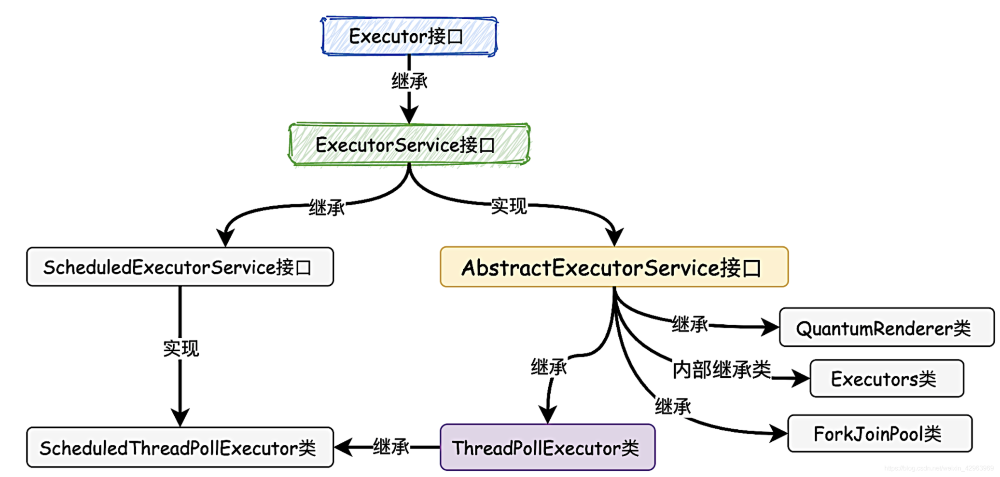

> <font color=SlateBlue>  <u>**Q1. Executor接口、ExecutorService接口 和 Exexutors的区别 ？**</u></font>
>&emsp;  <font color=green>● Executor：Executor 是一个抽象层面的核心接口，主要是将任务 Task本身和执行任务分离，解耦合。</font>
>&emsp;  <font color=green>● ExecutorService：ExecutorService 接口继承了 Executor 接口，对 Executor 接口进行了扩展，并返回 `Future 对象`，为线程池终止，关闭线程池等提供操作方法。</font>`Future 对象`提供了**异步执行**，因此只要提交需要执行的任务，无需等待结果，在需要时通过`Future.isDone() 方法`检查 Future 是否执行完成。如果执行完成，就可以通过 `Future.get() 方法`获得执行结果。<font color=orange>**注意:** `Future.get() 方法`是一个阻塞式的方法，如果调用时任务还没有完成，会阻塞等待，直到任务执行结束。因此在获取结果前，先通过`Future.isDone() 方法`检查任务是否执行完成。</font>
>&emsp;  <font color=green>● Executors 类提供工厂方法用来创建不同类型的线程池。</font>如: `newSingleThreadExecutor()` 创建一个只有一个线程的线程池，`newFixedThreadPool(int numOfThreads)`来创建固定线程数的线程池，`newCachedThreadPool()`可以根据需要创建新的线程，但如果已有线程是空闲的会重用已有线程。

##### 1.  线程池状态 - 生命周期管理

&emsp; &emsp; Java的**线程池**共有5种运行状态，其运行状态的流转如图所示：


&emsp; &emsp;  线程池运行的状态，由内部来维护。线程池内部<font color=red>**使用一个变量维护两个值**：`运行状态(runState)`和`线程数量(workerCount)`</font>。其存储结构如下图所示：


##### 2.  线程池 - 任务执行过程

&emsp;&emsp;线程池的任务是处理问题的基本"单元"，就像需要搬运的货物，只有合理使用对任务进行管理，才能保证线程池的高效运行。线程池任务的执行过程主要分为4个部分：**任务分配(调度)**，**任务缓存**，**任务获取**，**任务拒绝**。

&emsp;&emsp;● **任务分配：** 任务分配是线程池的”入口“，当用户提交了一个任务，线程池会根据当前状态对任务进行分配，缓存或者拒绝。线程池任务的分配(调度)都是由`execute()` 方法完成的。任务调度的执行过程如下：
&emsp;&emsp; ① 检测线程池运行状态，如果不是`RUNNING`，则直接拒绝任务； 
&emsp;&emsp; ② 判断`workerCount (工作线程) < corePoolSize (核心线程数量)`，则创建并启动一个线程来执行新提交的任务; &emsp;&emsp; ③ 如果`workerCount (工作线程) >= corePoolSize (核心线程数量)`，且线程池内的阻塞队列未满，则将任务添加到该阻塞队列中；
&emsp;&emsp; ④ 如果`workerCount (工作线程) >= corePoolSize (核心线程数量) && workerCount (工作线程) < maximumPoolSize (最大线程数量)`，且线程池内的阻塞队列已满，则创建并启动一个线程来执行新提交的任务；
&emsp;&emsp; ⑤ 如果` workerCount (工作线程) >= maximumPoolSize (最大线程数量)`，并且线程池内的阻塞队列已满,则抛出异常，拒绝该任务。


&emsp;&emsp;**● 任务缓存：** 在任务分配过程中，当`workerCount (工作线程) >= corePoolSize (核心线程数量)`，且线程池的**阻塞队列**未满时，则将任务添加到该阻塞队列中。阻塞队列在队列为空时，获取元素的线程会等待队列变为非空。当队列满时，存储元素的线程会等待队列可用。<font color=red>利用阻塞队列的特性实现生产者消费者模型，保证了任务和工作线程两者解耦。</font>


> <font color=SlateBlue>  <u>**Q1. 线程池为什么要使用阻塞队列作为缓存，而不使用普通队列 ？**</u></font>
>&emsp;  ● 线程池创建线程需要获取`mainlock`全局锁，影响并发效率，如果采用普通队列，可能会导致没有及时入队，而使得任务丢失。而阻塞队列可以很好的缓冲。
>&emsp;  ● 阻塞队列主要是用于生产者-消费者模型。如果使用非阻塞队列，它不会对当前线程产生阻塞，就必须额外地实现同步策略以及线程间唤醒策略。
><font color=SlateBlue>  <u>**Q2. 在线程池自定义队列中，为什么不能使用无界队列 ？**</u></font>
>&emsp;   如果采用无界队列，当 `WorkerCount == corePoolSize` 时，会不断的将任务加入到队列中。同时由于队列无界，就无法使队列满队，从而无法创建新的Worker，会直接导致最大线程数的配置失效，实际使用的线程数的最大值始终是 `corePoolSize` ，即便设置了 `maximumPoolSize` 也没有生效。当任务过大过多时，可能会导致系统的资源耗尽。 要用上 `maximumPoolSize`，允许在核心线程满负荷下，继续创建新线程来工作 ，就需要选用有界任务队列。

&emsp;&emsp;**● 任务获取：** 线程获取任务有两种可能： &emsp; &emsp; ① 当线程是新创建的工作线程时，则获取的任务为<font color=orange> **firstTask**</font>。
&emsp; &emsp; ② 当线程执行完<font color=orange> **firstTask**</font> 任务后，再次获取任务时，需要从任务缓存中获取任务并执行，从缓存中获取任务是由`getTask()`方法完成的，其`getTask()`方法的流程如下图所示：


&emsp;&emsp;**● 任务拒绝：** 任务拒绝是为了保护线程池，防止系统的资源被耗尽。当线程池的任务缓存队列已满，并且线程池中的工作线程数目 `workerCount >= maximumPoolSize`时，就需要采取任务拒绝策略，拒绝掉该任务，保护线程池。Java中设置了4种拒绝策略，如下图所示，同时用户可以通过实现 `RejectedExecutionHandler` 接口去定制拒绝策略。


##### 3.  线程池 - Worker线程

&emsp;&emsp;如果将线程池任务比作货物，则`Worker`线程就是运送货物的车辆。`Worker`线程是完成任务的“工具”和基础。

&emsp; &emsp;**● Worker线程管理：**
&emsp;&emsp; 线程池对Worker线程的管理使用一张**`HashSet<Worker>`**表去持有线程的引用，可以通过添加引用、移除引用来控制线程的生命周期。 &emsp;&emsp; 对单个Worker线程进行具体分析：Worker线程实现了Runnable接口，并包含一个线程Thread、一个初始化任务 firstTask。Thread是在调用构造方法时通过`ThreadFactory`来创建的线程；`firstTask`用它来保存传入的第一个任务。如果`firstTask != null`，那么该线程会在启动时立即执行firstTask任务，对应的Worker线程为核心线程；如果`firstTask == null`，那么该线程会通过`getTask()`方法获取并执行任务列表(workQueue)中的任务，对应的Worker线程为非核心线程。


&emsp;&emsp; 在 Worker线程中，通过继承AQS实现了独占锁，实现了通过不可重入的特性去表示线程现在的执行状态。 
&emsp;&emsp; ★ 当Worker线程获得独占锁，则表示当前线程正在执行任务中，此时该Worker线程不能被中断。 
&emsp;&emsp; ★ 当该Worker线程不是独占锁的状态，说明它没有在处理任务，这时可以对该线程进行中断。
&emsp;&emsp; ★ 线程池在执行`shutdown`方法或`tryTerminate`方法时会调用`interruptIdleWorkers`方法来中断空闲的线程，`interruptIdleWorkers`方法会使用`tryLock`方法来判断线程池中的线程是否是空闲状态，如果线程是空闲状态则可以安全回收。

&emsp; &emsp;**● Worker线程申请 (新增)：**
&emsp; &emsp; Worker线程的新增是通过`addWorker(Runnable firstTask, boolean core)`方法。`addWorker() `方法有两个参数，firstTask参数用于指定新增的线程执行的第一个任务，该参数可以为空；core参数为true时表示在新增线程时会判断`WorkerCount < corePoolSize`，false表示新增线程前需要判断`WorkerCount < maximumPoolSize`。


&emsp; &emsp;**● Worker线程执行任务：**
&emsp; &emsp; 在Worker类中的`run()`方法调用了`runWorker()`方法来执行任务。在`runWorker()`中 Worker线程会在while循环中不断的通过getTask()方法从阻塞队列中获取任务。如果 `getTask() == null` 时，则会跳出循环，执行`processWorkerExit()`进行线程回收和销毁。如果此时线程池处于正在停止状态，则当前Worker线程须处于中断状态，否则要保证当前Worker线程不是中断状态。


&emsp; &emsp;**● Worker线程回收 与 线程池终止状态：**
&emsp; &emsp; Worker线程的回收与线程池的终止状态改变密不可分。 
&emsp; &emsp; 由于引起线程销毁的可能性有很多，线程池还要判断是什么引发了这次销毁，是否要改变线程池的现阶段状态，是否要根据新状态，重新分配线程。具体分为**不调用`shutdown() - processWorkerExit()`** 、**调用`shutdown()`** 和 **调用`shutdownNow()`** 三种情况：


&emsp; &emsp;① **不调用`shutdown() - processWorkerExit()`:**
&emsp; &emsp; 该情况下，线程池处于`RUNNABLE`状态，**此时线程池的主要工作是维护一定数量的核心线程引用，防止这部分核心线程被JVM回收，同时将大于`corePoolSize`的`Worker线程`进行回收。**
&emsp; &emsp; `runWork()`方法会维护一个while循环，不断获取任务，若不为空，执行任务；若取不到任务，执行`processWorkerExit()`; 把工作线程移除掉。如果如果移除工作线程后 `WorkerCount < corePoolSize` ，则创建一个新的工作线程来代替移除的工作线程，以维持`workerCount = corePoolSize`。


&emsp; &emsp;② **调用`shutdown() `:**
&emsp; &emsp; 调用`shutdown()`关闭线程池后，线程池状态被设置为`SHUTDOWN`。此时无论是核心线程还是非核心线程，所有工作线程都会被销毁。调用shutdown()之后，会向所有的空闲工作线程发送中断信号。对于正在处理任务的Worker，当阻塞队列中的任务执行完成后，原本的Worker会阻塞。由于此时线程池状态为`SHUTDOWN`，且`workerCount != 0`，此时每当唤醒一个阻塞的工作线程，中断并回收该线程，同时会遍历剩余的所有工作线程，并随机中断一个空闲的工作线程去传播中断信号，直到所有的线程被中断回收。


&emsp; &emsp;③ **调用`shutdownNow() `:**
&emsp; &emsp; `shutdownNow()`方法将会把线程池状态设置为STOP，然后中断所有线程(包括工作线程)，最后取出工作队列中所有未完成的任务返回给调用者。

#### 2.6.3 线程池配置与动态参数配置

&emsp; &emsp;要合理的配置线程池，就必须对任务特性进行分析，可以从以下几个角度进行分析： 
&emsp; &emsp;① 任务的性质: CPU密集型任务，IO密集型任务以及混合型任务 &emsp;&emsp;&emsp;**● CPU密集型任务:** 主要是执行计算任务，响应时间很快，CPU一直在运行，CPU利用率很高，应配置数量较小的线程应配置尽可 能小的线程数，如CPU核心数+1
&emsp;&emsp;&emsp;**● IO密集型任务:** 并不是一直在执行任务，会存在大量的阻塞。在单线程上的IO密集型任务会导致浪费大量的CPU运算能力浪费在 等待，这种任务应配置尽可能多的线程应该配置尽可能大的线程数，如2*CPU核心数+1 
&emsp; &emsp;② 任务的优先级:高中低，
&emsp; &emsp;③ 任务的执行时间: 长中短 
&emsp; &emsp;④ 任务的依赖性: 是否依赖其他系统资源

#### 2.6.4 线程池应用

&emsp; &emsp; ● 快速响应用户请求：用户发起的实时请求，服务追求响应时间。比如说用户要查看一个商品的信息，那么我们需要将商品维度的一系列信息如商品的价格、优惠、库存、图片等等聚合起来，展示给用户。这种场景最重要的就是获取最大的响应速度去满足用户，所以应该不设置队列去缓冲并发任务，调高corePoolSize和maxPoolSize去尽可能创造多的线程快速执行任务。

&emsp; &emsp; ● 快速处理批量任务：离线大量计算任务，需要快速执行。与响应速度优先的场景区别在于，这类场景任务量巨大，并不需要瞬时的完成，而是关注如何使用有限的资源，尽可能在单位时间内处理更多的任务，也就是吞吐量优先的问题。所以应该设置队列去缓冲并发任务，调整合适的corePoolSize去设置处理任务的线程数。


#### 2.6.5 线程池监控

### 2.7 Java 集合容器

&emsp;&emsp; 在Java中，数组不是面向对象的，存在明显的缺陷。集合弥补了数组的缺点，比数组更灵活更实用，而且不同的集合框架类可适用不同场合。Java集合类存放在java.util包中，是一个用来存放对象的容器。集合的特性主要有以下几点：
&emsp; &emsp; ① 集合只能存放对象，如果存入一个基本数据类型，其会自动转换成包装类。 
&emsp; &emsp; ② 集合存放的都是对象的引用，而非对象本身，对象本身还是在堆内存当中。

> <font color=SlateBlue>  <u>**Q1. 数组与集合有什么区别与相似之处？**</u></font>
>&emsp;&emsp; ① 内容区别：数组能存放基本数据类型和对象，而集合类存放的都是对象，集合类不能存放基本数据类型。数组和集合存放的对象皆为对象的引用地址。
>&emsp;&emsp; ② 长度区别：数组的长度在初始化时被固定而无法动态改变，集合类的容量是动态改变的。
>&emsp;&emsp; ③ 存在形式区别：集合以类的形式存在，具有封装、继承、多态等类的特性，提高了软件的开发效率

#### 2.7.1  Java集合框架

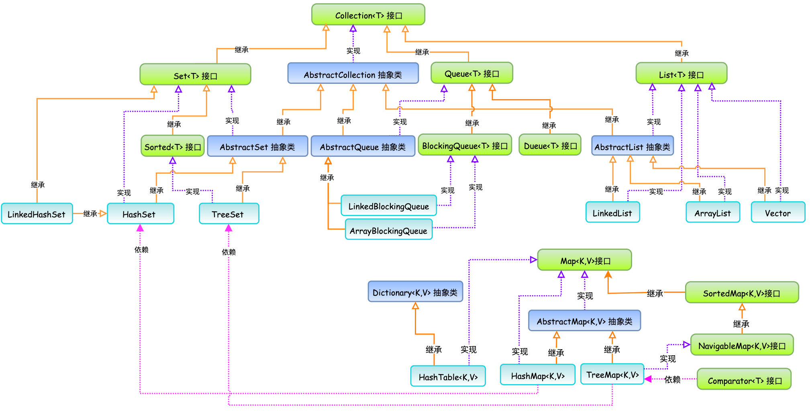

#### 2.7.2  *Collection*集合及其子类

&emsp;&emsp; *Collection* 接口是 *java* 集合类的顶级接口之一，**包含了集合的基本操作和属性**。 *Collection* 接口有3种子类型集合:  ***List*** 、***Set*** 和 ***Queue***。

```java
// Collection接口定义的基本方法如下：
1、添加方法
 boolean add(Object obj)	  	// 添加一个对象
 boolean addAll(Collection c) // 添加一个集合的对象
2、删除方法
 void clear() 								// 移除所有对象
 boolean remove(Object)				// 移除一个对象
 boolean removeAll(Collection c) // 移除一个集合的对象，只要有一个对象移除了，就返回true
3、判断方法
 boolean contains(Object o) 		   // 判断集合是否包含该对象
 boolean containsAll(Collection c) // 判断集合中是否包含指定的集合对象，只有包含所有的对象，才返回 true。
 boolean isEmpty() 								 // 判断集合是否为空。
4、获取方法
 Iterator<E> iterator() 					 // 迭代器
5、长度功能
 int size() 											 //	对象个数
6.交集功能
 boolean retainAll(Collection c) 	 // 移除此Collection中未包含在指定Collection中的所有对象
```

##### <font color=Sienna>**1. *List* 集合**</font>

&emsp;&emsp;`List<T>`接口继承于`Collection`接口，它定义一个允许重复的有序集合。`List<T>`接口所代表的是有序的`Collection`，它用某种特定的插入顺序来维护元素顺序。可以对列表中每个元素的插入位置进行精确地控制，同时可以根据元素的整数索引(在列表中的位置)访问元素，并搜索列表中的元素。实现`List<T>`接口的集合主要有：`ArrayList`、`LinkedList`、`Vector`、`Stack`。

###### <font color=fpurple>**(1). ArrayList**</font>

&emsp;&emsp; `ArrayList`底层是通过`Object`对象数组的数据结构来实现的。`ArrayList`初始化时，如果指定了容器大小，则按照指定的大小进行容器初始化，<font color=green>如果没有指定容器的大小，则会首先创建一个空的容器，当该容器第一次添加数据时，会设置容器的大小`Capacity=10`</font>。每当执行 `add`，`insert`等添加元素的方法，都会检查内部数组的容量是否足够。<font color=red>当容量不足时，它就会以**当前容量的1.5倍**来重新构建一个数组，将旧元素Copy到新数组中，然后丢弃旧数组</font>。`ArrayList`的数组扩容是影响其效率的重要因素之一。例如一个有150个元素的数据动态添加到一个以默认10个元素大小创建的ArrayList中，将会经过10次的扩容才会满足最终的要求，那么如果一开始就以 `ArrayList List = new ArrayList(160);`的方式创建`ArrayList`，不仅会减少10次数组创建和Copy的操作，还会减少内存使用。


&emsp;&emsp; <font color=red>**注：ArrayList实现不是同步的**</font>。如果多个线程同时访问一个ArrayList实例，而其中至少一个线程修改了列表，那么该列表必须保持**外部同步**。为了保证同步，最好的办法是在列表创建时完成，以防止意外对列表进行不同步的访问。`List list = Collections.synchronizedList(new ArrayList());`

```java
// ArrayList的遍历方式
ArrayList支持的4种遍历方式:
1. 通过迭代器遍历
Integer value = null;
Iterator iter = list.iterator();
while (iter.hasNext()) {
    value = (Integer)iter.next();
}

2. 随机访问，通过索引值遍历
for (int i=0; i<list.size(); i++) {
    value = (Integer)list.get(i);        
}

3. 通过for循环遍历
for (Integer integ:list) {
    value = integ;
}

4. 通过forEach + lambda 循环遍历,由于通过forEach进行遍历时，item为临时变量，因此不能对item进行修改操作
	 forEach只有在"只读方式"时才适用
list.forEach(item -> {
  item.hashCode();
});

// ArrayList的删除数据方式
虽然ArrayList有四种遍历方式，但是能够正确删除数据的方式只有两种：①通过迭代器进行删除；② 倒序循环删除
1. 通过迭代器删除数据
Iterator<String> iter = list.iterator();
while (iter.hasNext()) {
    iter.next().hashCode();
    iter.remove();
}

2. 倒序循环删除数据
for(int i = list.size()-1;i>=0;i--){
   list.remove(i);
}
```

###### <font color=fpurple>**(2). LinkedList**</font>

&emsp;&emsp;LinkedList是一个继承于`AbstractSequentialList`的双向链表，因此其**顺序访问会非常高效，而随机访问效率比较低**。它也可以被当作堆栈、队列或双端队列进行操作。LinkedList的数据结构如下图所示:


&emsp;&emsp; 虽然LinkedList是双向链表，但在LinkedList底层通过**计数索引值**建立了“**索引值与双向链表的关系**”，使得LinkedList也可以像ArrayLIst一样根据索引来进行数据操作。当LinkedList查找索引对应的节点时，会首先根据入参的索引值与双向链表长度的1/2进行对比，小于1/2时，从头结点开始遍历，大于1/2时，从尾节点开始遍历。

```java
//LinkedList作为“栈”使用时的操作：
addFirst(e)，removeFirst()，peekFirst()
//LinkedList作为“队列”使用时的操作：
addLast(e)，offerLast(e)，removeFirst()，pollFirst()，getFirst()，peekFirst()
  
//LinkedList支持多种遍历方式：
1. 通过迭代器遍历。即通过Iterator去遍历。
for(Iterator iter = list.iterator(); iter.hasNext();)
    iter.next();

2. 通过快速随机访问遍历LinkedList
for (int i=0; i<list.size(); i++) {
    list.get(i);        
}

3. 通过forEach循环来遍历LinkedList
for (Integer item : list){}

4. 通过pollFirst()来遍历LinkedList
while(list.pollFirst() != null){}

5. 通过pollLast()来遍历LinkedList
while(list.pollFirst() != null){}

6. 通过removeFirst()来遍历LinkedList
try {
    while(list.removeFirst() != null) {}
} catch (NoSuchElementException e) {}

7. 通过removeLast()来遍历LinkedList
try {
    while(list.removeLast() != null) {}
} catch (NoSuchElementException e) {}
```

###### <font color=fpurple>**(3). Vector**</font>

&emsp;&emsp;Vector底层是用数组实现的，其容量与ArrayList一样是可以动态扩展的，不同的是<font color=green>**Vector支持线程的同步，即某一时刻只有一个线程能够写Vector，避免多线程同时写而引起的不一致性，所以Vector是线程安全的**</font>。因为Vector类中每个方法中都添加了`synchronized`的关键字来保证同步，使得它的效率大大的降低了，比ArrayList的效率要慢，因此一般情况下都不使用Vector对象，而会选择使用ArrayList。

##### <font color=Sienna>**2. *Set* 集合**</font>

&emsp;&emsp; Set继承于Collection接口，是一个不允许出现重复元素，并且无序的集合，主要有HashSet和TreeSet两大实现类。

###### <font color=fpurple>**(1). HashSet**</font>

&emsp;&emsp; HashSet继承与`AbstractSet<E>`抽象类，是一个**没有重复元素的集合**。HashSet的底层数据结构是哈希表HashMap，**不保证元素的顺序**，而且**HashSet允许使用 null 元素**。HashSet按Hash算法来存储集合中的元素，因此具有很好的存取和查找性能。HashSet的特点如下： 
&emsp; &emsp; ● HashSet不能保证元素的排列顺序，顺序可能与添加顺序不同。
&emsp; &emsp; ● HashSet不是同步的，如果多个线程同时访问一个HashSet必须保证外部同步，否则会存在线程安全问题。 
&emsp; &emsp; ● 集合元素值可以是null。


&emsp;&emsp; 在HashSet插入对象的过程如下：当调用`add(object)`方法往集合里添加元素时，本质上调用的是`HashMap`的`put(Key,Value)`方法，将插入对象作为Key，Value为静态的Object对象，HashMap中所有节点的value均指向静态的Object对象，因此也不存在空间浪费的问题。
> <font color=SlateBlue>  <u>**Q1. 为什么不直接使用数组，而用HashSet呢 ?**</u></font>
>&emsp;&emsp; 数组的索引是连续的而且数组的长度是固定的，无法自由增加数组的长度。而HashCode表用每个元素的hashCode值来计算其存储位置，从而可以自由增加HashCode的长度，并根据元素的hashCode值来访问元素，而不用一个个遍历索引去访问，因此HashSet的访问速度要比数据快。

##### <font color=Sienna>**3. *Queue* 集合**</font>

&emsp;&emsp; Queue是先入先出的数据结构，每次插入元素都是插入在队列尾，每次取出元素都是在队列头取出。`Queue<T>接口`继承与`Colloection<T>接口`。


```java
1. 向队列末尾新添加元素
    boolean add(E e);		// 返回true表示添加成功,添加失败直接抛出IllegalStateException异常。
    boolean offer(E e); // 向队列末尾新添加元素，返回true表示添加成功，返回false，添加失败
2. 去除队头第一个元素
    E remove(); 	// 删除队列第一个元素，如果队列是空的，这个方法会抛出NoSuchElementException异常。
    E poll();			// 删除队列第一个元素(即队列头)，如果队列是空的，即队列头是null，它不会抛出异常，而是会返回null。
3. 查看元素
    E element();	 // 查看队列头的元素，如果队列是空的，就抛出异常
    E peek();			 // 查看队列头的元素。如果队列是空的，不会抛出异常，而是返回null
```

###### <font color=fpurple>**(1). BlockingQueue接口(阻塞队列) **</font>

&emsp;&emsp; 阻塞队列BlockingQueue接口继承于Queue接口，当队列已满的时候或当队列为空的时候，当前线程会阻塞等待。阻塞队列常用于<font color=green>**生产者和消费者**</font>的场景，生产者是往队列里添加元素的线程，消费者是从队列里拿元素的线程。阻塞队列就是生产者存放元素的容器，而消费者也只从容器里拿元素。BlockingQueue接口方法在原有Queue接口方法的基础上进行了扩充：

```java
1. 向队列末尾新添加元素
    boolean add(E e);		// 返回true表示添加成功,添加失败直接抛出IllegalStateException异常。
    boolean offer(E e); // 向队列末尾新添加元素，返回true表示添加成功，添加失败返回false。
		boolean put(E e); 	// 向队列末尾新添加元素，返回true表示添加成功，添加失败时会一直阻塞。
		boolean offer(e,time,unit);  //// 向队列末尾新添加元素，返回true表示添加成功，添加失败时，等待time时间，超时后退出
2. 去除队头第一个元素
    E remove(); 	// 删除队列第一个元素，如果队列是空的，这个方法会抛出NoSuchElementException异常。
    E poll();			// 删除队列第一个元素，如果队列是空的，即队列头是null，它不会抛出异常，而是会返回null。
		E take();			// 删除队列第一个元素, 如果队列是空的，则会一直阻塞。
		E poll(time,unit); // 删除队列第一个元素, 如果队列是空的，则会等待time时间，超时后退出。
3. 查看元素
    E element();	 // 查看队列头的元素，如果队列是空的，就抛出异常
    E peek();			 // 查看队列头的元素。如果队列是空的，不会抛出异常，而是返回null
```

&emsp;&emsp;阻塞队列主要有以下实现类：

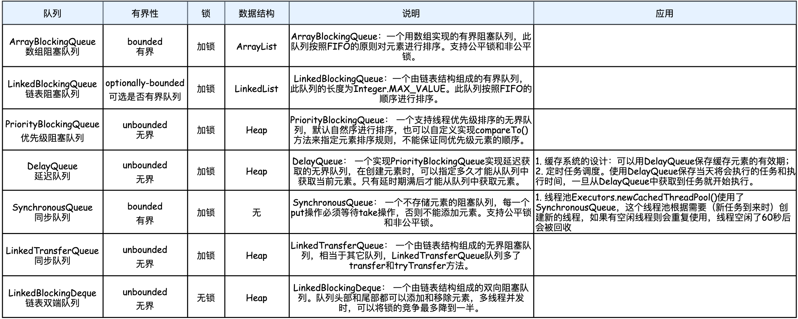

<font color=#a40fff>▶  **PriorityBlockingQueue 优先级队列：**</font>

&emsp;&emsp; `PriorityBlockingQueue`的特点如下： 
&emsp; &emsp; ● `PriorityBlockingQueue`是一个无界的阻塞队列，队列的长度受内存到限制，其内部的数据结构实现是数组。`PriorityBlockingQueue`是线程安全（添加、读取都进行了加锁）
&emsp; &emsp; ● `PriorityBlockingQueue`是**线程安全**的，队列的添加、读取都进行了加锁 
&emsp; &emsp; ● `PriorityBlockingQueue` 排序是通过<font color=green>**最小堆**</font>实现的，默认情况下元素采取自然顺序升序排列，也可以自定义实现`compareTo()`方法来指定元素排序规则。<font color=green>`PriorityBlockingQueue`在入队操作之后并不会立即进行排序调整，**只有在出队时，出队顺序是按照优先级大小进行出队。**</font>所谓的堆排序，其本质是利用堆来得到最大元素或最小元素进行依次输出的方式。**堆是一种利用完全二叉树的结构及其性质一维数组**，<font color=orange>注意，为了使该一维数组能够利用完全二叉树的性质，数组中索引0(vec[0])是不放入任何元素的。</font>


<font color=a40fff>▶  **DelayQueue 延迟队列：**</font>

&emsp;&emsp;`DelayQueue`的特点如下： 
&emsp; &emsp; ● `DelayQueue`是一个没有边界`BlockingQueue`，<font color=green>**加入其中的元素必需实现Delayed接口。**</font>
&emsp; &emsp; ● 当生产者线程加入元素时，会触发`Delayed`接口中的`compareTo`方法进行排序，队列中元素的顺序是按到期时间排序的，而非它们进入队列的顺序。排在队列头部的元素是最早到期的，越往后到期时间赿晚。
&emsp; &emsp; ● 对于`DelayQueue`队列，其消费者线程的数量要够，处理任务的速度要快。否则，队列中的到期元素无法被及时取出并处理，会造成任务延期、队列元素堆积等情况。


&emsp; &emsp; ● DelayQueue是Leader-Followr模式的变种，消费者线程处于等待状态时，总是等待最先到期的元素，而不是长时间的等待。消费者线程尽量把时间花在处理任务上，最小化空等的时间，以提高线程的利用效率。


```java
// DelayQueue，加入其中的元素必需实现Delayed接口
public class Item implements Delayed {  
    private String name;
    private Long time;
		// 省略getter()和setter()
  
    public Item(String name, long time, TimeUnit unit) {
        this.name = name;
        this.time = System.currentTimeMillis() + (time > 0? unit.toMillis(time): 0);
    }

    // getDelay方法的作用即是计算当前时间到执行时间之间还有多长时间。
    @Override
    public long getDelay(TimeUnit unit) {
        return time - System.currentTimeMillis();
    }

    // compareTo方法的作用即是判断队列中元素的顺序谁前谁后。
    // 当前元素比队列元素后执行时，返回一个正数，比它先执行时返回一个负数，否则返回0.
    @Override
    public int compareTo(Delayed o) {
        Item item = (Item) o;
        long diff = this.time - item.time;
        if (diff <= 0) { return -1; }
      	else { return 1; }
    }
}
public static void main(String[] args){
 		Item item1 = new Item("a",10,TimeUnit.SECONDS);  	//item1 延时10s后到期
    Item item2 = new Item("ab",2,TimeUnit.SECONDS);	 	//item2 延时2s后到期
    Item item3 = new Item("abc",4,TimeUnit.SECONDS); 	//item3 延时4s后到期
    DelayQueue<Item> delayQueue = new DelayQueue<Item>();
    delayQueue.put(item1);delayQueue.put(item2);delayQueue.put(item3);
    System.out.println("begin time:" + LocalDateTime.now());
    for (int i = 0; i < 3; i++) {
        Item take = delayQueue.take();
        System.out.format("name:{%s}, time:{%s}\n",take.getName(), LocalDateTime.now());
    }
}

--Output--
	begin time:2021-11-27T20:22:26.193
	name:{ab}, time:{2021-11-27T20:22:28.126} - item2最先过期
	name:{abc}, time:{2021-11-27T20:22:30.126} - item3其次过期
	name:{a}, time:{2021-11-27T20:22:36.126} - item1最后过期
```

<font color=a40fff>▶  **SynchronusQueueed队列：**</font>

<font color=a40fff>▶  **LinkedtransferQueue队列：**</font>

#### 2.7.3 *Map*集合

&emsp;&emsp;Map是一种键-值对(key-value)集合，Map集合中的每一个元素都包含一个键对象和一个值对象。其中，键对象不允许重复，而值对象可以重复。Map接口主要有两个实现类：HashMap类和TreeMap类。其中，HashMap类按哈希算法来存取键对象，而TreeMap类可以对键对象进行排序。Map集合的架构如下图所示：


```java
// Map接口定义的基本方法如下：
1.添加
	V put(K key, V value) 			//可以相同的key值，但是添加的value值会覆盖前面的，返回值是前一个，如果没有就返回null
  putAll(Map<? extends K,? extends V> m)  //从指定映射中将所有映射关系复制到此映射中（可选操作）。
2.删除
	remove()    //删除关联对象，指定key对象
	clear()  		//清空集合对象
3.获取
  value get(key); 	//可以用于判断键是否存在的情况。当指定的键不存在的时候，返回的是null。
4.判断：
	boolean isEmpty()  									//长度为0返回true否则false
  boolean containsKey(Object key)  		//判断集合中是否包含指定的key
  boolean containsValue(Object value) //判断集合中是否包含指定的value
5、长度：
	int size（）
```

##### <font color=Sienna>**1. *HashMap* 集合**</font>

&emsp;&emsp; HashMap的主干是一个`Node<K,V>[]`数组。`Node<K,V>[]`是HashMap的基本组成单元，每一个`Node<K,V>`包含一个key-value键值对，HashMap的数据结构如下图所示，HashMap由数组+链表组成的，数组是HashMap的主体，链表是主要为了解决哈希冲突而存在的。<font color=red>**HashMap中数组的size必须是 2 的整数次幂。**</font>


&emsp;&emsp; HashMap插入对象的处理过程如下：
&emsp; &emsp; ① 每个对象都会通过hashCode()方法生成一个Hash值(散列码)。
&emsp; &emsp; ② 在对HashMap插入对象和查询对象时检查插入对象和查询对象的Hash值是否已经存在，如果Hash值不存在则在添加到HashMap中。 &emsp; &emsp; ③ 如果Hash值存在则会调用equals()方法判断插入对象和查询对象在HashMap中是否有相等的key(键)，如果在HashMap中有相等的键，那么就会用新的Value替换掉老的Value,并返回老的Value。如果没有相等的键，则创建一个`Node<K,V>`节点，插入到链表中。
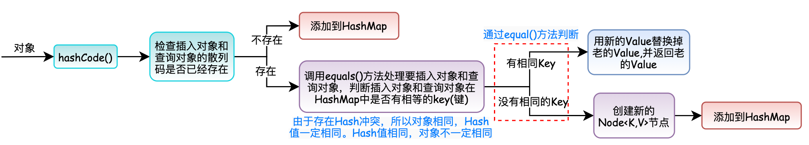

> <font color=SlateBlue>  <u>**Q1. HashMap 中数组的size 为什么必须是 2 的整数次幂 ？**</u></font>
> &emsp;&emsp; <font color=red>**HashMap中数组的size必须是2的幂，是为了使每一个桶发生哈希冲突的概率相同，从而避免某些桶大量发生哈希冲突，而某些桶不发生哈希冲突的情况，浪费资源。**</font>
> &emsp;&emsp; 在HashMap中，一个Key要找到其存储的索引位置分为以下三步：
> &emsp;  &emsp;  <font color=green>① 调用hashCode(),获取Key的Hash值。`hash=key.hashCode()`</font>
> &emsp;  &emsp;  <font color=green>② 将获得的 [hash值] 与 [hash右移的值] 进行异或。`hash = hash^(hash>>>16)`</font>
> &emsp;  &emsp;  <font color=green>③ 将第二步的 [hash值] 与 [HashMap的数组长度减一] 进行与操作。`(n-1)&hash` </font>
> &emsp;&emsp; 从上面的第三步可以看出，当HashMap的数组长度n为2的幂时，其n-1的二进制每一位均是1。如果数组长度n不为2的幂时，则n-1的二进制可能有的位为0，则会导致与hash值进行与操作时，数组索引的某些值永远无法取到，导致某些桶不发生哈希冲突而某些桶大量发生哈希冲突。
>
> ```java
> // 测试不同HashMap数组长度下，Hash冲突的均匀性
> HashMap<Integer, Integer> map = new HashMap<>();
> //循环创建100个不同的对象，调用hashCode()方法
> for (int i = 0; i <100; i++) {
>    int h=0;
>    Integer key = i;   //创建不同的对象
>    int hash1=(h = key.hashCode()) ^ (h >>> 16);  //源码中计算hash值的两步
>    int hash=(n-1)&hash1;				//这里n为数组长度
>    if(map.containsKey(hash)){
>        int m=map.get(hash)+1;  //map中如果存在这个key，则value+1,否则加入map，value为1
>        map.put(hash,m);
>    }else{
>        map.put(hash,1);
>    }
> }    
> map.forEach((m,n)-> System.out.println("key:"+m+"\t"+"value:"+n));  //遍历结果
> --Output--
> 当n=4时，[key:0	value:26 | key:1	value:26 | key:4	value:24 | key:5	value:24] 哈希冲突均匀的分布在每个数组中
> 当n=5时，[key:0	value:52 | key:4	value:48] 虽然数组变多了，但哈希冲突仅分布在了其中两个索引当中
> ```
>
> <font color=SlateBlue>  <u>**Q2. HashMap在计算hash值时为什么要右移16位 ？**</u></font>
> &emsp;&emsp; 由于hashCode()计算出的hash值时32位的int类型，而通常HashMap的数组长度不会很长，**为了使hash值尽可能的散列，在计算hash值时，将hash值右移16位，[右移16位后的高位值]与[原hash值低位值]进行异或操作(使高位与低位同时参与了运算)，增加了hash值的散列程度。**
>
> <font color=SlateBlue>  <u>**Q3. HashMap的key为自定义对象时为什么需要同时重写equals和hashCode方法 ？**</u></font>
>
> ```java
> //首先看一个问题：
> @Data
> public class User {
>        private String userName;
>        private String orderNo;
>        public User(String name,String id){
>            this.userName = name;
>            this.orderNo = id;
>        }
> }
> public static void main(String[] args){
>        HashMap<User,String> map = new HashMap<>();
>        map.put(new User("xzz","1"),"user1");  // line 1
>        map.put(new User("test","2"),"user2"); // line 2
>        map.put(new User("xzz","1"),"user4");	// line 3
>        System.out.println(map.get(new User("xzz","1")));
> }
> --Output--
> 这里会出现两个问题：
>   1. line3的Key虽然和line1的Key相同，但并不会line1的值覆盖
>   2. 最后输出的结果既不等于line1的值，也不等于line3的值

> &emsp;&emsp; 根据HashMap插入数据的处理过程可以知道，在HashMap中查找key的过程需要`hashCode()`和`equal()`两个方法，如果一个HashMap的Key为自定义对象时，则默认会调用Object类的`hashCode()`和`equal()`方法，而在Object中，HashCode的计算方法是根据对象的地址进行计算的，因此每次new的对象即使参数相同，其对象地址也是不相同的。因此，如果要以自定义对象作为Key时，需要同时重写`hashCode()`和`equal()`两个方法。
>
> ```java
> 【举个栗子 🌰】
> @Data
> public class User {
> private String userName;
> private String orderNo;
> public User(String name,String id){
>     this.userName = name;
>     this.orderNo = id;
> }
>  //对比时需要对比类中的每一个字段的值是否相同
>  @Override
>  public boolean equals(Object o){
>      if(this == o){
>          return true;
>      }
>      if(o == null || getClass() != o.getClass()){
>          return false;
>      }
>      User person = (User) o;
>      if (userName != null ? !userName.equals(person.userName) : person.userName != null){
>          return false;
>      }
>      if (orderNo != null ? !orderNo.equals(person.orderNo) : person.orderNo != null){
>          return false;
>      }
>      return true;
>  }
> 
> 	//将类中的每个字段的hash值的和作为整个类的hash值，可以保证类的hash值的散列性
>  @SneakyThrows
>  @Override
>  public int hashCode(){
>      Field[] fields = this.getClass().getDeclaredFields();
>      int hash = 0;
>      for(Field field :fields){
>          field.setAccessible( true );
>          if(!Objects.isNull(field.get(this))){
>              hash += field.hashCode();
>          }
>      }
>      return hash;
>  }
> }
> ```

##### <font color=Sienna>**2. *TreeMap* 集合**</font>

&emsp;&emsp; TreeMap集合是基于<font color=green>**红黑树**</font> (Red-Black tree)而实现。该集合最重要的特点就是<font color=red>**可排序**</font>。TreeMap可以根据其键的自然顺序进行排序，或者根据创建映射时提供的 Comparator 进行自定义排序。TreeMap的数据结构如下图所示：


#### 2.7.4 *Iterator* 迭代器

&emsp;&emsp; *Iterator* 是 *java*中的一个接口，核心作用就是用来遍历容器的元素，内部维护了一个int下标指针，表示当前遍历到集合的索引位置。因为容器的实现有多种，不同的容器遍历规则不一样(如 *ArrayList*, *LinkedList*, *HashSet* 等)，因此通过 *Iterator* 接口，让容器本身去实现这个接口，实现里面的方法。*Iterator* 的架构如下图所示：


*Iterator* 接口中有三个核心方法:
&emsp; &emsp; ① `boolean hashNext()`:用于判断 *Iterator* 内是否有下个元素，如果有则返回 *true*，没有则 *false*。
&emsp; &emsp; ② `Object next()`:返回 *Iterator* 的下一个元素，同时指针也会向后移动一位。
&emsp; &emsp; ③ `void remove()`:删除指针的上一个元素。

##### <font color=Sienna>**1. *fail-fast* 机制**</font>

&emsp; &emsp; *fail-fast* 机制是 *java* 集合(*Collection*)中的一种错误检测机制,**且只能被用来检测错误**。当多个线程对同一个集合的内容进行操作时，就可能会产生 *fail-fast* 事件。即：当某一个线程A通过 *iterator* 去遍历某集合的过程中，若该集合的内容被其他线程所改变了（即其它线程通过 *add*、*remove*、*clear* 等方法，改变了 *modCount* 的值)；那么线程A访问集合时，就会抛出 *ConcurrentModificationException* 异常，产生 *fail-fast* 事件。 &emsp; &emsp; *fail-fast* 机制的原理如下，在创建迭代器时 `expectedModCount = modCount`，当集合的索引移动时，首先执行`checkForCOmodification()` 检查`expectedModCount = modCount`，如果不相等则抛出异常。


&emsp; &emsp; 若在多线程环境下使用，建议使用`java.util.concurrent`包下的类取代`java.util`包下的类。

```java
例如：private static List<String> list = new ArrayList<String>();
替换为：private static List<String> list = new CopyOnWriteArrayList<String>();
```

#### 2.7.5 *Stream*流

&emsp; &emsp; *Stream* 不是集合元素，它不是数据结构并不保存数据，它只是数据源(数组、集合)的一种视图，更像一个高级版本的 *Iterator*。原始版本的 *Iterator*，用户只能显式地一个一个遍历元素并对其执行某些操作；高级版本的 *Stream*，用户只要给出需要对其包含的元素执行什么操作，而不需要关心是如何实现的。

> <font color=SlateBlue>  <u>**Q1. *Stream* 流的特性 ？**</u></font>
>&emsp;&emsp; ① *Stream* 流并不存储其元素，它只是某种数据源的一个视图，数据源可以是一个数组，*Java* 容器或 *I/O channel*等。
>&emsp;&emsp; ② *Stream* 流的槽不会改变其数据源，每一个阶段的操作都会对操作的结果生成一个新 *Stream* 流。
>&emsp;&emsp; ③ *Stream* 流的操作是尽可能的惰性执行，并不会立即执行，只有等到用户真正需要结果的时候才会执行。
>
><font color=SlateBlue>  <u>**Q2. *Stream* 流与 *Iterator* 迭代器的区别 ？**</u></font>
>&emsp;&emsp; ① *stream* 可以并行化操作，而 *Iterator* 迭代器只能串行化操作。当使用串行方式去遍历时，每个 *item* 读完后再读下一个item。**而使用并行去遍历时，数据会被分成多个段，其中每一个都在不同的线程中处理，然后将结果一起输出。**
>&emsp;&emsp; ② *stream*不必去遍历整个集合，*Stream* 会隐式地在内部进行遍历，做出相应的数据转换，用户无需关心数据是如何操作的，只需要我们去描述需要做什么操作即可。而 *Iterator* 迭代器需要用户自己对集合中数据进行操作。
>
><font color=SlateBlue>  <u>**Q3. 为什么需要 *stream* ?**</u></font> 
>&emsp;&emsp; *stream* 作为Java8的一大亮点，它不同与 *java.io* 包里的 *InputStream* 和 *OutputStream* 。它也不同于 *StAX* 对 *XML* 解析的*stream*。<font color=green>*Stream*是对容器对象功能的增强，它针对与容器对象进行各种高效的`聚合操作(aggregate operation)`，或者大批量数据操作</font>。同时*Stream API*借助于 *Lambda* 表达式，极大的提高编程效率和程序可读性。

```java
【举个栗子 🌰】
例如：求出以字母A开头的字符串的最大长度。
  int longest = 0;
  for(String str : strings){
      if(str.startsWith("A")){// 1. filter(), 保留以A开头的字符串
          int len = str.length();// 2. mapToInt(), 转换成长度
          longest = Math.max(len, longest);// 3. max(), 保留最长的长度
      }  
  }

* 如上是通常最常用的方式，为每一次函数调用都执一次迭代，这样做能够实现功能，但存在两个问题：
  1. 迭代次数多。迭代次数跟函数调用的次数相等。
	2. 频繁产生中间结果。每次函数调用都产生一次中间结果，并需要将中间结果进行缓存，存储开销无法接受。
-----------------------------------------------------------------------------------  
  int longestStringLengthStartingWithA
       = strings.stream().filter(s -> s.startsWith("A")).mapToInt(String::length).max();

* 通过Stream API使用Lambda表达式作为回调方法, 不但减少了迭代次数，也避免了存储中间结果，其基本思想是在一次迭代中尽可能多的执行用户指定的操作。
  因此，Stream应该是采用某种方式记录用户每一步的操作，当用户调用结束操作时将之前记录的操作叠加到一起在一次迭代中全部执行完毕。根据上述的思路，有几个问题需要解决：
  1. 集合或数据源是如何生成Stream流的？
	2. Stream流的中间操作如何记录的，记录到了哪里？
	3. 多个操作是如何叠加到一次？
	4. 叠加之后的操作如何执行？
	5. 执行后的结果（如果有）在哪里？
```

##### <font color=Sienna>**1. *Stream* 流的架构**</font>

&emsp;&emsp; *Stream* 接口继承自 *BaseStream*，其中 *IntStream*, *LongStream*, *DoubleStream* 对应三种基本类型(*int*，*long*，*double*)，注意不是包装类型)，为不同数据类型设置不同 *Stream* 接口，可以提高性能，同时可以增加特定接口函数。


```java
以上面的例子进行介绍：
int longestStringLengthStartingWithA
       = strings.stream().filter(s -> s.startsWith("A")).mapToInt(String::length).max();

1. strings.stream()操作，将数据源(集合，字符串)转换为Head Stage，返回ReferencePipeline对象
2. filter(),mapToInt(),max()方法均为ReferencePipeline类实现于Stream接口的Stream API方法
3. filter(),mapToInt()为中间状态，每个方法会通过匿名内部类方法生成一个新的ReferencePipeline对象(Stage)，无状态为StatelessOp，有状态为StatefulOp。每个ReferencePipeline对象中包含重写的Sink.opWrapSink(),在opWrapSink()方法中，定义了每个Stage的操作。
```

##### <font color=Sienna>**2. *Stream* 流的原理**</font>

&emsp;&emsp;*Stream*分为三个阶段: **① 创建 *Stream* 流**；**② 处理 *Stream* 流的中间操作**；**③ *Stream* 流的终止(结束)操作**。

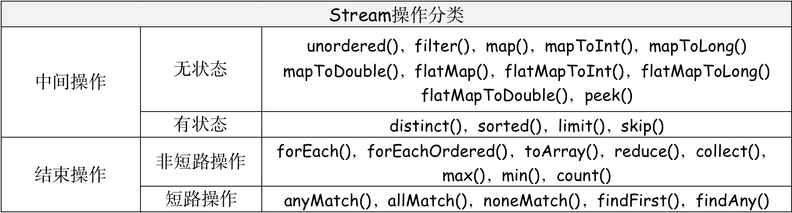

&emsp;&emsp;●  **集合或数据源是如何生成 *Stream* 流的 - 创建 *Stream* 流**
&emsp;&emsp;要想使用 *Stream API* ，就必须要把集合转为 *Stream* 流。对于集合 *Collection* 接口，定义了 `stream()` 方法，可以将集合转换为 *Stream* 流。`stream()` 方法依赖 `StreamSupport.stream(spliterator(),false)`方法，其本质是生成 ***Head*** 对象，存放 *Head Stage*。为了提高效率，将 *Collection* 集合会通过`spliterator()`方法对集合进行“分割”，使其可以并行迭代。


&emsp;&emsp;●  ***Stream* 流中间操作记录 - *Stage***
&emsp;&emsp;  *Stream* 流的一个操作称为一个*<font color=green>**Stage**</font>*，*Stage*是由 **<<font color=red>数据来源</font>,<font color=blue>操作</font>,<font color=green>回调函数</font>>**  构成的三元组，由实例化后的 ***PipelineHelper*** 表示。将具有先后顺序的各个 *Stage* 连到一起就构成了整个流水线。*PipelineHelper* 与 *Stream* 的架构关系如上面的架构图所示。*Stream* 流水线组织结构示意图如下:

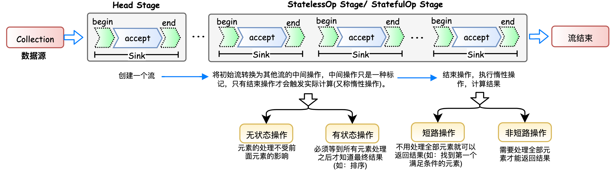

&emsp;&emsp; 数据源通过`Collection.stream()`方法创建一个数据流，进入 ***Head Stage*** 阶段。随后通过一系列的中间操作，每进行一个中间操作会产生一个新的*Stream* 对象。**这些 *Stream* 对象以<font color=red>双向链表</font>的形式组织在一起，构成整个流水线，由于每个Stage都记录了前一个Stage(数据来源)和本次的操作以及回调函数，依靠 *Stage* 就能建立起对数据源的所有操作**。

&emsp;&emsp;●  ***Stream* 流中间操作的叠加 - *Sink***
&emsp; &emsp; *Stage* 只是解决了操作记录的问题，要想让流水线按照我们的设计去执行，我们需要将所有操作叠加到一起。由于前面的 *Stage* 并不知道后面 *Stage* 到底执行了哪种操作，只有当前 *Stage* 本身才知道该如何执行自己包含的动作。这就需要<font color=red> ***Sink***</font> 协调相邻 *Stage* 之间的调用关系。

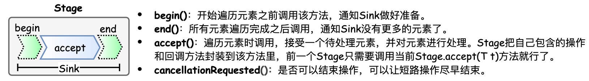

&emsp; &emsp; 每个 *Stage* 都会将自己的操作封装到一个 *Sink*，前一个 *Stage* 只需调用后一个 *Stage* 的`accept()`方法即可，并不需要知道其内部是如何处理的。对于有状态的操作，*Sink* 的`begin()`和`end()` 方法是必须实现的。比如 `Stream.sorted()` 是一个有状态的中间操作，其对应的 `Sink.begin()`方法可能创建一个乘放结果的容器，而`accept()`方法负责将元素添加到该容器，最后`end()`负责对容器进行排序。对于短路操作，`Sink.cancellationRequested()`也必须实现，比如 `Stream.findFirst()`是短路操作，只要找到一个元素，`cancellationRequested()` 就应该返回 *true*，以便尽快结束查找。***Stream API* 内部实现的的本质，就是如何重载 *Sink* 的这四个接口方法**。

```java
【举个栗子 🌰】
1. Stream.map() Stream APi map()操作是生成一个新的"Map"形式的Stream流
   Stream.map() 的本质是将回调函数mapper包装到一个Sink当中。由于Stream.map()是一个无状态的中间操作，所以map()方法返回了一个StatelessOp内部类对象(一个新的Stream)
 public final <R> Stream<R> map(Function<? super P_OUT, ? extends R> mapper) {
    ...
    /**
     * 1. 通过匿名内部类的方式，生成新的Stage(Stream)，并返回新的Stream
     * 2. 由于StatelessOp抽象类 继承于 ReferencePipeline类，ReferencePipeline继承于AbstractPipeline类，
     * 因此匿名内部类需要实现opWrapSink()方法
     * 3. 每个方法会通过匿名内部类方法生成一个新的ReferencePipeline对象(Stage)，无状态为StatelessOp，有状态为StatefulOp。每个		    ReferencePipeline对象中包含重写的Sink.opWrapSink(),在opWrapSink()方法中，定义了每个Stage的操作。
     */
    return new StatelessOp<P_OUT, R>(this, StreamShape.REFERENCE,
                                 StreamOpFlag.NOT_SORTED | StreamOpFlag.NOT_DISTINCT) {
        //opWripSink()方法返回由回调函数包装而成Sink: Stage -> Sink
        @Override 
        Sink<P_OUT> opWrapSink(int flags, Sink<R> downstream) {
            return new Sink.ChainedReference<P_OUT, R>(downstream) {
                @Override
                public void accept(P_OUT u) {
                    R r = mapper.apply(u);// 1. 使用当前Sink包装的回调函数mapper处理u
                    downstream.accept(r);	// 2. 将处理结果传递给流水线下游的Sink
                }
            };
        }
    };
 }

2. Stream.sorted() Stream APi sorted()操作是对Stream中的元素进行排序，这是一个有状态的中间操作，读取所有元素之前是没法得到最终顺序的。
  class RefSortingSink<T> extends AbstractRefSortingSink<T> {
    private ArrayList<T> list;	// 存放用于排序的元素
    RefSortingSink(Sink<? super T> downstream, Comparator<? super T> comparator) {
        super(downstream, comparator);
    }
    // Step 1:在开始遍历元素之前调用begin(),创建存放排序后元素的列表,确定中间结果容器的的大小
    @Override
    public void begin(long size) {
        ...
        // 创建一个存放排序元素的列表
        list = (size >= 0) ? new ArrayList<T>((int) size) : new ArrayList<T>();
    }
    // Step3:在遍历元素之后调用end(),对元素进行排序，并将排序后的元素传递给流水线下游的Sink，如果下游的Sink是短路操作，将结果传递给下游时不断询问下游cancellationRequested()是否可以结束处理
    @Override
    public void end() {
        list.sort(comparator);							 // 只有元素全部接收之后才能开始排序
        downstream.begin(list.size());
        if (!cancellationWasRequested) {		 // 下游Sink不包含短路操作
            list.forEach(downstream::accept);// 将处理结果传递给流水线下游的Sink
        }
        else {
            for (T t : list) {				// 若下游Sink包含短路操作，每次都调用询问是否可以结束处理。
                if (downstream.cancellationRequested()) break;
                downstream.accept(t);	// 将处理结果传递给流水线下游的Sink
            }
        }
        downstream.end();
        list = null;
    }
    // Step 2:遍历元素,最终执行时调用者(上游Sink)会不断调用该方法，直到遍历所有元素；
    @Override
    public void accept(T t) {
        list.add(t);					// 使用当前Sink包装动作处理t，只是简单的将元素添加到中间列表当中
    }
 }
```

&emsp;&emsp;●  ***Stream* 流操作的触发 - 结束操作 *evaluate***

&emsp; &emsp; *Stream* 的每个 *Stage*  通过 *Sink* 连接到一起，从而形成了一个完整的 *Stream* 流。那么最终就只需要触发这个 *Stream* 流，使其完成具体的执行操作，即可得到最后的结果。<font color=green>触发 *Stream* 流执行的操作就是 *Stream* 流的**结束操作**</font>。一旦调用某个结束操作，就会触发整个流水线的执行。结束操作之后不能再有别的操作，所以结束操作不会创建新的流水线阶段 ( *Stage* )，结束操作会创建一个包装了自己操作的 *Sink*，这个 *Sink* 只需要处理数据而不需要将结果传递给下游的 *Sink* (因为没有下游) ，结束操作的 *Sink* 就是调用链的出口。 &emsp; &emsp; 当调用结束操作后，本质是调用`evaluate()`方法，在`evaluate()`中会调用 `AbstractPipeline.wrapSink()`。该方法从流水线的最后一个 ***Stage*** 开始，不断调用上一个 ***Stage*** 的 `opWrapSink()` 方法直到最开始(不包括 *Head Stage*，因为 *Head Stage* 代表数据源，不包含操作)，就可以得到一个代表了流水线上所有操作的 ***Sink***。

```java
/**
 * AbstractPipeline.wrapSink()
 * 1. 从下游向上游不断包装Sink。如果最初传入的sink代表结束操作，
 * 2. 函数返回时就可以得到一个代表了流水线上所有操作的Sink。现在流水线上从开始到结束的所有的操作都被包装到了一个Sink里，
 * 执行这个Sink就相当于执行整个流水线。相当于找到第一个定义中间操作Sink，随后从第一个Sink进行遍历执行。
 */
final <P_IN> Sink<P_IN> wrapSink(Sink<E_OUT> sink) {
    ...
    for (AbstractPipeline p=AbstractPipeline.this; p.depth > 0; p=p.previousStage) {
        sink = p.opWrapSink(p.previousStage.combinedFlags, sink);
    }
    return (Sink<P_IN>) sink;
}
/**
 * AbstractPipeline.copyInto(), 对spliterator代表的数据执行wrappedSink代表的操作。从第一个中间操作Sink进行遍历，开始执行
 * 1. 调用wrappedSink.begin()方法告诉Sink数据即将到来
 * 2. 然后调用spliterator.forEachRemaining()方法对数据进行迭代
 * 3. 最后调用wrappedSink.end()方法通知Sink数据处理结束。
 */
final <P_IN> void copyInto(Sink<P_IN> wrappedSink, Spliterator<P_IN> spliterator) {
    ...
    if (!StreamOpFlag.SHORT_CIRCUIT.isKnown(getStreamAndOpFlags())) {
        wrappedSink.begin(spliterator.getExactSizeIfKnown());	// 通知开始遍历
        spliterator.forEachRemaining(wrappedSink);						// 迭代
        wrappedSink.end();																		// 通知遍历结束
    }
    ...
}
```

&emsp;&emsp;●  ***Stream* 流执行后的结果**
&emsp; &emsp; 由于 *Stream* 流会有不同的返回结果，不同结果对应的存储方式也是不同的。

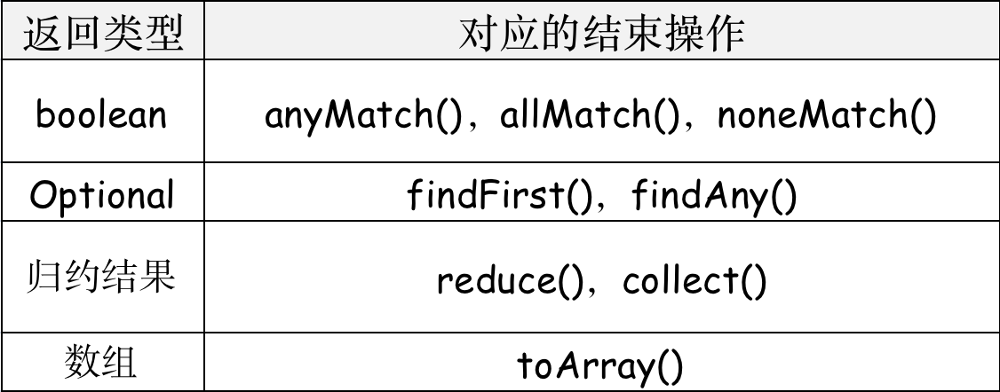

&emsp; &emsp; ① 对于表中返回 ***boolean*** 或者 ***Optional*** 的操作，由于值返回一个值，只需要在对应的Sink中记录这个值，等到执行结束时返回就可以了。 
&emsp; &emsp; ② 对于归约操作，最终结果放在用户调用时指定的容器中。`collect(), reduce(), max(), min()` 都是归约操作，虽然 `max()` 和 `min()` 也是返回一个 ***Optional***，但事实上底层是通过调用 `reduce()` 方法实现的。
&emsp; &emsp; ③ 对于返回是数组的情况，结果其实是存储在一种叫做 ***Node*** 的数据结构中的。***Node*** 是一种多叉树结构，元素存储在树的叶子当中，并且一个叶子节点可以存放多个元素。这样做是为了并行执行方便。

#### 2.7.6 Java 并发容器

### 2.8 Java 泛型

&emsp;&emsp; *java* 泛型是J2SE1.5中引入的一个新特性。Java泛型其本质是类型参数化，也就是所操作的数据类型被指定为一个参数。泛型只在编译阶段有效，泛型信息不会进入到运行时阶段。在编译过程中，会将泛型的相关信息擦出，并且在对象进入和离开方法的边界处添加类型检查和类型转换的方法。
> <font color=SlateBlue>  <u>**Q1. 泛型的作用是什么 ？**</u></font>
>&emsp;&emsp; **① 泛化**：用T代表任意类型，可以使得多种数据类型执行相同的代码，提高代码的泛化性和通用性。
>&emsp;&emsp; **② 消除强制转换，类型安全**：<font color=red>使用泛型可以使编译器知道变量的类型限制，进而可以编译期验证类型假设。如果不用泛型，则必须使用强制类型转换，而强制类型转换不安全，在运行期可能发生`ClassCast Exception`异常。</font>
>&emsp;&emsp; **③ 提高运行效率**：在非泛型编程中，将筒单类型作为`Object`传递时会引起`Boxing`（装箱）和`Unboxing`（拆箱）操作，这两个过程都是具有很大开销的。引入泛型后，就不必进行`Boxing`和`Unboxing`操作了，所以运行效率相对较高，特别在对集合操作非常频繁的系统中，这个特点带来的性能提升更加明显。

```java
// 如果不采用泛型，直接使用任意类型，则会导致程序在运行时发生强制类型转换，导致程序的崩溃
  List arrayList = new ArrayList();
  arrayList.add("aaaa");
  arrayList.add(100);
  for(int i = 0; i< arrayList.size();i++){
      String item = (String)arrayList.get(i);
  }
--Output--
  	@throw java.lang.ClassCastException: java.lang.Integer cannot be cast to java.lang.String
```

#### 2.8.1 泛型的使用

##### <font color=Sienna>**1. 泛型通配符**</font>

&emsp;&emsp;**① 常用的 T，E，K，V，？通配符**
&emsp;&emsp; 本质上这些个都是通配符，没啥区别，只不过是编码时的一种约定，我们可以换成 A-Z 之间的任何一个字母都可以，并不会影响程序的正常运行，但是如果换成其他的字母代替 T ，在可读性上可能会弱一些。**通常情况下，T，E，K，V，？是这样约定的：**
&emsp; &emsp; ● *T = Type*，表示具体的一个 *java* 类型; 
&emsp; &emsp; ● *E = Element*，在集合中使用，存放的是元素; 
&emsp; &emsp; ● *K,V = key,Value*，分别代表 *java* 键值中的*Key, Value*; &emsp; &emsp; ● ? 无界通配符，表示不确定的 *java* 类型。

&emsp;&emsp;**② 上界通配符 *< ? extends E>* **
&emsp;&emsp; 上界通配符用 *extends*关键字声明，表示参数化的类型可能是所指定的类型，或者是此类型的子类。如果传入的类型不是E或者E的子类，编译不成功，同时泛型中可以直接使用E的方法。<font color=red>**上界通配符主要用于读数据。**</font>

&emsp;&emsp;**③ 下界通配符  *< ? super E>* **
&emsp;&emsp; 下界通配符用 *super* 进行声明，表示参数化的类型可能是所指定的类型，或者是此类型的父类型，直至 *Object*。<font color=red>**下界通配符主要用于写数据。**</font>

> <font color=SlateBlue><u>**Q1. "?通配符" 与"T通配符"的区别 ？**</u></font>
> &emsp;&emsp; "?" 和 "T"都表示不确定的类型，其区别如下：
> &emsp; &emsp; ● 我们可以<font color=green>**对"T"进行操作**</font>，如 `T t = operate();`，但是对"?"不行，不可以 `？car = operate();`。
> &emsp; &emsp; <font color=green>**● 通过"T通配符" 可以确保泛型参数的一致性**</font>，如 `public <T extends Number> void test(List<T> dest, List<T> src)` 如果传入实参T=String，则两个形参的T均为 *String* 。而对于 "?通配符"  `public void test(List<? extends Number> dest, List<? extends Number> src)` 由于 "?通配符"是不确定的，所以这个方法不能保证两个形参具有相同的元素类型。
> &emsp; &emsp; <font color=green>**● "T通配符"类型参数可以多重限定而通配符不行**</font>，如 `pubic static <T extend multiLimitA & multiLimitB> void test(T t)` 使用 & 符号设定多重边界( *Multi Bounds* )，指定泛型类型 T 必须是`MultiLimitA` 和 `MultiLimitB` 的共有子类型。
> &emsp; &emsp; <font color=green>**● 通配符可以使用超类限定而类型参数不行**</font>。类型参数 T 只具有一种类型限定方式：`T extends A`。?通配符可以有两种类型限定：`? extends A` 和 `? super A`

> <font color=SlateBlue><u>**Q2. 为什么要使用无界通配符而不是简单的泛型呢 ？**</u></font>
> &emsp; &emsp; 无界通配符在声明局部变量时是没有什么意义的，但是当你为一个方法声明一个参数时，无界通配符是非常重要的。
>
>```java
>// Animal接口
>public interface Animal {
>		public String animalName();
>}
>// 实现类Dog
>public class Dog implements Animal{
>        @Override
>        public String animalName() {
>           return "Dog";
>        }
>}
>
>public class DemoClass {
>      //该方法的入参只能传入Animal类型的list，Animal的子类无法传入
>      public void demo(List<Animal> animalList) {
>           animalList.forEach(item ->{
>               System.out.println(item.animalName());
>           });
>  }
>  //该方法的入参可以传入任意类型list，但是由于方法中存在强制类型转换，会出现类型转换错误
>  public <T> void demo1(List<T> animalList) {
>         animalList.forEach(item ->{
>             Animal animal = (Animal) item;
>             System.out.println(animal.animalName());
>         });
>  }
>  //该方法的入参可以传入Animal及其子类类型的list
>  public <T> void demo2(List<? extends Animal> animalList) {
>         animalList.forEach(item ->{
>             System.out.println(item.animalName());
>         });
>      }
>}
>public static void main(String[] args){
>        List<Dog> dogs = new ArrayList<>();
>        dogs.add(new Dog());
>        DemoClass demoClass = new DemoClass();
>        ~~demoClass.demo(dogs);~~  //编译失败
>        demoClass.demo1(dogs);     //类型转换失败
>        demoClass.demo2(dogs);     //没有问题
>}
>```

##### <font color=Sienna>**2. 泛型的使用方式**</font>

&emsp;&emsp;泛型有三种使用方式，分别为：<font color=red>**泛型类**、**泛型接口**、**泛型方法**</font>。 
&emsp; &emsp; **● 泛型类**：泛型类型用于类的定义中，被称为泛型类。通过泛型可以完成对一组类的操作对外开放相同的接口。最典型的就是各种容器类，如：`List`、`Set`、`Map`。

```java
//在实例化泛型类时，必须指定T的具体类型
public class Generic<T>{ 
    //key这个成员变量的类型为T,T的类型由外部指定  
    private T key;
    public Generic(T key) { //泛型构造方法形参key的类型也为T，T的类型由外部指定
        this.key = key;
    }
    public T getKey(){ //泛型方法getKey的返回值类型为T，T的类型由外部指定
        return key;
    }
}
//泛型的类型参数只能是类类型（包括自定义类），不能是简单类型
//传入的实参类型需与泛型的类型参数类型相同，即为Integer.
Generic<Integer> genericInteger = new Generic<Integer>(123456);
```

&emsp; &emsp; **● 泛型接口**：泛型类型用于类的接口定义中，被称为泛型接口。泛型接口与泛型类的定义及使用基本相同。泛型接口常被用在各种类的生产器中。

```java
//定义一个泛型接口
public interface Generator<T> {
    public T next();
}

/**
 * 未传入泛型实参时，与泛型类的定义相同，在声明类的时候，需将泛型的声明也一起加到类中
 * 如果不声明泛型，如：class FruitGenerator implements Generator<T>，编译器会报错："Unknown class"
 */
class FruitGenerator<T> implements Generator<T>{
    @Override
    public T next() {
        return null;
    }
}
/**
 * 传入泛型实参时：
 * 在实现类实现泛型接口时，如已将泛型类型传入实参类型，则所有使用泛型的地方都要替换成传入的实参类型
 * 即：Generator<T>，public T next();中的的T都要替换成传入的String类型。
 */
public class FruitGenerator implements Generator<String> {
    private String[] fruits = new String[]{"Apple", "Banana", "Pear"};
    @Override
    public String next() {
        Random rand = new Random();
        return fruits[rand.nextInt(3)];
    }
}
```

&emsp; &emsp; **● 泛型方法**：泛型类型用于成员方法中，被称为泛型接口。泛型方法需要在方法名称前声明`<T>`，泛型类中的使用了泛型的成员方法并不是泛型方法。

```java
public class Generic<T>{     
    private T key;
    public Generic(T key) {
        this.key = key;
    }
    /**
     *	虽然在方法中使用了泛型，但是这并不是一个泛型方法。这只是类中一个普通的成员方法，
     *   只不过他的返回值是在声明泛型类已经声明过的泛型,所以在这个方法中才可以继续使用 T 这个泛型。
     */
    public T getKey(){
        return key;
    }
  	/** 
     * 这才是一个真正的泛型方法。
     * 在public与返回值之间的<T>必不可少，这表明这是一个泛型方法，并且声明了一个泛型T
     */
    public <T> T showKeyName(Generic<T> container){
        System.out.println("container key :" + container.getKey());
        //当然这个例子举的不太合适，只是为了说明泛型方法的特性。
        T test = container.getKey();
        return test;
    }
}
```

------

### 2.9 Java 代理模式

&emsp;&emsp; 代理是一种常用的设计模式，其目的就是为其他对象提供一个代理以控制对某个对象的访问。代理模式可以在不修改被代理对象的基础上，通过扩展代理类，进行一些功能的附加与增强。**在Java中，存在三种代理模式：<font color=red>静态代理(设计模式中介绍)，*jdk*动态代理 ( 代理类是由JDK在运行时动态生成 )，*cglib* 代理。</font>**

#### 2.9.1 静态代理

&emsp;&emsp; 静态代理要求<font color=green>**所访问的真实对象与代理对象需要实现相同的接口**。</font>代理对象在客户端和目标对象之间起到中介作用，即**代理对象 = 增强代码 + 目标对象(原对象)**。但静态代理由于代理对象要实现与目标对象一致的接口，会产生过多的代理类。同时一旦接口增加方法，目标对象与代理对象都要进行修改。

#### 2.9.2 动态代理

&emsp;&emsp; 动态代理中的所谓"动态"，是相对于使用Java代码实际编写静态代理而言，"动态"的优势并不是省去了编写代理类的工作量，而是实现了可以在原始接口和原始类未知的时候，就确定了代理类的代理行为，即动态代理类不再是针对某一特定的已知的类接口进行代理，当动态代理类与原始类"脱离直接联系"时，可以复用于其他不同的场景中。动态代理分为 ***JDK* 动态代理**和 ***cglib* 动态代理** 两种方式。

> <font color=SlateBlue><u>**Q1. 动态代理与静态代理的区别 ？**</u></font>
> &emsp;&emsp;① 加载被代理类的时机不同: 静态代理在编译时就已经实现，编译完成后代理类是一个实际的 *class* 文件。动态代理是在运行时动态生成的，即编译完成后没有实际的 *class* 文件，而是在**运行时动态生成类字节码，并加载到 JVM中**。
> &emsp;&emsp;② 静态代理代理对象要实现与目标(被代理)对象一致的接口，而<font color=green>**动态代理对象不需要实现接口，需要实现 *InvocationHandler* 接口，但目标(被代理)对象必须实现接口**</font>，否则不能使用动态代理。

##### 1. *JDK* 动态代理

&emsp;&emsp; 动态代理通过 *JDK API*，<font color=red>**动态地在内存中构建代理对象**</font>，从而实现对目标对象的代理。动态代理又被称为 *JDK* 代理或接口代理。
> <font color=SlateBlue><u>**Q1. *jdk* 动态代理的特点 ？**</u></font>
> &emsp;&emsp;**① 类修饰符**：*jdk* 动态代理类具有 *final* 和 *public* 修饰符，它可以被所有的类访问，但是不能被再度继承；
> &emsp;&emsp;**② 类名**：动态代理类的类名格式是 *$ProxyN*，代表 *Proxy* 类第 N 次生成的动态代理类，并不是每次创建动态代理类都会使得 N 值增加，如果对同一组接口 (包括接口排列的顺序相同) 重复创建动态代理类，则会从 *WeakCache* 缓存中返回先前已经创建好的代理类的类对象。
> &emsp;&emsp;**③ 类继承关系：***Proxy* 类是所有 *jdk* 动态代理类的父类。

###### (1). *JDK* 动态代理的使用

```java
public static Object newProxyInstance(ClassLoader loader,Class<?>[] interfaces, InvocationHandler h)
  
// ============================================
// 1.Trains接口，抽象主题角色
public interface Trains {
    public void run();
}
// ============================================
// 2.Trains接口实现，被代理的角色
public class SlowTrains implements Trains {
    @Override
    public void run() {
        System.out.println("火车开车了");
    }
}
// ============================================
// 3.动态代理类，代理了被代理类，对被代理类进行了增强，通过实现 InvocationHandler 接口创建自己的动态代理器
public class Shop implements InvocationHandler {
    private Trains trains;  //引入要代理的对象
    public Shop(Trains trains){
        this.trains = trains;
    }
    @Override
    public Object invoke(Object proxy, Method method, Object[] args) throws Throwable {
        System.out.println("本商店代售火车票");
        method.invoke(trains,args);
        System.out.println("结束");
        return null;
    }
}
// ============================================
// 4. 主函数，动态代理的使用
	Trains trains = new SlowTrains();
	Trains trains1 = (Trains) Proxy.newProxyInstance(
    				SlowTrains.class.getClassLoader(), SlowTrains.class.getInterfaces(),new Shop(trains));
  trains1.run();
```

###### (2). *JDK* 动态代理的原理

&emsp;&emsp;动态代理通过 *java jdk* 实现，通过 *Proxy* 的静态方法 <font color=red>***newProxyInstance***</font> 动态创建代理。

```java
public static Object newProxyInstance(ClassLoader loader,
                                          Class<?>[] interfaces,InvocationHandler h)
// loader - 类加载器，用于加载被代理类到jvm
// interfaces - 要用来代理的接口,即被代理的类的接口
// InvocationHandler - 每个代理的实例都有一个与之关联的 InvocationHandler 实现类，如果代理的方法被调用，那么代理便会通知和转发给内部的 InvocationHandler 实现类，由它决定处理。
```

&emsp;&emsp;动态代理类的生成机制： 
&emsp; &emsp; ① 项目启动时，*Proxy* 类中的静态二级缓存 *WeakCache* 进行初始化，并传入 *KeyFactory* (生成二级缓存的 *Key* )与 *ProxyClassFactory* (生成动态代理类的工厂类)，将生成的动态代理类存放到二级缓存当中。 
&emsp; &emsp; ② 当通过 `newProxyInstance()` 来"实例化"动态代理类时，根据传入被代理类的 *classLoader* 和 *interface* 数组，从二级缓存中拿到动态代理类。


> <font color=SlateBlue><u>**Q1. *jdk* 动态代理缓存为什么使用 *WeakCache* ？**</u></font>
> &emsp; &emsp; *WeakCache* 是一个具有二级缓存的弱引用类，一级缓存的 *key* 是弱引用，二级缓存是强引用。其中一级缓存的 *key* 是根据入参直接传入的，二级缓存的*key* 和 *value* 是根据一级缓存的 *key* 和 *value* 通过各自的工厂方法( *subKeyFactory* 和 *valueFactory* )计算得到的。当弱引用被GC回收后，二级缓存强引用会被以惰性 ( *lazily* ) 方式被删除。由于 ***jdk* 动态代理生成的代理类占用内存较大，为了不影响GC对内存的回收**，*jdk*动态代理使用 *WeakCache* 作为生成的动态代理类的缓存。

##### 2. *cglib* 动态代理

&emsp; &emsp; *cglib* 是一个强大的、高性能的**代码生成库**。*cglib* 代理代理为控制要访问的目标对象提供了一种途径，通过对**字节码**进行操作，当访问对象时，它引入了一个间接的层(代理层)，以控制对象的访问。<font color=red>***cglib* 的应用本质是为那些<font color=green>没有接口的类创建一个代理对象</font>，从而实现对原有代码的增强，拦截等操作**</font>。*cglib*主要应用场景如下:
&emsp; &emsp; ① 广泛的应用于 *AOP* 的框架使用，例如：Spring AOP和dynaop，为他们提供方法的 *intercep* (拦截器策略)。 
&emsp; &emsp; ② *Hibernate* (*ORM* 持久层框架) 使用 *cglib* 来代理单端 *single-ended* (多对一、一对一)关联。 
&emsp; &emsp; ③ *EasyMock* 和 *jMock* 是通过使用模仿(*moke*) 对象来测试 *java* 代码的包。


> <font color=SlateBlue><u>**Q1.*cglib* 动态代理与 *jdk* 动态代理的区别 ？**</u></font>
> &emsp;&emsp; **① 使用方式的区别**：*cglib* 动态代理相比于 *jdk* 动态代理更加强大，*jdk* 动态代理虽然简单易用，但是只能对接口进行代理。如果要代理的类为一个普通类、没有接口，那么就无法通过 *jdk* 动态代理来实现了。而 *cglib* 动态代理可以为没有接口的普通类创建一个代理对象。
> &emsp;&emsp; **② 原理区别**：*jdk* 动态代理是利用反射机制生成一个实现代理接口的匿名类，在调用具体方法前调用 *InvokeHandler* 来处理。而 *cglib* 动态代理是利用 *asm* 开源包，对代理对象类的 *class* 文件加载进来，通过修改其字节码生成子类来处理。

###### (1). *cglib* 动态代理的使用

&emsp;&emsp;cglib 代理类将目标类作为自己的父类，并为每个非 ***final*** 委托方法创建两个方法:
&emsp; &emsp; ① 与目标方法签名相同的方法，它在方法中会通过 ***super*** 调用目标方法. 
&emsp; &emsp; ② ***Callback*** 回调方法，通过判断这个方法是否绑定了拦截器(实现了 ***MethodInterceptor*** 接口的对象)，若存在则将调用 intercept 方法对目标方法进行代理。


```java
// ============================================
// 1.被代理的目标类，没有实现接口
public class DemoTarget {
    public void getStr(){
        System.out.println("DemoTarget 被代理类");
    }
  	public void getStr1(){
        System.out.println("DemoTarget 被代理类 2");
    }
 	  public String methodForFixedValue(String str){
        return str;
    }
}

// ============================================
// 2.设置方法拦截器，用于对目标类中方法的拦截，可以设置多个方法拦截器
public class ProxyIntercepter implements MethodInterceptor {
    @Override
    public Object intercept(Object obj, Method method, Object[] args, MethodProxy proxy) throws Throwable {
        System.out.println("Here is interceptor 1");
        return proxy.invokeSuper(obj, args);
    }
}
public class ProxyIntercepter2 implements MethodInterceptor {
    @Override
    public Object intercept(Object obj, Method method, Object[] args, MethodProxy proxy) throws Throwable {
        System.out.println("Here is interceptor 2");
        return proxy.invokeSuper(obj,args);
    }
}
//返回固定值
public class FixedValueInterceptor implements FixedValue {
    @Override
    public Object loadObject() throws Exception {
        System.out.println("Here in ProxyFixedValue ! ");
        return "Fixed Value";
    }
}
// ============================================
// 3.设置拦截器过滤器，可以针对目标类中的方法，对方法拦截器的过滤，返回的值为数字代表了Callback数组中的索引位置
public class ProxyCallbackFilter implements CallbackFilter {
    @Override
    public int accept(Method method) {
      	if(method.getName().equals("getStr")){
            return 0;
        }else if(method.getName().equals("getStr1")){
            return 1;
        }else if(method.getName().equals("methodForFixedValue")){
            return 2;
        }
        return 3;
    }
}

// ============================================
// 4. 主函数中，通过Enhancer对目标类进行”增强“
public static void main(String[] args) {
  	// 实例化方法拦截器
		ProxyIntercepter proxyIntercepter = new ProxyIntercepter();
    ProxyIntercepter2 proxyIntercepter2 = new ProxyIntercepter2();
  	FixedValueInterceptor fixedValueInterceptor = new FixedValueInterceptor();
  
		// 实例化拦截器过滤器
    ProxyCallbackFilter proxyCallbackFilter = new ProxyCallbackFilter();
  
		// 实例化并设置Enhancer
    Enhancer enhancer = new Enhancer();
    enhancer.setSuperclass(DemoTarget.class);  //设置代理类的”父类“
  	Callback noopCb = NoOp.INSTANCE;			//对方法拦截器不做处理
    enhancer.setCallbacks(new Callback[]{proxyIntercepter,proxyIntercepter2,fixedValueInterceptor,noopCb});//设置方法拦截器数组
    enhancer.setCallbackFilter(proxyCallbackFilter);		//设置拦截器过滤器
		
  	//通过Enhancer创建目标类的代理类，通过方法拦截器，目标类的相关方法被增强
  	DemoTarget targetProxyForEnhancer = (DemoTarget) enhancer.create();
    System.out.println("=================");
    targetProxyForEnhancer.getStr();				//调用被增强的代理类方法
    System.out.println("=================");
    targetProxyForEnhancer.getStr1();				//调用被增强的代理类方法
    System.out.println("=================");
    System.out.println(targetProxyForEnhancer.methodForFixedValue("aaa")); //调用被增强的代理类方法
}

--Output--
  =================
  Here is interceptor 1
  被代理类 getStr
  =================
  Here is interceptor 2
  被代理类 getStr1
  =================
  Here in ProxyFixedValue ! 
  Fixed Value
```

###### (2). *cglib* 动态代理的原理

### 2.10  Java 异常

&emsp;&emsp; 在程序设计中，进行异常处理是非常关键和重要的一部分。异常在程序编译期间和运行期间经常发生，在编译期间出现的异常有编译器在编译期间进行"拦截"。而运行期间的错误往往是难以预料的，假若程序在运行期间出现了错误，会使程序终止或导致系统崩溃。<font color=green>异常处理机制能让程序在异常发生时，按照代码的预先设定的异常处理逻辑，通过异常机制，我们可以更好地提升程序的健壮性。</font>Java异常机制的框架如下图所示:

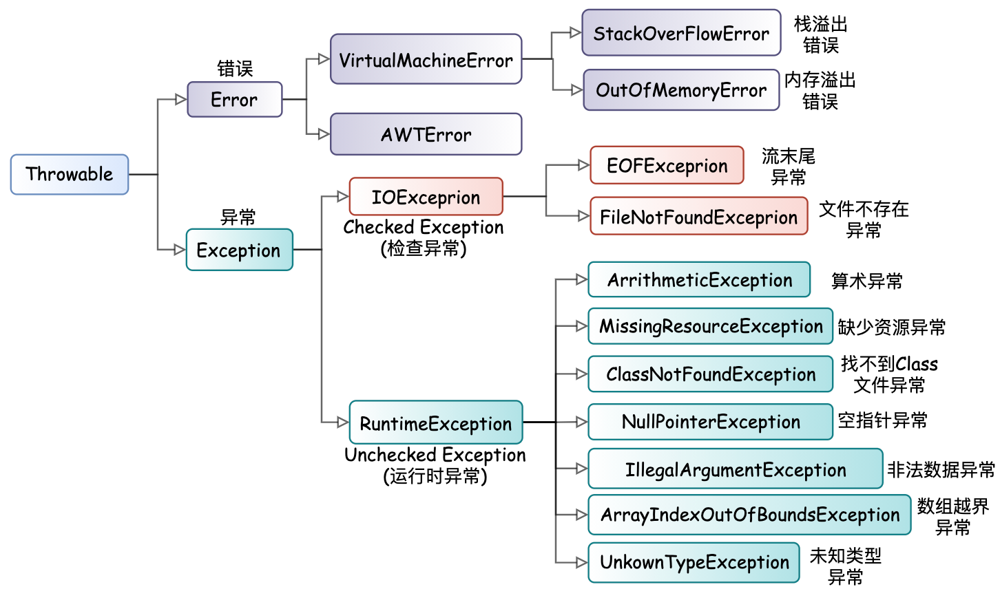

&emsp;&emsp; 在Java中**异常被当做<font color=red>对象</font>来处理**，根类是`java.lang.Throwable`类，异常类分为两大类：***Error ***和 ***Exception***： 
&emsp;&emsp; ● ***Error* : ** *Error* 是指错误，对于所有的编译时期的错误以及系统错误都是通过*Error*抛出的。*Error* 表示故障发生于虚拟机自身、或者发生在虚拟机试图执行应用时。*Error* 错误是不可查的，因为它们在应用程序的控制和处理能力之外，且绝大多数是程序运行时不允许出现的状况。如Java虚拟机运行错误( *VirtualMachineError* )，类定义错误 ( *NoClassDefFoundError* )等。
&emsp;&emsp; ● ***Exception :*** *Exception* 是指程序本身可以捕获并且可以处理的异常。***Exception* 类的异常都是在运行期间发生的。** ***Exception* 类的异常包括  `Checked Exception`和 `Unchecked Exception(Runtime Exception)`。**"检查"与"非检查"的是针对编译器来说的，检查异常是指编译器会对异常进行检查，非检查异常是指编译器不会对异常进行检查。
&emsp; &emsp; &emsp; <font color=orange>**① *CheckedException :***</font> 检查异常 (非运行时异常)。对于非运行时异常，编译器要求必须进行异常捕获处理，如果不进行捕获或者抛出声明处理，编译不会通过。如 *IOExeption* 和 *SQLException*。
&emsp; &emsp; &emsp; <font color=orange>**② *Unchecked Exception :***</font> 非检查异常 (运行时异常)。对于运行时异常，不要求必须进行异常捕获处理或者抛出声明，由程序员自行决定。如  *NullPointerException* 和 *IndexOutOfBoundsException*。

#### 2.10.1 异常的底层实现

&emsp; &emsp; 在编译生成的字节码的过程中，会为每个方法中的`try-catch`语句生成一个**异常表** ( *Exception Table* )，存放在 *.class* 字节码的最后。异常表中的每一条记录，都代表了一个异常处理器。异常表记录了该方法内每个异常发生的起止指令和处理指令。 
&emsp;&emsp; ● ***from :***可能发生异常的起始点。 
&emsp;&emsp; ● ***to :***可能发生异常的结束点。
&emsp;&emsp; ● ***target :*** 上述 *from* 和 *to* 之前发生异常后的异常处理者的位置。 
&emsp;&emsp; ● ***type :***异常处理者处理的异常的类信息。

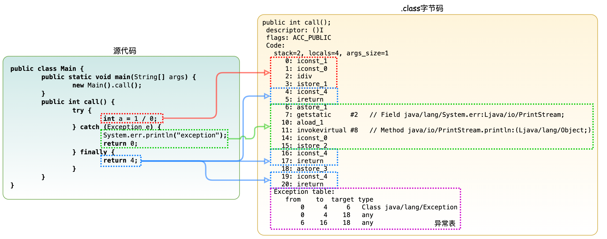

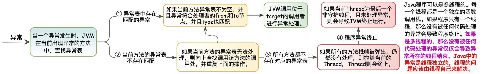

#### 2.10.2 异常的抛出与捕获

##### 1. 异常的抛出

&emsp; &emsp; 异常的抛出分为两种: 显示抛出和隐式抛出。
&emsp; &emsp; ● 显示抛出异常的主体是应用程序，程序中使用 ***throw*** 关键字，手动抛出异常实例，显式抛出异常强制程序对异常进行处理，否则程序在编译阶段就会发生错误，无法通过编译。 
&emsp; &emsp; ● 隐式异常的主体是Java虚拟机，它指的是JVM在执行过程中，碰到无法继续执行的异常状态，自动抛出的异常。

> <font color=SlateBlue><u>**Q1. *throw* 与 *throws*的区别 ？**</u></font>
> &emsp; &emsp; ● ***throws*** 用来声明一个方法可能产生的所有异常，表示抛出异常，由该方法的调用者来对异常进行处理，而声明该异常的方法不做任何处理。
> &emsp; &emsp; ● ***throw*** 用来抛出一个具体的异常类型,用在方法体内。*throw* 抛出异常有两种方式: ①自己捕获异常 *try...catch* 代码块，② 抛出一个异常( *throws* 异常)
>
>```java
>public class TestThrow{
>  	public static void main(String[] args) {
>         try{
>             throwChecked(-3); //调用带throws声明的方法，必须通过try..catch{}显式捕获该异常，否则，必须在main方法中再次声明抛出
>         }
>         catch (Exception e){
>             System.out.println(e.getMessage());
>         }
>         throwRuntime(3);  //调用抛出Runtime异常的方法既可以显式捕获该异常，也可不捕获该异常
>      	}
>       public static void throwChecked(int a)throws Exception{
>         if (a > 0){
>             throw new Exception("a的值大于0，不符合要求"); //抛出Exception异常，该代码必须处于try块里，或处于带throws声明的方法中
>         }
>       }
>       public static void throwRuntime(int a){
>         if (a > 0){
>             throw new RuntimeException("a的值大于0，不符合要求"); //抛出RuntimeException异常，既可以显式捕获该异常,也可不捕获该异常
>         }
>       }
>}
>
>--Output--
>// 异常抛出后，从上到下为异常的追踪路径，是从调用方法栈的栈顶向栈低进行回溯。
>Exception in thread "main" java.lang.RuntimeException: a的值大于0，不符合要求   //异常的线程，异常类型，异常原因
>	at test.Main.throwRuntime(Main.java:221) 	// 异常的抛出点
>	at test.Main.main(Main.java:212)
>```

##### 2. 异常的捕获

&emsp; &emsp; 异常的捕获分为三个部分: <font color=red>***try***，***catch***，***finally***</font>。
&emsp; &emsp; ● ***try :***用来标记需要进行异常监控的代码。
&emsp; &emsp; ● ***catch :***用来捕获在 try 代码块中触发的某种指定类型的异常。**在Java中，*try* 代码块后面可以跟着多个 *catch* 代码块，来捕获不同类型的异常。Java 虚拟机会从上至下匹配异常处理器。因此，不要把上层类的异常放在最前面的catch块。**
&emsp; &emsp; ● ***finally :***用来声明一段必定运行的代码，*finally *块无论在什么情况下都会执行。它的设计初衷是为了避免跳过某些关键的清理代码，如关闭已打开的系统资源。

```java
try{
    // try块中放可能发生异常的代码。     
  	// 如果执行完try且不发生异常，则接着去执行finally块和finally后面的代码（如果有的话）。     
  	// 如果发生异常，则尝试去匹配catch块。
}catch(SQLException SQLexception){
    // 每一个catch块用于捕获并处理一个特定的异常，或者这异常类型的子类。Java7中可以将多个异常声明在一个catch中。
    // catch后面的括号定义了异常类型和异常参数。如果异常与之匹配且是最先匹配到的，则虚拟机将使用这个catch块来处理异常。
    // 在catch块中可以使用这个块的异常参数来获取异常的相关信息。异常参数是这个catch块中的局部变量，其它块不能访问。
    // 如果当前try块中发生的异常在后续的所有catch中都没捕获到，则先去执行finally，然后到这个函数的外部caller中去匹配异常处理器。    
  	// 如果try中没有发生异常，则所有的catch块将被忽略。
}catch(Exception exception){
    //...
}finally{
    // finally块通常是可选的。
  	// 无论异常是否发生，异常是否匹配被处理，finally都会执行。
   	// 一个try至少要有一个catch块，否则， 至少要有1个finally块。但是finally不是用来处理异常的，finally不会捕获异常。
  	// finally主要做一些清理工作，如流的关闭，数据库连接的关闭等。 
}
```

> <font color=SlateBlue><u>**Q1. 异常的"屏蔽"问题(链化) ？**</u></font>
> &emsp;&emsp;在以下的场景中，存在着异常屏蔽的情况 :
> &emsp; &emsp; ① 如果 *catch* 代码块中捕获了异常，但触发了新的异常，那么 *catch* 捕获并且重抛的异常会是后一个异常，这样原本的异常就会被忽略掉。
> &emsp; &emsp; ② 如果 *finally* 代码块中也抛出了异常，那么这个异常向上传递，*try* 中的异常也就被“屏蔽”了。
>
>```java
>public class ExceptionShield {
>    public static void main(String[] args) {
>        testExceptionShield();
>    }
>    private static void testExceptionShield() {
>        try {
>            double a = 1 / 0;
>            System.out.println(a);
>        } catch (Exception e) {
>            int[] a = {1, 2};
>            System.out.println(a[2]);
>        } finally {
>            System.out.println("finally");
>        }
>    }
>}
>
>--Output--
>// try内的原始错误应该为 java.lang.ArithmeticException: / by zero 异常，但却被catch内的新异常给“屏蔽”了
>finally
>Exception in thread "main" java.lang.ArrayIndexOutOfBoundsException: 2
>	at com.xzz.exception.ExceptionShield.testExceptionShield(ExceptionShield.java:15)
>	at com.xzz.exception.ExceptionShield.main(ExceptionShield.java:6)
>
>```

## 三. Java *Spring* 生态

&emsp;&emsp;广义的Spring是指整个Spring生态以及全部项目，包括*Spring Boot*、*Spring Cloud*等等，可以看作一个生态体系，而狭义的Spring就是指Spring Framework，其他的项目比如*Spring Boot*、*Sping Cloud*等等都是以*Spring Framework*作为基础演变而来。


> <font color=SlateBlue>  <u>**Q1. *Spring* 的设计初衷 ？**</u></font>
> &emsp;&emsp; *Spring* 的设计初衷是降低企业级应用开发的复杂性，简化开发，基于这一初衷，Spring 采取了4个关键策略：
> &emsp;&emsp;  ① 基于POJO的轻量级和最小侵入性编程 -> Bean； 
> &emsp;&emsp;  ② 通过依赖注入和面向接口实现松耦合   -> DI；
> &emsp;&emsp;  ③ 基于切面和惯性实现声明式编程		  -> IoC；
> &emsp;&emsp;  ④ 通过切面和模板减少样板式代码		  -> IoC；

### 3.1 Servlet - Java Web基础

&emsp; &emsp; 在B/S架构发展的过程中，浏览器(B)通过 Http 协议来访问服务器(S)，此时就需要对 Http 的请求和响应进行处理和封装。通过URL访问一个Web服务器通常分为三个过程：**接收请求、处理请求、响应请求。接收请求和响应请求是共性功能，将这两个功能抽取出来组成“Web 服务器”，对于处理请求，不同的业务处理逻辑是不同，则这一部分抽取出来组成了 *Servlet*。**


#### 3.1.1 *Servlet*

##### 1. *Servlet* 与 *Servlet* 容器

&emsp; &emsp; *Servlet* 是一个Java接口，是JavaEE规范的一种，主要是为了扩展Java作为Web服务，<font color=red>**主要功能是交互式地浏览和修改数据，生成动态的Web内容**</font>。狭义的 *Servlet* 是指 *Servlet* 接口，广义的 *Servlet* 是指任何实现了这个 *Servlet* 接口的自定义类。*Java Servlet* **由 <font color=green>*Servlet*容器</font>管理并产生动态的内容**。*Servlet* 与客户端通过 *Servlet*容器实现的请求/响应模型进行交互。Servlet容器也叫做Servlet引擎，是Web服务器或应用程序服务器的一部分。<font color=red>*Servlet* 没有 `main()` 方法，不能独立运行，它必须被部署到 *Servlet* 容器中，由容器来实例化和调用 *Servlet* 的方法 ( 如 `doGet()` 和 `doPost()` )，*Servlet* 容器在 *Servlet* 的生命周期内包容和管理 *Servlet*。</font>

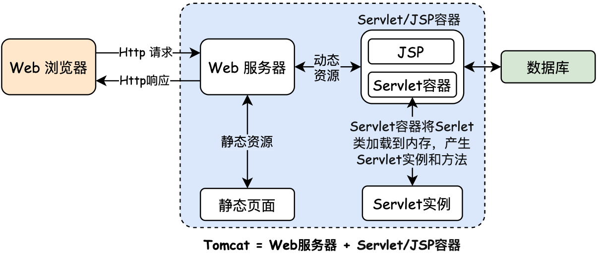

> <font color=SlateBlue>  <u>**Q1.Web容器与*Servlet*容器 的区别 ？**</u></font>
>&emsp;&emsp; 在JSP技术推出后，管理和运行 *Servlet/JSP* 的容器称为Web容器，web容器中包含 *Servlet* 容器，常用的java web容器包括***Tomcat***、JBoss、Resin。Web容器的主要作用是暴露端口，按照特定资源URL找到处理的servlet。然后处理请求。
>
><font color=SlateBlue>  <u>**Q2. Servlet(类) 和 Servlet容器 的区别 ？**</u></font>
>&emsp;&emsp; ● *Servlet* 容器：**Servlet容器也叫做Servlet引擎**，用于在发送的请求和响应之上提供网络服务，解码基于 *MIME* 的请求，格式化基于MIME (常用的MIME类型：text/html，application/pdf，video/quicktime，application /java，image/jpeg，application/jar，application/octet-stream，application/x- zip) 的响应。 Servlet容器在Servlet的生命周期内包容和管理Servlet类。Servlet容器将Servlet类载入内存，并产生Servlet实例和调用它具体的方法。**<font color=red>在一个应用程序中，每种Servlet类型只能有一个实例（以单例模式存在）</font>**。
>&emsp;&emsp; ● *Servlet* (类)：*Servlet* 类是指任何实现了这个 *Servlet* 接口的自定义类， Servlet没有 `main()` 方法，不能独立运行，它必须被部署到 *Servlet* 容器中，由容器来实例化和调用 *Servlet* 的方法。
>
><font color=SlateBlue>  <u>**Q3. Servlet线程安全问题 ？**</u></font>
>&emsp;&emsp; *Servlet* 是单实例多线程，当多个客户端并发访问同一个 *Servlet* 时，web服务器会为每一个客户端的访问请求创建一个线程，并在这个线程上调用service方法，因此，service方法内如果访问了同一个资源的话，就有可能引发线程安全问题。为了避免出现线程安全问题，使用Servlet最好保证 *Servlet* 是无状态的，也就是没有可以修改的成员变量。

&emsp;&emsp;*Servlet* 接口框架主要包括: *ServlerContext*、*ServlerConfig*、*Servlet*、*ServletRequest*、*ServletResponse* 五个部分组成。
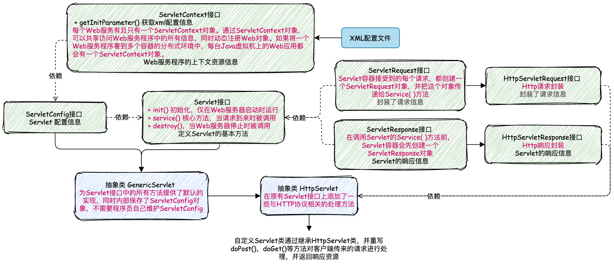

##### 2. *Servlet*的生命周期与工作过程

&emsp; &emsp; *Servlet* 实例对象是用户第一次访问时由 *Servlet* 容器创建，对象创建之后驻留在内存里面，响应后续的请求。***Servlet*  对象一旦被创建，`init()` 方法就会被执行，客户端的每次请求导致 `service()` 方法被执行，*Servlet* 实例对象被销毁时 ( Web服务器停止后或者Web应用从服务器里删除时 ) `destory()` 方法就会被执行。**
&emsp; &emsp; 当用户通过单击某个链接或者在浏览器中输入URL来请求资源时，Web服务器接收到该请求后，将该请求交给 *Servlet* 容器，*Servlet* 容器实例化 *Servlet*，调用 *Servlet* 的方法对请求进行处理， 并返回响应。响应由 *Servlet* 容器返回给Web服务器，Web服务器包装这个响应，以HTTP响应的形式发送给Web浏览器。


##### 3. *Servlet*的简单使用

&emsp;&emsp;*Servlet* 在使用时，通常通过自定义类来继承 *HttpServlet* 类，并重写 `init()`、`doPost()`、`doPut()`等方法。同时在Web.xml文件中添加Servlet的配置信息。

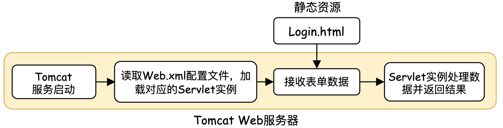

```html
1. 静态资源
//Local.html登录界面，部署在web目录下，可以通过http://localhost:8080/JavaDemoProject_Servlet/Login.html路径访问到该静态资源，其中<form>表单的动作映射指向LoginServlet。
<html>
<head>
    <meta http-equiv="Content-Type" content="text/html; charset=UTF-8" />
    <title>登录</title>
</head>
<body>

<form action="http://localhost:8088/JavaDemoProject_Servlet/LoginServlet" method="post">
    用户：<input type="text" name="username" /><br/>
    密码：<input type="password" name="password" /><br/>
    <input type="submit" value="登录" />
</form>
</body>
</html>
```

```java
2. Servlet实例
// LoginServlet 继承 HttpServlet 并重写了doGet(),doPost()方法
public class LoginServlet extends HttpServlet {
    //重写doGet方法
    public void doGet(HttpServletRequest request, HttpServletResponse response) throws IOException {
        String username = request.getParameter("username");
        //设置编码格式
        response.setContentType("text/html;charset=GB18030");
        response.getWriter().println("欢迎【" + username + "】用户登录成功！！！");
    }
    //重写doPost方法
    public void doPost(HttpServletRequest request, HttpServletResponse response) throws IOException {
        doGet(request, response);
    }
}
```

```java
3. Filter过滤器实例
public class MyFilter implements Filter {
    private FilterConfig filterConfig;
    @Override
    public void init(FilterConfig filterConfig) throws ServletException {
        this.filterConfig = filterConfig;
    }
    @Override
    public void doFilter(ServletRequest request, ServletResponse response, 
                         FilterChain chain) throws IOException, ServletException {
        if(request.getParameter("password").equals("")){	 //校验输入的密码参数是否为空
            response.setContentType("text/html;charset=GB18030");
            response.getWriter().println("请输入密码");
            return;		//return之后，过滤器链不会将请求传递到下一级的过滤器
        }
        if(request.getParameter("username").equals("null")){	//校验输入的用户名是否为null
            response.setContentType("text/html;charset=GB18030");
            response.getWriter().println("登录失败");
            return;	//return之后，过滤器链不会将请求传递到下一级的过滤器
        }
        chain.doFilter(request,response);  //过滤器链将请求传递到下一级的过滤器
    }
    @Override
    public void destroy() {
        this.filterConfig = null;
    }
}
```

```xml
4. Servlet配置文件
<!-- 
	① 首先浏览器通过http://localhost:8080/JavaDemoProject_Servlet/LoginServlet来找到web.xml <servlet-mapping>中的<url-pattern>，其他JavaDemoProject_Servlet为Tomcat容器的访问路径。
	② 匹配到了<url-pattern>后，就会找对应的Servlet的名字<servlet-name> - MyServlet;
	③ 知道了名字，就可以通过<servlet-name>找到<servlet-class>，也就能够知道Servlet的位置了。然后到其中找到对应的处理方式进行处理。
-->
<?xml version="1.0" encoding="UTF-8"?>
<web-app xmlns="http://xmlns.jcp.org/xml/ns/javaee"
         version="4.0">
    <context-param>
        <param-name>contextConfigLocation</param-name>
        <param-value>WEB-INF/applicationContext.xml</param-value>
    </context-param>
  
  	<!-- listener监听器配置信息 -->
    <listener>
        <listener-class>org.springframework.web.context.ContextLoaderListener</listener-class>
    </listener>
  
    <!-- filter过滤器配置信息 -->
    <filter>
        <!-- filter-name: 过滤器名称 -->
        <filter-name>MyFilter</filter-name>
				<!-- filter-class: filter全限定类名，也就是filter的位置 -->
        <filter-class>com.xzz.main.MyFilter</filter-class>
    </filter>
  	<!-- filer实例,过滤路径映射配置信息 -->
    <filter-mapping>
        <filter-name>MyFilter</filter-name>
        <url-pattern>/LoginServlet</url-pattern>
    </filter-mapping>
     
  	<!-- servlet实例配置信息 -->
    <servlet>   
      	<!-- servlet-name: Servlet名字 -->
        <servlet-name>MyServlet</servlet-name>        	         
      	<!-- servlet-class: Servlet全限定类名，也就是Servlet的位置 -->
        <servlet-class>com.xzz.main.LoginServlet</servlet-class>
    </servlet>
  	<!-- servlet实例路径映射配置信息 -->
    <servlet-mapping>
        <servlet-name>MyServlet</servlet-name>		<!-- Servlet名字，与上面的名字相同 -->
        <url-pattern>/LoginServlet</url-pattern>  <!-- 浏览器通过该URL路径可以找到该Servlet实例 -->
    </servlet-mapping>
</web-app>
```

#### 3.1.2 *Filter*

&emsp;&emsp;*Filter* 的作用是对 *Servlet* 容器传给Web资源的 *request* 对象和 *response* 对象进行检查和修改，实现用户在访问某个目标资源之前，对访问的请求和响应进行拦截，一般常用于实现URL级别的权限访问控制、过滤敏感词汇、压缩响应信息等功能。<font color=green>过滤器并不是必须要将请求传递到下一个过滤器或目标资源，它可以自行对请求进行处理，并发送响应给客户端，也可以将请求转发或重定向到其他的Web资源。</font>*Filter* 使用的是责任链设计模式。


##### 1. *Filter* 生命周期与工作过程

&emsp;&emsp; *Filter* 的生命周期分为三个阶段: 初始化阶段、拦截和过滤阶段、销毁阶段。
&emsp; &emsp; ● 初始化阶段：*Servlet* 容器负责加载和实例化*Filter* 。容器启动时，读取 *web.xml* 的配置信息对所有的过滤器进行加载和实例化。加载和实例化完成后，*Servlet* 容器调用 `init()` 方法初始化 *Filter* 实例。
&emsp; &emsp; ● 拦截和过滤阶段：当客户端请求访问 Web资源时，*Servlet* 容器会根据 *web.xml* 的过滤规则进行检查。当客户端请求的 URL 与过滤器映射匹配时，容器将该请求的 *request* 对象、*response* 对象以及 *FilterChain* 对象以参数的形式传递给 *Filter* 的 `doFilter()` 方法，对请求/响应进行拦截和过滤。 
&emsp; &emsp; ● 销毁阶段：*Filter* 对象创建后会驻留在内存中，直到容器关闭或应用被移除时销毁。销毁 *Filter* 对象之前，容器会先调用 `destory()` 方法，释放过滤器占用的资源。在 *Filter* 的生命周期内，`destory()` 只执行一次。

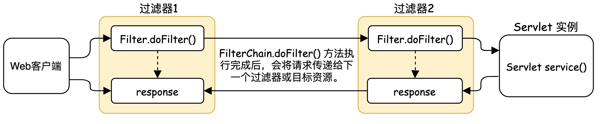

#### 3.1.3 *Listener*

&emsp;&emsp; *Listener* 用于监听Java对象的方法调用或属性改变，当被监听对象发生上述事件后，监听器某个方法立即被执行。监听器 *Listener* 按照监听的事件分为3类：
 &emsp; &emsp; ① 监听对象创建和销毁的监听器：*Servlet* 规范定义了监听 *ServletContext*、*HttpSession*、*HttpServletRequest* 这三个对象创建和销毁事件的监听器。
 &emsp; &emsp; ② 监听对象中属性变更的监听器：*Servlet* 规范定义了监听 *ServletContext*、*HttpSession*、*HttpServletRequest* 这三个对象中的属性变更事件的监听器。
 &emsp; &emsp; ③ 监听 *HttpSession* 中对象状态改变的监听器：*Session* 中的对象可以有多种状态，绑定到 *Session* 中、从 *Session* 中解除绑定、随 *Session* 对象持久化到存储设备中(钝化)、随 *Session* 对象从存储设备中恢复(活化)

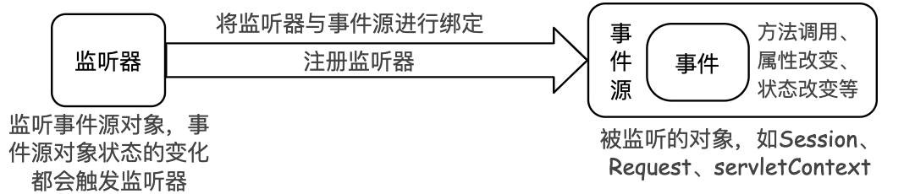

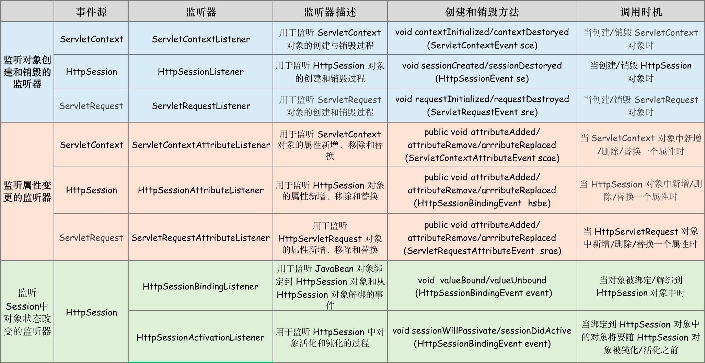

&emsp;&emsp;注册 *Servlet* 监听器有2种方式，分别是：① 在 *web.xml* 中注册监听器；② 使用注解 `@WebListener` 注册监听器。

```java
1. 在web.xml中使用 <listener> 标签配置监听器，Web容器会自动把监听器注册到事件源中
<?xml version="1.0" encoding="UTF-8"?>
<web-app xmlns="http://xmlns.jcp.org/xml/ns/javaee"
    xmlns:xsi="http://www.w3.org/2001/XMLSchema-instance"
    xsi:schemaLocation="http://xmlns.jcp.org/xml/ns/javaee http://xmlns.jcp.org/xml/ns/javaee/web-app_4_0.xsd"
    version="4.0">
    <listener>
        <listener-class>net.biancheng.www.listener.MySessionListener</listener-class>
    </listener>
</web-app>
          
2. 在监听器类上使用@WebListener注解，可以将该Java类注册为一个监听器类
@WebListener
public class MyListener implements ServletContextListener {
    @Override
    public void contextInitialized(ServletContextEvent sce) {  }

    @Override
    public void contextDestroyed(ServletContextEvent sce) {   }
}
```

### 3.2 Spring MVC

&emsp;&emsp; Spring MVC是一个基于Java的实现了MVC架构模式的请求驱动类型的轻量级Web框架，本质上相当于Servlet，Spring MVC本身就是Spring框架的一部分。Spring MVC通过把模型( *Model* )、视图( *View* )、控制器( *Controller* )分离，将web层进行职责解耦，降低了视图与业务逻辑间的双向耦合。 
&emsp; &emsp; ●  ***Model* - 模型**：数据模型，提供要展示的数据，包含数据和逻辑行为。Model模型通常又会分为数据层 *DAO* 和服务层 *Service*，也就是模型提供了模型数据查询和模型数据的状态更新等功能，包括数据和业务。 
&emsp; &emsp; ●  ***View* - 视图**：负责进行模型的展示，一般就是指用户界面。 
&emsp; &emsp; ●  ***Controller* - 控制器**：接收用户请求，委托给模型进行处理，处理完毕后把返回的模型数据返回给视图，由视图负责展示。

Spring MVC请求处理的流程如下图所示：


&emsp; ① 用户向服务器发送请求，请求会到 *DispatcherServlet*，*DispatcherServlet* 对请求URL进行解析，得到请求资源标识符URI； 
&emsp; ② 根据该URI，调用 *HandlerMapping* 获得该 *Handler*  配置的所有相关的对象（包括一个 *Handler* 处理器对象、多个 *HandlerInterceptor* 拦截器对象），最后以 *HandlerExecutionChain* 对象的形式返回； 
&emsp; ③ *DispatcherServlet* 根据获得的 *Handler*，选择一个合适的 *HandlerAdapter*。提取 *Request*请求中的模型数据，填充 *Handler* 入参，开始执行 *Handler* ( *Controller* )
&emsp; ④ *Handler* 执行完成后，向 *DispatcherServlet*  返回一个 *ModelAndView* 对象； 
&emsp; ⑤ 根据返回的 *ModelAndView*，选择一个适合的 *ViewResolver* 返回给 *DispatcherServlet*；
&emsp; ⑥ *ViewResolver* 结合 *Model* 和 *View*来渲染视图，最后将渲染结果返回给客户端。

### 3.3 Spring Framework

&emsp;&emsp;*Spring Framework* 是一个基于IOC和AOP的构架多层J2EE系统的框架，*Spring Framework* 是整个*Spring* 生态的基石，其他的项目以及整合的其他框都是依赖 *Spring Framework*。*Spring Framework* 的框架如下图所示，其中的每一个模块都可以单独存在：


#### 3.3.1 *DI* 技术 (依赖注入)

&emsp;&emsp; 所谓依赖，是指一个类Class A，一个类Class B，如果A中的某个方法需要引用B，则称Class A依赖Class B。这种依赖关系导致了在Class A的整个生命周期中，需要去维护引用的Class B，这样大大增加了代码之间的耦合程度。 为了降低耦合度，更加清晰的描述对象与对象之间的依赖关系，提出了依赖注入的原则，其核心思想就是要**将这种具体类之间的依赖，转换成抽象依赖，对象被动的接受依赖类而不是自己主动的去查找依赖类，即对象不是从容器中查找它的依赖类，而是容器实例化对象时主动将对象的依赖类注入给该对象**。<font color=green>**依赖注入的目的并非为软件系统带来更多功能，而是为了提升组件重用的频率，并为系统搭建一个灵活、可扩展的平台**。</font>
&emsp;&emsp;常用的依赖注入方式有三种：<font color=red>**构造方法注入，*setter( )*方法注入，基于接口注入**</font>
&emsp;&emsp;① 构造方法注入：基于构造函数，实现特定参数的构造函数，在新建对象时传入所依赖的对象。
&emsp;&emsp;② ***setter( )*** 方法注入：基于set方法，实现特定属性的public
set方法，让外部容器调用传入所依赖的对象。
&emsp;&emsp;③ 接口注入：实现特定接口，以供外部容器注入所依赖类型的对象。


#### 3.3.2  *IoC* 技术 (控制反转)

&emsp;&emsp;IoC 不是什么技术，而是一种<font color=green>**设计思想**</font>，指导如何设计出松耦合。传统应用程序都是由我们在类内部主动创建依赖对象，从而导致类与类之间高耦合；有了IoC容器后，把<font color=red>**创建和查找依赖对象的控制权交给了 IoC 容器**</font>，由IoC容器进行注入组合对象，在开发过程中不在需要关注对象的创建和生命周期的管理，所以对象与对象之间是松散耦合。对于Spring生态来说，IoC是Spring框架的核心，**由Spring来负责控制对象的生命周期和对象间的关系，IoC容器负责实例化、定位、配置应用程序中的对象及建立这些对象间的依赖**。


&emsp;&emsp;在Spring框架当中，提供了两种基本的IoC容器： 
&emsp;&emsp;①  <font color=red>**Spring *BeanFactory* 容器**</font>：最简单的容器，给DI提供了基本的支持。移动设备中为了节省有限的资源，会被优先选择，即主要用于轻量级应用。 
&emsp;&emsp; ● 其用 `org.springframework.beans.factory.BeanFactory`
接口来定义。*BeanFactory* 是IoC容器的核心接口，它定义了IoC的配置框架和基本功能。
&emsp;&emsp; ● *BeanFactory* 只能**<font color=green>管理单例( *Singleton* ) *Bean*的生命周期，它不能管理原型( *prototype*,非单例 ) *Bean* 的生命周期</font>**，因为原型 *Bean* 实例被创建之后便被传给了客户端,容器失去了对它们的引用。
&emsp;&emsp; ● *BeanFactorty* 接口提供了配置框架及基本功能，但是无法支持 Spring的 Aop 功能和 web 应用。 
&emsp;&emsp;②  <font color=red> **Spring *ApplicationContext* 容器**</font>：在 *BeanFactory* 容器的基础上，添加了更多的功能。 
&emsp;&emsp; ● 其用`org.springframework.context.ApplicationContext`接口来定义。它继承了 *BeanFactory* 的基本功能，同时也继承了容器的高级功能，如：*MessageSource* (国际化资源接口-提供国际化的消息访问)`、`*ResourceLoader* (资源加载接口-提供资源访问，如URL，配置文件等)`、`*ApplicationEventPublisher* (应用事件发布接口)。

> <font color=SlateBlue>  <u>**Q1. IoC 与的 DI 的区别 ？**</u></font>
>&emsp;&emsp;① IoC 是从容器的角度在描述，容器控制应用程序，由容器反向的向应用程序注入应用程序所需要的外部资源。
>&emsp;&emsp;② DI 是从应用程序的角度在描述，即应用程序依赖容器创建并注入它所需要的外部资源
>
><font color=SlateBlue>  <u>**Q2. *BeanFactory* 容器 与 *ApplicationContext* 容器的区别 ？**</u></font>
>&emsp;&emsp;① **加载时机不同**：*BeanFactroy* 采用的是**延迟加载**形式来注入 *Bean* 的，即只有在使用到某个 *Bean* 时( 调用 `getBean()`方法 )，才对该 *Bean* 进行加载实例化。而 *ApplicationContext* 在容器启动时，一次性创建所有的 *Bean*，在容器启动时，我们就可以发现Spring中存在的配置错误。ApplicationContext唯一的不足是占用内存空间。当应用程序配置Bean较多时，程序启动较慢。
>&emsp;&emsp;② **注册过程不同**：BeanFactory和ApplicationContext都支持BeanPostProcessor、BeanFactoryPostProcessor的使用，但两者之间的区别是：BeanFactory需要通过编程手动实现注册，而ApplicationContext通过配置文件可以实现自动注册。
>&emsp;&emsp;③ **面向对象不同**：BeanFactory主要是面对Spring框架的基础设施，面对 Spring自己。而Applicationcontext主要面对使用Spring的开发者。

#### 3.3.3  *Spring Bean*

&emsp;&emsp;在 Spring 中，由<font color=red>**IoC容器管理的组成应用程序的对象称为 *Spring Bean***</font>，*Spring Bean*就是由IoC容器初始化、装配及管理的对象。*Spring Bean* 与IoC容器的关系如下图所示：


> <font color=SlateBlue>  <u>**Q1. *JavaBean* 与 *Spring Bean* 的区别 ？**</u></font>
>&emsp;&emsp;① *JavaBean* 是指一种遵循特定规则的Java类，符合这个规则的类都可以称为 *JavaBean*，也可以说 *JavaBean* 是一种Java语言编写的可重用“组件”，即**一次编写，任何地方执行，任何地方重用**。一个类可以称为 *JavaBean* 必须遵守以下几个规则：
>&emsp; &emsp; ● 类中的所有属性均为 *private*；
>&emsp; &emsp; ● 类中要提供默认构造方法；
>&emsp; &emsp; ● 对于类中的所有属性，要提供 *getter* 方法和 *setter* 方法；
>&emsp; &emsp; ● 该类要实现 *serializable* 接口；
>&emsp;&emsp;② *SpringBean* 是受 *Spring* 管理的对象  所有能受 *Spring* 容器管理的对象都可以成为 *SpringBean*.
>&emsp;&emsp;③ 两者<font color=red>**用处不同**</font>：传统 *Javabean* 更多地作为值传递参数，而 *Spring* 中的 *Bean* 用处几乎无处不在，任何组件都可以被称为 *Bean*。
>&emsp;&emsp;④ 两者<font color=red>**写法不同**</font>：传统 *Javabean* 作为值对象，要求遵守 *JavaBean* 的规则；但 *Spring* 中的 Bean只需为接受设值注入的属性提供 *setter* 方法。
>&emsp;&emsp;⑤ 两者<font color=red>**生命周期不同**</font>：传统 *Javabean* 作为值对象传递，不接受任何容器管理其生命周期；*Spring* 中的 *Bean* 有 *Spring* 管理其生命周期行为。

##### 1.  *IoC* 容器与Bean

##### <font color=Sienna>**1.  *Bean* 的配置 (*Bean* 的注册 -> *IoC* 容器)**</font>

&emsp;&emsp; Bean的配置分为三种方式，**XML注册**，**注解注册**和**基于类提供Bean信息**：


&emsp;&emsp; **① 基于XML配置文件 - (原始Bean注册方式)**

```java
// HelloService.java - 定义HelloService接口
package com.xzz.beandemo;
public interface HelloService {
    public void sayHello();  
}

// HelloServiceImpl.java - 实现HelloService接口，实现简单输出
public class HelloServiceImpl implements HelloService{
    public void sayHello(){
        System.out.println("Hello World!");
    }
}

// 😊 Service.php - 在需要调用HelloServiceImpl Bean对象的类中，加载Bean对象
public class HelloServiceTest {
    public void testHelloWorld() {
        // 1、读取配置文件实例化一个IOC容器
        ApplicationContext context = new ClassPathXmlApplicationContext("helloworld.xml");
        // 2、从容器中获取Bean，注意此处完全“面向接口编程，而不是面向实现”
        // getBean()来获取Spring容器中已初始化的bean
        HelloService helloService = context.getBean("helloService", HelloService.class);
        // 3、执行业务逻辑
        helloService.sayHello();
    }
}
```

```xml
// helloworld.xml - Bean的XML配置文件
<?xml version="1.0" encoding="UTF-8"?>
<beans xmlns="http://www.springframework.org/schema/beans"
  xmlns:xsi="http://www.w3.org/2001/XMLSchema-instance"
  xmlns:context="http://www.springframework.org/schema/context"
  xsi:schemaLocation="
      http://www.springframework.org/schema/beans        
      http://www.springframework.org/schema/beans/spring-beans-3.0.xsd
      http://www.springframework.org/schema/context                
      http://www.springframework.org/schema/context/spring-context-3.0.xsd">
    
  <!-- id 表示组件的名字，class表示组件类,即需要通过IoC管理的包名+类名 -->
  <bean id="helloService" class="com.xzz.beandemo.HelloServiceImpl" />
</beans>
```

&emsp;&emsp; **② 使用注解@Component配置Bean - (自动化装配)**
&emsp;&emsp; 使用XML文件进行配置，Bean定义信息和Bean实现类本身是分离的，同时大量的配置信息会导致配置文件臃肿。**采用基于注解的配置方式时，通过在Bean实现类上标注@Component注解，同时在xml文件中配置component-scan进行@Component注解的扫描**。<font color=red>**Spring自带四种Bean注解：@Component注解及扩展@Repository、@Service、@Controller**</font>。


&emsp;&emsp; <font color=green> ●**@Component:** 泛指组件，当组件不好归类时，用这个注解标注，相当于在xml文件中定义 **<bean id="" class=""/>**;</font>
&emsp;&emsp; <font color=green> ●**@Repository: **用于对DAO实现类进行标注;</font>
&emsp;&emsp; <font color=green> ●**@Service: **用于对Service实现类进行标注；</font>
&emsp;&emsp; <font color=green> ●**@Controller: **用于对Controller实现类进行标注；</font>

```java
package com.xzz.beandemo;
import org.springframework.stereotype.Component;
import org.springframework.stereotype.Repository;
// 通过Repository定义一个Bean
@Component("userDao")  //注解参数=bean id,如果没有设置参数，则默认为全小写的类名 - userdao
public class UserDao {
}
```

&emsp;&emsp;在使用注解进行配置Bean的同时，需要通过`context`的命名空间，来扫描类包以应用注解定义Bean的方式：

```xml
<?xml version="1.0" encoding="UTF-8" ?>
<!--①声明context的命名空间-->
<beans xmlns="http://www.springframework.org/schema/beans"
    xmlns:xsi="http://www.w3.org/2001/XMLSchema-instance" 
    xmlns:context="http://www.springframework.org/schema/context"
    xsi:schemaLocation="http://www.springframework.org/schema/beans 
         http://www.springframework.org/schema/beans/spring-beans-3.0.xsd
         http://www.springframework.org/schema/context
         http://www.springframework.org/schema/context/spring-context-3.0.xsd"
         >
    <!--②通过context命名空间的component-scan的base-package属性指定一个需要扫描的基类包, 
 		Spring容器将会扫描这个基类包里的所有类，并从类的注解信息中获取Bean的定义信息-->
   <context:component-scan base-package="com.xzz"/>
   <!--如果仅希望扫描特定的类而非基包下的所有类，可以使用resource-pattern属性过滤特定的类,如仅扫描beandemo包的类-->
   <context:component-scan base-package="com.xzz" resource-pattern="beandemo/*.class"/ >
</beans>
```

&emsp;&emsp; **③ 基于类提供Bean信息 - (第三方库的装配)**
&emsp;&emsp;无论是基于XML配置还是注解配置，都需要通过XML的配置文件。对此，Spring提供了`@Configuration`注解，<font color=green>**`@Configuration`标注在类上，相当于把该类作为spring的xml配置文件中的`<beans>`来配置spring容器**。</font>同时**被注解的类内部包含有一个或多个被@Bean注解的方法**，这些方法将会被`AnnotationConfigApplicationContext`或`AnnotationConfigWebApplicationContext`类进行扫描，并构建bean定义，初始化Spring容器。

> <font color=SlateBlue>  <u>**Q1. @Component 与 @Bean 的区别 ？**</u></font>
> &emsp;&emsp;@Component和@Bean的目的是一样的，都是注册bean到IoC容器中。但两者在使用上存在以下区别：
> &emsp; &emsp; ● @Component作用在类上，通过类路径扫描@ComponentScan自动检测并注入到Spring容器中;
> &emsp; &emsp; ● @Bean不能注释在类上，只能用于在配置类中显式声明单个bean。在应用开发的过程中，如果想要将第三方库中未装配到IoC的组件装配到IoC中，在这种情况下，是没有办法在它的类上添加@Component注解的，因此就不能使用自动化装配的方案，仅能在@Configuration配置类中通过@Bean进行配置。

```java
// TestBean.java - 需要加入IoC容器的Bean类
package com.xzz.configurationdemo;
@Component    // @Component = <bean id=...> 配置类为Bean类，加入IoC容器
public class TestBean {  // Bean类
    private String test; 
    public void start() {
        System.out.println("TestBean 初始化。。。" + test);
    }
    public void stop() {
        System.out.println("TestBean 停止运行。。。" + test);
    }
}

// TestConfiguration.java - 配置类，用于配置@Component注解的扫描
// 配置类 - 相当于<beans>的xml配置文件，当Spring容器启动后会自动扫描被@Configuration注解的类，
// 并执行类中注册@Bean的方法。
import org.springframework.context.annotation.Bean;
import org.springframework.context.annotation.Configuration;
import org.springframework.context.annotation.Scope;
import com.xzz.configurationdemo;
@Configuration
@ComponentScan(basePackages = "com.xzz.configurationdemo")  
/*添加自动扫描注解，basePackages为扫描的包路径,扫描完成后，会将被@Component注解的类添加到IoC容器中 */
public class TestConfiguration {
    public TestConfiguration() {
        System.out.println("TestConfiguration容器启动初始化。。。");
    }
    @Bean    //@Bean负责注册Bean到IoC容器
  	public TestBean testBean(){
    		return new TestBean();
    }
  	
}

//TestMain.java
//主方法类
import org.springframework.context.ApplicationContext;
import org.springframework.context.annotation.AnnotationConfigApplicationContext;
public class TestMain {
    public static void main(String[] args) {
        ApplicationContext context = new AnnotationConfigApplicationContext(TestConfiguration.class);      
      	TestBean tb = (TestBean) context.getBean("testBean"); //获取bean
        tb.sayHello();
    }
}

```

##### <font color=Sienna>**2.  *Bean* 的注入 (从IoC 容器中添加到类中)**</font>

&emsp;&emsp; 配置完Bean类后，IoC容器启动时，会根据配置将Bean类实例化，并”注册“到IoC容器当中。当应用程序需要使用Bean类时，通过**Bean注入**的方式，将Bean的实例化对象注入到程序中，从而在程序中可以不创建对象就直接使用Bean。对于Bean的注入有两种方式：**XML配置注入**(属性注入、构造函数注入和工厂方法注入) 和 **注解注入** (@Autowired,@Resource,@Required)。
&emsp;&emsp;**① XML配置注入**
&emsp;&emsp; **● 属性注入**：属性注入通过setter方法注入Bean的属性值或依赖。属性注入要求Bean提供一个默认的**构造函数**，并为需要注入的属性提供对应的Setter方法。<font color=green>Spring先调用Bean的默认构造函数实例化Bean对象，然后通过反射的方式调用Setter方法注入属性值。</font>
&emsp;&emsp; **● 构造方法注入**：使用构造函数注入的前提是Bean必须提供带参数的构造函数
&emsp;&emsp; **● 工厂方法注入**：工厂类负责创建一个或多个目标类实例，工厂类方法一般以接口或抽象类变量的形式返回目标类实例。非静态工厂方法，必须实例化工厂类后才能调用工厂方法。静态工厂方法，无须创建工厂类实例就可以调用工厂类方法。

```java
package com.xzz.demo;
import org.springframework.beans.factory.BeanNameAware;
// Bean类
public class Service implements BeanNameAware{
    private LogDao logDao;
    private UserDao userDao;

  	public LogonService(LogDao logDao, UserDao userDao) {  //构造方法注入
        this.logDao = logDao;
        this.userDao = userDao;
    }
  
    public void setUserDao(UserDao userDao) {    //属性注入 - setter方法注入
        this.userDao = userDao;
    }
    public void setLogDao(LogDao logDao) {
        this.logDao = logDao;
    }   
    public LogDao getLogDao() {
        return logDao;
    }
    public UserDao getUserDao() {
        return userDao;
    }    
}
```

```xml
// bean.xml配置文件
<?xml version="1.0" encoding="UTF-8" ?>
<beans xmlns="http://www.springframework.org/schema/beans"
    xmlns:xsi="http://www.w3.org/2001/XMLSchema-instance" 
    xmlns:context="http://www.springframework.org/schema/context"
    xsi:schemaLocation="http://www.springframework.org/schema/beans 
         http://www.springframework.org/schema/beans/spring-beans-3.0.xsd
         http://www.springframework.org/schema/context
         http://www.springframework.org/schema/context/spring-context-3.0.xsd"
       default-autowire="byName">
  	<!-- 注册Bean -->
    <bean id="logDao" class="com.xzz.demo.LogDao"/>
    <bean id="userDao" class="com.xzz.demo.UserDao"/>
  
    <bean class="com.xzz.demo.Service">   <!-- 属性注入 -->
       <property name="logDao" ref="logDao"></property>
       <property name="userDao" ref="userDao"></property>
    </bean>
  
  	<bean class="com.xzz.demo.Service">   <!-- 构造方法注入 -->
       <constructor-arg ref="logDao"></constructor-arg>
       <constructor-arg ref="userDao"></constructor-arg>
    </bean>
</beans>
```

&emsp;&emsp;**② 注解注入**
&emsp;&emsp; 同样的XML方式注入需要通过XML配置文件进行配置。为了减少配置文件的”冗余“，Spring提供了<font color=red>**@Autowired**</font>注解实现Bean的依赖注入。**在使用@Autowired注解时，注入的Bean必须是被Spring管理的，即配置了bean或在类上添加了@Component注解**。

```java
package com.xzz.demo;
import org.springframework.beans.factory.BeanNameAware;
// Bean类
@Service
public class Service implements BeanNameAware{
    @Autowired	 //通过@Autowired注入LogDao的Bean
    private LogDao logDao;
    @Autowired  //通过@Autowired注入UserDao的Bean
  	@Qualifier("userDao")  //通过@Qualifier可以对注入Bean类型进行限定
    private UserDao userDao;

  	public LogonService(LogDao logDao, UserDao userDao) {  //构造方法注入
        this.logDao = logDao;
        this.userDao = userDao;
    }
  
    public void setUserDao(UserDao userDao) {    //属性注入 - setter方法注入
        this.userDao = userDao;
    }
    public void setLogDao(LogDao logDao) {
        this.logDao = logDao;
    }   
    public LogDao getLogDao() {
        return logDao;
    }
    public UserDao getUserDao() {
        return userDao;
    }    
}
```

##### <font color=Sienna>**3.  *Bean*生命周期 - 从*Bean*到*IoC***</font>

&emsp;&emsp;IOC是Spring Bean的容器，两者密不可分。在Spring中，从Bean的生成到注册到IoC容器中一共分为11个阶段，如下图所示：


&emsp;&emsp;<font color=green> 在 `DefaultListableBeanFactory类`中有个重要的字段：<font color=red>**`private final List<BeanPostProcessor> beanPostProcessors = new CopyOnWriteArrayList<>()`**</font>，该字段是 `BeanPostProcessor接口`的集合，`BeanPostProcessor接口`提供了很多方法，Spring在bean生命周期的不同阶段调用列表中的`BeanPostProcessor`中的一些方法来对生命周期进行扩展。**bean生命周期中的所有扩展点都是依靠这个集合中的`BeanPostProcessor`来实现的。**</font>

###### <font color=fpurple>**(1). Bean元信息配置阶段**</font>

&emsp;&emsp; Bean元信息的配置分为四种方式： 
&emsp;&emsp;&emsp;① **API方式：**手动的将BeanDefinition注册到Spring容器当中； 
&emsp;&emsp;&emsp;② **xml文件配置：**通过xml文件配置bean &emsp;&emsp;&emsp;③ **Properties文件配置：**将bean定义信息放在properties文件中，然后通过解析器将配置信息解析为BeanDefinition对象；
&emsp;&emsp;&emsp;④ **注解配置方式：**类上标注@Compontent注解来定义一个bean或者配置类中使用@Bean注解来定义bean。
&emsp;&emsp;在Spring容器启动的过程中，会将Bean的配置解析成Spring内部的 `BeanDefinition` 结构，`BeanDefinition`里面里面包含了bean定义的各种信息，如：bean对应的class、scope、lazy信息、dependOn等信息。无论是通过xml配置文件的`<Bean>`标签，还是通过注解配置的`@Bean`，还是`@Compontent`标注的类，还是扫描得到的类，最终都会被解析成一个 `BeanDefinition` 对象，最后Bean工厂就会根据这份Bean的定义信息，对bean进行实例化、初始化等等操作。

```java
// Car.java
public class Car {
    private int money;
    private String brand;
    public Car(){
        System.out.println("Car Constructor");
    }
		// 注意：getter和setter省略
}

// User.java
public class User {
    private String name;
    private int age;
    private Car car;
  	public User(){
        System.out.println("User Constructor");
    }
		// 注意：getter和setter省略
}

// main.java
public class Main {
  	public static void main(String[] args){
    		// 创建IoC容器
        DefaultListableBeanFactory dF = new DefaultListableBeanFactory();
      	// 通过BeanDefinitionBuilder工具类构造Car类的BeanDefinition
        BeanDefinition carBean = BeanDefinitionBuilder.rootBeanDefinition(Car.class.getName()).getBeanDefinition();
      	// 通过BeanDefinitionBuilder工具类构造User类的BeanDefinition
        BeanDefinition userBean = BeanDefinitionBuilder.rootBeanDefinition(User.class.getName()).
          addPropertyReference("car","car").
          getBeanDefinition();
      	// 将BeanDefinition注册到IoC容器中
        dF.registerBeanDefinition("car",carBean);
        dF.registerBeanDefinition("user",userBean);
      	// 从容器中获取Bean对象
        System.out.println(dF.getBean("car"));
        System.out.println(dF.getBean("user"));
    }
}

```

###### <font color=fpurple>**(2). Bean元信息配置解析阶段**</font>

&emsp;&emsp; Bean元信息配置解析阶段就是将各种方式定义的Bean配置信息解析成BeanDefinition对象，然后注册到Spring容器中。Bean元信息的配置解析分为三种方式：
&emsp;&emsp;① **Xml文件定义Bean的解析**：通过xml文件配置bean，Spring提供了一个类`XmlBeanDefinitionReader`用于解析xml配置文件。
&emsp;&emsp;② **Properties文件定义Bean的解析**: 将bean定义信息放在properties文件，通过解析器将配置信息解析为BeanDefinition对象；
&emsp;&emsp;③ **注解定义Bean的解析:**类上标注@Compontent注解来定义一个bean或者配置类中使用@Bean注解来定义bean。


```xml
<?xml version="1.0" encoding="UTF-8"?>
<beans xmlns="http://www.springframework.org/schema/beans"
       xmlns:xsi="http://www.w3.org/2001/XMLSchema-instance"
       xsi:schemaLocation="
      http://www.springframework.org/schema/beans
      http://www.springframework.org/schema/beans/spring-beans-3.0.xsd">

    <bean id="user1" name="user1" class="Other.User">
        <property name="name" value="yanxiao"/>
        <property name="age" value="40"></property>
    </bean>
    <bean id="user2" name="user2" class="Other.User">
        <property name="name" value="yanxiao"/>
        <property name="age" value="40"></property>
    </bean>
</beans>
```

```java
// main.java
public class Main {
  	public static void main(String[] args){
    		// 创建IoC容器
				DefaultListableBeanFactory dF = new DefaultListableBeanFactory();
 				// 创建Xml配置文件解析器 - 解析器需要绑定IoC容器，在解析后会直接生成BeanDefinition对象，存入IoC容器
        XmlBeanDefinitionReader xmlBeanDefinitionReader = new XmlBeanDefinitionReader(dF);
        // 读取xml文件，转换为Resource类型
        ClassPathResource resource = new ClassPathResource("META-INF/bean.xml");
        // 通过XmlBeanDefinitionReader加载xml配置文件，并生成BeanDefinition存储到IOC容器中
        int loadCount = xmlBeanDefinitionReader.loadBeanDefinitions(resource);
        System.out.println(loadCount);
				// 根据BeanDefinition Name 遍历读取BeanDefinition
        for(String beanName : dF.getBeanDefinitionNames()){
            BeanDefinition beanDefinition = dF.getBeanDefinition(beanName);
            Object bean = dF.getBean(beanName);
            System.out.println(beanDefinition.getClass().getName());
            System.out.println(beanDefinition);
            System.out.println(bean);
            System.out.println();
        }
    }
}
```

###### <font color=fpurple>**(3). Bean注册阶段**</font>

&emsp;&emsp; Bean注册阶段需要用到了 `BeanDefinitionRegistry` 接口，该接口定义了Bean的注册，删除等操作。在Spring中 `BeanDefinitionRegistry`接口有一个唯一的实现类 `DefaultListableBeanFactory`，因此大多数的情况都使用的是`DefaultListableBeanFactory`作为bean注册器。

```java
// DefaultListableBeanFactory 源码中实现的 registerBeanDefinition 注册Bean方法
// 注册Bean的本质是将BeanDefinition和BeanName以【Key - BeanName，Value - BeanDefinition】存入Map当中
@Override
	public void registerBeanDefinition(String beanName, BeanDefinition beanDefinition) throws BeanDefinitionStoreException {
		Assert.hasText(beanName, "Bean name must not be empty");
		Assert.notNull(beanDefinition, "BeanDefinition must not be null");
		if (beanDefinition instanceof AbstractBeanDefinition) {
			try {
				((AbstractBeanDefinition) beanDefinition).validate();
			}
			catch (BeanDefinitionValidationException ex) {
				throw new BeanDefinitionStoreException(beanDefinition.getResourceDescription(), beanName,
						"Validation of bean definition failed", ex);
			}
		}
		BeanDefinition existingDefinition = this.beanDefinitionMap.get(beanName);
		// 已经存在相同名称的BeanDefinition对象
		if (existingDefinition != null) {
      // 判断是否允许覆盖，若不允许覆盖，则直接抛异常
			if (!isAllowBeanDefinitionOverriding()) {
				throw new BeanDefinitionOverrideException(beanName, beanDefinition, existingDefinition);
			}
      // 如果允许覆盖，则将新的BeanDefinition进行覆盖
			else if (existingDefinition.getRole() < beanDefinition.getRole()) {
				// e.g. was ROLE_APPLICATION, now overriding with ROLE_SUPPORT or ROLE_INFRASTRUCTURE
				if (logger.isInfoEnabled()) {
					logger.info("Overriding user-defined bean definition for bean '" + beanName +
							"' with a framework-generated bean definition: replacing [" +
							existingDefinition + "] with [" + beanDefinition + "]");
				}
			}
			else if (!beanDefinition.equals(existingDefinition)) {
				if (logger.isDebugEnabled()) {
					logger.debug("Overriding bean definition for bean '" + beanName +
							"' with a different definition: replacing [" + existingDefinition +
							"] with [" + beanDefinition + "]");
				}
			}
			else {
				if (logger.isTraceEnabled()) {
					logger.trace("Overriding bean definition for bean '" + beanName +
							"' with an equivalent definition: replacing [" + existingDefinition +
							"] with [" + beanDefinition + "]");
				}
			}
			this.beanDefinitionMap.put(beanName, beanDefinition);
		}
    // 如果 beanDefinitionMap 中不存在对应的BeanName，则进行注册
		else {
      /* 
       *  @Q1: hasBeanCreationStarted()的作用是什么 ？
       *  		hasBeanCreationStarted()方法是用来判断是否已经有其他的Bean开始初始化，检查bean是否处于创建阶段,
			 *  这里如果已经存在bean的创建，那么代表我们已经开始进行了业务操作，此时Spring容器无法保证使用者是在线程
			 *	安全的情况下调用Bean，也就是无法保证下面的代码不会出现线程安全问题，所以需要对 beanDefinitionMap 加锁。
			 *	
			 *	@Q2: 为什么要将this.beanDefinitionMap.put(beanName, beanDefinition)也放入同步代码块中 ？
			 *			在将Bean加入到容器中时，beanDefinitionMap 与 beanDefinitionNames要同步添加，
			 * 	同时beanDefinitionNames是要按照注册顺序保存的，所以要将放入beanDefinitionMap的动作也进行同步，不然可能出现顺序错误。
			 *	
			 *	@Q3: 为什么在加锁后给集合中添加元素还要进行一次类似于复制的操作 (addAll)？
			 *			在业务操作过程中，很可能调用Spring的某些方法，这些方法需要遍历beanDefinitionNames，这些遍历方法通常都是			 
			 *  使用迭代器的，在迭代过程中如果我们又对集合进行了添加，移除的操作，会引发快速失败机制，为了避免这种情况所以选择新			 
			 * 	建一个集合然后进行复制。
			 */
			if (hasBeanCreationStarted()) {
				synchronized (this.beanDefinitionMap) {
            this.beanDefinitionMap.put(beanName, beanDefinition);
            List<String> updatedDefinitions = new ArrayList<>(this.beanDefinitionNames.size() + 1);
          
            updatedDefinitions.addAll(this.beanDefinitionNames);
            updatedDefinitions.add(beanName);
            this.beanDefinitionNames = updatedDefinitions;
            removeManualSingletonName(beanName);
				}
			}
      // Bean仍处于启动阶段，bean还没有开始注册，这时不需要考虑线程安全问题，直接加入IoC即可
			else {
				this.beanDefinitionMap.put(beanName, beanDefinition);
				this.beanDefinitionNames.add(beanName);
				removeManualSingletonName(beanName);
			}
			this.frozenBeanDefinitionNames = null;
		}
		if (existingDefinition != null || containsSingleton(beanName)) {
			resetBeanDefinition(beanName);
		}
		else if (isConfigurationFrozen()) {
			clearByTypeCache();
		}
	}
```

###### <font color=fpurple>**(4). BeanDefinition合并阶段**</font>

&emsp;&emsp; 在我们定义Bean的时候，有些Bean是存在父子关系，此时`子BeanDefinition`的信息中是不存在`父BeanDefinition`信息的。需要将子bean的`BeanDefinition`和父bean的`BeanDefinition`进行合并，得到最终的一个`RootBeanDefinition`。合并之后得到的`RootBeanDefinition`包含bean定义的所有信息，包含了从父bean中继继承过来的所有信息，后续bean的所有创建工作就是依靠合并之后`BeanDefinition`来进行的。

```apl
合并阶段调用的方法源码: org.springframework.beans.factory.support.AbstractBeanFactory#getMergedBeanDefinition
```

```xml
<!--bean.xml-->
<?xml version="1.0" encoding="UTF-8"?>
<beans xmlns="http://www.springframework.org/schema/beans"
       xmlns:xsi="http://www.w3.org/2001/XMLSchema-instance"
       xsi:schemaLocation="
      http://www.springframework.org/schema/beans
      http://www.springframework.org/schema/beans/spring-beans-3.0.xsd">
      <bean id="user1" name="user1" class="Other.User"/>
  		<!--user2是user1的子Bean-->
      <bean id="user2" parent="user1"> 
          <property name="name" value="zmh"/>
          <property name="age" value="40"/>
      </bean>
  		<!--user3是user2的子Bean，user1的孙Bean-->
      <bean id="user3" parent="user2">
          <property name="name" value="Xzz"/>
      </bean>
</beans>
```

```java
// main.java
//--Resource--
public class Main {
  	public static void main(String[] args){
    		// 创建IoC容器
				DefaultListableBeanFactory dF = new DefaultListableBeanFactory();
 				// 创建Xml配置文件解析器 - 解析器需要绑定IoC容器，在解析后会直接生成BeanDefinition对象，存入IoC容器
        XmlBeanDefinitionReader xmlBeanDefinitionReader = new XmlBeanDefinitionReader(dF);
        // 读取xml文件，转换为Resource类型
        ClassPathResource resource = new ClassPathResource("META-INF/bean.xml");
        // 通过XmlBeanDefinitionReader加载xml配置文件，并生成BeanDefinition存储到IOC容器中
        xmlBeanDefinitionReader.loadBeanDefinitions(resource);
				// 根据BeanDefinition Name 遍历读取BeanDefinition
        for(String name : factory.getBeanDefinitionNames()){
          		// 获取未合并的Bean
              BeanDefinition beanDefinition = factory.getBeanDefinition(name);
          		// 获取合并后的Bean
              BeanDefinition mergeDefinition = factory.getMergedBeanDefinition(name);
              System.out.println("BeanDefinition: "+beanDefinition);
              System.out.println("MergeDefinition: "+mergeDefinition);
              System.out.println();
          }
    }
}
//--output--
user1
  #BeanDefinition: Generic bean: class [Other.User]; scope=; abstract=false; lazyInit=false; autowireMode=0; dependencyCheck=0; autowireCandidate=true; primary=false; factoryBeanName=null; factoryMethodName=null; initMethodName=null; destroyMethodName=null; defined in class path resource [META-INF/bean.xml]
  #MergeDefinition: Root bean: class [Other.User]; scope=singleton; abstract=false; lazyInit=false; autowireMode=0; dependencyCheck=0; autowireCandidate=true; primary=false; factoryBeanName=null; factoryMethodName=null; initMethodName=null; destroyMethodName=null; defined in class path resource [META-INF/bean.xml]

user2
  #BeanDefinition: Generic bean with parent 'user1': class [null]; scope=; abstract=false; lazyInit=false; autowireMode=0; dependencyCheck=0; autowireCandidate=true; primary=false; factoryBeanName=null; factoryMethodName=null; initMethodName=null; destroyMethodName=null; defined in class path resource [META-INF/bean.xml]
  #MergeDefinition: Root bean: class [Other.User]; scope=singleton; abstract=false; lazyInit=false; autowireMode=0; dependencyCheck=0; autowireCandidate=true; primary=false; factoryBeanName=null; factoryMethodName=null; initMethodName=null; destroyMethodName=null; defined in class path resource [META-INF/bean.xml]

user3
  #BeanDefinition: Generic bean with parent 'user2': class [null]; scope=; abstract=false; lazyInit=false; autowireMode=0; dependencyCheck=0; autowireCandidate=true; primary=false; factoryBeanName=null; factoryMethodName=null; initMethodName=null; destroyMethodName=null; defined in class path resource [META-INF/bean.xml]
  #MergeDefinition: Root bean: class [Other.User]; scope=singleton; abstract=false; lazyInit=false; autowireMode=0; dependencyCheck=0; autowireCandidate=true; primary=false; factoryBeanName=null; factoryMethodName=null; initMethodName=null; destroyMethodName=null; defined in class path resource [META-INF/bean.xml]

//--Analysis--
   从结果可以看出，user2，user3未合并的Bean，其{parent class = null}，而合并后的Bean其{parent class = User}。说明未合并的子BeanDefinition是没有父BeanDefinition的信息的。获取user3合并的BeanDefinition时，内部会递归进行合并，先将user1和user2合并，然后将user2再和user3合并，最后得到合并之后的BeanDefinition。
```

###### <font color=fpurple>**(5). Bean Class加载阶段**</font>

&emsp;&emsp; Bean Class加载阶段就是将Bean的class名称转换为Class类型的对象。在 `BeanDefinition` 中有个字段 `private volatile Object beanClass`用来表示bean的class对象，这个字段的值有2种类型，一种是bean对应的Class类型的对象，另一种是bean对应的Class的完整类名，第一种情况不需要解析，第二种情况：即这个字段是bean的类名的时候，就需要通过类加载器将其转换为一个Class对象。

###### <font color=fpurple>**(6). Bean 实例化阶段**</font>

&emsp; &emsp;在得到合并后的`BeanDefinition`和Bean Class对象后，就可以对Bean进行实例化。<font color=green>**Bean实例化又分为2个操作过程：实例前操作、实例化操作。**</font>


&emsp;&emsp;**● 实例化前阶段**
&emsp; &emsp; 实例化前阶段目的是给开发者提供了一个扩展点，<font color=green>允许开发者通过重写`postProcessBeforeInstantiation方法`，并在该方法中自定义bean属性，并直接返回当前bean的实例。**spring自带的实例化bean的过程就被跳过了 (即不会按照该Bean的配置进行实例化)**。</font>在实际开发中，在实例化前阶段对bean的创建进行干预的情况，用的非常少。大部分bean的创建是根据配置，通过Spring进行实例化。

```xml
<?xml version="1.0" encoding="UTF-8"?>
<beans xmlns="http://www.springframework.org/schema/beans"
       xmlns:xsi="http://www.w3.org/2001/XMLSchema-instance"
       xsi:schemaLocation="
      http://www.springframework.org/schema/beans
      http://www.springframework.org/schema/beans/spring-beans-3.0.xsd">
      <bean id="user1" name="user1" class="Other.User"/>
      <bean id="user2" parent="user1">
          <property name="name" value="demo"/>
          <property name="age" value="40"/>
      </bean>
</beans>
```

```java
// main.java
//--Resource--
public class Main {
  	public static void main(String[] args){
    		// 创建IoC容器
				DefaultListableBeanFactory dF = new DefaultListableBeanFactory();
 				// 创建Xml配置文件解析器 - 解析器需要绑定IoC容器，在解析后会直接生成BeanDefinition对象，存入IoC容器
        XmlBeanDefinitionReader xmlBeanDefinitionReader = new XmlBeanDefinitionReader(dF);
        // 读取xml文件，转换为Resource类型
        ClassPathResource resource = new ClassPathResource("META-INF/bean.xml");
        // 通过XmlBeanDefinitionReader加载xml配置文件，并生成BeanDefinition存储到IOC容器中
        xmlBeanDefinitionReader.loadBeanDefinitions(resource);
				/* 
				*		向容器中添加BeanPostProcessor，在"user2"的Bean实例化前阶段，
				*		重写postProcessBeforeInstantiation方法，在方法中对"user2"进行自定义，并返回user2实例化后的对象。
				*/
        factory.addBeanPostProcessor(new InstantiationAwareBeanPostProcessor() {
              @Override
              public Object postProcessBeforeInstantiation(Class<?> beanClass, String beanName) throws BeansException {
                  if(beanName.equals("user2")){
                      User user = new User();
                      user.setName("DemoName");
                      return user;
                  }
                  return null;
              }
          });
          User user = (User)factory.getBean("user2");
          System.out.println(“user2: ” + user.getName());
    }
}
//--output--
user2: DemoName
  
//--Analysis--
  从结果可以看出，user2的Bean配置文件中的name属性定义的是“demo”。由于在"user2"的Bean实例化前进行了"干预"，因此输出的结果是扩展点返回的user2实例化对象
```

&emsp;&emsp;**● 实例化阶段**
&emsp;&emsp; Bean的实例化过程是通过反射调用Bean的构造器来创建Bean的实例。

###### <font color=fpurple>**(7). 合并后的BeanDefinition处理阶段**</font>

###### <font color=fpurple>**(8). Bean 属性配置阶段**</font>

###### <font color=fpurple>**(9). Bean 初始化阶段**</font>

###### <font color=fpurple>**(10). Bean 使用阶段**</font>

###### <font color=fpurple>**(11). Bean 销毁阶段**</font>

#### 3.3.4  *Aop* 面向切面编程

&emsp; &emsp; *AOP* 称为面向切面编程，**通过预编译方式和运行期动态代理实现程序功能的统一维护的一种技术。**利用 *AOP*可以对业务逻辑的各个部分进行隔离，可以无侵入的在原本功能的切面层添加自定义代码，从而<font color=red>**增强原有代码逻辑功能，同时也使得业务逻辑各部分之间的耦合度降低，提高程序的可重用性**</font>。切面就是把非业务逻辑相关的代码抽取出来定位到具体的连接点上的一种实现方式。

> <font color=SlateBlue>  <u>**Q1. *AOP* 与 *OOP* 的区别 ？**</u></font>
> &emsp; &emsp; *AOP* (面向切面编程) 和 *OOP* (面向对象编程) 是不同领域的两种思想，*OOP* 主要是针对业务处理过程中的<font color=green>**实体的属性和行为的抽象与封装**</font>，以获得更加清晰高效地逻辑单元。*AOP* 是针对业务处理过程中的切面进行提取，面对的是<font color=green>**处理过程中某个步骤或阶段**</font>，以获得逻辑过程中各部分之间低耦合性的隔离效果。
>
> <font color=SlateBlue>  <u>**Q2. *AOP* 的应用场景？**</u></font>
> &emsp;&emsp;只要系统的业务开发过程中大部分都使用通用模块都可以通过AOP来实现。如: ① 参数校验和判空; ② 数据的埋点; ③ 日志记录; ④ 事务处理; ⑤ 权限与安全控制; ⑥ 异常处理。

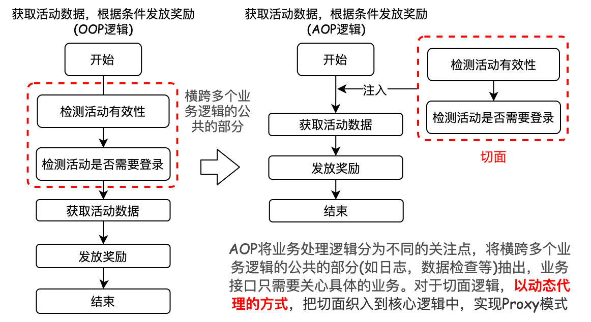

&emsp;&emsp;  *AOP* 主要有以下几个概念:
&emsp; &emsp; **① 连接点 ( *joint point* )**：具体的切面点的抽象概念，可以是在字段、方法上。Spring中具体表现形式是切入点( *PointCut* )，仅作用在方法上，包括方法调用，对类成员的访问以及异常处理程序块的执行等。
&emsp; &emsp; **② 增强/通知 ( *Advice* ) **：在连接点进行的具体操作，如何对原有逻辑进行增强处理的，分为前置( ***Before*** )、后置( ***After*** )、异常( ***AfterThrowing*** )、最终( ***AfterReturning*** )、环绕( ***Around*** )五种情况。
&emsp; &emsp;**③ 目标对象 ( *Target* ) **：被 *AOP* 框架进行增强处理的对象，也被称为被增强的对象。
&emsp; &emsp; **④ 织入 ( *Weaving* ) **：将增强处理添加到目标对象中，通过动态代理的方式创建一个被增强的对象的过程。
&emsp; &emsp; **⑤ 切面 ( *Aspect* ) **：包含着一些 *Pointcut* 以及相应的 *Advice* 的抽象概述。
&emsp; &emsp; **⑥ 切点 ( *Pointcut* ) **：表示一组 *joint point*，作用就是提供一组规则来匹配 *joint point*, 给满足规则的 *join point* 添加 *Advice*。


### 3.4 Spring Boot

## 四. Java 基础框架组件

&emsp;&emsp;大量的应用使用Java进行开发，其原因之一是Java拥有非常丰富和框架与基础组件，这些框架与组件使得Java的开发十分高效和便捷。


### 4.1 Maven - 项目管理

&emsp;&emsp; 对于一个项目往往会调用大量的第三方依赖jar文件，因此，每创建一个项目,就需要建立这样的一个 `/lib`目录，然后将使用的jar文件复制到项目中。对于多个项目共用的jar包，多个副本的存在，会造成磁盘资源的浪费，也使得版本的一致性管理变得困难。因此需要工具对`Java Jar`包进行统一管理 。 
&emsp;&emsp; `Maven`是基于**项目对象模型(`POM`)**，利用一个中央仓库管理项目的构建、报告和文档等操作过程。`Maven` 是一个项目管理工具，可以对 Java 项目进行构建、依赖管理。`Maven`使用了标准的目录结构，同时为开发人员构建一个项目完整的生命周期。`Maven`的框架如下图所示：


&emsp;&emsp; 当Maven寻找组件的时候，它首先会查看本地仓库，如果本地仓库有此组件，则直接使用；如果没有，或者需要查看是否有更新的组件版本，Maven就会到远程仓库查找，找到组件下载到本地再使用。

#### 4.1.1 Maven工程目录

&emsp;&emsp; Maven的工程目录如下图所示：


#### 4.1.2 Maven POM与pom.xml

##### <font color=Sienna>**1. POM与pom.xml文件中的概念**</font>

&emsp;&emsp; POM (`Project Object Model`，项目对象模型) 是 `Maven` 的基本工作单元。POM对要构建的项目进行建模，将要构建的项目看成是一个对象(Object)。POM与**`pom.xml`文件相对应**，包含了项目的基本信息，用于描述项目如何构建，声明项目依赖。执行任务或目标时，`Maven` 会在当前目录中查找`pom.xml`文件，并读取该文件，获取所需的配置信息，然后执行目标。在pom.xml文件中存在几个概念：
&emsp;&emsp; <font color=red>**● 坐标**：</font>为了能够自动化地解析任何一个Java组件, Maven必须将它们唯一标识，因此Maven引入了”坐标“的概念。坐标元素包括`groupId`，`artifactId`，`version`，`packaging`，`classfier`。通常来说 `坐标 = groupId + artifactId + version`
&emsp;&emsp; <font color=red>**● 继承**：</font>在实际的项目开发中，**一个项目的多个不同的工程所依赖的jar包分散在每个工程(module)的pom.xml文件中**。而且每个工程的jar包版本可能不一致。为了能够管理各个工程(module)中的jar包，**将jar包的版本统一提取到"父"工程中，在子工程中声明依赖时不指定版本，以父工程中统一设定的为准**，同时也便于修改。
&emsp;&emsp;<font color=red> **● 依赖**：</font>Maven的依赖管理, 它使得我们不必再到开源项目的官网一个个下载开源组件, 然后再一个个放入**classpath**。通过**依赖传递机制**，Maven会解析各个直接依赖的POM, 将必要的间接依赖以 ”传递性依赖“ 的形式引入到当前目录中。
&emsp;&emsp;&emsp;**① 依赖的范围 `<scope>`：**


&emsp;&emsp;&emsp;**② 依赖传递机制：**组件之间的依赖关系可以层层传递，将必要的间接依赖以 ”传递性依赖“ 的形式引入到当前目录中。同时间接依赖的范围也会发生变化。


&emsp;&emsp;&emsp;**③ 依赖的排除 `<exclusions>`：**如果我们在当前工程中引入了一个依赖是 A，而 A 又依赖了 B，那么 Maven 会自动将 A 依赖的 B 引入当前工程，但是个别情况下 B 有可能是一个不稳定版，或对当前工程有不良影响。这时我们可以在引入 A 的时候将 B 排除。 &emsp;&emsp;&emsp;**④ 依赖的冲突：**在maven中存在两种冲突方式：一种是**跨pom文件的冲突**，另一种是**同一个pom文件中的冲突**。
&emsp;&emsp;&emsp;<font color=green>(1) 跨pom文件的冲突，路径最短者优先</font>。如third->second->first，second和first中依赖存在版本冲突，则third与second的版本相同。 &emsp;&emsp;&emsp;<font color=green>(2) 同一个pom文件中的冲突，先申明者优先。</font>

##### <font color=Sienna>**2. pom.xml文件**</font>

&emsp;&emsp;pom.xml文件的结构如下图所示：

```xml
<!-- Maven 父工程 -->
<?xml version="1.0" encoding="UTF-8"?>
<project xmlns="http://maven.apache.org/POM/4.0.0"
         xmlns:xsi="http://www.w3.org/2001/XMLSchema-instance"
         xsi:schemaLocation="http://maven.apache.org/POM/4.0.0 http://maven.apache.org/xsd/maven-4.0.0.xsd">
    <modelVersion>4.0.0</modelVersion>
  
    <!-- Maven坐标
				① 以下4个元素称为Maven坐标，坐标是Maven必须将它们唯一标识，任何一个构件都必须明确定义自己的坐标。
				② 在本地仓库中，组件jar的存放路径 = <groupId>/<artifactId>/<version>/artifactId-version.jar
		-->
  	<groupId>com.xzz.parent</groupId>   	<!--定义当前Maven项目隶属的实际项目-->
    <artifactId>xzz-boot</artifactId>			<!--实际项目中的一个Maven项目:当前的Maven项目名称-->
    <version>1.0.0-SNAPSHOT</version>			<!--Maven项目当前所处的版本,如果是在开发阶段使用快照(SNAPSHOT)方式-->
  	<packaging>pom</packaging>						<!--定义Maven项目打包方式，如jar，pom，maven-plugin等-->
  
  	<!-- 在父工程中聚合项目的module，添加子工程的引用 -->
    <modules>
        <module>xzz-kernel</module>
        <module>xzz-dao</module>
        <module>xzz-api</module>
        <module>xzz-core</module>
    </modules>
  
  	<!-- 在父工程中，对项目中所有工程用到的jar依赖进行统一的版本管理，子工程通过继承的方式获取父工程中依赖的版本号 -->
    <dependencyManagement>
        <dependencies>
            <dependency>
                <groupId>mysql</groupId>
                <artifactId>mysql-connector-java</artifactId>
                <version>5.1.44</version>
            </dependency>
      	</dependencies>  
  	</dependencyManagement>
  
    <!--
				项目构建：Maven会根据其自身的生命周期，对项目按"阶段"进行验证，编译，测试，打包，安装，部署。
				每个阶段都是由插件实现的。Maven自身带有默认的插件，同时也可以去自定义使用插件。
		-->
    <build>  						
        <plugins>
            <plugin>
              	<!-- groupId + artifactId + version = 插件坐标 -->
                <groupId>org.apache.maven.plugins</groupId>			
                <artifactId>maven-resources-plugin</artifactId>	
                <version>3.2.0</version>
                <configuration>                 <!--插件的配置项-->
                    <encoding>UTF-8</encoding>
                </configuration>
          	</plugin>
      	</plugins>
  	</build>   
</project>
```

```xml
<!-- Maven 子工程 -->
<?xml version="1.0" encoding="UTF-8"?>
<project xmlns="http://maven.apache.org/POM/4.0.0"
         xmlns:xsi="http://www.w3.org/2001/XMLSchema-instance"
         xsi:schemaLocation="http://maven.apache.org/POM/4.0.0 http://maven.apache.org/xsd/maven-4.0.0.xsd">
    <modelVersion>4.0.0</modelVersion>
  
    <!-- Maven继承
 				① 子工程中声明对父工程的引用，引用之后，子工程中的依赖的版本以父工程中的版本为主 
				② 子工程的声明<parent>中的坐标 = 父工程中定义的Maven坐标
		-->
    <parent>
        <artifactId>xzz-boot</artifactId>
        <groupId>com.xzz.parent</groupId>
        <version>1.0.0-SNAPSHOT</version>
    </parent>
  
    <!-- Maven坐标
				① 以下4个元素称为Maven坐标，坐标是Maven必须将它们唯一标识，任何一个构件都必须明确定义自己的坐标。
				② 在本地仓库中，组件jar的存放路径 = <groupId>/<artifactId>/<version>/artifactId-version.jar
		-->
    <groupId>org.example</groupId>   		<!--定义当前Maven项目隶属的实际项目-->
    <artifactId>MavenTest</artifactId>	<!--实际项目中的一个Maven项目:当前的Maven项目名称-->
    <version>1.0-SNAPSHOT</version>			<!--Maven项目当前所处的版本,如果是在开发阶段使用快照(SNAPSHOT)方式-->
  	<packaging>pom</packaging>					<!--定义Maven项目打包方式，如jar，pom，maven-plugin等-->

    <!-- 依赖管理
			① 在依赖管理中，Maven的 ”依赖传递机制“ 会自动加载我们引入的依赖包的依赖,从而不必去手动指定依赖。
			② 通过依赖传递机制，Maven会解析各个直接依赖的POM, 将必要的间接依赖以 ”传递性依赖“ 的形式引入到当前目录中。
			如：项目依赖了spring-core, 而spring-core又依赖了commons-logging，在添加spring-core时，不需要关心spring-core依赖了哪些组件，也不用			 担心引入多余的依赖。
		-->
  	<dependencies>
        <dependency>
          <!-- groupId + artifactId + version = 坐标 -->
          <!-- 本地仓库的组件路径为 .../mysql/mysql-connector-java/5.1.44/mysql-connector-java-5.1.44.jar -->
          <groupId>mysql</groupId>
          <artifactId>mysql-connector-java</artifactId>
          <!--<version>5.1.44</version> 在子工程中，依赖的版本可以通过父工程进行统一的管理，因此子工程可以不用定义依赖的版本 -->

          <type>...</type>  				<!-- 依赖的类型，对应于项目坐标定义的packaging,其默认值是jar -->
          <scope>...</scope>				<!-- 依赖的范围，默认值是compile -->
          <optional>...</optional>	<!-- 标记依赖是否可选 -->
          <exclusions>     					<!-- 依赖排除 -->
              <exclusion>     
                  <groupId>...</groupId>     
                  <artifactId>...</artifactId>     
              </exclusion>
          </exclusions>    
        </dependency>
		</dependencies>
    <properties>
        <maven.compiler.source>8</maven.compiler.source>
        <maven.compiler.target>8</maven.compiler.target>
    </properties>

</project>
```

#### 4.1.3 Maven 生命周期

&emsp;&emsp;Maven的生命周期是指<font color=green>**项目构建步骤的集合**</font>，生命周期将一个整体任务(项目构建)划分为一个个<font color=green>**阶段**</font>
，并定义了各个阶段的执行顺序，Maven 的内部有三个**相互独立**的构建生命周期，分别是 **`clean Lifecycle`**，**` default Lifecycle`**，**` site Lifecycle`**
。Maven的整个生命周期如下图所示：


&emsp;&emsp;在Maven的生命周期中，每一个阶段的具体实现都是由`maven插件`实现的，Maven实际上是一个依赖插件执行的框架，每个任务是由插件完成。

### 4.2 Nacos - 配置中心

&emsp;&emsp;从spring开始，所有的配置文件都放在项目中，如果需要修改配置文件内容，则需要登陆服务器重启服务。配置中心是程序服务配置管理中重要的一步。对于单个应用，只需要单个配置文件或环境变量的方式来管理配置即可，但是对于大型的服务化和微服务化项目，单个配置文件存在很大问题，增加项目开发的复杂性。因此产生了由配置中心进行统一配置管理的思想，配置中心解决了如下问题：
&emsp; &emsp; ● 对项目中使用的密码进行有效的管理，开发者不碰触密码配置，运维人员和架构团队统一管理避免密码泄露。 &emsp; &emsp; ● 多项目下的配置绝对统一性，不会出现配置写错导致的BUG。
&emsp; &emsp; ● 对于配置的编辑、存储、变更管理、历史版本管理有完善的能力。
&emsp; &emsp; ● 进行配置分组和灰度发布。 
&emsp;&emsp;目前已有的开源配置中心包括： 
 &emsp; &emsp; ① 携程开源的Apollo: 数据保存在mysql中，支持命名空间和分发更新配置 
 &emsp; &emsp; ② springcloud中的springcloud config: 必须使用git保存配置信息
 &emsp; &emsp; ③ 阿里开源的Nacos: Nacos 是阿里巴巴推出来的一个新开源项目，是一个更易于构建云原生应用的动态服务发现、配置管理和服务管理平台。

#### 4.2.1 Nacos的功能

&emsp;&emsp;Nacos有四大功能:
&emsp; &emsp; **① 服务发现与服务健康监测：**Nacos支持基于DNS和基于RPC的服务发现。服务提供者通过原生SDK、OpenAPI或者一个独立的Agent TODO注册 Service 后，服务消费者可以使用DNS TODO 或HTTP&API查找和发现服务。Nacos提供对服务的实时的健康检查，阻止向不健康的主机或服务实例发送请求。Nacos支持传输层 (PING 或 TCP)和应用层 (如HTTP、MySQL、用户自定义）的健康检查。对于复杂的云环境和网络拓扑环境中(如 VPC、边缘网络)等服务的健康检查，Nacos提供了agent上报模式和服务端主动检测2种健康检查模式。


&emsp; &emsp; **② 动态参数配置：**动态参数配置避免了在配置变更时重新部署应用和服务，同时Nacos提供配置版本跟踪、版本发布、回滚配置以及客户端配置更新状态跟踪等配置管理功能。 
&emsp; &emsp; **③ 动态DNS服务：**动态DNS服务以DNS协议为基础，支持权重路由，从而实现中间层负载均衡、路由策略、流量控制以及简单DNS解析服务。 &emsp; &emsp; **④ 服务及元数据管理：**Nacos能够管理服务的描述、生命周期、服务的静态依赖分析、服务的健康状态、服务的流量管理、路由及安全策略、服务的 SLA 以及 *metrics* 统计数据。

#### 4.2.2 Nacos的架构

### 4.3 k8s - 容器管理

## 五. Java 第三方组件

### 5.1 Feign

### 5.2 Mybatis - 数据持久层管理

&emsp;&emsp;在学习Mybatis之前，要先了解JDBC存在的问题。JDBC在开发过程中，存在以下几个问题： 
&emsp;&emsp; ① 需要开发人员自己去实现数据库的加载，连接对象的创建等问题。同时，频繁创建数据库连接对象、释放、容易造成系统资源浪费，影响系统性能。 
&emsp;&emsp; ② SQL语句定义、参数设置、结果集处理存在硬编码。每次变更都需要工程进行重新编译。 
&emsp;&emsp; ③ 结果集处理存在重复代码，维护复杂 
&emsp;&emsp;MyBatis是一款持久层框架，前身是Ibatis框架，是对JDBC操作数据库的封装。它支持自定义 SQL、存储过程以及高级映射。通过Mybatis，只需要定义一个不需要写实现类的接口，通过注解或者配置SQL语句 (XML文件)的方式，就可以对数据库进行 CRUD 操作，不再需要关心加载驱动、创建数据库连接对象等问题。Mybatis主要完成了两件工作：<font color=red>**封装JDBC**，**利用反射打通Java类与SQL语句之间的相互转换**
。</font>

#### 5.2.1 Mybatis 功能架构与流程

&emsp;&emsp;Mybatis根据其实现的功能上分为三层：**API接口层**，**数据处理层**，**框架支撑层(组件层)**
&emsp;&emsp;① API接口层：提供给外部使用的接口API，通过这些本地API来操纵数据库。接口层接收到调用请求后就会调用数据处理层来完成具体的数据处理。
&emsp;&emsp;② 数据处理层：MyBatis框架内部的核心实现，完成对映射文件的解析与数据处理(完成一次数据库操作)。具体包括：
 &emsp;&emsp; ● 参数的解析和绑定 
 &emsp;&emsp; ● SQL语句的解析，执行 
 &emsp;&emsp; ● 结果集映射解析与处理 
&emsp;&emsp;③ 框架支撑层：Mybatis最基础的组件，包括连接管理、事务管理、配置加载和缓存处理。为上层的数据处理层提供最基础的支撑。


#### 5.2.2 Mybatis 架构流程
