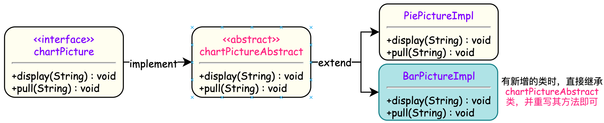
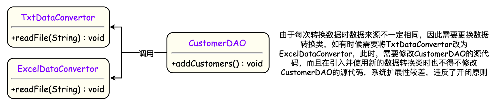
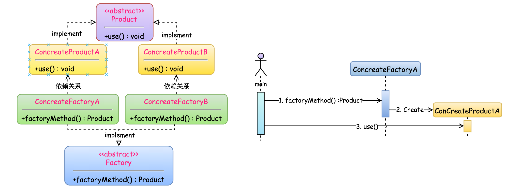

&emsp;&emsp;  软件设计模式，是一套被反复使用、多数人知晓的、经过分类编目的、代码设计经验的总结。使用设计模式是为了可重用代码、让代码更容易被他人理解、保证代码可靠性、程序的重用性。设计模式的本质是面向对象设计原则的实际运用，是对类的封装性、继承性和多态性以及类的关联关系和组合关系的充分理解。

## 一.  设计模式的基本原则
### 1.1  七大原则

&emsp; &emsp;设计模式存在七大基本的设计原则：

#### ▍ **1.1.1  单一职责原则** 

&emsp;  &emsp; 一个类只负责一个功能领域中的相应职责，只负责解决一个问题。 一个类(方法)承担的职责越多，它被复用的可能性就越小，而且一个类承担的职责过多，就相当于将这些职责耦合在一起，当其中一个职责变化时，可能会影响其他职责的运作，因此要将这些职责进行分离，将不同的职责封装在不同的类中。将不同的变化原因封装在不同的类中，如果多个职责总是同时发生改变则可将它们封装在同一类中。除此之外，单一职责原则不仅适用于类，接口，同样适用于方法中。单一职责原则是实现**高内聚、低耦合**的指导方针。
&emsp; &emsp;单一职责原则的优点：
&emsp;  &emsp;   ● 变更引起的风险降低，变更是必然的，如果单一职责原则遵守的好，当修改一个功能时，可以显著降低对其他功能的影响。
&emsp;  &emsp;   ● 可以降低类/方法的复杂度，一个类/方法只负责一项职责。
&emsp;  &emsp;   ● 提高类的可读性，提高系统的可维护性；

```java
/* 以“手机”为例，在IPhone类中，实际上包含了两种职责：
 *		1. 用户的实际操作管理：如"拨打电话","挂断电话"等操作
 *		2. 数据传输的管理：如"通话方式"。
 *	对用户的操作来说，是不会考虑实际的通话是通过什么数据传输方式进行的，因此"通话方式"与"用户操作"属于不同的两种职责，应当分为不同的类中
 */
public interface IPhone{
  public void dial(String phoneNumber);  //拨通电话
  public void chat(Object o);  //通话
  public void hangup();  //挂断电话
}
/*
 * 单一职责原则不仅适用于类，接口，同样适用于方法中。
 * 以修改用户信息为例，如果只用一个changeUser()方法，修改用户的所有信息，其职责不明确，不知道具体修改了哪些信息
 */
void changeUser(UserBO userBO){...}  			//职责不明确，方法不明确
//根据修改的内容，选择不同的方法，职责清晰
void changeUserName(String name){...}			
void changePhoneNumber(String phoneNumber){...}
void changeAddress(String newAddress){...}
```

#### ▍ **1.1.2  开闭原则** 

&emsp;&emsp; **软件实体应尽量在不修改原有代码的情况下进行扩展**。如果需要对软件原有代码进行修改，可能会给旧代码引入错误，也有可能会使我们不得不对整个功能进行重构，并且需要原有代码经过重新测试，所以当软件需要变化时，尽量通过扩展软件实体的行为来实现变化，而不是通过修改已有的代码来实现使我们需要的。
&emsp;&emsp;为了满足开闭原则，需要对系统进行抽象化设计，**抽象化是开闭原则的关键**。为系统定义一个相对稳定的抽象层，而将不同的实现行为移至具体的实现层中完成。如果需要修改系统的行为，无须对抽象层进行任何改动，只需要增加新的具体类来实现新的业务功能即可，实现在不修改已有代码的基础上扩展系统的功能，达到开闭原则的要求。



&emsp;&emsp;开闭原则的优点：
&emsp;  &emsp;   ● 开闭原则可以提高复用性。在面向对象的设计中，所有的逻辑都是从原子逻辑组合而来，而不是在一个类中独立实现一套业务逻辑，设计者需要缩小逻辑粒度，直到一个逻辑不可以分为止。只有这样的代码才可以复用，逻辑粒度越小，被复用的可能性越大。
&emsp;  &emsp;   ● 开闭原则可以提高维护性
><font color=SlateBlue>  <u>**Q1. 如何使用开闭原则 ？**</u></font> 
>&emsp;&emsp;**① 通过抽象进行约束**， 抽象是对一组事物的通用描述，没有具体的实现，也就表示它可以有非常多的可能性，可以跟随需求的变化而变化。因此，通过接口或抽象类可以约束一组可能变化的行为，并且能够实现对扩展开放，其包含三层含义：
>&emsp; &emsp; &emsp; ● 通过接口或抽象类约束，对扩展进行边界限定，不允许出现在接口或抽象类中不存在的public方法。
> &emsp; &emsp; &emsp; ● 参数类型，引用对象尽量使用接口或抽象类，而不是实现类，这主要是实现里氏替换原则的一个要求。
> &emsp; &emsp; &emsp; ● 抽象层尽量保持稳定，一旦确定就不要修改。
>&emsp;&emsp;**② 元数据行为控制**，尽量使用元数据(用来描述环境和数据的数据 - 配置参数)来控制程序的行为，减少重复开发。
>&emsp;&emsp;**③ 封装变化**，将相同的变化封装到一个接口或抽象类中，将不同的变化封装到不同的接口或抽象类中。

#### ▍ **1.1.3  里氏替换原则**

&emsp;&emsp; 在说明里氏代换原则之前，先来看继承的优点和缺点：
&emsp; &emsp;   ● 优点：代码共享，减少创建类的工作量，每个子类都拥有父类的方法和属性；子类通过重写父类中的方法提高代码的重用性；
&emsp; &emsp;   ● 缺点：继承具有侵入性，子类必须拥有父类的属性和方法，增加了类之间的耦合性。当父类的常量、变量和方法被修改时，必需要考虑子类的修改。这种缺点在缺少规范时会导致逻辑复杂。
&emsp;  &emsp;  里氏替换原则是对父类继承的一种约束规范，是实现开闭原则的重要方式之一。里氏替换原则指出<font color=red>**所有可以引用基类(父类)的地方必须通过父类来使用其子类的对象**</font>。由于使用基类对象的地方都可以使用子类对象，因此在程序中尽量使用基类来对对象进行定义(如在传递参数时、方法返回类型使用基类类型)，而在运行时再根据实际传递的子类对象确定其子类类型，用子类对象来"替换"父类对象。
><font color=SlateBlue>  <u>**Q1. 如何使用里氏代换原则 ？**</u></font> 
&emsp;&emsp; 在使用里氏代换原则时需要注意以下问题：
&emsp; &emsp; ● 在继承关系中，子类必须实现父类中声明的所有方法。根据里氏代换原则，为了保证系统的扩展性，在程序中通常使用父类来进行定义，如果一个方法只存在子类中，在父类中不提供相应的声明，则无法在以父类定义的对象中使用该方法。
&emsp; &emsp; ● 尽量把父类设计为抽象类或接口，让子类去继承父类或实现父接口，并实现在父类中声明的方法。当增加新功能时，无须修改原有子类的代码，通过增加一个新的子类即可。


#### ▍ **1.1.4  依赖倒置原则**
&emsp;&emsp;依赖倒转原则要求我们在程序代码中传递参数时或在关联关系中，尽量引用层次高的抽象层类，即<font color=red>**使用接口和抽象类进行变量类型声明、参数类型声明、方法返回类型声明，以及数据类型的转换等，而不要用具体类来做这些事情**</font>。为了确保该原则的应用，一个具体类应当只实现接口或抽象类中声明过的方法，而不要给出多余的方法，否则将无法调用到在子类中增加的新方法。其核心思想是：<font color=red>**要面向接口编程，不要面向实现编程**</font>。
&emsp;&emsp;  在实现依赖倒转原则时，我们需要针对抽象层编程，而将具体类的对象通过依赖注入的方式注入到其他对象中。常用的注入方式有三种，分别是：构造注入，Setter注入和接口注入。构造注入是指通过构造函数来传入具体类的对象，设值注入是指通过Setter方法来传入具体类的对象，而接口注入是指通过在接口中声明的业务方法来传入具体类的对象。<font color=green>**这些注入方式在定义时使用的是抽象类型，在运行时再传入具体类型的对象，由子类对象来覆盖父类对象**</font>。

><font color=SlateBlue>  <u>**Q1. 依赖倒置原则的作用 ？**</u></font> 
>&emsp;&emsp; ① 依赖倒置原则可以降低类间的耦合性，提高系统的稳定性。
>&emsp;&emsp; ② 依赖倒置原则可以减少并行开发引起的风险，同时提高代码的可读性和可维护性。

<table><td bgcolor=#FCFCFC>
  <p>&emsp;&emsp;<b>【举个栗子 🌰】</b></p>
  <p> &emsp;&emsp; 现需要将存储在txt或Excel文件中的客户信息转存到数据库中，因此需要进行数据格式转换。在客户数据操作类中将调用数据格式转换类的方法实现格式转换和数据库插入操作，初始设计方案如下所示：</p>
	<p>
    
  </p>
  <p> &emsp;&emsp; 由于 CustomerDAO 针对具体数据转换类编程，因此在增加新的数据转换类或者更换数据转换类时都不得不修改 CustomerDAO的代码。我们可以通过引入抽象数据转换类解决该问题，在引入抽象数据转换类 DataConvertor之后，CustomerDAO针对抽象类 DataConvertor 编程，并将具体数据转换类名存储在配置文件中。根据里氏代换原则，程序运行时，具体数据转换类对象将替换 DataConvertor类型的对象。如果需要增加新的具体数据转换类，只要将新增数据转换类作为 DataConvertor的子类并修改配置文件即可，原有代码无须做任何修改，满足开闭原则。</p>
  <p></p>
</td></table>


#### ▍ **1.1.5  接口隔离原则**
&emsp;&emsp; 根据接口隔离原则，当一个接口太大时，我们需要将它分割成一些更细小的接口，使用该接口的客户端仅需知道与之相关的方法即可。这里的“接口”往往有两种不同的含义：一种是指一个类型所具有的方法特征的集合，仅仅是一种逻辑上的抽象；另外一种是指某种语言具体的“接口”定义，如Java语言中的`interface`。对于这两种不同的含义，接口隔离原则有所不同：
&emsp;&emsp; ① 当把“接口”理解成一个类型所提供的所有方法特征的集合的时候，这就是一种逻辑上的概念，接口的划分将直接带来类型的划分。可以把接口理解成角色，一个接口只能代表一个角色，每个角色都有它特定的一个接口，此时，这个原则可以叫做“角色隔离原则”。

&emsp;&emsp; ② 如果把"接口"理解成狭义的特定语言的接口，在面向对象编程语言中，实现一个接口就需要实现该接口中定义的所有方法，因此大的总接口使用起来不一定很方便，为了使接口的职责单一，需要将大接口中的方法根据其职责不同分别放在不同的小接口中，以确保每个接口使用起来都较为方便，并都承担某一单一角色。接口应该尽量细化，同时接口中的方法应该尽量少，每个接口中只包含一个客户端（如子模块或业务逻辑类)所需的方法即可。

><font color=SlateBlue>  <u>**Q1. 接口隔离原则的作用 ？**</u></font>
>
>&emsp;&emsp; 接口隔离原则是为了约束接口、降低类对接口的依赖性， 接口隔离原则有以下几个作用：
>&emsp;  &emsp;  ① 接口隔离提高了系统的内聚性，减少了对外交互，降低了系统的耦合性。
>&emsp;  &emsp;  ② 将臃肿庞大的接口分解为多个粒度小的接口，可以预防外来变更的扩散，提高系统的灵活性和可维护性。
>&emsp;  &emsp;  ③ 如果接口的粒度大小定义合理，能够保证系统的稳定性；但是，如果定义过小，则会造成接口数量过多，使设计复杂化；如果定义太大，灵活性降低，无法提供定制服务，给整体项目带来无法预料的风险。
><font color=SlateBlue>  <u>**Q2. 接口隔离原则的实现方法 ？**</u></font>
>&emsp;  &emsp;  ① 接口尽量小，但是要有限度。一个接口只服务于一个子模块或业务逻辑。
>&emsp;  &emsp;  ② 提高内聚，减少对外交互。使接口用最少的方法去完成最多的事情。
>&emsp;  &emsp;  ③ 为依赖接口的类定制服务。只提供调用者需要的方法，屏蔽不需要的方法。

<table><td bgcolor=#FCFCFC>
  <p>&emsp;&emsp;<b>【举个栗子 🌰】</b></p>
  <p> &emsp;&emsp; 某CRM系统的客户数据显示模块设计了如下所示的接口，其中方法dataRead()用于从文件中读取数据，方法transformToXML()用于将数据转换成XML格式，方法createChart()用于创建图表，方法displayChart()用于显示图表，方法createReport()用于创建文字报表，方法displayReport()用于显示文字报表。<br>
   &emsp;&emsp; 下面的设计方式有一个问题：如果一个具体的数据显示类无须进行数据转换 (本身就是XML格式)，但由于实现了该接口，将不得不实现其中声明的transformToXML()方法 (至少需要提供一个空实现)；如果需要创建和显示图表，除了需实现与图表相关的方法外，还需要实现创建和显示文字报表的方法，否则程序编译时将报错。</p>
	<p>
  
  </p>
  <p> &emsp;&emsp; 将该接口按照接口隔离原则和单一职责原则进行重构，将其中的一些方法封装在不同的小接口中，确保每一个接口使用起来都较为方便，并都承担某一单一角色，每个接口中只包含一个客户端（如模块或类）所需的方法即可。在使用接口隔离原则时，我们需要注意控制接口的粒度，接口不能太小，如果太小会导致系统中接口泛滥，不利于维护；接口也不能太大，太大的接口将违背接口隔离原则，灵活性较差，使用起来很不方便。</p>
  <p>
    
  </p>
</td></table>

#### ▍ **1.1.6  迪米特原则**

&emsp;  &emsp; 迪米特法则要求我们在设计系统时，应该**尽量减少对象之间的交互**，**如果两个对象之间不必彼此直接通信，那么这两个对象就不应当发生任何直接的相互作用，如果其中的一个对象需要调用另一个对象的某一个方法的话，可以通过第三者转发这个调用**。在将迪米特法则运用到系统设计中时，要注意下面的几点：
&emsp;  &emsp;  ● 在类的划分上，应当尽量创建松耦合的类，类之间的耦合度越低，就越有利于复用，一个处在松耦合中的类一旦被修改，不会对关联的类造成太大波及；
&emsp;  &emsp;  ●  在类的结构设计上，每一个类都应当尽量降低其成员变量和成员函数的访问权限，不暴露类的属性成员，而应该提供相应的访问器（set 和 get 方法)；在类的设计上，只要有可能，一个类型应当设计成不变类；
&emsp;  &emsp;  ●  在对其他类的引用上，一个对象对其他对象的引用应当降到最低。从依赖者的角度来说，只依赖应该依赖的对象。从被依赖者的角度说，只暴露应该暴露的方法。

<table><td bgcolor=#FCFCFC>
  <p>&emsp;&emsp;<b>【举个栗子 🌰】</b></p>
  <p> &emsp;&emsp; 某CRM系统有很多业务操作窗口，在这些窗口中，某些界面控件之间存在复杂的交互关系，一个控件事件的触发将导致多个其他界面控件产生响应，例如，当一个按钮(Button)被单击时，对应的列表框(List)、组合框(ComboBox)、文本框(TextBox)、文本标签(Label)等都将发生改变。<br>
   &emsp;&emsp; 下面的设计方式有一个问题：由于界面控件之间的交互关系复杂，导致在该窗口中增加新的界面控件时需要修改与之交互的其他控件的源代码，系统扩展性较差，也不便于增加和删除新控件。</p>
	<p>
  
  </p>
  <p> &emsp;&emsp; 将该接口按照迪米特原则进行重构，通过引入一个专门用于控制界面控件交互的中间类(Mediator)来降低界面控件之间的耦合度。引入中间类之后，界面控件之间不再发生直接引用，而是将请求先转发给中间类，再由中间类来完成对其他控件的调用。当需要增加或删除新的控件时，只需修改中间类即可，无须修改新增控件或已有控件的源代码。</p>
  <p>
   
  </p>
</td></table>

#### ▍ **1.1.7  合成/聚合复用原则**
&emsp;&emsp;  合成/聚合复用原则指出尽量使用合成/聚合，尽量不要使用类继承。在一个新的对象里面使用一些已有的对象，使之成为新对象的一部分；新的对象通过向内部持有的这些对象的委派达到复用已有功能的目的，而不是通过继承来获得已有的功能。
><font color=SlateBlue>  <u>**Q1. 什么是合成与聚合 ？**</u></font>
>&emsp;&emsp;  ● 聚合表示一种弱的"拥有"关系，一般表现为松散的整体和部分的关系，所谓整体和部分也可以是完全不相关的。例如A对象持有B对象，B对象并不是A对象的一部分，也就是B对象的生命周期是B对象自身管理，和A对象不相关。
>&emsp;&emsp;  ● 合成表示一种强的"拥有"关系，一般表现为严格的整体和部分的关系，部分和整体的生命周期是一样的。
<font color=SlateBlue>  <u>**Q2. 为什么要用合成/聚合来替代继承达到复用的目的 ？**</u></font>
>&emsp;&emsp; 继承复用会破坏父类的封装性，因为<font color=green>继承将基类的实现细节暴露给派生类，基类的内部细节通常对子类来说是可见的</font>，这种复用也称为"白箱复用"。这里有一个问题是：<font color=orange>派生类继承自基类，如果基类的实现发生改变，将会影响到所有派生类的实现；如果从基类继承而来的实现是静态的，不可能在运行时发生改变，不够灵活</font>。
&emsp;&emsp; <font color=green>由于合成或聚合关系可以将已有的对象，一般叫成员对象，纳入到新对象中，使之成为新对象的一部分，因此新对象可以调用已有对象的功能，这样做可以使得成员对象的内部实现细节对于新对象不可见，所以这种复用又称为"黑箱"复用，相对继承关系而言，其耦合度相对较低，成员对象的变化对新对象的影响不大，可以在新对象中根据实际需要有选择性地调用成员对象的操作；合成/聚合复用可以在运行时动态进行，新对象可以动态地引用与成员对象类型相同的其他对象</font>。

## 二.  UML类图


&emsp;&emsp;  ① 继承关系：类的继承结构在UML中也称为泛化关系，继承关系的两个对象之间可以用`is-a`来表示，如上图中 "SUV是小汽车"。**继承关系在代码中表现为**<font color=orange>**继承非抽象类**</font>。
&emsp;&emsp;  ② 实现关系：实现关系是指类实现了接口类，或者类继承了抽象类。如上图中 "小汽车、自行车实现了抽象类-车"。**在程序中实现关系表现为<font color=orange>继承抽象类</font>**。
&emsp;&emsp;  ③ 聚合关系：表示实体对象之间的关系，表示整体由部分构成的语义。如上图中 "一个班级由多名学生组成"。整体和部分不是强依赖的，即使整体不存在了，部分仍然存在；
&emsp;&emsp;  ④ 组合关系：同样表示整体由部分构成的语义，但组合关系是一种强依赖的特殊聚合关系，如果整体不存在了，则部分也不存在了。如上图中 "一个小汽车由轮胎和发动机组成，如果轮胎和发动机不在了，小汽车也就不在了"。
&emsp;&emsp;  ⑤ 关联关系：描述不同类的对象之间的结构关系，一般用来定义对象之间静态的、天然的结构。所以关联关系是一种“强关联”的关系。如上图中 "身份证与学生之间是强关联的关系"。**在程序中关联对象通常是以<font color=orange>成员变量</font>的形式实现的。**
&emsp;&emsp;  ⑥ 依赖关系：描述一个对象在运行期间会用到另一个对象的关系。它是一种临时性的关系，通常在运行期间产生，并且随着运行时的变化依赖关系也可能发生变化；依赖关系存在方向性，双向依赖是一种非常糟糕的结构，我们应该保持单向依赖，杜绝双向依赖的产生。**在程序中依赖关系体现为<font color=orange>类A中的方法需要类B的实例作为其参数或者变量</font>，箭头的指向为调用关系；依赖关系除了临时知道对方外，还有“使用”对方的方法和属性；**

## 三.  设计模式

&emsp;&emsp; 设计模式分为三大类：
&emsp;&emsp;  ① **创建型模式**，共五种：工厂方法模式、抽象工厂模式、单例模式、建造者模式、原型模式。
&emsp;&emsp;  ② **结构型模式**，共七种：适配器模式、装饰器模式、代理模式、外观模式、桥接模式、组合模式、享元模式。
&emsp;&emsp;  ③ **行为型模式**，共十一种：策略模式、模板方法模式、观察者模式、迭代子模式、责任链模式、命令模式、备忘录模式、状态模式、访问者模式、中介者模式、解释器模式。

### 3.1  创建型模式
&emsp;&emsp;  创建型模式`(Creational Pattern)`对类的实例化过程进行了抽象，能够将软件模块中**对象的创建和对象的使用分离**。为了使软件的结构更加清晰，外界对于这些对象只需要知道它们共同的接口，而不清楚其具体的实现细节，使整个系统的设计更加符合单一职责原则。创建型模式隐藏了类的实例的创建细节，通过隐藏对象如何被创建和组合在一起达到使整个系统独立的目的。
#### ▍ **3.1.1  简单工厂模式** 
&emsp;&emsp; 简单工厂模式又称为静态工厂方法模式。在简单工厂模式中，可以根据参数的不同返回不同类的实例。简单工厂模式专门定义一个类来负责创建其他类的实例，被创建的实例通常都具有共同的父类。 简单工厂模式包含如下角色：
&emsp;  &emsp;  ● **Factory - 工厂角色**：工厂角色负责实现创建所有实例的内部逻辑
&emsp;  &emsp;  ● **Product - 抽象产品角色**：抽象产品角色是所创建的所有对象的父类，负责描述所有实例所共有的公共接口
&emsp;  &emsp;  ● **ConcreteProduct - 具体产品角色**：具体产品角色是创建目标，所有创建的对象都充当这个角色的某个具体类的实例。


><font color=SlateBlue>  <u>**Q1. 简单工厂模式的优点和缺点？**</u></font>
>&emsp;&emsp;●  优点：
>&emsp;&emsp; &emsp; ① 简单工厂模式将对象的创建和对象本身业务处理分离可以降低系统的耦合度；
>&emsp;&emsp; &emsp; ② 在调用工厂类的工厂方法时，由于工厂方法是静态方法，使用起来很方便，可通过类名直接调用，同时客户端无须知道		所创建的具体产品类的类名，只需要知道具体产品类所对应的参数即可。
>&emsp;&emsp;●  缺点：
>&emsp;&emsp; &emsp; ① 工厂类的职责相对过重，增加新的产品需要修改工厂类的判断逻辑，这一点与开闭原则是相违背的。
>&emsp;&emsp; &emsp; ② 使用简单工厂模式将会增加系统中类的个数，在一定程序上增加了系统的复杂度和理解难度。
>&emsp;&emsp; &emsp; ③ 简单工厂模式由于使用了静态工厂方法，造成工厂角色无法形成基于继承的等级结构。

```java 
// Product.java - 抽象产品角色
public interface Product {
    public void use();
}
// ConCreateProductA.java - 具体产品角色
public class ConCreateProductA implements Product{
    @Override
    public void use() {
        System.out.println("Product A");
    }
}
// ConCreateProductA.java - 具体产品角色
public class ConCreateProductB implements Product{
    @Override
    public void use() {
        System.out.println("Product B");
    }
}
// ============================================
// ProductFactory.java - 工厂角色
public class ProductFactory {
    public static Product createProduct(String str){
        Product product = null;
        if(str.equals("ProductA")){
            product =  new ConCreateProductA();
        }else if(str.equals("ProductB")){
            product =  new ConCreateProductB();
        }
        return product;
    }
}
// ============================================
// Client - 主程序
public class Client{
  	public static void main(){
    	Product product = ProductFactory.createProduct("ProductA");
    	product.use();
  	} 
}
```

#### ▍ **3.1.2  工厂方法模式** 
&emsp;&emsp;  工厂方法模式又称多态工厂模式。在工厂方法模式中，工厂父类负责定义创建产品对象的公共接口，而工厂子类则负责生成具体的产品对象，这样做的目的是将产品类的实例化操作延迟到工厂子类中完成，即通过工厂子类来确定究竟应该实例化哪一个具体产品类。
&emsp;&emsp;  工厂方法模式是简单工厂模式的进一步抽象和推广。由于面向对象的多态性，工厂方法模式保持了简单工厂模式的优点，而且克服了它的缺点。**在工厂方法模式中，核心的工厂类不再负责所有产品的创建，而是将具体创建工作交给子类去做。这个核心类仅仅负责给出具体工厂必须实现的接口，而不负责哪一个产品类被实例化这种细节，这使得工厂方法模式可以允许系统在不修改工厂角色的情况下引进新产品**。 工厂方法模式包含如下角色：
&emsp;  &emsp;  ● **Factory - 抽象工厂**：定义创建产品对象(子工厂)的公共接口。
&emsp;  &emsp;  ● **ConcreteFactory - 具体工厂**：负责生产具体的产品对象。
&emsp;  &emsp;  ● **Product - 抽象产品角色**：抽象产品角色是所创建的所有对象的父类，负责描述所有实例所共有的公共接口
&emsp;  &emsp;  ● **ConcreteProduct - 具体产品角色**：具体产品角色是创建目标，所有创建的对象都充当这个角色的某个具体类的实例。



><font color=SlateBlue>  <u>**Q1. 工厂方法模式的优点和缺点？**</u></font>
&emsp;&emsp;●  优点：
&emsp;&emsp; &emsp; ① 在工厂方法模式中，工厂方法用来创建客户所需要的产品，同时还向客户隐藏了具体产品类将被实例化这一细节，用户		只需要关心所需产品对应的工厂，无须关心创建细节。
&emsp;&emsp; &emsp; ② 工厂方法模式无须修改抽象工厂和抽象产品提供的接口，无须修改客户端，也无须修改其他的具体工厂和具体产品，而		只要添加一个具体工厂和具体产品就可以。这样，系统的可扩展性也就变得非常好，完全符合“开闭原则”。
&emsp;&emsp;●  缺点：
&emsp;&emsp; &emsp; ① 在添加新产品时，需要编写新的具体产品类，而且还要提供与之对应的具体工厂类，系统中类的个数将成对增加，在一	 	定程度上增加了系统的复杂度，有更多的类需要编译和运行，会给系统带来一些额外的开销。
&emsp;&emsp; &emsp; ② 考虑到系统的可扩展性，需要引入抽象层，在客户端代码中均使用抽象层进行定义，增加了系统的抽象性和理解难度。

```java
// Product.java - 抽象产品角色
public interface Product {
    public void use();
}
// ConCreateProductA.java - 具体产品角色
public class ConCreateProductA implements Product{
    @Override
    public void use() {
        System.out.println("Product A");
    }
}
// ConCreateProductA.java - 具体产品角色
public class ConCreateProductB implements Product{
    @Override
    public void use() {
        System.out.println("Product B");
    }
}
// ============================================
// ProductFactory.java - 抽象工厂
public interface Factory {
    public Product factoryMethod();
}
// ConCreateFactoryA.java - 具体工厂,用于生成FactoryA，生产ProductA
public class ConCreateFactoryA implements Factory{
    @Override
    public Product factoryMethod() {
        return new ConCreateProductA();
    }
}
// ConCreateFactoryB.java - 具体工厂,用于生成FactoryB，生产ProductB
public class ConCreateFactoryB implements Factory{
    @Override
    public Product factoryMethod() {
        return new ConCreateProductB();
    }
}
// ============================================
// Client - 主程序
public class Client{
  	public static void main(){
    		Factory conCreateFactoryA = new ConCreateFactoryA();
        Product product1 = conCreateFactoryA.factoryMethod();
        product1.use();
  	} 
}
```

#### ▍ **3.1.3  抽象工厂模式** 

&emsp;&emsp;  在工厂方法模式中工厂具有唯一性，具体工厂负责生产具体的产品，每一个具体工厂对应一种具体产品，但是有时候我们需要一个工厂可以提供多个产品对象，而不是单一的产品对象，因此工厂方法模式就不再适用了。抽象工厂模式是所有形式的工厂模式中最为抽象和最具一般性的一种形态，抽象工厂模式包含两个概念：**产品等级结构**，**产品族**。
&emsp;&emsp;  ● 产品等级结构：产品等级结构即产品的继承结构，如一个抽象类是电视机，其子类有海尔电视机、海信电视机、TCL电视机，则抽象电视机与具体品牌的电视机之间构成了一个产品等级结构，抽象电视机是父类，而具体品牌的电视机是其子类。
&emsp;&emsp;  ● 产品族：在抽象工厂模式中，产品族是指由同一个工厂生产的，位于不同产品等级结构中的一组产品，如海尔电器工厂生产的海尔电视机、海尔电冰箱，海尔电视机位于电视机产品等级结构中，海尔电冰箱位于电冰箱产品等级结构中。
&emsp;&emsp;  抽象工厂模式与工厂方法模式最大的区别在于，工厂方法模式针对的是一个产品等级结构，而抽象工厂模式则需要面对多个产品等级结构，一个工厂等级结构可以负责多个不同产品等级结构中的产品对象的创建 。当一个工厂等级结构可以创建出分属于不同产品等级结构的一个产品族中的所有对象时，抽象工厂模式比工厂方法模式更为简单、有效率。 抽象工厂模式包含如下角色：
&emsp;  &emsp;  ● **Factory - 抽象工厂**：定义创建产品对象(子工厂)的公共接口。
&emsp;  &emsp;  ● **ConcreteFactory - 具体工厂**：负责生产具体的产品对象。
&emsp;  &emsp;  ● **Product - 抽象产品角色**：抽象产品角色是所创建的所有对象的父类，负责描述所有实例所共有的公共接口
&emsp;  &emsp;  ● **ConcreteProduct - 具体产品角色**：具体产品角色是创建目标，所有创建的对象都充当这个角色的某个具体类的实例。


><font color=SlateBlue>  <u>**Q1. 抽象工厂模式的优点和缺点？**</u></font>
&emsp;&emsp;●  优点：
&emsp;&emsp; &emsp; ①抽象工厂模式隔离了具体类的生成。由于这种隔离，更换一个具体工厂就变得相对容易。所有的具体工厂都实现了抽象工		厂中定义的那些公共接口，因此只需改变具体工厂的实例，就可以在某种程度上改变整个软件系统的行为。另外，应用抽象工		厂模式可以实现高内聚低耦合的设计目的，因此抽象工厂模式得到了广泛的应用。
&emsp;&emsp; &emsp; ② 增加新的具体工厂和产品族很方便，无须修改已有系统，符合“开闭原则”
&emsp;&emsp;●  缺点：
&emsp;&emsp; &emsp; ① **在添加新的产品对象时，难以扩展抽象工厂来生产新种类的产品**，要支持新种类的产品就要对该接口进行扩展，而这将		涉及到对抽象工厂角色及其所有子类的修改，会带来较大的不便。
&emsp;&emsp; &emsp; ② 开闭原则的倾斜性 (增加新的工厂和产品族容易，增加新的产品等级结构麻烦)
&emsp;&emsp; &emsp; ③ 当抽象工厂模式中每一个具体工厂类只创建一个产品对象时，抽象工厂模式退化成工厂方法模式；
```java
// ============================================
// Step1.抽象定义
// AbstractFactory.java - 抽象工厂角色，定义工厂可以生产哪些产品
public interface AbstractFactory {
    public IphoneProduct createIphone();
    public TVProduct createTv();
}
// IphoneProduct.java - 抽象产品角色，定义产品1的特性
public interface IphoneProduct {
    public void blibli();
    public void weChat();
}
// IphoneProduct.java - 抽象产品角色，定义产品2的特性
public interface TVProduct {
    public void watchTv();
}
// ============================================
// Step2.工厂具体实现
// HuaweiFactory.java - 具体工厂，工厂A实现生成的产品
public class HuaweiFactory implements AbstractFactory{
    @Override
    public IphoneProduct createIphone() {
        System.out.println(">>> 华为工厂启动生产IPhone");
        return new XiaomiIphone();
    }
    @Override
    public TVProduct createTv() {
        System.out.println(">>> 华为工厂启动生产TV");
        return new XiaomiTv();
    }
}
// XiaomiFactory.java - 具体工厂，工厂B实现生成的产品
public class XiaomiFactory implements AbstractFactory{
    @Override
    public IphoneProduct createIphone() {
        System.out.println(">>> 小米工厂启动生产IPhone");
        return new XiaomiIphone();
    }
    @Override
    public TVProduct createTv() {
        System.out.println(">>> 小米工厂启动生产TV");
        return new XiaomiTv();
    }
}
// ============================================
// Step3.产品具体实现
// HuaweiIPhone.java - 具体产品角色，工厂A生产的产品1
public class HuaweiIPhone implements IphoneProduct{
    @Override
    public void blibli() {
        System.out.println("use HuaweiIphone blibli");
    }
    @Override
    public void weChat() {
        System.out.println("use HuaweiIphone wechat");
    }
}
// HuaweiIPhone.java - 具体产品角色，工厂A生产的产品2
public class HuaweiTv implements TVProduct{
    @Override
    public void watchTv() {
        System.out.println("use huaweiTV watch tv");
    }
}
// XiaomiIphone.java - 具体产品角色，工厂B生产的产品1
public class XiaomiIphone implements IphoneProduct{
    @Override
    public void blibli() {
        System.out.println("use xiaomiIphone watch blibli");
    }
    @Override
    public void weChat() {
        System.out.println("use xiaomiIphone wechat");
    }
}
// XiaomiTv.java - 具体产品角色，工厂B生产的产品2
public class XiaomiTv implements TVProduct{
    @Override
    public void watchTv() {
        System.out.println("use xiaomiTV watch tv");
    }
}
// ============================================
// Step4.客户端调用 Client - 主程序
public class Client{
  	public static void main(){
    		AbstractFactory xiaomiFactory = new XiaomiFactory();
        IphoneProduct xiaomiIphone = xiaomiFactory.createIphone();
        xiaomiIphone.blibli();
  	} 
}
```

java
