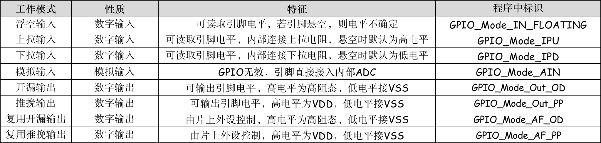

STM32

### 1. STM32 系统架构

&emsp; &emsp; **STM32 芯片是已经封装好的成品，主要由内核和片上外设组成。**若与电脑类比，内核与外设就如同电脑上的 CPU 与主板、内存、显卡、硬盘的关系。STM32主要包括**四个驱动单元**（*Cortex™-M3* 内核 *DCode* 总线、*Cortex™-M3* 内核系统总线 *System*、通用 *DMA1*、通用 *DMA2* ）和四个被动单元（内部 *SRAM*、内部闪存存储器 *FLASH*、*FSMC*、*AHB* 到 *APB* 的桥，它连接所有的 *APB* 外设）**组成。STM32的系统架构如下图所示：**

&emsp; &emsp; ① ***ICode* 总线 - 指令总线**：内核通过 *ICode* 总线读取内部 *FLASH* 代码指令来执行程序
&emsp; &emsp; ② ***DCode* 总线 - 数据总线**：数据可以被 *Dcode* 总线和 *DMA* 总线访问 ( 从 *Flash*，*SRAM*，或外设数据寄存器里面取数据 )，为了避免访问冲突，在取数的时候需要经过一个总线矩阵来仲裁，决定哪个总线在取数，取到的数据可以暂存在 *Cortex™-M3* 内核里面的寄存器再进行处理。
&emsp; &emsp; ③ ***System* 总线 - 系统总线**：系统总线主要是访问外设的寄存器，我们通常说的寄存器编程，即读写寄存器都是通过这根系统总线来完成的。
&emsp; &emsp; ④ ***DMA* 与 *DMA* 总线**：DMA 称为直接存储器访问，它允许不同速度的硬件装置来进行数据传输，而不需要依赖于CPU的大量中断负载。否则，CPU 需要从来源把每一片段的资料复制到暂存器，然后把它们再次写回到新的地方。在这个时间中，CPU 对于其他的工作来说就无法使用。*DMA* 总线与 *DCode* 总线一样主要是用来传输数据，但 *Dcode* 总线传输数据要占用内核 ( CPU ) 的资源，而 *DMA* 总线相当于独立于内核CPU，在传输数据时而不用占用内核 ( CPU ) 的资源，即在DMA传输数据的同时内核CPU可以干别的事情，比如点亮一个LED灯。
    ⑤ **总线矩阵**：总线矩阵用于协调内核系统总线和DMA主控总线之间的访问仲裁，仲裁利用轮换算法。因为数据可以被 *Dcode* 总线和 *DMA* 总线访问，数据可以是在某个外设的数据寄存器，可以在*SRAM*，可以在内部的 *FLASH*。所以为了避免访问冲突，在取数的时候需要经过一个总线矩阵来仲裁，决定哪个总线在取数。
    ⑥ **内部 *FLASH***：写好的程序编译之后都是一条条指令(二进制代码)，存放在 *FLASH* 中，常量或常变量 ( *const* 关键字修饰) 也存放在 *FLASH*。
    ⑦ **内部 *SRAM***：相当于我们常说的电脑内存条。程序函数内部的局部变量和全局变量，堆 ( *malloc* 分配)、栈( 局部变量 )等的开销都是基于内部的 *SRAM*。内核通过 *DCode* 总线来访问 *SRAM*。
    ⑧ ***FSMC* - 存储器控制器**：FSMC我们可以扩展内存，如外部的 *SRAM*，*NANDFLASH* 和 *NORFLASH*。但要注意的是，*FSMC* 只能扩展静态的内存，不能是动态的内存，比如 *SDRAM* 就不能扩展。
    ⑨ ***AHB* 到 *APB* 的桥**：两个 *AHB*/*APB* 桥在 *AHB* 和2个 *APB* 总线间提供同步连接。*APB1* 操作速度限于36MHz，*APB2* 操作于全速(最高72MHz)，上面可以挂载着 STM32 各种各样的特色外设。我们经常说的 *GPIO*、*Usart*、*I2C*、*SPI* 这些外设就挂载在这两条总线上。

>   <u>**Q1. 什么是片上(片内)外设与片外外设 ？**</u>
> &emsp; &emsp; 片内、外设是两个概念，片内指做成芯片的集成电路内部，简称片内，片外是指集成电路外部。外设是外部设备的简称，是指集成电路芯片外部的设备。集成电路芯片与外部设备的连接一般需要专门的接口电路和总线的连接 ( 包括控制总线路，地址总线和数据总线 )。**片内外设**是指在集成电路芯片内部集成的用于与外部设备连接的独立于内核的控制器、接口电路和总线等。
> &emsp; &emsp; 如STM32单片机是ST公司基于*Cortex-Mx* 内核开发的芯片，而ST公司用ARM内核设计芯片的过程中添加的独立于内核的东西( 比如串口模块、*FLASH*、*I2C*模块、*SPI*通信模块、*ADC*和*DAC*模块等等 )， 对于内核来说就是“外设”，由于是集成在芯片内部的，所以叫片上外设。我们通过对STM32芯片开发各种应用系统，在我们自己开发的系统上面独立于STM32的外部设备如 ( 显示屏、SD卡 ) 等都是片外外设。
>
> 

### 2. STM32 存储空间与寄存器

#### 2.1 存储空间及功能划分

&emsp; &emsp;存储空间用于存储编译器编译后的程序、数据以及输入输出等信息。存储空间的大小是由**芯片内CPU内的地址总线**的数量来决定，STM32芯片( 32位芯片 )内部的总线为32根，内存被划分为一个个的内存单元，每个内存单元的大小是一个字节，因此STM32芯片共有**`2^32 = 4GB`的线性地址空间**。程序存储器、数据存储器、寄存器和输入输出端口被组织在同一个4GB的线性地址空间内。**为了能有效的访问到内存的每个单元就给内存单元进行编号**，并称为内存地址。分配好地址后，外设单元的 *FLASH*，*RAM*，*FSMC* 和 *AHB* 到 *APB* 的桥 (即片上外设)，这些功能部件共同排列在一个 4GB 的地址空间内。**在编程时，就通过他们的内存地址读取并控制他们**。
&emsp; &emsp;在ARM架构中，这 4GB 的地址空间中被平均分成了 8 个块 ( *Block0* ~ *Block7* )，每块 512MB。

&emsp; &emsp;   ● *Block0* 设计为内部 *FLASH*，用来存储编译后的代码；
 &emsp; &emsp;  ● *Block1* 设计为内部 *SRAM*，用来存储运行程序中的数据；
&emsp; &emsp;   ● *Block2* 设计为片上外设，用来为片上外设进行控制，根据外设的总线速度不同，*Block2* 被分成了 *APB* ( *Advanced Peripheral Bus* - 外围总线 ) 和 *AHB* ( *Advanced High Performance Bus* - 高性能总线 ) 两部分，其中 *APB* 又被分为 *APB1* 和 *APB2*。

#### 2.2 寄存器

&emsp; &emsp; 在存储器 *Block2* 这块区域，设计为片上外设，它们以**四个字节为一个单元( 一个字节有8bit )，共32bit**，每一个单元对应不同的功能，我们通过控制这些单元就可以驱动外设工作。但是如果每次都是通过地址的方式来访问不同的单元，不好记忆还容易出错，我们可以根据每个单元功能的不同，以功能为名给这个内存单元取一个别名，这个**别名就叫做寄存器**，所以寄存器只是特定功能的的单元的名字而已。**因此单片机的本质其实就是在操作寄存器**，STM32的库函数开发也不例外，它只不过是将操作寄存器封装成一个个函数。让单片机完成想要的动作例如点亮一个LED灯，我们只要配置指定函数的参数,再调用该函数自动把对应的寄存器配置好，**其实本质还是操作寄存器**。
&emsp; &emsp; 如我们找到 *GPIOB* 端口的输出数据寄存器 *ODR* 的地址是 *0x4001 0C0C*，*ODR* 寄存器(就是4字节的功能单元)是32bit，低16bit有效( 仅低16bit可用 )，对应着 16 个外部 *IO*，写 0/1 对应的的 IO 则输出低/高电平。通过 C 语言指针的操作方式，可以让 *GPIOB* 的 16 个 IO 都输出高电平。

#### 2.3 外设地址映射

&emsp; &emsp;  片上外设区分为三条总线 ( AHB、APB1、APB2 )，根据外设速度的不同，不同总线挂载着不同的外设，**APB1挂载低速外设**，**APB2和AHB挂载高速外设**。相应总线的最低地址我们称为该总线的基地址，总线基地址也是挂载在该总线上的首个外设的地址。其中 **APB1总线的地址最低**，片上外设从这里开始，也叫外设基地址，即 *0x4000 0000*。因此**总线基地址 + 相对外设基地址偏移  = 片上外设地址**。**各个寄存器的地址=外设基地址+寄存器相对于外设基地址的偏移**。

&emsp; &emsp;  在编程上，为了方便理解和记忆，会把总线基地址和外设基地址都以相应的宏定义命名。根据外设在那条总线，然后加上相对于该总线的基地址偏移。

### 3. STM32 引脚与GPIO

#### 3.1 引脚与GPIO

&emsp; &emsp; GPIO ( *General Purpose Input Output* ) 是通用输入输出端口的简称，STM32芯片的GPIO引脚与外部设备连接起来，从而实现与外部通讯、控制以及数据采集的功能。**STM32 芯片的 GPIO 被分成很多组，每组有 16 个引脚**，GPIO引脚即软件可控制的引脚，但**不是所有引脚都是GPIO**。以 STM32F103VET6 为例，芯片共 100 个引脚，有 *GPIOA* 至 *GPIOE* 共 5 组 *GPIO* ( *PA0~PA15* 共90个引脚 )，**除了GPIO还有复位引脚、电源引脚、晶振引脚、下载引脚等**。

#### 3.2 GPIO 工作原理

&emsp; &emsp; GPIO 在输出模式下可控制端口的输出高低电平，可用于驱动LED、控制蜂鸣器、模拟通信协议输出时序 ( *SPI*、*I2C* )。在输入模式下可读取端口的高低电平，用于读取按键输入，外接模块电平信号输入，*ADC*电压采集、模拟通信协议接收数据 ( *SPI*、*I2C* )等。

&emsp; &emsp; **① 保护二极管**：芯片的引脚电平 *0~3.3V*，部分引脚可以 *5V*，引脚的两个保护二级管可以防止引脚外部过高或过低的电压输入。**当引脚电压高于VDD 时，上方的二极管导通，防止过高电压进入芯片内部烧坏芯片**。**当引脚电压低于 VSS 时，下方的二极管导通，防止电压过低，从芯片内部汲取电流**
&emsp; &emsp; **② 肖特基( 施密特 )触发器**：输入的电平会有失真，不是稳定的高低电平**。通过触发器进行滤波，可以使通过的电平输出稳定的高低电平**。

&emsp; &emsp; ③ **P-MOS管和N-MOS管**：由 *P-MOS* 管和 *N-MOS* 管组成的单元电路使得 *GPIO* 具有“推挽输出”和“开漏输出”的模式。

#### 3.3 GPIO 工作模式

&emsp;&emsp;GPIO支持4种输入模式 ( 浮空输入、上拉输入、下拉输入、模拟输入 ) 和4种输出模式 ( 开漏输出、开漏复用输出、推挽输出、推挽复用输出 )。同时，GPIO还支持三种最大翻转速度 ( 2MHz、10MHz、50MHz )。

##### 3.3.1 上拉、下拉、浮空、模拟输入

&emsp;&emsp;在输入模式时，肖特基触发器打开，输出被禁止，可通过输入数据寄存器 *GPIOx_IDR* 读取 I/O 状态。在输入模式时，对于输入引脚的要求就是高阻态。基本输入电路的类型大致可以分为3类：**基本输入IO电路**、**施密特触发输入电路**以及**弱上拉/下拉输入电路**。

>   <u>**Q1. 什么是高阻态 ？**</u>
>  &emsp;&emsp; 高阻态指的是电路的一种输出状态，既不是高电平也不是低电平。电路分析时高阻态可做开路理解 ( **只有电压，没有电流** )。如果高阻态再输入下一级电路的话，对下级电路无任何影响，和没接一样。在高阻状态下，相当于在控制输入端不使能的情况下，物理引脚与内部总线之间是完全隔离的，完全不会影响内部电路。

###### (1). 上拉输入

&emsp; &emsp; 上拉输入模式下，I/O端口的电平信号直接进入输入数据寄存器。**默认情况下输入引脚数据为1，高电平**。在I/O端口悬空 ( 在无信号输入 ) 的情况下，输入端的电平保持在高电平。在I/O端口输入为低电平的时候，输入端的电平变为低电平。

###### (2). 下拉输入

 &emsp; &emsp;下拉输入模式下，I/O端口的电平信号直接进入输入数据寄存器。**默认情况下输入引脚数据为0，低电平**。在I/O端口悬空 ( 在无信号输入 ) 的情况下，输入端的电平保持在低电平。在I/O端口输入为高电平的时候，输入端的电平变为高电平。

###### (3). 浮空输入

 &emsp; &emsp;浮空输入模式下，I/O端口的电平信号直接进入输入数据寄存器。I/O的电平状态是不确定的，完全由外部输入决定；如果在该引脚悬空（在无信号输入）的情况下，读取该端口的电平是不确定的。浮空输入模式通常用于 *IIC*、*USART*。

###### (4). 模拟输入

 &emsp; &emsp; 模拟输入模式下，**从外部读取模拟信号**，I/O端口的模拟信号 ( 电压信号，而非电平信号 ) 直接模拟输入到**片上外设模块**，**不需要经过施密特滤波**。模拟输入主要用于 *ADC* wei模块等。模拟信号一般：3.3v、5v、9v。
 &emsp;&emsp;  **模拟信号：测试信号未经过采样前，均是时间和幅值均是连续的信号称为模拟信号，例如连续变化的电压，电流，温度等等。**
 &emsp;&emsp;  **数字信号：模拟信号经等间隔“采样”及幅值量化以后，时间和幅值均是不连续的（离散）的信号,例如 0 /1**

##### 3.3.2 开漏、推挽、复用开漏推挽输出

 &emsp;  在输出模式中，**推挽模式时双 MOS 管以轮流方式工作，输出数据寄存器 *GPIOx_ODR* 可控制 I/O 输出高低电平。开漏模式时，只有 *N-MOS* 管工作，输出数据寄存器 *GPIOx_ODR* 可控制 I/O输出高阻态或低电平**。在输出模式下，出现在I/O脚上的数据在每个 *APB2*时钟被采样到输入数据寄存器，**在开漏模式时，对输入数据寄存器的读访问可得到I/O状态**，**在推挽式模式时，对输出数据寄存器的读访问得到最后一次写的值**。

###### (1). 推挽输出

&emsp;   推挽输出结构是由两个MOS或者三极管收到互补控制的信号控制，两个管子时钟一个在导通，一个在截止。如下图所示，当 *Vin* 为高电平、上面的MOS导通，下面的MOS截止，Vout被上拉到 *Vdd*；当 *Vin* 为低电平、上面的MOS截止，下面的MOS导通，*Vout* 被下拉到 *GND*。
&emsp;&emsp;  ● 优点： **推挽输出的最大特点是可以真正的输出高电平和低电平，在两种电平下都具有驱动能力**。( 所谓的驱动能力，就是指输出电流的能力。对于驱动大负载时，例如IO输出为5V，驱动的负载内阻为10Ω，于是根据欧姆定律可以正常情况下负载上的电流为0.5A。一般的IO不可能有这么大的驱动能力，没有办法输出这么大的电流。于是造成的结果就是输出电压会被拉下来，达不到标称的5V。如果只是数字信号的传递，下一级的输入阻抗，理论上最好是高阻态，只需要传电压，基本没有电流，也就没有功率，于是就不需要很大的驱动能力 )。

&emsp;&emsp;  ● 缺点：推挽输出的一个缺点是，如果当两个推挽输出结构相连在一起，一个输出高电平，即上面的MOS导通，下面的MOS闭合时；同时另一个输出低电平，即上面的MOS闭合，下面的MOS导通时。电流会从第一个引脚的 *Vcc* 通过上端MOS再经过第二个引脚的下端MOS直接流向GND。整个通路上电阻很小，会发生短路，进而可能造成端口的损害。因此，**推挽输出不能实现" 线与"功能**。

###### (2). 开漏输出

&emsp;&emsp; 开漏输出与推挽输出的区别是**开漏输出无法真正输出高电平，高电平时没有驱动能力，需要借助外部上拉电阻完成对外驱动**。
&emsp;&emsp; ① 开漏输出模式下 ( 上拉电阻 + *N-MOS* 管 )，当设置输出的值为高电平的时候，*N-MOS* 管处于关闭状态，此时I/O端口呈现高阻态，I/O端口的电平就不会由输出的高低电平决定，而是由I/O端口外部的上拉或者下拉决定。若此时连接着负载，电流流向是从外部电源，流经上来电阻 *Rpu*，流进负载，最后进入GND。

&emsp;&emsp; ② 当设置输出的值为低电平的时候，*N-MOS* 管处于开启状态，此时I/O端口的电平就是低电平。同时，I/O端口的电平也可以通过输入电路进行读取；注意，I/O端口的电平不一定是输出的电平。

###### (3). 复用推挽开漏输出

&emsp;&emsp;  复用功能模式中，输出使能，输出速度均可配置，可工作在开漏及推挽模式， 但是输出信号源于其它外设。在复用功能模式中，输出数据寄存器 *GPIOx_ODR* 无效。输入可用，通过输入数据寄存器可获取 I/O 实际状态，但一般直接用外设的寄存器来获取该数据信号

### 4. STM32 时钟

&emsp; &emsp;  什么是时钟? 时钟是由电路产生的具有周期性的脉冲信号，相当于单片机的心脏，要想使用单片机的外设必须开启相应的时钟，驱动外设的本质是操作寄存器，而寄存器是由D触发器构成，而触发器需要时钟才能改写值，所以要想操作寄存器必须开启对应外设的时钟。对CPU来说假设CPU在一个时钟周期内执行一条指令(二进制代码)，若时钟频率越高，而时钟等于 `1/f` 为频率的倒数，则时钟周期更短则在相同的时间CPU能够执行更多的指令，CPU的运行速度更快。

#### 4.1 STM32时钟来源 - 晶振

&emsp; &emsp;晶振是由石英晶体组成的，石英晶体之所以能当为振荡器使用，是基于它的**压电效应**：在晶片的两个极上加一电场，会使晶体产生机械变形；在石英晶片上加上交变电压，晶体就会产生机械振动，同时机械变形振动又会产生交变电场，虽然这种交变电场的电压极其微弱，但其振动频率是十分稳定的。当外加交变电压的频率与晶片的固有频率（由晶片的尺寸和形状决定）相等时，机械振动的幅度将急剧增加，这种现象称为“压电谐振”，因此**晶振本身不能产生振荡信号，必须借助于外部的振荡器电路**。晶振电路为主控芯片提供系统时钟，所有的外设工作，CPU工作都要基于该时钟，类似于整个系统的“心跳节拍”。
&emsp; &emsp;晶振分为无源晶振和有源晶振。但是本质上都是**皮尔斯震荡电路** ( 反相放大器+电阻+电容+晶体+电源 ) 。对于单片机而言，单片机内部集成了反相放大器和电阻以及电源，外接晶体和电容就可以了，因此单片机使用的晶振为无源晶振。而有源晶振是将皮尔斯振荡器作成一个整体，直接加电源即可工作。

#### 4.2 STM32时钟系统

&emsp; &emsp;STM32时钟系统主要的目的就是给相对独立的外设模块提供时钟，主要也是为了降低整个芯片的功耗，所有外设时钟默认都是关闭状态(disable)当我们使用某个外设就要开启这个外设的时钟 ( *Enable* )，不同外设需要的时钟频率不同，没必要所有外设都用高速时钟造成浪费，而且有些外设也接受不了这么高的频率，这也是为什么STM32有四个时钟源的原因,就是兼容不同速度的外设。

##### 4.2.1 分频与倍频

###### (1). 分频

&emsp; &emsp;所谓“分频”，就是把输入信号的频率变成成倍数地低于输入频率的输出信号，分频的原理是：把输入的信号作为计数脉冲，由于计数器的输出端口是按一定规律输出脉冲的，所以对不同的端口输出的信号脉冲，就可以看作是对输入信号的”分频“。分频频率是由选用的计数器所决定。如果是十进制的计数器那就是十分频，如果是二进制的计数器那就是二分频，还有四进制、八进制、十六进制等等。

##### 4.2.2 STM32 时钟源

&emsp; &emsp; STM32有高速和低速两种内部时钟，另外可以外接高速和低速两组外部时钟。**HSE (外部高速)、 LSE (外部低速)、HSI (内部高速)、LSI (内部低速)**。**高速时钟主要用于系统内核和总线上的外设时钟。低速时钟主要用于独立看门狗IWDG、实时时钟RTC**。
&emsp; &emsp; STM32内部有"高速内部RC振荡器"和"低速内部RC振荡器"两种，产生两组时钟信号。HSI 振荡器输出频率典型值是8MHz，精度典型值是1%，最差值是2.5%。如果要求高精度，不能采用片内，一般都会选择外部时钟源。输出频率典型值是40kHz，最小值是30kHz，最大值是60kHz。HSE频率的取值范围在0～25MHz，精度取决于选择的晶体振荡电路。

&emsp; &emsp; STM32的四个时钟源分别为：。
&emsp; &emsp;  ①  **HSI 是高速内部时钟，RC振荡器，频率为8MHz，上电后默认的系统时时钟 `SYSCLK = 8MHz`，Flash编程时钟。
&emsp; &emsp;  ②  HSE 是高速外部时钟，可接石英/陶瓷谐振器，或者接外部时钟源，频率范围为4MHz~16MHz。
&emsp; &emsp;  ③  LSI 是低速内部时钟，RC振荡器，频率为40kHz，可用于独立看门狗IWDG、实时时钟RTC。
&emsp; &emsp;  ④  LSE 是低速外部时钟，接频率为32.768kHz的石英晶体

###### (1). 外部时钟与内部时钟

**▨ HSE 高速外部时钟**
&emsp; &emsp; HSE时钟，是高速外部时钟，HSE 采用**无源晶振（4-16MHz）**，通常使用8MHz。HSE晶体可以通过设置时钟控制寄存器里 *RCC_CR* 中的 *HSEON* 位被启动和关闭，在时钟控制寄存器 *RCC_CR* 中的 *HSERDY* 位用来指示高速外部振荡器是否稳定。在时钟启动后，直到这一位被硬件置’1’，时钟才可使用。HSE RC可由时钟控制寄存器中的 *HSEON* 位来启动和关闭、HSE时钟的主要作用如下：
&emsp; &emsp;  ① 不分频：作为系统时钟使用
&emsp; &emsp;  ② 2分频(频率/2)：作为PLL锁相环的输入
&emsp; &emsp;  ③ 128分频：作为外设RTC时钟的输入

**▨ HSI 高速内部时钟**
&emsp; &emsp; HSI 是高速内部时钟，RC振荡器，频率为8MHz，上电后默认的系统时时钟 `SYSCLK = 8MHz`。**当HSE故障时，系统时钟会自动切换到HSI，直到HSE启动成功。**时钟控制寄存器中的 *HSIRDY* 位用来指示HSI RC振荡器是否稳定。在时钟启动过程中，直到这一位被硬件置’1’，HSI RC输出时钟才可使用。HSI RC可由时钟控制寄存器中的 *HSION* 位来启动和关闭。如果HSE晶体振荡器失效，HSI时钟会被作为备用时钟源，它的启动时间比HSE晶体振荡器短。但即使在校准之后它的时钟频率精度仍较差。**HSI 时钟的主要作用如下：**
&emsp; &emsp;  ① 不分频：作为系统时钟使用
&emsp; &emsp;  ② 2分频(频率/2)：作为PLL锁相环的输入

**▨ LSI 低速内部时钟**
&emsp; &emsp;  LSI RC担当一个低功耗时钟源的角色，它可以在停机和待机模式下保持运行，LSI时钟频率大约40kHz ( 在30kHz和60kHz之间 ) 。LSI RC可以通过控制/状态寄存器 *RCC_CSR* 里的 *LSION* 位来启动或关闭在控制/状态寄存器 *RCC_CSR* 里的 *LSIRDY* 位指示低速内部振荡器是否稳定。在启动阶段，直到这个位被硬件设置为’1’后，此时钟才可使用。**LSI 时钟的主要作用为独立看门狗和自动唤醒单元(RTC)提供时钟**

**▨ LSE 低速外部时钟**
&emsp; &emsp; **LSE晶体是一个32.768kHz的低速外部晶体或陶瓷谐振器。它为实时时钟或者其他定时功能提供一个低功耗且精确的时钟源**。LSE晶体通过在备份域控制寄存器 *RCC_BDCR* 里的 *LSEON* 位启动和关闭。在备份域控制寄存器 *RCC_BDCR* 里的 *LSERDY* 指示LSE晶体振荡是否稳定。在启动阶段，直到这个位被硬件置’1’后，LSE时钟信号才可以使用。**LSE 时钟的主要作用为RTC是时钟来源**

###### (2). 其他时钟

&emsp; &emsp; STM32内部有"高速内部RC振荡器"和"低速内部RC振荡器"两种，产生两组时钟信号。这两组时钟信号通过分频与倍频输出不同频率的时钟，共STM32内部其他模块使用。

**▨ PLLCLK 锁相环时钟**
&emsp; &emsp; *PLLCLK* 可以选择HSI振荡器2分频或HSE振荡器为锁相环 *PLL* 的输入时钟。在 *PLLCLK* 被激活前，需要选择倍频因子，一旦PLL被激活，输入时钟、倍频因子等参数就不能被改动。***PLLCLK* 的主要作用是通过内部锁相环 *PLL* 可以用来倍频 HSI RC的输出时钟或HSE晶体输出时钟 ( 倍频数2~16倍 ) ，而经过倍频变成 *PLLCLK* 可以作为系统时钟源 *SYSCLK***。注意：当 *PLL* 时钟源使用HSI 2分频时，锁相环放大倍数 *PLLMUL*最大只能是16倍，这个时候 *PLLCLK* 最大只能是64M，小于ST官方推荐的最大时钟72M。如果需要在应用中使用USB接口，*PLL* 必须被设置为输出48MHz或72MHz时钟，用于提供48MHz的 *USBCLK* 时钟。

>   <u>**Q1. 什么是锁相环 PLL ？**</u>
> &emsp; &emsp;锁相环是一种反馈控制电路，是一种同步技术，可以利用外部输入的参考信号控制环路内部振荡信号的频率和相位。作用是使得电路上的时钟和某一外部时钟的相位同步。锁相环一般由鉴相器 ( *Phase Detector* )、环路滤波器 ( *Loop Filter* ）和压控振荡器( *Voltage Controlled Oscillator* )三部分组成，有些还会有分频器)。PLL 的原理如下：
> &emsp; &emsp; ① 当输出的频率与输入的频率相等时，输出电压与输入电压保持固定的相位差值，即输出电压与输入电压的相位被锁住。
> &emsp; &emsp; ② PLL是通过比较外部信号的相位和由压控晶振 ( *VCXO* )的相位来实现同步的，而在比较的过程中，锁相环电路会不断根据外部信号的相位来调整本地晶振的时钟相位，直到两个信号的相位同步。
>
> 

**▨ SYSCLK 系统时钟**
&emsp; &emsp; 系统时钟可以由HSI、HSE或PLLCLK来提供。另外，除了以下时钟外，所有外设时钟都是由系统时钟(SYSCLK)提供的：
&emsp; &emsp;  ① PLL 输出*PLL48CLK* 的 *USB OTG FS* 时钟、基于模拟技术的随机数发生器RNG时钟和 *SDIO* 时钟 
&emsp; &emsp;  ② I2S 时钟
&emsp; &emsp;  ③ 由外部 PHY 提供的 USB OTG HS (60 MHz) 时钟
&emsp; &emsp;  ④ 由外部 PHY 提供的以太网 MAC 时钟

##### 4.2.3 STM32 时钟树

&emsp; &emsp; 基于STM32的不同时钟，通过来时钟的来源及走向，共同组合为时钟树。

###### (3). 时钟的使用

### 5. STM32 中断

### 6. STM32 定时器与计数器

### 7. STM32 数据通信

#### 7.1 数据通信方式

&emsp;&emsp;① 按传输的数据位区分：分为**串行通信**和**并行通信**
&emsp; &emsp;  ● **串行通信**： 设备之间通过一根数据信号线，地线以及控制信号线，按数据位形式一位一位地传输数据的通讯方式，同一时刻只能传输一位(bit)数据。
&emsp; &emsp;  ● **并行通信**： 使用 8、16、32 及 64 根或更多的数据线(有多少信号为就需要多少信号位)进行传输的通讯方式，可以同一时刻传输多个数据位的数据。

&emsp;&emsp;② 按信道方向区分：分为**全双工，半双工和单工**
&emsp; &emsp;  ● **全双工：**在同一时刻，两个设备间可以同时收发数据。
&emsp; &emsp;  ● **半双工：**两个设备之间可以双向收发数据，但是同一端不能在同一时刻的既收数据又发数据。
&emsp; &emsp;  ● **单工：** 信息只能单方向传输的工作方式，一个固定为发送设备，另一个固定为接收设备，发送端只能发送信息不能接收信息，接收端只能接收信息不能发送信息，只需一根信号线。

&emsp;&emsp;③ 按时钟信号区分：分为**同步通信，异步通信**
&emsp; &emsp;  ● **同步通讯：** 收发设备双方会使用一根信号线表示时钟信号，在**时钟信号**的驱动下双方进行协调同步数据，通讯中通常双方会统一规定在时钟信号的上升沿或下降沿对数据线进行采样，对应时钟极性与时钟相位。如 I2C的通信信号：

&emsp; &emsp;  ● **异步通讯**：不需要时钟信号进行数据同步，它们直接在数据信号中穿插一些同步用的信号位，或者把主体数据进行打包，以数据帧 ( 如 *UART* 串口包含起始位、数据校验位(可以没有)、停止位等数据帧 ) 的格式传输数据，某些通讯中还需要双方约定数据的传输速率 ( 波特率 *Baudrate* )，以便更好地同步。

#### 7.2 数据通信协议

&emsp;&emsp; 所谓通信协议，是指人为约定的通信数据的传输格式，数据通信协议分为**物理层接口和协议层**。物理层规定通讯系统中具有机械、电子功能部分的特性，确保原始数据在物理媒体的传输 ( 通俗一点就是硬件部分 )。协议层主要规定通讯逻辑，统一收发双方的数据打包、解包标准 ( 软件部分 )。
&emsp; &emsp;  ① 物理层接口：主要是电平 ( 电压范围 ) 的数字逻辑转换
	&emsp; &emsp;  ● TTL ( T*ransistor-Transistor Logic* 晶体管-晶体管逻辑 )电平：*TTL* 电平规定，电压范围为 2.4v ~ 5v 输出高电平，电压范围为 0v ~ 0.4v，输出低电平。
	&emsp; &emsp;  ● *RS232*：*RS232* 接口电平规定，电压范围为 +3v ~ +15v 输出低电平，电压范围为 -15v ~ -3v，输出高电平。*RS232* 的电平和TTL不兼容，**若单片机与单片机或其他TTL电平设备与TLL电平设备通信采用RS-232通信( DB9 )，先要进行电平的转化 *TLL -> RS232，RS232 -> TTL***，而且 *RS232* 的高电平容易烧坏接口电路芯片，共地的方式也会带来共模干扰，传输距离也不长，实际的最远传输距离在15米左右。*RS232* 接口如下图所示：

​	&emsp; &emsp;  ● *RS485*： *RS485* 是针对 *RS232*接口的缺点，采用电压差分方式传输，用两条线上的电压差来表示电平高低，电压差为 +( 2 ~ 6v ) 时表示高电平，-( 2 ~ 6v ) 时表示低电平。两条线的电平与TTL兼容，差分传输抗共模干扰强，最长传输距离也有效提高。*RS485* 与 *RS232* 的接口相同。

**常见数据通信协议如下所示：**

##### 7.2.1 物理层通信协议

#### 7.3 *UART* 串口通信协议

&emsp;&emsp; *USART* - 通用同步异步收发器 ( *Universal Synchronous Asynchronous Receiver and Transmitter* ) 是一个串行通信设备，可以灵活地与外部设备进行全双工数据交换。有别于 *USART* 还有一个*UART* ( *Universal Asynchronous Receiver and Transmitter* )，它是在 *USART* 基础上裁剪掉了同步通信功能 ( 时钟同步 )，只有异步通信。

### 根据时钟信号区分

