&emsp;&emsp; Docker 是一个开源的应用容器引擎，其技术核心是Linux内核的Cgroup，Namespace和AUFS类的Union FS等技术。Docker通过这些底层的Linux技术，对Linux进程进行封装隔离，而被隔离的进程也被称为容器，完全独立于宿主机的进程，可以看做是操作系统层面的一种虚拟化。

>   <u>**Q1. Docker与虚拟机的区别 ？**</u> 

## 一、虚拟化技术与容器

&emsp;&emsp;  在计算机中，虚拟化是一种资源管理技术，是将计算机的物理资源进行抽象，如CPU(计算资源)、网卡(网络资源)、内存磁盘(存储资源)等，予以抽象、转换为虚拟的计算机资源提供给程序使用的技术。
&emsp;&emsp; 虚拟化技术本身就是抽象计算机的物理资源进而加工成虚拟的计算资源的，它自然很容易从中做“手脚”，来告诉应用程序一些虚假的资源数据。例如，我们只要告诉程序计算机只有 4GB 内存，那么不管真实的物理机是 8GB 还是 32GB，应用程序都会按照 4GB 这个虚假的值来处理它的逻辑。因此**通过虚拟化技术来管理计算机资源的方式，使得我们对计算机资源的控制更加灵活，也提高了计算机资源的使用率**。这里所说的**提高计算机资源使用率**，而非**减少程序资源的占用**，虽然虚拟化本身也会占用计算机资源，但是通过虚拟化可以将原来程序用不到的一些资源拿来，分享给其他程序，使计算机资源不被浪费。

### 1.1 虚拟机与容器

&emsp;&emsp; 对于虚拟化技术的分类，有很多种不同的方式，但总体来说可以区分为两大类：**硬件虚拟化**、**软件虚拟化**。
&emsp;&emsp;  ① **硬件虚拟化**，指的是物理硬件本身就提供虚拟化的支持。如某个平台的 CPU，能够将另外一个平台的指令集转换为自身的指令集执行，并给程序完全运行在那个平台上的感觉。又或者说，CPU 能够自身模拟裂变，让程序或者操作系统认为存在多个 CPU，进而能够同时运行多个程序或者操作系统。
&emsp;&emsp;  ② **软件虚拟化**，指的是通过软件的方式来实现虚拟化中关键的指令转换部分。通过一层夹杂在应用程序和硬件平台上的虚拟化实现软件来进行指令的转换。

#### 1.1.1 虚拟机 - 服务器虚拟化

&emsp; &emsp;在虚拟化实现中，虚拟机是使用最广泛的一种。虚拟机的设计原理彼此间是隔离的，并且与虚拟主机隔离。所谓虚拟机，通常来说就是通过一个虚拟机监控程序 ( 通常称为 ***Hypervisor*** )来隔离操作系统与硬件或者操作系统与应用程序，来达到虚拟化的目的。虚拟机监控程序其功能是创建一个底层硬件平台的抽象，一个或多个虚拟机共享这个底层抽象平台，同时负责各个虚拟机的操作系统之间硬件资源的协调；虚拟机作为操作系统及其应用程序的容器，起到了隔离各个操作系统的作用。

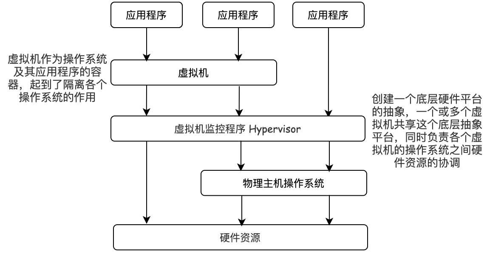

&emsp; &emsp;  虚拟机虽然是实现了虚拟化，但是所有的指令都必须经过虚拟机监视器的处理。这也就意味着，虚拟机的性能是低下的。为了解决这个问题，真实的虚拟机程序常常不完全遵循 ***Hypervisor*** 的设计结构，而是引入一些其他技术来解决效率问题。如在 *VMware Workstation* 中我们能够看到硬件辅助虚拟化的使用，通过让指令直达支持虚拟化的硬件，以此避开了效率低下的 ***Hypervisor***。

#### 1.1.2 容器

&emsp;&emsp; 容器是一个不依赖操作系统的运行应用程序的环境。它通过 Linux 的 ***Namespaces*** ( Linux命名空间，可以隔离进程的id、主机名、用户id、网络访问和进程通信等相关资源) 和 ***Cgroups*** ( 控制组是一项内核功能，能够控制和限制一个进程或多组进程的资源使用) 技术对应用程序进程进行隔离和限制。*Namespace* 的作用是隔离，它让应用进程只能看到该 *Namespace* 内的世界；而 *Cgroups* 的作用是限制分配给进程的宿主机资源。 容器只是运行在宿主机上的一种特殊进程，多容器之间使用的还是同一个宿主机的操作系统内核，该特点导致隔离性比虚拟机差。 但相比于虚拟机，容器更加简洁，不需要运行一个臃肿的客户机操作系统了。

>   <u>**Q1. 容器与虚拟机的区别 ？**</u> 
> &emsp;&emsp; ① 容器直接在宿主主机的操作系统上调用硬件资源，而非虚拟化硬件资源，容器是一个系统进程，虚拟机是在操作系统中的操作系统。
> &emsp;&emsp; ② 虚拟机使用的虚拟资源，存在两种情况，其一是虚拟机管理程序 *Hypervisor* 运行在宿主操作系统上，其二是虚拟机管理程序 *Hypervisor* 运行在裸机上（这种情况下，虚拟操作系统通过虚拟机管理程序来获取硬件资源 )。
> &emsp;&emsp; ③ 虚拟机和容器对资源的隔离层次不同。虚拟机是从系统层面出发，通过虚拟化硬件资源来达到隔离不同的操作系统，从而隔离不同的应用；容器是从进程层面出发，运行在操作系统之上的进程，通过分隔进程资源达到隔离不同的应用。
>
> 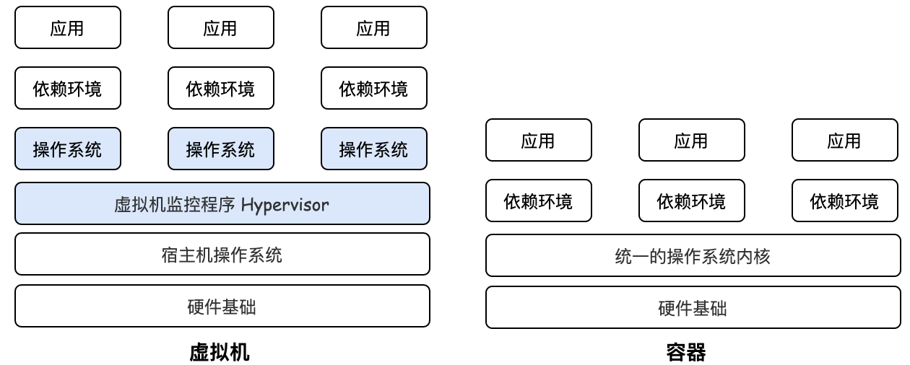

## 二、Docker容器

&emsp;&emsp; *Docker* 使用 Google 公司推出的 Go 语言 进行开发实现，基于 Linux 内核的 ***Cgroup***，***Namespace***，以及 AUFS 类的 Union FS 等技术，对进程进行封装隔离，属于 操作系统层面的虚拟化技术。由于隔离的进程独立于宿主和其它的隔离的进程，因此也称其为容器。*Docker* 在容器的基础上，进行了进一步的封装，从文件系统、网络互联到进程隔离等等，极大的简化了容器的创建和维护。使得 *Docker* 技术比虚拟机技术更为轻便、快捷。

>   <u>**Q1. 为什么要用Docker ？**</u> 
> &emsp;&emsp; **① 更高效的利用系统资源**：由于容器不需要进行硬件虚拟以及运行完整操作系统等额外开销，Docker 对系统资源的利用率更高。无论是应用执行速度、内存损耗或者文件存储速度，都要比传统虚拟机技术更高效。因此，相比虚拟机技术，一个相同配置的主机，往往可以运行更多数量的应用。
> &emsp;&emsp; **② 更快速的启动时间**：传统的虚拟机技术启动应用服务往往需要数分钟，而 Docker 容器应用，由于直接运行于宿主内核，无需启动完整的操作系统，因此可以做到秒级、甚至毫秒级的启动时间。
> &emsp;&emsp; **③ 一致的运行环境**： Docker 的镜像提供了除内核外完整的运行时环境，确保了应用运行环境一致性。
> &emsp;&emsp; **④ 持续交付和部署**：使用 Docker 可以通过定制应用镜像来实现持续集成、持续交付、部署。开发人员可以通过 ***Dockerfile*** 来进行镜像构建，并结合 持续集成 ( Continuous Integration ) 系统进行集成测试，而运维人员则可以直接在生产环境中快速部署该镜像，甚至结合持续部署 ( Continuous Delivery/Deployment ) 系统进行自动部署。
> &emsp;&emsp; **⑤ 更轻松的迁移**：由于 Docker 确保了执行环境的一致性，使得应用的迁移更加容易。因此用户可以很轻易的将在一个平台上运行的应用，迁移到另一个平台上，而不用担心运行环境的变化导致应用无法正常运行的情况。

### 2.1 Docker 架构

&emsp;&emsp;  *Docker* 是一个客户端-服务器 ( C/S ) 架构程序。*Docker* 客户端只需要向 *Docker* 服务器或者守护进程发出请求，服务器或者守护进程将完成所有工作并返回结果。*Docker* 提供了一个命令行工具以及一整套*RESTful API*。你可以在同一台宿主机上运行 *Docker* 守护进程和客户端，也可以从本地的 *Docker* 客户端连接到运行在另一台宿主机上的远程 *Docker* 守护进程。Docker 客户端是一个泛称，它可以是命令行Docker，也可以是遵循了 *Docker Api* 规则的客户端，简单地说可以理解为一个用于交互/发送指令的接口。

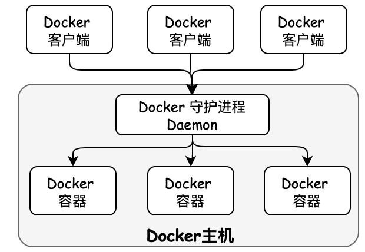

#### 2.1.1 Docker 组件

&emsp;&emsp;Docker 架构包含四个组件：**Docker镜像 ( *Docker Image* )、Docker容器 ( *Docker Container* )、Docker镜像仓库 ( *Docker Registry* )**、***Dockerfile***。

##### 1. Docker 镜像 ( Docker Image )

&emsp;&emsp;  镜像是 Docker 的基石，镜像是一个特殊的文件系统。它除了提供容器运行时所需的程序、库、资源、配置等文件外，还包含了一些为运行时准备的一些配置参数 ( 例如环境变量 )。镜像不包含任何动态数据，**其内容在构建之后也不会被改变，是一个只读的模板**。镜像是**分层的**，一个系统中镜像通常由多个层组成，在构建镜像时，*Dockerfile* 文件中的每一条指令都会创建一个镜像层。当镜像运行时，每一层镜像都是只读层( *read-only layer* )。

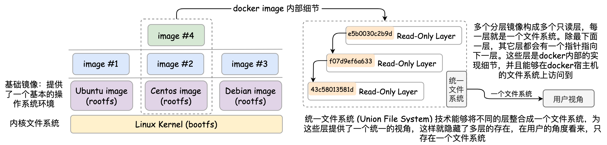

&emsp;&emsp;  Docker的镜像实际上由一层一层的 *UnionFS* 文件系统 (一种分层、轻量级并且高性能的文件系统，它支持对文件系统的修改作为一次提交来一层层的叠加 ) 组成。该文件系统包含两种基础文件：
&emsp;&emsp;  ● *bootfs* ( boot file system )：主要包含 *bootloader* 和 *kernel*， *bootloader* 主要是引导加载 *kernel*，Linux 刚启动时会加载 *bootfs* 文件系统，在Docker镜像的最底层是 *bootfs*。这一层与Linux/Unix系统是一样的，包含 *boot* 加载器和内核。当 *boot* 加载完成之后整个内核就都在内存中了，此时内存的使用权已由 *bootfs* 转交给内核，此时系统也会卸载 *bootfs*。
&emsp;&emsp;  ● *rootfs*  ( root file system )：在 *bootfs* 之上。包含的就是典型 Linux 系统中的 /dev、 /proc、 /bin、/etc 等标准目录和文件。*rootfs* 就是各种不同的操作系统发行版，比如 Ubuntu，Centos等等。

>  <u>**Q1. 为什么 Docker 镜像采用分层结构 ?**</u> 
>&emsp;&emsp; 最大的一个好处就是 - **共享资源**。比如：有多个镜像都从相同的base镜像构建而来，那么宿主机只需在磁盘上保存一份 *base* 镜像，同时内存中也只需加载一份 *base* 镜像，就可以为所有容器服务了，而且镜像的每一层都可以被共享。

##### 2. Docker 容器 ( Docker Container )

&emsp;&emsp;  容器是镜像运行时的实体，容器包括应用程序以及所有的依赖项，作为操作系统的独立进程运行。容器的实质是镜像运行的进程，但与直接在宿主执行的进程不同，**容器进程运行于属于自己的独立的命名空间**。因此容器可以拥有自己的 *root* 文件系统、自己的网络配置、自己的进程空间，甚至自己的用户 ID 空间。容器内的进程是运行在一个隔离的环境里，使用起来就好像是在一个独立于宿主的系统下操作一样。容器可以被创建、启动、停止、删除、暂停等。

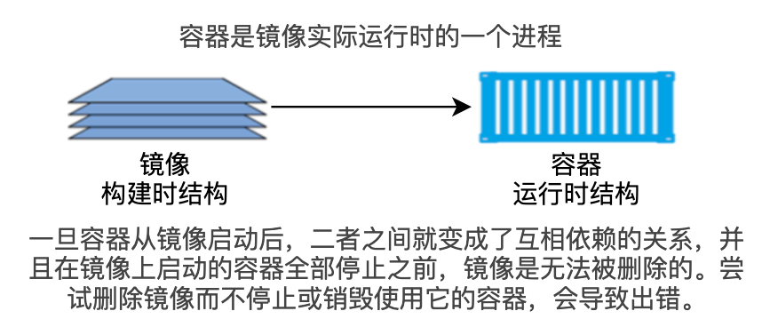

##### 3. Docker 镜像仓库 ( Docker Registry )

&emsp;&emsp;  集中存放镜像文件的地方，一个 *Docker Registry* 中可以包含多个仓库 ( *Repository* )，每个仓库可以包含多个标签  ( *Tag* )，每个标签对应一个镜像。通常一个仓库会包含同一个软件不同版本的镜像，而标签就用于该软件的各个版本。我们可以通过 `<repository>:<tag>`  的格式来指定具体是这个软件哪个版本的镜像，如 ubuntu:16.04。

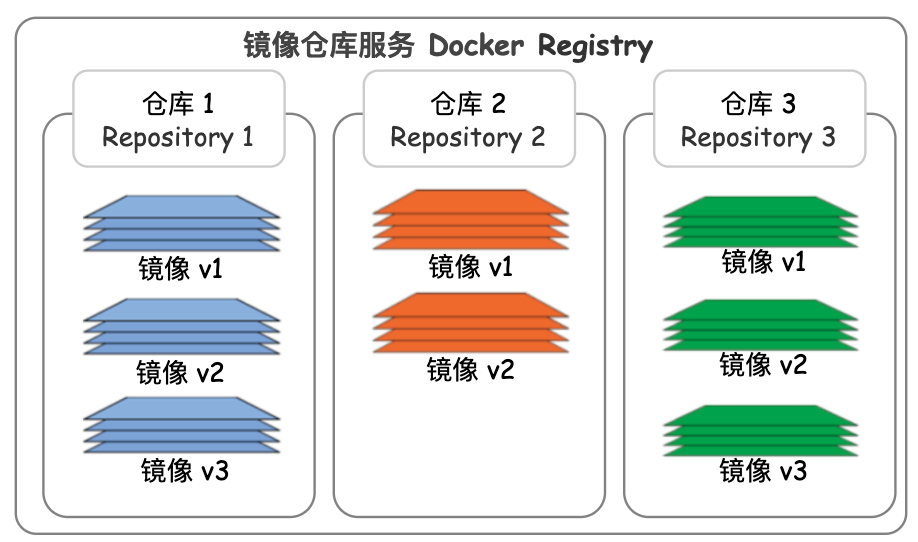

##### 4. Dockerfile

&emsp;&emsp; *Dockerfile* 是由一系列命令和参数构成的脚本，是一个Docker镜像的描述文件，*Dockerfile* 其内部包含了一条条的指令，每一条指令构建一层，因此每一条指令的内容，就是描述该层应当如何构建。通过 `docker build` 命令可以从 *Dockerfile* 文件中构建一个新的镜像。Dockerfile 的执行流程如下：
&emsp;&emsp;   ① docker 从基础镜像运行一个容器，执行一条指令并对容器作出修改。
&emsp;&emsp;   ② 执行 `docker commit` 的操作提交一个新的镜像层。
&emsp;&emsp;   ③ docker 再基于刚提交的镜像运行一个新容器。

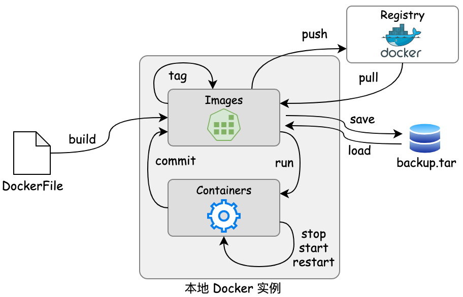

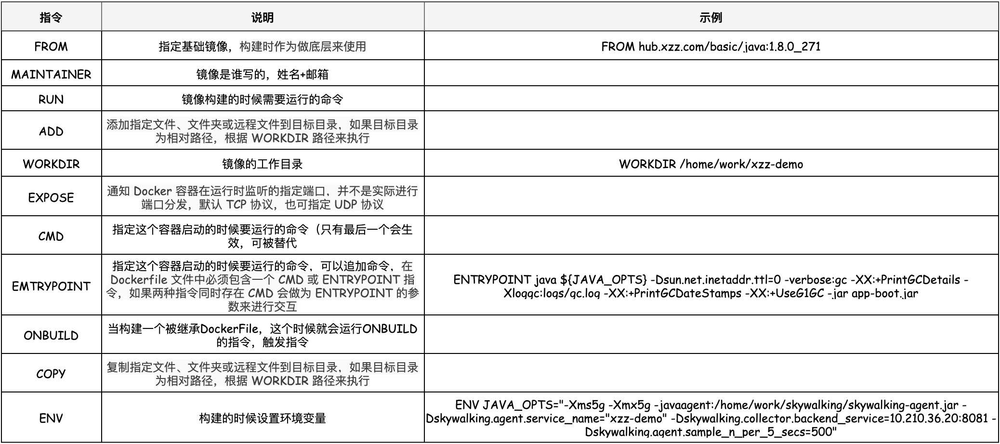

&emsp;&emsp;

## 三、容器集群管理 K8s

&emsp;&emsp;   *Kubernetes*（简称K8S）是一个基于容器技术的分布式架构解决方案，是 Google 开源的一个容器集群管理系统，用于管理容器化应用和服务。通过*Kubernetes* 能够进行应用的自动化部署和扩缩容。K8s 主要实现了以下功能：
&emsp;&emsp; ● **服务发现与负载均衡**：*kubernetes* 为多个容器提供一个统一访问入口 ( 内部IP地址和一个DNS名称 )，并且负载均衡会关联所有容器，使得用户无需考虑容器IP问题。如果请求到容器的流量很大，*kubernetes* 可以负载均衡并分配网络流量，从而使流量请求均衡稳定。
&emsp;&emsp; ● **存储编排**：*Kubernetes* 可以挂载外部存储系统，无论是本地存储，公有云，还是网络存储，都作为集群资源的一部分使用，极大提高存储使用灵活性。
&emsp;&emsp; ● **自动部署和回滚**：*Kubernetes* 采用滚动更新策略更新应用，一次更新一个Pod，而不是同时删除所有Pod，如果更新过程中出现问题，将回滚更改，确保升级不影响业务。
&emsp;&emsp; ● **自动二进制打包**：*Kubernetes* 允许指定每个容器所需 CPU 和内存（RAM）。当容器指定了资源请求时，可以按照决策来管理容器的资源。
&emsp;&emsp; ● **服务自愈与修复**：*Kubernetes* 会在节点故障时，重新启动失败的容器，替换和重新部署，保证预期的副本数量；杀死健康检查失败的容器，并且在容器未准备好之前不会处理用户的请求，确保线上服务不中断。
&emsp;&emsp; ● **弹性伸缩**：使用命令、UI或者基于CPU使用情况自动快速扩容和缩容应用程序实例，保证应用业务高峰并发时的高可用性；业务低峰时回收资源，以最小成本运行服务。

### 3.1 K8s 集群架构

&emsp;&emsp; 一个 *Kubernetes* 集群一般包含一个 Master 节点和多个 Node 节点，一个节点可以看成是一台物理机或虚拟机。

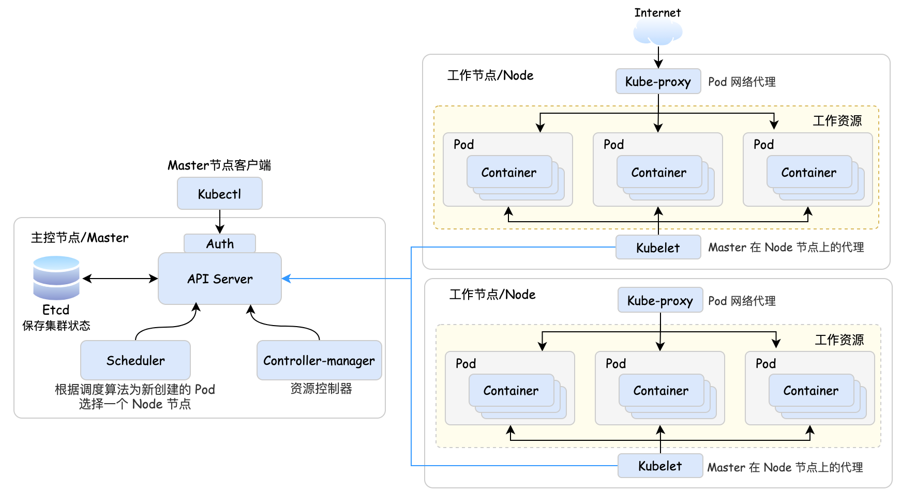

&emsp;&emsp; ● **Master**：Master 是 K8s 的集群控制节点，每个 K8s 集群里需要有一个 Master 节点来负责整个集群的管理和控制，基本上 K8s 所有的控制命令都是发给它，它来负责具体的执行过程。由于Master节点会控制所有指令，所以Master 节点通常会占据一个独立的服务器，如果它不可用，那么所有的控制命令都将失效。Master 中有以下几个关键组件：
&emsp;&emsp;&emsp; ① **kube-Api server**：集群的统一入口，各组件协调者，以 HTTP Rest 提供接口服务，**所有对象资源的增、删、改、查和监听操作都交给 *Api Server* 处理后再提交给 *Etcd* 存储**。
&emsp;&emsp;&emsp; ② **kube-Controller manager**：负责保证集群状态最终一致性，是 K8s 里所有资源对象的自动化控制中心，处理集群中常规后台任务，一个资源对应一个控制器。如果一个运用要求发布10个 *Pod*，*Controller manager* 会启动10个 *Pod*，如果一个 *Pod* 挂了，它会负责协调重新启动 *Pod*。如果 *Pod* 多了，它会协调关闭多余 *Pod*。
&emsp;&emsp;&emsp; ③ **kube-scheduler**：负责集群调度决策，当集群创建新的 *Pod* 时，*scheduler* 根据调度算法为新创建的 *Pod* 选择一个空闲的 Node 节点。
&emsp;&emsp;&emsp; ④ **etcd**：一个分布式的，一致的 key-value 存储，主要用途是共享配置和服务发现，保存集群状态数据，比如 Pod、Service 等对象信息。

&emsp;&emsp; ● **Node**：除了 Master，K8s 集群中的其它机器被称为 Node 节点，Node 节点是 K8s 集群中的工作负载节点，每个 Node 都会被 Master 分配一些工作负载。当某个 Node 宕机时，其上的工作负载会被 Master 自动转移到其它节点上去。Node 中有以下几个关键组件：
&emsp;&emsp;&emsp; ① **kubelet**：Master 在 Node 节点上的代理，与 Master 密切协作，管理本机运行容器的声明周期，负责Pod 对应的容器创建、启动、停止等任务，实现集群管理的基本功能。Node 节点运行期间会动态增加到 K8s 集群中，在默认情况下 *kubelet* 会向 Master 注册自己，一旦 Node 被纳入集群管理范围，*kubelet* 就会定时向 Master 节点汇报自身的情况 ( 如操作系统、Docker 版本、机器的 CPU 和内存情况，以及之前有哪些 Pod 在运行等 )，这样 Master 可以获知每个 Node 的资源使用情况，并实现高效均衡的资源调度策略。而某个 Node 超过指定时间不上报信息时，会被 Master 判定为“失联”，Node 的状态被标记为不可用 ( *Not Ready* )，其上的工作负载会被 Master 自动转移到其它节点上去。
&emsp;&emsp;&emsp; ② **kube-proxy**：在 Node 节点上实现 *Pod* 网络代理，实现 Kubernetes Service 的通信，维护网络规则和四层负载均衡工作。
&emsp;&emsp;&emsp; ③ **docker engine**：Docker 引擎，负责本机的容器创建和管理工作。
&emsp;&emsp;&emsp; ④ **Pod**：Pod 是 K8s 中最小的，最基本的部署单元，是一组容器的集合。

#### 3.1.1 Node 节点

##### 1. Pod

&emsp;&emsp;*Pod* 是 K8s 系统中可以创建和管理的最小单元，也是在 K8s 上运行容器化应用的资源对象。*Pod* 是由一个或多个 *Container* 组成。K8s 为每个 *Pod* 都分配了唯一的 IP 地址，称之为 *Pod IP*，每个 *Pod* 中包含一个或多个紧密相关的用户业务容器。*Kubernetes* 集群中的 Pod 主要有两种用法：
&emsp;&emsp; ●  **运行单个容器的 *Pod***："每个 *Pod* 一个容器"模型是最常见的 K8s 用例，由 K8s 直接管理 *Pod*。
&emsp;&emsp; ●  **运行多个协同工作的容器的 *Pod***：封装由多个紧密耦合且需要共享资源的共处容器组成的应用程序。 这些位于同一位置的容器会形成单个内聚的服务单元，在同一个 *Pod* 的多个容器之间相互访问时仅通过 *localhost* 就可以通信。只有在容器之间存在紧密的关联的场景中，才应该使用这种模式。
&emsp;&emsp; 每个 *Pod* 都运行着给定应用程序的单个实例。如果希望横向扩展应用程序 (例如，运行多个实例以提供更多的资源和性能)，则应该使用多个 *Pod*，每个实例使用一个 *Pod*。 在 K8s 中，这些扩展出来的 *Pod* 通常被称为**副本 ( *Replication* )**。 为了能更方便的管理这些 *Pod* ，通常使用工作负载资源来创建和管理一组 *Pod* 副本。

###### (1). *Pod* 的应用容器与 *Init* 容器

&emsp;&emsp; 在 *Pod* 当中，多 (单) 个 *Container* 形成一个内聚的服务单元 ， ***Pod* 中的容器会被自动安排到集群中的同一物理机或虚拟机上，并可以一起进行调度**。由于是多个容器在同一个物理机或虚拟机上，因此 Pod 可以为其包含的容器提供**两种共享的资源：网络资源和存储资源**。为了能保证 *Pod* 中多个容器之间可以实现资源的共享，每个 *Pod* 都由一个特殊的根容器 *Pause* 容器作为 *Pod* 的根容器，并以 *Pause* 容器的状态代表整个容器组的状态。*Pod* 里的多个业务容器共享 *Pause* 容器的IP，共享 *Pause* 容器挂载卷 *Volume*。在同一个 *Pod* 的多个容器之间相互访问时仅通过 *localhost* 就可以通信。

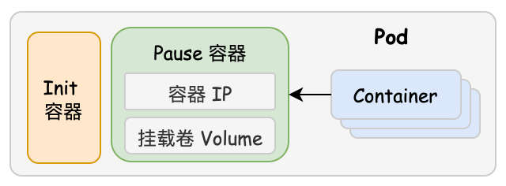

&emsp;&emsp;  除了正常工作的应用容器，*Pod* 中还存在一种特殊的容器：***Init* 容器**。该容器会先于应用容器启动。如果一个 *Pod* 指定了多个 *Init* 容器，这些容器会按顺序逐个运行。如果 *Pod* 的某个 *Init* 容器启动运行失败，*kubelet* 会不断地重启该 *Init* 容器直到该容器成功为止。 然而，如果 *Pod* 对应的重启策略 `restartPolicy = "Never"`，并且 *Pod* 的 *Init* 容器失败， 则 K8s 会将整个 *Pod* 状态设置为失败 ( *Failed* )。如果 *Pod* 发生了重启，所有 Init 容器必须重新执行。因为 Init 容器可能会被重启、重试或者重新执行，所以 *Init* 容器的代码应该是幂等的。在 *Pod* 中的每个应用容器和 *Init* 容器的名称必须唯一，否则会在校验时抛出错误。

>   <u>**Q1. *Init* 容器与应用容器的区别 ?**</u> 
> &emsp;&emsp;   ① *Init* 容器先于应用容器启动，如果为一个 *Pod* 指定了多个 *Init* 容器，这些容器会按顺序逐个运行。 每个 *Init* 容器必须运行成功，下一个才能够运行。当所有的 *Init* 容器运行完成时， K8s 才会为 *Pod* 初始化应用容器。
> &emsp;&emsp;   ② *Init* 容器是单独的镜像，与应用容器分离。因此 *Init* 容器可以包含一些安装过程中应用容器中不存在的实用工具或自定义代码。
> &emsp;&emsp;   ③ 与同一 *Pod* 中的多个应用容器相比，*Init* 容器能以不同的文件系统视角 (权限) 运行。因此，*Init* 容器可以被赋予访问应用容器不能访问的敏感信息 ( *Secret* ) 权限 (如密码、令牌或密钥信息)。
> &emsp;&emsp;   ④ 由于 *Init* 容器必须在应用容器启动之前运行完成，因此 *Init* 容器提供了一种机制来阻塞或延迟应用容器的启动，直到满足了一组先决条件。 一旦前置条件满足，*Pod* 内的所有的应用容器会并行启动。

###### (2). *Pod* 的生命周期与阶段

&emsp;&emsp;*Pod* 在其生命周期中只会被调度一次。 一旦 *Pod* 被调度 (分派) 到某个节点，*Pod* 会一直在该节点运行，直到 *Pod* 停止或者被终止。在 Pod 的生命周期中包括以下几个阶段：

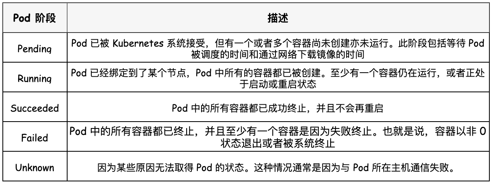

#### 3.1.2 Master 节点

##### 1. Controller Manager 控制器 ( 工作负载资源控制器 )

&emsp;&emsp; 通常情况下，一个服务会由多个包含相同容器的 *Pod* 为服务提供服务资源，这个的一组 *Pod* 称为工作负载。为了减轻用户的使用负担，通常不需要用户直接管理每个 *Pod*，而是使用**工作负载资源控制器**来创建和管理多个 *Pod*。 工作负载资源通过资源控制器 *Controller-manager* 负责集群内的 *Node*、*Pod*副本、服务端点 ( *Endpoint* )、命名空间 ( *Namespace* ) 、服务账号 ( *ServiceAccount* ) 、资源定额 ( *ResourceQuota* ) 的管理，当某个 *Node* 意外宕机时，*Controller Manager* 会及时发现并执行自动化修复流程，来确保处于正确运行状态的 *Pod* 个数与用户所指定的状态相一致。

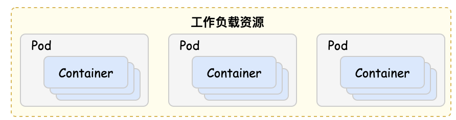

###### (1). *Pod* 的应用容器与 *Init* 容器

&emsp;&emsp;在 *Kubernetes* 中提供若干种内置的工作负载资源：
&emsp;&emsp; ●  *ReplicaSet* 控制器：
