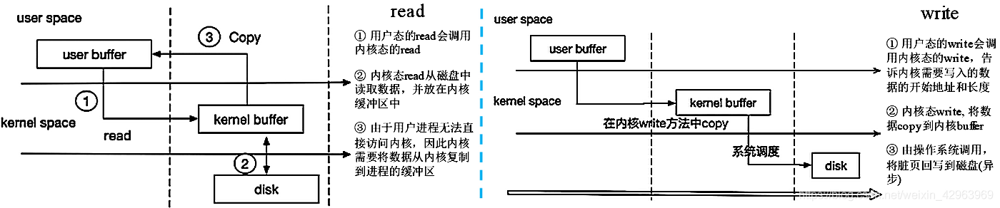
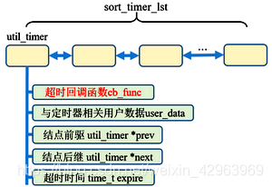
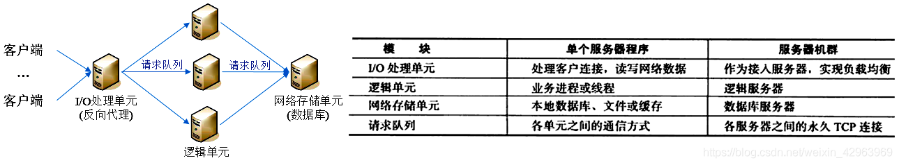
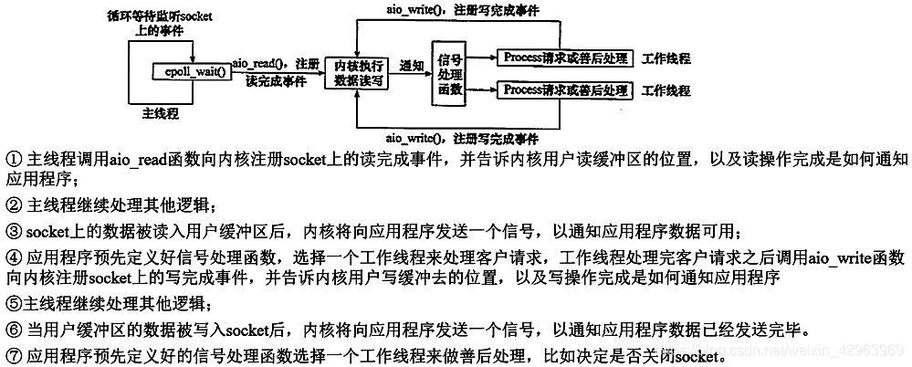
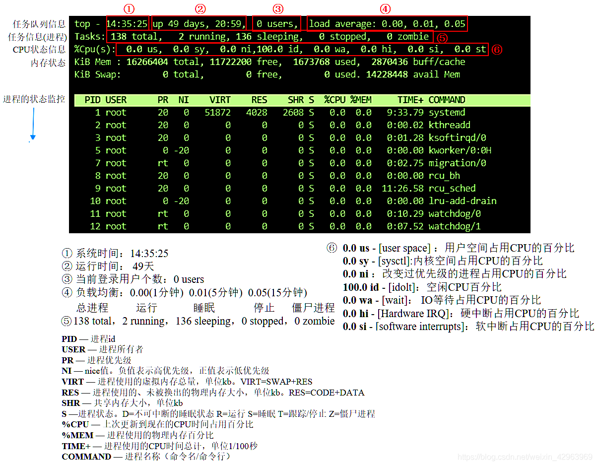

## 一、计算机系统

### 1. 计算机系统的整体框架

&emsp; &emsp;一个经典的计算机系统，通常由五部分组成：运算器，存储器，控制器，输入设备，输出设备。如下图为更详尽的计算机的系统框架：


&emsp; &emsp;① 总线：总线用于各个部件间的信息的传递，总线被设计成传送定长的字节块(字,word)。字中的字节数(字长)是基本的系统参数。在32位计算机中，字长为4个字节，在64位计算机中，字长为8个字节。 &emsp;
&emsp;② I/O设备：I/O设备是基本的输入输出，通过I/O总线与其他部件传递信息。 &emsp; &emsp;③
主存储器：主存是计算机中数据的临时存储设备，由DRAM组成。从逻辑上来说，存储器是一个线性的字节数组，每一个字节都有其唯一的地址(索引)。 &emsp; &emsp;④ CPU: CPU的核心是一个大小为一个字的寄存器 --- 程序计数器(
PC)，在任意时刻，PC都指向主存中的某条机器语言指令(其地址)。 &emsp; &emsp;下图是一个hello的程序，从磁盘读入内存，再到，程序运行，输出结果的数据流程：


***

### 2. 存储器

&emsp; &emsp;在存储器中， 不同层次的存储器其指令执行的效率有着很大的差别。<font color=green>
存储器层次结构的中心思想是：对于每个k，位于k层的更快更小的存储设备作为位于k+1层更大更慢存储设备的缓存。</font>存储器的层次结构如下图所示：


#### 2.1 存储缓存 cache

&emsp; &emsp;缓存是上一级存储设备中经常被访问的数据的临时存储。


***

### 3. 程序编译原理

&emsp; &emsp; 编译程序计算机系统的基本组成，编译程序的功能如下图所示，其目标是将一个高级语言程序转换为低级语言程序。


&emsp; &emsp;一个高级语言的程序不能被计算机直接运行，因为计算机只能对二进制数据进行计算，因此需要将高级语言程序通过编译器驱动程序转换为可执行目标程序。如一个hello.c的程序转换过程如下图所示：


&emsp; &emsp;**① 预处理阶段**：预处理器根据`源文件.cpp`，读取系统头文件中(`#include<stdio.h>`)的内容，并插入到程序文本中，得到一个`.i为后缀的文件`。{ `.cpp -> .i` }
&emsp; &emsp;**② 编译阶段**：编译器将预处理后的.i文件翻译成汇编语言程序。{ `.i -> .s` } &emsp; &emsp;**③ 汇编阶段**：汇编器将汇编语言程序翻译成可重定位目标程序。{ `.s -> .o`
} &emsp; &emsp;**④ 链接阶段**：链接器将多个可重定位目标程序进行合并，生成最终的可执行文件。

#### 3.1 程序预处理过程 (预处理器)

&emsp; &emsp; 程序的预处理主要包括条件编译，源文件(.h)包含，宏替换，行控制，抛错，杂注和空指令。 &emsp; &emsp;① 条件编译： &emsp; &emsp;
条件编译的功能是根据条件有选择性的保留或放弃源文件中的内容 ，常见的条件编译包括`#if`，`#ifdef`，`#ifndef`开始，`#endif`结束。

```cpp
#if defined(CREDIT)
    credit();
#elif defined(DEBIT)
    debit();
#else
    printerror();
#endif
```

&emsp; &emsp;② 源文件包含 &emsp; &emsp; 源文件包含是搜索指定的文件，并将它的内容包含到程序中，放在当前所在的位置。源文件包含两种：系统文件，用户自定义文件。

```cpp
#include<stdio.h>  //系统文件
#include"test.h"   //用户自定义文件
```

&emsp; &emsp;③ 宏替换 &emsp; &emsp; 宏的本质是替换，将文本中的标识符用对应的预处理记号进行替换。宏定义分为两种方式：无参数宏(对象宏定义)和有参数宏(函数式宏定义)

```cpp
#define Max 1024
#define max(a,b,c) (a>b?(a>c?a:c):(b>c?b:c))
```

&emsp; &emsp; ④ 行控制 &emsp; &emsp; 行控制与“`#`”和“`LINE`”引导，后面是行号和可选的字面串，用于改变预定义宏`__LINE__`的值，如果后面的字面串存在，则改变`__FILE__`的值。

```cpp
#include<stdio.h>
int main(){
	printf("%d,%s",__LINE__,__FILE__);
#line 1 "Test"
	printf("%d,%s",__LINE__,__FILE__);  //此时行号和文件名被改变
}
```

&emsp; &emsp; ⑤ 抛错 &emsp; &emsp; 宏定义抛错指令以“#”和“error”引导的，抛错指令用于在预处理期间发出一个诊断信息，抛错是人为定义的动作。

```cpp
#include<stdio.h>
#define max 100
int main(){
#ifndef max
#error "Nomax"
#endif

#ifdef max
#error "max"
#endif
}
```

#### 3.2 程序编译过程 (编译器)

&emsp; &emsp;
一个程序的编译是划分为不同的阶段进行的，各个阶段的操作在逻辑上市连接的一起的。编译过程分为6个阶段：词法分析，语法分析，语义分析，中间代码生成，代码优化和目标代码发生成。除此之外，编译程序还包括表格管理和出错处理两个工作。

💗 **3.2.1 程序编译的6个阶段**
&emsp; &emsp; ① 词法分析 &emsp; &emsp; 词法分析就是将编辑好的程序，从左到右一个字符一个字符的读入源程序中，对过程源程序的字符流进行扫描和分解，从而识别出程序中的一个个单词(
这里的单词是指逻辑上紧密相连的一组字符)
&emsp; &emsp; ② 语法分析 &emsp; &emsp;
语法分析是在词法分析的基础上将单词序列分解成各类语法短语，如程序，语句，表达式等。语法分析描述了程序结构的规则，通过语法分析确定整个输入串是否构成一个语法上正确的程序。如下为`int a=b+10`的语法树。


&emsp; &emsp; ③ 语义分析 &emsp; &emsp; 审查源程序有无语义错误，为代码生成阶段收集类型信息。如判断一个数组下标是否为正整数，int类型与string类型相加等。 &emsp; &emsp; ④
中间代码生成与代码优化 &emsp; &emsp;
在语义分析后，编译程序将源程序变成一种内部表示形式，称为中间代码。中间代码是一种结构简单，含义明确的记号系统，记号系统的两个基本原则是：容易生成，容易将它翻译成目标代码。常见的中间代码为四元式 (运算符，运算对象1，运算对象2，结果)。
代码优化是将产生的中间代码进行变换和改造，使生成的目标代码更为高效。 &emsp; &emsp; ⑤ 目标代码生成 &emsp; &emsp;
将优化后的中间代码变换成特定机器上的绝对指令代码或可重定位的指令代码或汇编指令代码。目标代码生成是编译的最后阶段，它的工作与硬件系统结构和指令含义有关。

💗 **3.2.2编译器的其他功能**
&emsp; &emsp; 编译器在对源程序进行编译的同时，会针对程序的内容执行不同的操作，如下图所示：

  

&emsp; &emsp; <font color=SlateBlue><u>**Q1. 关于“编译时分配内存”的说法 ？**</u></font>
&emsp; &emsp; 在编译时，程序中能够明确空间大小的变量，会“进行内存分配”，如下图所示：

&emsp; &emsp; 但是，编译其实只是一个扫描过程，进行词法语法检查，代码优化而已，编译程序越好，程序运行的时候越高效。<font color=red>编译时是不分配内存的，此时只是根据声明时的类型进行占位(
在可执行目标文件`ELF`中，描述着编译时的占位情况)，到以后程序执行时分配才会内存。</font>只有当程序运行时，操作系统会创建进程，同时将可执行程序从硬盘中加载到内存中，此时才会真正的分配内存空间。


&emsp; &emsp; <font color=SlateBlue><u>**Q2. 编译器对默认成员函数的生成 ？**</u></font>
&emsp; &emsp; 在编译器对类进行编译时，如果类是一个空类，则编译器会自动生成<font color=green>默认构造函数，析构函数，默认拷贝构造函数(浅拷贝)，取址运算符，const取址运算符，赋值运算符。</font>

#### 3.3 程序链接 (链接器)

&emsp; &emsp;在预处理，编译，汇编阶段，程序与源程序以文件为单位一个个的转换为目标文件，再由链接器将目标文件组合成一个可执行文件或库。因此，<font color=red>链接的过程就是解决目标文件之间各种符号(变量，函数)
相互引用(对其在内存中的具体地址的引用)的问题，链接的本质是符号的重定位。</font>
&emsp; &emsp; 在每个可重定位目标文件中都有一个符号表，包含了目标文件中定义和引用的符号，存在三种链接器符号：


&emsp; &emsp;在程序链接阶段通常分为两种链接方式：<font color=green>静态链接和动态链接。</font>
&emsp; &emsp;<font color=red>静态链接与动态链接最大的区别就是链接的时机不同，静态链接是在形成可执行程序之前，而动态链接是在程序执行时进行的。</font>

💗 **3.3.1 链接的本质 - 符号重定位**
&emsp; &emsp; <font color=red>链接的本质是对符号(函数，变量)的重定位。</font>
&emsp; &emsp; ● 静态链接的符号重定位如下图所示：在编译时将不明确的符号加入到 <font color=green>重定向表</font>中，在链接时确定具体的符号地址。

&emsp; &emsp; ● 在linux中，动态链接的符号重定位有两种方式：加载时符号重定位和地址无关代码。 &emsp; &emsp; ① 加载时符号重定位与静态时符号重定位原理相同，唯一的区别是将链接时机放到了程序运行时(
动态库被加载到内存中)。 &emsp; &emsp; 加载时符号重定位存在两个问题： &emsp; &emsp; &emsp; Ⅰ.不能使动态库的指令代码被共享 &emsp; &emsp; &emsp;
Ⅱ.动态库加载到内存时，对动态库中的符号引用进行重定位需要花费较多的时间。

&emsp; &emsp; ② 地址无关代码(`PIC`)
&emsp; &emsp; 针对加载时符号重定位的问题，ELF引入地址无关代码方法。 &emsp; &emsp; =>1. 对于模块内符号的访问(`static`变量和函数)： &emsp;
&emsp; <font color=red> `static`函数在动态库编译完成时，模块内的相对地址就已经确定了，且函数调用只用到相对地址，因此不需要进行重定位。</font>
对于访问数据，因为访问数据需要绝对地址，当动态库编译好之后，库中的数据段，代码段的相对位置就已经固定了，此时对任意一条指令来说，该指令的地址与数据段的距离都是固定的，那么，只要程序在运行时获取到当前指令的地址，就可以直接加上该固定的位移，从而得到所想要访问的数据的绝对地址。
&emsp; &emsp; =>2. 对于外部模块的符号的访问： &emsp; &emsp; 因为动态库运行时被加载到哪里是未知的，为了能使得代码段里对数据及函数的引用与具体地址无关，ELF
在动态库的数据段中加一个`GOT(global offset table)`表项,, `GOT`表格中放的是数据全局符号的地址,该表项在动态库被加载后由动态加载器进行初始化，动态库内所有对数据全局符号的访问都到该表中来取出相应的地址。

💗 **3.3.2 静态链接**
&emsp; &emsp; <u>**Q1. 为什么要使用静态链接 ？**</u>
&emsp; &emsp;在程序中，每个源文件并不是相互独立的，而是存在相互依赖关系。但在编译过程中每个源文件(`*.c)`都是独立编译，生成一个`*.o`文件。这就需要静态链接，将产生目标文件进行链接，形成可执行的程序。


&emsp; &emsp; <u>**Q2. 静态链接的优缺点 ？**</u>
&emsp; &emsp;● 缺点：由于每个可执行程序对所有需要的目标文件建立副本，从而浪费空间。其次，静态链接的更新困难，当某个库函数更新后，就需要重新进行编译链接。 &emsp; &emsp;●
优点：在可执行程序中具备了执行程序的所有东西，执行速度快。 💗 **3.2.2 动态链接**
&emsp; &emsp;为了解决静态链接中的问题，提出了动态链接。动态链接将程序按模块拆分为独立的部分，在程序的运行时才链接在一起。


&emsp; &emsp; <u>**Q1. 动态链接的优缺点 ？**</u>
&emsp; &emsp; ● 优点：动态链接的每个程序都依赖同一个库，不会建立副本。其次，动态链接的更新方便，更新时只需替换原来的目标文件，不需要将所有程序重新编译链接一遍。 &emsp; &emsp; ●
缺点：由于动态链接是程序运行时链接，因此性能上低于静态链接。

#### 3.4 ELF文件

&emsp; &emsp; ELF文件是一种对象文件格式，可以定义不同的对象文件中都放了什么东西。对象文件通常分为三种，不同的对象文件对应着不同ELF文件： &emsp; &emsp; ① 可重定位的对象文件(可重定位目标文件)
&emsp; &emsp; ② 可执行的对象文件(可执行文件)
&emsp; &emsp; ③ 可共享的对象文件

&emsp; &emsp; ELF文件提供两种不同的观察视角，从链接的角度来看，从执行的角度来看。如下图所示：


💗 **3.4.1 可重定位ELF文件**
&emsp; &emsp; 可重定向`ELF`文件是经过编译器编译后，并通过汇编得到的`ELF`文件。其结构如下图所示：


💗 **3.4.2 符号表**
&emsp; &emsp; 在源程序经过编译器后，会将程序中的标识符编译成符号，并保存到符号表中。 &emsp; &emsp; 符号表是每个`ELF`
文件中的一个重要部分，是编译器和解释器中的数据结构，它保存了程序实现或使用的所有变量和函数，并将程序源代码中的每个标识符和它声明或使用的信息绑定在一起。如果程序引用了一个自身代码未定义的符号，则称之为未定义的符号。符号表的基本属性如下图所示：


#### 3.5 提高编译的效率

&emsp; &emsp; C++是基于“头文件-源文件”的编译方式的，每个源文件作为一个编译单元，每个编译单元都会产生一个可重定位目标文件(obj)。下面从三个角度来介绍如何提高编译效率：

&emsp; &emsp;**① 代码角度**： &emsp; &emsp; ● 在头文件中使用前置声明，而不是直接包含头文件。 &emsp; &emsp; 第一个原则:
如果可以不包含头文件，那就不要包含,这时候前置声明可以解决问题,如果使用的仅仅是一个类的指针，没有使用这个类的具体对象（非指针），也没有访问到类的具体成员，那么前置声明就可以了,因为指针这一数据类型的大小是特定的，编译器可以获知.。
&emsp; &emsp; 第二个原则: 尽量在CPP文件中包含头文件，而非在头文件中。 &emsp; &emsp; ● 使用`Pimpl`模式：`Pimpl`
模式可以将类的接口与实现得以完全分离，当对类进行修改时，只需要编译包含该类的cpp文件即可，无需全部编译。 &emsp; &emsp; ● 删除冗余的头文件

&emsp; &emsp;**② 编译资源角度：**
&emsp; &emsp; ● 并行编译 &emsp; &emsp; ● 分布式编译

### 4. 程序局部性

&emsp; &emsp;良好的程序具有良好的局部性，倾向于引用邻近于其他最近引用过的数据项的数据项，或最近引用过的数据项本身，这种倾向性称为程序的局部性。 &emsp; &emsp;局部性包括时间局部性和空间局部性。 &emsp;
&emsp;① 时间局部性：被引用过一次的内存位置在不远的将来再次被多次引用。 &emsp; &emsp;② 空间局部性：被引用过一次的内存位置，在不远将来会引用附件的一个内存位置。


&emsp; &emsp;如何判断一个程序的局部性： &emsp; &emsp;① 重复引用相同变量的程序有良好的时间局部性。 &emsp; &emsp;②
对具有步长为k的引用模式程序，步长越小，空间局部性越好。在内存中大步长跳来跳去的程序空间局部性很差。 &emsp; &emsp;③ 对于取指令，循环有良好的时间和空间局部性，循环体越小，循环迭代次数越多，局部性越好。

### 5. 程序的运行

&emsp; &emsp;程序编译后会生成二进制可执行程序文件。当程序运行时首先要将可执行程序文件装入内存中，然后操作系统创建进程，读入程序，随后程序才会被执行。


## 二、操作系统

&emsp; &emsp;操作系统是管理计算机硬件与软件资源的计算机程序。操作系统是计算机中负责支撑应用程序运行环境以及用户操作环境的系统软件。

### 2.1 操作系统体系结构

&emsp; &emsp;在操作系统中需要对执行权限进行分级，分为**用户态**和**内核态**，所以。


#### ▍ **2.1.1 内核态与用户态**

##### <font color=Sienna>**1. 内核态**</font>

&emsp; &emsp; 内核处于硬件和应用软件之间的中间层，其作用是<font color=green>
将应用程序的操作和请求传递给硬件，并充当底层驱动程序，对系统中的各个设备和组件进行寻址，并管理和分配资源。内核面向应用程序提供了系统调用，保证了应用程序的开发与硬件没有任何联系，应用程序只与内核有关</font>。 &emsp;
&emsp; 内核的实现主要有两种方式：<font color=red>**微内核**</font ><font color=red>**与宏内核**</font >


&emsp; &emsp; 系统内核的体系结构主要分为7个部分，如下图所示：


> <font color=SlateBlue><u>**Q1. 为什么有内核态和用户态 ？**</u></font>
> &emsp; &emsp; 操作系统的资源是有限的，如果访问资源的操作过多，必然会消耗过多的资源，而且如果不对这些操作加以区分，很可能造成资源访问的冲突。<font color=green>**为了减少有限资源的访问和使用冲突，对不同的操作赋予不同的执行等级**。</font>
> &emsp; &emsp; `Linux`操作系统中主要采用了0和3两个特权级，分别对应的就是内核态和用户态。运行于用户态的进程可以执行的操作和访问的资源都会受到极大的限制，而运行在内核态的进程则可以执行任何操作并且在资源的使用上没有限制。
> <font color=SlateBlue><u>**Q2. 内核态和用户态的区别 ？**</u></font>
> &emsp; &emsp; 内核态中，CPU可以访问内存的所有数据，也可以从一个程序切换到另一个程序。而用户态只能受限的访问内存，且用户态相比内核态有较低的执行权限。<font color=green>进程在用户态时，只能访问用户空间内存。只有进入内核态后，才可以访问内核空间的内存；</font>
> <font color=SlateBlue> <u>**Q3. 内核态与用户态的切换 ？**</u></font>
> &emsp; &emsp;当出现以下三种情况时，会发生从用户态到内核态的切换：
> &emsp;&emsp;  <font color=green>① 系统调用：</font>系统调用的本身也是中断，相对于外围设备的硬中断，这种中断称为软中断，其中断请求是进程主动申请的。
> &emsp;&emsp; <font color=green>② 异常：</font>当CPU正在执行运行在用户态的程序时，发生某些预先不可知的异常事件，这个时候就会触发从当前用户态执行的进程转向内核态执行相关的异常事件，如缺页异常。
> &emsp;&emsp; <font color=green>③ 外围设备的中断。</font>

&emsp; &emsp;虽然每个进程都各自有独立的虚拟内存，但是<font color=green>每个虚拟内存中的<u>内核地址</u>，其实关联的都是相同的物理内存。</font>
这样，进程切换到内核态后，就可以很方便地访问内核空间内存。


***

### 2.2 程序 -> 进程 -> 线程 -> 协程

&emsp; &emsp; 进程与线程是操作系统的核心，是系统应用程序运行的基础。程序，进程，线程不是单独割裂的，是一种相互依赖，相互递进的关系。

#### **▍2.2.1 程序，进程与线程关系**

> <font color=SlateBlue> <u>**Q1. 程序与进程有什么区别？**</u></font>
>&emsp; &emsp; ① 程序是永存的，进程是暂时的，进程是程序在数据集合的一次运行，进程有创建，撤销，终止。
>&emsp; &emsp; ② 程序是静态的，进程是动态的。
>&emsp; &emsp; ③ 进程具有并发性，而程序没有。
>&emsp; &emsp; ④ 进程是计算机资源的基本单位。
>&emsp; &emsp; ⑤ 进程与程序不是一一对应的关系，一个程序可能包含很多进程。
><font color=SlateBlue><u>**Q2. 什么是进程？**</u></font>
>&emsp; &emsp; 广义来说，进程是一个具有一定独立功能的程序关于某个数据集合的一次运行活动，<font color=red>进程是操作系统动态执行的基本单元，进程是系统资源分配的独立实体。线程作为调度和分配的基本单位，进程作为资源分配的基本单位。</font> 一个进程的组成实体可以分为两大部分：<font color=green>线程集合</font>和<font color=green>资源集合。</font>
>&emsp; &emsp; 狭义来说，一个进程就是一个正在执行的程序实例，包括程序计数器，寄存器和变量的当前值。
><font color=SlateBlue> <u>**Q3. 进程的特性？**</u></font>
>&emsp; &emsp; ① 动态性：进程的实质是一次程序执行的过程，有创建、撤销等状态的变化。
>&emsp; &emsp; ② 并发性：进程可以做到在一个时间段内，有多个程序在运行中。
>&emsp; &emsp; ③ 独立性：进程可以独立的分配资源，接受调度，独立运行。
>&emsp; &emsp; ④ 异步性：进程之间是相互制约的。
>&emsp; &emsp; ⑤ 结构性：进程是有结构的。
><font color=SlateBlue> <u>**Q4. 为什么要引入线程，什么是线程？**</u></font>
>&emsp; &emsp; <font color=green>由于进程是一个资源的拥有者，因而在创建，撤销，切换中，需要保存进程上下文，系统必须为之付出较大的开销。为了多个程序更好的并发执行，同时有减少系统的开销，从而引入了线程</font>，并使线程作为系统调度的基本单位，而进程仅仅是操作系统资源分配的基本单位一个进程可以并发多个线程。 同一进程中的多条线程的资源关系图下图所示：
>
> 
>
>  <font color=SlateBlue><u>**Q5. 线程与进程的区别 ？**</u></font>
> &emsp; &emsp; &emsp; ① 根本区别：<font color=red>进程是操作系统动态执行的基本单元，线程是资源调度最小单元。</font>
> &emsp; &emsp; &emsp; ② 地址空间：进程有自己独立的地址空间，每启动一个进程，系统会为其分配地址空间。线程没有独立的地址空间，同一进程的线程共享本进程地址空间。
> &emsp; &emsp; &emsp; ③ 资源：进程之间的资源是独立的；同一进程内的线程共享本进程的资源。
> &emsp; &emsp; &emsp; ④ 执行过程：每个进程都有一个程序运行入口，但线程不能独立运行，必须依存在进程当中。
> &emsp; &emsp; &emsp; ⑤ 系统开销：进程的开销大，线程的开销小。

#### **▍2.2.2 线程的实现方式**

&emsp;&emsp; 线程作为调度和分配的基本单位，进程作为资源分配的基本单位。<font color=green>在线程概念中，主要分为3种线程：**内核线程，轻量级线程(`LWP`)，用户线程。**</font>


&emsp;&emsp; **① 内核线程** ***KLT***
：指运行在内核空间的线程，是直接由操作系统内核支持，并由内核完成线程的切换。每一个内核线程可以视为内核的一个分身。内核通过调度器对线程进行调度，并将线程的任务映射到各个处理器上。通常来说，程序不会直接使用内核线程，而是调用轻量级线程 ( ***
LWP*** )。内核线程不受用户空间上下文切换的影响，可以在全系统范围内竞争CPU的资源。 &emsp;&emsp; **② 轻量级进程 *LWP***: 轻量级进程就是我们通常来说的线程，它是内核线程的高度抽象。**每个 *LWP*
都由一个内核线程支持**，因此，每个 ***LWP*** 都是一个独立的调度单元，即使有一个 ***LWP*** 在系统调用中被阻塞了，也不会影响整个进程的工作。 &emsp; &emsp; ●
轻量级进程的CPU时间片是以线程为基本单位进行分配的，每个线程在生命周期内绑定到一个内核线程上，当 LWP被用户终止时，LWP 与 KLT 会同时从系统中死亡。 &emsp; &emsp; ●
在多处理器系统中，内核能够并行执行同一个进程内的多个线程，如果一个 ***LWP*** 在系统调用中被阻塞了，也不会影响整个进程的工作。


&emsp;&emsp; **③ 用户线程 *UT***：广义来说，除了内核线程的其他线程都可以称为用户线程，因此，轻量级用户进程程也属于用户线程的一种。从狭义来说，用户线程是指完全建立在用户空间的线程库上，系统内核不感知用户线程的存在。
&emsp; &emsp; ● **
用户线程的创建，调度，同步，销毁完全在用户态中完成，不需要内核的帮助。因此，用户线程不需要切换到内核态，对用户线程的操作是高效且低消耗的。用户进程对内核是透明的，其所属的进程单独参与CPU的竞争，而进程中的所有线程参与竞争该进程的资源。**
&emsp; &emsp; ● **用户线程的CPU时间片分配是以进程为基本单位进行分配的**，所以每个线程的执行时间相对较少。在多个处理机下，**同一个进程中的不同线程只能在同一个处理机下分时复用。**
&emsp; &emsp; ● **任意时刻只有一个CPU内核分配给进程，每个进程只能有一个线程运行。因此，当用户线程发生I/O或者页面故障而引起阻塞时，会阻塞整个进程，从而阻塞进程中的所有线程。**
&emsp; &emsp; ● 用户线程对操作系统内核是不可见的，不能被操作系统感知，只能通过线程库调用进入内核，用户线程执行系统调用时，会导致其所属的进程被中断。


&emsp;&emsp; **④ 用户线程 + 轻量级进程混合实现 **
&emsp;&emsp;
在混合实现下，既存在用户线程，也存在轻量级进程。用户线程完全建立在用户空间中，提供用户线程创建、切换、析构等高效率的操作，并支持大规模的用户线程并发。轻量级进程作为用户线程和内核线程之间的桥梁，用户线程系统调用通过轻量级进程来完成，降低了整个进程被完全阻塞的风险。


#### **▍2.2.2 进程**

&emsp; &emsp;
进程是一个具有一定独立功能的程序关于某个数据集合的一次运行活动。它是操作系统动态执行的基本单元。进程是正在运行的程序过程的抽象，其目的在于清晰地刻画动态系统的内在规律，有效管理和调度进入计算机系统主存储器运行的程序。进程的特性如下：
&emsp; &emsp; ● 动态性：进程的实质是程序在多道程序系统中的一次执行过程，进程是动态产生，动态消亡的。 &emsp; &emsp; ● 并发性：任何进程都可以同其他进程一起并发执行 &emsp; &emsp; ●
独立性：进程是一个能独立运行的基本单位，同时也是系统分配资源和调度的独立单位； &emsp; &emsp; ● 异步性：由于进程间的相互制约，使进程具有执行的间断性，即进程按各自独立的、不可预知的速度向前推进 &emsp; &emsp; ●
结构特征：进程由程序、数据和进程控制块三部分组成。

##### <font color=Sienna>**1. 进程生命周期**</font>

TODO

##### 2.3 进程创建/终止/调度

&emsp;&emsp;进程作为一个程序实例，其运算过程分为四个部分：**进程创建**，**进程终止**，**进程调度**，**进程间通信**。


💗 **2.3.1 进程的创建**
&emsp;&emsp;以下`4`个事件会导致进程的创建，但是<font color=green>所有情形中，新进程都是由于一个已存在的进程执行了一个用于创建进程的<font color=red>系统调用</font>
而创建的。&emsp;&emsp;① 系统初始化&emsp;&emsp;② 正在运行的程序进行创建进程的系统调用&emsp;&emsp;③ 用户请求创建一个新进程&emsp;&emsp;④ 一个批处理作业的初始化 💗 **2.3.2
进程的终止**
&emsp;&emsp; 以下4个事件会导致进程的终止： &emsp;&emsp;① 正常退出(自愿)   &emsp;&emsp;② 出错退出(自愿) -- 程序运行的某些条件不存在 &emsp;&emsp;③ 严重错误(非自愿)
-- 引用不存在的内存，非法指令&emsp;&emsp;④ 被其他进程杀死(非自愿)
💗 **2.3.3 进程的调度**
&emsp;&emsp;由于计算机的CPU数量有限，但是计算机中有很多个进程，这就会造成多个进程会同时竞争CPU，因此这就需要**进程调度程序**选择下一个要运行的进程。进程的调度通常伴随着进程状态的改变，因此首先介绍进程的状态关系。
&emsp;&emsp;<font color=green>**1. 进程的状态**</font>
&emsp;&emsp;进程的状态通常分为三种：**运行态**，**就绪态**，**阻塞态**。状态切换②和③是由进程调度程序引起的。**进程的调度是操作系统的一部分**。


&emsp;&emsp;<font color=green>**2. 进程的调度(中断)**</font>
&emsp;&emsp;因为<font color=green>进程的调度需要从用户态切换到内核态，并保存当前的状态，如果进程切换过于频繁，会耗费大量CPU时间</font>。因此进程的调度需要考虑<u>进程的计算方式</u>、<u>
何时进行进程调度</u>和<u>采用什么样的进程调度算法</u>的问题。 &emsp;&emsp;● 进程计算方式：进程计算方式分为两类： &emsp;&emsp;&emsp; ① 计算密集型：CPU的运算时间要占大多数。
&emsp;&emsp;&emsp; ② I/O密集型：进程在等待I/O上花费大多数时间。 &emsp;&emsp;● 何时进行进程调度：通常在4种情形中需要进程调度:
&emsp;&emsp;&emsp; ① 在创建新进程后，决定是运行父进程还是子进程。 &emsp;&emsp;&emsp; ② 在进程退出时需要进程调度。 &emsp;&emsp;&emsp; ③ 在进程阻塞时需要进程调度。
&emsp;&emsp;&emsp; ④ 在I/O中断发生时需要进程调度。 &emsp;&emsp;<font color=red>● 进程调度算法</font>


##### <font color=red>2.4 进程/线程间通信</font>

&emsp;&emsp;在不同的进程之间经常需要相互通信，这就形成了进程间通信`(Inter Process Commucation,ICP)` 。进程间通信需要考虑是三个问题： &emsp;&emsp;&emsp;①
一个进程如何把信息传递给另一个进程？--**通信方法**
&emsp;&emsp;&emsp;② 如何确保多个进程在通信过程中不存在交叉？-- **互斥**
&emsp;&emsp;&emsp;③ 如何保证进程之间的执行顺序？ -- **同步**

💗 **2.4.1 进程间通信方式**
&emsp;&emsp;进程间通信方式主要有：


&emsp;&emsp;<font color=green>**1. 共享内存**</font>
&emsp;&emsp; 共享内存就是允许两个或多个进程共享一定的存储区。将<font color=green>共享内存进行访问的程序片段称作**临界区</font>**
。因为数据不需要在客户机和服务器端之间复制，数据直接写到内存，不用若干次数据拷贝，所以这是**最快的一种IPC**。<font color=red>共享内存中没有任何互斥和同步机制。注意，在多进程中全局变量并不是共享内存。</font>


&emsp;&emsp;共享内存有两种实现机制： &emsp;&emsp;<font color=green>
① [`mmap`机制](https://blog.csdn.net/weixin_42963969/article/details/105845790)：</font>在磁盘中建立一个文件，将进程的虚拟内存空间与磁盘的文件地址空间相对应，从而使<font
color=green>多进程之间通过映射同一个普通文件实现共享内存</font>。实现映射后，进程就可以采用指针的方式读写这段内存，系统会自动回写脏页面到磁盘中，完成对文件的操作，而不必在调用`write`和`read`系统调用函数。
&emsp;&emsp;<font color=green>② `shm`机制：</font>
多个进程的地址空间都映射到同一块物理内存，这样多个进程都能看到这块物理内存，实现进程间通信，而且不需要数据的拷贝，所以速度最快。当系统断电后，其中的内存数据会全部自行销毁。 &emsp;
&emsp;<font color=SlateBlue><u>**Q1. mmap与shm的区别 ？**</u></font>
&emsp; &emsp; `mmap`是保存到硬盘当中，存储量大，但进程间的读取和写入数据要比主存慢。而`shm`保存到主存中，进程间访问速度比磁盘快，但存储量不大，不能持久保存。

&emsp;&emsp;<font color=green>**2. System V 信号量**</font>
&emsp;&emsp; 在这里首先介绍一下信号量，在Linux系统中，存在多个信号量，其调用函数与调用方式不相同，但原理相同。


&emsp;&emsp; 在进程间通信过程中，多个进程会竞争共享资源，为了防止出现因多个进程同时访问一个共享资源而引发数据不同步问题，引入`System V`信号量来保证多个进程同步的访问共享资源。进程`IPC`中使用的`System V`
信号量，它是一个集合一个或者多个信号量的集合，利用PV原语进行操作。

&emsp;&emsp;<font color=green>**3. 管道 pipe**</font>
&emsp;&emsp;一个进程连接到另一个进程的一个数据流称为管道。管道的本质是内核的一块<font color=red>缓存</font>，由两个文件描述符引用，一个表示读端，一个表示写端，数据从写端流入，从读端流出。管道通信分为**
匿名管道**和**命名管道**。<font color=green>匿名管道只能在有亲缘关系的进程间使用，命名管道可在同一台计算机的不同进程之间或在跨越一个网络的不同计算机的不同进程之间使用。</font>
&emsp;&emsp;● 匿名管道 &emsp; &emsp;<font color=SlateBlue><u>**Q1. 匿名管道有什么特点 ？**</u></font>
&emsp;&emsp; ① 一个进程只能控制读端或写端，<font color=green>不能同时自己读写</font>。而如果需要两者同时进行时，就得重新打开一个管道。 &emsp;&emsp; ② 管道中的数据不可反复读取
&emsp;&emsp; ③ 管道采用<font color=green>半双工通信方式，数据只能在一个方向上流动</font>
&emsp;&emsp; ④ 管道内部传输的数据是<font color=green>字节流。</font>
&emsp;&emsp; ⑤ 匿名管道只能是具有血缘关系的进程间通信。


&emsp;&emsp;匿名管道通信有4种读写情况：

&emsp;&emsp; ● 命名管道 - `FIFO`
&emsp;&emsp; 命名管道本质上是一个`FIFO`，`FIFO`是一个设备文件，在文件系统中以文件名的形式存在，即使进程与创建FIFO的进程没有血缘关系也可以进行通信。`FIFO`
文件遵循先入先出原则，先放入管道的数据，在端口首先被读出。


&emsp;&emsp;<font color=green>**4. UNIX域套接字**</font>
&emsp; &emsp;<font color=SlateBlue><u>**Q1. UNIX域套接字有什么特点 ？**</u></font>
&emsp;&emsp; UNIX域套接字是进程间通信(IPC)的一种方式。UNIX域套接字不同于传统的网络套接字Socket，其区别如下： &emsp;&emsp; ●
UNIX域套接字是可靠的，不会丢失消息，也不会传递出错，而网络套接字Socket中，UDP不可靠，TCP需要通过协议来保证其可靠性。 &emsp;&emsp; ●
UNIX域套接字仅仅复制数据，并不执行协议的处理，不需要添加各种网络报头，无需计算校验和，不产生序列号，也不需要发送确认报文，因此其在本地主机中传输速度是网络套接字Socket的两倍。 &emsp;&emsp; ●
UNIX域套接字可以在同一台主机上各进程之间传递文件描述符。 &emsp;&emsp; ● UNIX域套接字域使用路径名表示协议族的描述。 &emsp; &emsp;<font color=SlateBlue><u>**Q2.
UNIX域套接字有哪些 ？**</u></font>
&emsp;&emsp; 常用的UNIX域套接字是指`socketpair()`函数： &emsp;&emsp; ` socketpair()`
函数会创建一对无名的，相互连接套接字,`socketfd[0](写端),socketfd[1](读端)`。与`管道pipe()`通信不同的是： &emsp;&emsp; ① `socketpair()`
可以用于<font color=red>全双工通信，每个套接字既可以读，也可以写。</font>
&emsp;&emsp; ② 如果往一个套接字写入后，再从该套接字读出时会造成读阻塞，直到数据到来。 &emsp;&emsp; ③
在父子进程中通信时，一般会各关闭一个套接字。否则会出现异常。如在父子进程中，都不关闭读端`socketfd[1]`，则当父进程先读时，子进程会读取到空串；若当子进程先读时，父进程会阻塞在`read`操作。


```cpp
#include <stdio.h>
#include <sys/socket.h>
#include <unistd.h>
int main(){
    int pipefd[2];
    if(socketpair(PF_UNIX,SOCK_STREAM,0,pipefd)==-1){
        exit(1);
    }   
    pid_t pid=fork();
    if(pid<0){
        exit(1);
    }
    if(pid==0){         //children
        close(pipefd[1]);
        char buf[]="children";
        write(pipefd[0],buf,sizeof(buf));
        char recvbuf[100];
        read(pipefd[1],recvbuf,100);
        printf("childern: %s\n",recvbuf);
        close(pipefd[0]);
    }else{          //parient
        close(pipefd[0]);
        char buf[]="parent";
        write(pipefd[1],buf,sizeof(buf));
        sleep(1);
        char recvbuf[100];
        read(pipefd[1],recvbuf,100);
        printf("parent: %s\n",recvbuf);
        close(pipefd[1]);
    }
```

&emsp;&emsp;<font color=green>**
5. [消息队列](https://github.com/lemonTree96/Study/tree/master/Operator_System/IPC/Msgqueue)**</font>
&emsp;&emsp; 消息队列是由**消息的链表**，**存放在内核中**并由**消息队列标识符标识**
。消息队列克服了信号传递信息少、管道只能承载无格式字节流以及缓冲区大小受限等缺点。消息队列提供了一种从一个进程向另一个进程发送一个<font color=green>数据块(`struct`数据结构)</font>
的方法。消息队列通过发送消息来避免命名管道的同步和阻塞问题，其每个数据块都有一个最大长度的限制。<font color=green>消息队列的数据结构采用双向循环链表方式存储消息，而不是队列。</font>


##### <font color=red>2.5 多进程/线程的同步互斥(锁机制)</font>

&emsp;&emsp; 由于进程/线程在计算数据时并不是一次就将数据计算完成的，其过程分为三个部分，如下图所示：


&emsp;&emsp; 当该数据是一个**共享数据**时，且有两个或多个进程读写共享数据时，对上述的三个过程会出现**进程竞争**的现象。<font color=red>解决进程竞争，就是要阻止多个进程同时读写共享的数据(**
互斥**)</font>。同时，为了解决进程执行的顺序问题，就要保证进程的同步。 &emsp;&emsp;<font color=SlateBlue><u> **Q1.同步与互斥有什么区别与联系 ？**</u></font>
&emsp;&emsp;&emsp;① 互斥是对某一资源，同一时间只允许一个访问者对其访问，具有唯一性和排他性。但互斥无法保证访问者对资源的访问顺序，即访问是无序的。 &emsp;&emsp;&emsp;②
同步是在互斥的基础上，实现了访问者对资源的有序访问。因此，同步已经实现了互斥。

💗 **2.5.1 多进/线程锁机制**
&emsp;&emsp; 为了保证多进程和多线程的互斥和同步，操作系统提供了锁机制。在操作系统中锁机制分为包含的锁如下图所示：


💗 **2.5.2 多进/线程同步互斥的实现 (用户态锁)**
&emsp; &emsp;<font color=green>**1. 信号量**</font>
&emsp; &emsp; 信号量有两种实现方式：传统的System
V信号量和Posix信号量，其区别如下：

&emsp; &emsp;<font color=green>**①. Posix 无名信号量 sem-- 线程同步**</font>
&emsp;&emsp;  <font color=red>**Posix 无名信号量=资源计数器+PCB等待队列+线程等待和唤醒接口**</font>
&emsp;&emsp; 无名信号量是一个整型变量来累计唤醒次数。<font color=orange>一个信号量的取值≥0。信号量有两种操作：`down(sem_wait)`和`up(sem_post)`
。</font> <font color=red>无名信号量可以实现进程之间的互斥和同步</font>。一个信号量操作开始后，在该操作完成或阻塞前，其他进程不允许访问该信号量。具体步骤如下： &emsp;&emsp; **Step1**
：测试控制该资源的信号量。 &emsp;&emsp; **Step2**：若此信号量的值为正，则允许进行使用该资源。线程将进号量减1。 &emsp;&emsp; **Step3**
：若此信号量为0，则该资源目前不可用，线程进入阻塞状态，直至信号量值大于0，线程被唤醒，转入Step1。 &emsp;&emsp; **Step4**
：当线程不再使用一个信号量控制的资源时，信号量值加1。如果此时有进程正在睡眠等待此信号量，则唤醒此进程。


```cpp
class Semaphore{   //信号量类
	private:
		sem_t sem;  //信号量结构体
	public:
		Semaphore();
		~Semaphore();
		bool wait();
		bool post();
};
Semaphore::Semaphore(){
	if(sem_init(&sem,0,0)==-1){   //创建一个未命名的信号量
		printf("  Sem Error: Semaphore init failed\n");
	}
}
Semaphore::~Semaphore(){
	sem_destroy(&sem);   //丢弃信号量
}
bool Semaphore::wait(){
	//若成功则返回0，出错则返回-1
	int sem_wait(sem_t *sem)    //阻塞方式的等待
	int sem_trywait(sem_t* sem); //非阻塞方式的等待
    int sem_timedwait(sem_t* sem, const struct timespec* timeval)  //带有超时时间的等待
}
bool Semaphore::post(){
	//唤醒PCB等待队列当中等待该信号量值变为正数的PCB
	if(sem_post(&sem)==0)  //线程执行完毕，信号量+1
		return true;
	else
		return false;
}
```

&emsp; &emsp;<font color=green>**②. Posix 有名信号量 sem-- 线程/进程同步**</font>
&emsp; &emsp; 有名信号量与无名信号量的原理相同，只是其存储位置不同。<font color=green>有名信号量创建后，会在linux的/dev/shm目录下，生成一个sem.name的**文件**
，name为sem_open()的第一个参数。</font>

```cpp
#include <semaphore.h>
sem_t *sem_open(const char *name, int oflag,
                mode_t mode, unsigned int value);  //有名信号量创建
int sem_unlink(const char *name);   //有名信号量删除  
int sem_getvalue(sem_t *sem, int *sval); //获取信号量的value值

//唤醒PCB等待队列当中等待该信号量值变为正数的PCB
int sem_post(sem_t *sem); //线程执行完毕，信号量+1

int sem_wait(sem_t *sem);  //阻塞方式的等待
int sem_trywait(sem_t *sem); //非阻塞方式的等待
int sem_timedwait(sem_t *sem, const struct timespec *abs_timeout); //带有超时时间的等待
             
```

&emsp; &emsp;<font color=green>**2. 互斥锁 mutex -- 进程互斥**</font>
&emsp;&emsp; <font color=red>互斥锁解决了原子性问题。</font>
&emsp;&emsp;  <font color=red>**互斥锁= PCB等待队列+线程等待和唤醒接口**</font>
&emsp;&emsp; 互斥锁是信号量的简化版本，去除了信号量的计数能力。<font color=green>互斥量使用一个整形量</font>，通常情况下，`Mutex=1`，表示互斥锁未使用，进程可以获得锁；`Mutex=0`
，表示互斥锁已经被某个线程获得。<font color=green>当互斥锁加锁失败时，线程会从用户态陷入到内核态中，通过内核切换线程，因此会进行**两次线程的上下文切换**。</font>
当两个线程同属于一个进程时，因为同一进程的虚拟内存是共享的，因此在切换时，虚拟内存的资源保持不动，只需要切换线程的私有资源，寄存器等不共享的数据。 <font color=red>
如果上下文切换的时间比线程锁住的时间长时，则互斥锁会影响系统的性能,此时应该用自旋锁。</font>


&emsp;&emsp; <font color=orange>互斥锁只实现了进程之间的互斥，不能保证进程之间的同步。同时，大量的线程阻塞会增加线程的竞争，因此，只使用互斥锁可能会导致进程的**死锁**</font>
。<font color=green>互斥锁可以分为可递归锁(可重入锁)和非递归锁(不可重入锁)。</font>
&emsp;&emsp; ● 非递归锁 - 一个线程多次获取同一个非递归锁会产生死锁 &emsp;&emsp; 使用者使用互斥锁时在访问共享资源之前进行加锁操作，在访问完成之后进行解锁操作。加锁后，任何其他试图再次加锁的线程会被**阻塞**
，直到当前进程解锁。<font color=red>注意：由于互斥锁是由系统来唤醒，若解锁时，有多个线程阻塞，则该锁上所有阻塞线程都变成就绪状态，但只能有一个线程访问资源并又执行加锁操作，这就导致其他线程的虚假唤醒。</font>


&emsp;&emsp; ● 递归锁 - 一个线程多次获取同一个非递归锁不会产生死锁。 &emsp;&emsp; 递归锁以字典为原理，对于同一个线程获取非递归锁不会产生死锁。一般情况下不会使用递归锁。


&emsp; &emsp; <font color=SlateBlue><u>**Q2. Posix信号量与互斥锁的异同 ？**</u></font>
&emsp;&emsp;&emsp;(1). 互斥量用于**进/线程的互斥**，具有唯一性和排它性，但<font color=green>互斥无法保证进/线程对资源的有序访问。互斥量只能是`0或1`。</font>
&emsp;&emsp;&emsp;(2). 信号量用于**进/线程的同步**
，同步时指在互斥的基础上实现进/线程对资源的有序访问，线程的执行依赖另一个线程的消息，当它没有得到另一个线程的消息时应等待，直到消息到达时才被唤醒<font color=green>。同步是必定互斥的。信号量可以是非负整数。</font>
&emsp;&emsp;&emsp;(3). <font color=green>互斥锁必须由单个线程获取和释放。信号量是由单个线程释放，另一个线程获取，保证线程同步。</font>
&emsp;&emsp;&emsp;(4). 信号量中，当Semaphore=1时可以看成互斥锁。

&emsp; &emsp;<font color=green>**3. 条件变量pthread_condition -- 进程同步**</font>
&emsp;&emsp;<font color=green>    条件变量是线程间共享资源进行同步的一种机制，</font><font color=red>条件变量是多线程中用来等待线程的，而不是用来上锁的。</font>
条件变量通常与互斥锁一起使用。典型的条件变量应用是<u>消费者与生产者</u>问题，其过程如下图所示：


```cpp
#include<pthread.h>
#include<stdio.h>
#include<unistd.h>
int count=0;  //当前队列个数
int size=10;  //模拟队列大小

pthread_t Ppthread[10];
pthread_t Cpthread[10];

pthread_mutex_t mutex;
pthread_cond_t con,con2;
void *producer(void *arg){ //生产者
    while(1){
        pthread_mutex_lock(&mutex);
        while(count>=size){  
            printf("buffer is full,producer is waitting\r\n");
            pthread_cond_wait(&con,&mutex);
        }
        printf(" @@@@ Ppthread：%lu Producer %d\r\n",pthread_self(),count);
        count++;
        pthread_cond_signal(&con2);
        pthread_mutex_unlock(&mutex);
        sleep(3);
    }
}
void *consumer(void *arg){  //消费者
    while(1){
        pthread_mutex_lock(&mutex);
        while(count<=0){
            printf("buffer is empty,consumer is waitting\r\n");
            pthread_cond_wait(&con,&mutex);
        }
        printf(" #### Cpthread: %lu consumer %d\r\n",pthread_self(),count);
        count--;
        pthread_cond_signal(&con);
        pthread_mutex_unlock(&mutex);
        sleep(4);
    }
}
int main(){
    for(int i=0;i<10;i++){
        pthread_create(&Ppthread[i],NULL,producer,NULL);
        pthread_create(&Cpthread[i],NULL,consumer,NULL);
    }
    sleep(60);
}
```

&emsp; &emsp;<font color=SlateBlue><u>**Q3. 条件变量存在的问题 ？**</u></font>
&emsp; &emsp; 虽然条件变量与互斥锁一起使用能够实现线程的同步，但其在使用过程中有两个问题需要注意： &emsp; &emsp;  <font color=red> ① 虚假唤醒问题</font>
：在多核处理器下，唤醒操作可能会激活多个等待的线程，从而造成不该唤醒的线程被唤醒，造成虚假唤醒。该问题解决方法是：在线程被激活后还需要检测等待的条件是否满足，如果不满足继续进入`wait`
状态。<div align=center></div>

&emsp; &emsp;  <font color=red>② 唤醒丢失问题</font>：如果在等待条件变量`pthread_cond_wait`前，条件变量就被唤醒激活`pthread_cond_signal`
，那么这次唤醒就会丢失。有两种方法可以避免唤醒丢失： &emsp; &emsp; ● 在使用条件变量，调用`signal/broadcast`的时候，无法知道是否已经有线程等在`wait`上了。因此，<font color=green>
一般要先改变条件状态，然后再发送`signal/broadcast`信号。然后在`wait`调用线程上先检查条件状态，只有当条件状态为假的时候才进入`pthread_cond_wait`
进行等待，从而防止丢失`signal/broadcast`事件。并且检查条件、`pthread_cond_wait`，修改条件、`signal/broadcast`都要在同一个`mutex`的保护下进行。</font>
&emsp; &emsp; ● 用信号量代替条件变量，信号量不存在唤醒丢失问题。

&emsp; &emsp;<font color=green>**4. 读写锁 rwlock -- 进程同步**</font>
&emsp;&emsp; 读写锁称为共享互斥锁，其在读模式下共享，在写模式下互斥。<font color=green>读写锁有三种状态：读加锁状态，写加锁状态和不加锁状态。</font><font color=orange>
读写锁适合于对数据结构的读次数比写次数多得多的情况。</font><font color=red>注意：当有多个线程进行读资源，只有少量线程进行写资源，这种情况下会出现，资源一直处于被读状态(写操作无法加锁)
，导致饥饿现象，解决这一问题，可以通过优先级的方式来解决。

```cpp
#include<stdio.h>
#include<pthread.h>
#include<stdlib.h>
#include<unistd.h>
struct Ticket{
    int remain=10;
    pthread_rwlock_t rwlock;
}ticket;
void *query(void *arg){
    sleep(rand()%4+1);
    pthread_rwlock_rdlock(&ticket.rwlock);  //读加锁
    printf("%03d ticket remain\n",ticket.remain);
    pthread_rwlock_unlock(&ticket.rwlock);
}
void *buy(void *arg){
    sleep(rand()%10+1);
    pthread_rwlock_wrlock(&ticket.rwlock); //写加锁
    ticket.remain--;
    printf("buy tocket %03d ticket remain\n",ticket.remain);
    pthread_rwlock_unlock(&ticket.rwlock);
}
int main(){
    int names[10];
    pthread_t tid[10];
    for(int i=0;i<10;i++){
        if(i%3==0)
            pthread_create(&tid[i],NULL,query,NULL);
        else
            pthread_create(&tid[i],NULL,buy,NULL);

    }
    for(int i=0;i<10;i++)
        pthread_join(tid[i],NULL);
}
```

&emsp; &emsp;<font color=green> **5. 自旋锁 spin_lock -- 进程同步**</font>
&emsp;&emsp; 自旋锁是使用者在想要获得临界区执行权限时，如果临界区已经被加锁，那么自旋锁并不会阻塞睡眠，而是<font color=red>原地忙轮询资源是否被释放加锁</font>。 &emsp;&emsp;
自旋锁是通过CPU提供的`CAS(Compare And Swap)`函数实现的，其会在**用户态**完成加锁和解锁操作，<font color=green>
不会产生线程的上下文切换，开销小。同时由于自旋锁是忙轮询，而不是阻塞线程，因此线程的竞争较小。


💗 **2.5.2 信号量与互斥锁的底层原理**
&emsp;&emsp; 在linux中，信号量和互斥锁的实现都是基于`Futex`的系统调用来实现的。 &emsp;&emsp; `Futex`为快速用户控件互斥体，由一块能够被多个进程共享的内存空间(一个对齐后的整型变量)
组成，这个整型变量的值通过汇编语言调用CPU提供的**原子操作指令来增加或减少**。只有当操作结果不一致时需要进入操作系统内核空间来仲裁，因此绝大多数操作都可以在应用程序空间执行。 &emsp;&emsp;

##### 2.5 协程

&emsp;&emsp; 协程是一个特殊的函数，该函数可以在某个地方挂起，且可以重新从挂起的地方继续运行。一个进程可以包含多个线程，一个线程可以包含多个协程。但一个线程中的多个协程是串行的。 &emsp;&emsp;
协程不是由操作系统管理的，而是由用户进行管理，完全由程序控制，因此协程是在用户态执行的。在协程发生上下文切换时，协程会将当前状态保存到用户栈中。


***

#### 3、死锁

##### 3.1 资源循环及死锁的产生

&emsp;&emsp;一个计算机的资源是有限的，多个进程在计算机中会对资源产生竞争，<font color=green>如果一个进程集合中每个进程都在等待只能有该进程集合中的其他进程才能引发的事件，那么，该进程集合就是死锁。</font>
通俗来说，死锁就是多进程/线程竞争资源而造成的一种僵局，在无外界干扰下，无法继续前进。如下图所示：


&emsp; &emsp;<font color=SlateBlue> <u>**Q5. 死锁产生的条件 ？**</u></font>
&emsp;&emsp;死锁的产生有四个必要的条件，<font color=orange>只有当4个条件同时发生时，才会发生死锁</font>： &emsp;&emsp; ① 互斥条件 -- 每个资源要么已经分配，要么是可用的。
&emsp;&emsp; ② 请求和等待条件 -- 已经得到了某个资源的进程可以再请求新的资源，且对已占有的资源保持不放。 &emsp;&emsp; ③ 不可剥夺条件 -- 已经分配给一个进程资源不能强制被抢占，只能显式的释放。
&emsp;&emsp; ④ 环路等待条件 -- 死锁发生时，系统存在进程环路。

##### 3.2 死锁问题解决

&emsp; &emsp; <font color=SlateBlue><u>**Q6. 如何避免和消除死锁问题 ？**</u>
&emsp;&emsp;为了避免和消除死锁，有4个策略： &emsp;&emsp;&emsp;&emsp;① 忽略该问题 &emsp;&emsp;&emsp;&emsp;② 检测死锁并恢复 &emsp;&emsp;&emsp;&emsp;③
对资源进行分配，避免死锁 &emsp;&emsp;&emsp;&emsp;④ 破坏引起死锁的的四个条件之一。

&emsp;&emsp;针对4个策略，提出了解决死锁的方法：


💗 **3.2.1 死锁检测**
&emsp; &emsp;<font color=green>  ①. 每种类型一个资源的死锁检测</font>  --基于树的资源死锁检测 &emsp;
&emsp;依次将每一个节点作为一棵数的根节点，并进行深度优先搜索，如果碰到已经遇到的节点，那么就发生了死锁。如果任何节点都被穷举了，那么回溯到前面的节点，如果不包含任何环，则说明没有死锁发生。


&emsp; &emsp;<font color=green>  ②. 每种类型多个资源的死锁检测</font>  -- 基于向量的资源死锁检测 &emsp;
&emsp;E表示现有资源向量，A表示可用资源向量，C表示当前分配矩阵，R表示请求矩阵。


&emsp; &emsp;多个资源的死锁检测实例如下：


💗 **3.2.2 死锁恢复**
&emsp; &emsp;<font color=green>  ① 利用抢占恢复</font>：将某一资源从一个进程抢占，分配给另一个进程使用。 &emsp; &emsp;<font color=green>  ②
利用回滚恢复</font>：周期性对进程设立检查点检查，当发生死锁时，将进程恢复到更早的检查点，并重新分配资源。 &emsp; &emsp;<font color=green>  ③ 通过杀死进程恢复</font>
：杀掉环中的一个进程或者选择环外的一个进程，释放其进程资源。 💗 **3.2.3 死锁避免**
&emsp;&emsp;**要避免死锁就要保证资源的分配处于安全状态。** 安全状态就是当所有进程突然请求对资源的最大需求，仍然存在某种调度能够使每一个进程运行完毕。


&emsp; &emsp;<font color=red>  ① 死锁避免算法 - 银行家算法</font>
&emsp; &emsp; 银行家算法是一种避免死锁的算法。在避免死锁方法中允许进程动态地申请资源，但系统在进行资源分配之前，应先计算此次分配资源的安全性，若分配不会导致系统进入不安全状态，则分配，否则等待。 &emsp; &emsp; ●
银行家算法的数据结构设计： &emsp; &emsp; 为了实现银行家算法，在系统中必须设置这样四个数据结构，分别用来描述系统中`可利用的资源(Available)`、`所有进程对资源的最大需求(Max)`
、`系统中的资源分配(Allocation)`，以及`进程还需要多少资源(Need)`的情况。 &emsp; &emsp; `Available`:
其初始值是系统中所配置的该类全部可用资源的数目，其数值随该类资源的分配和回收而动态地改变。如果`Available[j] = K`，则表示系统中现有`j`类资源`K`个。 &emsp; &emsp;`Max`：系统中`n`
个进程中的每个进程对`m`类资源的最大需求。如果`Max[i,j] = K`，则表示进程`i`需要`j` 类资源的最大数目为`K`。 &emsp; &emsp;`Allocation`
：系统中每一类资源当前已分配给每一进程的资源数。如果 `Allocation[i,j]= K`，则表示进程`i`当前己分配`j`类资源的数目为`K`。 &emsp; &emsp;`Need`
：用以表示每一个进程尚需的各类资源数。如果`Need[i,j] = K`，则表示进程`i`还需要`j`类资源`K`个才能执行。 &emsp; &emsp; ● 银行家算法的思路： &emsp; &emsp;设`Request(i)`
为进程i的请求，如果`Requst(i)[j] = K`,表示进程`i`需要`K`个`j`类型的资源。

💗 **2.2.4 死锁预防**
&emsp; &emsp; ① 破坏“不可剥夺”条件：一个进程不能获得所需要的全部资源时便处于等待状态，等待期间他占有的资源将被隐式的释放重新加入到 系统的资源列表中，可以被其他的进程使用。 &emsp; &emsp; ②
破坏”请求与保持条件“：只要有一个资源得不到分配，也不给这个进程分配其他的资源。 &emsp; &emsp; ③ 破坏“循环等待”条件：系统给每类资源赋予一个编号，每一个进程按编号递增的顺序请求资源。
***

#### 4、内存管理

&emsp;&emsp;内存是计算机中的重要资源，是磁盘与CPU进行沟通的桥梁。计算机中所有程序的运行都是在内存中进行的。内存的作用是用于暂时存放CPU中的运算数据，以及与硬盘等外部存储器交换的数据。操作系统就会把需要运算的数据从内存调到CPU中进行运算，当运算完成后CPU再将结果传送出来。现在计算机的内存解决方式是**
分层存储器体系**，如下图所示：


&emsp;&emsp;在内存管理中，主要要解决三个问题： &emsp;&emsp;&emsp;&emsp;① 内存地址的查找 -- 虚拟地址空间 &emsp;&emsp;&emsp;&emsp;② 内存扩展问题 -- 虚拟内存
&emsp;&emsp;&emsp;&emsp;③ 内存置换技术  
&emsp;&emsp;&emsp;&emsp;④ 内存分配与回收

##### 4.1 内存地址的查找 -- 虚拟地址空间

&emsp;&emsp;在无抽象的或者无操作系统的内存管理中，内存地址查找的是<font color=green>绝对地址物理地址</font>
，但绝对地址会影响操作系统的运行。如在单片机中，CPU直接访问内存物理地址，因此在单片机中，无法同时运行多个程序，多个程序会将保存在内存的数据覆盖导致程序崩溃。因此提出了抽象内存管理 --- **虚拟地址空间**
。<font color=orange>虚拟地址空间是一个进程可用于寻址内存的一套地址集合，每个进程都有一个自己的地址空间。</font>


&emsp;&emsp; <font color=SlateBlue><u>**Q1. 逻辑地址，线性地址和物理地址的关系 ？**</u></font>
&emsp;&emsp; ①
逻辑地址：逻辑地址就是虚拟地址，是指由程序产生的与段相关的偏移地址部分。它是相对于你当前进程数据段的地址，和绝对物理地址没有关系。在应用开发过程中，程序员仅能对逻辑地址进行操作。例如，在进行C语言指针中，可以读取指针变量本身值(&操作)
，实际上这个值就是逻辑地址。<font color=red>逻辑地址是相对于程序应用而言的，如果从程序的角度来看，得到的是逻辑地址。</font>
&emsp;&emsp; ② 线性地址：是逻辑地址到物理地址变换之间的中间层，`线性地址=段基地址+段中偏移地址`，<font color=green>
如果系统只采用内存分段机制，则线性地址就是物理地址，如果系统采用段页机制，则线性地址再通过页表转换得到物理地址。</font><font color=red>
线性地址是相对于CPU而言的，即在CPU计算过程中使用的是线性地址。因此，如果从CPU的角度来看，得到的是线性地址。</font>
&emsp;&emsp; ③ 物理地址：是指出现在CPU外部地址总线上的寻址物理内存的地址信号，是真实的内存地址，也是程序代码、数据实际在内存中被加载的地址。<font color=red>
物理地址是相对于硬件来说的如果从硬件的角度来看，得到的是物理地址。


##### 4.2 虚拟地址空间与物理地址之间的关系(分段、分页)

&emsp;&emsp;虚拟地址与物理地址的映射通常有两种方式：内存**分段**与内存**分页**。

💗 **4.2.1 内存分段**
&emsp;&emsp;内存分段是指将内存分为若干个逻辑段，不同的段表示不同的性质，如代码段，数据段，栈段，堆段，BSS段。

&emsp; &emsp; <font color=SlateBlue><u>**Q1. 为什么进行内存分段 ？**</u></font>
&emsp;&emsp; 如果没有内存分段，则会有以下问题： &emsp; &emsp; ● 程序会直接访问内存的物理地址，如果有多个程序运行时，则交叉的地址会造成数据错误。 &emsp; &emsp; ●
内存中的系统程序无法受到保护，各个程序的内存无法相互隔离。 &emsp; &emsp; <font color=SlateBlue><u>**Q2. 内存分段带来的问题 ？**</u></font>
&emsp; &emsp; **① 内存碎片问题：**
&emsp; &emsp;    <font color=orange>● 外部内存碎片：</font> <font color=red>
外部内存碎片位于任何已分配区域或页面外部的空闲存储块，由于内存中剩余内存太小，无法申请内存空间给新进程使用。</font> 此时的内存还没有被分配出去(不属于任何进程)，则剩余的内存就称为外部内存碎片。


&emsp; &emsp;  <font color=orange>● 内部内存碎片：</font>
内部内存碎片就是已经分配出去，却不能被利用的内存空间。进程的所有内存都被装载到物理内存中，但进程中有部分页面不是经常被使用的，且在进程占有该内存时，系统无法利用它，这就导致了物理内存的浪费。


&emsp; &emsp; **② 内存交换问题：**
&emsp; &emsp;
通过内存交换可以解决内存分段的内存碎片问题，但内存分段的内存交换效率很低，这是因为，内存交换的是一个占用内存空间很大的程序，每次内存交换，需要把一大段的连续内存数据写入到磁盘，由于硬盘的访问速度远低于内存，这就会造成计算机额卡顿。

💗 **4.2.2 内存分页**
&emsp;&emsp;<font color=red>内存分页利用了程序的局部性原理。</font>分页是把整个虚拟和物理内存空间切成一段段固定尺寸的大小。这样一个连续并且尺寸固定的内存空间，我们叫页(page)。在 Linux
下，每一页的大小为 `4KB`。采用了分页，那么释放的内存都是以页为单位释放的，不会产生无法给进程使用的小内存。 &emsp;&emsp;<font color=green>
每个程序拥有自己的地址空间，这个空间被分割成多个块，每一块称为页面，每一页有连续的地址范围，这些页被映射到物理内存</font>。若该页面没有被映射，则产生**缺页中断**。<font color=green>
虚拟地址空间按照固定的大小划分成页面若干个单元，在物理内存中对应的单元称为叶框，页面和叶框的大小通常是一样的。</font>
如下图所示：<div align=center></div>
&emsp; &emsp;为了使虚拟页面映射为页框，提出了**页表**。在大内存的情况下，传统的单级页表会占用很大的内存，为了解决大内存页表过大问题，提出了**多级页表**
。其原理如下图所示：<div align=center></div>

##### 4.3 内存扩展技术 -- 虚拟内存

&emsp; &emsp;虚拟内存是计算机内存管理的技术，是一种逻辑上扩充物理内存的技术。<font color=green>
虚拟内存利用自动覆盖和交换技术，将硬盘的一部分作为内存使用，同时将内存作为磁盘空间上的地址空间缓存，主存中只保存活动区域，并根据需要在磁盘和主存之间来回传送数据。</font>


&emsp; &emsp;<font color=SlateBlue><u>**Q1. 为什么需要虚拟内存 (虚拟内存有什么作用)？**</u></font>
&emsp; &emsp;虚拟内存提供了三个能力：**缓存**，**内存管理，内存保护**
&emsp; &emsp;▶  **物理地址空间缓存**
&emsp; &emsp; 虚拟内存作为主存的缓存工具，它将主存看成是一个存储在磁盘空间上的地址空间的高速缓存，主存中只保存活动区域，并根据需要在磁盘和主存之间来回传送数据。<font color=green>
在虚拟内存中会包含三个互斥的子集：未分配页面，缓存页面，未缓存页面。</font>
&emsp; &emsp;▶  **内存管理**
&emsp; &emsp; 通过虚拟内存，操作系统可以为每个进程提供独立的虚拟地址空间，简化了进程的加载，链接，数据共享以及程序的内存分配。 &emsp; &emsp;▶  **内存保护**
&emsp; &emsp;虚拟内存保护了每个进程的地址空间不被其他进程破坏。当出现内存的错误时，会报告**段错误**的异常。 &emsp; &emsp; ① 不允许一个用户进程修改它的只读代码段； &emsp; &emsp; ②
不允许用户进程读或修改任何内核中的代码和数据结构； &emsp; &emsp; ③ 不允许用户进程读或写其他进程的私有内存； &emsp; &emsp; ④ 不允许用户进程修改任何其他进程共享的虚拟页表

&emsp; &emsp;<font color=SlateBlue><u>**Q2. 虚拟内存的优点和缺点 ？**</u></font>
&emsp; &emsp; 优点：虚拟内存可以弥补物理内存大小的不足，一定程度的提高反映速度；减少对物理内存的读取从而保护内存延长内存使用寿命； &emsp;&emsp;
缺点：占用一定的物理硬盘空间；加大了对硬盘的读写；设置不得当会影响整机稳定性与速度。

##### <font color=red>4.4 内存(页面)置换问题</font>

💗 **4.4.1 内存的置换方式**
&emsp; &emsp;内存的置换可以分为两种方式：① 局部页面置换；②全局页面置换。全局页面置换通常比局部页面置换要好。


💗 **4.4.2 内存的置换算法**
&emsp; &emsp;当虚拟内存发生缺页中断时，需要在内存中选择一个页面(长期未被防问和使用的页面)将其换出内存，为即将调入的页面腾出空间。<font color=red>
置换算法的基本原则是：尽可能保留经常被访问的页面，置换掉长期未使用的页面，从而减少置换的次数，提高页面的命中率。</font>
页面置换常用页面置换算法如下：


##### 4.5 内存分配与回收算法

&emsp; &emsp;内存的分配与回收是内存管理里重点，由于在内存分配，使用和释放过程中会产生内存碎片问题，因此就需要特定的内存管理算法来减少内存碎片的产生，提高系统性能。 &emsp; &emsp; 内存的分配和回收分为两个体系：**
页管理**和**内核对象管理**。内存分配架构如下图所示： &emsp; &emsp; ● 页管理结构：由冷热缓存，`buddy system`组成，负责大于一页大小的内存页的缓存，分配和回收。 &emsp; &emsp; ●
内核对象结构：有`per-cpu`高速缓存，`slab`分配器，`buddy system`组成，负责内核对象(小于一页大小的内存块)的缓存，分配和回收。


💗 **4.5.1 伙伴系统 buddy system**
&emsp; &emsp;`buddy system`算法主要用来<font color=red>解决外部碎片问题</font>。把所有的空闲页框分组为<font color=red>11个块链表</font>
，每个块链表分别包含大小为<font color=red>1，2，4，8，16，32，64，128，256，512和1024个连续的页框</font>
。每个块的第一个页框的物理地址是该块大小的整数倍，例如，大小为16个页框的块，其起始地址是16*2^12的倍数(每个页框的大小为**4KB**)。`buddy system`最多一次分配**4MB**(1024×4KB)
的内存空间，最少一次分配**4KB**(1×4KB)的内存空间。 &emsp; &emsp; ③ 第一个块的第一个页框的物理地址是$2×b×2^{12}$；


&emsp; &emsp;<font color=green> **1. buddy system 内存分配过程**</font>
&emsp; &emsp; 以分配16KB空间为例，分配过程如下图所示：

&emsp; &emsp;<font color=green> **2. buddy system 内存释放过程**</font>
&emsp; &emsp; 释放是申请的逆过程，也可以看作是伙伴的合并过程。当释放一个内存块时，先在其对于的`free_area`
链表中查找是否有伙伴存在，如果没有伙伴块，直接将释放的块插入链表头。如果有或板块的存在，则将其从链表摘下，合并成一个大块，然后继续查找合并后的块在更大一级链表中是否有伙伴的存在，直至不能合并或者已经合并至最大块`2^10`为止。

💗 **4.5.2 冷热缓存 per-cpu pageset**
&emsp; &emsp; 冷热缓存是针对CPU缓存而言的，由冷热页作为基本单位。 &emsp; &emsp; ● 冷页：该空闲页不在CPU缓存当中。 &emsp; &emsp; ● 热页：该空闲页仍在高速缓存中。

&emsp; &emsp;<font color=SlateBlue><u>**Q1. 冷热页的作用 ？**</u></font>
&emsp; &emsp; ① 由于内存访问既可能从CPU进行访问，也可能从DMA进行访问，且DMA访问时不会经过CPU缓存，因此在内存分配时，CPU访问分配热页，DMA访问分配冷页。 &emsp; &emsp;
② `Buddy System`在给某个进程分配某个`zone`中空闲页的时候，首先需要用自旋锁锁住该`zone`，然后分配页。如果多个CPU上的进程同时进行分配页，便会竞争。引入了`per-cpu pageset`
后，当多个CPU上的进程同时分配页的时候，竞争便不会发生，提高了效率。 &emsp; &emsp; ③ 当释放单个页面时，空闲页首先回到`per-cpu pageset`中，减少了`zone`
中z自旋锁的使用，当页面缓存中页面数量超过阈值时，再将页面放回到伙伴系统中。

💗 **4.5.3 slab内存分配器**
&emsp; &emsp;`buddy System` <font color=red>是以页框为基本单位的</font>，最小的分配内存是1个页框(4KB)
，当内核申请小块内存时，如几个字节或几百个字节时，如果采用`buddy System`分配内存就会产生大量的内部碎片。为了解决小块内存的分配问题，Linux实现了`SLAB`内存分配器，`SLAB`分配器是建立在`buddy system`
之上的。 &emsp; &emsp;<font color=green> **1. SLAB分配原理**</font>
&emsp; &emsp; `SLAB`将内核中的数据结构看做对象(如进程对象`task_struct`，管道对象`pipe`，文件对象`file`，文件映射对象`mmap`等)
，数据结构进行创建和撤销看做对象的构造和析构。它的基本思想是将内核中经常使用的对象放到高速缓存中(如经常创建进程或线程)，并且由系统保持为初始的可利用状态。当对数据进行申请和释放时，内核会直接从`slab`
分配器的高速缓存中获取一个已经初始化了的对象；当进程结束时，该结构所占的页框并不被释放，而是重新返回`SLAB`分配器中。


&emsp; &emsp; `SLAB`分配器有以下三个基本目标： &emsp; &emsp; ①.减少伙伴算法`buddy system`在分配小块连续内存时所产生的内部碎片； &emsp; &emsp;
②.将频繁使用的对象缓存起来，减少分配、初始化和释放对象的时间开销。 &emsp; &emsp; ③.通过着色技术调整对象以更好的使用硬件高速缓存；

&emsp; &emsp;<font color=green> **2. SLAB分配原理**</font>
&emsp; &emsp;`SLAB`分配器为每种对象分配一个`per-cpu`高速缓存，这个缓存可以看做是同类型对象的一种储备。每个高速缓存所占的内存区又被划分多个`SLAB`，每个`SLAB`
是由一个或多个连续的页框组成。每个页框中包含若干个对象，既有已经分配的对象，也包含空闲的对象。

##### 4.6 内存(页面)设计中的其他问题

&emsp; &emsp;除去内存置换的问题，在内存设计中，内存的负载控制，页面的大小等都是影响内存性能的因素。 &emsp; &emsp; **① 内存的负载控制**：当出现内存颠簸时，可将一部分进程交换到磁盘中，减少竞争内存的进程数。
&emsp; &emsp;  **② 页面大小**： &emsp; &emsp; -- 当内存中有存在**内部碎片**(已经被分配的内存，但是无法被使用，即数据不会恰好装满每个页面，在最后一个页面中有一半是空的)时，选择小页面较好。
&emsp; &emsp; -- 但当CPU进行进程切换时，页面越小，装入页面寄存器的时间越长，且页表的占用空间也越大。 &emsp;
&emsp;假设进程平均大小为$s$个字节，页面大小是$p$个字节，每个页表项需要$e$个字节，则每个进程需要的页数为$s/p$，占用了$se/p$个字节的页表空间，内部碎片在最后一个页浪费的内存是$p/2$，此时由页表和内部碎片的开销为$se/p+p/2$，最优的页面大小为$p=\sqrt
{2se}$

***

#### 5、文件系统

&emsp; &emsp; Linux系统中，把一切资源都看作是文件，包括硬件设备。文件系统的框架如下：


##### 5.1 虚拟文件系统 VFS

&emsp; &emsp;由于存在很多不同物理介质的文件系统，且具有不同的接口，因此就需要`VFS`。`VFS`的采用标准Unix系统调用，使`open()`，`read()`，`write()`
等函数调用不用关心底层的存储介质以及文件系统类型。通过`VFS层`屏蔽了底层文件系统和物理介质的差异性。 &emsp; &emsp;`VFS`为了向用户层提供统一的接口，需要高度的抽象，这也是`VFS`的核心 ----- **
统一文件模型**


💗 **5.1.1 文件file与inode**
&emsp; &emsp;在操作系统中，文件是对磁盘的抽象，是进程创建的信息逻辑单元。文件存储在硬盘上，硬盘的最小存储单位是扇区，每个扇区为512字节。由多个扇区组成"块”，是文件存取的最小单位。 &emsp;
&emsp;<font color=green>一个`文件=文件数据+索引节点(inode)`，文件数据存储在“块"中，每个文件都有对应的`inode`，`inode`包含文件系统处理文件的所有信息。<font color=red>
在操作系统内部不是使用文件名来识别文件，而是通过inode号来识别文件，文件名只是inode号的别称。</font>每个`inode`
节点大小为128字节或256字节。操作系统将硬盘分成两个区域，一个数据区，存放文件数据。另一个是`inode`区，存放`inode`包含的文件元信息。</font>


&emsp; &emsp;<font color=red>注意：因为每个文件都必须有一个`inode`，当磁盘中`inode`区空间不足时，即使磁盘还未存满，也无法创建新的文件。</font>

💗 **5.1.2 目录与inode**
&emsp; &emsp;目录也是一种文件，打开目录就是打开目录文件。目录的结构主要为层次目录结构，`每一个目录项=目录中包含的文件名+该文件对应的inode`。目录文件的`读权限(r)`和`写权限(w)`
，都是针对目录文件本身。由于目录文件内只有文件名和`inode`，所以如果只有`读权限(r)`，只能获取文件名，无法获取其他信息，因为其他信息都储存在`inode`节点中，而读取`inode`节点内的信息需要目录文件的`执行权限(x)`。


💗 **5.1.3 链接与inode**
&emsp; &emsp;文件链接是操作系统的一种文件共享方式，链接分为硬链接和软链接。


&emsp; &emsp;<font color=green>**1. 硬链接** </font> B =>A (A是B的硬链接)
&emsp; &emsp; <font color=green>硬链接是指链接的两个文件的inode节点号**相同**，即`inodeA=inodeB`，**一个`inode`
节点对应两个不同的文件名，两个文件名指向同一个文件。**</font>如果删除其中一个文件，对另一个文件没有影响。在链接时，每链接一个文件名，`inode`节点上的链接数增加1，每删除一个文件名，`inode`
节点上的链接数减1，当链接数为0时，`inode`节点和对应数据块被回收 (**引用计数机制**)。

```cpp
ln 源文件 链接名    //源文件路径要写绝对地址
```

&emsp; &emsp;<font color=green>**2. 软链接(符号链接)** </font>  B =>A (A是B的软链接)
&emsp; &emsp;<font color=green>软链接是指链接的两个文件的`inode`节点号**不同**，`inodeA≠nodeB`，**
A，B两个文件指向两块不同的数据块，在A的数据块中存放的是B文件的路径名，A和B之间是主从关系**。</font>当B被删除时，A文件仍然存在，但指向的是一个无效的链接。

```cpp
ln -s 源文件 链接名  //源文件路径要写绝对地址
```

&emsp; &emsp;<font color=SlateBlue><u>**Q1. 硬链接与软链接区别 ？**</u></font>
&emsp; &emsp;① 硬链接： &emsp;&emsp;&emsp;● 不能对目录创建硬链接，主要原因是文件系统不能存在链接环，否则会导致文件遍历操作混乱。 &emsp;&emsp;&emsp;● 不能对不同的文件系统创建硬链接。
&emsp;&emsp;&emsp;● 不能对不存在的文件创建硬链接。 &emsp;&emsp;② 软链接： &emsp;&emsp;&emsp;● 可以对目录创建软链接，遍历操作会忽略目录的软链接。 &emsp;&emsp;&emsp;●
可以跨文件系统 &emsp;&emsp;&emsp;● 可以对不存在的文件创建软链接。

##### 5.2 inode的特殊作用

&emsp;&emsp;① 当文件名中包含特殊字符，导致文件无法正常删除时，可以通过删除inode节点来删除文件。 &emsp;&emsp;② 当移动，重命名文件时，只改变文件名，不影响inode号。 &emsp;&emsp;③
打开一个文件以后，系统就以inode号码来识别这个文件，不再考虑文件名。

##### 5.3 Linux 文件目录树


## 三、Linux 系统

&emsp; &emsp;操作系统是管理计算机硬件与软件资源的计算机程序。操作系统是计算机中负责支撑应用程序运行环境以及用户操作环境的系统软件。

#### 1、*Linux* 多进程编程

##### 1.1 linux 进程概述

&emsp; &emsp;在linux中进程的发展过程及其关系如下图所示：

&emsp; &emsp;在linux中，存在三个特殊的进程，`idle`进程`(PID=0)`，`init`进程`(PID=1)`，`kthreadd`进程`(PID=2)`(这里不做介绍)。这三个进程是Linux系统的基础。
&emsp; &emsp;**① idle 进程(0号进程)**
&emsp; &emsp;idle进程是唯一一个没有通过fork()产生的进程，idle进程完成了linux内核的初始化工作，包括初始化页表，初始化中断向量表，初始化系统时间，然后调用fork(),创建第一个用户进程`init`
进程。完成加载系统后，idle进程演变成进程调度，交换。 &emsp; &emsp;**② init 进程(1号进程)**
&emsp; &emsp;当linux内核启动后，就会创建init进程。因此，init
进程是一个由内核启动的用户级进程，且init进程始终是第一个进程，其进程编号始终为1。init进程会创建其他系统进程，从而完成系统各个服务的启动。<font color=green>
在系统启动完成后，init进程会变成守护进程监视系统其他进程。</font>

##### 1.2 linux 进/线程的底层原理

💗 **1.2.1 进程控制块 - PCB(进程描述符)**
&emsp;&emsp;<font color=green>**1. 通过PCB创建进程**</font>
&emsp; &emsp; 进程控制块`PCB`，又叫进程描述符。为了控制和描述进程的运行，描述进程的当前情况以及控制进程运行的全部信息，<font color=green>
系统中存放进程的管理和控制信息的数据结构称为`进程控制块(PCB)`。</font>每一个进程均有一个PCB，在创建进程时，建立PCB，伴随进程运行的全过程，直到进程撤销而撤销。<font color=green>
PCB的作用是使一个在多道程序环境下不能独立运行的程序（含数据），成为一个能独立运行的基本单位，一个能与其他进程并发执行的进程。</font><div align=center></div>
&emsp; &emsp;
大多数的操作系统都是多任务运行的，一个操作系统中包含多个进程，这些进程是并发运行的，因此就需要进程的切换。在进程切换时，就需要对进程的上下文进行保存，其流程如下图所示：
&emsp;&emsp;<font color=green>**2. PCB的本质 -task_struct**</font>
&emsp; &emsp;对于Linux来说，进程`PCB`就是一个数据结构(`task_struct`)，该数据结构就是Linux内核对进程的描述，也称为进程描述符。<font color=red>
在Linux中，进程与线程基本上没有区别，无论进程还是线程，都是用`task_struct`
结构来表示的，唯一的区别就是共享的数据区域不同。</font>
&emsp; &emsp; task_struct=进程，除此之外，还需要进程的管理，如下图为进程的管理中最主要的5个链表：


💗 **1.2.2 进程内存描述符**
&emsp; &emsp; 在进程描述符`task_struct`中，其中有一个成员`mm_struct`，该成员是进程的内存描述符，用来管理进程的地址空间信息。一个进程的虚拟空间主要由`mm_struct`
和`vm_area_struct,rb_root`
来描述：
&emsp;&emsp;<font color=green>**1. mm_struct - 逻辑地址**</font>
&emsp; &emsp;`mm_struct`表示一个进程的整个虚拟地址空间(**逻辑地址**)，并将整个虚拟地址空间划分为6个段，从低地址到高地址分别是：`Text Segement(代码段)`，`Data Segment(数据段)`
，`Bss Segment(未初始化全局变量段)`，`Heap Segment(堆段)`，`Mmap Segment(内存映射段)`，`Stack segment(栈段)`
&emsp; &emsp;① Text 段(正文段)： &emsp; &emsp;
代码段用来存放指令，运行代码的一块内存空间，此空间大小在代码运行前就已经确定，一般属于只读，在代码段中，包含一些只读的常数变量，例如字符串常量等。Text段存放在磁盘程序文件中。 &emsp; &emsp;② Data 段(初始化数据段)：
&emsp; &emsp; 数据段可读可写，存储初始化的`global`全局变量和初始化的`static`变量。数据段中数据的生存期跟随进程，进程创建就存在，进程死亡就消失。Data 段存放在磁盘程序文件中。 &emsp; &emsp;③
Rodata 段： &emsp; &emsp; 只读数据，`Rodata` 是在多个进程间是共享的，但常量`const`不一定就放在`Rodata`里，有的立即数直接编码在指令里，存放在代码段`.text`中 &emsp; &emsp;④
BSS 段(未初始化数据段)： &emsp; &emsp; BSS段可读可写，存储未初始化的`global`全局变量和未初始化的`static`
变量，BSS段中数据的生存期跟随进程，进程创建就存在，进程死亡就消失。BSS段中的数据一般默认为0或空指针。 &emsp; &emsp;⑤ Heap 段： &emsp; &emsp;
可读可写，存储的是程序运行期间动态分配的`malloc/new`的空间，堆的生存期随进程持续性，从`malloc/new`到`free/delete`一直存在。 &emsp; &emsp;⑥ Stack 段： &emsp; &emsp;
存放函数每次调用时保存的信息，以及被调用函数中的局部变量。

&emsp; &emsp;<font color=red> **Notice**:在操作系统层面与C/C++层面，内存的分配方式是不同的，</font>其对应的区别如下图所示：


&emsp;&emsp;<font color=green>**2. vm_area_structs、rb_root - 线性地址**</font>
&emsp;&emsp; 线性地址是逻辑地址到物理地址变换之间的中间层，`线性地址=段基地址+段中偏移地址`。在`mm_struct`中对线性地址的分配和管理有两种方式： &emsp;&emsp; ①
当虚拟地址空间较少时，采用单链表 `struct  vm_area_structs *mmap`来管理，`vm_area_structs`描述了虚拟地址空间中的一个**线性地址区间**
。每个线性区间都对应一个`vm_area_structs`，通过`*vm_next`指针组成升序单链表。 &emsp;&emsp; ② 当虚拟空间较大时，为了快速的查找和定位线性区间，采用红黑树`struct rb_root  mm_rb`
来管理，以每个线性区间的起始地址作为索引Key，`mm_rb`指向线性空间中红黑树的根。

💗 **1.2.3 子进程创建过程**
&emsp; &emsp; 在Linux中有三个创建进程或线程的函数`fork()`，`vfork()[线程]`，`clone()`,三个函数分别调用了`sys_fork`、`sys_vfork`、`sys_clone`
，最终都调用了`do_fork()`函数。

&emsp;&emsp;<font color=green>**1. fork()**</font>
&emsp;&emsp; 通过`fork()`创建子进程时，为了提高效率，linux引入了`“写时复制技术 Copy-On-Write”` ，其创建过程如下：<font color=green>
&emsp;&emsp; ① 调用`fork()`后，子进程完全复制父进程的栈空间，也复制了页表，但是没有复制物理页面，所以`fork()`创建子线程后，父进程与子进程的虚拟地址是不同的，但物理地址相同，且会把父子进程的共享页面标记为只读。
&emsp;&emsp; ②
当任何一个进程对共享页面写操作时，内核会复制一个物理页面给子进程，同时修改页表，并将原来的只读页面标记为可写，留给父进程使用。</font><div align=center></div>
&emsp;&emsp;<font color=green>**2. vfork()**</font>
&emsp;&emsp;  `vfork()`创建的子进程<font color=green>共享父进程当前栈帧的空间</font>，没有自己独立的内存资源，不是真正意义上的进程。<font color=green>在`vfork()`
创建子进程后，父进程阻塞，子进程在父进程的地址空间中运行，直到子进程执行了`exec()`或`exit()`。</font>
&emsp;&emsp;<font color=SlateBlue><u> **Q1. 为什么vfork创建子进程后，父进程会阻塞 ？**</u></font>
&emsp;&emsp;因为`vfork()`主要用于为了让子进程`exec`，`exec`之后子进程会用新程序的数据将内存重新刷一遍，这样它就有了自己的地址空间。子进程`exec`
之后，会向父进程发送信号，这个时候父进程就可以开始运行了，如果子进程修改了父进程地址空间的话，父进程唤醒的时候就会发现自己的数据被改了，完整性丢失，所以这是不安全的。除此之外，<font color=red>如果`vfork()`
的子进程在调用`exec或exit`之前依赖于父进程的进一步动作，则会造成死锁。</font>

```cpp
#include <stdio.h>
#include <unistd.h>
#include <sys/types.h>
int glob = 88;               //a global var
void foo(int);
int main(int argc,char *arg[]){
     int var = 100;            //a local var in main
     foo(var);
     if(printf("In main var:%d  glob:%d pid:%d/n",var,glob,getpid())<0)
        perror("main printf");
     exit(0);
}
void foo(int var){
     pid_t pid;
     int loc = 66;                 //a local var in foo
     printf("Before vfork/n");
     if((pid = vfork())<0)
         perror("vfork");
     else if(pid == 0){            //child process   
         loc++;
         var++;
         glob++;
         printf("pid:%d/n",getpid());
         exit(0);
     }                 
     printf("In foo var:%d  glob:%d  loc:%d  pid:%d/n",var,glob,loc,getpid());
     //In main val:100 glob:89        pid:10212
     //In foo  val:101 glob:89 loc:67 pid:10212
}
```

&emsp;&emsp;<font color=green>**3. clone()**</font>
&emsp;&emsp;`clone()`可以根据参数，自由的创建进程或线程，且有选择性的继承父进程的资源，既可以和父进程共享一个空间，也可以创建独立的空间。<font color=green>`clone()`与`fork()`
的区别如下： &emsp;&emsp;① `clone()`和`fork()`的调用方式很不相同，`clone()`调用需要传入一个函数，该函数在子进程中执行。 &emsp;&emsp;② `clone()`和`fork()`
最大不同在于`clone()`不再复制父进程的栈空间，而是自己创建一个新的。</font>

```cpp
#include <stdio.h>
#include <stdlib.h>
#include <pthread.h>
#include <sched.h>
#define FIBER_STACK 8192
int a;
void* stack;
int do_something(){
	a=10;
	printf("This is son, the pid is:%d, the a is: %d\n", getpid(), a);
	free(stack); 
	exit(1);
}
int main() {
	void* stack;
	a = 1;
	stack = malloc(FIBER_STACK);//为子进程申请系统堆栈
	if(!stack) {
		printf("The stack failed\n");
		exit(0);
	}
	printf("creating son thread!!!\n");
	clone(&do_something, (char *)stack + FIBER_STACK, CLONE_VM|CLONE_VFORK, 0);//创建子线程
	printf("This is father, my pid is: %d, the a is: %d\n", getpid(), a);
	exit(1);
}
```

##### 1.3 父进程，子进程与孤儿进程，僵尸进程

&emsp; &emsp;在linux中通过`fork()`函数在已经存在的进程中创建子进程，<font color=green>创建的子进程是父进程的 "复制`(Copy-On-Write)`"
，子进程完全复制了父进程的资源，包括进程上下文、代码区、数据区、堆区、栈区、内存信息、打开文件的文件描述符、信号处理函数、进程优先级、进程组号、当前工作目录、根目录、资源限制和控制终端等信息。</font><font color=orange>
子进程与父进程不同的是进程号，资源使用情况和计时器。</font><font color=red>
注意：父进程与子进程的运行没有先后顺序。</font><div align=center></div>
&emsp; &emsp;**孤儿进程** ：当父进程退出，子进程还在运行时，子进程就成为孤儿进程，孤儿进程会被init进程收养。 &emsp; &emsp;**僵尸进程：** 当子进程退出，且父进程没有调用`wait()`
或`waitpid()`时，子进程就会成为僵尸进程。僵尸进程的PCB仍然保存在系统中，它会占用进程描述符，会导致进程描述符资源耗尽。其解决方法有两种： &emsp; &emsp;① 通过父进程捕获`SIGCHLD`
信号，在信号处理函数调用`wait()`函数或者`waitpid()`函数处理僵尸进程。


```cpp
#include <sys/wait.h>
#include <sys/types.h>
#include <stdlib.h>
#include <stdio.h>
#include <unistd.h>
static void sig_cld(int);  //信号处理函数
int main(){
    pid_t pid;
    if (signal(SIGCLD, sig_cld) == SIG_ERR)
        perror("signal error"); 
    if ((pid = fork()) < 0) {
        perror("fork error");
    } else if (pid == 0) { 
        sleep(2);
        _exit(0); //子进程终结
    } 
    pause();  //pause：使进程挂起，直到接收到一个信号并从信号处理函数中返回才结束挂起状态
    exit(0);
}
static void sig_cld(int signo) {
    pid_t pid;
    int status;
    if (signal(SIGCLD, sig_cld) == SIG_ERR) 
        perror("signal error");
    if ((pid = wait(&status)) < 0) //阻塞等待子进程，获得其进程号和终止状态
        perror("wait error");
    printf("pid = %d\n", pid);
}
```

&emsp; &emsp;② `fork()`两次。将子进程变成孤儿进程，从而其父进程变成`init`进程，通过`init`
进程处理僵尸进程。如下图所示：<div align=center></div>

```cpp
#include <stdio.h>
#include <stdlib.h>
#include <unistd.h>
#include <errno.h>
 
int main(){
    pid_t  pid;
    pid = fork(); //创建第一个子进程
    if (pid < 0){
        perror("fork error:");
        exit(1);
    }
    else if (pid == 0)//第一个子进程{  
        printf("I am the first child process.pid:%d\tppid:%d\n",getpid(),getppid()); //子进程再创建子进程
        pid = fork();    //孙子进程
        if (pid < 0){
            perror("fork error:");
            exit(1);
        }
        else if (pid >0){  //第一个子进程退出，此时孙子进程被init进程收养
            printf("first procee is exited.\n");
            exit(0);
        }        
        sleep(3);
        printf("I am the second child process.pid: %d\tppid:%d\n",getpid(),getppid());
        exit(0);
    }
    if (waitpid(pid, NULL, 0) != pid){   //父进程处理第一个子进程退出
        perror("waitepid error:");
        exit(1);
    }
    exit(0);
    return 0;
}
```

##### 1.4 进程组与会话

&emsp; &emsp;进程组是由父进程与其子进程建立的一系列进程集合。其特点如下： &emsp; &emsp;① 在linux中，每一个进程都属于一个进程组。 &emsp; &emsp;②
当一个进程被创建时，它默认是其父进程所在组的成员，且一个进程组的ID`(pgid)`=这个组的第一个成员的进程ID`(pid)`。在linux中，可以通过命令`ps -j`来查看进程组。 &emsp; &emsp;③
只要进程组中有一个进程存在，则该进程组存在。进程组与组长进程是否终止无关。

&emsp;
&emsp;会话是一个或多个进程组的集合，一般开始于用户登录，终止于用户退出，在此期间的所有进程都属于这个会话期。<div align=center></div>
&emsp; &emsp;在linux中，若一个进程不是进程组的组长，则可以调用`setsid()`
函数来创建一个新会话。此时，该进程就会成为新会话的会话首进程，同时也是新进程组的组长进程，且该进程没有控制终端。如果在调用`setsid()`之前，该进程有一个控制终端，那么与控制终端的联系会被切断。

##### 1.5 守护进程

&emsp; &emsp;守护进程就是通常讲Damon进程，是<font color=red>linux后台执行的一种服务进程，其特点如下： &emsp; &emsp;&emsp;①
守护进程必须独立于控制终端、与其运行前的环境隔离开来。这些环境包括未关闭的 文件描述符，控制终端，会话和进程组，工作目录以及文件创建掩模等 &emsp; &emsp;&emsp;②
守护进程不会随终端关闭而停止，直到接受停止信息才会结束。</font>

&emsp;
&emsp;守护进程的创建流程如下图所示：

```cpp
#include<stdio.h>
#include<sys/types.h>
#include<sys/socket.h>
#include<unistd.h>   //close() 头文件
#include<stdlib.h>
#include <sys/stat.h>
#include<fcntl.h>
#include <signal.h> 

void myDamon()
{
//1.创建一个子进程,删除父进程，让子进程在后台运行
    pid_t pid = fork();
    if(pid < 0)
        perror("fork");
    else if(pid > 0)
        exit(0);
//2.子进程调用setsid，创建一个新的会话，
//脱离控制终端，登录会话和进程组-setsid()
    pid_t ret = setsid();
    if(ret < 0)
        perror("setsid");
//3.禁止进程重新打开控制终端
    pid = fork();
    if(pid < 0)
        perror("fork");
    else if(pid > 0)
        exit(0);
//4.关闭打开的文件描述符   
    for(int i=0;i< NOFILE;++i)//关闭打开的文件描述符 
        close(i); 
//5.修改工作目录为“/”  
    if(chdir("/") < 0)
        perror("chdir");
//6.屏蔽umask,重设文件创建掩码
    umask(0);
//7.忽略掉SIGCHLD信号，忽略SIGHUP信号
    signal(SIGCHLD,SIG_IGN);
}
int main(){
    myDaemon();   //调用该函数之后就会使得main进程变为守护进程
    while(1){
    	//在守护进程中要运行的程序
    }
}
```

##### 1.6 Linux 惊群效应

&emsp; &emsp;惊群效应是指在多进程/多线程等待同一资源时，当某一资源可用时，多个进程/线程会被唤醒，竞争资源。 &emsp;&emsp;<font color=SlateBlue><u> **Q1. 惊群效应会产生什么问题
？**</u></font>
&emsp;&emsp; ① 多个进程/线程被唤醒，系统对用户进程/线程做无效的调度及上下文切换，影响系统性能。 &emsp;&emsp; ② 为了确保只有一个线程得到资源，用户必须对资源操作进行加锁保护，增大了系统开销。
&emsp;&emsp; 💗 **1.6.1 socket编程 - accept 惊群 （linux2.6版本之后已解决）**
&emsp;&emsp;
当主进程创建了socket，bind，listen后，通过fork创建多个子进程，每个子进程都循环处理listen创建的listen_id，因此都阻塞在accept处，当连接到来时，所有accept的进程都被唤醒，但只有一个进程可以成功连接，其余的连接失败，重新休眠。
💗 **1.6.2 epoll惊群**
&emsp;&emsp; ①  `epoll_create`在`fork`子进程之前： &emsp;&emsp; 如果`epoll_create`调用在`fork`子进程之前，那么`epoll_create`创建的`epoll_id`
会被所有子进程继承，当子进程调用`epoll_ctl`，将新建的连接描述符`connfd`加入到`epoll_id`，因为`epoll_id`在`fork`之前创建，因此所有子进程共享一个`epoll_id`
描述符，任何一个进程（父进程或子进程）向`epoll`监控文件添加、修改和删除文件描述符时，都会影响到其它进程的`epoll_wait`。当`connfd`
描述符上接收到客户端信息时，内核也无法保证每次都是唤醒同一个进程/线程，来处理这个连接描述符`connfd`上的读写信息，最终导致连接处理错误。<font color=red>因此，应该避免`epoll_create`在`fork`
子进程之前。</font><div align=center></div>
&emsp;&emsp; ②  `epoll_create`在`fork`子进程之后： &emsp;&emsp; 如果`epoll_create`在`fork`子进程之后，则每个进程都有自己的`epoll`
监控文件，当某个进程将新建连接的描述符`connfd`加入到本进程的`epoll_id`中统一监控，不会影响其它进程的`epoll_wait`，但是为了实现并发监听，所有的子进程都会调用`epoll_ctl`，将监听描述符`connfd`
加入监听描述符中。如果有新的客户端请求接入，监听描述符出现`POLLIN`事件，此时内核会唤醒所有的进程。 &emsp;&emsp; 解决此惊群问题思路就是：通过互斥锁对每个进程从`epoll_wait`到`accept`
之间的处理通过互斥量保护。

```cpp
lock()    
epoll_wait(...);   
accept(...);    
unlock(...); 
```

💗 **1.6.3 线程惊群**
&emsp;&emsp; 在线程的条件变量中，如果调用`pthread_cond_broadcast`，且没有加锁，则会导致线程惊群。

##### 1.7 Linux 进程间通信

💗 **1.7.1 Linux System V IPC资源**
&emsp;&emsp;`System  V IPC` 是Linux 中IPC的基础，其包括System
V信号量，消息队列，共享内存三种进程通信方式，其关系如下图所示：
&emsp;&emsp;<font color=green>**1. System V
信号量**</font>
&emsp;&emsp;<font color=green>**2. 消息队列**</font>


💗 **1.7.2 Linux 管道通信**
&emsp;&emsp;Linux 管道通信分为匿名管道通信`pipe`和命名管道`FIFO`两种方式。在Linux中，`pipe`
与`FIFO`都是基于`pipefs`特殊文件系统来实现的。
&emsp;&emsp;<font color=green>**1. 匿名管道 pipe**</font>
&emsp;&emsp;Linux 管道通信是通过`pipe()`
系统调用实现的，其创建过程如下图所示：<div align=center></div>

```cpp
#include<stdio.h>     //标准输入输出
#include<stdlib.h>    //标准库头文件
#include<unistd.h>    //提供对POSIX操作系统API的访问功能
#include<fcntl.h>     //unix标准中通用的头文件
#include<string.h>
int main(){
    int fds[2];
    if(pipe(fds)<0){
        perror("make pipe");
        exit(1);
    }  
    char buf[1024];
    printf("please enter:");
    fflush(stdout);  // 强制马上输出,避免错误
    ssize_t s=read(0,buf,sizeof(buf)-1);
    if(s>0)
        buf[s]=0;
    pid_t pid=fork();
    if(pid==0){
        close(fds[0]);   //关闭子进程的读端
        sleep(1);
        write(fds[1],buf,strlen(buf));  //阻塞等待输入
    }else{
        close(fds[1]);  //关闭父进程的写端
        char readbuf[1024];
        ssize_t rlen=read(fds[0],readbuf,sizeof(readbuf)-1);
        if(rlen>0){
            readbuf[rlen-1]=0;   
            printf("client read :%s\r\n",readbuf);
        }
    }
}
```

&emsp;&emsp;<font color=green>**2. FIFO**</font>
&emsp;&emsp; FIFO是双向通信管道，当FIFO被创建后，就可以使用普通的`open()`，`read()`，`write()`，`close()`来操作和访问`FIFO`。


***

#### 2、Linux 多线程编程

##### 2.1 多线程运行环境

&emsp; &emsp;<div align=center></div>
💗 **2.1.1 线程安全 -可重入函数**
&emsp; &emsp;当进程正在执行`malloc()`动态内存分配时，信号中断产生从而转入到信号处理程序，但当信号处理程序中也用到了`malloc()`函数时，因为`malloc()`
通常维护一个所有已分配内存链表，当信号中断发生时，进程可能正在修改链表指针，这时在信号处理程序中将又一次修改链表。这会导致程序或函数执行错误。 &emsp;
&emsp;一个函数被多个并发线程反复调用时，其结果一直是正确的，则该函数为线程安全，称为可重入函数。一般来说，可重入函数一定是线程安全的，但线程安全的不一定是可重入函数。要确保函数的可重入，需要满足以下条件： &emsp; &emsp;①
不在函数内部使用`static`或`global`变量。 &emsp; &emsp;② 不返回`static`或`global`数据，所有数据由函数的调用者提供。 &emsp; &emsp;③ 使用本地数据，或对`global`
全局数据进行本地拷贝，保护全局数据。 &emsp; &emsp;④ 函数中不能调用不可重入函数。 💗 **2.1.2 线程与进程**
&emsp; &emsp;如果一个多线程程序的某个线程调用`fork()`,则新创建的子进程不会自动创建与父进程相同数量的线程。子进程只会拥有一个执行线程，该线程是调用`fork()`
的那个线程的复制，并且子进程会继承父进程中的互斥锁状态。若互斥锁已经被其他线程锁住，则子进程再次加锁会导致死锁。<div align=center></div>

```cpp
#include<stdio.h>
#include<pthread.h>
#include<unistd.h>
#include<wait.h>
#include<stdlib.h>
pthread_mutex_t mutex;
void *fun(void *arg){
    printf("children thread\r\n");
    pthread_mutex_lock(&mutex);  
    sleep(3);
    pthread_mutex_unlock(&mutex);
}
int main(){
    pthread_t pid;
    pthread_mutex_init(&mutex,NULL);
    pthread_create(&pid,NULL,fun,NULL);  //其他线程加锁
    sleep(1);
    int fid=fork();   
    if(fid==0){
        printf("I am children pid\r\n");
        pthread_mutex_lock(&mutex);
        printf("can't run \r\n");   //在此产生死锁
        pthread_mutex_unlock(&mutex);
        exit(0);
    }else if(fid>0){
        wait(NULL);
    }
    pthread_join(pid,NULL);
    pthread_mutex_destroy(&mutex);
}
```

***

#### 3、Linux I/O编程

&emsp; &emsp;对Linux来说，一切都是文件，这对于I/O来说也是适用的，即I/O的编程和操作都是基于文件的。对I/O的操作就是对数据的操作。

##### 3.1 I/O 基本介绍

💗 **3.1.1 文件描述符(文件句柄)**
&emsp; &emsp;前面说到，对I/O的操作都是基于文件的，那么就需要文件描述符用来表示进程正在访问的I/O，如当内核打开一个现有文件和创建一个新文件时，都返回一个文件描述符。当系统创建一个socket时会返回一个socket描述符。
💗 **3.1.2 标准输入\输出\错误**
&emsp; &emsp;当运行一个新程序时，shell都为其打开3个文件描述符：标准输入，标准输出和标准错误，这3个描述符都链接到终端。

##### 3.2 基本I/O

💗 **3.2.1 read / write**
&emsp; &emsp;read 用于从标准输入中读取的单行，write
用于向标准输出中写入单行，是最常用的系统调用之一，其系统的实现过程如下：

##### 3.3 I/O 复用

&emsp; &emsp;I/O复用可以使程序同时监听多个文件描述符，能够提高程序的性能。需要注意：I/O复用虽然能够同时监听多个文件描述符，但其本身是阻塞的(阻塞于复用阻塞时期)
，如果要实现并发，就必须使用多线程或多进程。在Linux中，I/O复用的系统调用主要有select，poll和epoll。 💗 **3.3.1 select**
&emsp; &emsp; <font color=green>select是通过对文件描述符集合`fd_set`的监视来实现I/O的复用的，调用select后调用后会**阻塞**
，直到有描述符发生改变，或者超时，函数返回。</font><font color=orange>当有描述符发生改变时函数返回的是就绪描述符的个数，因此需要**对文件描述符集合进行轮询遍历**
，找到发生改变的描述符，并进行后续操作。</font>
&emsp; &emsp; <font color=red>select的一个缺点在于单个进程能够监视的文件描述符的数量也存在最大限制</font>
，在Linux上一般为1024，可以通过修改宏定义甚至重新编译内核的方式提升这一限制。但是这样也会造成效率的降低。


```cpp
// select 监测单个I/O
#include<stdio.h>
#include<unistd.h>
#include<fcntl.h>
#include<string.h>
#include<stdlib.h>
#include<sys/types.h>
#include<sys/socket.h>
#include<arpa/inet.h>
#include<netinet/in.h>
int main(){
    struct sockaddr_in serveraddr;
    memset(&serveraddr,0,sizeof(serveraddr));
	serveraddr.sin_family=AF_INET;
	serveraddr.sin_addr.s_addr=htonl(INADDR_ANY);
	serveraddr.sin_port=htons(6000);

    int sockfd;
    if((sockfd=socket(AF_INET,SOCK_STREAM,0))==-1)
        exit(1);
    if(bind(sockfd,(struct sockaddr*)&serveraddr,sizeof(serveraddr))==-1)
        exit(1);
    if((listen(sockfd,10))==-1)
        exit(1);

    struct sockaddr_in clientaddr;
    socklen_t len=sizeof(clientaddr);
    int connfd=accept(sockfd,(struct sockaddr *)&clientaddr,&len);
    if(connfd<0)
        close(sockfd);
    
    char buff[1024];
    fd_set fd;
    FD_ZERO(&fd);
    while(1){
        memset(buff,0,sizeof(buff));
        FD_SET(connfd,&fd);
        int ret=select(connfd+1,&fd,NULL,NULL,NULL);
        if(ret<0)
            break;
        if(FD_ISSET(connfd,&fd)){
            ret=recv(connfd,buff,sizeof(buff)-1,0);
            if(ret<=0)
                break;
            printf("Recvive : %s",buff);
        }
    }
    close(connfd);
    close(sockfd);
}
```

💗 **3.2.2 poll**
&emsp;&emsp;poll在本质上和select相同，也需要对文件描述符集合进行轮询遍历，找到发生改变的描述符，并进行后续操作。<font color=orange>
但是poll没有最大文件描述符数量的限制，因为poll是基于链表的，而select是基于描述符数组的。</font>
💗 **3.2.3 epoll**
&emsp;&emsp;epoll与select和poll不同。<font color=green>
epoll会把用户注册的文件描述符放到内核中的一个事件表，从而无需向select和poll那样每次调用都要重复传入文件描述符集或事件集。</font>
epoll仅需要一个额外的文件描述符，用来唯一标识内核中的事件表。epoll从本质上来说是一种通过空间来换取时间的策略。

&emsp;&emsp;epoll通常有两种工作模式<font color=green>**LT(电平触发)模式**和**ET(边沿触发)模式**。</font>
&emsp;&emsp;**① LT模式：** LT模式是默认的工作模式，在此模式下，epoll相当于一个效率高的poll。<font color=green>当`epoll_wait`
上有事件发生并将此事件通知应用程序后，应用程序可以不立即处理该事件，下次调用`epoll_wait`时，还会向应用程序通告此事件。</font>
&emsp;&emsp;**② ET模式：** ET模式是epoll的高效工作模式，<font color=green>当`epoll_wait`
上有事件发生并将此事件通知应用程序后，应用程序必须立即处理该事件，后续不会再通告此事件。ET模式降低了同一个epoll事件被重复触发的次数。</font><font color=red>
注意：每个使用ET模式的文件描述符都应该是非阻塞的，如果是阻塞的，则读或写操作会因为没有后续事件而一直处于阻塞状态。</font>
&emsp;&emsp;<font color=SlateBlue><u> **Q1. LT模式和ET模式的应用场所 ？**</u></font>
&emsp;&emsp; LT模式比较慢，但是比较安全，而ET模式比较快，但是有可能造成事件的丢失，这就可能让程序永远阻塞。LT为了担责，降低了效率，而ET为了效率将责任推给了用户

&emsp;&emsp;`EPOLLONESHOT`事件：
&emsp;&emsp;在并行程序中，当一个线程读取完某个socket上的数据后开始处理数据，在数据处理过程中，该socket又出现新的数据可读，此时就会调用另一个线程来读取新的数据，这样就会出现两个线程同时操作一个线程的情况。为了实现任意时刻一个socket都只被一个线程处理，可以使用epoll的`EPOLLONESHOT`
事件 💗 **3.2.4
select、poll、epoll区别**<div align=center></div>

##### 3.4 I/O 转发与重定向

💗 **3.4.1 splice - 描述符的移动**
&emsp; &emsp;`splice`用于在两个文件描述符之间移动数据， 也是零拷贝。

```cpp
#include <fcntl.h>
//描述符从fd_in 移动到 fd_out
ssize_t splice(int fd_in, loff_t *off_in, int fd_out, loff_t *off_out, size_t len, unsigned int flags);			
```

&emsp; &emsp;其中，`fd_in` 或者 `fd_out`必须有至少一个是 pipe，其功能是从 `fd_in` 消费数据并复制到 `fd_out` 中， &emsp; &emsp;**`splice` 的主要应用场景：**
&emsp; &emsp;**① 数据的转发**
&emsp; &emsp;&emsp; 从一个 非 pipe 的fd（通常是socket）splice 到一个预先创建的 pipe，然后从这个pipe再 `splice` 出去到别的socket上，实现数据的转发。(一个描述符 =>
pipe => 另一个描述符)

```cpp
// ...套接字设置部分省略...
 int connfd=accept(sockfd,(struct sockaddr *)&clientaddr,&len);
    if(connfd<0)
        close(sockfd);
    else{
        int pipefd[2];  
        int ret=pipe(pipefd);	//创建pipe
        //将connfd描述符移动到管道pipe中，connfd=>pipe
        ret=splice(connfd,NULL,pipefd[1],NULL,32768,SPLICE_F_MORE | SPLICE_F_MOVE);  
        if(ret==-1){
            close(connfd);
            exit(1);
        }
        //将管道pipe输出移动到连接描述符connfd中，pipe=>connfd,实现数据的转发
        ret=splice(pipefd[0],NULL,connfd,NULL,32768,SPLICE_F_MORE |SPLICE_F_MOVE);  
        if(ret==-1){
            close(connfd);
            exit(1);
        }
    }
```

***

#### 4、Linux 信号

&emsp; &emsp;信号是一种软件中断，信号提供了一种处理异步时间的方法。在Linux中，每个信号都对应一个名字，都以`SIG`开头，且信号名都定义为正整数常量，不存在编号为0的信号。 &emsp;
&emsp;在Linux中，产生信号的条件有5种： &emsp;&emsp;&emsp;① 当用户输入某些终端键时，引发终端产生信号(如：Ctrl+C => SIGINT)
&emsp;&emsp;&emsp;② 硬件异常产生信号(如：执行一个无效内存引用的进程 => SIGSEGV)
&emsp;&emsp;&emsp;③ 进程调用kill(2)函数将任意信号发送给另一个进程或进程组。 &emsp;&emsp;&emsp;④ 用户调用kill(1)将信号发送给其他进程，常用 此命令终止一个失控的后台进程。
&emsp;&emsp;&emsp;⑤ 检测到某种软件条件发生，并将其通知有关进程时产生信号。(如：定时器超时 => SIGALRM ，网络传来带外数据 => SIGURG)
&emsp;&emsp;当信号产生后，通常通过3种方式对信号进行处理： &emsp;&emsp;&emsp;① 忽略此信号。但`SIGKILL`和`SIGSTOP`不能忽略。 &emsp;&emsp;&emsp;②
捕捉信号。要内核在某种信号发生时，调用一个用户函数，对信号进行处理。注意：不能捕捉SIGKILL和SIGSTOP信号。 &emsp;&emsp;&emsp;③ 执行系统默认动作。对大部分信号的系统默认动作是终止该进程。 &emsp;
&emsp;Linux 信号设置与执行的流程如下：<div align=center></div>

```cpp
//以定时器alarm信号建立epoll服务器
/*    内核 =>  [==========socketpair=========]  => epoll监听     
               |                             |              
           m_pipefd[1]                   m_pipefd[0]      */
#include<stdio.h>
#include<unistd.h>
#include<fcntl.h>
#include<string.h>
#include<stdlib.h>
#include<sys/types.h>
#include<sys/socket.h>
#include<arpa/inet.h>
#include<netinet/in.h>
#include <sys/epoll.h>
#include <errno.h>
#include<signal.h>

int pipefd[2];
//在信号处理函数中向socketpair中发送消息
static void timeout_handler(int sig){
    printf("signal\r\n");
    char buf[3]="OK";
    int ret=send(pipefd[1],(char *)&sig,1,0);
}
void init_sigaction(int sig){
    struct sigaction act;
    act.sa_handler=timeout_handler;
    act.sa_flags |=SA_RESTART;
    sigfillset(&act.sa_mask);
    if((sigaction(sig,&act,NULL))==-1){   //检查并修改信号关联动作
		printf("%s","Signal create error");
		exit(1);
	}
}
int main(){
    struct sockaddr_in serveraddr;
    memset(&serveraddr,0,sizeof(serveraddr));
	serveraddr.sin_family=AF_INET;
	serveraddr.sin_addr.s_addr=htonl(INADDR_ANY);
	serveraddr.sin_port=htons(6000);

    int sockfd;
    if((sockfd=socket(AF_INET,SOCK_STREAM,0))==-1)
        exit(1);
    if(bind(sockfd,(struct sockaddr*)&serveraddr,sizeof(serveraddr))==-1)
        exit(1);
    if((listen(sockfd,10))==-1)
        exit(1);

    //epoll事件相关
	int epollfd=epoll_create(100);
	if(epollfd<0){
		printf("%s, errno is: %d","Epoll create error",errno);
		exit(1);
	}
    struct epoll_event event;
    struct epoll_event *pevents;

    //主线程往epoll内核注册socketfd读就绪事件
	event.events=EPOLLIN;
	event.data.fd=sockfd;
	epoll_ctl(epollfd,EPOLL_CTL_ADD,sockfd,&event);
    pevents=(struct epoll_event*)malloc(sizeof(struct epoll_event)*100);

    if(socketpair(PF_UNIX,SOCK_STREAM,0,pipefd)==-1){
        exit(1);
    }  
    int old_opt=fcntl(pipefd[1],F_GETFL,0);  //获取文件描述符
	fcntl(pipefd[1],F_SETFL,old_opt|O_NONBLOCK);  //设置文件描述符为非阻塞标志

   	//主线程往epoll内核注册pipefd读就绪事件 
    event.events=EPOLLIN |EPOLLET;
	event.data.fd=pipefd[0];
	epoll_ctl(epollfd,EPOLL_CTL_ADD,pipefd[0],&event);

    init_sigaction(SIGALRM); //安装信号处理函数
    alarm(5); //启动定时器信号,启动后只会定时一次

    while(1){
       int num=epoll_wait(epollfd,pevents,100,-1); 
		if(num<0 && errno!=EINTR){   
/*安装信号处理函数后，如果进程收到了信号，会首先调用信号处理函数，信号处理
完成后返回时，epoll_wait返回-1，错误码置位EINTR，因此必须忽略此错误*/
			printf("%s","Epoll Wait error");
			exit(1);
		} 
        for(int i=0;i<num;i++){  //如果socket有数据可读，则将socket可读时间放入请求队列
			int socketfd=pevents[i].data.fd;
			if(socketfd==sockfd){
				struct sockaddr_in clientaddr;
                socklen_t len=sizeof(clientaddr);
                int connfd=accept(sockfd,(struct sockaddr *)&clientaddr,&len);
                if(connfd<0)
                    close(sockfd);
			}else if((socketfd==pipefd[0]) &&(pevents[i].events &EPOLLIN)){  //通过epoll接收定时消息
				printf("定时到达\r\n");
                //处理定时操作
			}else if(pevents[i].events &EPOLLIN)
                //处理读数据操作
        }
    }
}
```

#### 5、Linux 定时器

&emsp; &emsp;在linux中包含三种定时方法和三个高效的管理定时器的容器：**有序双向时间链表**，**时间轮**和**时间堆**。

##### 5.1 定时方法

&emsp; &emsp;linux中有三种定时方法： &emsp; &emsp;① socket选项SO_RCVTIMEO(接收超时)和SO_SNDTIMEO(发送超时)
&emsp; &emsp;② SIGALRM信号 &emsp; &emsp;③ I/O复用系统调用的超时参数。 💗 **5.1.1 socket选项SO_RCVTIMEO和SO_SNDTIMEO**
&emsp; &emsp;这两个选项仅对数据接收和发送相关的socket专用系统调用有效，包括send，sendmsg，recv，recvmsg，accept，connect。当超时后对应的错误号为`EINPROGRESS`
，可以通过判断该错误号来处理定时任务。

```cpp
	······
int time; //超时时间
struct timeval timeout;
timeout.tv_sec=time;
timeut.tv_usec=0;
socklen_t len=sizeof(timeout);
setsockopt(sockfd,SOL_SOCKET,SO_SNDTIMEO,&timeout,len);  //设置socket时间超时
      ······
if(errno==EINPROGRESS){	//通过错误号来进行判断
	//超时处理程序
}
```

💗 **5.1.2 SIGALRM 信号**
&emsp; &emsp;`SIGALRM`是在定时器终止时发送给进程的信号，在使用时需要先安装信号处理函数，然后调用alarm()函数启动定时器，待时间结束，内核发出`SIGALRM`
信号。若没有提前安装信号处理函数，则出现SIGALRM后，默认会结束应用进程。 💗 **5.1.3 I/O复用系统调用的超时参数。**

##### 5.2 定时容器

💗 **5.2.1 有序双向时间链表定时器**
&emsp;
&emsp;该定时器利用双向链表，并在插入，删除时保持定时器的有序。基于有序链表的定时器存在一个问题：插入操作的效率会随着定时器个数增加而降低。<div align=center></div>
💗 **5.2.2 时间轮定时器**
&emsp; &emsp;在时间轮中包含多个链表和一个"旋转"
指针，旋转指针指向一个槽，并以恒定的速度顺时针旋转，每转动一步就指向下一个槽。时间轮中会将定时器通过哈希表散列到不同的中，这样每一条链表中的定时器数目远少于有序链表上的定时器数目。<div align=center></div>
💗 **5.2.3 时间堆定时器**
&emsp; &emsp;前两种，<font color=green>有序双向定时器和时间轮定时器都是以固定频率来定时，并需要遍历容器，检测到期的定时器。然后执行到期定时器上的回调函数。</font>
&emsp; &emsp;<font color=orange>基于时间堆定时器将容器中超时时间最小的一个定时器的超时值作为定时时间，</font>这样当定时信号到来时，超时时间最小的定时器必会到期。时间堆基于优先队列的原理和思想。

***

#### 6、Linux 网络编程

&emsp;<div align=center></div>

##### 6.1 Socket API

💗 **6.1.1 主机字节序和网络字节序**
&emsp; &emsp;字节在内存中的排列顺序会影响其装载时的形成的整数的值。字节序分为大端字节序和小端字节序。 &emsp; &emsp;**① 大端字节序**：一个整数的高位字节(23~31 bit) 存储在内存的低地址，低位字节(
0 ~ 7 bit) 存储在内存的高地址处。在网络中传送的都是大端字节序数据，又称**网络字节序**。 &emsp; &emsp;**② 小端字节序**：一个整数的高位字节(23~31 bit) 存储在内存的高地址，低位字节(0 ~ 7
bit) 存储在内存的低地址处。现在PC采用的是小端字节序，又称**主机字节序**。 &emsp; &emsp;<font color=green>
为了解决两个主机的字节序不同，因此发送端总要将发送的数据转化为大端字节序数据，然后再发送。接收端根据自身采用的字节序决定是否对数据进行转换。</font>

```cpp
#include<netinet/in.h>
//host -> network
unsigned long int htonl(unsigned long int hostlong);
unsigned short int htons(unsigned short int hostshort);
// network -> host
unsigned long int ntohl(unsigned long int hostlong);
unsigned short int ntohs(unsigned short int hostshort);
```

💗 **6.1.2 Socket 操作**
&emsp; &emsp;**① 通用socket
与专用socket**
&emsp; &emsp;**② IP地址转换函数**<div align=center></div>

##### 6.2 Socket 建立连接

&emsp; &emsp;通过Socket
API建立服务器与客户端的通信机制，以TCP为例，其建立过程如下图所示：

```cpp
#include<stdio.h>
#include<arpa/inet.h>
#include<sys/types.h>
#include<sys/socket.h>
#include<unistd.h>   //close() 头文件
#include<string.h>   //memset() 头文件
#define MAX_BUFF 1024
#define port 6000
int main(){
//1.定义地址族 sockaddr_in
    struct sockaddr_in serveraddr; 
    memset(&serveraddr,0,sizeof(serveraddr));
    serveraddr.sin_family=AF_INET;
    serveraddr.sin_port=htons(port);
    serveraddr.sin_addr.s_addr=htonl(INADDR_ANY);
//2.创建Socket
    int sockfd=socket(AF_INET,SOCK_STREAM,0);
//3.绑定Socket与地址族
    if(bind(sockfd,(struct sockaddr*)&serveraddr,sizeof(serveraddr))==-1){
		printf(" -- Error: Socket bind error\n");
	}
//4. 监听Socket
    if((listen(sockfd,10))==-1){
		printf(" -- Error: Socket listen error\n");
	}
//5. 接收Socket,本质是从listen中取出ESTABLISH状态的连接
    struct sockaddr_in cliaddr;
	socklen_t len=sizeof(cliaddr);
    int connfd=accept(sockfd,(struct sockaddr*)&cliaddr,&len);
//6. 读取数据
    char buffer[MAX_BUFF];
	memset(buffer,0,sizeof(buffer));
	int buffnum=recv(connfd,buffer,MAX_BUFF-1,0);
    if(buffnum>0){
        printf("%s\r\n",buffer);
    }
//7. 关闭Socket
    close(sockfd);
}
```

##### 6.3 linux 服务器

&emsp; &emsp;在linux服务器中，其架构主要分为四个主要部分：**I/O处理单元，逻辑单元，存储单元，请求队列**。其框架如下图所示：

&emsp; &emsp;在上述的架构下，存在两种基本模型：**C/S架构**和**B/S架构**。但无论哪种模型都包含框架中的四个部分。 &emsp; &emsp;除了上述的服务器架构，linux服务器程序还必须处理三类事件：**
I/O事件，信号和定时事件**。通过统一事件源，利用I/O复用来管理所有事件。

💗 **6.3.1 I/O处理单元**
&emsp; &emsp;I/O的操作分为两大模型：同步I/O模型和异步I/O模型。在I/O模型中，同步和异步区分的是内核向应用程序通知的是何种 I/O事件(就绪事件还是完成事件)，以及由谁来完成I/O读写(应用程序还是内核)。
&emsp; &emsp;同步I/O是指：在I/O的读写操作，都是在I/O事件发生以后进行的，必须等待或者主动的去询问IO是否完成，完成后才能继续执行其他操作； &emsp;
&emsp;异步I/O是指：用户可以直接对I/O进行操作，其读写操作总是立刻返回，不需要等待。在异步I/O中所有都是非阻塞I/O。<div align=center>

</div>

&emsp; &emsp;**① 同步I/O - 阻塞I/O**： &emsp; &emsp;&emsp;在默认情况下，所有的socket接口都是阻塞的，阻塞I/O可能会因为无法立刻完成而被操作系统挂起，直到等待的事件发生。 &emsp;
&emsp;**② 同步I/O - 非阻塞I/O**： &emsp; &emsp;&emsp;非阻塞I/O一般通过<font color=red>轮询</font>查看I/O的方式实现，<font color=green>
会耗费大量的CPU时间</font>。如果事件没有立刻发生，则内核立即返回`WOULDBLOCK`错误。 &emsp; &emsp;**③ 同步I/O - 多路复用I/O**： &emsp;
&emsp;&emsp;多路复用I/O是在阻塞I/O上的改进，通常使用`select`，`epoll`实现。<font color=red>多路I/O复用会阻塞于I/O复用的系统调用，如`epoll_wait()`
，但对单个I/O本身的操作是非阻塞的。</font><font color=green>多路复用I/O与阻塞I/O的不同在于，多路复用I/O可以同时阻塞多个I/O程序。</font><font color=orange>
多路复用I/O的优点就在于等待多个描述符就绪，可以同时处理大量的客户端连接，但并不会提高事件的处理效率。</font>
&emsp; &emsp;**④ 同步I/O - 信号驱动I/O**： &emsp; &emsp;&emsp;信号驱动I/O允许Socket接口进行信号驱动，并包含信号处理函数，进程继续运行并不阻塞。当事件发生时，进程会收到`SIGIO`
信号，从而在信号处理函数中调用I/O操作处理事件。信号驱动I/O不会阻塞，其免去了多路复用I/O和非阻塞I/O的轮询。 &emsp; &emsp;**⑤ 异步I/O:**
&emsp; &emsp;&emsp;异步过程中进程触发IO操作以后，直接返回，I/O交给内核来处理，完成后内核通知进程I/O完成。<font color=red>
异步I/O与信号驱动I/O的主要区别是：信号驱动I/O是内核通知何时启动一个I/O操作，而异步I/O是内核通知何时I/O操作完成，信号在操作完成时才产生。</font>

💗 **6.3.2 事件处理模式 - 请求队列**
&emsp; &emsp;由于在I/O处理单元中，已经捕获了客户端的请求，就要将请求传送到逻辑处理单元。根据请求在逻辑单元中对事件进行处理。事件处理模式分为两种模式：`Reactor`模式和`Proactor`模式 &emsp;
&emsp;**① Reactor(反应堆)模式**
&emsp; &emsp;&emsp; `Reactor`
模式要求I/O处理单元只负责监听文件描述符中是否有事件发生，若有，就立即将该事件通知逻辑单元。常见的Reactor模式有：`epoll+pthread poll`
&emsp; &emsp; **② Proactor模式**
&emsp; &emsp;&emsp;Proactor模式将所有I/O操作都交给主线程和内核来处理，工作线程仅仅负责业务逻辑。Proactor模式是异步I/O。

&emsp; &emsp; **Reactor与Proactor模式的区别：**
&emsp; &emsp; Reactor是在事件发生时就通知事先注册的事件，读写由事件处理函数完成；Proactor是在事件发生时进行异步I/O，数据的读写是由操作系统来完成，待IO完成事件分离器才调度工作线程来处理。

💗 **6.3.3 并发模式 - 逻辑处理单元 - 工作线程多进程、多线程**
&emsp; &emsp; 服务器的并发是为了让程序同时执行多个任务，提高CPU的利用率。并发的编程主要通过多线程和多进程来实现。在并发的设计模式上，分为两种：**半同步/半反应堆模式**和**领导者/追随者模式**。 &emsp;
&emsp; ① 半同步/半反应堆模式 &emsp; &emsp;
同步线程用于处理客户逻辑，异步线程用于处理I/O事件。异步线程监听到客户请求后，将请求插入请求队列，请求队列通知某个工作线程读取并处理请求。<div align=center></div>
&emsp; &emsp; ② 领导者/追随者模式 &emsp; &emsp;该模式是多个工作线程轮流获得事件源集合，轮流监听，分发并处理事件。
领导者/追随者模式包含的组件有：句柄集，线程集，事件处理器。<div align=center></div>
💗 **6.3.4 有效状态机 - 逻辑处理方式 - 用于不同状态的处理和分析**
&emsp; &emsp; 有限状态机FSM，表示有限个状态及在这些状态之间的转移和动作等行为的模型，在服务器中，服务器可以根据不同状态或者消息类型进行相应的处理逻辑，使得程序逻辑清晰易懂。 💗 **6.3.5 提高服务器性能**
&emsp; &emsp; 一个服务器，除了上述的4个主要部分，在**池**，**数据复制**，**上下文切换**和**锁**，4个方面也能提高服务器性能。 &emsp; &emsp; **① 池**
&emsp; &emsp; “池”是服务器中以空间换取时间的方式。<font color=green>池是一组资源的集合，这组资源在服务器启动之前就创建好并初始化，“池”是一种静态资源分配，可以减少动态分配资源时产生的耗时。</font>
常见的"池"包括：内存池(socket的接收和发送缓存)，进程池(并发模式)，线程池(并发模式)，连接池(服务器集群内部永久连接)。 &emsp; &emsp;<u>**Q1 进程/线程池任务如何选择 ？**</u>
&emsp; &emsp;当有新任务到来时，主进(线)程有两种方式来选择子进(线)程进行任务处理： &emsp; &emsp;● <font color=green>主进(线)程使用某种算法来主动选择子进(线)程，常用的算法有：**
随机算法**，`Round Robin(轮流选取)`算法。</font>
&emsp; &emsp;● <font color=green>主进(线)程和所有子进(线)程通过一个**共享的工作队列**来同步，子进(线)程都睡眠在工作队列中，当有新任务时，主进(线)程将任务添加到该工作队列中，并唤醒子进(线)
程，执行任务。</font>
&emsp; &emsp; **② 数据复制**
&emsp; &emsp; 服务器应该避免不必要的数据复制，特别是用户代码与内核之间的数据复制。除此之外，用户代码内部的数据复制应该尽量避免。 &emsp; &emsp; **③ 上下文切换**
&emsp; &emsp; 上下文切换是进程切换或线程切换导致的系统开销。<font color=green>在多线程服务器中，不同的线程可以同时运行在不同的CPU中，当线程的数量不大于CPU的数目时，上下文切换就不是问题。</font>
&emsp; &emsp; **④ 锁**
&emsp; &emsp; 共享资源的加锁保护是影响服务器效率的重要因素。<font color=green>
若服务器有更好的方案时，应该避免使用锁。若必须用锁，则减少锁的粒度，如对共享内存的读操作不需要加锁，只对其中某个进程需要写操作时才调用锁。</font>

***

#### 7、Linux 内存管理

##### 7.1 Linux 进程内存管理

##### 7.2 进程堆管理 -从brk(),mmap()到malloc和free

&emsp; &emsp; 在每个进程中，都有一个独立的堆段(`Heap`)空间，在标准C库中，提供了`malloc`函数，`free`函数来分配和释放内存，而这两个函数在底层调用了`brk`,`mmap`,`munmap`
系统调用实现的。首先介绍`brk`和`mmap`，然后介绍`malloc`和`free`底层原理。 💗 **7.2.1 brk()和mmap()**
&emsp; &emsp;<font color=green>**1. brk()**</font>
&emsp; &emsp; `brk()`函数的作用是将数据段(.data)的最高地址指针`_edata`往高地址移动，因此可以通过修改brk()来调整堆空间。 &emsp; &emsp;<font color=green>**2.
mmap**</font>
&emsp; &emsp; <u>**Q1. 什么是mmap内存映射 ？**</u>
&emsp; &emsp;`mmap`内存映射主要有两个作用： &emsp; &emsp; <font color=green>① 通过将一个虚拟内存区域（堆和栈中间，称为文件映射区域的地方）与一个磁盘上的对象(文件)
关联起来，从而可以在进程的虚拟内存空间中分配实际的文件磁盘地址空间。</font>实现映射后，<font color=red>进程就可以采用指针的方式读写这段内存，系统会自动回写脏页面到磁盘中，完成对文件的操作，而不必在调用`write`
和`read`系统调用函数</font>。 &emsp; &emsp;  <font color=green>②
将内核整个地址空间视为诸如文件之类的一组不同对象的映射，将页面映射到进程的地址空间中，当进程访问页面时产生一个缺页中断,内核将页面读入内存并且更新页表指向该页面。</font>

&emsp; &emsp; <u>**Q2. 为什么mmap的文件读写传统的系统调用(read,write)快 (性能分析) ？**</u>
&emsp; &emsp; 使用`mmap`进行文件的读写的流程如下如图所示：

&emsp; &emsp;通过与系统调用(`read/write`)方法相比，可以发现，由于`mmap`方式使进程虚拟内存与地址空间形成映射，<font color=red>
因此文件的读写时减少了在用户空间与内核空间进行数据的copy，从而提高效率。</font>
&emsp; &emsp;在写小数据时，`mmap`会比`write`调用快。但在写大数据时，`mmap`比`write`慢。在读数据时，`mmap`要比`read`快。 &emsp; &emsp; <u>**Q3. mmap的优点和缺点
？**</u>
&emsp; &emsp; 优点： &emsp; &emsp; &emsp; ① 对文件的读取操作跨过了页缓存，减少了数据的拷贝次数，用内存读写取代I/O读写，提高了文件读取效率。 &emsp; &emsp; &emsp; ②
实现了用户空间与内核空间的高效交互。 &emsp; &emsp; &emsp; ③ 提供进程间的共享内存及相互通信的方式。 &emsp; &emsp; &emsp; ④
可用于实现高效的大规模数据传输，解决内存空间不足时，硬盘操作产生大量文件I/O问题。 &emsp; &emsp; 缺点:
&emsp; &emsp; &emsp; ① 当文件大小`<4096`
字节时，会造成内存空间浪费。由于内存的最小粒度是页，而进程虚拟地址空间和内存的映射也是以页为单位，因此实际映射到虚拟内存区域的大小是4096字节，其他空间用0填充，造成内存空间浪费。 &emsp; &emsp; &emsp; ②
对变长文件不合适。因为mmap映射内存时确定了具体的内存范围。 &emsp; &emsp; &emsp; ③ 在随机写很多的情况下，会触发大量随机I/O，mmap方式在效率上不一定会比带缓冲区的一般写快。

```cpp
//使用共享映射mmap修改文件
#include<stdio.h>
#include<stdlib.h>
#include<unistd.h>
#include<fcntl.h>
#include<sys/mman.h>
#include<sys/stat.h>

int main(){
    int fd=open("user.dat",O_RDWR);   //打开文件描述符
    if(fd==-1){
       printf("open error\r\n");
      exit(-1);
    }
        
    char *p;
    printf("open\r\n");
    struct stat st;  
    if(fstat(fd,&st)==-1){   //获得文件描述符状态
       exit(1);
    }
    //将描述符的虚拟空间与地址空间进行映射，随后可以利用 指针 对文件进行读写
    p=(char *)mmap(NULL,st.st_size,PROT_READ|PROT_WRITE,MAP_SHARED,fd,0);  
    if(p==NULL || p==(void *)-1){
      exit(1);
    }

    close(fd);  //此时关闭文件描述符仍然可以对文件进行读写
    printf("%s\r\n",p);

    p[6]='&';  //将脏页面回写至磁盘
    if(msync(p,st.st_size,MS_SYNC)<0){  
      printf("msync\r\n");
    }
    printf("%s",p);
    munmap(p,st.st_size);
}
```

```cpp
//通过mmap实现父子进程间通信
#include<stdio.h>
#include<stdlib.h>
#include<unistd.h>
#include<fcntl.h>
#include<sys/mman.h>
#include<sys/stat.h>

int main(){
    char *p_map;
    p_map=(char *)mmap(NULL,1024,PROT_READ | PROT_WRITE,MAP_SHARED|MAP_ANONYMOUS,-1,0);
    if(fork()==0){
      sleep(1);
      printf("get p->c %s\r\n",p_map);
      munmap(p_map,1024);
      exit(0);
    }
    
    sprintf(p_map,":%s","Hello world");
    sleep(2);
}
```

💗 **7.2.2 malloc()底层内存分配方式**
&emsp; &emsp;通过`malloc`进行内存分配时会根据分配内存的大小采用不同的分配方式，`malloc<128k`时使用`brk`分配内存，`malloc>128k`时使用`mmap`分配内存。 &emsp;
&emsp;<font color=green>**1. malloc<128k 时的内存分配与释放**</font>

&emsp; &emsp;<font color=green>**2. malloc>128k 时的内存分配与释放**</font>
&emsp; &emsp; 当申请空间大于128K时，`malloc()`就不调用`brk()`函数，而是调用`mmap()`
函数，利用内存映射方式寻找内存空间。
💗 **7.2.3 malloc(),free() 的实现方案**
&emsp; &emsp;`malloc()`在底层内存分配上采用`brk()`和`mmap()`方式进行，除此之外，malloc()还需要从堆空间中寻找到与申请的内存大小相匹配的内存空间。因此`malloc()`函数的整体实现方案如下：
&emsp; &emsp;① `malloc()` 函数的实质是它有一个将可用的内存块连接为一个长长的列表的空闲链表。 &emsp; &emsp;② 调用 `malloc()`函数时，它沿着连接表寻找一个大到足以满足用户请求所需要的内存块。
然后，将该内存块一分为二（一块的大小与用户申请的大小相等，另一块的大小就是剩下来的字节）。 接下来，将分配给用户的那块内存存储区域传给用户，并将剩下的那块（如果有的话）返回到连接表上。 &emsp; &emsp;③ 调用 `free()`
函数时，它将用户释放的内存块连接到空闲链表上。 &emsp; &emsp;④ 到最后，空闲链会被切成很多的小内存片段，如果这时用户申请一个大的内存片段， 那么空闲链表上可能没有可以满足用户要求的片段了。于是，`malloc()`
函数请求延时，并开始在空闲链表上检查各内存片段，对它们进行内存整理，将相邻的小空闲块合并成较大的内存块。

##### 7.3 Linux 共享内存

💗 **7.3.1 shm 共享内存**
&emsp; &emsp;`shm`
内存映射是指，多个进程的地址空间都映射到同一块物理内存，这样多个进程都能看到这块物理内存，实现进程间通信，而且不需要数据的拷贝，所以速度最快。当系统断电后，其中的内存数据会全部自行销毁。<div align=center></div>

#### 附录

##### 附录1：Linux 常用系统命令

💗 **1.1 linux性能分析工具 - top**
&emsp; &emsp;top命令是Linux下常用的性能分析工具，能够实时显示系统中各个进程的资源占用状况。

💗 **1.2 linux调试工具 - gdb**
&emsp; &emsp; gdb是GNU开源组织发布的一个强大的Linux下的程序调试工具。 &emsp; &emsp; gdb调试命令如下：


 

