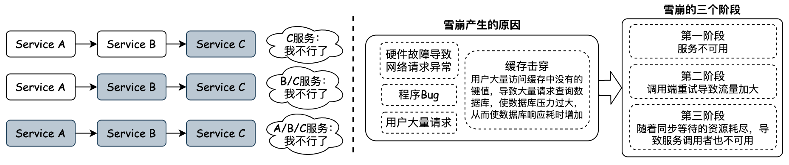
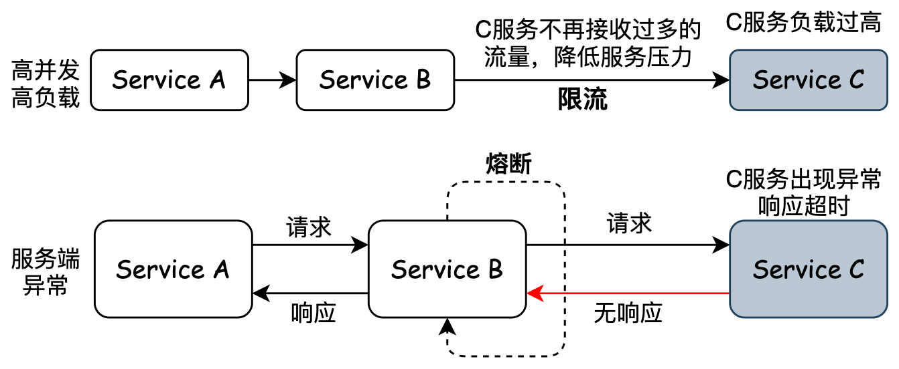
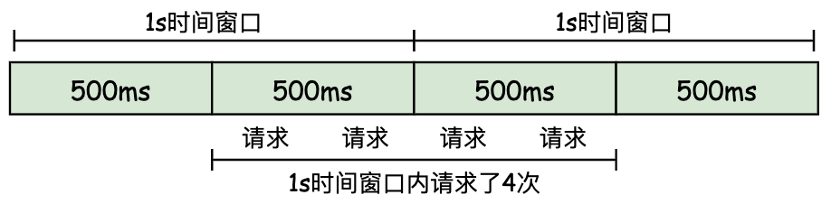
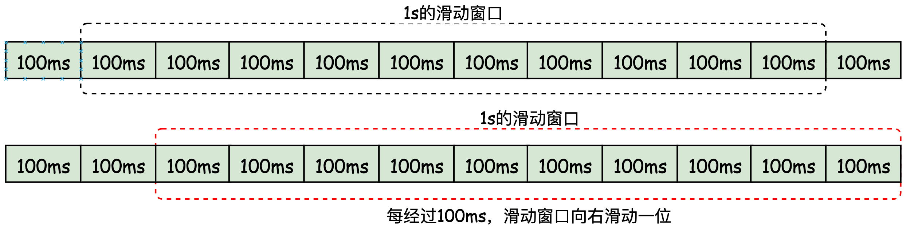
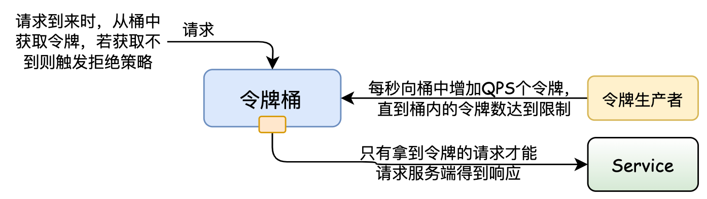
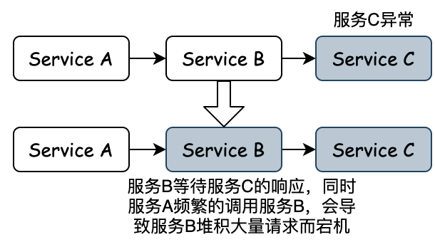
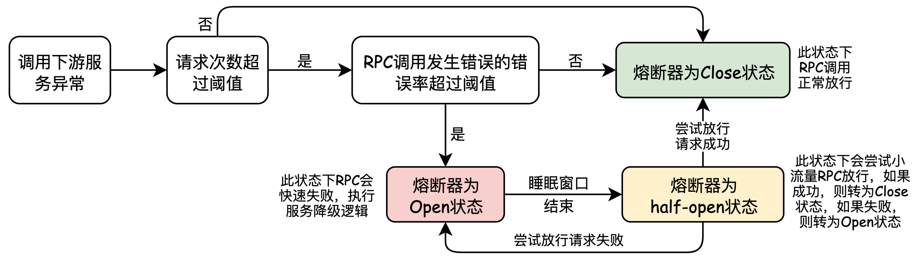

## 一. RPC 远程过程调用

&emsp;&emsp; RPC，即 *Remote Procedure Call* 远程过程调用，是一种通信协议框架，该协议框架允许运行于一台计算机的程序调用另一台计算机的子程序，调用方可以像调用内部接口一样调用远程的方法，而不用封装参数名和参数值等操作。 对于分布式的系统，要实现一个RPC调用，不仅仅是两个服务端调用，还需要解决一下问题：
&emsp;&emsp; **① 通信问题 (传输协议)**：远程调用是两个机器之间的通信。主要是通过在客户端和服务器之间建立TCP连接，远程过程调用的所有交换的数据都在这个连接里传输。通常这个连接可以是按需连接，需要调用的时候就先建立连接，调用结束后就立马断掉。也可以是长连接，客户端和服务器建立起连接之后保持长期持有，不管此时有无数据包的发送，可以配合心跳检测机制定期检测建立的连接是否存活有效，同时多个远程过程调用共享同一个连接。常用的通信传输协议包括 : *grpc*、*dubbo*等。

&emsp;&emsp; **② 服务发现问题**：解决了如何通信，还需要解决如何找到对应的远程调用。这里就需要对不同的服务端的IP，端口，服务列表等信息进行查询和维护。常见的是使用 *zookeeper* 来进行管理。
&emsp;&emsp; ● 对生产者而言: 服务启动的时候，将自己提供的服务注册到注册中心，生产者挂掉时，注册中心注销停止的服务，生产者定时向注册中心发送心跳，如果心跳异常，注册中心也注销生产者服务。
&emsp;&emsp; ● 对消费者而言: 订阅注册中心的服务，获取IP，端口等服务信息，当生产者上线下线时，注册中心会通知调用者。服务下线后，消费者不再消费该服务。

&emsp;&emsp; **③ 网络数据传输 (序列化协议)**：当A机器上的应用发起一个RPC调用时，调用方法和其入参等信息需要通过底层的网络协议如TCP传输到B机器，由于网络协议是基于二进制的，所有我们传输的参数数据都需要先进行序列化 ( *Serialize* )成二进制的形式才能在网络中进行传输。同时，当B机器接收到A机器的应用发来的请求之后，又需要对接收到的参数等信息进行反序列化操作。常用的序列化协议包括: 基于文本编码的 *JSON* 协议、二进制编码的 *protobuf* / *hession*协议等

>   <u>**Q1. RPC 与 HTTP 协议的区别（为什么服务交互都采用 RPC 协议而不采用 HTTP 协议） ？**</u>
>
> &emsp;&emsp; RPC 与 HTTP协议，作为基于TCP的通信传输协议，都可以用来进行远程过程调用。但在远程过程调用时，一般都采用RPC协议而不采用HTTP，两者主要有以下几个方面的考量：
> &emsp;&emsp; ① 数据传输效率：RPC 与HTTP协议最大的不同在于传输协议格式上的区别。通用定义的 HTTP/1.1协议的 TCP 报文中包含了很多对于数据传输无用的信息，如 HTTP 的 *header* 头，而对于 RPC 自定义TCP协议，可以极大地精简传输内容，使得数据传输效率更高。
> &emsp;&emsp; ② 服务特性：相比与HTTP协议，RPC不仅仅是简单的数据传输，更多的是封装了“服务发现”，"负载均衡"，“熔断降级” 等面向服务的特性。单纯使用HTTP 协议调用则缺少了这些特性。
>
>   <u>**Q2. RPC 与 Restful Api的区别 ？**</u>
> &emsp;&emsp;*Rest* 即表述性状态传递( *Representational State Transfer* )，是一种软件架构风格。*Rest* 通过HTTP协议定义的通用方法( *GET、PUT、DELETE、POST* ) ，以 *URI* 对网络资源进行唯一标识，响应端根据请求端的不同需求，通过无状态通信，对其请求的资源进行表述。*Rest* 架构的主要原则：
> &emsp;&emsp;  ① 网络上的所有事物都被抽象为资源；
> &emsp;&emsp;  ② 每个资源都有一个唯一的资源标识符；
> &emsp;&emsp;  ③ 同一个资源具有多种表现形式(xml,json等)；
> &emsp;&emsp;  ④ 对资源的各种操作不会改变资源标识符；
> &emsp;&emsp;  ⑤ 所有的操作都是无状态的；
> &emsp;&emsp; *RPC* 与 *Rest* 在架构方式是完全冲突的，*RPC* 中的主体都是动作，是个动词，表示我要做什么。 而 *REST* 它的 *URL* 主体是资源，是个名词。*RPC* 的根本问题是耦合，RPC客户端以多种方式与服务实现紧密耦合，并且很难在不中断客户端的情况下更改服务实现。*RPC* 更偏向内部调用，*Rest* 更偏向外部调用。

### 1.1 RPC 调用流程

&emsp;&emsp; *RPC* 调用的整个过程如下图所示：
&emsp;&emsp;  ① 首先，由于服务消费方  *Consumer Client*  调用的是远程服务端方法 *Provider Method* 的接口，为了能够使远程方法调用的过程透明化，隐藏调用过程，所以必须要在 *Consumer Client* 为远程服务端方法 *Provider Method* 的接口构造一个"假"的实现，这里需要使用**动态代理**。
&emsp;&emsp;  ② 在动态代理调用远程服务时，首先服务消费方 ( *Consumer Client* ) 会识别具体要调用的远程方法的IP、端口，并对输入参数进行请求封装，然后将调用方法的入参进行序列化，以方便网络传输。
&emsp;&emsp;  ③ 将序列化后的二进制数据通过网络将请求发送到远程的方法中。
&emsp;&emsp;  ④ 远程方法收到后反序列化请求参数后，定位到实际要调用的方法，然后输入参数，执行方法，最后按照调用的路径返回调用的结果。

### 1.2 RPC 的自我保护

&emsp;&emsp; 随着微服务的增加，RPC的调用链路会变得更长，多个微服务之间调用的时候，假设微服务A调用微服务B和微服务C，微服务B和微服务C又调用其它的微服务，这就是所谓的 “扇出”。如果扇出的链路上某个微服务的调用响应时间过长或者不可用，对微服务A的调用就会占用越来越多的系统资源，进而引起系统崩溃，所谓的”**雪崩效应 ( 服务雪崩 ) **“。对于高流量的应用来说，单一的后端依赖可能会导致所有服务器上的所有资源都在几秒钟内饱和 ( 如: CPU 飘高、频繁 *Full GC*、业务处理耗时过长 )。比失败更糟糕的是，这些应用程序还可能导致服务之间的延迟增加，备份队列，线程和其他系统资源紧张，导致整个系统发生更多的级联故障。因此需要对故障和延迟进行隔离和管理，防止单个依赖关系的失败，导致整个应用程序或系统的故障。

&emsp;&emsp; 针对服务雪崩产生的原因和发生的阶段过程，服务雪崩有以下几个解决方法：
&emsp;&emsp;  ● 应用扩容: 增加机器，升级硬件，扩大服务器承受力。
&emsp;&emsp;  ● 流量控制/限流: 超出限定流量，返回类似重试页面让用户稍后再试。
&emsp;&emsp;  ● 服务熔断: 当下游的服务因为某种原因突然变得不可用或响应过慢，上游服务为了保证自己整体服务的可用性，不再继续调用目标服务，直接返回，快速释放资源。如果目标服务情况好转则恢复调用。

#### 1.2.1 *RPC* 的熔断与限流

&emsp;&emsp;  将 *RPC* 框架拆开来分析，*RPC* 调用包括服务端和调用端，调用端向服务端发起调用。**在 *RPC* 调用中服务端的自我保护策略就是限流，在 *RPC* 调用中调用端的自我保护策略就是熔断。**

##### 1. *RPC* 服务端限流

&emsp;&emsp; 对于后端服务来说， 提供的服务都有一个极限的QPS，当服务端的压力超过这个极限值的时候， 服务端的响应性能就会快速的下降, 然后无法提供服务。因此，**在 *RPC* 调用过程中，服务端需要限制流量的功能**，当压力出现瓶颈时，使服务端能牺牲掉部分请求， 保证还能处理一定量的请求， 防止服务端出现压力瓶颈，无法处理所有请求。针对微服务的场景，限流需要考虑应用级别的维度，甚至是 IP 级别的维度。*RPC* 限流有两个概念：
&emsp;&emsp;  ● **限流阈值 ( 限流算法 )**：在一个单位时间内允许的请求量。如 QPS 限制为10，说明 1 秒内最多接受 10 次请求。
&emsp;&emsp;  ● **拒绝策略**：超过阈值的请求的拒绝策略，常见的拒绝策略有直接拒绝、排队等待等。

###### (1). 限流算法

**▨  固定窗口算法：**
&emsp;&emsp; **固定窗口算法**又叫**计数器算法**，主要通过一个支持**原子操作**的计数器来累计单位时间内的请求次数，当单位时间内的计数达到限流阈值时触发拒绝策略。但是这个简单的限流方式是有问题的，以QPS为2，时间窗口为1s为例，当遇到时间窗口的临界突变时，如1s中的后500 ms和第2s的前500ms时，虽然是加起来是1s时间，却可以被请求 4 次。

**▨  滑动窗口算法：**
&emsp;&emsp; 滑动窗口是固定窗口的改进方法，通过增加窗口数量使限流算法更顺滑，本身从一个窗口变为一个先进先出的队列，设定的单位时间就是一个窗口，窗口可以分割多个更小的时间单元，比如原来是1秒一个窗口， 现在会在1秒窗口的基础上分割为10个100毫秒的时间单元， 然后每隔100毫秒滑动一个窗口。 

**▨  漏桶限流：**

&emsp;&emsp; 漏桶算法限流的基本原理为：对应请求从进水口进入到漏桶里，漏桶以一定的速度将请求放行，当请求流入速度过大，桶内的总请求量大于桶容量会直接溢出，请求被拒绝。**漏桶限流中的消费处理总是以恒定的速度进行，可以很好的保护自身系统不被突如其来的流量冲垮，但同时也会导致正常的业务流量突增受到限制，同时也限制了业务的高并发。**漏桶限流可以做到以下两点：
&emsp;&emsp;  ●  削峰： 有大量流量进入时,会发生溢出,从而限流保护服务可用；
&emsp;&emsp;  ●  缓冲： 降低直接请求到服务器的请求量，缓冲压力；

**▨  令牌桶限流：**
&emsp;&emsp; 令牌桶的实现思路类似于生产者和消费之间的关系。系统服务作为生产者，按照指定速率向桶中添加令牌，如 QPS 为 2，则每500ms向桶中添加一个令牌，如果桶中令牌数量达到阈值，则不再添加。请求执行作为消费者，每个请求都需要去桶中拿取一个令牌，取到令牌则继续执行；如果桶中无令牌可取，就触发拒绝策略，可以是超时等待，也可以是直接拒绝本次请求，由此达到限流目的。**令牌桶算法，可以适应流量突发，N 个请求到来只需要从桶中获取 N 个令牌就可以继续处理。但是令牌桶算法有启动过程，令牌桶启动时桶中无令牌，然后按照令牌添加时间间隔添加令牌，若启动时就有阈值数量的请求过来，会因为桶中没有足够的令牌而触发拒绝策略。**

##### 2. *RPC* 调用端熔断

&emsp;&emsp;  对于调用端来说，由于服务的层级依赖，当下游的服务异常无法对请求进行响应时，会导致调用端不断的重试，从而增加了对系统的资源消耗。如要发布一个服务 B，而服务 B 又依赖服务 C，当一个服务 A 来调用服务 B 时，服务 B 的业务逻辑调用服务 C，而这时服务 C 响应超时了，由于服务 B 依赖服务 C，C 超时直接导致 B 的业务逻辑一直等待，而这个时候服务 A 在频繁地调用服务 B，服务 B 就可能会因为堆积大量的请求而导致服务宕机。因此，**在一个服务作为调用端调用另外一个服务时，为了防止被调用的服务出现问题而影响到作为调用端的这个服务，调用端服务也需要进行自我保护。而最有效的自我保护方式就是熔断。**

&emsp;&emsp;   熔断机制的主要通过熔断器来实现，熔断器在关闭 *Close*、打开 *Open* 和半打开 *Half-Open* 这三个状态之间进行切换。在正常情况下，熔断器是关闭的；当调用端调用下游服务出现异常时，熔断器会收集异常指标信息进行计算，当达到熔断条件时熔断器打开，这时调用端再发起请求是会直接被熔断器拦截，并快速地执行失败逻辑；当熔断器打开一段时间后，会转为半打开状态，这时熔断器允许调用端发送一个请求给服务端，如果这次请求能够正常地得到服务端的响应，则将状态置为关闭状态，否则设置为打开。

## 实现RPC需要解决的问题

#### 1.3 *Listener*

&emsp;&emsp; *Listener* 用于监听Java对象的方法调用或属性改变，当被监听对象发生上述事件后，监听器某个方法立即被执行。监听器 *Listener* 按照监听的事件分为3类：
 &emsp; &em

### 1.1 RPC与Feign

### 5.2 Mybatis - 数据持久层管理

## 二. MQ 异步通信