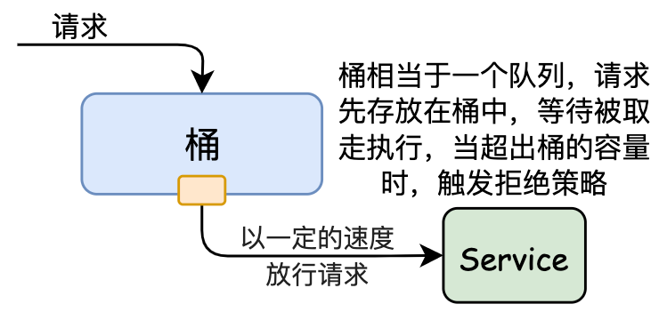
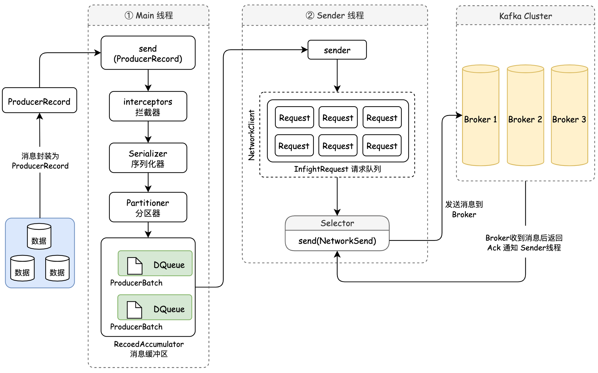
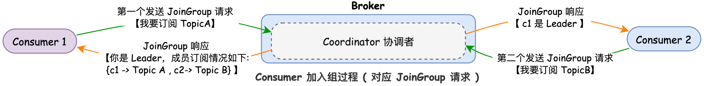

## 一. RPC 远程过程调用

&emsp;&emsp; RPC，即 *Remote Procedure Call* 远程过程调用，是一种通信协议框架，该协议框架允许运行于一台计算机的程序调用另一台计算机的子程序，调用方可以像调用内部接口一样调用远程的方法，而不用封装参数名和参数值等操作。 对于分布式的系统，要实现一个RPC调用，不仅仅是两个服务端调用，还需要解决一下问题：
&emsp;&emsp; **① 通信问题 (传输协议)**：远程调用是两个机器之间的通信。主要是通过在客户端和服务器之间建立TCP连接，远程过程调用的所有交换的数据都在这个连接里传输。通常这个连接可以是按需连接，需要调用的时候就先建立连接，调用结束后就立马断掉。也可以是长连接，客户端和服务器建立起连接之后保持长期持有，不管此时有无数据包的发送，可以配合心跳检测机制定期检测建立的连接是否存活有效，同时多个远程过程调用共享同一个连接。常用的通信传输协议包括 : *grpc*、*dubbo*等。

&emsp;&emsp; **② 服务发现问题**：解决了如何通信，还需要解决如何找到对应的远程调用。这里就需要对不同的服务端的IP，端口，服务列表等信息进行查询和维护。常见的是使用 *zookeeper* 来进行管理。
&emsp;&emsp; ● 对生产者而言: 服务启动的时候，将自己提供的服务注册到注册中心，生产者挂掉时，注册中心注销停止的服务，生产者定时向注册中心发送心跳，如果心跳异常，注册中心也注销生产者服务。
&emsp;&emsp; ● 对消费者而言: 订阅注册中心的服务，获取IP，端口等服务信息，当生产者上线下线时，注册中心会通知调用者。服务下线后，消费者不再消费该服务。

&emsp;&emsp; **③ 网络数据传输 (序列化协议)**：当A机器上的应用发起一个RPC调用时，调用方法和其入参等信息需要通过底层的网络协议如TCP传输到B机器，由于网络协议是基于二进制的，所有我们传输的参数数据都需要先进行序列化 ( *Serialize* )成二进制的形式才能在网络中进行传输。同时，当B机器接收到A机器的应用发来的请求之后，又需要对接收到的参数等信息进行反序列化操作。常用的序列化协议包括: 基于文本编码的 *JSON* 协议、二进制编码的 *protobuf* / *hession*协议等

> <font color=SlateBlue>  <u>**Q1. RPC 与 HTTP 协议的区别（为什么服务交互都采用 RPC 协议而不采用 HTTP 协议） ？**</u></font>
>
> &emsp;&emsp; *RPC* 与 *HTTP* 协议，作为基于 *TCP* 的通信传输协议，都可以用来进行远程过程调用。但在远程过程调用时，一般都采用 *RPC* 协议而不采用 *HTTP*，两者主要有以下几个方面的考量：
> &emsp;&emsp; ① 数据传输效率：*RPC* 与 *HTTP* 协议最大的不同在于传输协议格式上的区别。通用定义的 HTTP/1.1协议的 TCP 报文中包含了很多对于数据传输无用的信息，如 HTTP 的 *header* 头，而对于 RPC 自定义TCP协议，可以极大地精简传输内容，使得数据传输效率更高。
> &emsp;&emsp; ② 服务特性：相比与 *HTTP* 协议，*RPC* 不仅仅是简单的数据传输，更多的是封装了“服务发现”，"负载均衡"，“熔断降级” 等面向服务的特性。单纯使用HTTP 协议调用则缺少了这些特性。
>
> <font color=SlateBlue>  <u>**Q2. RPC 与 Restful Api的区别 ？**</u></font>
> &emsp;&emsp;*Rest* 即表述性状态传递( *Representational State Transfer* )，是一种软件架构风格。*Rest* 通过HTTP协议定义的通用方法( *GET、PUT、DELETE、POST* ) ，以 *URI* 对网络资源进行唯一标识，响应端根据请求端的不同需求，通过无状态通信，对其请求的资源进行表述。*Rest* 架构的主要原则：
> &emsp;&emsp;  ① 网络上的所有事物都被抽象为资源；
> &emsp;&emsp;  ② 每个资源都有一个唯一的资源标识符；
> &emsp;&emsp;  ③ 同一个资源具有多种表现形式(xml,json等)；
> &emsp;&emsp;  ④ 对资源的各种操作不会改变资源标识符；
> &emsp;&emsp;  ⑤ 所有的操作都是无状态的；
> &emsp;&emsp; *RPC* 与 *Rest* 在架构方式是完全冲突的，*RPC* 中的主体都是动作，是个动词，表示我要做什么。 而 *REST* 它的 *URL* 主体是资源，是个名词。*RPC* 的根本问题是耦合，RPC客户端以多种方式与服务实现紧密耦合，并且很难在不中断客户端的情况下更改服务实现。*RPC* 更偏向内部调用，*Rest* 更偏向外部调用。

### 1.1 RPC 架构

&emsp;&emsp;  在一个典型 RPC 的使用场景中，包含了服务发现、负载、容错、网络传输、序列化等组件，其中 *RPC* 协议指明了程序如何进行网络传输和序列化。


&emsp;&emsp; *RPC* 调用的整个过程如下图所示：
&emsp;&emsp;  ① 首先，由于服务消费方  *Consumer Client*  调用的是远程服务端方法 *Provider Method* 的接口，为了能够使远程方法调用的过程透明化，隐藏调用过程，所以必须要在 *Consumer Client* 为远程服务端方法 *Provider Method* 的接口构造一个"假"的实现，这里需要使用**动态代理**。
&emsp;&emsp;  ② 在动态代理调用远程服务时，首先服务消费方 ( *Consumer Client* ) 会识别具体要调用的远程方法的IP、端口，并对输入参数进行请求封装，然后将调用方法的入参进行序列化，以方便网络传输。
&emsp;&emsp;  ③ 将序列化后的二进制数据通过网络将请求发送到远程的方法中。
&emsp;&emsp;  ④ 远程方法收到后反序列化请求参数后，定位到实际要调用的方法，然后输入参数，执行方法，最后按照调用的路径返回调用的结果。


### 1.2 RPC 的自我保护

&emsp;&emsp; 随着微服务的增加，RPC的调用链路会变得更长，多个微服务之间调用的时候，假设微服务A调用微服务B和微服务C，微服务B和微服务C又调用其它的微服务，这就是所谓的 “扇出”。如果扇出的链路上某个微服务的调用响应时间过长或者不可用，对微服务A的调用就会占用越来越多的系统资源，进而引起系统崩溃，所谓的”**雪崩效应 ( 服务雪崩 ) **“。对于高流量的应用来说，单一的后端依赖可能会导致所有服务器上的所有资源都在几秒钟内饱和 ( 如: CPU 飘高、频繁 *Full GC*、业务处理耗时过长 )。比失败更糟糕的是，这些应用程序还可能导致服务之间的延迟增加，备份队列，线程和其他系统资源紧张，导致整个系统发生更多的级联故障。因此需要对故障和延迟进行隔离和管理，防止单个依赖关系的失败，导致整个应用程序或系统的故障。


&emsp;&emsp; 针对服务雪崩产生的原因和发生的阶段过程，服务雪崩有以下几个解决方法：
&emsp;&emsp;  ● 应用扩容: 增加机器，升级硬件，扩大服务器承受力。
&emsp;&emsp;  ● 流量控制/限流: 超出限定流量，返回类似重试页面让用户稍后再试。
&emsp;&emsp;  ● 服务熔断: 当下游的服务因为某种原因突然变得不可用或响应过慢，上游服务为了保证自己整体服务的可用性，不再继续调用目标服务，直接返回，快速释放资源。如果目标服务情况好转则恢复调用。

#### 1.2.1 *RPC* 的熔断与限流

&emsp;&emsp;  将 *RPC* 框架拆开来分析，*RPC* 调用包括服务端和调用端，调用端向服务端发起调用。**在 *RPC* 调用中服务端的自我保护策略就是限流，在 *RPC* 调用中调用端的自我保护策略就是熔断。**


##### 1. *RPC* 服务端限流

&emsp;&emsp; 对于后端服务来说， 提供的服务都有一个极限的QPS，当服务端的压力超过这个极限值的时候， 服务端的响应性能就会快速的下降, 然后无法提供服务。因此，**在 *RPC* 调用过程中，服务端需要限制流量的功能**，当压力出现瓶颈时，使服务端能牺牲掉部分请求， 保证还能处理一定量的请求， 防止服务端出现压力瓶颈，无法处理所有请求。针对微服务的场景，限流需要考虑应用级别的维度，甚至是 IP 级别的维度。*RPC* 限流有两个概念：
&emsp;&emsp;  ● **限流阈值 ( 限流算法 )**：在一个单位时间内允许的请求量。如 QPS 限制为10，说明 1 秒内最多接受 10 次请求。
&emsp;&emsp;  ● **拒绝策略**：超过阈值的请求的拒绝策略，常见的拒绝策略有直接拒绝、排队等待等。

###### (1). 限流算法

**▨  固定窗口算法：**
&emsp;&emsp; **固定窗口算法**又叫**计数器算法**，主要通过一个支持**原子操作**的计数器来累计单位时间内的请求次数，当单位时间内的计数达到限流阈值时触发拒绝策略。但是这个简单的限流方式是有问题的，以QPS为2，时间窗口为1s为例，当遇到时间窗口的临界突变时，如1s中的后500 ms和第2s的前500ms时，虽然是加起来是1s时间，却可以被请求 4 次。


**▨  滑动窗口算法：**
&emsp;&emsp; 滑动窗口是固定窗口的改进方法，通过增加窗口数量使限流算法更顺滑，本身从一个窗口变为一个先进先出的队列，设定的单位时间就是一个窗口，窗口可以分割多个更小的时间单元，比如原来是1秒一个窗口， 现在会在1秒窗口的基础上分割为10个100毫秒的时间单元， 然后每隔100毫秒滑动一个窗口。 


**▨  漏桶限流：**

&emsp;&emsp; 漏桶算法限流的基本原理为：对应请求从进水口进入到漏桶里，漏桶以一定的速度将请求放行，当请求流入速度过大，桶内的总请求量大于桶容量会直接溢出，请求被拒绝。**漏桶限流中的消费处理总是以恒定的速度进行，可以很好的保护自身系统不被突如其来的流量冲垮，但同时也会导致正常的业务流量突增受到限制，同时也限制了业务的高并发。**漏桶限流可以做到以下两点：
&emsp;&emsp;  ●  削峰： 有大量流量进入时,会发生溢出,从而限流保护服务可用；
&emsp;&emsp;  ●  缓冲： 降低直接请求到服务器的请求量，缓冲压力；



**▨  令牌桶限流：**
&emsp;&emsp; 令牌桶的实现思路类似于生产者和消费之间的关系。系统服务作为生产者，按照指定速率向桶中添加令牌，如 QPS 为 2，则每500ms向桶中添加一个令牌，如果桶中令牌数量达到阈值，则不再添加。请求执行作为消费者，每个请求都需要去桶中拿取一个令牌，取到令牌则继续执行；如果桶中无令牌可取，就触发拒绝策略，可以是超时等待，也可以是直接拒绝本次请求，由此达到限流目的。**令牌桶算法，可以适应流量突发，N 个请求到来只需要从桶中获取 N 个令牌就可以继续处理。但是令牌桶算法有启动过程，令牌桶启动时桶中无令牌，然后按照令牌添加时间间隔添加令牌，若启动时就有阈值数量的请求过来，会因为桶中没有足够的令牌而触发拒绝策略。**


##### 2. *RPC* 调用端熔断

&emsp;&emsp;  对于调用端来说，由于服务的层级依赖，当下游的服务异常无法对请求进行响应时，会导致调用端不断的重试，从而增加了对系统的资源消耗。如要发布一个服务 B，而服务 B 又依赖服务 C，当一个服务 A 来调用服务 B 时，服务 B 的业务逻辑调用服务 C，而这时服务 C 响应超时了，由于服务 B 依赖服务 C，C 超时直接导致 B 的业务逻辑一直等待，而这个时候服务 A 在频繁地调用服务 B，服务 B 就可能会因为堆积大量的请求而导致服务宕机。因此，**在一个服务作为调用端调用另外一个服务时，为了防止被调用的服务出现问题而影响到作为调用端的这个服务，调用端服务也需要进行自我保护。而最有效的自我保护方式就是熔断。**


&emsp;&emsp;   熔断机制的主要通过熔断器来实现，熔断器在关闭 *Close*、打开 *Open* 和半打开 *Half-Open* 这三个状态之间进行切换。在正常情况下，熔断器是关闭的；当调用端调用下游服务出现异常时，熔断器会收集异常指标信息进行计算，当达到熔断条件时熔断器打开，这时调用端再发起请求是会直接被熔断器拦截，并快速地执行失败逻辑；当熔断器打开一段时间后，会转为半打开状态，这时熔断器允许调用端发送一个请求给服务端，如果这次请求能够正常地得到服务端的响应，则将状态置为关闭状态，否则设置为打开。


### 1.1 RPC与Feign


## 二. MQ 异步通信

&emsp;&emsp;   MQ全称是 *Message Queue* ( 消息队列 )，是基于 *FIFO* 队列数据结构的的一种消息容器，可以保存在传输过程中消息，是存储消息的一种中间件。常应用在分布式系统中进行通信的第三方中间件，一般用来解决**应用解耦，异步消息，流量削峰**等问题。如下图所示，发送方称为生产者，接收方称为消费者。


&emsp;&emsp;MQ 的应用虽然能解决应用解耦，异步提速，削峰填谷等问题，但是引入MQ也会出现一些问题，MQ的劣势以及可能引发的问题如下：
&emsp;   &emsp; ① **系统可用性降低**：系统引用的外部依赖越多，稳定性就越差。一旦MQ宕机，整个系统就会不可用，对业务造成影响**，如何保证MQ的高可用？**
&emsp;   &emsp; ② **系统复杂度提高**：通过MQ的异步调用就有了相应的问题，**如何保证消息没有被重复消费，怎么处理消息丢失情况？怎么保证消息传递的顺序性？**
&emsp;   &emsp; ③ **数据一致性问题**：如果A系统处通过MQ给B、C系统发送消息数据，B处理成功，C处理失败，这种情况怎么处理**，即如何保证消息数据处理的一致性？**

&emsp;&emsp;目前常见的MQ及数据对比如下图所示：


### 2.1 Kafka

&emsp;&emsp;   *Kafka* 是一个支持分区的、多副本的、多订阅者的、基于 *Zookeeper* 协调的分布式消息中间件。*Kafka* 用于离线和在线消息的消费，将消息数据按顺序保存在磁盘上，并在集群内以副本的形式存储以防止数据丢失。*Kafka* 本质上也是一个消息队列 ( *Message Queue* )。Kafka 有两种数据传输模型：**点对点模型 和 发布/订阅模型**
&emsp;  &emsp;● **点对点模型**：一对一，消费者主动拉取数据。消息生产者将消息发送到 MQ 中，然后消费者从 MQ 中取出并消费消息，消息被消费者消费以后，MQ 中不再存储已经被消费过的消息，所以消息消费者不可能重复消费已经被消费过的消息。MQ 支持存在多个消费者，即一个消费者组可以有多个消费者，但是消息只能被一个消费者消费。


&emsp;  &emsp;● **发布/订阅模型**：发布/订阅模型与点对点模型多了一个 *Topic* 的概念，可以存在多个发布者向相同主题发送消息，而订阅者也可以存在多个，接收相同主题的消息。消费者消费数据之后不会清除消息数据。


#### 2.1.1 *Kafka* 架构

一个典型的 *Kafka* 系统架构会包括 *Producer*、*Broker*、*Cosumer* 等角色，以及一个 *ZooKeeper* 集群，其架构如下图所示：


&emsp;&emsp; ● ***Producer***：生产者，负责将客户端生成的消息发送到 *Kafka* 中，支持消息的异步发送和批量发送。
&emsp;&emsp; ● ***Broker***：服务代理节点，*Kafka* 集群中，一台服务器就是一个 *Broker*，可以水平无限扩展，同一个Topic消息可以分布在多个 *Broker* 中。
&emsp;&emsp; ● <font color=red>***Topic***</font>：*Topic* 是一个存储消息的逻辑概念，可以理解为是一个消息的集合，*Kafka* 的数据就保存在 *Topic* 中。在每个 *Broker* 上都可以创建多个 *Topic*。在 *Kafka* 中消息是以 *Topic* 为单位进行归类的，*Topic* 在逻辑上可以被认为是一个队列，*Producer* 生产的每一条消息都必须指定一个 *Topic*，表明要将消息发送到哪个 *Topic* 上，然后 *Consumer* 会根据订阅的 *Topic* 到对应的 *Broker* 上去拉取消息。在存储方面，不同的 *Topic* 的消息是分开存储的。
&emsp;&emsp; ● <font color=red>***Partition***</font>：*Topic* 的分区，是物理存储概念，每个 *Topic* 可以有多个分区，分区的作用是做负载，提高了 *Kafka* 的并发，也解决了 *Topic* 中数据的负载均衡。同一个 *Topic* 在不同的分区的数据是不重复的，每个 *Partition* 在物理上对应一个文件夹，该文件夹里面存储了这个**分区的所有消息和索引文件**。生产者将消息发送到 *Topic* 时，消息会根据分区策略追加到分区文件的末尾，属于顺序写磁盘，因此效率非常高。每个消息在被添加到分区的时候，会被分配一个 *Offset* ( 偏移量 )，它是消息在当前分区中的唯一编号。<font color=red>*Kafka* 通过 *Offset* 可以保证消息在分区中的顺序性，但是跨分区是无序的，即 ***Kafka* 只保证在同一个分区内的消息是有序的。**</font>


&emsp;&emsp; ● ***Offset***：分区偏移量。*Kafka* 为每条在分区的消息分配一个偏移量 *offset*，它是消息在当前分区中的唯一编号，用来标识消费者当前消费的消息在分区 *Partition* 的位置。*Kafka* 的存储文件都是按照 *offset.kafka* 来命名。如果一个偏移量是5的消费者，表示已经消费了从0-4偏移量的消息，下一个要消费的消息的偏移量是5。
&emsp;&emsp; ● ***Leader 和 Follower***：一个 *Partition* 分区会有多个副本，副本之间是一主 *Leader* 多从 *Follower* 的关系，*Leader* 负责对外提供服务，而 *Follower* 只是被动地同步 *Leader*，不能与外界进行交互。<font color=green>同一分区 *Parition* 的不同副本 *Follower* 中保存的信息是相同的，但副本 *Follower* 处于不同 Broker 中，当 *Leader* 出现故障时，会从 *Follower* 副本中重新选举新的 *Leader* 副本对外提供服务。</font>
&emsp;&emsp; ● ***Consumer***：消费者，通过 *Kafka* 来接收消息，用于业务逻辑处理。
&emsp;&emsp; ● ***Consumer Group***：消费者组是 *Kafka* 提供的可扩展且具有容错性的消费者机制。<font color=red>多个消费者共同组成一个组来消费**同一个 *Topic*** 中的消息，同一个 *Patition* 分区的数据只能被消费者组中的某一个消费者消费。同一个消费者组的消费者可以消费同一个 *Topic* 的不同分区的数据</font>。

> <font color=SlateBlue>  <u>**Q1. Kafka 为什么要分区 ？**</u></font>
> &emsp;&emsp; ● **合理的使用存储资源**：把海量的数据按照**分区**切割成一小块的数据存储在多台 *Broker* 上，能够保证每台服务器的存储资源能够被充分利用，而且小块数据在寻址时间上更有优势，可以避免因为消息内容检索时间过长，导致 *Kafka* 性能降低。
> &emsp;&emsp; ● **负载均衡**：数据生产或消费期间，生产者向分区的单位发送数据**，**消费者从分区的单位进行消费，各个分区之间的生产和消费数据互不影响。通过合理控制分区任务，提高任务的并行度，可以达到负载均衡的效果。
> &emsp;&emsp; ●**实现系统的高伸缩性**：不同的 *Partition* 能够放置到不同节点机器上，每个 *Partition* 可以通过调整以适应它所在的机器，方便在集群中扩展。

##### 1. *Producer* - 消息生产

&emsp;&emsp; *Producer* 负责消息的生产，它的主要功能是将客户端的请求打包封装发送到 *Kafka* 集群的某个 *Topic* 的某个 *Partition* 分区上。其组件主要包括**元数据 *Metadata*、网络通信组件、相关配置、发送线程、消息拦截器**等组成。要想发送消息给 *Broker*，首先需要知道消息要发送到哪里去，所以就需要从 *Broker* 集群中获取发送消息需要的元数据。元数据中包括了 *Topic* 中的 *Partitions* 相关信息。


&emsp;&emsp;基于 *Producer* 组件，*Producer* 生产消息并推送到 *Broker* 的流程如下所示：
&emsp; &emsp; ①  ***Producer* 将数据封装为 *ProducerRecord***：消息是 *Kafka* 中最基本的数据单元。在我们通过 *send (...)* 方法发送消息时，会将请求的数据创建一个 *ProducerRecord* 对象。*ProducerRecord* 对象中有两个必选参数：目标主题 ( *Topic* ) 和消息内容 ( *Value* )，两个可选参数：分区 ( *Partition* ) 和键 ( *Key* )。


```java
byte[] serializedKey = serializedKey = keySerializer.serialize(record.topic(), record.headers(), record.key());
byte[] serializedValue = valueSerializer.serialize(record.topic(), record.headers(), record.value());
```

&emsp; &emsp; ②  **消息的拦截、序列化、分区**：封装后消息通过拦截器，序列化之后，需要通过**分区器**来确定发送出去的消息需要存储在哪个分区中。<font color=red>分区使得每个节点能够实现独立的数据写入和读取，通过**分区部署在多个 *Broker* 来实现负载均衡**的效果</font>。在没有指定分区策略的情况下，*Producer* 会通过默认的分区策略指定当前消息应该存储在哪个分区下。分区器的 *Partition* 分配策略如下：
&emsp;  &emsp; <font color=green>● 若指定 *Partition ID*，则消息被发送至指定的 *Partition*。</font>
&emsp;  &emsp; <font color=green>● 若未指定 *Partition ID*，指定了 *Key*，消息会按照 *Hash ( Key )* 作为 *Partition ID* 发送到 *Partition*。因此相同 *Key* 的消息会发到同一个 *Partition ID* 中。</font>
&emsp;  &emsp; <font color=green>● 若既未指定 *Partition ID* 也没指定 *Key*，消息会按照 *Round-Robin* ( 顺序轮询 ) 算法发送到每个 *Partition*，*Round-Robin* 算法在第一次调用时随机生成一个整数 ( 后面每次调用在这个整数上自增 )，将这个值与 *Topic* 可用的 *Partition* 总数取余得到 *Partition ID* 。</font>
&emsp;  &emsp; <font color=green>● 若同时指定了 *Partition ID* 和 *Key* , 消息只会发送到指定的 *Partition*，此时 *Key* 不起作用。</font>

&emsp; &emsp; ③  **消息的缓存**：确定好消息的分区后，消息会被放入待发送的缓存中 *RecordAccumulator*。缓存的默认大小为 *32MB*，通过 `buffer.memory` 参数可以指定 *Producer* 待发送消息缓冲区的内存大小。当 *Producer* 生产消息的速度超过了 *Sender* 线程发送消息的速度，并且缓冲区的消息数量超过 `buffer.memory` 指定的大小时，*Producer* 会抛出异常。除此之外，由于缓存的存在，会使消息的发送存在一定延时，通过 `linger.size` 参数可以设置被放进缓冲区 *RecordAccumulator* 中的消息是否立马被发送。

&emsp; &emsp; ④  **消息的发送**：Kafka 的消息发送是将消息发送到 *Broker* 中，消息的发送分为3种方式：**异步发送 ( *Asynchronous-send* )，同步发送 ( *Synchronous-send* )，发送即忘 ( *Fire-and-forget* )**
&emsp;  &emsp; ● 发送即忘：*Productor* 在发送消息到 Kafka 集群时，消息先存储在缓冲区中，达到设定条件后批量发送，消息发送后并不等待服务器的响应，而是继续发送下一个消息。这样可以提高发送消息的吞吐量，但也是消息最不可靠的一种方式。
&emsp;  &emsp; ● 同步发送：*Sender* 线程调用 *send()* 方法会返回 *Future* 对象，通过调用 *Future* 对象的 `get()` 方法，等待直到结果返回，根据返回的结果判断是否发送成功。<font color=green>如果业务要求消息必须是按顺序发送的，那么可以使用同步的方式，并且消息只能在一个 *Partation* 上 ( 消息需指定某一 *Partition* 或 消息的 *Key* 相同 )。</font>
&emsp;  &emsp; ● 异步发送：*Sender* 线程在调用 *send()* 方法的时候指定一个 *Callback* 函数，当接收到 *Broker* 的 *Ack* 返回通知时，该 *Callback* 函数会被触发执行。<font color=green>如果业务需要知道消息发送是否成功，并且对消息的顺序不关心，那么可以用异步+回调的方式来发送消息。</font>




##### 2. *Broker* - 消息数据的存放

&emsp;&emsp;  当 *Producer* 生产的消息推送到 *Broker* 后，消息会存储到对应的 *Partition* 分区当中。为了保证消息数据的高可用和高持久，*Kafka* 的每个分区是多副本冗余的，如果一个副本数据丢失了，那么还可以从其他副本中获取分区数据。

###### (1). 副本 *Replicas*

&emsp;&emsp; *Kafka* 中的副本分为两种类型：**领导者 ( *Leader* )副本和追随者 ( *Follower* ) 副本**。*Leader* 副本负责处理客户端的读写请求，而 *Follower* 副本则负责从 *Leader* 副本同步数据。<font color=green>**每个 *Partition* 分区的副本数量称为副本因子 ( *Replication Factor* )，副本因子越高，系统的可靠性和容错能力越强**</font>。但是，副本因子过高会导致更多的存储和网络开销。为了在可靠性和性能之间取得平衡，建议将副本因子设置为3，即一个 *Partition* 分区有一个 *Leader* 副本和两个 *Follower* 副本。
&emsp;  &emsp; ● 当 *Producer* 发送消息到某个 *Partition* 时，*Leader* 副本首先接收并处理这些消息，随后 *Follower* 副本从 *Leader* 副本同步数据。
&emsp;  &emsp; ● 当 *Consumer* 请求数据时，*Leader* 副本负责提供数据。


&emsp;&emsp;  多副本之间有一个 *Leader* 副本，多个 *Follower* 副本， *Follower* 副本则负责从 *Leader* 副本同步数据。*Kafka* 使用<font color=red>**副本同步队列 *ISR* ( *In-Sync Replicas* )机制来确保副本之间数据的一致性**</font>。<font color=green>*ISR* 是一个动态维护的副本集合，包含了与 *Leader* 副本同步的 *Follower* 副本，即当前所有可用的副本</font>。ISR 队列主要有以下两个作用：
&emsp;  &emsp; ● 当 *Follower* 副本成功同步数据时，它会被添加到 *ISR* 中。如果 *Follower* 副本无法及时同步数据 ( 因为宕机或网络问题 )，则会从 *ISR* 中删除，同时将踢出 ISR 的 *Follower* 副本存入 *OSR* 队列。
&emsp;  &emsp; ● 当 *Leader* 副本发生故障时，*Kafka* 需要从 *ISR* 中选举出一个新的 *Leader* 副本。确保新的 *Leader* 副本具有最新的数据，从而避免了数据丢失。


&emsp;&emsp; *Kafka* 在启动的时候，会启动一个**副本管理器** *ReplicaManager*，这个副本管理器会启动两个用来处理 ISR 队列变更的定时任务：
&emsp;  &emsp; <font color=green>① ISR 过期定时任务 ***isr-expiration***</font>：每隔 `replica.lag.time.max.ms` ( 默认值为 2ms ) 就执行一次，如果一个 *Follower* 副本在这个时间内没有发送 *Fetch* 请求，*Leader* 副本将从 ISR 中移除这个 *Follower*副本。
&emsp;  &emsp;  <font color=green>② ISR 变更的传播定时任务 ***isr-change-propagation***</font>：每隔 2500ms 执行一次。

###### (2). 副本同步机制 - *Follower* 同步

&emsp;&emsp;  副本同步过程由以下几个步骤组成：
&emsp; &emsp;  ① ***Producer* 将消息发送到 *Leader* 副本**：*Producer* 将消息发送到特定分区的 *Leader* 副本。*Leader* 副本负责处理数据写入请求，并将消息存储在内部日志 *Log* 中。
&emsp; &emsp;  ② ***Leader* 副本将消息发送给 *Follower* 副本**：*Leader* 副本将接收的消息发给分区内所有 *Follower* 副本。
&emsp; &emsp;  ③ ***Follower* 副本确认收到数据**：*Follower* 副本将接收到的消息写入它们的本地日志并确认已收到数据。在写入完成和确认之后，*Follower* 副本与 *Leader* 副本保持的日志和消息一致。
&emsp; &emsp;  ④ ***Leader* 副本收到确认**：*Leader* 副本会等待 ISR ( *In-Sync Replicas* ) 中的所有 *Follower* 副本确认。一旦收到 ISR 中所有副本的确认，*Leader* 副本会同步更新日志度量信息。只有在收到 ISR 中所有副本的确认后，*Kafka* 才将写入操作视为已成功完成。


&emsp;&emsp;  Kafka 中 *Topic* 的每个 *Partition* 有一个预写式日志文件，每个 *Partition* 都由一系列有序的、不可变的消息组成，这些消息被连续的追加到 *Partition* 中，*Partition* 中的每个消息都有一个连续的序列号叫做 *Offset*，用来确定当前消息在 *Partition* 中的唯一位置。在 *Leader* 副本向 *Follower* 副本进行数据同步时，会依赖 *Partition* 的日志文件中的3个重要属性：
&emsp;  &emsp; ● ***LEO* ( *Log And Offset* )**：日志末端的位移，用来标识当前日志文件中下一条待写入的消息的 *Offset*。
&emsp;  &emsp; ● ***HW*：高水位值 ( *High Watermark* )**，定义了消息可见性，标识了消息偏移量 *Offset*，*Consumer* 只能拉取到这个水位 *Offset* 之前的消息。每个副本都有 *HW*，*Leader* 副本和 *Follower* 副本各自负责更新自己的 *HW* 的状态。<font color=green>**对于 *Leader* 副本新写入的消息，*Consumer* 不能立即消费，*Leader* 副本会等待该消息被所有 ISR 中的副本都同步后，才更新HW，此时消息才能被 *Consumer* 消费**</font>。**HW = 一个 *Partition* 对应的 *ISR* 中最小的 *LEO***。
&emsp;  &emsp; ● ***Leader Epoch***：*Leader* 的任期，在每一个 *Leader* 副本时代分配一个标识符，由 *Leader* 将其添加到每个消息中，当 *Follower* 副本需要截断日志时，替代 *HW* 高位水作为其截断操作的参照数据。


&emsp;&emsp; 副本不同的异常情况：
&emsp;  &emsp; ● 慢副本：在一定周期时间内，*Follower* 副本不能追赶上 *Leader* 副本。最常见的原因之一是IO瓶颈导致*Follower* 副本追加复制消息速度慢于从 *Leader* 副本拉取的速度。
&emsp;  &emsp; ● 卡住副本：在一定周期时间内，*Follower* 副本停止从 *Leader* 副本拉取请求。*Follower* 副本卡住了通常是由于GC暂停或 *Follower* 副本失效或死亡。
&emsp;  &emsp; ● 新启动副本：当用户给 *Topic* 增加副本因子时，新的 *Follower* 不再同步副本列表中，*Follower* 副本会从头加载，直到他们完全追赶上 *Leader* 日志。

###### (3). *Broker* 管理机制 - *KafkaController*

&emsp;&emsp; 在早期 Kafka 版本，对于分区和副本的状态管理依赖于 *Zookeeper* 的 *Watch* 队列，每一个 *Broker* 都会在 *Zookeeper* 注册 *Watcher*。当集群规模很大的时候，如果宕机的 Broker 上的 *Partition* 很多，会造成多个*Watcher* 触发，造成集群内大规模调整，出现惊群效应以及 *Zookeeper* 集群过载。因此<font color=green>在新版本的 *Kafka* 通过 *KafkaController* 进行 *Broker* 管理</font>。每个 Broker 启动时，都会创建一个 KafkaController 对象，在Kafka集群中的多个 *Broker*，只有一个会被选举为 *Controller Leader*，**负责管理整个集群中分区和副本的状态**，其余的都是 *Follower*。当 *Leader* 故障后，所有的 *Follower* 会收到通知，再次竞争在选举新的 *Leader*。


##### 3. *Consumer* - 消息的消费

 &emsp;&emsp; 在 *Kafka* 中, 我们把消费消息的一方称为 *Consumer* 消费者, 它是 *Kafka* 的核心组件之一。它的主要功能是将 *Producer* 生产的消息进行消费处理，完成消费任务。为了提高消费速率，提升 Kafka 的并发效率，*Kafka*将 <font color=red>多个消费者 *Consumer* 共同组成一个消费者组 *Consumer Group* 来消费**同一个 *Topic*** 中的消息，同一个 *Patition* 分区的数据只能被 *Consumer Group* 中的某一个 *Consumer* 消费。同一个 *Consumer Group* 的 *Consumer* 可以消费同一个 *Topic* 的不同分区的数据</font>。

###### (1). *Consumer* 消费方式

&emsp;&emsp; 消息队列的消费方式主要有两种：***Push*** 和 ***Pull***。*Kafka Consumer* 采用的是主动拉取 *Broker* 数据进行消费，即 *Pull* 模式。
&emsp;  &emsp; ●  *Push* - 推模式 ( *Broker* 向 *Consumer* 推送消息 )：*Push* 模式最大缺点是 *Broker* 不清楚 *Consumer* 的消费速度，且推送速率是 *Broker* 进行控制的，这样很容易造成 *Consumer* 的消息堆积。如果 Consumer 消息比较耗时，可能会造成系统崩溃。
&emsp;  &emsp; ●  *Pull* - 拉模式 ( *Consumer* 从 *Broker* 拉取消息 )：*Pull* 模式下 *Consumer* 根据自己的情况和状态来拉取数据, 也可以进行延迟处理。如果 *Broker* 中没有消息，*Consumer* 会被阻塞，等到 *timeout* 超时时间过后再去 *Broker* 拉取数据，直到 *Broker* 中存在数据，否则 *Consumer* 会在循环中不停阻塞，等待超时时间。

###### (2). *Consumer* 的 *Partition* 分配策略

&emsp;&emsp; 一个 *Consumer Group* 中有多个 *Consumer*，一个 *Topic* 也有多个 *Partition*，所以必然会涉及到 *Partition* 的分配问题: 确定哪个 *Partition* 由哪个 *Consumer* 来消费的问题。*Kafka* 提供了3 种分区分配策略：*RangeAssignor*、*RoundRobinAssignor* 和 *StickyAssignor*。

**▨  *RangeAssignor* - 以 Topic 维度进行分配：**
&emsp;&emsp; *RangeAssignor* 是 Kafka 默认的分区分配算法，它是按照 *Topic* 的维度进行分配的。对于每个 *Topic*，首先对 *Partition* 按照分区ID进行排序，然后对订阅这个 *Topic* 的 *Consumer Group* 的 *Consumer* 再进行排序。最后，我们将 *Topic* 分区数除以 *Consumer* 消费者数量，从而确定要分配给每个 *Consumer* 的分区数。如果划分不均匀，则前几个消费者将多一个额外的分区。*RangeAssignor* 方式有个明显的问题：**随着 *Consumer* 数量的增加，*Partition* 分配不均衡的问题会越来越严重。**


▨  ***RoundRobinAssignor***：
&emsp;&emsp;*RoundRobinAssignor* 的分区分配策略是将 *Consumer Group* 内订阅的所有 *Topic* 的 *Partition* 及所有 *Consumer* 进行排序后按照顺序尽量均衡的一个一个进行分配。如果 *Consumer Group* 内，每个 *Consumer* 订阅都订阅了相同的 *Topic*，那么分配结果是均衡的。如果订阅 *Topic* 是不同的，那么分配结果是不均衡的。


###### (3). *Consumer Group* 重平衡机制

&emsp;&emsp; 对于 *Consumer Group* 来说，<font color=red>*Consumer* 数量随时都会发生变化 ( *Consumer* 主动加入、主动离组、故障下线等 )，*Consumer* 列表的变化必定会引起 ***Partition* 的重新分配**，这个分配过程叫做 ***Consumer Rebalance***。</font>这个分配过程需要借助 *Broker* 的 *Coordinator* 协调者组件，通过 *Coordinator* 完成整个消费者组的分区重分配。*Rebalance* 本质是 *Consumer Group* 和 *Coordinator* 之间的一组协议的交互过程。在交互过程中会存在以下5种请求协议：
&emsp; &emsp; ● *Heartbeat* 请求：*Consumer* 需要定期给 *Coordinator* 发送心跳来证明自己还活着。当协调者决定开启 *Rebalance* 后，它会将 *REBALANCE_IN_PROGRESS* 封装进心跳请求的响应中发送给 *Consumer*。
&emsp; &emsp; ● *LeaveGroup* 请求：*Consumer* 主动告诉 *Coordinator* 要离开 *Consumer Group*。
&emsp; &emsp; ● *SyncGroup* 请求：*Group Leader Consumer* 把分配方案告诉组内所有成员。
&emsp; &emsp; ● *JoinGroup* 请求： 成员请求加入消费者组。**当触发 *Rebalance* 后，组中的所有成员需要重新加入组**。
&emsp; &emsp; ● *DescribeGroup* 请求：显示消费者组的所有信息，包括成员信息，分配方案等。该请求是给管理员使用。


**▨  *Rebalance* 过程中 *Consumer Group* 状态的变化**
&emsp;&emsp; *Rebalance* 一旦发生，必定会涉及到 *Consumer Group* 的状态流转。*Consumer Group* 对应有5种状态：
&emsp; &emsp; ● ***Empty* 状态**：表示当前组内无 *Consumer* 成员，这种状态只能响应 *JoinGroup* 请求。
&emsp; &emsp; ● ***Dead* 状态**：表示组内已经没有任何 *Consumer* 成员的状态，组内的元数据已经被 *Broker Coordinator* 移除，这种状态响应各种请求都是一个 *Response*：`UNKNOWN_MEMBER_ID`。
&emsp; &emsp; ● ***PreparingRebalance* 状态**：表示准备开始新的 *Rebalance*，等待消费者组中所有成员重新加入组内。
&emsp; &emsp; ● ***CompletingRebalance* 状态**：表示组内成员都已经加入成功，正在等待 *Partition* 分配方案。
&emsp; &emsp; ● ***Stable* 状态**：表示 *Rebalance* 已经完成，组内 *Consumer* 可以开始消费了。


**▨  *Rebalance* 流程**

&emsp;&emsp;从 *Consumer Group* 在 *Rebalance* 过程中的状态变化中可以看出 *Rebalance* 主要分为两个步骤：① ***Consumer* 加入组 ( 对应 *JoinGroup* 请求 )**；② **等待 *Consumer Leader* 分配方案 ( *SyncGroup* 请求 )**
&emsp; &emsp;  ***Step* 1**: *Consumer* 加入 *Consumer Group* ( 对应 *JoinGroup* 请求 )。组内所有消费者成员向 *Coordinator* 发送 *JoinGroup* 请求，同时上报自己订阅的 *Topic*，请求加入消费者组。*Coordinator* 收到 *JoinGroup* 请求后会选择第一个发送 *JoinGroup* 请求的 *Consumer* 作为 *Consumer Leader*，*Coordinator* 会把 *Consumer Group* 的订阅 *Topic* 信息封装进 *JoinGroup* 请求的 *Response* 中，然后发给 *Consumer Leader* ，然后由 *Leader* 统一制定消费分区的分配方案。



&emsp; &emsp;  ***Step* 2**: *Consumer Leader* 开始分配消费方案，即哪个 *Consumer* 负责消费哪些 *Topic* 的哪些 *Partition*。分配完成后，*Consumer Leader* 会将这个分配方案封装进 *SyncGroup* 请求中并发给 *Coordinator*。*Coordinator* 接收到分配方案之后会把方案封装进 *SyncGroup* 的 *Response* 中发给组内各成员。


###### (4). *Consumer offsets* 消费位移

&emsp;&emsp; *Consumer* 消费位移 ( *Consumer Offsets* ) 与 *Partition* 位移不同，*Partition* 位移是指 *Topic Partition* 在 *Broker* 端的存储偏移量。而消费者位移则是指某个 *Consumer Group* 在不同 *Topic Partition* 上面的消费偏移量，它记录了 *Consumer* 要消费的下一条消息的位移。*Consumer Offsets* 存储的消息格式如下图所示：


&emsp;&emsp; 当 *Consumer* 对应的消息位移发生变化时，*Consumer* 需要向 *Kafka* 上报自己的位移数据信息，这个上报过程叫做提交位移 ( *Committing Offsets* )。<font color=green>提交位移是为了保证 *Consumer* 的消费进度正常，当 *Consumer* 发生故障重启后， 可以直接从之前提交的 *Offset* 位置开始进行消费而不用重头再消费一遍。</font>由于 *Consumer* 可以同时消费多个分区的数据，所以<font color=green>位移提交是按照分区的粒度进行上报的，即 *Consumer* 需要为分配给它的每个分区提交各自的位移数据。</font>
&emsp;&emsp; *Kafka Consumer* 提供了两种位移提交方式：**自动提交**和**手动提交**。
&emsp; &emsp; ● **自动提交**：自动提交是指 *Kafka Consumer* 在后台自动提交位移，通过设置参数 `enable.auto.commit = true` ( 默认为 *true* )，开启之后还需要 `auto.commit.interval.ms = X` 参数来设置 *Kafka Consumer* 自动提交位移间隔，这个值默认是5秒。自动提交虽然可以解放双手，但是<font color=red>如果在自动提交间隔之间发生 *Rebalance* 的时候，此时 *Offset* 还未提交，待 *Rebalance* 完成后， 所有 *Consumer* 都会将发生 *Rebalance* 前的消息进行重新消费一次。</font>
&emsp; &emsp; ● **手动提交**：开启手动提交位移需要设置参数 `enable.auto.commit = false`，同时调用相应的 *Consumer API* 手动进行提交位移。对于 *Consumer API*，又分为同步提交和异步提交：
&emsp;   &emsp;  ① 同步提交API - `KafkaConsumer#commitSync()`：它是一个同步操作，会一直阻塞等待直到位移被成功提交才返回，如果提交的过程中出现异常，该方法会将异常抛出。
&emsp;   &emsp;  ② 异步提交API - `KafkaConsumer#commitAync()`：它会立即返回，并不会阻塞，因此不会影响消费者的消费速率 ( TPS )，通常用作记录日志或异常处理等不需要重试的操作。
