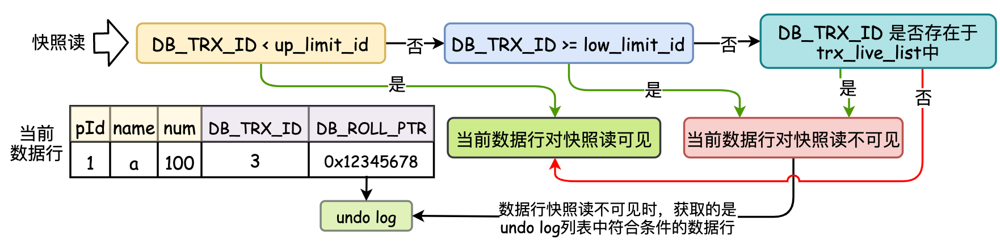

## 一. MySQL 数据库体系架构

&emsp;&emsp;数据库是是依照某种数据模型组织起来数据的集合。在数据库之上存在着数据库实例程序，该程序是用户与操作系统之间的数据管理软件。因此，`MySQL`其实是一种基于客户端-服务器的数据管理软件(`DBMS`)，用于管理存放数据的文件。


&emsp;&emsp; MySQL数据库体系架构共分为3层，<font color=red>应用层，MySQL服务层，存储引擎层</font>，其结构如下图所示：


&emsp;&emsp;① **应用层**：包括连接池组件，主要有3个功能：
&emsp;&emsp;   <font color=green>● 连接处理</font>：当一个客户端向MySQL Server发送连接请求后，MySQL Server从**线程池**中分配一个线程来和客户端连接。连接池保证了MySQL的多并发。
&emsp;&emsp;   <font color=green>● 用户鉴权</font>：MySQL server对连接的用户进行鉴权处理，包括用户名，客户端主机地址，用户密码。
&emsp;&emsp;   <font color=green>● 安全管理</font>：MySQL server会根据用户的权限来判断用户可执行哪些操作。

&emsp;&emsp;② **服务层**：包括系统管理，SQL接口，SQL解析器，查询优化器，缓存。
 &emsp;&emsp;  <font color=green>● 系统管理</font> ：数据库备份和恢复，数据库安全管理，数据库复制管理，数据库集群管理，数据库分区，分库，分表管理，数据库元数据管理。
 &emsp;&emsp;  <font color=green>● SQL接口</font>：接收用户的SQL命令并进行处理。
 &emsp;&emsp;  <font color=green>● SQL解析器</font>：解析查询语句，生成语法树。语法检查后，解析器会<font color=orange>查询缓存</font>，如果缓存中有对应的语句，直接返回结果<font color=orange>不进行接下来的优化执行操作</font>。
 &emsp;&emsp;  <font color=green>●
SQL查询优化器</font>：对查询语句进行优化，包括选择合适的索引，数据的读取方式。
 &emsp;&emsp;  <font color=green>● 缓存</font>：包括全局和引擎特定的缓存，提高查询的效率。如果查询缓存中有命中的查询结果，则查询语句就从缓存中取数据，无须再通过解析和执行。

&emsp;&emsp;③ **存储引擎层**：包括插件式的表存储引擎与底层物理文件。
 &emsp;&emsp;  <font color=green>● 存储引擎</font>：在MySQL中，其存储引擎包括`InnoDB`(面向在线事务处理的引擎)，`MylSAM`(面向在线计算分析的引擎)， `NDB`(集群存储引擎)，`CSV`，`Archive`等。
 &emsp;&emsp;  <font color=green>● 物理文件：</font>物理文件通常包括<font color=red>日志文件，数据文件，*Replication* 文件，参数配置文件</font>等。

## 二. MySQL 服务层

### 2.1 SQL基础 (SQL接口)

#### 2.1.1 SQL执行过程

&emsp;&emsp;`MySQL`通过结构化查询语言(`SQL`)来对数据进行增查改删。每个`SQL`语句都是由一个或多个关键字组成的。SQL有两种使用方式：<font color=green>交互式和嵌入式(
在java/C++中使用，通过JDBC，Python等连接数据库)</font>。SQL语言由6个部分组成：


&emsp;&emsp; MySQL的语句执行共分为11步，其先后顺序如下图所示：


#### 2.1.2 SQL数据类型

&emsp;&emsp; MySQL的数据类型分为<font color=green>数值类型，字符类型(串数据类型)，日期时间类型</font>。如下图所示：


#### 2.1.3 SQL的解析与查询优化

&emsp;&emsp; MySQL的解析与优化属于编译器的范畴，与C/C++的编译器没有本质区别。<font color=red>MySQL的解析分为**词法分析，语法分析，中间代码生成，代码优化，目标执行代码的生成**。</font>


### 2.2 SQL缓存机制

&emsp;&emsp; MySQL缓存是指SQL语言文本及缓存结果，用`Key-Value`形式保存在MySQL Server中。如果运行相同SQL语言时(对比时是逐字节进行对比)，则直接从缓存中获取结果，不需要再进行SQL语言解析，优化。如果这个表被修改(任何数据改变或结构改变)了，则该缓存将不再有效，查询缓存值得相关条目将被清空。因此<font color=orange>**对于频繁更新的表，缓存并不合适，只有对于一些不变的数据且有大量相同sql查询的表，缓存会节省很大的性能**。</font>


#### 2.2.1 缓存规则

&emsp;&emsp; ① 当开启缓存时，MySQL Server会自动将查询语句和结果集返回到内存中。
&emsp;&emsp; ② 缓存的结果是通过 *Session* 共享的，一个 *Client* 查询的缓存结果，另一个 *Client* 也可以使用。 
&emsp;&emsp; ③ *where* 条件中包含任何一个不确定的函数将永远不会被 *Cache*，如 `current_date()`，`now()`等。
&emsp;&emsp; ④ *MySQL Query Cache* 在查询过程中，<font color=green>**只有两个SQL完全一致才会命中 *Cache*，只要字符大小写或注释有点不同，查询缓存就认为是不同的查询。**</font>
&emsp;&emsp; ⑤ **在表结构或数据发生改变时，查询缓存中的数据不再有效**。

#### 2.2.2 缓存机制内存管理

&emsp;&emsp; MySQL的缓存内存使用**内存池技术**，内存池的基本单位是 *block* (最小长度为 *query_cache_min_res_unit* )，一个查询结果集的 *cache* 通过**链表**将 *block*
连接起来。当MySQL Server启动的时候，会初始化缓存需要的内存 (一个完整的空闲块)。当查询结果需要缓存的时候，先从空闲块中申请一个数据块为参数 *query_cache_min_res_unit* 配置的空间，即使缓存数据很小，申请数据块也是这个大小。


#### 2.2.3 缓存配置参数及状态


## 三. MySQL 存储引擎层

&emsp;&emsp;MySQL 存储引擎负责数据的存储和提取，MySQL的存储引擎层是插件式的，支持 *InnoDB*，*MyISAM*，*Memory* 等多个存储引擎。不同的存储引擎，其数据存储结构，数据索引方式都不相同。存储引擎的差别为：


## 四. MySQL 系统日志文件

&emsp;&emsp; 日志文件是MySQL数据库的重要组成部分，日志文件记录着MySQL的运行过程。了解MySQL的日志文件，能够更好的了解MySQL的运行过程。MySQL日志系统分为<font color=green>**系统日志和存储引擎日志**</font>，其框架如下图所示：


### 4.1 错误日志 error log

&emsp;&emsp;错误日志 *error log* 是 MySQL 中最常用的一种日志，主要记录 MySQL 服务器启动和停止过程中的信息、服务器在运行过程中发生的故障和异常情况等。需要利用错误日志 *error log* 来定位问题。一般情况下，*error log* 文件放在 */var/log/mysqld.log* 中，在MySQL中通过命令`show variables like 'log_error\G;`来查看 *error log* 存放的位置，并通过Linux命令`find / -name ./Ubuntu.err`查找文件的路径。


### 4.2 二进制日志 bin log

&emsp;&emsp;二进制日志是一个二进制文件，<font color=green>主要用于**记录修改数据或有可能引起数据变更的MySQL语句** (不包括 *select* , *show* 等不修改数据的语句)
，二进制文件记录了对MySQL执行更改的所有操作，并记录了语句发生时间，执行时长，操作数据等信息。</font> 在每次重启 MySQL Server时，会生成一个新的二进制日志文件<font color=red>。**对于事务表，二进制日志只在事务提交的时候一次性写入**。</font>

#### 4.2.1 二进制日志的管理

&emsp;&emsp; ① 查看系统二进制日志以及master状态(当前要写入的二进制日志)：


&emsp;&emsp; ② 切换二进制文件：


&emsp;&emsp; ③ 删除二进制文件：


&emsp;&emsp; ④ 查看二进制文件：


&emsp;&emsp;<font color=red> ⑤ 利用 *binlog* 文件恢复数据</font>
&emsp;&emsp;  *binlog* 记录着修改数据或有可能引起数据变更的MySQL语句，因此利用 *binlog* 能够对误删除或系统宕机而存储失败的数据进行恢复。


### 4.3 慢查询日志 slow query log

&emsp;&emsp; 当MySQL语句执行时间大于 *long_query_time* 时，认为该语句执行时间过长，可以通过慢查询日志的方式来定位语句。


## 五. MySQL InnoDB存储引擎

&emsp;&emsp; MySQL InnoDB 引擎是默认的引擎， InnoDB 的体系架构由一系列后台线程,内存池和文件组成。InnoDB 引擎的体系结构如图所示：


### 5.1 数据存储逻辑结构(磁盘结构)

&emsp;&emsp; MySQL数据库的数据存储是放在磁盘当中，InnoDB的磁盘主要包括**数据表空间( *tablespace* )，数据字典( *data dictionary* )，<font color=red>
双写缓冲区( *double write buffer* )</font>，InnoDB日志( *redo log/undo log* )**。


#### 5.1.1 表空间

&emsp;&emsp;`InnoDB`引擎的数据表存储结构如下图所示：


&emsp;&emsp;表空间用于存储表结构和数据。<font color=green>表空间又分为系统表空间、独立表空间、通用表空间、临时表空间、Undo表空间</font>。


&emsp;&emsp; MySQL中的数据都存放在表空间中，一个表空间可以分为<font color=red>**段，区，页，行**</font>四个部分。


##### 1. 段空间

&emsp; &emsp; 段是表空间文件中的主要组织结构，是一个逻辑概念，用来管理物理文件，是构成索引，表，回滚段的基本元素，常见的段包括<font color=green>**数据段**，**索引段**，回滚段</font>
。在InnoDB的存储引擎表是索引组织的，因此，<font color=red>数据即索引，索引即数据。数据段是B+树上的叶子节点，索引段是B+树上的非叶子节点</font>。

##### <font color=Sienna>**2. 区(簇)空间**</font>

&emsp; **&emsp; 区是由64个连续的页组成的，每个页大小为16KB，每个区大小为1MB (16KB × 64)**。页是段的基本元素，一个段由多个区组成，一个段管理的空间大小是无限的，可以一直扩展，但每次扩展的最小单位是区。

##### <font color=Sienna>**3. 页空间与行记录**</font>

&emsp; &emsp;<font color=red>页是 *InnoDB* 磁盘管理的最小单元，***InnoDB* 默认每个页的大小为 16KB**。</font>在逻辑上(页面号都是从小到大连续的) 与物理上都是连续的。在向表中插入数据时，如果一个页面已经被写完，系统会从当前簇中分配一个新的空闲页面处理使用，如果当前区中的64个页面都被分配完，系统会从当前页面所在段中分配一个新的区，然后再从这个区中分配一个新的页面来使用；页在 *InnoDB* 中常见的页类型有：


&emsp; &emsp; <font color=red>行记录用于储存储数据库中每一行对应的数据，行与行之间通过一个**单向链表**的形式来连接</font>。行记录通过包括两个格式：*Compact* 格式和 *Redundant*
格式。页空间与行记录的基本结构如下图所示：


> <font color=SlateBlue>  <u>**Q1. 16KB(一页)大小的索引文件可以存储多少条(行)数据 ？**</u></font> 
> 		我们假设主键ID为 *bigint* 类型，长度为8字节，而索引指针大小在 *InnoDB* 源码中设置为6字节，这样一条索引共占用14字节，我们一个页中能存放多少这样的单元，其实就代表有多少指针，即 (16KB * 1024=16384 byte ) 16384 / 14 = 1170个索引**。那么可以算出一棵高度为2的B+树，能存放1170 (索引个数) \* 16 (每页行数，每行数据1KB) = 18720条这样的数据记录。**一个高度为3的B+树可以存放**：**1170 (索引个数) \* 1170 (索引个数) \* 16 (每页行数，每行数据1KB) = 21902400条这样的记录。

#### 5.1.2 数据字典 - 数据表的基础

&emsp;&emsp; *InnoDB* 数据字典是由内部系统表组成的，<font color=green>**用来存储元数据信息，如表的描述，表对应每一列的类型，表的索引，每个索引有哪几个字段等**</font>。在 *InnoDB*
中，基本系统表实际上是看不到的。有4个最基本的系统表来存储表的元数据：<font color=green>表( *SYS_TABLES* )，列( *SYS_COLUMNS* )，索引( *SYS_INDEXES* )
，索引列( *SYS_FIELDS* )等信息</font>，通过这4个基本系统表，就可以获取其他系统表以及用户定义的表中所有的元数据。


&emsp;&emsp; 内部基本系统表是数据字典的根本，记录了数据表的表结构。因此在 *InnoDB* 中，使用固定的页面(`0号表空间-0号文件-7号页面`)来记录基本系统表的聚簇索引和二级索引对应的B+数位置。


&emsp;&emsp; 数据字典的加载过程如下图所示：
 &emsp;&emsp; ● 新建数据库时，初始化库，索引创建数据字典管理B+树信息，并将系统表根页面存储在固定位置(0号表空间-0号文件-7号页面)
&emsp;&emsp;  ● 当用户访问一个表时，系统首先会从表对象缓冲池中查找该表*share*对象，如果找到直接从其实例化表对象空间中拿出一个空间的实例化对象使用。如果没有可用的实例化对象，则需要重新实例化该表(实例化时从*share*对象获取表信息)。如果没有*share*对象，则需要从系统表中构造一个*share*对象。


#### 5.1.3 双写数据缓冲区 - double write

&emsp;&emsp;  双写数据缓冲区分为两个部分：
&emsp;&emsp;  ① 第一部分是内存中的*double write buffer*，大小为2M；
&emsp;&emsp;  ② 第二部分是物理磁盘上共享表空间中的连续128页，即两个区，大小同样为2MB，可以称为 *double write* 页。

> <font color=SlateBlue>  <u>**Q1. 为什么要引入双写数据缓冲区 - double write ？**</u></font>
> &emsp; &emsp; <font color=red>主要是为了解决 *InnoDB* 与操作系统在页面大小不一致情况下，内存写入到磁盘时出现问题而导致**数据损坏问题**。</font>
> &emsp; &emsp; 由于<font color=red>在 *InnoDB* 中，页的大小为 16KB </font>，其数据校验也是针对 16KB 进行计算的，<font color=green>数据从内存写入到磁盘中是以页为单位</font>。但是<font color=red>操作系统中页的大小为 4KB </font>，因此，每写一次 *InnoDB page* 到磁盘，操作系统需要写4个块。当在特殊情况时(操作系统崩溃，断电等)，会造成 *InnoDB page* 写入磁盘时出现只有部分页写入( *partial page write* )的问题，这会导致 *InnoDB page* 损坏，数据产生混乱。 <font color=red>而 *redo log* 只能恢复一个旧的，数据校验完整的数据页，而不能恢复一个损坏的数据页，这时无法通过 *redo log* 来恢复数据。</font>最终会导致这个部分写入的数据就丢失了，造成数据不一致。

##### 1. double write 工作流程

&emsp;&emsp;   共享表空间是 *ibdata* 文件中的划分出2M连续的空间，专门给 *double write* 刷脏页使用的。修改后的脏页先放到 *double write buffer* 区，等 *buffer* 空间满了，或者其他条件触发之后，再将 *double write buffer* 存的脏页写到共享表空间 (连续存储，顺序写，性能很高)，之后再写入数据文件中 (离散存储，离散写，性能较低)。倘若，因为故障发生导致写入数据文件页数据不完整，则可以通过加载共享表空间中完整的页进行覆盖，使数据页变得完整，再通过 *redo log* 进行恢复，不会造成数据的缺失。


><font color=SlateBlue> <u>**Q2. 为什么不把double write中数据写入数据文件中 ？**</u></font>
>&emsp; ① `double write`里面的数据是连续的，如果直接写到`data page`里面，而`data page`的页又是离散的，写入会很慢。
>&emsp; ② `double write`里面的数据没有办法被及时的覆盖掉，导致`double write`的压力很大；短时间内可能会出现`double write`溢出的情况。
>
><font color=SlateBlue>  <u>**Q3. double write在恢复的时候是如何工作的 ？**</u></font> 
>&emsp; ● 如果是写 *double write buffer* 本身失败，那么这些数据不会被写到磁盘，InnoDB此时会从磁盘载入原始的数据，然后通过InnoDB的事务日志来计算出正确的数据，重新写入到 *double write buffer*。
>&emsp; ● 如果double write buffer写成功的话，但是写磁盘失败，可以通过加载共享表空间中完整的页进行覆盖，使数据页变得完整，再通过 *redo log* 进行恢复，不会造成数据的缺失。
>
><font color=SlateBlue>  <u>**Q4. 为什么 *redo log*不需要 *double write* 的支持 ？**</u></font> 
>&emsp;  因为 *redo log* 写入的单位就是512字节，也就是磁盘IO的最小单位，所以无所谓数据损坏。

##### <font color=Sienna>**2. double write 系统参数**</font>


#### 5.1.4 InnoDB 日志

&emsp;&emsp; `InnoDB`日志见5.5.2节。

------

### 5.2 InnoDB 内存(缓冲池)

&emsp;&emsp;由于Innodb引擎是在硬盘存储的，因此，提出了**缓冲池**方法，<font color=green>**通过内存来弥补磁盘速度较慢对性能的影响**</font>。缓冲池的大小直接影响着数据库的整体性能。
&emsp;&emsp;对数据库中页的操作过程如下： 
&emsp;&emsp;&emsp;① 读取页操作：将从磁盘读到的页放在缓冲池，这一过程称为**页的FIX**。
&emsp;&emsp;&emsp;② 修改页操作：首先修改缓冲池中的页，然后刷新 *Flush* 到磁盘上。<font color=green>缓冲池是通过 **LRU** ( *Lastest Recent Used* , 最近最少使用)
算法进行管理，并在 LRU 中加入了 *midpoint* 位置。</font>
&emsp;&emsp;缓冲池中缓存的数据页类型有：**数据页**( *data page* )，**索引页**( *index page* )，**插入缓冲**( *insert buffer* )，**自适应哈希索引**( *adaptive hash index* )，**锁信息**( *lock info* )，**数据字典信息**( *data dictionary* )


#### 5.2.1 缓冲池管理 - LRU

缓冲池是通过LRU法进行管理。传统的LRU策略是将最近查询或使用的页在 LRU List 的前端，而最少使用的页在 LRU List的尾端。当不能存放新读取到的页时，将首先释放 LRU List中尾端的页。<font color=red>在InnoDB引擎中，对 LRU算法进行了改进，在LRU List中加入了 *midpoint* 位置，新读取到的页并不直接放入LRU List的首部，而是放到LRU
List的 *midpoint* 位置( LRU List的5/8处 )，然后根据参数 *innodb_old_blocks_time* 将 *midpoint* 位置的页面放入LRU List前端。</font>
&emsp;&emsp; 在缓冲池的调度过程中，有三个 *List* ，分别为 *LRU List* (调度列表)，*Free List* (空闲列表)，*Flush List* (刷新列表)。
 &emsp;&emsp; ① **Free List**：MySQL启动时，*buffer pool*会被初始化，此时 *buffer pool* 中缓存页都是空的内存，没有任何数据保存在里边。初始化后的缓存页就放在 *Free list* 中。<font color=green>*Free list*是一个双向链表</font>，其中的每一个结点都是缓存页对应的描述信息，通过描述信息可以找到指定的缓存页。<font color=green>当InnoDB读取到数据时，从 *Free List* 获取空闲缓存页，将数据放入缓冲页中，并将新页面放入LRU
List的 *midpoint* 位置，同时删除 *Free List* 中的页。</font>
&emsp;&emsp; ② **LRU List**：LRU List用于页的管理和调度。InnoDB引擎中，对LRU算法进行了改进，在 *LRU List* 中加入了 *midpoint* 位置，新读取到的页并不直接放入 *LRU List* 的首部，而是放到 *LRU LIst* 的 *midpoint* 位置( *LRU List* 的 5/8处)。</font>通过参数 *innodb_old_blocks_time* 可以控制 *mid* 页面加入到 *LRU List* 前端的时间。


&emsp;&emsp; ③ **Flush List**：在 *LRU List* 中的页被修改后，会导致缓冲池中的页和磁盘上的页的数据产生了不一致，则该页称为**脏页**，*Flush List* 用于存储脏页，并通过*Checkpoint* 技术将页刷新回磁盘。


#### 5.2.2 缓冲池Change buffer ( Insert buffer )

> <font color=SlateBlue>  <u>**Q1. 为什么要引入Change buffer ？**</u></font> 
> &emsp;&emsp; 在实际应用中，表的索引除了主键索引以外，还有很多的非主键索引。对于非主键索引来说，B+树的叶子节点插入不再有序，这时就需要离散的访问非主键索引页，使插入性能降低。
> &emsp;&emsp;  为了解决这一问题，InnoDB采用 *change buffer* 技术。**对于非主键索引的 *Insert* 和 *Update* 操作，不是每次都直接插入到索引页中，而是先插入到内存中。如果该索引页在缓冲池中，则直接插入，否则先将其放入到插入缓冲区中，再以一定的频率和索引页合并，此时同一个索引页的多个插入合并到一个IO操作中，提高效率。**
>
> 
>
> <font color=SlateBlue> <u>**Q2. Change buffer会带来哪些问题 ？**</u></font>
> &emsp; &emsp; ① 如果应用程序执行大量的插入和更新操作，且涉及非唯一的聚集索引，一旦出现宕机，这时就有大量内存中的插入缓冲区数据没有合并至索引页中，导致实例恢复时间会很长。
> &emsp; &emsp; ② 在写密集时，*Change buffer* 会占用过多的缓冲池内存。

#### 5.2.3 缓冲池 checkpoint 机制

&emsp; &emsp; 由于InnoDB采用 *Write Ahead Log* 策略来防止宕机使数据丢失，因此在事务提交之前，先写 *redo log*，再修改内存数据页。当修改内存数据页时就在内存中产生了脏页。如果此时数据库宕机，数据库不需要重做所有的日志，只需要执行上次刷入点之后的日志，这个点就叫做 *Checkpoint*。


&emsp; &emsp; 在 *Checkpoint* 机制中，存在两个 *Checkpoint*：*Sharp Checkpoint*，*Fuzzy Checkpoint*


------

### 5.3 InnoDB 后台线程

&emsp;&emsp;*InnoDB* 引擎采用多线程模型，后台线程包括4种线程：
 &emsp;&emsp; ① *Master thread*: 后台核心线程，主要负责将缓冲池中的数据异步刷新到磁盘，保证数据的一致性，<font color=green>包括脏页的刷新、合并插入缓冲( 合并 *insert buffe*r )、undo页的回收( *undo page clean* )</font>等。*Master thread* 其内部是由多个循环组成的，*Master thread* 根据数据库的运行状态在各种循环之间进行切换。


&emsp;&emsp; ② *IO thread*：*IO thread* 主要负责处理IO请求，<font color=green>*IO thread* 包含一个插入缓冲线程( *insert buffer thread* )
，一个日志线程( *log thread* )，4个读线程( *read thread* )，4个写线程( *write thread* )。</font>


&emsp;&emsp; ③ *purge thread* ：*purge thread* 用来回收事务提交后其被分配的 *undo* 页，可以通过 *innodb_purge_threads* = 1 配置多个 *purge thread* 线程。
&emsp;&emsp; ④ *page cleaner thread* ：将脏数据写入到磁盘，脏数据写盘后相应的 *redo* 就可以覆盖，然后达到 *redo* 循环使用的目的。

### 5.4 InnoDB 索引与键

&emsp;&emsp; <font color=green>MySQL数据库中，数据都是存储在磁盘文件当中，当需要对数据进行操作时将数据从磁盘读入内存中，因此，<font color=orange>**MySQL的数据读取的基本单位是页(
磁盘块**)。</font></font>为了提高数据库的查询速度，需要对数据库建立索引，如果不使用索引，MySQL必须从第一条记录开始读完整个数据库。<font color=red>索引是一种特殊的文件(表空间中文件)
，该文件内部数据结构采用的是**B+树**。</font>MySQL中不同存储引擎与索引的对应关系如下表所示：


&emsp;&emsp;<font color=red>**`InnoDB`的数据存储是基于索引组织的，因此对于InnoDB存储引擎，数据即索引，索引组织数据**。</font>在`InnoDB`
存储引擎中常见的索引包括：<font color=red>B+树索引，全文索引，自适应哈希索引。</font>InnoDB默认索引为B+树索引，**对于一张数据表，每一个索引都对应一颗B+树**。

#### ▍ **5.4.1 B+树索引(B+ Tree)**

&emsp;&emsp;B+树索引是以<font color=green>B+树</font>
数据结构为基础，B+树的结构主要用于磁盘，其节点对应于磁盘的页，因此节点在查询，插入过程中意味着磁盘的IO操作。<font color=red>**
B+树索引不能找到一个给定键值的具体行，其能检索到的只是被查找数据行所在的页，然后数据库通过将页读入到内存，再在内存中进行查找。**</font>


##### <font color=Sienna>**1. B+树索引的"进化"过程**</font>

&emsp;&emsp; **在B+树进化过程中，树每增加一个深度，查找到数据就会增加一次IO，因此，需要降低树的深度，同时尽可能增加每个结点(页面，16KB)能够存放的数据**。


&emsp;&emsp; 如：要在表中查询`id=7`的数据:
&emsp;&emsp; ① 首先通过B+树索引进行查询，id=7在索引页2中 &emsp;&emsp; ② 在索引页2中通过二分查找找到id=7的数据行

#### ▍ **5.4.2 B+树索引的分类**

&emsp;&emsp;InnoDB存储引擎索引是一棵B+树，<font color=green>**在InnoDB中每增加一个索引，就是增加一棵B+树**</font>
。在B+树中，完整的数据记录存储在B+树的叶子结点中，其余层次的结点都是内节点，内节点里存储的是目录项记录(Key值)。 &emsp;&emsp;InnoDB的索引分为两大类：
&emsp;&emsp; <font color=green>**1. 主键索引：** 主键索引根据<font color=red>**主键**</font>生成(按照每张表的主键构造一个B+树)
，该索引的叶子结点处记录着<font color=green>**行记录(即所有数据)**</font>。对于任意一个数据表，一定存在一个主键索引。


&emsp;&emsp;主键索引的特点如下:
&emsp; &emsp;① <font color=red>主键索引表按照主键ID排序，检索的是**每一行数据的真实内容**。</font>
&emsp; &emsp;② 实际的数据页只能按照一棵B+树进行排序，因此<font color=red>每张表有且只有一个主键索引。</font>
&emsp; &emsp;③ 主键索引对于主键的<font color=red>排序查找</font><font color=green>(因为其叶子结点通过双向链表连接)</font>和<font color=red>
范围查找</font><font color=green>(通过叶子结点的上层中间结点可以得到叶子结点的范围)</font>速度非常快。 &emsp; &emsp;④ 主键索引的存储不是物理上连续，而是逻辑上连续的。

&emsp;&emsp; <font color=green>**2. 二级索引(辅助索引，普通索引)**</font>：除了主键索引之外的索引称为辅助索引，<font color=green>辅助索引的节点是以某一字段的数据</font>
。辅助索引可以有多个，<font color=orange>**辅助索引`B+`树的叶子节点不存储表中的数据，而是存储该列对应的主键，当查找数据时，需要根据主键再去聚集索引中进行查找**</font>。根据聚集索引查找数据的过程叫做**
回表**。非聚集索引不影响聚集索引的组织，因此每张表上可以有多个非主键索引。

```sql
create table Test(
	`id` INT UNSIGNED AUTO_INCREMENT,
	`name` VARCHAR(255),
	`str` VARCHAR(15),
	PRIMARY KEY(`id`),  #id为主键，是聚集索引，表中的每行数据都是按照聚集索引id排序存储的，检索的是每一行数据的真实内容
	KEY(`name`)    #name是非聚集索引，name索引表节点按照name排序，检索的是每一行数据的主键
) ENGINE=InnoDB DEFAULT CHARSET=utf8;
```


> <font color=SlateBlue> <u>**Q1. 主键索引与非主键索引在查询数据时有什么区别吗 ？**</u></font>
> &emsp; &emsp; ①  聚集索引在查询数据时更快。主键索引树的叶子节点直接就是要查询的整行数据。而非主键索引的叶子节点是主键的值，查到主键的值以后，还需要再通过<font color=red>**回表**</font>，再进行多次查询。
> &emsp; &emsp; ② 辅助索引叶子结点使用主键作为指针而不是使用地址值作为指针，减少了出现行移动或数据页分裂时辅助索引的维护工作。
>
> <font color=SlateBlue><u>**Q2. 索引创建的基本原则 ？**</u></font>
> &emsp; &emsp; <font color=red>① 最左前缀匹配原则</font>：MySQL会一直向右匹配直到遇到范围查询`(>、<、between、like)`就停止匹配。
> &emsp; &emsp; <font color=red>② =和in可以乱序</font>：MySQL的查询优化器会优化成索引可以识别的形式。
> &emsp; &emsp; <font color=red>③ 尽量选择区分度高的列作为索引，区分度的公式是`count(distinct col)/count(*)`，表示字段不重复的比例，比例越大我们扫描的记录数越少，唯一键的区分度是1。</font>
> &emsp; &emsp; <font color=red>④ 索引列不能参与计算，保持列“干净”。</font>
> &emsp; &emsp; <font color=red>⑤ 尽量扩展索引，而不是新建索引</font>：比如表中已经有a的索引，现在要加(a,b)的索引，那么只需要修改原来的索引即可。
>
> <font color=SlateBlue> <u>**Q3. 字符串字段如何建立索引 ？**</u></font>
> &emsp; &emsp;  ● 对整个字符串建立索引：占用空间大。
> &emsp; &emsp;  ● 建立前缀索引：对整个字符串的前一部分建立索引，相比对整个字符串建立索引，其占用的空间较小，但由于前缀索引可能会获取多个数据，需要分别读取数据并进行比较，其读取数据的次数变多，因此在建立前缀索引时要求前缀的区分度较高。同时如果采用了前缀索引，那么无论满不满足覆盖索引的规则，都会回表，因为系统不能确定前缀索引是否截取了完成信息，进而必须做一次判断。
>
> ```sql
> Create Table: CREATE TABLE `demo2` (
> `id` int(10) NOT NULL AUTO_INCREMENT,
> `name` varchar(4) COLLATE utf8mb4_unicode_ci NOT NULL,
> `email` varchar(15) COLLATE utf8mb4_unicode_ci DEFAULT NULL,
> `hashA` int(10) unsigned NOT NULL DEFAULT '0',
> PRIMARY KEY (`id`),
> KEY `email` (`email`(3)), #建立前缀索引
> KEY `name` (`name`),
> KEY `email2` (`email`)    #对整个字符串建立索引
> ) ENGINE=InnoDB AUTO_INCREMENT=9 DEFAULT CHARSET=utf8mb4 COLLATE=utf8mb4_unicode_ci
> ```
>
> &emsp; &emsp; ● 建立Hash：通过Hash算法将字符串进行Hash之后单独存放一个字段，但由于Hash算法会发生 Hash 碰撞，因此通过Hash检索的同时需要判断下查询的值是否一致。MySQL中可用的Hash算法：`crc32() - [0-4294967296]4字节整形数值`。
>
> ```sql
> +----+------+----------------+------------+
> | id | name | email          | hashA      |
> +----+------+----------------+------------+
> |  1 | a    | NULL           |          0 |
> |  3 | b    | NULL           |          0 |
> |  4 | a    | zhanga@qq.com  |          0 |
> |  5 | b    | zhangb@163.com |          0 |
> |  6 | c    | zhali@163.com  |          0 |
> |  7 | d    | zhizhi@126.com |          0 |
> |  8 | a    | 123@qq.com     | 4108556321 |
> +----+------+----------------+------------+
> select * from demo2 where hasha=crc32("123@qq.com") and email="123@qq.com";
> +----+------+------------+------------+
> | id | name | email      | hashA      |
> +----+------+------------+------------+
> |  8 | a    | 123@qq.com | 4108556321 |
> +----+------+------------+------------+
> ```
>
> <font color=SlateBlue> <u>**Q4. 主键(索引)与唯一索引的区别 ？**</u></font>
> &emsp;  ● 主键是一种约束，而唯一索引是一种索引。
> &emsp;  ● 主键创建后一定会包含一个唯一索引，但唯一索引不一定是主键。
> &emsp;  ● 主键不允许有空值 (null)，而唯一索引运行有空值。
> &emsp;  ● 主键可以被其他表引用为外键，而唯一索引不能。
>
> <font color=SlateBlue> <u>**Q5. 建立索引时普通索引与唯一索引如何选择 ？**</u></font>
>假设，执行查询的语句是 `select id from T where k=5`
> **查询过程：**
> &emsp;  ● 对于普通索引来说，查找到满足条件的第一个记录(5,500)后，需要查找下一个记录，直到碰到第一个不满足k=5条件的记录。
> &emsp;  ● 对于唯一索引来说，由于索引定义了唯一性，查找到第一个满足条件的记录后，就会停止继续检索。
>假设，执行查询的语句是` insert into T values(5,200)` / `update T set a=5 where id=1;`
> **插入/更新过程：**
>&emsp; ① 第一种情况是，**这个记录要更新的目标页在内存中**。这时，InnoDB的处理流程如下：
&emsp;&emsp; ● 对于唯一索引来说，找到3和5之间的位置，判断到没有冲突，插入这个值，语句执行结束； &emsp;&emsp; ● 对于普通索引来说，找到3和5之间的位置，插入这个值，语句执行结束。
> &emsp; ② 第二种情况是，**这个记录要更新的目标页不在内存中**。这时，InnoDB的处理流程如下：
> &emsp;&emsp; ● 对于唯一索引来说，需要将数据页读入内存，判断到没有冲突，插入这个值，语句执行结束。（将数据从磁盘读入内存涉及随机IO的访问）
> &emsp;&emsp; ● 对于普通索引来说，则是将更新记录在change buffer，语句执行就结束了。

#### ▍ **5.4.3 B+树索引的优化**

&emsp; &emsp;在辅助索引中，每次查询都需要进行回表，从而影响效率，为了提高查询效率，需要对索引进行优化。

##### <font color=Sienna>**1. 覆盖索引**</font>

&emsp; &emsp; <font color=red>当一个索引包含所有需要查询的字段的值时，称为覆盖索引</font>
。覆盖索引是指从辅助索引中直接查询到数据，而不需要进行回表从聚簇索引中查询到行数据。对于高频的请求上建立覆盖索引，<font color=red>不需要再进行回表操作查询整行记录，减少语句的执行时间。</font>

```sql
create table user (
	id int primary key,  #主键
	name varchar(20),
	sex varchar(5),
	index(name)    #普通索引
)engine=innodb;

select id,name from user where name='test'; 
# 1.命中namelme,无需回表，
#   符合覆盖索引，直接返回查询所需要的数据。

select id,name,sex from user where name='test';*
# 2.命中name索引，索引叶子节点存储了主键id,通过name的索引树即可获取id和name,
#   但sex字段必须回表查询才能获取到，不符合覆盖索引，需要通过id聚集索引获取sex字段。
```

##### <font color=Sienna>**2. 联合索引(复合索引) - 用于多条件查询where**</font>

&emsp;&emsp; 无论是主键索引，还是覆盖索引，都是简单的单列索引。<font color=orange>当遇到多条件查询时，不可避免使用到多列索引，此时就需要建立联合索引。</font><font color=green>
联合索引的数据结构仍然使用的是B+树，但与单列索引的B+树节点不同的是，联合索引的每个B+树节点包含**多个键值**。</font>
&emsp;&emsp; 联合索引遵循<font color=red>**最左匹配原则**</font>，具体是指，<font color=green>
在联合索引匹配中，是根据建立联合索引的顺序，依次从最左边的索引开始匹配，直到索引失效为止【范围索引会导致索引失效(>、<、between、like)】。</font>如对(a,,b,c)
建立索引，如果字段a匹配成功，才会继续匹配字段b...。联合索引的数据结构及匹配原理如下所示(两列联合索引)：


> <font color=SlateBlue><u>**Q1. 对于多条件查询时应该如何建立索引 ？**</u></font>
&emsp;① `select * from table  where a=1 and b=2 and c=3`； &emsp;&emsp;  (a,b,c)或者(c,b,a)或者(b,a,c)都可以，但是需要将区分度高的字段放在前面，区分度低的字段放在后边。 &emsp;② `select * from table where a>1 and  b=2;`
&emsp;&emsp; 对(b,a)建立索引，则两个字段都能用上索引，优化器会调整where后a,b的顺序。如果对(a,b)建立索引，由于a字段是范围查询会导致索引失效，b字段无法使用索引。 &emsp;③  `select* from table where a>1 and b=2 and c>3;`
&emsp;&emsp; 对(b,a)或(b,c)建立索引。 &emsp;④ `select * from table where a=1 and b=2 and c>3;`
&emsp;&emsp; 对(a,b,c)或(b,a,c)建立索引，对a,b字段需要将区分度高的字段放在前面，区分度低的字段放在后边。 &emsp;⑤ `select * from table where a=1 and order by b;`
&emsp;&emsp; 对a建立索引，则b字段会变成相对有序排列，避免了b字段再次排序。 &emsp;⑥ `select * from table where a in(1,2,3) and  b=1 and c>3 order by c;`
&emsp;&emsp; 对(a,b)或(b,a)建立索引，将区分度高的字段放在前面。字段c在a,b建立索引后相对有序，因此无需索引。

##### <font color=Sienna>**3. 索引下推**</font>

&emsp;&emsp;**索引下推**（index condition pushdown ）简称ICP，在**Mysql5.6**
的版本上推出，用于优化查询。不使用ICP的情况下，在使用非主键索引进行查询时，存储引擎通过索引检索到数据，然后返回给MySQL服务器，服务器然后判断数据是否符合条件。在使用ICP的情况下，如果存在某些被索引的列的判断条件时，MySQL服务器将这一部分判断条件传递给存储引擎，然后由存储引擎通过判断索引是否符合MySQL服务器传递的条件，只有当索引符合条件时才会将数据检索出来返回给MySQL服务器
。

#### ▍ **5.4.4 InnoDB自适应哈希索引**

##### <font color=Sienna>**1. 哈希索引**</font>

&emsp;&emsp; 在MySQL中，只有Memory引擎显示支持哈希索引。 &emsp;&emsp; 哈希索引是基于哈希表实现的，<font color=red>只有在匹配所有索引列的查询时才有效</font>
。<font color=green>对于每一行的数据，存储引擎会对所有的索引列计算出一个哈希码</font>，哈希码的值很小，不同键值的行计算出的哈希码不一样。<font color=green>
哈希索引将所有的哈希码存储在索引中，同时保存指向每个数据行的指针。</font>


> <font color=SlateBlue><u>**Q1. 哈希索引的缺点 ？**</u></font>
&emsp; ① 哈希索引只包含哈希码和行指针，不存储字段值，因此不能使用索引中的值来避免读取行。但是由于哈希索引存储在内存中，因此读取行数据对性能的影响不大。 &emsp; ② 哈希索引中的数据不是按照索引值顺序存储的，无法用于排序的。 &emsp; ③ 哈希索引不支持部分索引列的匹配查找，因为哈希码是根据所有索引列来计算的。如对(a,b)建立哈希索引，如果只查询数据列a，则无法使用哈希索引。 &emsp; ④ 哈希索引只支持等值比较查询(`=，IN()，<=>`)，不支持范围查询，如where count>100。 &emsp; ⑤ 如果哈希索引冲突很多时，则索引维护的代价会很高。

##### <font color=Sienna>**2. InnoDB 中的哈希索引**</font>

&emsp;&emsp; InnoDB中的哈希索引是**自适应哈希索引**，是InnoDB引擎提供的一个自动的，内部的行为，用户无法进行控制。<font color=green>
当某些索引值使用很频繁时，InnoDB会在内存中基于B+树索引之上创建一个哈希索引。</font><font color=red>
自适应哈希索引可以降低对辅助索引的频繁访问，提高查询效率，但自适应哈希索引会占用`innoDB buffer pool`。</font>

#### ▍ **5.4.5 MySQL 键 key**

&emsp;&emsp; MySQL键是数据区分，数据关联，建立索引的主要方式。

##### <font color=Sienna>**1. 键 Key分类**</font>

&emsp;&emsp;在MySQL中键 Key有以下几种： &emsp; &emsp;  **① 主键 (PRIMARY KEY)**:  **数据表中能够唯一标识表中每行数据的这个列(或这组列)称为主键**
。主键用来表示一个特定的行。表中的任何列都可以作为主键，主键的选择需要满足以下的规则条件:
&emsp; &emsp; &emsp; ● 任两行不具相同的主键值; &emsp; ● 每行都必须具有一个主键值(主键列不允许NULL); &emsp; ● 主键不应具有实际的业务含义; &emsp; &emsp;  **②
复合主键：**
若数据表中的主键含有一个以上的字段组成，而不使用无业务含义的自增id作为主键，则可以将多个字段设置为主键，形成复合主键，这多个字段联合标识唯一性，其中，某几个主键字段值出现重复是没有问题的，只要不是有多条记录的所有主键值完全一样，就不算重复。
&emsp; &emsp;  **③ 超键：**在关系中能唯一标识元组的属性集称为关系模式的超键。一个属性可以为作为一个超键，多个属性组合在一起也可以作为一个超键。超键包含候选键和主键。 &emsp; &emsp;  **④ 候选键：**
是最小超键，即没有冗余元素的超键。 &emsp; &emsp;  **⑤ 外键：**在一个表中存在的另一个表的主键称此表的外键。

##### <font color=Sienna>**2. 主键策略 - 如何生成主键**</font>

&emsp;&emsp;我们在生成主键的时候，通常要求主键ID的生成满足几点要求： &emsp; &emsp; ① 主键ID全局唯一(特别是在分布式系统中)； ② 主键ID单调递增；③ 主键ID要确保信息安全。 &emsp; &emsp;
● **自增ID - auto_increment**
&emsp; &emsp; 如果主键字段id被定义为`AUTO_INCREMENT`，在插入一行数据的时候，如果id字段指定为0、null或未指定值，那么就把这个表当前的`AUTO_INCREMENT`
值填到自增字段。<font color=green>如果插入数据时id字段指定了具体的值，就直接使用语句里指定的值，同时，如果`指定插入的id值 > AUTO_INCREMENT值`
，则会将`AUTO_INCREMENT = 当前指定插入的id值`。</font>通过`alter table [tablename] auto_increment=[num];`
可以设置自增主键ID。<font color=red>`auto_increment` 只保证了自增 id 是递增的，但不保证是连续的，当事务中的insert操作回滚、唯一索引冲突导致插入失败时，自增ID会出现不连续的情况。</font>
&emsp; &emsp; ● **UUID**
&emsp; &emsp; 在MySQL中，有一个`uuid()`方法，可以生成一个唯一的字符串值。由于`uuid`具有无序性，同时`uuid`有16个字节，比自增id占用更多存储空间，因此以`uuid`
作为主键索引，会影响插入速度，造成硬盘使用率低，同时建的索引越多，则对磁盘的性能影响越大。由于`uuid`的唯一性，在数据表出现分表，并对数据拆分、合并存储的时候，能达到全局的唯一性而不需要考虑主键冲突问题。

```sql
select uuid() as uuid;
+--------------------------------------+
| uuid                                 |
+--------------------------------------+
| b5b4939e-2a95-11ec-bcea-0242ac110003 |
+--------------------------------------+
```

&emsp; &emsp; ● **雪花算法 - Snowflake**
&emsp; &emsp;
对于数据量大的表，通常会采用水平分表策略，提升数据表的查询效率。水平分表就是将一张表的数据分成多张表，对于分表就需要考虑主键ID冲突的问题，如果还是按照以前的自增来做主键id，那么就会出现ID重复。针对这个问题，提出了雪花算法。由于雪花算法严重依赖时间，所以当发生服务器时钟回拨的问题是会导致可能产生重复的id。


&emsp; &emsp; 当出现时钟回拨问题时 (当前时间 < 上一次的时间)，通过以下几种策略可以减少时钟回拨产生的影响： &emsp; &emsp; ● 如果时钟回拨时间小于5ms，可以阻塞一段时间，等待时间追上来。 &emsp;
&emsp; ● 可以增加扩展位，当出现时钟回拨时，增加扩展位，防止出现ID冲突。

> <font color=SlateBlue><u>**Q1. 为什么主键必须是递增的  ？**</u></font>
> 主键索引采用的B+树结构，B+树的每个节点都保存了该主键所对应行的数据页，假设插入数据的主键是自增长的，那么根据二叉树算法会很快的把该数据添加到某个页节点下，而其他的节点不用动；但是如果插入的是不规则的数据，那么每次插入都会改变二叉树之前的数据状态。从而导致了页分裂和页移动，降低查询性能。（页分裂本质是值在”有序“的B+树中，如在1，2，3，5，9插入数据4，则会导致B+树数据(索引)页的”调整“，调整过程中会使原有的数据(索引)页分裂）

------

### 5.5 InnoDB 事务

&emsp;&emsp; 事务是数据库的重要特性之一。事务会把数据库从一种一致状态转换为另一种一致状态。<font color=green>事务在提交后，要么确保所有修改已经保存，要么所有修改都不保存，保持原来状态。</font>


#### ▍ **5.5.1 事务的特性**

&emsp;&emsp;InnoDB中的事务完全符合 <font color=red>**ACID特性**</font>:


&emsp;&emsp; ●  **原子性**：事务是一个整体的工作单位，只有事务当中所有的数据操作都执行成功时，整个事务才算成功。若有一条SQL语句执行失败，则整个事务执行失败，数据库会回滚到执行事务之前的状态。 &emsp;&emsp;
●  **持久性**：事务与事务之间的操作相互隔离，该事务提交前对其他事务是不可见的。 &emsp;&emsp; ●  **一致性**：事务将数据库从一种状态变为另一种状态，事务开始前后，数据库的完整性约束没有被破坏。
&emsp;&emsp; ●  **隔离性**：事务一旦提交，其结果是永久的。

#### ▍ **5.5.2 **事务的特性实现 - InnoDB日志

&emsp;&emsp;InnoDB日志主要包括`redo log`和`undo log`两种日志。


&emsp;&emsp;


##### <font color=Sienna>**1. undo log - 回滚/MVCC**</font>

&emsp; &emsp; `undo log`主要有两个作用，<font color=green>**提供回滚和多版本控制(`MVCC`)**，**保证事务的原子性**</font>。 &emsp; &emsp; `undo log`
在事务回滚之后，只是将数据库逻辑的恢复到原来的样子，但是对于数据库的数据结构和存储页本身无法恢复到原来的样子。(如用户执行了Insert 100W条记录的事务，会导致分配一个新的段空间，在用户执行`Rollback`
后，会将插入事务进行回滚，但表空间并不会变小)。因此，在InnoDB进行事务回滚时，实际上做的是与之前相反的工作，如insert => delete，delete => insert，update => 相反的update。 &emsp;
&emsp; `undo log` 分为两种类型<font color=red>**`update undo log`**</font>和<font color=red>**`insert undo log`**</font>
。`insert undo log`是指在`insert`操作中产生的`undo log`。`update undo log`是指在update操作中产生的`undo log`。

###### <font color=fpurple>**(1). undo log的文件结构**</font>

&emsp; &emsp; 在MySQL5.6以前，`undo log`是存储在`ibdata`中，在MySQL5.6以后，`undo log`可以独立成单独的文件。为了保证事务并发操作时，在写各自的undo
log时不产生冲突，InnoDB采用回滚段的方式来维护`undo log`的并发写入和持久化。回滚段实际上是一种 undo文件组织方式，每个回滚段又有多个`undo log slot`，其文件结构如下图所示：


###### <font color=fpurple>**(2). undo log的工作原理**</font>

&emsp;&emsp; `undo log`会在事务开始之前就产生，首先对旧数据进行备份，并生成一个`update`语句(如果事务是`insert`，则会生成`delete`语句)，写入`undo log`
，此时得到一个回滚指针，同时更新这个数据行的回滚指针和事务ID。事务提交后，<font color=green>`insert undo log`
只在事务回滚时需要，在事务提交后可以被立即丢弃。 </font><font color=red>`update undo log`
不仅在事务回滚时需要，在快照读时也需要，所以不能立马被删除，而是放入待清理的链表。只有在快速读或事务回滚不涉及该`undo log`时，由`purge`线程判断是否有其他事务在使用`undo`
段中表的上一个事务之前的版本信息，决定是否可以清理`undo log`的日志空间。</font>不同事务或者相同事务的对同一记录的修改，会导致该记录的`undo log`成为一条记录版本的线性链表，`undo log`
的链首就是最新的旧记录，链尾就是最早的旧记录


&emsp;&emsp;

##### <font color=Sienna>**2. redo log - write ahead log策略**</font>

&emsp;&emsp;  `redo log`是对<font color=green>**事务执行过程中修改的数据进行备份**，**保证事务的持久性**。</font>
&emsp;&emsp; 为了解决缓冲池中的数据刷新到磁盘时，由于宕机造成缓冲池中的数据丢失问题，引入了`redo log`，即<font color=red>**write ahead log**</font>
。当向事务commit时，<font color=red>必须先写`redo log`</font>，让`redo log`根据某种方式保存到磁盘中，变成`redo log file`
，直到事务完成。当发生宕机时，读取磁盘的`redo log file`可以进行数据恢复。因此`redo log`<font color=red>保证了MySQL事务的**持久性**
。</font>																																				
&emsp;&emsp;由于事务运行过程中，会不停的产生`redo log`，但若每次产生的`redo log`都通过`fsync`刷新到磁盘则会大大影响系统性能，因此，为了提高系统运行效率，通过`group commit`
对`redo log`进行合并，然后再通过`fsync`刷新到磁盘当中。


> <font color=SlateBlue> <u>**Q1. redo log与数据页，索引页的区别 ？**</u></font>
&emsp; ① <font color=orange>数据页与索引页属于缓冲池的一部分</font>，用于存放事务过程中修改后数据与索引，而<font color=orange>`redo log`
虽然也在内存中，但不是缓冲池的一部分</font>，其作用用于故障恢复，保证事务的持久性。 &emsp; ② <font color=orange> `redo log`能够保证每次写入时同步刷新到磁盘中(`fsync`调用)</font>
，而数据页与索引页由于其数据量较大，每次更改后刷新到磁盘其开销是很大的，因此 <font color=orange>数据页与索引页是通过`checkpoint`机制来实现刷新磁盘</font>。
>
><font color=SlateBlue> <u>**Q2. redo log与 二进制日志的区别 ？**</u></font>
&emsp; <font color=green>① 二进制日志是由MySQL系统产生，对数据库进行的所有修改都会产生二进制日志</font>。而<font color=orange>**`redo log`是`InnoDB`
层产生的，只记录该存储引擎中表的修改，且二进制日志先于`redo log`被记录**。</font>
&emsp; <font color=green>② 二进制日志记录的是操作方法的**逻辑性语句**，是基于行格式的记录方式</font>。而<font color=orange>`redo log`是**物理格式上的日志**
，记录的是每个页的修改。</font>
&emsp; <font color=green>③ 二进制日志在事务提交时**一次性写入**(非事务表操作在每次语句执行成功后写入)，因此二进制日志中的记录方式和事务提交顺序有关，一次事务提交对应一次记录。</font>
而<font color=orange>`redo log`在数据修改之前**写入`redo log buffer`**，然后对`redo log buffer`中的数据进行修改，通过`fsync()`刷新到磁盘。</font>

#### ▍ **5.5.3 事务的处理过程**

&emsp; &emsp;事务处理过程如下： &emsp; &emsp; ① 事务修改数据前，写入undo log，保证事务的原子性。 &emsp; &emsp; ② 更新完数据数据之后，写入redo
log，保证事务的持久性。随后写入binlog，用于数据备份。 &emsp; &emsp; ③ 事务提交后，清理undo log信息(通过purge线程)，释放锁资源，刷新redo log盘，清理保存点列表，刷新binlog盘。


#### ▍ **5.5.4 事务的隔离性及存在的问题(多事务并发)**

&emsp; &emsp; 对于MySQL的操作，如果只进行单个事务的提交，则不会存在事务的隔离性问题。但是当多个事务对数据库进行并发的控制和修改时就会出现问题。**数据库并发场景有三种，分别为：**
&emsp; &emsp; ● `读-读`：不存在任何问题，也不需要并发控制； 
&emsp; &emsp; ● `读-写`：有线程安全问题，可能会造成事务隔离性问题，可能遇到脏读，幻读，不可重复读；
 &emsp;&emsp; ● `写-写`：有线程安全问题，可能会存在更新丢失问题，比如第一类更新丢失，第二类更新丢失； &emsp; &emsp; 针对上述三种并发场景，可能出现的并发问题包括： &emsp; &emsp; &emsp; **① 脏读**
：指<font color=green>**事务读取到了其他事务未提交的数据**</font>，而未提交的数据可能出现回滚，最终不会存到数据库中。此时会导致事务读取到了并不存在的数据。 &emsp; &emsp;&emsp;  **②
不可重复读(虚读)**【通常针对数据update操作】：指在同一事务内，在不同时刻读到的同一批数据时不一样的，可能会受到其他事务的影响。 &emsp; &emsp;&emsp;  **③ 幻读**
【通常针对数据insert操作】：指事务A对某些行的内容进行更改，但还未提交，此时 <font color=green>事务B插入了与事务A更改前的相同的记录行，并在事务A提交前先提交了</font>
。这时，在事务A中查询，会发现仿佛更改操作未起作用(因为事务B插入了更改前的相同的记录行)。

&emsp; &emsp; 为了解决上面的问题，提出了事务的隔离，但事务的隔离是通过<font color=red>**锁机制**</font>
来实现的，不同锁的应用最终导致不同事务的隔离级别，隔离级别越高，数据越安全，但系统性能越低。<font color=red>事务的隔离分为4个等级：未提交读，已提交读，可重复读，可串行化。</font>


##### <font color=Sienna>**1. 未提交读**</font>

&emsp;&emsp; 未提交读，就是当前事务A可以读到其他事务B未提交的数据，但由于事务B未提交，无法保证事务A读到的数据最终与事务B提交后的数据一致，如果事务B发生回滚，则会出现脏数据问题。


##### <font color=Sienna>**2. 已提交读**</font>

&emsp;&emsp; 已提交读，就是当前事务A只能读到其他事务B已经提交过的数据，如果事务B发生rollback，则事务A读取的数据不会发生改变。已提交读是大多数数据库的默认事务隔离级别。


##### <font color=Sienna>**3..可重复读**</font>

&emsp;&emsp; 可重复读，是指同一事务在不同时刻读取的数据是相同的，事务不会读取到其他事务对已有数据的修改，即使其他事务已提交。

##### <font color=Sienna>**4..可串行化**</font>

&emsp;&emsp;
可串行化是事务隔离的最高级别，该级别事务隔离会将一个个事务排成序列的形式。事务一个挨一个执行，等待前一个事务执行完，后面的事务才可以顺序执行。可串行化避免了事务并发时的所有问题，但由于读写数据都会锁住整张表，因此效率会大大降低。

------

### 5.6 InnoDB 锁机制

&emsp;&emsp; 为了保证数据库的多个事务之间能够并发的访问，同时确保每个用户能以一致的方式读取和修改数据，就需要锁机制。锁机制用于管理对共享资源的并发访问。在MySQL中，锁机制大体上分为两类：**`lock`**
，**`latch`**


&emsp;&emsp; MySQL锁机制按照锁的粒度来划分，可以分为表级锁，行级锁，页级锁： &emsp; &emsp; &emsp; ● 表级锁: 开销小，加锁快；不会出现死锁；锁定力度大，发生锁冲突概率高，并发度最低。 &emsp;
&emsp; &emsp; ● 行级锁: 开销大，加锁慢；会出现死锁；锁定粒度小，发生锁冲突的概率低，并发度高。InnoDB中只有使用索引时才会有行级锁。 &emsp; &emsp; &emsp; ● 页级锁:
是MySQL中锁定粒度介于行级锁和表级锁中间的一种锁，表级锁速度快，但冲突多，行级冲突少，但速度慢。所以取了折衷的页级，一次锁定相邻的一组记录。


#### ▍ **5.6.1 表级锁** - 意向锁

&emsp;&emsp; InnoDB 支持`多粒度锁 (multiple granularity locking)`，它允许行级锁与表级锁共存，而**意向锁**就是其中的一种表锁。 意向锁是<font color=red>**
不与行级锁冲突的表级锁**，意向锁由InnoDB引擎自主维护，用户无法手动操作意向锁，在为数据行加共享/排他锁之前，InooDB 会先获取该数据行所在在数据表的对应意向锁。</font>
意向锁在保证事务并发性的前提下，实现了行锁与表锁共存，同时满足事务隔离性的要求。意向锁分为两种： &emsp;&emsp; ①  **意向共享锁**（intention shared lock, IS）：事务有意向对表中的某些行加**
共享锁** (S锁)，事务要获取某些行的共享锁，必须先获得表的意向共享锁。 &emsp;&emsp; ②  **意向排他锁**（intention exclusive lock, IX）：事务有意向对表中的某些行加**排他锁** (X锁)
。事务要获取某些行的排他锁，必须先获得表的意向排他锁。

> <font color=SlateBlue><u>**Q1. 为什么需要意向锁 ？**</u></font>
> &emsp;&emsp; 如果一个事务试图在该表级别上应用`S Lock`或`X Lock`，则受到前一个事务控制表级别意向锁的阻塞，第二个事务在锁定该表前不需要检查各个页或行锁，只需检查表的意向锁即可，从而提高性能。**意向锁与意向锁之间是互相兼容的，但是它会与普通<font color=red>表级</font>的排他 / 共享锁互斥，意向锁不会与行级的共享 / 排他锁互斥**。
>
> 
>
> 

#### ▍ **5.6.2 行级锁**

&emsp;&emsp;对于行级锁，分为共享锁(`S Lock`)与排他锁(`X Lock`)。 &emsp; &emsp; ① 共享锁：一个事务读取一个数据行时，其他的事务也可以读，但不能对数据行增删改。 &emsp; &emsp; ②
排他锁：一个事务获取一个数据行的写锁时，其他事务不能再获取该行的任何锁，写锁是排他的，优先级最高，写锁会阻塞其他的写锁和读锁。排他锁又包括：**记录锁 (Record Locks)，间隙锁 (Gap Locks)和临键锁**三种。


##### <font color=Sienna>**1. 行级锁的实现方式**</font>

&emsp; &emsp; 在MySQL中，行级锁并不是直接锁记录，而是<font color=red>**锁索引**</font>。<font color=green>
索引分为主键索引和非主键索引两种，如果一条SQL语句操作了主键索引，MySQL就会锁定这条主键索引。如果一条语句操作了非主键索引，MySQL会先锁定该非主键索引，再锁定相关的主键索引。</font>
如果没有索引，InnoDB会通过隐藏的主键索引来对记录加锁。也就是说：如果不通过索引条件检索数据，那么InnoDB将对表中所有数据加锁，实际效果跟表锁一样。针对锁索引的方式不同，行锁又分为三种：**记录锁 (Record Locks)
，间隙锁 (Gap Locks)和临键锁 (Next-Key Locks) **。这个三种锁都是排他锁。 &emsp; &emsp; ① 记录锁：对索引项加锁，即锁定一条记录。如一个索引有10，11，13，20这4个值，
InnoDB可以使用记录锁将10，11，13，20这四个索引锁住。 &emsp; &emsp; ② 间隙锁：间隙锁不包含记录本身。**间隙锁的唯一目的是防止其他事务将数据插入间隙。**事务级别是RC (读已提交) 级别的话，间隙锁将会失效。
&emsp; &emsp; &emsp; ● 对于唯一索引：对于指定查询某一条记录的加锁语句，如果该记录不存在，会产生记录锁和间隙锁，如果记录存在，则只会产生记录锁，如: `WHERE id = 5 FOR UPDATE`
。对于查找某一范围内的查询语句 (如：`WHERE id BETWEEN 5 AND 7 FOR UPDATE`)，会产生间隙锁，如一个索引有10，11，13，20这4个值，
对于事务A中的SQL语句`select * from demo where id between 9 and 12 for update`，InnoDB可以使用间隙锁将 (-∞,10)，(10,11)，(11,13)这三个个范围锁住，而(
13,20)，(20, +∞)这两个范围是可以正常操作。 &emsp; &emsp; &emsp; ● 对于普通索引：在普通索引中，数据间隙的分析，数据行是优先根据普通索引排序，再根据唯一索引排序。**
不管是何种查询，只要加锁，都会产生间隙锁**，这跟唯一索引不一样；


&emsp; &emsp; ③ 临键锁：临键锁是记录锁与间隙锁的结合，会锁定一个范围的记录并包含记录本身。当InnoDB扫描索引记录的时候，会首先对选中的索引记录加上行锁(Record Lock)，再对索引记录两边的间隙加上间隙锁(Gap
Lock)。如果一个间隙被事务T1加了锁，其它事务是不能在这个间隙插入记录的。**记录锁防止别的事务修改或删除，间隙锁防止别的事务新增，从而解决了在可重复读(RR)及以上隔离级别写数据时的幻读问题。**

&emsp; &emsp; 以Select SQL 语句为例，分析在不同隔离级别，不同索引条件下的Select 语句的加锁情况：


#### ▍ **5.6.3 死锁/锁等待问题**

------

### 5.7 InnoDB 多版本并发控制 - MVCC

&emsp; &emsp; MySQL InnoDB 下数据读取方式分为两种：<font color=green>**当前读**和**快照读**</font>。 &emsp; &emsp; ① **当前读**
：当前读读取的是记录的最新版本，读取时还要保证其他并发事务不能修改当前记录，会对读取的记录进行加锁。如`select lock in share mode` (共享锁)
, `select for update;` `update;` `insert; delete;` (排他锁)都是当前读。 &emsp; &emsp; ② **快照读**
：快照读是不加锁的非阻塞读，避免了加锁操作，降低了开销。快照读的前提是隔离级别不是串行级别，串行级别下的快照读会退化成当前读。快照读的实现是基于多版本并发控制，即MVCC
。既然是基于多版本，即快照读可能读到的并不一定是数据的最新版本，而有可能是之前的历史版本。**MVCC 就是为了实现读-写冲突不加锁，而这个读指的就是`快照读`, 而非当前读**。


&emsp; &emsp; MVCC全称 `Multi-Version Concurrency Control` ，即多版本并发控制。MVCC
是一种并发控制的方法，一般在数据库管理系统中，实现对数据库的并发访问，在编程语言中实现事务内存。**MVCC** 在 **MySQL InnoDB**
中的实现主要是为了提高数据库并发性能，用更好的方式去处理读-写冲突，做到即使有读写冲突时，也能做到不加锁，非阻塞并发读。 MVCC 可以为数据库解决以下问题： &emsp; &emsp; ●
在并发读写数据库时，可以做到在读操作时不用阻塞写操作，写操作也不用阻塞读操作，提高了数据库并发读写的性能 &emsp; &emsp; ● 同时还可以解决脏读，幻读，不可重复读等事务隔离问题，但不能解决更新丢失问题 &emsp; &emsp;
● MVCC+锁机制提高数据库性能：MVCC + 悲观锁/乐观锁，MVCC解决读写冲突，悲观锁/乐观锁解决写写冲突

#### ▍ **5.7.1 MVCC 原理**

&emsp; &emsp;
MVCC的实现，通过保存数据在某个时间点的快照来实现的。这意味着一个事务无论运行多长时间，在同一个事务里能够看到数据一致的视图。根据事务开始的时间不同，同时也意味着在同一个时刻不同事务看到的相同表里的数据可能是不同的。MVCC的快照主要是依赖记录中的 **`3个隐式字段`**
，**`undo日志`** ，**`Read View`** 来实现的。

##### <font color=Sienna>**1. 隐式字段与Undo log**</font>

&emsp; &emsp; 数据表的每行记录除了我们自定义的字段外，还有数据库隐式定义的 `DB_TRX_ID`,`DB_ROLL_PTR`,`DB_ROW_ID` 等字段。 &emsp; &emsp; ① `DB_TRX_ID`:
记录创建这条记录/最后一次修改该记录的事务 ID ; &emsp; &emsp; ② `DB_ROLL_PTR`: 回滚指针，指向这条记录的上一个版本 - undo log(存储于 rollback segment里) ; &emsp;
&emsp; ③ `DB_ROW_ID`:隐含的自增 ID（隐藏主键），如果数据表没有主键，InnoDB 会自动以`DB_ROW_ID`产生一个主键索引。


##### <font color=Sienna>**2. 读视图 Read View**</font>

&emsp;&emsp; `Read View` 是事务进行快照读操作的时候生产的读视图 `(Read View)`，在<font color=green>**该事务执行的快照读的那一刻**</font>
，会生成数据库系统当前的一个快照，记录并维护系统当前活跃事务的 ID (当每个事务开启时，都会被分配一个ID , 这个ID是递增的，所以最新的事务，ID值越大)。**`Read View`
的主要作用是用来做可见性判断，即当我们的某个事务执行快照读时，对该事务中所操作的数据记录一个`Read View`
读视图，并把它作为条件用来判断当前事务能够看到哪个版本的数据，该数据既可能是当前最新的数据，也可能是该行数据记录的 `undo log` 里面的某个版本**。 &emsp;&emsp;`Read View`
可以理解成三个属性：`trx_live_list`，`low_limit_id`，`up_limit_id`。 &emsp; &emsp; ① `trx_live_list`：是一个数值列表，用于维护Read
view生成时刻，系统中正在活跃的事务ID列表。 &emsp; &emsp; ② `up_limit_id`：记录了`trx_live_list`列表中事务ID最小的ID。 &emsp; &emsp; ③ `low_limit_id`
：表示`Read View`生成时刻，系统尚未分配的下一个事务ID，即目前已出现过的事务ID的最大值 + 1。


> <font color=SlateBlue><u>**Q1. Read View是如何判断当前事务的单条数据可见性的 ？**</u></font>
> &emsp;&emsp;当某个事务进行快照读的时候，MVCC 会获取到每个数据行的 `DB_TRX_ID` 隐藏字段，该字段记录了该行数据最后被修改的事务ID。根据每个数据行的 `DB_TRX_ID` 字段，Read View通过可见性算法来判断哪些数据行是可以被查询的，可见性算法如下：
> &emsp; &emsp; ① 首、先比较 `DB_TRX_ID < up_limit_id`，如果符合，则说明该行数据的最后被修改的事务ID已经不再"运行"，则快照读可以看到该数据行。若不符合则进行第二步判断。
> &emsp; &emsp; ② 比较`DB_TRX_ID >= low_limit_id`，如果符合，则说明该行数据所在的记录在`Read View`生成后才发生的修改  (`Read View`是仅在发生快照读的那一时刻的数据生成的，而此时其他的事务是正常运行的，可能会对数据进行操作，若发生操作则会导致`DB_TRX_ID >= low_limit_id`)，那该数据行对当前快照读肯定不可见。若不符合则进行第三步判断。
> &emsp; &emsp; ③ 判断 `DB_TRX_ID` 是否在活跃事务列表`trx_live_list`之中，如果在，则说明在`Read View` 生成时刻，存在其他活跃的事务对该数据行进行操作，且还未commit，此时其他事务对数据行的修改对当前快照读也是不可见的。如果`DB_TRX_ID`不在`trx_live_list`之中，则说明在生成`Read View`时，其他事务已经commit，此时该数据行对快照读是可见的。
>
> 
>
> <font color=SlateBlue><u>**Q2. 在RC、RR级别下，InnoDB的快照读有什么不同 ？**</u></font>
> &emsp; &emsp; 正是 Read View 生成时机的不同，从而造成 RC , RR 级别下快照读的结果的不同。
> &emsp; &emsp; ● 在 RR 级别下的某个事务的对某条记录的第一次快照读会创建一个快照及 `Read View`, 将当前系统活跃的其他事务记录起来，此后在调用快照读的时候，还是使用的是同一个 `Read View`，所以只要当前事务在其他事务提交更新之前使用过快照读，那么之后的快照读使用的都是同一个 `Read View`，所以对之后的修改不可见；
> &emsp; &emsp; ● 在 RC 级别下的，事务中，每次快照读都会新生成一个快照和 `Read View` , 因此在 RC 级别下的事务中可以看到别的事务提交的更新。

## 六. MySQL 集群

&emsp; &emsp;
在实际的生产环境中，由单台MySQL数据库服务器不能满足实际的需求。此时数据库集群就很好的解决了这个问题。采用MySQL分布式集群，能够搭建一个高并发、负载均衡的集群服务器。MySQL集群是一种无共享，分布式节点架构的存储方案，其目的是提高MySQL的容错性和高性能。通过多个MySQL服务器来分配负载，最大程度的达到高性能，通过在不同的MySQL服务节点存储数据，对数据进行冗余，保证数据的高可用性，但数据的冗余会导致数据一致性问题。

### 6.1 MySQL主从复制

&emsp; &emsp; MySQL 主从复制是指数据可以从一个MySQL数据库服务器主节点复制到一个或多个从节点。MySQL
默认采用异步复制方式，这样从节点不用一直访问主服务器来更新自己的数据，数据的更新可以在远程连接上进行，从节点可以复制主数据库中的所有数据库或者特定的数据库，或者特定的表。MySQL的主从复制技术，可以很好的**
对数数据进行多处自动备份，并且实现数据库的扩展，对数据进行热备，降低单机的磁盘I/O访问的频率，提高单个机器的I/O性能。同时通过主从复制可以实现读写分离，提高MySQL的并发**。 &emsp; &emsp;
MySQL的主从复制对应三种复制类型：<font color=red>**异步复制**，**半同步复制**，**全同步复制**</font>

#### ▍ **6.1.1 异步复制**

##### <font color=Sienna>**1. 异步复制原理**</font>

&emsp; &emsp; 对于异步复制，主库将事务binlog事件写入到binlog文件中，此时主库只会通知一下`binlog dump`
线程发送这些binlog到Slave节点，然后主库就会继续处理提交操作，而此时<font color=green>不会保证这些binlog是否真正传到任何一个从库节点上</font>，<font color=red>因此**
如果Master节点宕机时会选择一个Slave节点作为新的Master节点，如果Slave节点由于网络问题没有接收到binlog文件可能会导致数据丢失**</font>。 &emsp; &emsp;
MySQL的主从复制是一个异步的复制过程，在Master和Slave之间实现整个主从复制的过程是由四个线程完成,其中两个线程 (SQL线程和IO线程) 在Slave端，另量个线程 (I/O线程和`binlog dump`线程)
在Master端。主从复制过程如下： &emsp; &emsp; ① 当Master节点出现`insert`、`update`、`delete`操作等数据修改时，首先按操作顺序记录到`binlog`日志中； &emsp; &emsp; ②
Slave连接Master，Master有多少个Slave节点就会创建多少个`binlog dump`线程。当Master节点的binlog发生变化时，`binlog dump`线程会通知所有的Slave节点，并将相应的`binlog`
内容推送给Slave节点。 &emsp; &emsp; ③ Slave节点开启两个线程：IO线程和SQL线程。IO线程负责接收`Master`的`binlog`内容并写入中继日志`relay log`
里；SQL线程负责从`relay log`日志里读出`binlog`内容，并更新到Slave的数据库里。


##### <font color=Sienna>**2. 主从异步复制延迟**</font>

&emsp; &emsp; 由于MySQL的主从复制都是单线程的操作，Master节点对DDL和DML生成binlog时都是顺序写，所以Slave节点的IO线程从Master节点获取binlog到relay
log的效率很高。但是Slave节点的SQL线程从`relay log`
中恢复DDL和DML的操作是离散的操作，效率相比顺序写低了很多，除此之外，在Slave节点insert或update时还会和select操作竞争锁，由于SQL线程也是单线程，且不能并发，所以如果一个DDL阻塞了，就会导致主从同步的延迟，即主从同步延迟都是发生在Slave节点中SQL线程从`relay log`
中读取binlog内容进行数据恢复的过程中。因此当Master节点的TPS并发较高时，产生的DDL数量超过Slave一个SQL线程所能承受的范围，那么产生了延迟，当然还有就是可能与Slave的大型query语句产生了锁等待。 &emsp;
&emsp; 如何去判断主从同步发生了延迟：执行`show slave status;`可以看到很多Slave节点同步的参数。 &emsp; &emsp; ● 当Slave节点参数的`Second_Behind_Master`数值很大
&emsp; &emsp; ● 参数`Relay_Master_Log_File`和`Master_Log_File`显示`binlog`的编号相差很大，说明`binlog`在从库上没有及时同步。 &emsp; &emsp; ●
MySQL的从库存在大量`relay log`日志，该日志同步完成之后就会被系统自动删除，存在大量日志，说明主从同步延迟。


#### ▍ **6.1.2 半同步复制**

&emsp; &emsp;
由于异步复制过程中，Master节点不关心binlog文件是否成功被Slave节点接收到，因此当Master节点宕机后，如果Slave节点由于网络问题没有接收到binlog文件会导致数据丢失。因此提出了半同步复制。

##### <font color=Sienna>**1. AFTER_COMMIT 半同步复制**</font>

&emsp; &emsp;  **`AFTER_COMMIT`半同步复制的Master节点需要等待至少一个Slave节点收到并且`Flush Binlog`到`Relay Log`
文件。同时，这里Master节点只是收到一个写入`relay log`的反馈，而不是已经Slave节点完全执行并且提交得到数据表的反馈。<font color=red>相比异步复制，`AFTER_COMMIT`
半同步复制提高了数据完整性，但没有解决数据丢失问题</font>**。


&emsp;&emsp;**● `AFTER_COMMIT`半同步复制的特性：**
&emsp; &emsp;① Slave节点只有在接收到某一个事务的所有binlog，将其写入到`relay Log`之后，才会通知对应Master节点上面的等待线程。 &emsp; &emsp;②
如果在等待过程中，等待时间已经超过了配置的超时时间，没有任何一个Slave节点通知当前事务，那么此时Master节点会自动转换为异步复制。 &emsp; &emsp;③
半同步复制必须是在Master节点和Slave节点两端都开启时才行，如果在Master节点上没打开，或者是Slave节点上没有开启，Master节点都会使用异步方式复制。 &emsp;&emsp;**● `AFTER_COMMIT`
半同步复制的存在的问题：**
&emsp; &emsp;`AFTER_COMMIT`半同步复制虽然提高了数据完整性，但没有解决数据丢失问题，当客户端的事务在存储引擎层提交后，在得到Slave节点确认的过程中，Master节点宕机了，此时会出现两种情况： &emsp;
&emsp;①
事务没有发送到Slave节点上，此时，客户端会收到事务提交失败的信息，客户端会重新提交该事务到新的Master节点上，当宕机的Master节点重新启动后，以Slave的身份重新加入到该主从结构中，会发现，该事务在当前的Slave节点中被提交了两次，一次是之前作为Master节点的时候，一次是被新的Master节点同步过来的。
&emsp; &emsp;② 事务已经发送到Slave节点上 ，此时，Slave节点已经收到并应用了该事务，但是客户端仍然会收到事务提交失败的信息，重新提交该事务到新的Master节点上。

##### <font color=Sienna>**2. Loss-Less 半同步复制**</font>

&emsp; &emsp; MySQL 5.7引入了一种新的半同步方案：**`Loss-Less`半同步复制**。与`AFTER_COMMIT` 半同步复制不同的是`Loss-Less`半同步复制，<font color=green>**
Master节点等待Slave节点反馈接收到`relay log`的ack之后，再提交事务并且返回`commit OK`结果给客户端**</font>
。这样Loss-Less半同步复制，即使Master节点宕机，所有在Master节点上<font color=green>已经提交的事务都能保证已经同步到Slave的`relay log`中。


### 6.2 MySQL集群架构

&emsp; &emsp; MySQL主要有8种集群架构： &emsp; &emsp;  **① 主从架构**
：主从架构是最常用的集群架构，可以实现数据的读写分离，数据备份，提高数据库的可用性。在一主多从的数据库体系中，多个从服务器采用异步的方式更新主数据库的变化，业务服务器在执行写或者相关修改数据库的操作是在主服务器上进行的，读操作则是在各从服务器上进行。


&emsp; &emsp;  **② 主主架构**
：在主从架构中，主库出现故障时需要手动将一台从库提升为主库。在对写操作要求较高的环境中，主库故障在主从架构中会成为单点故障。因此需要主主互备架构，避免主节点故障造成写操作失效。在主主架构中两台mysql都可读写，互为主备，默认只使用一台(
MasterA)负责数据的写入，另一台(masterB)备用，它们互为主从。两台主库之间可以采用`keepalived`
来保证高可用。但是在主主架构中，MasterB可能会一直处于空闲状态，且从库要等MasterB先同步完了数据后才能去MasterB上去同步数据，这样可能会造成一定程度的同步延时。


### 6.3 MySQL Proxy

## 七. MySQL-ORM框架
