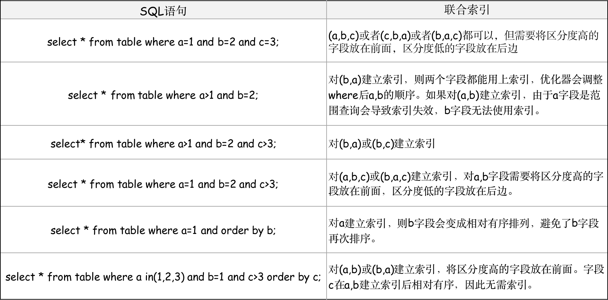

## 一、数据结构

&emsp; &emsp;算法与数据结构是程序的精髓与灵魂。所谓数据结构，就是数据在内存中的存储方式。所谓算法，是在数据结构的基础之上，针对某一特定问题产生了解决思路和方法。因此算法与数据结构中，数据结构是基础，算法是在基础之上的解决方案。

### 1. 数据集合及其结构

#### 1. 数据类型概念

&emsp; &emsp;在计算机的数据输入，输出和处理过程中，数据常常以集合的方式进行。许多基础的数据类型都和对象的**集合**有关，数据类型的值就是一组对象的集合，并通过添加，删除，访问等方式对集合进行操作。

> <font color=SlateBlue><u>**Q1. 什么是数据，数据元素，数据对象 ？**</u></font>
> &emsp; &emsp;① 数据是信息的载体，是对客观事物的符号表示，是输入到计算机中被程序识别和处理的<u>集合</u>。
> &emsp;&emsp; ② 数据元素是数据的基本单位，一个数据元素由若干个数据项组成。 &emsp;
> &emsp;&emsp; ③ 数据对象是数据元素的集合。
>
> <font color=SlateBlue><u>**Q2. 数据集合的分类 ？**</u></font>
> &emsp; &emsp; 数据集合按不同方式可以分为：<font color=green>**逻辑结构**</font>和<font color=green>**存储结构**</font>两类。逻辑结构**表示<font color=orange>数据与数据之间的联系</font>**被称为数据的逻辑。存储结构**表示<font color=orange>数据在计算机存储空间的存放形式</font>**。
> &emsp; &emsp;① 逻辑结构包括**线性结构**，**集合结构**，**树形结构**和**图(网状)结构**。
>
> 
>
> &emsp;&emsp;② 存储结构包括**顺序结构**，**链式结构**，**索引存储**和**散列存储**。
>
> 

#### 2. 计算机的数据运算

&emsp; &emsp; 程序中的所有数据在计算机内存中都是以二进制的形式储存的，即0、1两种状态。因此，计算机中的数据运算是以**位运算**的形式进行，位运算直接对整数在内存中的二进制位进行操作。计算机中常见的位运算有以下几种：


### 2. 常见的数据存储结构

#### 2.1 栈/队列

#### 2.2 哈希(散列)表

&emsp;&emsp; 哈希表又称散列表，是根据关键码值( *Key-Value* ) 而直接进行访问的数据结构。它结合了数组、链表以及二叉树之间的优点。哈希表的特点如下：
 &emsp;&emsp; ① **访问速度快**：由于哈希函数可以将指定的 *Key* 都映射到一个地址上，所以在访问一个 *Key* 对应的 *Value* 时，可以直接跳到访问地址，因此对散列表进行添加、删除、修改、查找等任何操作时，速度都很快。
 &emsp;&emsp; ② **需要额外空间**：由于哈希表是以空间换时间，所以为了能够有更好的性能，往往会考虑牺牲些空间。
 &emsp;&emsp; ③ **会发生哈希碰撞**：没有完美的散列函数，无论如何总会产生冲突。因此需要采用冲突解决方案。

&emsp;&emsp; 哈希表将记录的存储位置与它的关键字之间建立一个确定的关系 *H( Key )*，使每个关键字和唯一的存储位置对应，这种关系H就是该哈希表的一个**哈希函数**。在查找时，只需要根据对应关系计算出给定的关键字值 *H( Key )*，就可以得到记录的存储位置。


##### 2.2.1 哈希函数与哈希冲突

###### (1). 哈希函数

&emsp;&emsp; 从上面可以得知，哈希表的关键就是确定哈希函数，哈希函数是一种将“**键**”转换为“**索引**”的逻辑规则，哈希函数要能尽量把 *Key* 均匀散布在表空间中（从而尽量减少冲突），同时又要有尽量快的计算速度，它的设计好坏对哈希表的性能影响巨大。因此哈希函数的设计通常需要考虑几个因素：
&emsp; &emsp;  ① 计算哈希地址锁需要的时间：即哈希函数本身不能太复杂，如果哈希函数的计算耗时超过遍历数据的时效时，哈希函数也就没有意义可言。
&emsp; &emsp;  ② 关键字分布是否均匀，是否有规律可循。
&emsp; &emsp;  ③ 哈希函数要尽可能减少哈希冲突的发生。
&emsp;&emsp; 常见的哈希函数如下：
 &emsp;&emsp; ● <font color=red>**直接寻址法**</font>：取关键字或关键字的某个线性函数值为散列地址，*Hash( key )= A\*Key + B*。该方法使用时需要事先知道关键字的分布情况。
 &emsp;&emsp; ● <font color=red>**除留余数法**</font>：取关键字被某个不大于散列表的表长 n 的数 m 除后所得的余数 p 为散列地址。通常选择质数作为数 m 的值。*Hash( key ) = key % capacity* ( 哈希桶大小 )
 &emsp;&emsp; ● **数字分析法**：通过对数据进行分析，选取数据中冲突较少的部分，并构造散列地址。
 &emsp;&emsp; ● **平方取中法**：当无法确定关键字里哪几位的分布相对比较均匀时，可以先求出关键字的平方值，然后按需要取平方值的中间几位作为散列地址。
 &emsp;&emsp; ● **随机散列法**：使用随机函数，取关键字的随机值作为散列地址，通常用于关键字长度不同的场合。*H( key ) = random( key )*。

###### (2). 哈希冲突

&emsp;&emsp; 虽然选择了合适的哈希函数，由于哈希函数有时对不同的 *Key* 计算之后获得了相同的地址，从而不可避免的导致哈希冲突。当出现哈希冲突时可能会对原存储位置的数据造成覆盖、丢失。因此必须要对哈希冲突进行处理。常见的处理方式有两种：**闭散列 ( 开放地址法 - *Open Addressing* )** 和 **开散列 ( 链地址法 -  *Linear Probing* )**


 &emsp;&emsp; ● **开放寻址法**：当冲突发生时，
形成一个探查序列，沿此序列逐个地址探查，直到找到一个空位置 ( 开放的地址 )，将发生冲突的记录放到该地址中。
 &emsp;&emsp; ● **链地址法**：当冲突发生时，将地址相同的数据记录在一个线性链表中，此时的哈希表以"指针数组"的形式存在，数组内各个分量存储相应哈希地址的链表的头指针。
 &emsp;&emsp; ● **再哈希法**：构造若干个哈希函数，当发生冲突时，用另一个哈希函数计算另一个哈希地址，直至不发生冲突为止。
 &emsp;&emsp; ● **溢出区法**：建立两个表，一个是基本表，另一个是溢出表 ( 存放所有关键字和基本表中关键字冲突的记录，一旦冲突发生，就存入溢出表 )。

#### 2.3 链表

#### 2.4 树

#### 2.5 图

## 二、SQL 数据库 - MySQL

### 1. MySQL 数据库体系架构

&emsp;&emsp; 数据库是是依照某种数据模型组织起来数据的集合。在数据库之上存在着数据库实例程序，该程序是用户与操作系统之间的数据管理软件。因此，MySQL 其实是一种基于客户端-服务器的数据管理软件 ( DBMS )，用于管理存放数据的文件。


&emsp;&emsp; MySQL数据库体系架构共分为3层，<font color=red>应用层，MySQL 服务层，存储引擎层</font>，其结构如下图所示：
 &emsp;&emsp; ● **应用层**：提供与MySQL 服务器建立连接的支持，客户端的链接支持多种协议，如 Java 中的 JDBC。

 &emsp;&emsp; ● **MySQL 服务层**：包括系统管理，连接池，SQL接口，SQL解析器，查询优化器，缓存等模块
 &emsp;  &emsp;  ① 系统管理和控制工具：包括数据库备份和恢复，数据库安全管理，数据库复制管理，数据库集群管理，数据库分区，分库，分表管理，数据库元数据管理。 
 &emsp;  &emsp;  ② 连接池：主要是负责存储和管理客户端与数据库的链接，获取用户权限以及维持和管理连接，一个线程负责管理一个连接。默认连接时长为 8 小时，超过时间后将会被断开。
 &emsp;  &emsp;  ③ SQL接口：接收用户的SQL命令并进行处理。
 &emsp;  &emsp;  ④ 缓存：包括全局和引擎特定的缓存，提高查询的效率。如果查询缓存中有命中的查询结果，则查询语句就从缓存中取数据，无须再通过解析和执行。**查询缓存一般没有必要设置**，因为在查询涉及到的表被更新时，缓存就会被清空。所以缓存的设置适用于静态表。
 &emsp;  &emsp;  ⑤ SQL解析器：如果没有命中查询缓存，就要开始解析并执行SQL语句了。解析器会解析查询语句，生成语法树。语法检查后，解析器会<font color=orange>查询缓存</font>，如果缓存中有对应的语句，直接返回结果<font color=orange>不进行接下来的优化执行操作</font>。
 &emsp;  &emsp;  ⑥ 查询优化器：优化器主要是在我们的数据库表中，如果存在多个多个索引的时候，决定使用哪个索引；或者在一个语句有多表关联( *Join* )的时候，决定各个表的连接顺序 。

 &emsp;&emsp; ● **存储引擎层**：包括插件式的表存储引擎与底层物理文件。
 &emsp;  &emsp;  ① 存储引擎：存储引擎的概念是MySQL里面才有的，不是所有的关系型数据库都有存储引擎这个概念。在MySQL中，其存储引擎包括 *InnoDB* (面向在线事务处理的引擎)，*MylSAM* (面向在线计算分析的引擎)， *NDB*  (集群存储引擎)，*CSV*，*Archive* 等。
 &emsp;  &emsp;  ② 系统文件与日志：物理文件通常包括<font color=red>日志文件，数据文件，*Replication* 文件，参数配置文件</font>等。


### 2. MySQL 服务层

#### 2.1 MySQL 建立数据库连接

&emsp;&emsp;   MySQL建立连接的过程主要有5个步骤：<font color=green>① 客户端发起连接请求，TCP三次握手；② MySQL内部权限验证；③ SQL 执行语句；④ MySQL关闭；⑤ 断开连接，TCP四次挥手；</font>当应用频繁创建和销毁临时连接对象时，导致大量内存碎片，另外，在连接关闭后还会出现大量的 *TIME_WAIT* 状态。将TCP建立后，并通过MySQL认证的连接，加入到数据连接池中，当请求到来时，从连接池中直接获取可用连接即可，无需再次进行TCP的连接过程。


##### 2.1.1 MySQL 连接池

&emsp;&emsp;  数据库连接池是程序启动时建立足够数量的数据库连接，并将这些连接统一管理起来组成一个连接池，程序动态的从池中取连接与归还连接。为什么要使用数据库连接池？通过数据库连接池有以下几个优点：
&emsp; &emsp; ●  **资源复用**：避免了频繁的创建、销毁带来的性能开销，减少系统资源消耗的基础上，增加了系统运行的稳定性，主要体现在减少内存碎片和线程或进程的临时创建。
&emsp; &emsp; ●  **更快的响应速度**：由于程序启动时就准备好了若干连接备用，业务请求直接使用即可，不需要实时进行连接的创建、权限验证及销毁等操作，从而减少了系统的响应时间。
&emsp; &emsp; ●  **统一的连接管理，避免数据库连接泄漏**：可预先设定连接占用的超时时间，假如某条连接被占用超过设定值，可以强制回收该连接。连接池可以限制数据库连接数的数量，避免过多的连接对数据库造成压力。

&emsp;&emsp; 在MySQL 连接池中，主要包含两个池：**线程池**和**数据连接池**。
&emsp; &emsp;  ①  **线程池**：在MySQL中，每建立一个连接，MySQL都分配一个单独的线程用来接收客户端请求。MySQL线程池负责主动去调用任务，当任务队列不为空的时候从任务队列中取任务。
&emsp; &emsp;  ②  **数据连接池**：被动被任务使用，当某任务需要操作数据库时，只要从连接池中取出一个连接对象，当任务使用完该连接对象后，将该连接对象放回到连接池中。如果连接池中没有连接对象可以用，那么该任务就必须等待。

#### 2.2 SQL接口

&emsp;&emsp;MySQL 通过结构化查询语言 SQL 来对数据进行增查改删。每个 SQL 语句都是由一个或多个关键字组成的。SQL有两种使用方式：<font color=green>交互式和嵌入式(
在java/C++中使用，通过JDBC，Python等连接数据库)</font>。SQL语言由6个部分组成：


&emsp; &emsp; MySQL的数据类型分为<font color=green>数值类型，字符类型(串数据类型)，日期时间类型</font>。如下图所示：


##### 2.2.1 SQL 的执行过程

###### (1).SQL 的执行过程 


###### (2).SQL 语句的执行顺序

&emsp; &emsp; SQL 语句在执行过程中，所有的查询语句都是从 ***from*** 开始执行的，在执行过程中，每个步骤都会为下一个步骤生成一个虚拟表，这个虚拟表将作为下一个执行步骤的输入。SQL语句的执行步骤如下：
&emsp; &emsp;  ① 首先执行 *from*，*join* 来确定表之间的连接关系，得到初步的数据。
&emsp; &emsp;  ② *where* 对数据进行普通的初步筛选。
&emsp; &emsp;  ③ *group by* 对数据进行分组。
&emsp; &emsp;  ④ 各组分别执行 *having* 中的普通筛选或聚合函数筛选。
&emsp; &emsp;  ⑤ 根据我们需要的数据进行 *select*，可以是普通字段查询也可以是获取聚合函数的查询结果。
&emsp; &emsp;  ⑥ 将查询结果去重 *distinct*。
&emsp; &emsp;  ⑦ 最后合并各组的查询结果，按照 *order by* 的条件进行排序。
&emsp; &emsp;  ⑧ 根据 *limit* 限制条数返回对应数量的结果


#### 2.3 MySQL 查询缓存机制

&emsp;&emsp; MySQL的查询缓存只会缓存 Select 语句，其他语句不会被缓存。MySQL 查询缓存用 *Key-Value* 形式保存在 MySQL Server 中。每个查询请求都是以 SQL 文本作为 Key 来存储的，两个SQL语句，只要相差一个字符(如大小写不一样，多/少一个空格)，那么这两个SQL将使用不同的缓存地址。为了提高完全相同请求语句的响应速度，MySQL Server 会对查询语句进行 Hash 计算后，把得到的 Hash 值与查询的结果集对应存放在缓存中。如果这个表被修改(任何数据改变或结构改变)了，则该缓存将不再有效，查询缓存值得相关条目将被清空。因此<font color=red>**对于频繁更新的表，缓存并不合适，只有对于一些不变的数据且有大量相同sql查询的表( 静态表 )，缓存会节省很大的性能**。</font>MySQL重启也会导致缓存中的内容全部丢失。


### 3.MySQL 存储引擎

&emsp;&emsp; MySQL 存储引擎负责数据的存储和提取，不同的存储引擎，其数据存储结构，数据索引方式都不相同。MySQL 的存储引擎采用插拔式的插件方式，存储引擎是指定在表之上，一个库中的每一个表都可以指定选择存储引擎。MySQL的存储引擎支持*InnoDB*，*MyISAM*，*Memory* 等多个存储引擎，通过 `show engines` 可以查看 MySQL支持哪些存储引擎。MySQL 默认使用的是 *InnoDB* 存储引擎。不同存储引擎的具体差别如下：


#### 3.1 InnoDB 存储引擎

&emsp;&emsp; MySQL InnoDB 引擎是默认的引擎， *InnoDB* 的体系架构由一系列后台线程，*InnoDB* 内存结构和 *InnoDB* 磁盘结构三部分组成：


##### 3.1.1 InnoDB 后台线程

&emsp;&emsp;InnoDB 是多线程模型，后台有多个不同的后台线程，负责处理不同的任务，主要目的就是**负责刷新内存池中的数据，保证缓冲池中的缓存数据时最近的数据。此外将已经修改的数据文件刷新到磁盘文件，同时保证在数据库发生异常情况下InnoDB能恢复到正常状态**。后台线程主要包括以下几个线程：***Master Thread**、**IO Thread**、**Purge Thread**、**Page Cleaner Thread***。后台线程的主要任务是：
 &emsp;&emsp;   ① 负责刷新内存池中的数据，保证缓冲池中的内存缓存的是最近的数据。
 &emsp;&emsp;   ② 将已修改的数据文件刷新到磁盘文件，同时保证数据库异常时恢复到正常运行状态。

###### (1). 主线程 - Master Thread

&emsp; &emsp;  ***Master Thread*** 为核心后台线程，主要负责将数据缓冲池 ( *Buffer Pool* )中的数据异步刷新到磁盘，保证数据的一致性，包括脏页的刷新，合并插入缓存( *Insert Buffer* )，*Undo* 页的回收等。**在 *Master Thread* 内部由多个循环组成：主循环 ( *Main Loop* )、后台循环 ( Blackgrounp Loop )、刷新循环 ( Flush Loop )、暂停循环( Suspend Loop )**。*Master Thread* 会根据数据库运行的状态在**各种循环之间进行切换**。


&emsp;&emsp;● **主循环 *Main Loop***
&emsp; &emsp;  绝大部分的操作都是在主循环操作中完成的，主循环中包含两部分操作：**每秒一次的操作**、**每10秒一次的操作**。*Main Loop* 通过 Thread sleep 来实现，这意味着所谓的每秒一次或每10秒一次的操作是不精确的。在负载很大的情况下可能会有延迟。


&emsp;&emsp;● **后台循环 *Backgroup Loop***
&emsp; &emsp;  若数据库当前没有用户活动，或者数据库关闭时，Master Thread 就会从 Main Loop 切换到 Background  Loop。


&emsp;&emsp;● **暂停循环 *Suspend Loop***
&emsp; &emsp;  **若 Flush Loop中也没有什么事情可以做了**，InnoDB会切换到 Suspend Loop，将Master Thread挂起，等待事件的发生。若用户启用了InnoDB存储引擎，**却没有使用任何InnoDB存储引擎的表**，那么 Master Thread 总是处于挂起的状态。

###### (2). IO线程 - IO Thread

&emsp; &emsp;  在 InnoDB 中**大量使用了AIO ( *Async IO* ) 来处理写IO请求**，而 IO Thread的工作主要**负责这些IO请求的回调处理**。IO Thread 共有4个线程，分别是：*Write、Read、Insert buffer、log IO thread*。通过指令`show engine innodb status\G` 可以查询IO线程的状态。


###### (3). 清洗线程 - Purge Thread

&emsp; &emsp;  当事务被提交后，其所使用的 *undo log* 可能不再需要，因此需要 Purge Thread 来回收已经使用并分配的undo页。从InnoDB 1.2版本开始，InnoDB支持多个Purge Thread，这样做的目的是为了进一步加快 undo 页的回收。同时由于 Purge Thread 需要离散地读取 undo 页，这样可以更进一步利用磁盘的随机读取性能。通过指令 `show variables like 'innodb_purge_threads'\G` 可以查看 Purge Thread 的数量。


##### 3.1.2 InnoDB 内存

&emsp; &emsp;  InnoDB存储引擎是基于磁盘存储的，并将其中的记录按照页的方式进行管理。因此可将其视为基于磁盘的数据库系统。在数据库系统中，**由于CPU速度和磁盘之间的鸿沟**，基于磁盘的数据库系统通常通过内存来填补了磁盘读写性能的不足，提高数据库的整体性能。InnoDB存储引擎有多个内存块，内存结构主要包括 缓冲池 ( *Buffer Pool* ) 、Change Buffer 和 日志缓存 ( *Redo Log Buffer* ) 三大组件。


###### (1). 缓冲池 - Buffer Pool ( 减少磁盘操作 )

&emsp;&emsp;缓冲池简单来说就是一块内存区域，通过内存的速度来**弥补磁盘速度较慢**对数据库性能的影响，<font color=red>缓冲池的作用是用来缓存热的**数据页**和**索引页**，减少磁盘读操作</font>**。在InnoDB存储引擎中，缓冲池中页的大小默认为16KB。**缓冲池在 MySQL 启动时，会向操作系统申请一片连续的内存空间，默认配置为128M，可以通过调整 `innodb_buffer_pool_size` 参数来设置缓冲池大小。
&emsp;&emsp;**缓冲池中缓存的数据页类型有：**数据页 **( *data page* )，**索引页 **( *index page* )，**插入缓冲/写缓冲 **( *Change buffer* )，**自适应哈希索引 **( *adaptive hash index* )，**锁信息 **( *lock info* )，**数据字典信息**( *data dictionary* )。** 对于缓冲池来说，其主要操作有两种：读取操作、写入/修改操作。
&emsp; &emsp; ● **读取操作 -  页 *Fix***：在数据库中进行读取页的操作时，首先将从磁盘读到的页存放在缓冲池中，这个过程称为将页“FIX”在缓冲池中。下一次再读相同的页时，首先判断该页是否在缓冲池中，若在缓冲池中，直接从缓冲池中读取该页，否则，读取磁盘上的页。
&emsp; &emsp; ● **写入/修改操作**：对于数据库中页的修改操作，则首先修改在缓冲池中的页，然后将被修改的页设置为脏页，然后用再以一定的频率刷新到磁盘上。为了提高数据库的整体性能，页从缓冲池刷新回磁盘的操作并不是在每次页发生更新时触发，而是通过一种称为 ***Checkpoint*** 的机制刷新回磁盘。


**▧ 缓存池的调度与管理 - LRU ( *Least Recently Used* )**

&emsp;&emsp; 为了更好的管理在缓冲池中的缓存页，InnoDB 为每一个缓存也都创建了一个控制块，控制块信息包括：缓存页的表空间、页号、缓存页地址、链表节点等信息。控制块也占有内存空间，它放在 *Buffer Pool* 的最前面。


&emsp;&emsp; 缓冲池是通过 LRU 算法进行管理。传统的LRU策略是将最近查询或使用的页在 *LRU List* 的前端，而最少使用的页在 *LRU List* 的尾端。当不能存放新读取到的页时，将首先释放 *LRU List* 中尾端的页。<font color=green>在InnoDB引擎中，对 LRU算法进行了改进，将 *LRU List* 划分为两个区域： *Old Page* 和 *New Page*，同时在 *LRU List* 中加入了 *midpoint* 位置，新读取到的页并不直接放入 *LRU List* 的首部，而是放到 *LRU List* 的 ***midpoint*** 位置 ( *LRU List* 的5/8处 )，根据参数 `innodb_old_blocks_time` 将 *midpoint* 位置的页面放入 *LRU List* 前端。</font>通过对 LRU 算法的改进，可以让预读页在 *LRU List* 中的时间尽可能短，让真正被访问的页才移动到 *LRU List* 的头部，保证热数据留在 *Buffer Pool* 中。


> 
>
> <font color=SlateBlue> <u>**Q1. 为什么不使用传统的LRU算法 - 解决预读失效问题 ？**</u></font>
> &emsp;&emsp; 这里需要提到 MySQL 的预读机制，由于程序是有空间局部性的，靠近当前被访问数据的数据，在未来很大概率会被访问到。因此 MySQL 在加载数据页时，为了减少磁盘IO，会提前把它相邻的数据页一并加载到缓冲池。如果这些被提前加载进来的数据页并没有被访问，就会造成预读失效。
> &emsp;&emsp; 如果采用传统的 LRU 算法，就会将预读页放到 *LRU List* 的头部，特别是当 *Buffer Pool* 空间不够时，会将 *LRU List* 末尾的页淘汰掉。如果这些预读页一直不会被访问，这样会导致大量不会被访问的页占据了 *LRU List* 中的头部，导致缓存命中率大大降低。
>
> <font color=SlateBlue> <u>**Q2. 什么是 *Buffer Pool* 污染 ？**</u></font>
> &emsp;&emsp; 当某一个SQL语句扫描了大量数据(如: 索引失效，查询数据过多)时，在 *Buffer Pool* 空间有限的情况下，会将 *Buffer Pool* 里的所有数据页都替换出去，导致大量热数据被淘汰。等这些热数据再次被访问时，由于缓存为命中，就会产生大量磁盘IO，导致MySQL性能下降，这一过程称为 *Buffer Pool* 污染。
> &emsp;&emsp; 为了解决 *Buffer Pool* 污染问题，就需要提高缓存页进入到 *New Page* 的门槛，因此 MySQL 在缓存页进入到  *New Page* 时，增加了一个停留在 *midpoint* 区域的时间判断。
>
> 
>
> <font color=SlateBlue> <u>**Q3. 缓冲池是查询一条记录，就缓冲一条记录吗 ？**</u></font>
> &emsp;&emsp; 当查询一条记录时，InnoDB 会把整个页的数据加载到 *Buffer Pool* 中，因为通过索引只能定位到磁盘的页，而不能定位到页中的一条记录。将页加载到 *Buffer Pool* 中，再通过页里的页目录去定位到某条具体的记录。

&emsp;&emsp; 在缓冲池的调度过程中，有三个 *List* ，分别为 ***LRU List* (调度列表)，*Free List* (空闲列表)，*Flush List* (刷新列表)**。通过 `show engine innodb status\G` 可以查看下上面各个列表的数据页大小。


 &emsp;&emsp; ① **Free List**：MySQL启动时，*buffer pool* 会被初始化，此时 *buffer pool* 中缓存页都是空的内存，没有任何数据保存在里边。初始化后的缓存页就放在 *Free list* 中。<font color=green>*Free list*是一个双向链表</font>，其中的每一个结点都是缓存页对应的描述信息，通过描述信息可以找到指定的缓存页。<font color=green>当InnoDB读取到数据时，从 *Free List* 获取空闲缓存页，将数据放入缓冲页中，并将新页面放入 *LRU
List* 的 *midpoint* 位置，同时删除 *Free List* 中的页。</font>


&emsp;&emsp;  ② **LRU List**：*LRU List* 用于**管理缓冲池中已经读取/使用到的页**，通过参数 *innodb_old_blocks_time* 可以控制 *mid* 页面加入到 *LRU List* 前端的时间。
&emsp;&emsp;  ③ **Flush List**：在 *LRU List* 中的页被修改后，会导致缓冲池中的页和磁盘上的页的数据产生了不一致，则该页称为**脏页**，*Flush List* 用于存储脏页，并通过 *Checkpoint*  技术将页刷新回磁盘。**脏页既存在于 *LRU List* 列表中，也存在与 *Flush List* 列表中**。LRU列表用来管理缓冲池中页的可用性，*Flush List* 列表用来管理将页刷新回磁盘，两者互不影响。*Flush List* 与 *Free List* 的结构完全相同。


**▧ 写缓冲 - Change Buffer ( 减少磁盘写操作 )**

&emsp;&emsp; 写缓冲是更改缓冲池时的一种特殊的数据结构。在MySQL5.5之前，写缓冲只针对 `insert` 操作进行了优化，因此也被叫做插入缓冲 ( *Insert Buffer* )，后面进行了优化，对 `delete` 和 `update` 操作也有效，因此后面又叫做写缓冲 ( *Change Buffer* )。*Change Buffer* 主要应用在<font color=red>**非唯一的普通索引页**不在缓冲池中的场景</font>。因此当需要执行一个写入操作时，一般分为走 *Change Buffer* 和不走 *Change Buffer* 两种情况。
&emsp; &emsp; ● 当非唯一的普通索引页不在缓冲池中时，如果对页进行了写操作，并不会立刻将磁盘页加载到缓冲池，而仅仅将数据的变更记录缓冲到 *Change Buffer*  当中，等未来数据被读取时，再将 *Change Buffer* 中的数据合并到缓冲池 *Buffer Pool* 中，从而避免了写磁盘的IO操作。
&emsp; &emsp; ● 如果非唯一的普通索引页在缓冲池当中，则不会将变更记录缓冲到 *Change Buffer*。
&emsp; &emsp; ● 如果索引页是唯一索引，唯一索引的所有的更新操作都要先判断这个操作是否违反唯一性约束，而这一过程必须要将数据页读入内存才能判断。因此唯一索引在更新数据时数据一定会在缓冲池中，直接更新缓冲池中的数据即可，不再需要 *Change Buffer*。


&emsp;&emsp; *Change Buffer* 的适用业务场景如下：


###### (2). 重做日志缓存 - Redo Log Buffer

&emsp;&emsp;  为了确保数据的可靠性，InnoDB存储采用WAL( *Write Ahead Log* )机制，即先记录事务重做日志，再进行数据提交。**在记录事务重做日志时，先写入重做日志缓存 *Log Buffer*，然后再通过一定策略刷新到磁盘日志文件，当数据库异常宕机时，未保存到磁盘的数据可以通过 *Redo Log* 日志进行数据恢复**。Log Buffer 主要存储的是 *Redo Log*，用于保存要写入磁盘上的日志文件的数据。日志缓冲区大小由 `innodb_log_buffer_size` 变量定义，默认大小为16MB。以下三种情况下会将数据刷新到磁盘：
 &emsp;&emsp; ① *Master Thread* 每一秒将重做日志缓冲刷新到重做日志文件。
 &emsp;&emsp; ② 每个事务提交后会将重做日志缓冲刷新到重做日志文件。
 &emsp;&emsp; ③ 当重做日志缓冲池剩余空间小于1/2时，重做日志缓冲刷新到重做日志文件。


###### (3). 额外内存池 ( 减少磁盘写操作 )

&emsp;&emsp; 在InnoDB存储引擎中，对内存的管理是通过**为内存堆（heap）**的方式进行的，在对一些数据结构本身的内存进行分配时，需要从额外的内存池中进行申请，当该区域的内存不够时，会从缓冲池中进行申请。例如，分配了缓冲池，但是每个缓冲池中的帧缓冲还有对应的缓冲控制对象，这些对象记录了一些诸如LRU、锁、等待等信息，而这个对象的内存需要从额外内存池中申请。

##### 3.1.3 InnoDB 磁盘结构

&emsp;&emsp; MySQL数据库的数据，索引，Redo Log，Undo Log 都存储是放在磁盘当中。 InnoDB的磁盘主要由多个表空间组成，包括系统表空间，独立表空间，通用表空间，临时表空间，Undo 表空间。


&emsp; &emsp; ● **系统/数据表空间 ( *System Tablespace* )**：系统表空间包含任何用户在系统表空间创建的表数据和索引数据，包含 InnoDB 数据字典 ( *data dictionary* )，双写缓冲区 ( *Doublewrite Buffer* )，*Change Buffer*，*Undo Logs* 的存储区域。<font color=red>系统表空间是一个共享表空间，它是被多个表共享的，多个表及索引在表空间中混合存储，这对于磁盘管理带来很大困难 ( 如果其中的某一个表做了大量的删除操作，会导致在表空间中产生大量的空隙 )</font>。系统表空间的数据会存储在磁盘上的*ibdata\** 文件中。
&emsp; &emsp; ● **独立表空间 ( *File-Per-Table Tablespace* )**：针对共享表空间的问题，独立表空间每个表有自己的独立空间，表中的数据和索引都会存在自己的表空间中，其他信息还是存放为默认的表空间中，可以实现单表在不同数据库中移动。通过修改 `innodb_file_per_table` 参数可以设置表空间的管理模式，*innodb_file_per_table = 1* ( 使用独立表空间 )、*innodb_file_per_table = 0* ( 使用共享表空间 )。独立表空间在磁盘上会存储两个文件：*.frm* - 表结构文件，*idb* - 独立的表空间文件。
&emsp; &emsp; ● **通用表空间 ( *General Tablespace* )**：通用表空间与共享表空间类似，通用表空间没有库的概念，因此可以在多个库中建属于同一 *tablespace* 的表。*General Tablespace* 会创建一个单独的ibd，ibd中包含多个表，兼容不同的格式。
&emsp; &emsp; ● **临时表空间 ( *Temporary Tablespace* )**：用于存放瞬时数据，只有在session连接期间才能够看到数据,比如分组，排序时引发的临时数据存放的区域。

###### (1). 数据字典

&emsp;&emsp;  InnoDB 数据字典是 InnoDB 用于维护用户表的各种信息的一组内部系统表，对用户不可见。 InnoDB 数据字典<font color=green>**用来存储元数据信息，如表的描述，表对应每一列的类型，表的索引，每个索引有哪几个字段等**</font>。数据字典有4个最基本的系统表来存储表的元数据：<font color=green>表( *SYS_TABLES* )，列( *SYS_COLUMNS* )，索引( *SYS_INDEXES* )
，索引列( *SYS_FIELDS* )</font>，通过这4个基本系统表，就可以获取其他系统表以及用户定义的表中所有的元数据。


&emsp;&emsp;  为了方便管理，InnoDB 将数据字典的B+树信息存储到固定的页面 ( **0号表空间-0号文件-7号页面** )。这个页面存储了4个系统表的5个跟页面号 ( 有5个索引 )。当InnoDB 启动时，InnoDB会从 **0号表空间-0号文件-7号页面**  中加载数据字典，数据字典的加载过程如下所示：
 &emsp;&emsp; ● 新建数据库时，初始化库，索引创建数据字典管理B+树信息，并将系统表根页面存储在固定位置(0号表空间-0号文件-7号页面)
&emsp;&emsp;  ● 当用户访问一个表时，系统首先会从表对象缓冲池中查找该表*share*对象，如果找到直接从其实例化表对象空间中拿出一个空间的实例化对象使用。如果没有可用的实例化对象，则需要重新实例化该表(实例化时从*share*对象获取表信息)。如果没有*share*对象，则需要从系统表中构造一个*share*对象。


###### (2). 双写缓冲区 - *Double Write*

&emsp;&emsp;  InnoDB 数据从内存 ( *Buffer Pool* ) 写入到磁盘中是以页为单位，但是 InnoDB 的页和操作系统的页的大小不一致，InnoDB的页大小为16K，操作系统页大小大小为4K，所以InnoDB 写入磁盘时，一个页需要分4次写。当在特殊情况时(操作系统崩溃，断电等)，会造成 InnoDB Page 写入磁盘时出现只有部分页写入 (  *partial page write*  ) 的问题，这会导致 InnoDB Page 数据丢失。


&emsp;&emsp; 为了解决 InnoDB 与操作系统在页面大小不一致情况下，内存写入到磁盘时出现问题而导致**数据丢失问题**，InnoDB 实现了双写缓冲区 *Double Write Buffer* ，它位于系统表空间，是一个存储区域。 双写数据缓冲区分为两个部分：
&emsp;&emsp;  ① 内存中的 *Double Write Buffer*，大小为2M；
&emsp;&emsp;  ② 磁盘上系统表空间中的连续128页，即两个区，大小同样为2MB，可以称为 *Double Write Page* 。

&emsp;&emsp; 在 *Buffer Pool* 的 Page 页刷新到磁盘真正的位置前，会先将数据存在 *Double Write Buffer*。在宕机重启时，如果出现数据页损坏，那么在应用 *Redo Log* 之前，通过 *Double Write Page* 中页的副本来还原该页，然后再进行 *Redo Log* 重做，*Double Write* 实现了 InnoDB 引擎数据页的可靠性。*Double Write* 的工作流程如下：


> <font color=SlateBlue> <u>**Q1. 为什么 *Double Write Buffer* 需要两次写入数据文件中 ？**</u></font>
>&emsp;&emsp;  *Double Write Buffer* 里面的数据是连续的，如果直接写到 *Data Page* 里面，由于 *Data Page* 的页是离散写入的，所以写入会很慢。在写入过程中如果出现异常也会导致数据异常。因此 Double Write Buffer 首先写入 *Double Write Page* 中，这个过程是顺序写，效率很高。
>
> <font color=SlateBlue>  <u>**Q2. *Double Write* 在恢复的时候是如何工作的 ？**</u></font> 
>&emsp;&emsp;  ● 如果是写 *Double Write Buffer* 本身失败，那么这些数据不会被写到磁盘，InnoDB此时会从磁盘载入原始的数据，然后通过InnoDB的事务日志来计算出正确的数据，重新写入到 *Double Write Buffer*。
>&emsp; &emsp;  ● 如果 *Double Write Buffer* 写成功的话，但是写磁盘独立表空间 ( 离散写 ) 失败，可以通过加载共享表空间中完整的页进行覆盖，使数据页变得完整，再通过 *Redo Log* 进行恢复，不会造成数据的缺失。
>
> <font color=SlateBlue>  <u>**Q3. 为什么 *Redo Log*不需要 *Double Write* 的支持 ？**</u></font> 
>&emsp;&emsp;  因为 *Redo Log* 写入的单位就是512字节，也就是磁盘IO的最小单位，所以无所谓数据损坏

##### 3.1.4 InnoDB 数据存储结构

&emsp;&emsp; MySQL中的数据都存放在表空间中，一个表空间可以分为<font color=red>**段，区，页，行**</font>四个部分。


###### (1). 行记录 - *Row*

&emsp;&emsp;  InnoDB 是面向行的存储，数据页中存放一条条的行记录。行与行之间通过**单向链表**的形式来连接。行记录有以下几种格式：紧凑型行格式 ( *Compact* )、字段长度偏移行格式 ( *Redundant* )、动态行格式 ( *dynamic* )、压缩行格式 ( *compressed* )
&emsp; &emsp; ● ***Compact* 行记录：** *Compact* 行记录的设计目的是高效的存储数据，一个页中行数据越多，性能越高。其格式如下所示：


&emsp;&emsp;   下面以插入语句为例，来说明行记录的数据是如何记录的。


&emsp; &emsp; ● ***Redundant* 行记录：** MySQL5.0版本之前的 InnoDB 行记录存储方式


###### (2). 页 - *Page*

&emsp;&emsp;  InnoDB 以<font color=red>**页**</font>作为**磁盘和内存之间IO操作的基本单位**，也是数据库管理存储空间的基本单位，InnoDB 将数据划分为若干个页，每个页的默认大小为**16KB**。在逻辑上(页面号都是从小到大连续的) 与物理上都是连续的。在向表中插入数据时，如果一个页面已经被写完，系统会从当前区中分配一个新的空闲页面处理使用，如果当前区中的64个页面都被分配完，系统会从当前页面所在段中分配一个新的区，然后再从这个区中分配一个新的页面来使用。一个 InnoDB 数据页的存储空间大致被划分成了7 个部分：


&emsp;&emsp; 在页的7个组成部分中，自己存储的记录会按照指定的行格式存储到 *User Records* 部分。最开始生成页的时候，并没有 *User Records* 部分，每插入一条记录，都会从 *Free Space* 空间中申请一个记录大小的空间划分到 *User Records*。当 *Free Space* 的全部空间被 *User Records* 替代之后，意味这个页用完了，再插入新的记录就需要申请新的页了。
&emsp;&emsp; 页 *Page* 可以分为4种类型：
&emsp;&emsp;  ① 空闲的区 *FREE*：现在没有用到这个区中的任何页面。
&emsp;&emsp;  ② 有剩余空间的碎片区 *FREE*：表示碎片区中还有可用的页面。
&emsp;&emsp;  ③ 没有剩余空间的碎片区*FULL_FRAG*：表示碎片区中所有页面都被使用，没有空间页面。
&emsp;&emsp;  ④ 附属于某个段的区 *FSEG*：每个索引都可以分为叶子节点段和非叶子节点段。

> <font color=SlateBlue>  <u>**Q1. 16KB(一页)大小的索引文件可以存储多少条(行)数据 ？**</u></font> 
> 		假设主键ID为 *bigint* 类型，长度为8字节，而索引指针大小在 *InnoDB* 源码中设置为6字节，这样一条索引共占用14字节，一个页中能存放多少这样的单元，其实就代表有多少指针，即 ( 16KB * 1024=16384 byte ) 16384 / 14 = 1170个索引**。那么可以算出一棵高度为2的B+树，能存放1170 (索引个数) \* 16 (每页行数，每行数据1KB) = 18720条这样的数据记录。**一个高度为3的B+树可以存放**：**1170 (索引个数) \* 1170 (索引个数) \* 16 (每页行数，每行数据1KB) = 21902400条这样的记录。

###### (3). 区 - *Extent*

&emsp; &emsp; **InnoDB 区是物理概念，是由64个<font color=red>连续的页</font>组成的，每个页大小为16KB，每个区大小为1MB (16KB × 64)**。页是段的基本元素，一个段由多个区组成，一个段管理的空间大小是无限的，可以一直扩展，但每次扩展的最小单位是区。

> <font color=SlateBlue> <u>**Q1. 为什么要有区 ？ - 避免随机I/O**</u></font>
>&emsp; &emsp; 在B+树中，每一层中的页都会形成一个双向链表。如果以页为单位来分配存储空间的话，双向链表相邻的两个页之间的物理位置可能离的非常远。当按照范围查询时，需要沿着双向链表进行扫描，如果双向链表的物理位置距离很远时，会产生**大量的随机I/O，导致查询效率很低**。InnoDB 为了提高查询效率，引入区 *Extent* 的概念，一个区就是物理位置上连续的64个页，在表中数据量大的时候，为某个索引分配空间的时候就不再按照页为单位分配了，而是按照区为单位分配，从而消除很多随机I/O，提升性能。

###### (4). 段 - *Segment*

&emsp; &emsp;段是表空间文件中的主要组织结构，是一个**逻辑概念**，用来管理物理文件，是构成索引，表，回滚段的基本元素，常见的段包括<font color=green>**数据段**，**索引段**，回滚段</font>。<font color=red>数据段是B+树上的叶子节点，索引段是B+树上的非叶子节点</font>。


> <font color=SlateBlue> <u>**Q1. 为什么要有段 ？- 分段管理**</u></font>
> &emsp; &emsp;对于数据的范围查询，其实是对B+树叶子节点中的记录进行顺序扫描，如果不对B+树加以区分，一个区中64个物理位置上连续的页可能有很多都是非叶子节点的页，这样进行范围扫描的性能大大降低了。所以InnoDB引入了段 *segment*，对B+树的叶子节点和非叶子节点进行了划分，一个索引会生成两个段，一个是数据段 ( 叶子节点段 )，一个是索引段 ( 非叶子节点段 )，保证数据存储到叶子节点，索引存储在非叶子节点上。

#### 3.2 InnoDB 索引

&emsp; &emsp; 什么是索引？索引就类似于书中的目录，能够快速定位到需要的部分或缩小查询范围。MySQL数据库中，数据都是存储在磁盘文件当中，当需要对数据进行操作时**按照页为基本单位**将数据从磁盘读入内存中。为了提高数据库的查询速度，需要对数据库建立索引，如果不使用索引，MySQL必须从第一条记录开始读完整个数据库。<font color=red>索引是一种特殊的文件(表空间中文件)
，该文件内部数据结构采用的是**B+树**。</font>MySQL中不同存储引擎与索引的对应关系如下表所示：


&emsp;&emsp; InnoDB 的数据存储是基于索引组织的，因此对于 InnoDB 存储引擎，数据即索引，索引组织数据。 InnoDB 存储引擎中常见的索引包括：<font color=red>B+树索引，全文索引，自适应哈希索引。</font>InnoDB默认索引为B+树索引，<font color=green>**对于一张数据表，每一个索引都对应一颗B+树**</font>。

##### 3.2.1 B+ 树索引

&emsp;&emsp;B+树索引是以<font color=green>**B+树**</font>数据结构为基础，B+树的结构主要用于磁盘，其节点对应于磁盘的页，因此节点在查询、插入过程中意味着磁盘的IO操作。**每当B+树增加一个深度，查找数据就会增加一次IO**，因此，需要降低树的深度，同时尽可能增加每个结点 (页面，16KB) 能够存放的数据。B+树由非叶子节点和叶子节点组成。非叶子节点不存储数据，而叶子节点存储数据。<font color=red>**B+树索引并不能找到一个给定键值的具体行数据，其能检索到的只是被查找数据行所在的页，然后数据库通过将页读入到内存，再在内存中进行查找。**</font>


##### 3.2.2 InnoDB 索引类别

&emsp;&emsp; InnoDB 索引由B+树构成，B+树由非叶子节点和叶子节点组成。非叶子节点不存储数据，而叶子节点存储数据。<font color=green>**在InnoDB中每增加一个索引，就是增加一棵B+树**</font>。InnoDB的索引分为两大类：**主键索引 ( 聚簇索引 )、普通索引 ( 二级索引 )**。

###### (1). 主键索引
&emsp; &emsp; 主键索引根据<font color=red>**数据表的主键**</font>生成，该索引的叶子结点记录着<font color=green>**行记录(即所有数据)**</font>。对于任意一个数据表，一定存在一个主键索引，有且仅有一个主键索引。


&emsp;&emsp; 主键索引的特点如下:
&emsp;  &emsp; ① <font color=red>主键索引表按照主键ID排序，检索的是**每一行数据的真实内容**。</font>
&emsp;  &emsp; ② 实际的数据页只能按照一棵B+树进行排序，因此<font color=red>每张表有且只有一个主键索引。</font>
&emsp;  &emsp; ③ 主键索引对于主键的<font color=red>排序查找 </font>和<font color=red>
范围查找</font>速度非常快。
&emsp;  &emsp; ④ 主键索引的存储不是物理上连续，而是逻辑上连续的。

> <font color=SlateBlue> <u>**Q1. 如何生成主键 ？- 主键策略**</u></font>
> &emsp;&emsp;在生成主键ID时，通常要满足几点要求: **① 主键ID全局唯一(特别是在分布式系统中)； ② 主键ID单调递增(不一定连续)；③ 主键ID要确保信息安全**。基于这三点要求，在 InnoDB 中通常有以下几种主键ID的生成策略：
> &emsp; &emsp; ● **自增ID - auto_increment**： 如果主键字段id被定义为 *auto_increment*，在插入一行数据时，如果id为0、null或未指定值，那么就把这个表当前的 *auto_increment* 值填到自增字段。<font color=green>如果插入数据时id字段指定了具体的值，就直接使用语句里指定的值，同时，如果指定插入的 id 值 > *auto_increment* 值，则会将 *auto_increment* = 当前指定插入的id值。</font>通过 `alter table [tablename] auto_increment=[num];`可以设置自增主键ID。<font color=red> *auto_increment* 只保证了自增 id 是递增的，但不保证是连续的，当事务中的 *insert* 操作回滚、唯一索引冲突导致插入失败时，自增ID会出现不连续的情况。</font>
> &emsp; &emsp; ● **UUID**：在MySQL中，有一个 `uuid() `方法，可以生成一个唯一的字符串值。由于 `uuid()` 具有无序性，同时 `uuid()` 有16个字节，比自增id占用更多存储空间，因此以 `uuid()` 作为主键索引，会影响插入速度，造成硬盘使用率低，同时建的索引越多，则对磁盘的性能影响越大。但是 `uuid()` 能达到全局的唯一性，在数据表出现分表，并对数据拆分、合并存储的时候，不需要考虑主键冲突问题。
>
> 
>
> &emsp; &emsp; ● **雪花算法 - *Snowflake***：对于数据量大的表，通常会采用水平分表策略，提升数据表的查询效率。水平分表就是将一张表的数据分成多张表，当需要对数据表进行合并时，对于分表就需要考虑主键ID冲突的问题。针对这个问题，提出了雪花算法。雪花算法根据时间进行计算，由于雪花算法严重依赖时间，所以当发生服务器时钟回拨的问题时 (当前时间 < 上一次的时间) 会导致可能产生重复的id。
>
> 
>
> &emsp; &emsp; 当出现时钟回拨问题时 ，通过以下几种策略可以减少时钟回拨产生的影响：
> &emsp;&emsp;   ① 如果时钟回拨时间小于5ms，可以阻塞一段时间，等待时间追上来。 &emsp;
> &emsp;&emsp;   ② 可以增加扩展位，当出现时钟回拨时，增加扩展位，防止出现ID冲突。
>
> <font color=SlateBlue><u>**Q2. 为什么主键必须是递增的  ？**</u></font>
> &emsp;&emsp; 主键索引采用的B+树结构，B+树的每个节点都保存了该主键所对应行的数据页，假设插入数据的主键是自增长的，那么根据二叉树算法会很快的把该数据添加到某个页节点下，而其他的节点不用动；但是如果插入的是不规则的数据，那么每次插入都会改变二叉树之前的数据状态。从而导致了页分裂和页移动，降低查询性能。（页分裂本质是值在”有序“的B+树中，如在1，2，3，5，9插入数据4，则会导致B+树数据(索引)页的”调整“，调整过程中会使原有的数据(索引)页分裂。

###### (2). 普通索引

&emsp; &emsp; 除了主键索引之外的索引称为普通索引，普通索引的节点是以某一字段的数据，普通索引可以有多个。普通索引 B+ 树的叶子节点不存储表中的数据，而是存储该列对应主键的值，当查找数据时，需要根据先根据普通索引找到对应的主键页，再去主键索引中进行查找。根据主键索引查找数据的过程叫做<font color=red>**回表**</font>，因此查普通索引的询过程就是查询两棵B+树 ( 两次时间复杂度为O(logN)的查询过程 )。非主键索引不影响主键索引的组织，因此每张表上可以有多个非主键索引。


&emsp;&emsp; 普通索引的特点如下:
&emsp;  &emsp; ① 普通索引的叶子节点是主键的值，查到主键的值以后，还需要再通过<font color=red>**回表**</font>，再进行多次查询。
&emsp;  &emsp; ② 普通索引的叶子结点使用<font color=green>**主键作为指针而不是使用地址值作为指针**</font>，当出现行移动或数据页分裂时，只需要对主键索引进行维护，普通索引不需要进行维护工作。

###### (3). 唯一索引

&emsp;&emsp; 唯一索引是一种特殊的索引，唯一索引对应的列数据在数据表中有且仅有一个。**唯一索引不能替代主键索**引，唯一索引和主键索引的区别如下：
&emsp;  &emsp; ①  主键是一种约束，而唯一索引是一种索引。
&emsp;  &emsp; ②  主键创建后一定会包含一个唯一索引，但唯一索引不一定是主键。
&emsp;  &emsp; ③  主键不允许有空值 ( NULL )，而唯一索引允许有空值。
&emsp;  &emsp; ④  主键可以被其他表引用为外键，而唯一索引不能。

><font color=SlateBlue> <u>**Q1. 建立索引时普通索引与唯一索引如何选择 ？**</u></font>
>**查询过程：**假设查询的语句是 `select id from T where k=5`
>&emsp;  ● 对于普通索引来说，查找到满足条件的第一个记录(5,500)后，需要查找下一个记录，直到碰到第一个不满足k=5条件的记录。
>&emsp;  ● 对于唯一索引来说，由于索引定义了唯一性，查找到第一个满足条件的记录后，就会停止继续检索。
>
>**插入/更新过程：** 假设语句是` insert into T values(5,200)` / `update T set a=5 where id=1;`
>&emsp; ① 第一种情况是，**这个记录要更新的目标页在内存中**。这时，InnoDB的处理流程如下：
>&emsp;&emsp; ● 对于唯一索引来说，找到3和5之间的位置，判断到没有冲突，插入这个值，语句执行结束；
>&emsp;&emsp; ● 对于普通索引来说，找到3和5之间的位置，插入这个值，语句执行结束。
>&emsp; ② 第二种情况是，**这个记录要更新的目标页不在内存中**。这时，InnoDB的处理流程如下：
>&emsp;&emsp; ● 对于唯一索引来说，需要将数据页读入内存，判断到没有冲突，插入这个值，语句执行结束。（将数据从磁盘读入内存涉及随机IO的访问）
>&emsp;&emsp; ● 对于普通索引来说，则是将更新记录在 *Change Buffer*，语句执行就结束了。

##### 3.2.3 InnoDB 索引优化

&emsp; &emsp;在普通索引中，每次查询都需要进行回表，需要回表的记录越多，使用普通索引查询数据的性能就越低，为了提高查询效率，需要对索引进行优化。索引优化的方法主要有以下几种：**索引覆盖 ( 又称覆盖索引 )、联合索引、索引下推。**

###### (1). 联合索引 - 一个B+树过滤多个条件

&emsp;&emsp; 无论是主键索引，还是覆盖索引，都是简单的单列索引。<font color=orange>当遇到多条件查询时，不可避免使用到多列索引，此时就需要建立联合索引。</font>联合索引的数据结构仍然使用的是B+树，但与单列索引的B+树节点不同的是，<font color=green>联合索引的每个B+树节点包含**多个键值**。</font> 联合索引遵循<font color=red>**最左匹配原则**</font>，具体是指，在联合索引匹配中，是<font color=green>根据建立联合索引的顺序，依次从最左边的索引开始匹配，直到索引失效为止，范围索引会导致索引失效 ( >、<、between、like )。</font>如对 ( *a,b* ) 建立索引，如果字段 a 匹配成功，才会继续匹配字段b，以此类推。联合索引的数据结构及匹配原理如下所示 ( 以两列联合索引为例 )：


> <font color=SlateBlue><u>**Q1. 对于多条件查询时应该如何建立联合索引 ？**</u></font>
>
> 

###### (2). 覆盖索引 - 不用回表

&emsp; &emsp; 当一个索引包含所有需要查询的字段的值时，称为覆盖索引。覆盖索引是指从普通索引中可以拿到所有想要查询的数据，而不需要进行回表从主键索引中查询到行数据。**由于覆盖索引不需要再进行回表操作查询整行记录，可以减少树的搜索次数，提高查询性能，所以对于高频的请求上建立覆盖索引是一个常用的索引优化手段**。使用覆盖索引最常见的方法是**创建联合索引时，将需要查询的字段都放在联合索引上**。所以一般我们在写 select 语句时不要使用 select *，因为这种情况肯定是不能走覆盖索引的。

```sql
create table user (
	id int primary key,  #主键
	name varchar(20),
	sex varchar(5),
	index(name)    #普通索引
)engine=innodb;

select id,name from user where name='test'; 
# 1.命中namelme,无需回表，
#   符合覆盖索引，直接返回查询所需要的数据。

select id,name,sex from user where name='test';*
# 2.命中name索引，索引叶子节点存储了主键id,通过name的索引树即可获取id和name,
#   但sex字段必须回表查询才能获取到，不符合覆盖索引，需要通过id聚集索引获取sex字段。
```

###### (3). 索引下推 - 减少回表次数

&emsp;&emsp;**索引下推** ( *index condition pushdown* ) 简称ICP，在 MySQL 5.6 的版本上推出，用于优化查询。不使用ICP的情况下，在使用普通索引进行查询时，存储引擎通过普通索引检索到主键，然后主键索引中进行回表查询到数据记录页，将数据记录页加载到内存，在内存中然后判断数据是否符合条件。在使用ICP的情况下，如果SQL语句中存在某些被索引的列的判断条件时，MySQL服务器将这一部分判断条件传递给 InnoDB，InnoDB 可以在索引遍历过程中，对索引中包含的字段先做判断，直接过滤掉不满足条件的记录，最终只将符合条件的数据检索出来进行回表操作，减少回表次数。


###### (4). 前缀索引 - 减少回表次数

###### (5). 自适应Hash索引 - 使用内存加速查询

&emsp;&emsp; InnoDB 索引虽然可以加快数据的查找速度，但是不管是主键索引还是普通索引，都需要磁盘IO来查询数据，特别是当很多SQL语句查询到同一个主键索引上的数据页时，就显得这种重复查询效率很低。因此，InnoDB引擎针对多次被查询的数据页，会在内存缓冲池 *Buffer Pool* 里，开辟一块内存区域，并**基于B+树索引建立自适应 *Hash* 索引，以减少IO操作，加速查询。**自适应Hash索引分为两个部分：**自适应、*Hash* 索引**：
&emsp; &emsp; ● **自适应**：即不需要自己处理，InnoDB 存储引擎会自动根据访问的频率和模式来自动为某些热点页建立 *Hash* 索引。
&emsp; &emsp; ● **Hash索引**：*Hash* 索引底层的数据结构是散列表 ( *Hash* 表 )，其数据特点适合在内存中使用，因此自适应 *Hash* 索引存在于InnoDB架构中的缓存池 *Buffer Pool* 中，而不存在于磁盘架构中。对于自适应 *Hash* 索引，key是索引键值 ( 或者键值前缀 )，value是索引记录页面位置。
&emsp;&emsp; 哈希索引是基于哈希表实现的，只有在SQL语句的查询条件 = 当前数据表的所有索引列时，才会使用 *Hash* 索引。对于生成 *Hash* 索引的每一行的数据，InnoDB 会对所有的索引列计算出一个哈希码，不同数据行计算出的哈希码不一样。<font color=green>
哈希索引将所有的哈希码存储在索引中，同时保存指向每个数据行的指针。</font>


&emsp;&emsp; 虽然 *Hash* 索引可以提高查询效率，但 *Hash* 索引存在以下缺点：
&emsp;&emsp;  ① 哈希索引中的数据不是按照索引值顺序存储的，无法用于排序的。
&emsp;&emsp;  ② <font color=red>哈希索引不支持部分索引列的匹配查找，因为**哈希码是根据所有索引列来计算**的。如对(a,b)建立哈希索引，如果只查询数据列a，则无法使用哈希索引。</font>
&emsp;&emsp;  ③ 哈希索引只支持等值比较查询(`=，IN()，<=>`)，不支持范围查询，如where count > 100。
&emsp;&emsp;  ④ 如果哈希索引冲突很多时，则索引维护的代价会很高。

##### 3.2.4 InnoDB 索引创建基本原则

&emsp;&emsp; 由于索引是建立在磁盘文件之上，所以索引能用来进行“查找”，一旦查询条件出现需要计算的逻辑，此时就必须将数据加载到内存进行处理，从而导致索引的失效。因此建立一个好的索引规则需要遵循以下原则：
&emsp; &emsp; **① <font color=red>联合索引最左前缀匹配原则</font>**：MySQL会按照联合索引的顺序从左向右匹配，直到遇到范围查询 ( >、<、*between and*、*like* ) 就会停止索引匹配。比如针对查询条件 `a = 1 and b = 2 and c > 3 and d = 4`，如果建立 ( *a,b,c,d* ) 顺序的索引，则 *d = 4* 的条件是用不到索引的，如果建立 ( *a,b,d,c* )的索引则 *a  = 1、b = 2、d = 4* 都可以用到，且 *a,b,d* 的顺序可以任意调整。
&emsp; &emsp; **② <font color=red>= 和 in 作为查询条件时，索引的顺序可以乱序</font>**：MySQL的查询优化器会优化成索引可以识别的形式。比如 `a = 1 and b = 2 and c = 3`  则 a、b、c 三个列的索引可以按任意顺序排列。
&emsp; &emsp; **③ <font color=red>尽量选择区分度高的列作为索引</font>**，区分度的公式是 `count(distinct col)/count(*)`，表示字段不重复的比例，比例越大我们扫描的记录数越少，唯一键的区分度是1。
&emsp; &emsp; **④ <font color=red>索引列不能参与计算，保持列“干净”。</font>**一旦查询条件出现需要计算的逻辑，此时就必须将数据加载到内存进行处理，从而导致索引的失效。
&emsp; &emsp; **⑤ <font color=red>尽量扩展索引，而不是新建索引</font>**：比如表中已经有列a的索引，现在要加 ( a,b ) 的索引，那么只需要修改原来的索引即可。

#### 3.3 InnoDB 事务

&emsp;&emsp; 事务是数据库更新数据的基本程序执行单元，事务会把数据库从一种一致状态转换为另一种一致状态。<font color=green>事务在提交后，要么确保所有修改已经保存，要么所有修改都不保存，保持原来状态。</font>InnoDB 通过事务来保证数据操作的正确性。<font color=red>**事务需同时满足四大特性：原子性( *Atomicity* )、一致性 ( *Consistency* )、隔离性 ( *Isolation* )、持久性 ( *Durability* )。**</font>
&emsp; &emsp; ●  **原子性 ( A )**：事务是一个整体的工作单位，只有事务当中所有的数据操作都执行成功时，整个事务才算成功。若有一条SQL语句执行失败，则整个事务执行失败，数据库会回滚到执行事务之前的状态。 
&emsp; &emsp; ●  **一致性 ( C )**：事务必须使数据库从一个一致性状态变换到另外一个一致性状态。事务在完成时，必须使所有的数据都保持一致状态。
&emsp; &emsp; ●  **隔离性 ( I )**：一个事务的执行不能被其他事务干扰，即一个事务内部的操作及使用的数据对其他并发的事务是隔离的，并发执行的各个事务之间不能互相干扰，该事务提交前对其他事务是不可见的。
&emsp; &emsp; ●  **持久性 ( D )**：一个事务一旦被提交，它对数据库中数据的改变就是永久性的，接下来的其他操作和数据库故障不应该对其有任何影响。

##### 3.3.1 InnoDB 事务实现原理


&emsp;&emsp;● <font color=red>**原子性实现**</font>：InnoDB 为了实现原子性，通过 `begin transaction` 和 `end transaction` 语句来界定事务开始和事务结束。对于事务的结束有两种情况：提交成功、失败回滚。
&emsp; &emsp; ① **提交成功**：当系统正常运行时，从事务的开始到结束，*redo log* 记录了完整的事务日志。脏页数据和事务日志都通过刷盘的方式，存储到磁盘，事务日志可以通过同步或异步方式，刷到 *redo log file* 中。当系统发生宕机等异常情况时， 如果存在事务提交但未来得及写入磁盘的情况，在数据库重启时，将通过 *redo log file* 重做页内数据，保证了原子性。
&emsp; &emsp; ② **失败回滚**：InnoDB 通过 *undo log* 来记录，事务中的每个更新操作，*undo log* 记录的是更新操作的相反语句，当需要数据回滚时，将通过 *undo log* 来完成回滚更新，保证事务的原子性。

&emsp;&emsp;●<font color=red>  **隔离性实现**</font>：隔离性是解决不同事务之间的在并发场景下的相互影响，主要包括读、写操作两个方面：
&emsp; &emsp; ① **写操作**：一个事务写操作对另一个事务写操作的影响：通过锁机制保证隔离性。
&emsp; &emsp; ② **读操作**：一个事务写操作对另一个事务读操作的影响：通过MVCC机制保证隔离性。

&emsp;&emsp;● <font color=red>**持久性实现**</font>：当系统正常运行时，从事务的开始到结束，*redo log* 记录了完整的事务日志。脏页数据和事务日志都通过刷盘的方式，存储到磁盘，事务日志可以通过同步或异步方式，刷到 *redo log file* 中。当系统发生宕机等异常情况时， 如果存在事务提交但未来得及写入磁盘的情况，在数据库重启时，将通过 *redo log file* 重做页内数据，保证了数据不会因为 MySQL 宕机而丢失，保证了持久性。

##### 3.3.2 undo log 与 redo log 


###### (1). undo log

&emsp; &emsp; *undo log* 主要有两个作用，<font color=green>**提供回滚和多版本控制 MVCC**，**保证事务的原子性**</font>。*undo log* 在事务回滚之后，只是将数据库中的数据恢复到原来的样子，但是对于数据库的数据结构和存储页本身无法恢复到原来的样子。( 如用户执行了 Insert 100W条记录的事务，会导致分配一个新的段空间，在用户 *Rollback* 后，会将插入事务进行回滚，但表空间并不会变小)

**▧ *undo log* 文件结构** 
&emsp; &emsp; *undo log* 和用户数据一样存在一个个页中。在MySQL5.6以前，*undo log* 存储在 *ibdata* 中，在MySQL5.6以后，*undo log* 独立成单独的文件。
&emsp; &emsp; 一个事务中可能会修改很多记录，每对一条记录进行一次修改，都会对应1~2条 *undo log*，这些 *undo log* 会通过双向链表串联起来。由于不同类型的 *undo log* 不能混着存储，所以一个表中的一个事务必须有两条 *undo log* 链表。除此之外，普通表产生的 *undo log* 与更新临时表产生的 *undo log* 也要分开存储，所以<font color=red>一个事务最多会分配4条 *undo log* 链表。</font>


> <font color=SlateBlue><u>**Q1. 为什么普通表和临时表产生的 *undo log* 要分开存储 ？**</u></font>
> &emsp; &emsp; *undo log* 页面也是一个普普通通的页面，在对 *undo log* 页写入数据时，也要记录对应的 *redo log*，用于系统崩溃时的数据恢复。而对于临时表的更新，只在系统运行时有效，针对临时表的 *undo log* 页的变更，是不用记录 *redo log* 的，崩溃恢复时不用恢复临时表的。所以InnoDB通过不同的回滚段来区分。

&emsp; &emsp; 一个事务最多分配4条 *undo log* 链表，同一时刻可能有大量事务在并发执行，会存在大量的 *undo log* 链表。为了保证事务并发操作时，在写各自的 *undo log* 时不产生冲突，InnoDB设计了 *Rollback Segment Header* 页面，这个页面有1024个 *undo slot*，用来存放每条 *undo log* 链表的 *first undo page* 的页号。每个 *Rollback Segment Header* 页面都对应一个段，称为回滚段。一个回滚段支持的并发事务数量的范围为 256 ( 每个事务4条 *undo log* 链表) ~ 1024 ( 每个事务4条 *undo log* 链表 )，<font color=green>InnoDB最多支持配置**128**个回滚段，最多131072个 *Undo slot*，最少支持32768个并发事务</font>。*undo log* 文件结构如下图所示：


&emsp; &emsp;  在事务执行过程中会不断写入 *redo log*，用于系统崩溃时恢复数据。如果事务执行到一半发生崩溃，且 *redo log* 已经刷盘了，那么MySQL重启后还是会根据 *redo log* 将数据恢复到事务执行一半的状态，这违背了事务的原子性。此时，必须将这个执行到一半的事务给回滚掉。因此MySQL重启后，会加载系统表空间第5号页面，定位到128个回滚段，检查每一个回滚段里的 *undo slot* 对应的 *undo log* 链表的状态，如果状态是 `TRX_UNDO_ACTIVE` 就代表崩溃前有活跃的事务在向链表写入 *undo log*，MySQL会在 *Undo Segment Header*中通过 `TRX_UNDO_LAST_LOG` 属性找到最后一个 *Undo Log Header*，再通过 *undo log* 将该事务回滚掉。

**▧ *undo log* 工作原理**
&emsp;&emsp; *undo log*  会在事务开始之前就产生，生成一个与执行SQL语句相反的 *update* 语句 ( 如果事务是 *insert*，则会生成 *delete* 语句)，写入*undo log*，此时得到一个回滚指针，同时更新这个数据行的回滚指针和事务ID。当事务提交后，<font color=green>*insert undo log* 在事务提交后可以被立即丢弃。 </font><font color=red>*update undo log* 
不仅在事务回滚时需要，在快照读时也需要，所以不能立马被删除，</font>。只有在快速读或事务回滚不涉及该 *undo log* 时，由 *Purge Thread* 线程判断是否有其他事务在使用 *undo segment* 段的上一个事务的版本信息，决定是否可以清理 *undo log* 的日志空间。


###### (2). redo Log

&emsp; &emsp; *redo log* 是对<font color=green>**事务执行过程中修改的数据进行备份**，**保证事务的持久性**。</font>&emsp; 为了解决缓冲池中的数据刷新到磁盘时，由于宕机造成缓冲池中的数据丢失问题，引入了 *redo log*，即<font color=red>***write ahead log*** </font> 机制。当向事务*commit* 时，<font color=red>必须先写 *redo log* </font>，让 *redo log* 根据某种方式保存到磁盘中，变成 *redo log file* ，直到事务完成。当发生宕机时，读取磁盘的 *redo log file* 可以进行数据恢复。因此 *redo log* <font color=red>保证了MySQL事务的**持久性**
。</font>*redo log* 有以下几个优点：
&emsp; &emsp; ① *redo log*占用空间小：在存储事务变更的时候，需要存储变更数据页所在的表空间，页号，偏移量以及需要更新的值时，需要的空间很少。
&emsp; &emsp; ② *redo log* 是顺序写入磁盘的，在执行事务的过程中，在执行每一条语句的时候，就可能产生若干条 *redo log* ，这些日志都是按照产生的顺序写入磁盘的。

**▧ *redo log* 文件结构** 
&emsp; &emsp; 由于 InnoDB 插入数据到一个页面的过程中，也伴随着对这个页面的 *File Header*，*Page Header* 等等信息的修改，因此 *redo log* 定义了许多不同的日志格式，不同的日志格式存放不同的内容。
&emsp; &emsp; MySQL 把底层页面的一次原子访问过程称为一个 *Mini-Transaction* ( MTR ) ( 比如向B+树中插入一条记录的过程算作一个 MTR，即使这个SQL涉及到多个B+树 )。一个MTR可以包含一组 *redo log*，在进行崩溃恢复的时候需要把这一组MTR看作是一个不可分割的整体 ( B+树中插入一条记录，可能涉及到叶子节点，非叶子点的改动，需要保证这个过程的原子性 )。多个 *redo log* 以最后一条类型为 `MLOG_MULTI_REC_END` 类型的 *redo log* 日志结尾，那么视为前面的 *redo log* 为同一MTR中的日志。


**▧ *redo log* 工作原理**
&emsp;&emsp; 由于事务运行过程中，会不停的产生 *redo log*，但若每次产生的 *redo log* 都通过 *fsync* 刷新到磁盘则会大大影响系统性能，因此，为了提高系统运行效率，通过 *group commit* 对 *redo log* 进行合并，然后再通过 *fsync* 刷新到磁盘当中。


> <font color=SlateBlue> <u>**Q1. *redo log* 与 二进制日志 *binlog* 的区别 ？**</u></font>
> &emsp;&emsp; *binlog* 和 *redo log* 在一定程度上都能恢复数据，但是二者有着本质的区别，具体内容如下：
> &emsp;&emsp; ① **产生来源不同**：二进制日志是由MySQL系统产生，对数据库进行的所有修改都会产生二进制日志。而 *redo log* 是 InnoDB 引擎产生的，只记录该存储引擎中表的修改。
> &emsp;&emsp; ② **记录的内容形式不同**：*binlog* 是一种逻辑日志，记录的是对数据库的所有修改操作的SQL语句，而 *redo log* 是一种物理日志，记录的是每个数据页的修改，保存了数据库中的值。
> &emsp;&emsp; ③ **写入磁盘时间点不同**：*binlog* 在事务提交完成后进行一次写入，因此 *binlog* 中的记录方式和事务提交顺序有关，一次事务提交对应一次记录。而 *redo log* 在事务进行中不断的被写入 ( 不断的写入 *redo log buffer*，通过 `fsync()` 不断的刷新到磁盘 )
> &emsp;&emsp; ④ **幂等性不同**：*redo log* 具有幂等性，多次操作前后状态是一致的，而 *binlog* 不具有幂等性，记录的是所有影响数据库的操作。( 如插入一条数据后再将其删除，则 *redo log* 前后的状态未发生变化，而 *binlog* 就会记录插入操作和删除操作 )。
> &emsp;&emsp; ⑤ **写入方式不同**：*binlog* 是追加写入，写完一个日志文件再写下一个日志文件，不会覆盖使用，而 *redo log* 是循环写入，日志空间的大小是固定的，会覆盖使用。
> &emsp;&emsp; ⑥ **用途不同**：*binlog* 一般用于主从复制和数据恢复，不具备崩溃自动恢复的能力，而 *redo log* 是在服务器发生故障后重启MySQL，用于恢复事务已提交但为写入数据表的数据。 

##### 3.3.3 事务执行的整体流程

&emsp; &emsp;事务处理过程如下：
 &emsp; &emsp; ① 事务修改数据前，写入 *undo log*，保证事务的原子性。
 &emsp; &emsp; ② 更新完数据数据之后，写入 *redo log*，保证事务的持久性。随后写入 *binlog*，用于数据备份。
 &emsp; &emsp; ③ 事务提交后，清理 *undo log* 信息( *update undo log* 通过 *purge* 线程 )，释放锁资源，刷新 *redo log* 盘，清理保存点列表，刷新 *binlog* 盘。


##### 3.3.4 事务的并发问题与隔离级别

&emsp; &emsp; 对于MySQL的操作，如果只进行单个事务的提交，则不会存在事务的隔离性问题。但是当多个事务对数据库进行并发的控制和修改时就会出现问题。**数据库并发场景有三种，分别为：**
 &emsp; &emsp; ① **读 - 读 ( *Read - Read* ) 场景**：在 读-读 并发场景中，多个事务同时对数据库进行读取操作，不涉及写操作，这种场景下，不会出现数据的冲突和竞争条件。因此 读-读 场景不需要额外的控制和同步机制。
 &emsp; &emsp; ② **读 - 写( *Read - Write* ) 场景**：在 读-写 并发场景中，同时存在读操作和写操作，有线程安全问题。当有事务要对数据进行写入时，必须确保其他事务不能同时进行写操作，否则会导致数据不一致。除此之外，读-写场景会造成事务隔离性问题，可能遇到<font color=green>**脏读，幻读，不可重复读**</font>。因此 读-写 场景需要锁机制或并发控制来保证只有一个事务能够执行写操作。
 &emsp; &emsp; ③ **写 - 写( *Read - Write* ) 场景**：在 写-写 并发场景中，多个事务同时进行写操作，会导致数据冲突，更新数据丢失(覆盖)问题，必须确保多个写操作按照正确的顺序执行。

###### (1). 事务并发问题

&emsp;&emsp; 对上述三种并发场景，可能出现以下**脏读、不可重复读、幻读**等问题：


 &emsp; &emsp; &emsp;<font color=red> **① 脏读**</font>：指<font color=green>**事务读取到了其他事务未提交的数据**</font>，而未提交的数据可能出现回滚，最终不会存到数据库中。此时会导致事务读取到了并不存在的数据。


 &emsp; &emsp;&emsp; <font color=red> **② 不可重复读(虚读)**</font>【通常针对数据 *update* 操作】：指在<font color=green>**同一事务内，在不同时刻读到的同一批数据内容不一样的**</font>，可能会受到其他事务的影响。


 &emsp; &emsp;&emsp;  <font color=red>**③ 幻读**</font> 【通常针对数据 *insert* 操作】：指事务A对某些行的内容进行更改，但还未提交，此时事务B插入了与事务A更改前的相同的记录行，并在事务A提交前先提交了。这时，在事务A中查询，会发现仿佛更改操作未起作用 ( 因为事务B插入了更改前的相同的记录行 )。<font color=green>**即一个事务中两次读取的数据数量不一样**。</font>


###### (2). 事务隔离级别

&emsp; &emsp; 为了解决上面的问题，提出了事务的隔离，但事务的隔离是通过<font color=red>**锁机制**</font>来实现的，不同锁的应用最终导致不同事务的隔离级别，隔离级别越高，数据越安全，但系统性能越低。<font color=red>事务的隔离分为4个等级：未提交读，已提交读，可重复读，可串行化。</font>


**▧ 未提交读 *Read Uncommitted* - 无并发能力**
&emsp; &emsp; 在未提交读隔离级别下，事务中的数据修改，对其他事务也是可见的。在未提交读隔离级别下，**会出现脏读、不可重复读、幻读等问题**。当前事务A可以读到其他事务B未提交的数据，但由于事务B未提交，无法保证事务A读到的数据最终与事务B提交后的数据一致，如果事务B发生回滚，则会出现数据脏读问题。<font color=red>未提交读没有任何锁机制，因此隔离级别最低，并发性能高。</font>

**▧ 已提交读 *Read Committed* - 解决脏读问题**
&emsp; &emsp; 在已提交读隔离级别下，**InnoDB 会锁定正在读取的行数据 ( 如事务A读取了数据a,b,c，但当前正在读取数据b，那此时之后锁定数据b对应的行数据 )**，因此一个事务从开始直到提交，所做的任何修改对其他事务都是不可见的。当前事务A只能读到其他事务B已经提交过的数据，如果事务B发生 *rollback*，则事务A读取的数据不会发生改变。已提交读是大多数数据库的默认事务隔离级别 ( MySQL 除外 )。<font color=red>已提交读虽然解决了脏读问题，但没有解决不可重复读和幻读问题。</font>

**▧ 可重复读 *Repeatable Read* - 解决不可重复读问题**
&emsp; &emsp; 可重复读是 MySQL 默认的隔离级别，**在可重复读隔离级别下，InnoDB 会锁定所读取的所有行数据 ( 如事务A读取了数据a,b,c，那么会锁定数据a,b,c对应的所有行数据 )**。<font color=red>可重复读保证了在同一个事务中多次读取同样记录的结果是一致的，解决了不可重复读的问题，但无法解决幻读问题。InnoDB 通过多版本并发控制 ( MVCC ) 解决了幻读的问题。</font>

**▧ 可串行化 *Serializable* - 解决所有问题**
&emsp; &emsp; 可串行化的含义是强制事务串行执行，**在可串行化隔离级别下，InnoDB 会锁表，其他事务的读写操作都会被阻塞。**可串行化避免了事务并发时的所有问题，但由于读写数据都会锁住整张表，因此效率会大大降低。


##### 3.3.5 事务的锁机制

&emsp; &emsp;数据库本质上是一种**共享资源**，当多个事务并发操作时，为了解决数据一致性问题，需要对数据进行加锁，确保每个用户能以一致的方式读取和修改数据。在MySQL中，锁机制大体上分为两类：***lock***，***latch***


&emsp;&emsp;InnoDB 一共有8种锁类型，按照锁的粒度来划分，可以分为**表级锁，行级锁，页级锁**。InnoDB 支持多粒度锁 ( *Multiple Granularity Locking* )，它允许**行级锁与表级锁共存**。<font color=green>事务请求锁时，如果所请求的锁与已存在的**锁兼容**，则该事务可以成功获得所请求的锁；如果所请求的锁与已存在的**锁冲突**，则该事务无法获得所请求的锁。</font>
&emsp; &emsp; ● **表级锁**: 开销小，加锁快，不会出现死锁，但是锁的粒度大，发生锁冲突概率高，并发度最低。
&emsp; &emsp; ● **行级锁**: 开销大，加锁慢，会出现死锁，锁的粒度小，发生锁冲突的概率低，并发度高。由于行级锁是锁的索引，因此只有使用索引时才会有行级锁。
&emsp; &emsp; ● **页级锁**: 锁粒度介于行级锁和表级锁中间的一种锁，一次锁定相邻的一组记录。


###### (1). 共享锁与排他锁

&emsp;&emsp; 共享锁 *Shard* 与排他锁 *Exclusive* 并不是一种锁的类型，而是其他各种锁的模式，每一种锁都有共享锁和排他锁两种模式。
&emsp; &emsp; ● **共享锁 ( *S Lock* )**：一个事务读取一个数据行时，其他的事务也可以读，但不能对数据行增删改。
&emsp; &emsp; ● **排他锁 ( *XLock* )**：一个事务获取一个数据行的写锁时，其他事务不能获取该行的任何锁，写锁是排他的，优先级最高，写锁会阻塞其他的写锁和读锁。


###### (2). 意向锁 - *Intention Lock*

&emsp;&emsp; 意向锁是<font color=red>**不与行级锁冲突的表级锁**</font>，其含义是当前已经持有了表锁，稍后将获取该表上的某个行锁。意向锁由InnoDB引擎自主维护，用户无法手动操作意向锁，<font color=green>在为数据行加共享/排他锁之前，InooDB 会先获取该数据行所在在数据表的对应意向锁</font>。意向锁有共享 *Shard* 和 排他 *Exclusive* 两种锁模式，分别称为**意向共享锁 ( *Intention Shard Lock，IS* )、意向共享锁 ( *Intention Exclusive Lock，IX* )**：
&emsp;&emsp; ①  **意向共享锁** ( *Intention Shared Lock, IS* )：事务有意向对表中的某些行加**共享锁** ( S锁 )，事务要获取某些行的共享锁，必须先获得表的意向共享锁。
&emsp;&emsp; ②  **意向排他锁** ( *Intention Exclusive Lock, IX* )：事务有意向对表中的某些行加**排他锁** ( X锁 )，事务要获取某些行的排他锁，必须先获得表的意向排他锁。

&emsp;&emsp; 意向锁的主要作用是对锁冲突的优化。意向锁提供了一种机制，让事务可以事先声明它将对数据行进行锁定。这样其他事务在加锁时，就不用去检测表中的每一行是否存在其他的排他锁，只需检查表的意向锁即可。因此意向锁可以更快速地判断是否需要等待或冲突，从而减少了事务间的锁冲突，提高并发性能。


**&emsp;&emsp; 意向锁与意向锁之间是互相兼容的，但是它会与普通<font color=red>表级</font>的排他 / 共享锁互斥，意向锁不会与行级的共享 / 排他锁互斥**。事务在获取行锁之前，首先要获取到意向锁，即：
&emsp; &emsp; ● 事务在获取**行上的**共享锁 ( S锁 ) 之前，事务必须首先获取**表上的**意向共享锁 ( IS锁 ) 或表上的意向排他锁 ( IX锁 )。
&emsp; &emsp; ● 事务在获取**行上的**排他锁 ( X锁 ) 之前，事务必须首先获取**表上的**意向排他锁 ( IX锁 )。


###### (3). 索引记录锁 *Record Lock* - 行级锁

&emsp;&emsp; 在MySQL中，行级锁并不是直接锁定行记录，而是<font color=red>**锁定索引记录**</font>，因此行级锁也称为索引记录锁。索引分为主键索引和非主键索引两种，<font color=green>如果一条SQL语句操作了主键索引，MySQL就会锁定这条主键索引。如果一条语句操作了非主键索引，MySQL会先锁定该非主键索引，再锁定相关的主键索引。</font>如果没有显式定义主键索引，InnoDB会通过隐藏的主键索引来对主键索引加锁。但是<font color=red>如果不通过索引条件检索数据，那么InnoDB将对当前的数据表添加**意向排他锁**</font>。行级锁分为 Shared 和 Exclusive 两种模式：


&emsp;&emsp;  不同隔离级别下，SQL查询语句的锁分析：


###### (4). 间隙锁 *Gap Lock* - 行级锁

&emsp;&emsp; 间隙锁 ( *Gap Lock* ) 是 InnoDB 在可重复读 *Repeatable Read* 隔离级别下，为了解决幻读问题时引入的锁机制，间隙锁锁定的是索引记录之间的间隙，**即锁定尚未存在的记录，间隙锁不包含记录本身**。间隙锁锁住的间隙可以是第一个索引记录前面的间隙，或相邻两条索引记录之间的间隙，或最后一个索引记录后面的间隙。**间隙锁的唯一目的是防止其他事务将数据插入间隙，从而解决幻读问题。**
&emsp; &emsp; ● **对于唯一索引**：对于指定查询某一条记录的加锁语句，如果该记录不存在，会产生**记录锁和间隙锁**，如果记录存在，且命中索引，则只会产生记录锁 ( 如: `WHERE id = 5 FOR UPDATE` )。对于查找某一范围内的查询语句 ( 如：`WHERE id BETWEEN 5 AND 7 FOR UPDATE` )，会产生间隙锁。如一个索引有10，11，13，20这4个值，对于事务A中的SQL语句 `select * from demo where id between 9 and 12 for update` ，InnoDB可以使用间隙锁将 ( -∞,10 )，( 10,11 )，( 11,13 )这三个个范围锁住，而 ( 13,20 )，( 20, +∞ )这两个范围是可以正常操作。
&emsp; &emsp; ● **对于普通索引**：在普通索引中，数据间隙的分析，数据行是优先根据普通索引排序，再根据唯一索引排序。**针对普通索引不管是何种查询，只要加锁，都会产生间隙锁**，这跟唯一索引不一样。

###### (5). 临键锁 *Next-Key Locks* - 行级锁

&emsp;&emsp; 临键锁是在隔离级别为 *Repeatable Read* 模式下加锁的默认锁类型，临键锁是记录锁与间隙锁的结合，会锁定一个范围的记录并包含记录本身。临键锁会根据条件进行锁退化，退化成索引记录锁 ( *Record Lock* )、间隙锁 ( *Gap Lock* )、或者两者都存在。

###### (6). 插入意向锁 *Insert Intention Locks*

&emsp;&emsp; 虽然有了间隙锁可以解决幻读的问题，但是如果间隙锁锁住的范围较大，就会导致锁冲突增加，数据插入的效率。为了减少锁冲突，提高效率，提出了插入意向锁  *Insert Intention Locks*。插入意向锁是一种特殊的间隙锁，是一种在 *insert* 操作之前设置的一种间隙锁。插入意向锁表示了一种插入意图，即当多个不同的事务，同时往同一个索引的同一个间隙中插入数据的时候，它们互相之间无需等待，即不会阻塞。假设有值为 4 和 7 的索引记录，现在有两个事务T1、T2分别尝试插入值为 5 和 6 的记录，在获得插入行的排他锁之前，T1的插入意向锁为 ( 5, 7 )，T2的插入意向锁为 ( 6, 7 )。尽管这两个事务的插入意向锁重叠了，但是这两个事务不会相互阻塞，因为插入的数据行是不冲突的。<font color=green>如果间隙锁 *Gap Lock* 或临键锁 *Next-Key Lock* 与 插入意向锁 *Insert Intention Lock* 的范围重叠了，则间隙锁或临键锁会阻塞插入意向锁。</font>

##### 3.3.6  *MVCC* - 不加锁也能避免读写冲突

&emsp;&emsp;  *MVCC*，全称 *Multi-Version Concurrency Control* ，即多版本并发控制。由于在 InnoDB 的锁中，写锁和读锁**都是互斥的**，读写冲突限制了并发能力，因此<font color=red>提出 *MVCC* 机制来解决**读写冲突**的问题</font>。MySQL InnoDB 下数据读取方式分为两种：<font color=green>**当前读**和**快照读**</font>。
 &emsp; &emsp; ① **当前读 - 通过加锁实现** ：当前读读取的是记录的最新版本，读取时还要保证其他并发事务不能修改当前记录，会对读取的记录进行加锁。如 `select lock in share mode` (共享锁)，`select for update;`(排他锁) 、`update;`、 `insert;` 、`delete;` 都是当前读。
 &emsp; &emsp; ② **快照读 - 写数据时不加锁**：快照读是不加锁的非阻塞读，避免了加锁操作，降低了开销。快照读的前提是隔离级别不是串行级别，串行级别下的快照读会退化成当前读。快照读的实现是基于多版本并发控制，即 *MVCC*。既然是基于多版本，即快照读可能读到的并不一定是数据的最新版本，而有可能是之前的历史版本。***MVCC* 就是为了实现<font color=red>读-写冲突不加锁</font>，而这个读指的就是<font color=red>快照读</font>, 而非当前读**。


&emsp;&emsp; <font color=green>*MVCC* 只在读已提交 ( *READ COMMITTED* ) 和 可重复读 ( *REPEATABLE READ* ) 两个隔离级别下工作</font>。其他两个隔离级别和 *MVCC* 不兼容, 因为读未提交 ( *READ UNCOMMITTED* ) 存在脏读问题, 会读到其他未提交事务更新的数据，这样就不能保证当前事务的版本数据的正确性。而可串行化 ( *SERIALIZABLE* ) 则会对所有读取的行都加锁，所有读操作均为当前读，这个就没有必要采用 *MVCC* 机制。

###### (1). *MVCC* 实现原理

&emsp;&emsp;  MVCC的实现，通过保存数据在某个时间点的快照来实现的。这意味着一个事务无论运行多长时间，在同一个事务里能够看到数据一致的视图。根据事务开始的时间不同，同时也意味着在同一个时刻不同事务看到的相同表里的数据可能是不同的。MVCC的快照主要是依赖记录中 **3个隐式字段**，***undo* 日志** ，***Read View*** 来实现的。

**▧ 隐式字段与 *undo* 日志 - *DB_TRX_ID，DB_ROLL_PTR，DB_ROW_ID***
&emsp;&emsp; 数据表的每行记录除了我们自定义的字段外，还有数据库隐式定义的 *DB_TRX_ID，DB_ROLL_PTR，DB_ROW_ID* 等字段。
&emsp;  &emsp;  ① ***DB_TRX_ID*** : 记录创建这条记录/最后一次修改该记录的事务ID，数据行记录每处理一次，该事务ID会加一。
&emsp;  &emsp;  ② ***DB_ROLL_PTR*** : 回滚指针，指向这条记录的上一个版本的 *undo log* ( 存储于 *Rollback Segment* 里 )。
&emsp;  &emsp;  ③ ***DB_ROW_ID***：隐含的自增 ID（隐藏主键），如果数据表没有主键，InnoDB 会自动以`DB_ROW_ID`产生一个主键索引。


**▧ 读视图 *Read View* - 记录快照读时刻的系统快照**
&emsp;&emsp;  *Read View* 是事务进行**快照读**操作的时候生产的读视图，在<font color=green>**该事务执行的快照读的那一刻**</font>，会生成数据库系统当前的一个快照，记录并维护系统当前活跃事务的 ID (当每个事务开启时，都会被分配一个ID , 这个ID是递增的，所以最新的事务，ID值越大)。<font color=red>***Read View* 的主要作用是用来做可见性判断**</font>，即当我们的某个事务执行快照读时，对该事务中所操作的数据记录一个 *Read View* 视图，并把它作为条件用来判断当前事务能够看到哪个版本的数据，该数据既可能是当前最新的数据，也可能是该行数据记录的 *undo log*  里面的某个版本。*Read View* 可以理解成三个属性：*trx_live_list*，*low_limit_id*，*up_limit_id*。
 &emsp; &emsp; ① ***trx_live_list***：是一个数值列表，用于记录不同事务在 *Read View* 生成时刻，系统中正在活跃的事务ID列表。
 &emsp; &emsp; ② ***up_limit_id***：记录了 ***trx_live_list*** 列表中事务ID最小的ID。
 &emsp; &emsp; ③ ***low_limit_id***：表示 *Read View* 生成时刻，系统尚未分配的下一个事务ID，即目前已出现过的事务ID的最大值 + 1。


> <font color=SlateBlue><u>**Q1. 为什么要生成 *Read View*  ？**</u></font>
> &emsp;&emsp;  当某个事务要执行快照读之前，会生成一个 *Read View*，用来保存当前系统的数据快照。因为在事务将要执行快照读时，还有其他事务正在并发执行  ( 执行而未提交事务 )，其他事务可能会修改将要读取的数据行。如果在将要读取数据时，不保存数据快照，那么读取数据时有可能会读到其他事务执行的数据，从而导致数据异常。也正是因为 *Read View*，使得 *MVCC* 机制能够避免读操作与写操作之前的冲突。
>
> 
>
> <font color=SlateBlue><u>**Q2. *Read View* 是如何判断当前事务在快照读时对某个单条数据能否读取到的 ？**</u></font>
> &emsp;&emsp;当某个事务进行快照读的时候，*MVCC* 会获取到每个数据行的 *DB_TRX_ID* 隐藏字段，该字段记录了该行数据最后被修改的事务ID。根据每个数据行的 *DB_TRX_ID* 字段，*Read View* 通过可见性算法来判断哪些数据行是可以被查询的，可见性算法如下：
> &emsp; &emsp; ① 首先比较 `DB_TRX_ID (当前数据行的事务ID) < up_limit_id (Read View 中正在活跃的最小事务)`，如果符合，则说明该行数据的最后被修改的事务ID已经不再"运行"，则**快照读可以看到该数据行**。若不符合则进行第二步判断。
> &emsp; &emsp; ② 比较`DB_TRX_ID (当前数据行的事务ID)  >= low_limit_id (Read View 中正在活跃的最大事务)`，如果符合，则说明该行数据所在的记录在 *Read View* 生成后发生了修改  ( *Read View* 是仅在发生快照读的那一时刻的数据生成的，而此时其他的事务是正常运行的，可能会对数据进行操作，若发生操作则会导致 `DB_TRX_ID >= low_limit_id`)，那**该数据行对当前快照读肯定不可见**。若不符合则进行第三步判断。
> &emsp; &emsp; ③ 判断 `DB_TRX_ID (当前数据行的事务ID)` 是否在活跃事务列表`trx_live_list`之中，如果在，则说明在 *Read View*  生成时刻，存在其他活跃的事务正在对该数据行进行操作，且其他事务还未 *commit* ，此时**其他事务对数据行的修改对当前快照读也是不可见的**。如果`DB_TRX_ID (当前数据行的事务ID)`不在 `trx_live_list` 之中，则说明在生成 *Read View* 时，其他事务已经 *commit*，此时**该数据行对快照读是可见的**。
>
> 
>
> <font color=SlateBlue><u>**Q3. 在RC、RR级别下，InnoDB的快照读有什么不同 ？**</u></font>
> &emsp; &emsp; 正是 *Read View* 生成时机的不同，从而造成 RC , RR 级别下快照读的结果的不同。
> &emsp; &emsp; ● 在 RR 级别下的某个事务的对某条记录的第一次快照读会创建一个快照及 *Read View*, 将当前系统活跃的其他事务记录起来，此后在调用快照读的时候，还是使用的是同一个 *Read View*，所以只要当前事务在其他事务提交更新之前使用过快照读，那么之后的快照读使用的都是同一个 *Read View*，所以对之后的修改不可见；
> &emsp; &emsp; ● 在 RC 级别下的，事务中，每次快照读都会新生成一个快照和 *Read View* , 因此在 RC 级别下的事务中可以看到别的事务提交的更新。


### 4. MySQL 集群

## 三、NoSQL 数据库 - Redis

&emsp;&emsp; Redis是一个由C语言编写的，<font color=red>**基于内存，单线程且支持持久化**</font>的 *key-value* 的NoSQL数据库，其中每个key和value都是使用对象表示的。*Redis* 数据库具有以下特性： 
&emsp; &emsp; ● 基于内存运行，性能高；
&emsp; &emsp; ● 支持分布式，理论上可以无限扩展
&emsp; &emsp; ● 采用Key-Value存储方式，且可持久化。
&emsp;&emsp;由于 *Redis* 是基于内存的，性能高，因此 *Redis* 的应用场景：数据的高并发读写(数据访问频率高)，配合 *MySQL* 等关系型数据库做高速缓存，缓存高频率访问的数据，从而降低数据库的IO。


><font color=SlateBlue><u>**Q1. *Redis* 为什么比 *MySQL* 快 ？**</u></font>
>&emsp; &emsp; ① *Redis* 完全基于内存，数据存储在内存中。
>&emsp; &emsp; ② *Redis* 的数据结构进行了专门的设计，对数据的操作简单。
>&emsp; &emsp; ③ *Redis* 在网络请求时采用**单线程，避免了上下文切换和竞争条件，不需要设置锁，也不存在多线程之间的切换而消耗CPU。**
>&emsp; &emsp; ④ *Redis* 采用**多路I/O复用，非阻塞IO**。

### 1. Redis 数据结构

&emsp; &emsp; 在 *Redis* 中 *Value* 包含五大数据结构：<font color=red>*String* (字符串)，*Hash* (哈希)，*List* (列表)，*Set* (集合)，*Sorted Set* (有序集合)。</font>不同的数据结构使用的命令不同，但所有的 *Redis* 命令都是<font color=red>**原子操作**</font> ( 注意:对命令是原子的，而不是对字段是原子的 )，避免了多个客户端的操作命令在执行过程中的竞争，但不能避免多个客户端对字段执行操作时的竞争。*Redis* 存储数据所涉及到的数据结构如下图所示：


&emsp;&emsp;● *redisDb*：表示 *Redis* 数据库的结构，结构体里存放了指向 *dict* 结构的指针。
&emsp;&emsp;● *dict*：存放了2个哈希表，通常只使用 *Hash1*。只有在哈希冲突率过高，触发 *rehash* 扩容时才用 *Hash2*。
&emsp;&emsp;● *dictht*：表示哈希表的结构，结构里存放了哈希表数组，数组中的每个元素都指向一个 *dictEntry* 的指针。 
&emsp;&emsp;● *dictEntry*：哈希表节点的结构，存放了 key 和 value 指针，

#### 1.1 String

**▧ *String* 类型**
&emsp; &emsp; 字符串类型是 *Redis* 最基础的数据结构，可以是字符串，包括 json串，可以是数字，可以是图片二进制等，存储最大不超过512M。*Redis* 构建了一种**简单动态字符串 ( *Simple Dynamic String，SDS* )** 的抽象类型作为 *Redis* 的字符串类型。


&emsp; &emsp; *SDS* 有以下几个优点：
&emsp;  &emsp; ① 由于SDS结构中记录了字符串的长度，因此获取字符串长度的复杂度为O(1)，不需要遍历所有元素。
&emsp;  &emsp; ② 不会造成缓冲区的溢出，在执行字符串拼接时，SDS会判断剩余的 *free* 空间是否能存下需要拼接的字符串。防止出现C语言中 `strcat()` 造成的字符串溢出问题。 
&emsp;  &emsp; ③ 字符串的二进制安全。String类型是根据 *len* 属性来判断当前字符串是否结束，而不是以 '\0' 作为判断字符串结束的标准，避免了C语言中 '\0'  字符被认为是字符串结尾的问题。因此字符串输出=字符串输入。
&emsp;  &emsp; ④ 减少修改字符串带来的内存重分配次数：
&emsp;  &emsp;   ● 在对SDS字符串进行修改后，若SDS的长度小于1MB时，则SDS会分配一个和 *len* 属性相同大小的未使用空间。即 *free=len*。若SDS的长度大于1MB时，则SDS会分配1MB的未使用空间。即 *free=1MB*。
 &emsp;&emsp;&emsp; ● 当SDS字符串进行删除时，不会进行内存的重新分配，多余的空间也不会被回收，会留着为字符串再次添加做准备，减少了内存重新分配的次数。 

**▧ *List* 类型**
&emsp; &emsp; *List* 类型是一个简单的字符串列表，一个 *Key* 对应一个 *List*，按照插入顺序排序。*List* 基于双链表实现，既可以从头部插入数据，也可以从尾部插入数据。一个列表最多可以包含2的23次方-1 个元素。


&emsp; &emsp;*List* 使用两种数据结构实现：压缩列表 *ZipList* 和双向链表 *LinkedList*。
&emsp;  &emsp; ① 压缩列表 *ZipList*：*ZipList* 是一个经过特殊编码的双向链表，旨在节约内存，提高内存效率。*ZipList* 会对数据进行压缩，对于不同的数据类型有着不同的编码方式。由于每个操作都会进行数据压缩，每个操作都需要重新分配内存，随着存储的 *Value* 数据量级的增加，*ZipList* 所付出的代价也随之增加。当元素个数较少时，*Redis* 用 Ziplist 来存储数据，当元素个数超过某个值时，链表键 ( *Value* ) 中会把 *ZipList*  转化为 *LinkedList*，字典键 ( Key ) 中会把 *ZipList*  转化为 *HashTable*。


&emsp;  &emsp; ② 双向列表 *LinkedList*：双向列表的每个节点 *ListNode* 可以通过 *prev* 和 *next* 指针分布指向前一个节点和后一个节点组成双端链表，同时每个链表还会有一个 *List* 结构为链表提供表头指针 *head*、表尾指针 *tail*、以及链表长度计数器 *len*。


**▧ *Hash* 类型**
&emsp; &emsp; *Hash* 类型是一个键值对集合，该类型是由字段 *field* 和关联的 *value* 组成的 *map* 。一个 *Key* 可以对应多个*map*。其中，*field* 和 *value* 都是 *String* 类型的。*Hash* 类型适合用于存储对象信息，类似于Java中的 *Map<String,Object>*。以用户ID为 *Key*，存储的 *Value* 为用户对象 ( 包括姓名，年龄，生日等信息 )为例对比 *String* 和 *Hash* 两种存储方式：


&emsp; &emsp;*Hash* 使用两种数据结构实现：压缩列表 *ZipList* 和哈希表 *Dict* ( 又称为字典 )。
&emsp;  &emsp; ① 压缩列表 *ZipList*：当存储的数据量较少的时，*Hash* 采用 *ZipList* 作为底层存储结构，此时要求符合以下两个条件，当无法满足条件时 Hash 会采用哈希表 *Dict* 来存储数据：
&emsp;  &emsp;   ● 哈希对象保存的所有键值对 (键 *field* 和值 *value* ）的字符串长度总和小于 64 个字节。
&emsp;  &emsp;   ● 哈希对象保存的键值对数量要小于 512 个。

&emsp;  &emsp; ② 哈希表 *Dict*：该结构类似于 Java 中的 HashMap，是一个无序的字典，其查找性能非常高效，其时间复杂度为 O(1)。


## 四、ES
